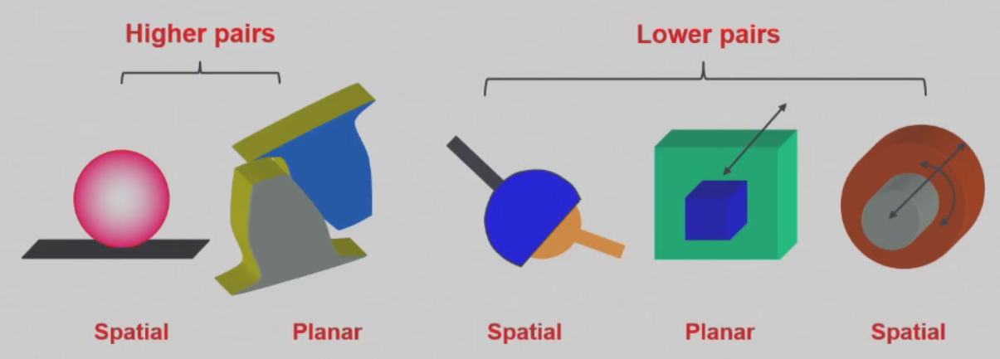

# 1.MECHANISMS OFARTICULATED ROBOTS

## 运动副

根据接触的形式和相对运动特性，运动副可以分为高副（Higher pairs）和低副（Lower pairs），并可以进一步分类为空间副（Spatial pairs）和平面副（Planar pairs）。

### 高副 (Higher Pairs)
- **接触方式**: 点或线接触
- **示例**:
  - **空间副**: 图中的球体与平面接触，这是典型的点接触（如滚珠与轨道的接触）。
  - **平面副**: 这是线接触，两个平面相互接触的结构（例如齿轮的啮合）。

### 低副 (Lower Pairs)
- **接触方式**: 面接触
- **示例**:
  - **空间副**: 例如球形关节，可以在三维空间中自由旋转。
  - **平面副**: 两个物体表面间的滑动接触（如活塞和气缸）。

根据图中说明，运动副的相对运动可以分为：
- **平面副**: 具有平面内的相对运动。
- **空间副**: 具有空间中的相对运动。

这张图展示了不同运动副的接触特点和相对运动类型，帮助区分机械系统中的不同部件如何运动与相互作用。

### 定义
1. **可动部分的数量 (No. of movable parts)**:
   - \( n = N - 1 \)，其中 \( N \) 是总的部分数量。

2. **低副数量 (No. of lower pairs)**:
   - 记作 \( L \)，即低副的数量。

3. **高副数量 (No. of higher pairs)**:
   - 记作 \( H \)，即高副的数量。

4. **未连接部件的自由度 (DOF of un-connected links)**:
   - \( 3n \) 或 \( 3(N-1) \)。

5. **由运动副产生的约束数量 (No. of constraints from kinematic pairs)**:
   - \( 2L + H \)，其中 \( 2L \) 表示低副提供的约束数量，\( H \) 表示高副提供的约束数量。

6. **机构的自由度 (DOF of a mechanism)**:
   - 机构的自由度 \( F \) 由以下公式计算：
   \[
   F = 3n - (2L + H)
   \]
   其中，\( n \) 是可动部分的数量，\( L \) 是低副数量，\( H \) 是高副数量。

这些公式广泛用于机构设计与分析，用于确定一个机械系统能够实现的运动自由度数量。