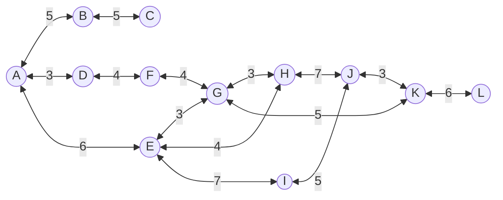
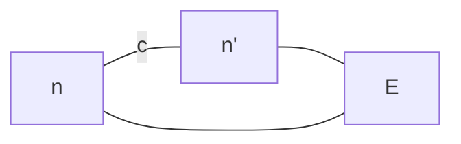

# A*搜索

!!! note ""

    评价函数和启发函数各司其职，在评价函数中考虑从起始结点到当前结点的路径代价

A*搜索的评价函数为$f(n) = g(n) + h(n)$，其中：

- $g(n)$ 为从初始结点到结点 $n$ 的实际代价，即当前最小代价
- $h(n)$ 为从结点 $n$ 到目标结点的估计代价，即启发函数




!!! note "A->K"

    ```mermaid
    graph TB
        A(((1. A))) --5--> B((B = 5 + 10 = 15))
        A --3--> D((D = 3 + 12 = 15))
        A --6--> E(((2. E = 6 + 7 = 13)))
        E --3--> G(((4. G = '6 + 3' + 5 = 14)))
        E --4--> H(((3. H = '6 + 4' + 3 = 13)))
        E --7--> I((I = '6 + 7' + 6 = 19))
        H --7--> J((J = '6 + 4 + 7' + 3 = 20))
        H --3--> L((G = '6 + 4 + 3' + 5 = 18))
        G --4--> F(( F = '6 + 3 + 4' + 8 = 21))
        G --5--> K(((5. K = '6 + 3 + 5' + 0 = 14)))
        G --3--> M((H = '6 + 3 + 3' + 3 = 15))
    ```
    A->K 的路径为 A->E->G->K，总代价为 6 + 3 + 5 = 14

    ```c
    * 初始化open_set和close_set；
    * 将起点加入open_set中，并设置优先级为0（优先级最高）；
    * 如果open_set不为空，则从open_set中选取优先级最高的节点n：
        * 如果节点n为终点，则：
            * 从终点开始逐步追踪parent节点，一直达到起点；
            * 返回找到的结果路径，算法结束；
        * 如果节点n不是终点，则：
            * 将节点n从open_set中删除，并加入close_set中；
            * 遍历节点n所有的邻近节点：
                * 如果邻近节点m在close_set中，则：
                    * 跳过，选取下一个邻近节点
                * 如果邻近节点m也不在open_set中，则：
                    * 设置节点m的parent为节点n
                    * 计算节点m的优先级
                    * 将节点m加入open_set中
    ```

> 处处最优 $\Rightarrow$ 全局最优

性能分析：A\*算法的完备性和最优性取决于搜索问题和启发函数的性质

+ 记号：
	+ $h(n)$：结点n的启发函数取值（直线距离）
	+ $g(n)$：从起始结点到结点n所对应路径的代价
	+ $f(n)$：结点n的评价函数取值
	+ $c(n,a,n')$：从结点n执行动作a到达结点n'的单步代价
	+ $h^*(n)$：从结点n出发到达终止结点的最小代价（实际距离）
+ 可容性：$\forall n:h(n)\leqslant h^*(n)$，即启发函数不会过高估计从节点$n$到终止节点所应该付出的代价（即估计代价小于等于实际代价）
+ 一致性： $h(n)\leqslant c(n,a,n')+h(n')$三角不等式



!!! note "定理1：一致 $\Rightarrow$ 可容"

	证：设最短路为$n_1\to n_2\to\cdots\to K , h(K)=0$

	$\because  \text{一致}  $

	$\therefore h(n_1)\leqslant h(n_2)+c(n_1,a_1,n_2)\leqslant h(n_3)+c(n_2,a_2,n_3)+c(n_1,a_1,n_2)$$\leqslant\cdots\leqslant c(n_1,a_1,n_2)+c(n_2,a_2,n_3)+\cdots+c(n_1,a_1,K)=h^*(n_1)$

!!! note "定理2：A\*完备性"

	如果所求解问题和启发函数满足以下条件，则A*算法是完备的：

    + 搜索树中的分支数量是有限的，即每个结点的后继结点数量是有限的
    + 单步代价的下界是一个正数
    + 启发函数有下界

!!! note "可容 $\Rightarrow$ 最优"

	证：假设A\*找到的终点为$n$，$\forall n'\in$边缘节点，$f(n)\leqslant f(n')$

	$\therefore f(n)=g(n)+h(n)=g(n)\leqslant f(n')=g(n')+h(n')\leqslant g(n')+h^*(n')$

	$\therefore$ 为最短路

