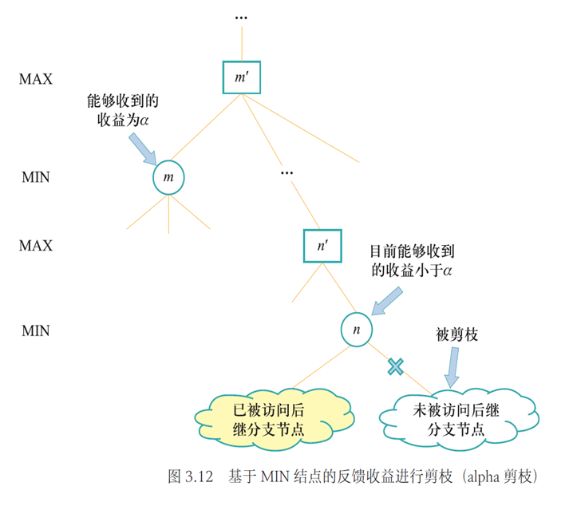
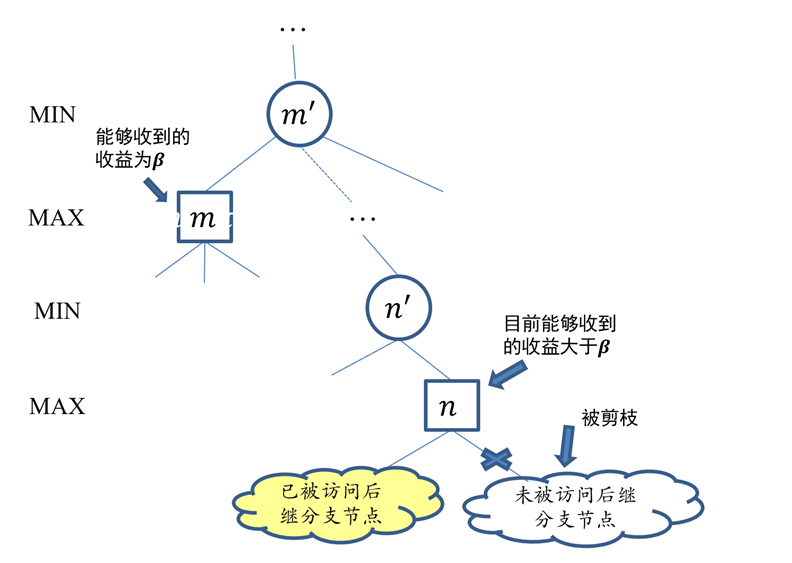

# alpha-beta 剪枝

剪枝方法：在最小最大搜索中可减少被搜索的结点数

- 如果搜索树极大，则最大最小搜索的开销巨大，无法在合理时间内返回结果
- Alpha-Beta 剪枝算法的思想如下：

    

    $$
    \begin{align*}
    \mathrm{minimax}(s_0) &= \max(\min(3, 9, 10), \min(2, x, y), \min(10, 5, 1))\\
    &= \max(3, \min(2, x, y), 1)
    \end{align*}
    $$

    - 上式中 $\min(2, x, y)$ 肯定小于 2，而外面一层求最大值又有 3 比它大
    - 所以就没有必要去搜索 $x, y$ 对应的子树得到具体的 $x, y$ 值，可以将这两个动作剪枝掉

+ 基于MIN节点反馈收益进行剪枝
    

+ 基于MAX节点反馈收益进行剪枝
    

```
AlphaBetaDecision: (MAX最优动作a*)
    v,a* ← MaxValue(s,-∞, +∞)
```

```
MaxValue:
    if terminal_test(s) then return utility(s), null
    v ← -∞
    a* ← null
    foreach a∈actions(s) do
        v', a' ← MinValue(result(s,a), α, β)
        if v' > v then
            v' ← v
            a* ← a
        end
    α ← max(α, v)
    if α ≥ β then return v, a*
end
```

```
MinValue:
    if terminal_test(s) then return utility(s), null
    v ← +∞
    a* ← null
    foreach a∈actions(s) do
        v', a' ← MaxValue(result(s,a), α, β)
        if v' < v then
            v' ← v
            a* ← a
        end
    β ← min(β, v)
    if α ≥ β then return v, a*
end
```

原理：


以当前节点为MAX层为例，则pa为MIN层，当前将选择小于$\beta$的节点，ch为MIN层。

每次根据新计算出的ch节点值更新该层的$\alpha$值（$\alpha$在更新过程中不减），更新完毕后立即检查是否符合$\beta$值的要求，即$\alpha<\beta$，即该节点仍具有为pa提供更小答案的潜力；否则，若$\alpha\geqslant\beta$，由于$\alpha$不减，将无法提供更小答案，将被父节点遗弃，此时未扩展完的子节点将被剪枝。

简而言之，每个节点从子节点进行答案的更新，又受到父节点的监督；当两种策略发生交叠时进行剪枝。

- $\alpha$-$\beta$ 剪枝算法是对最大最小搜索的一种优化
- 该算法通过维护两个值 $\alpha$ 和 $\beta$ 来减少搜索的分支数
- $\alpha$ 是 MAX 玩家的最佳选择，$\beta$ 是 MIN 玩家的最佳选择
- 根结点（MAX结点）的𝛼值和𝛽值分别被初始化为−∞和+∞。
- 随着搜索算法不断被执行，每个结点的𝛼值和𝛽值不断被更新。大体来说，每个结点的[𝛼,𝛽]从其父结点提供的初始值开始，取值按照如下形式变化：𝛼逐渐增加、𝛽逐渐减少。不难验证，如果一个结点的𝛼值和𝛽值满足𝛼>𝛽的条件，则该结点尚未被访问的后续结点就会被剪枝，因而不会被智能体访问。


