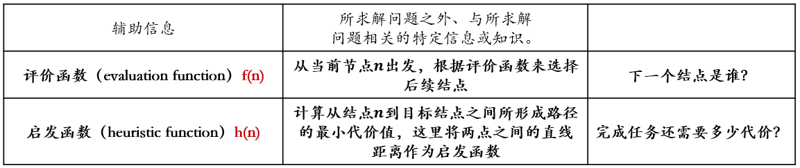

#  搜索基本概念

## 搜索的形式化描述

!!! note "状态（state）"
    广义来说**状态**是对搜索算法和搜索环境**当前所处情形的描述信息**。搜索算法**刚开始**所在状态被称为**初始状态**，**完成任务**时所在状态被称为**终止状态**。

!!! note "动作（ action）"
    为了完成最短路径的探索，算法需要不断从一个状态转移到下一个状态。算法**从一个状态转移到另外一个状态所采取的行为**被称为**动作**。

!!! note "状态转移（state transition）"
    算法选择了一个动作之后，其所处**状态**也会**发生相应变化**，这个过程被称为**状态转移**。

!!! note "路径（path）和代价（cost）"
    以任何一个状态为起点，搜索算法通过执行一系列动作后，将会在**不同状态之间不断转移**。将这个过程中**经历的状态记录下来**，可以得到一个**状态序列**，这个状态序列被称为一条**路径**。每条路径对应一个**代价**。如果一条路径对应的状态序列长度为2，那么这条路径的代价也被称为单步代价。一般假定单步代价取值为非负。

!!! note "目标测试（goal test）"
    目标测试函数 goal_test(s) 用于**判断状态 s 是否为目标状态**。目标测试通过意味着搜索算法完成，但是搜索算法完成并不意味着算法已经找到了最短路径。在最短路径搜索中，搜索算法会不断从当前结点的邻接节点中选择下一个结点，如此循环，直到找到一条从初始状态到终止状态的路径为止。当然，寻找所得的路径（从初始状态到终止状态）是否满足“路径最短”这一约束条件，还需要另行判断。

!!! note "搜索过程可视为搜索树的构建"

    可以用一棵**树**来**记录算法所探索的路径**，这样一棵树被称为**搜索树**，树中每个**结点**用一个**状态**标记。搜索树记录了从根结点出发目前所有探索过的路径。搜索算法可以被看成是一个构建搜索树的过程，从根结点（初始状态）开始，不断展开每个结点的后继结点，直到某个结点通过了目标测试。

## 搜索算法的评测标准

评价指标：

+ 完备性：当问题存在解时，算法是否能保证找到一个解，虽然这个解可能不是最优解
+ 最优性：搜索算法是否能保证找到的第一个解是最优解
+ 时间复杂度：找到一个搜索路径所需的时间 - 通过扩展的结点数量衡量
+ 空间复杂度：算法运行时所需的内存空间 - 通过同时记录的结点数量衡量

复杂度相关变量：

+ b：分支因子，即搜索树中每个结点最大的分支数目
+ d：根结点到最浅的目标结点的路径长度
+ m：搜索树中路径的最大可能长度
+ n：状态空间中状态的数量

搜索框架：

```vb
TreeSearch
	F ← {根节点}
	while F ≠ Φ do
	n ← pick_from(F)
	F ← F - {n}
	if goal_test(n) then
		return n.path
	end
	F ← F ∪ successor_nodes(n)
end
```

- `pick_from` 决定扩展结点的顺序，`successor_nodes` 决定哪些节点可被放入边缘集合（fringe set，也叫开表，open list）以在后面扩展（expand）
- 每次从边缘集合中取出最上层（最浅）的结点时是**广度优先搜索**（breadth first search，BFS）
- 每次从边缘集合中取出最下层（最深）的结点时是**深度优先搜索**（depth first search，DFS）
- 放弃扩展部分结点的做法称为**剪枝**（pruning）

## 启发函数和评价函数

- 利用一些能够辅助算法做出决策的额外信息的搜索算法称为**启发式搜索**（heuristic search），或**有信息搜索**（informed search）
- 提供的这些辅助信息称为**启发信息**

- 启发信息通常形式化为一个关于结点的函数 $h(n)$，其用于估计结点 $n$ 距离**达到目标**还需付出多少代价，这个函数称为**启发函数**（heuristic function）
    - 启发函数通常是非负的
    - 常见用法是用来更改前面的 pick_from 函数来规定挑选结点的顺序
- 对于任意结点 $n$，决定了搜索算法扩展结点 $n$ 的优先度的函数 $f(n)$ 称为**评价函数**（evaluation function）
    - 评价函数值越小，被挑选的优先级越高
    - 深度优先搜索中 $f(n)$ 可被定义为该结点深度的倒数
    - 广度优先搜索中 $f(n)$ 可被定义为该结点深度