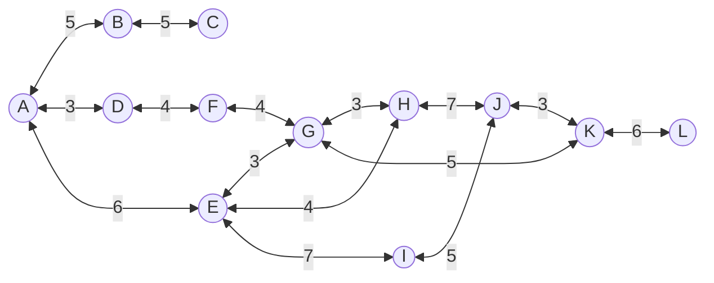

# 贪婪最佳优先搜索

贪婪最佳优先搜索，即 greedy best-first search，GBFS

- 优先扩展距离目标近的结点，即令 $f(n) = h(n)$
- 不排除环路的贪婪最佳优先搜索算法是不完备的
- 排除环路的贪婪最佳优先搜索是完备的，但不一定最优
- 最坏情况下的时间复杂度和空间复杂度均为 $O(b^m)$
    - $b$ 为分支因子（每个结点最大的分支数目）
    - $m$ 为最大深度，也就是搜索树中路径的最大可能长度




!!! note "A->K"

    ```mermaid
    graph TB
        A(((A))) ---> B((B = 10 ))
        A ---> D((D = 12 ))
        A ---> E(((E = 7 )))
        E ---> G((G =  5))
        E ---> H(((H =  3)))
        E ---> I((I =  6))
        H ---> J(((J =  3)))
        H ---> L((G =  5))
        J ---> K(((K =  0)))
    ```
    A->K 的路径为 A->E->H->J->K，总代价为 6 + 4 + 7 + 3 = 20
