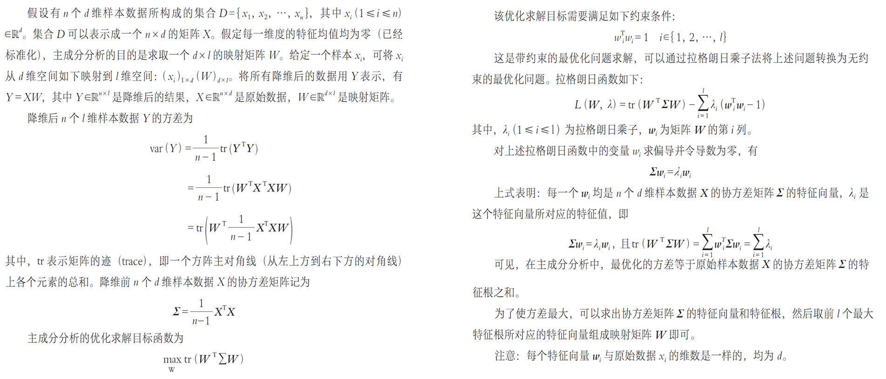

# PCA | 主成分分析

思路：通过分析找到数据特征的主要成分，使用这些主要成分来代替原始数据；将$d$维特征数据映射到$l$维空间，去除数据的冗余性，将原始数据向这些数据方差最大的方向进行投影
> 主成分分析要求“降维后的结果要保持原始数据的原有结构”（要求方差结构不变）

方差：样本数据的波动程度，数值上等于各个数据与样本均值之差的平方和之平均数

$$
\text{var}(X)=\dfrac{1}{n-1}\sum_{i=1}^n(x_i-u)^2
$$

协方差：衡量两个变量之间的相关度

$$
\text{cov}(X,Y)=\dfrac{1}{n-1}\sum_{i=1}^n(x_i-E(X))(y_i-E(Y))
$$
> $\text{cov}(X,Y)$为正：正相关，为负：负相关，为0：不相关

皮尔逊相关系数：

$$
\text{corr}(X,Y)=\dfrac{\text{cov}(X,Y)}{\sqrt{\text{var}(X)\text{var}(Y)}}=\dfrac{\text{cov}(X,Y)}{\sigma_x\sigma_y}
$$

!!! note "推导"

    保持方差：向投影后方差最大的方向投影

    假设有$n$个$d$维样本数据所构成的集合$D=\set{x_1,\cdots,x_n}$，其中$x_i(1\leqslant i\leqslant n)\in\mathbb{R}^d$，表示为$X_{n\times d}$；投影目标为降维数据$Y\in \mathbb R^{n\times l}$，求映射矩阵$W\in\mathbb R^{d\times l}\ s.t.$
    $$
    Y=XW
    $$
    降维后$Y$方差为
    $$
    \text{var}(Y)=\dfrac{1}{n-1}\text{tr}(Y^\mathsf TY)=\text{tr}(W^\mathsf T\dfrac{1}{n-1}X^\mathsf TXW)
    $$
    记降维前样本数据$X$协方差矩阵为
    $$
    \Sigma=\dfrac{1}{n-1}X^\mathsf TX
    $$
    则优化目标
    $$
    \max\limits_{W}\text{tr}(W^\mathsf T\Sigma W)
    $$
    约束：标准化$w_i^\mathsf Tw_i=1\quad i\in\set{1,\cdots,l}$

    优化方法：Lagrange乘子法
    $$
    L(W,\lambda)=\text{tr}(W^\mathsf T\Sigma W)-\sum_{i=1}^l\lambda_i(w_i^\mathsf Tw_i-1)
    $$
    $$
    \dfrac{\partial L}{\partial w_i}=0\Rightarrow \Sigma w_i=\lambda_iw_i
    $$
    即$w_i$为 $\Sigma$ 的特征向量，$\lambda_i$为相应特征值.

    

步骤：

+ 对于每个样本数据$x_i$进行中心化处理：$x_i=x_i-\mu,\mu=\dfrac{1}{n}\sum x_i$
+ 计算原始样本数据的协方差矩阵：$\Sigma=\dfrac{1}{n-1}X^\mathsf TX$
+ 对协方差矩阵$\Sigma$进行特征值分解，对所得特征根进行排序：$\lambda_1\geqslant\lambda_2\geqslant \cdots \geqslant\lambda_l$
+ 取前$l$个最大特征根所对应的特征向量$w_1,\cdots,w_l$组成映射矩阵

应用：[特征人脸法](./特征人脸法.md)