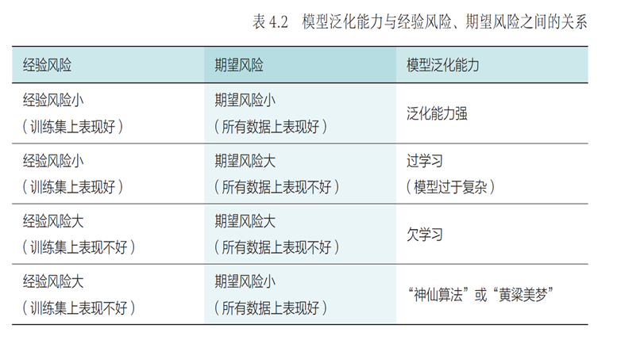

# 机器学习基本概念

## 机器学习

+ 概念：机器学习通过对数据的优化学习，==建立能够刻画数据中所蕴含语义概念或分布结构等信息的模型==
+ 性质：数据驱动学习
+ 分类：按数据利用角度
	+ 有监督学习：
		监督学习算法从假设空间 (hypothesis space) 学习得到一个最优映射函数 $f$（又称决策函数），映射函数 $f$ 将输入数据映射到语义标注空间，实现数据的分类和识别
		+ 例：[回归分析](./回归分析.md)， [决策树](./k均值聚类.md)
		+ 特征降维：[LDA](./LDA.md)
	+ 无监督学习：
		无监督学习是直接从**无标签数据**$\set{x_i,i=1,⋯,n}$出发学习映射函数
		+ 例：[k均值聚类](./k均值聚类.md)
		+ 特征降维：[PCA](./PCA.md)
	+ 半监督学习：
		半监督学习在学习映射函数的过程中使用的一部分数据有标签，一部分数据没有标签

## 模型评估

+ 数据：
    + 训练集：在训练集上完成模型参数优化
    + 验证集：在训练集上训练模型的同时会在验证集上对模型进行评估，以便得到最佳参数
    + 测试集：最后在测试集上进行测试，将测试结果作为模型性能的最终结果
+ 问题：“没有免费午餐定理”：任何一个机器学习模型如果在一些训练集以外的样本误差小(off-training set error)，那么必然在另外一些训练集以外的样本上表现欠佳，任何模型在平均意义上而言其性能都是一样的，即没有放之四海而皆准的最好算法
+ 量化手段：损失函数，在训练过程中希望映射函数在训练集上的累加差异最小，即$\min\sum\limits_{i=1}^nLoss(f(x_i),y_i)$
    + 0-1损失函数：$Loss(y_i,f(x_i))=\left\{\begin{array}{ll}1,&f(x_i)\not=y_i,\\0,&f(x_i)=y_i.\end{array}\right.$
    + 平方损失函数：$Loss(y_i,f(x_i))=(y_i-f(x_i))^2$
    + 绝对损失函数：$Loss(y_i,f(x_i))=|y_i-f(x_i)|$
    + 对数似然函数：$Loss(y_i,P(y_i|x_i))=-\log P(y_i|x_i)$
+ 性能度量：正例P，负例N，真正例TP，假正例FP，真反例TN，假反例FN
    + 衡量标准：
    	+ 准去率：ACC = $\dfrac{\text{TP+TN}}{\text{P+N}}$
    	+ 错误率：errRate = 1 - ACC = $\dfrac{\text{FP+FN}}{\text{P+N}}$
    	+ 精确率（查准率）：precision = $\dfrac{\text{TP}}{\text{TP+FP}}$，被模型预测为正例的样本中实际为正例的比例。
    	+ 召回率（查全率）：recall = $\dfrac{\text{TP}}{\text{TP+FN}}$，所有正例样本中被模型预测为正例的比例。
    + 问题：精确率与召回率矛盾
    + 解决：综合分类率：F1-score = $\dfrac{2}{\dfrac{1}{\text{precision}}+\dfrac{1}{\text{recall}}}$

+ 泛化能力：在机器学习中，需要保证模型在训练集上所取得的性能与在测试集上所取得的性能保持一致，即模型具有泛化能力
	
	+ 经验风险：$R_{\text{emp}}=\dfrac{1}{n}\sum\limits_{i=1}^nLoss(y_i,f(x_i))$，在训练集上所产生的损失
	+ 期望风险：$R=\int\limits_{x\times y}Loss(y,f(x))P(x,y)\text{d}x\text{d}y$，如果知道某一任务包含的所有数据，则可以从所有数据中计算模型产生的损失。
	+ 关系：期望风险 $\not=$ 经验风险，$R\leqslant R_{\text{emp}}+\text{err}$，其中err取值与模型复杂程度和训练集样本数目有关
	+ 优化目标：经验风险最小化（==并非模型复杂度越大越好==）
	+ 过学习(overfitting)：在模型训练过程中，如果使用同一批训练数据反复训练，模型会变得越来越复杂，虽然经验风险$R_{\text{emp}}$会降低，但是 $err$ 取值会越大，导致期望风险$R$增加
	+ 解决：降低复杂度$\dfrac{1}{n}\sum_{i=1}^nLoss(y_i,f(x_i))+\lambda J(f)$，$J(f)$为正则化因子（惩罚因子），防止结构过于复杂
+ 参数优化：
	+ 频率学派：最大似然估计(MLE)：频率是概率的经验基础，概率表示的是事件发生频率的极限值；通过调整模型参数使得模型能够最大化样本情况出现的概率
	+ 贝叶斯学派：最大后验估计(MAP)：事件发生的频率既与当前观测数据有关，又与对该事件已获得的历史先验知识有关；对模型参数优化学习的结果就是似然概率（模型参数产生数据的概率）与先验概率（没有任何实验数据时对模型参数的经验判断）乘积最大，最大化在给定数据样本的情况下模型参数的后验概率
