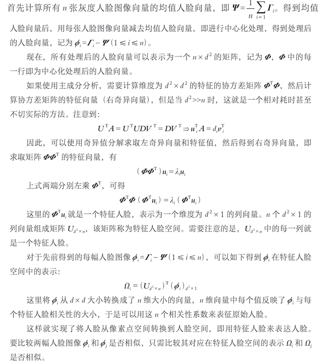

# 特征人脸法

定义：特征人脸是基于外观的人脸识别方法，其目的是捕捉人脸图像集合中的特征信息，并使用该信息对各个人脸图像进行编码和比较。

在特征维度较高的情况下，主成分分析算法暴力求解特征向量是一个耗时操作。这里介绍一种新的矩阵分解方法——奇异值分解（singular value decomposition，SVD）来实现主成分分析，对原始数据进行降维。

## 奇异值分解

问题：在特征维度较高的情况下，主成分分析算法暴力求解特征向量是一个耗时操作

结论：$A=UDV^\mathsf T,UU^\mathsf T=VV^\mathsf T=I$，$U$为$AA^\mathsf T$所有特征向量构成的矩阵，$V$为$A^\mathsf TA$所有特征向量构成的矩阵，$D$为对角矩阵，对角线元素为$A$的奇异值

步骤：

+ 去中心化：计算均值人脸向量$\Psi=\dfrac{1}{n}\sum_{i=1}^n\Gamma_i$，记$\Phi_i=\Gamma_i-\Psi(1\leqslant i\leqslant n)$，得到所有人脸向量$\Psi_{n\times d^2}$
+ 计算特征值：利用奇异值分解计算$\Phi\Phi^\mathsf T$特征向量；得到特征矩阵$U_{d^2\times n}$
+ 特征映射：$\Omega_i=(U_{d^2\times n})^\mathsf T(\Phi_i)_{d^2\times1}$

