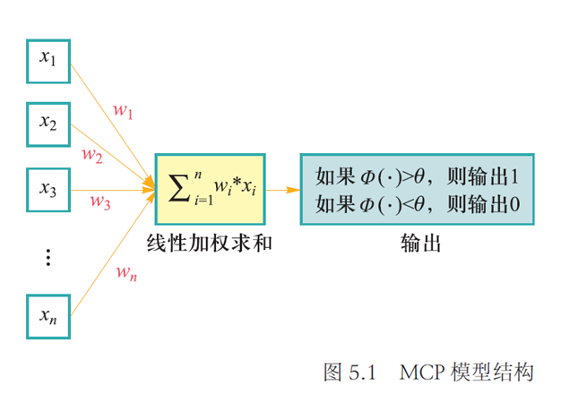
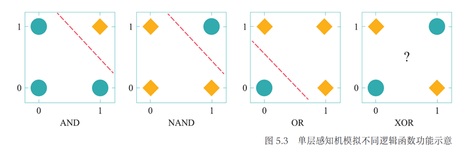
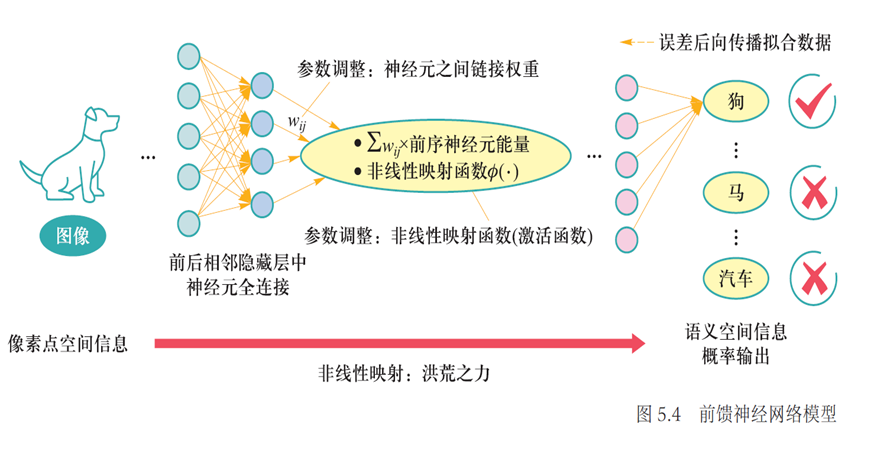

# 神经网络概述

## 历史

+ 神经网络基本单元：MCP神经元 —— 我们在科学史上第一次知道了我们是怎么知道的
+ 神经元因何链接：赫布理论：神经元之间持续重复经验刺激可导致突触传递效能增加 - 神经元之间突触的强弱变化是学习与记忆的生理学基础
+ 神经元链接成”网“：感知机模型 —— 感知机模型被誉为 “Electronic 'Brain' Teaches Itself（能自学的电脑）”
+ 神经元之间刺激可层层递进学习：误差后向传播 —— 以数据驱动方式来根据输出误差自动优化神经网络参数成为可能
+ 逐层抽象、层层递进：深度学习 —— 有别于分段式学习，端到端(end to end)的深度学习框架建立
+ 引发AI第三次崛起：语言大模型 —— 从造人和造脑到更通用人工智能

## 神经元

+ 神经元：MCP模型
    + 性质：具有兴奋与抑制两种状态
    + 结构：$y=\Phi(\sum_{i=1}^nw_ix_i)$
        
+ 概念：全连接
+ 性质：
    + 层层递进、逐层抽象
    + 非线映射
    + 误差反馈调优

## 感知机

+ 加权求和，累加偏置：
$$
z=w_1x_1+\cdots+b
$$
+ 传入激活函数，得到$\phi(z)$

感知机可模拟逻辑与(AND)、逻辑与非(NAND)和逻辑或(OR)等线性可分函数，但是无法完成逻辑异或（XOR）这一非线性可分逻辑函数任务

## 前馈神经网络

在感知机模型中增加若干隐藏层，增强神经网络的非线性表达能力，就会让神经网络具有更强的拟合能力。因此，由**多个隐藏层**构成的**多层感知机**被提出，这也被称为**前馈神经网络**。

前馈神经网络**由输入层、输出层和若干隐藏层**构成。网络中各个隐藏层中神经元可接收相邻前序隐藏层中所有神经元传递而来的信息，经过加工处理后将信息输出给相邻后续隐藏层中所有神经元。

前馈神经网络中相邻层所包含的神经元之间通常使用“**全连接**”方式进行连接。

!!! note ""

    **层层递进、逐层抽象**：明暗幅度的像素点被映射为高层语义对象的概率值。
    
    **非线性映射**：恩利克·费米（Enrico Fermi）曾经说过，“圣经中并没有说过一切大自然的定律都可以用线性方程来表示”，亿万个神经元所组成的神经网络就可实现将输入数据将神经网络用于分类任务，将输入数据（如图像、文本和听觉等信息）从一个空间（如像素点空间）映射到另外一个空间（如文本单词空间等），这一过程就是一个复杂的非线性变换。
    
    **误差反馈调优**：误差后向传播算法会将误差（由损失函数定义）由输出端由后向前传播，逐层去更新神经元链接权重和非线性映射函数等参数，使得神经网络模型拟合数据（data fitting），让神经元之间记住这种刺激或者强化信息流通路，打通“任督二脉”，从而在输入数据和输出结果之间建立关联。
    

### 激活函数

+ sigmoid：$f(x)=\dfrac{1}{1+e^{-x}}\quad f'(x)=f(x)(1-f(x))$

    !!! note ""
        优点：
        1. 概率形式输出。sigmoid函数值域为(0，1)，因此Sigmoid函数的输出可视为概率值；
        2. 单调递增。Sigmoid函数对输入𝑥取值范围没有限制，但当𝑥大于一定值后，函数输出无限趋近于1，而小于一定数值后，函数输出无限趋近于0。特别地，当𝑥=0 时，函数输出为0.5；
        3. 非线性变化。𝑥取值在0附近时，函数输出值的变化幅度比较大（函数值变化陡峭），意味着函数在0附近容易被激活且是非线性变化。当𝑥取值很大或很小时，函数输出值几乎不变，这是基于概率的一种认识与需要。

        缺点：
        
        - 由于 $0<𝑓(𝑥)<1$ 和$0<1−𝑓(𝑥)<1$，因此Sigmoid函数的导数$𝑓(𝑥)(1−𝑓(𝑥))$小于1，在使用反向传播算法更新参数过程中易出现导数过于接近于0的情况，即梯度消失（vanishing gradient）的问题，并且这个问题会随着网络的深度增加而变得愈发严重。
        
+ tanh：$f(x)=\dfrac{1-e^{-2x}}{1+e^{-2x}}\quad f'(x)=1-f(x)^2$
+ ReLU：$f(x)=\left\{\begin{array}{ll}0,&x\leqslant0,\\x,&x>0.\end{array}\right.$
    
    !!! note ""
        当输入 $𝑥≥0$ 时，ReLU的导数为常数，这样可有效缓解梯度消失这一问题。当 $𝑥<0$ 时， ReLU的梯度总是0，导致神经网络中若干参数激活值为0，即参与分类等任务神经元数目稀缺，这种稀疏性可以在一定程度上克服机器学习中经常出现的过拟合现象。然而，当 $x < 0$ 时，ReLU梯度为0也导致神经元“死亡”，即神经元对应权重永远不会更新。为了解决这个问题，可以使用其他激活函数，如 Leaky ReLU 或Parametric ReLU，它们在 $x < 0$ 时梯度取值非零。
        
+ softmax：$y_i=\text{softmax}(x_i)=\dfrac{e^{x_i}}{\sum_{j=1}^ke^{x_j}}$
    + 应用：用于分类问题，输出值转概率

