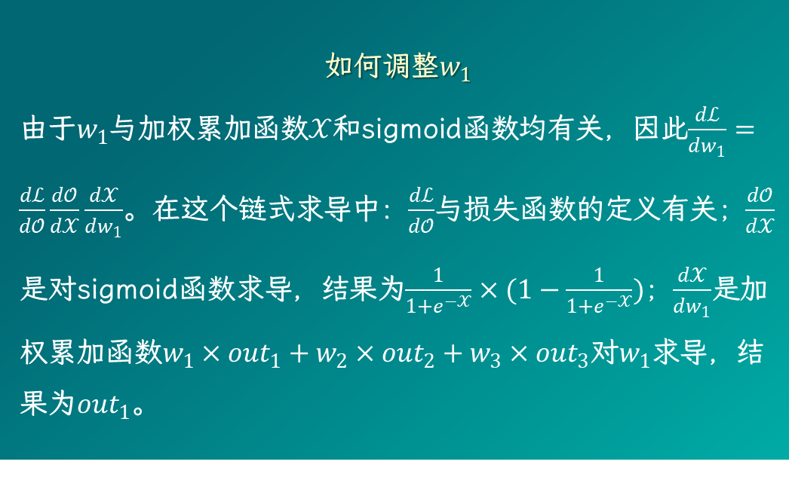
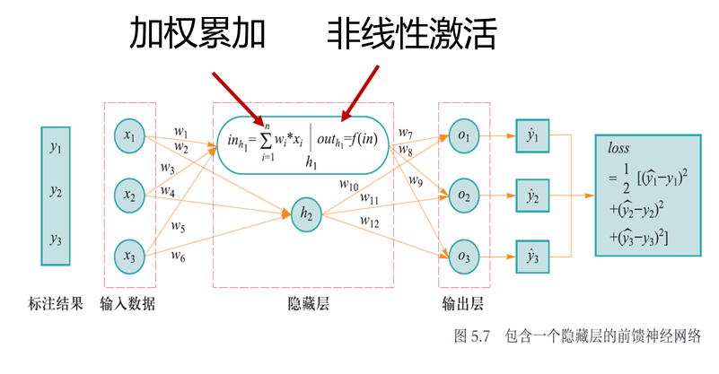

# 神经网络参数优化

目的：使得神经网络能够将给定输入数据映射到所期望的输出语义空间，完成分类识别等任务

本质：神经网络参数优化是一个**监督学习**的过程

操作：模型利用反向传播算法将损失函数计算所得误差从输出端出发，**由后向前**传递给神经网络中每个单元，然后通过**梯度下降算法**对神经网络中的参数进行更新；当迭代达到一定轮次或**准确率达到一定水平**时，则可认为模型参数已被优化完毕

## 损失函数

损失函数（loss function）又称为代价函数（cost function），用来计算模型预测值与真实值之间的误差。

+ 均方误差损失函数：$\text{MSE}=\dfrac{1}{n}\sum_{i=1}^n(y_i-\hat y_i)^2$
+ 交叉熵损失函数：$H(y_i,\hat y_i)=-y_i\times\log_2\hat y_i$

	!!! note ""
		“熵”被用来表示热力学系统所呈现的无序程度。香农将这一概念引入信息论领域，提出了“信息熵”概念，通过对数函数来测量信息的不确定性。

		交叉熵（cross entropy）是信息论中的重要概念，主要用来度量两个概率分布间的差异。$𝑦_𝑖$ 是样本 $𝑥_𝑖$ 分类的真实概率、$\hat{𝑦}_𝑖$是模型预测概率，通过 $\hat{𝑦}_𝑖$ 来表示 $𝑦_𝑖$ 的交叉熵可如上计算。
		
		交叉熵刻画了两个概率分布之间的距离，旨在描绘通过概率分布 $\hat{𝑦}_𝑖$ 来表达概率分布𝑦_𝑖的困难程度。根据公式不难理解，两个概率分布 $𝑦_𝑖$ 和 $\hat{𝑦}_𝑖$ 越接近，交叉熵越小。也就是说，预测类别分布概率与实际类别分布概率之间的差距越小，交叉熵就越小。

## 梯度下降

梯度下降是一种使损失函数最小化的方法。

+ 梯度：$\dfrac{\text{d}f(x)}{\text{d}x}=\lim\limits_{h\to0}\dfrac{f(x+h)-f(x)}{h}\quad f(x+\Delta x)-f(x)\approx(\nabla f(x))^\mathsf T\Delta x$
+ 操作：$x\leftarrow x-\eta\nabla f(x)$
+ 方法：
	+ 批量梯度下降（batch gradient descent）：在整个训练集上计算损失误差（数据集较大导致内存不足）
	+ 随机梯度下降（stochastic gradient descent）：使用每个数据计算损失误差（波动大收敛慢；可跳出局部最优）
	+ 小批量梯度下降（mini-batch gradient descent）：选取训练集中小批量样本计算损失误差ℒ(θ)，根据每一批量样本所得到的累加误差来更新参数，这样可保证训练过程更稳定，而且采用批量训练方法也可利用矩阵计算优势，因此其成为目前最常用的梯度下降算法

## 误差反向传播

利用损失函数来计算模型预测结果与真实结果之间误差以优化调整模型参数，这一优化调整机制是从输出端向输入端，由后向前递进进行。

### 例子 - 三类分类

给定一个包含输入层、一层隐藏层和输出层的多层感知机（如图5.7所示），其中隐藏层由两个神经元构成。这里为了简化介绍过程，因此只使用了一层隐藏层。

网络使用Sigmoid函数作为神经元的激活函数，使用均方损失函数来计算网络输出值与实际值之间的误差。

在图5.7中，每个神经元完成如下两项任务：

1. 对相邻前序层所传递信息进行线性加权累加；
2. 对加权累加结果进行非线性变换。

假设样本数据输入为 $(𝑥_1, 𝑥_2, 𝑥_3)$，其标注信息为$(𝑦_1, 𝑦_2,𝑦_3)$。在三类分类问题中，对于输入数据$(𝑥_1, 𝑥_2, 𝑥_3)$，$𝑦_1$ 、$𝑦_2$ 和 $𝑦_3$ 中只有一个取值为1、其余两个取值为0。

一旦神经网络在当前参数下给出了预测结果 $(\hat{𝑦_1}, \hat{𝑦_2}, \hat{𝑦_3})$后，通过均方误差损失函数来计算模型预测值与真实值$(𝑦_1,𝑦_2,𝑦_3)$之间误差，记为$𝑙𝑜𝑠𝑠=\frac12 ∑_{𝑖=1}^3(\hat{𝑦_𝑖}−𝑦_𝑖)^2 $。

接下来通过梯度下降和误差反向传播方法，沿着损失函数梯度的反方向来更改参数变量取值，使得损失函数快速下降到其最小值。由于损失函数对$𝑤_7\sim 𝑤_{12}$的偏导计算相似，在此以$𝑤_7$为例来介绍如何更新$𝑤_7$这一参数取值。记损失函数为$ℒ(𝑤)$，$ℒ(𝑤)=\frac12 ∑_{𝑖=1}^3(\hat{𝑦_𝑖}−𝑦_𝑖)^2 $。

在得到$𝑤_7\sim 𝑤_{12}$相对于损失函数的偏导结果后，利用链式求导法则，可计算得到损失函数相对于$𝑤_1\sim 𝑤_6$的偏导结果。

在计算得到所有参数相对于损失函数ℒ的偏导结果后，利用梯度下降算法，通过 $𝑤_𝑖^{𝑛𝑒𝑤}= 𝑤_𝑖  − 𝜂 ∗ 𝛿_𝑖$ 来更新参数取值。然后不断迭代，直至模型参数收敛，此时损失函数减少到其最小值。
