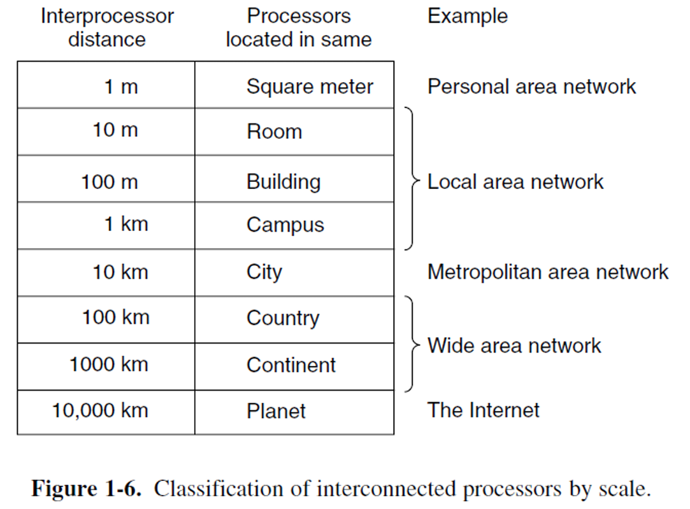
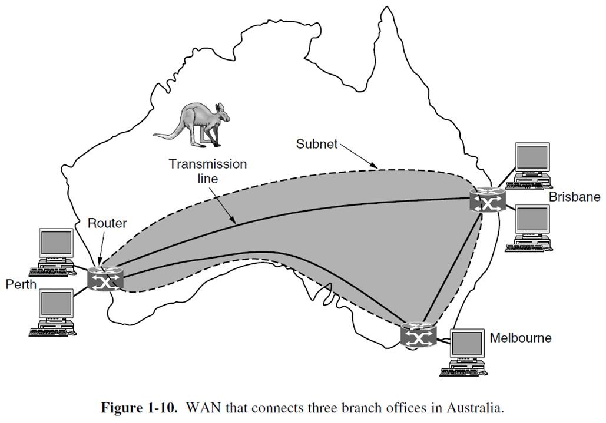
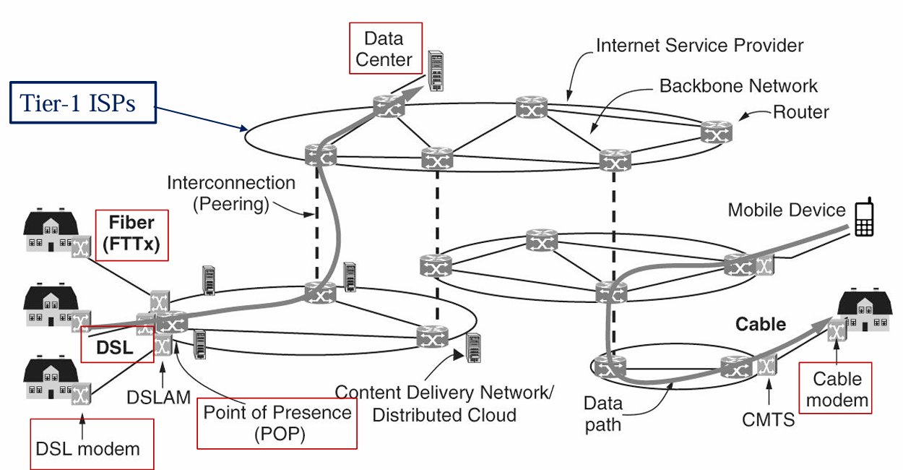
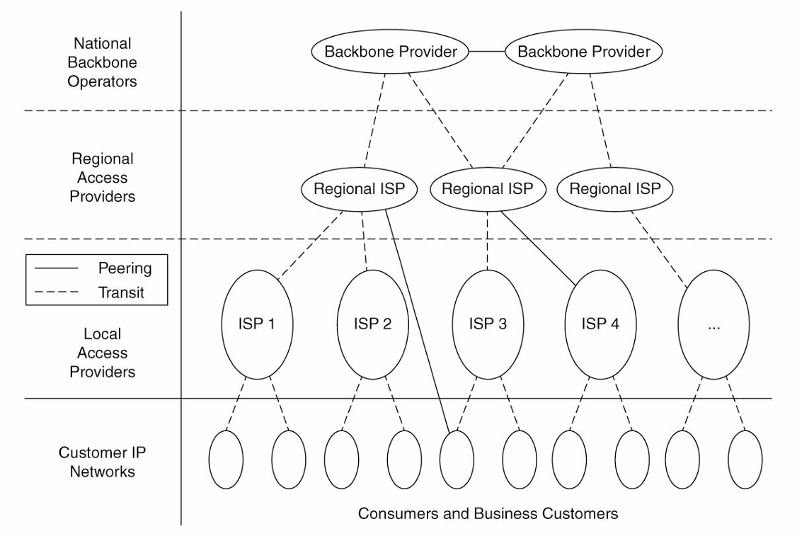
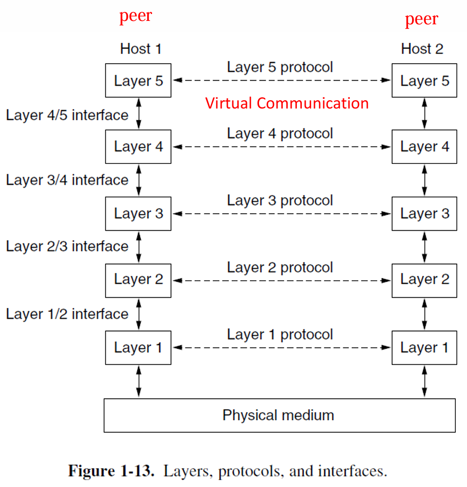
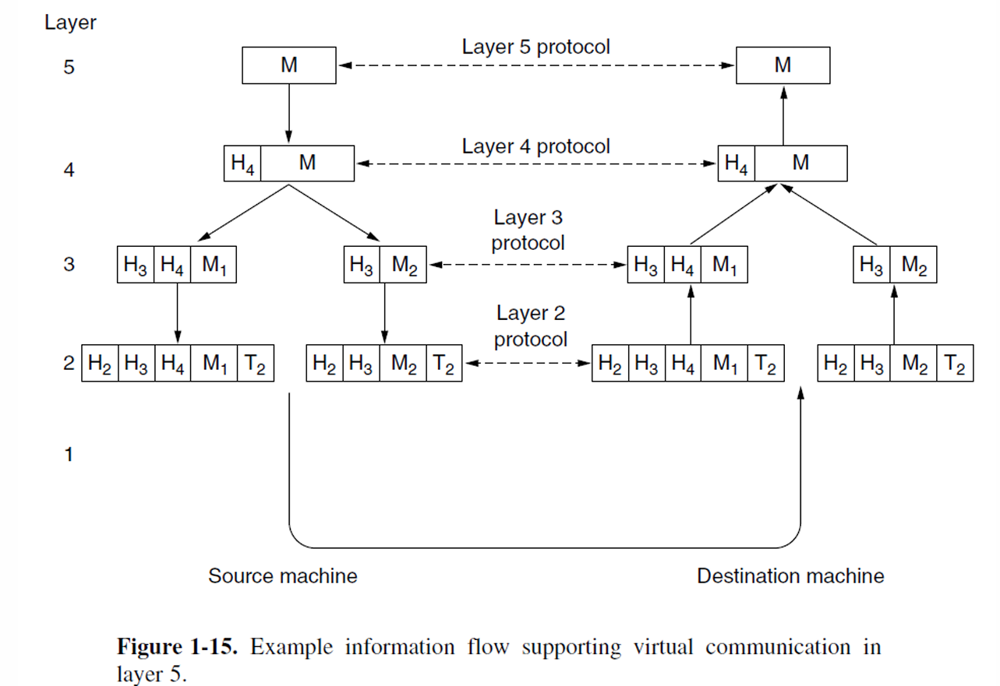
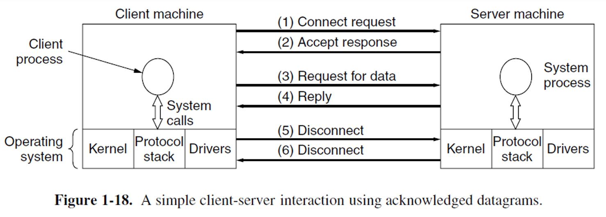
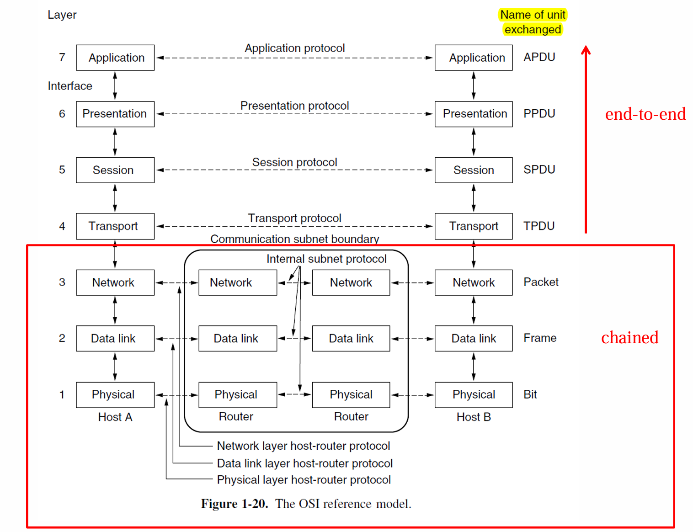
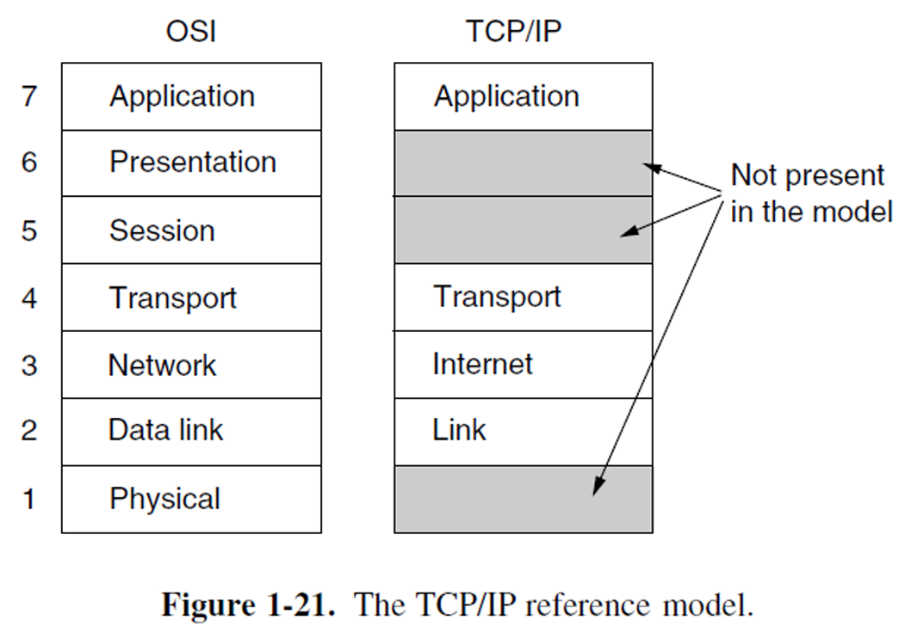
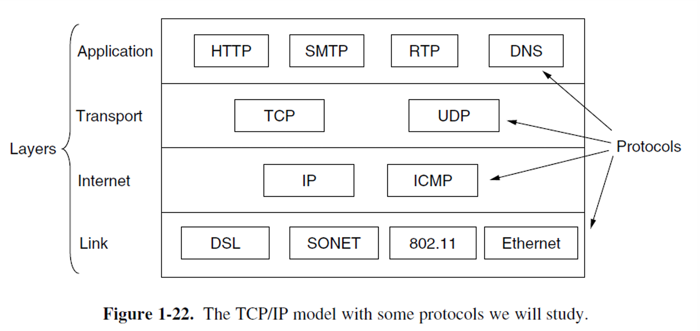

# Lec01

!!! note  ""

    - Uses of Computer Networks | 计算机网络的用途
    - Types of Computer Networks | 计算机网络的类型
    - **Network Technology: from local to global** | 网络技术：从局域到全球
    - **Examples of Networks** | 网络示例
    - **Network Protocols** | 网络协议
    - **Reference Models** | 参考模型
    - **Standardization** | 标准化
    - Policy, Legal and Social Issues | 政策、法律与社会问题
    - **Metric Units** | 计量单位

## Types of Computer Networks

- 移动和宽带接入网络 (Mobile and broadband access networks)
    - 用于访问互联网的网络
- 数据中心网络 (Data-center networks)
    - 用于存储数据和应用程序的网络
- 传输网络 (Transit networks)
    - 连接接入网络和数据中心的网络
- 企业网络 (Enterprise networks)
    - 在校园、办公楼或其他组织中使用的网络

### 宽带接入网络 | Broadband Access Networks

- 家庭网络使用 (Home network use)
    - 听音乐、看照片、制作音乐、照片和视频
    - 获取信息、与他人沟通、购买产品和服务
- 梅特卡夫定律 (Metcalfe's law)
    - 解释了互联网的巨大受欢迎度源于其规模
- 宽带接入网络 (Broadband access networks)
    - 使用铜线 (copper)、同轴电缆 (coaxial cable) 或光纤 (optical fiber) 连接到家庭
    - 宽带互联网速度：每秒千兆 (gigabit per second) 到个人家庭

### 移动和无线接入网络 | Mobile and Wireless Access Networks

- 无线热点 (Wireless hotspots) 基于 802.11 标准 (802.11 standard)
- 无线网络 (Wireless networking) 和移动计算 (mobile computing)
    - 相关但不完全相同 (Related but not identical)
- 智能手机 (Smartphones) 结合了移动电话 (mobile phones) 和移动计算机 (mobile computers) 的特性
- 短信 (Text messaging) 或发送短信息 (texting short message)
- 全球定位系统 (GPS - Global Positioning System)：定位设备
- 地理标记 (Geo-tagging)：用照片和视频的拍摄地点进行标注

| 无线 (Wireless) | 移动 (Mobile) | 典型应用 |
| ---------------- | ------------- | -------- |
| No               | No            | 台式计算机 (Desktop computers) |
| No               | Yes           | 笔记本电脑 (Laptop computer) |
| Yes              | No            | 网络 (Networks) |
| Yes              | Yes           | 手持计算机 (Handheld computer) |

虽然无线网络 (Wireless networking) 和移动计算 (Mobile computing) 常常相关，但它们并不完全相同 .

- 移动商务 (M-commerce) 使用移动电话 (mobile phones)
- 近场通信 (NFC - Near Field Communication)
    - 允许移动设备充当RFID智能卡 (RFID smartcard) 并与附近的读卡器进行支付交互
- 传感器网络 (Sensor networks) 使用节点 (nodes) 收集和传递有关物理世界状态的信息
    - 节点可能嵌入在常见设备中 (如汽车或手机)
    - 节点可能是小型的独立设备
    - 提供大量关于行为的数据
    - 例如：无线停车计 (wireless parking meters)

### 内容提供网络 | Content Provider Networks

- 数据中心网络 (Data-center network)
    - 从“云端” (the cloud) 提供互联网服务
    - 满足云计算 (cloud computing) 日益增长的需求
    - 在数据中心 (data center) 内部的服务器之间传输大量数据
    - 在数据中心与互联网的其余部分之间传输数据

- 数据中心网络的挑战 (Data center network challenges)
    - 网络吞吐量 (Network throughput) 和能源使用(energy usage)的扩展
    - “横截面带宽” (Cross-section bandwidth)

- 内容分发网络 (CDN - Content Delivery Network)
    - 大量服务器的集合，地理位置分布广泛，使内容靠近请求它的用户

### 传输网络 | Transit Networks

- 传输网络 (Transit network)
    - 当内容提供商 (content provider) 和互联网服务提供商 (ISP - Internet Service Provider) 之间没有直接连接时，负责在它们之间传输流量
    - 通常向ISP和内容提供商收费，以便从端到端传输流量
    - 传统上被称为骨干网络 (backbone networks)，因为它们在两个端点之间传输流量

- 两个趋势 (Two trends)
    - 内容在少数大型内容提供商中集中化
    - 个人接入 ISP 网络的覆盖范围扩大

### 企业网络 | Enterprise Networks

- 允许设备和信息的资源共享
- 虚拟专用网络 (VPNs - Virtual Private Networks)
    - 将不同地点的独立网络连接成一个逻辑网络
    - 充当员工之间的通信媒介
- 允许IP电话或网络电话 (VoIP - Voice over IP)
    - 使用互联网技术和计算机网络进行电话通信
- 允许桌面共享
    - 远程工作人员可以看到并与计算机屏幕进行交互
- 允许电子商务通信 (Electronic business communication)

## Network Technology: from local to global

对所有计算机网络的分类尚无公认的标准，但两个维度尤为重要：**传输技术**(transmission technology)和**规模**(scale)。

广泛使用的传输技术大致可分为两类——

- **广播链路**(broadcast links)（**多播**(multicasting)）。

    - **通信信道**(communication channel)由网络上的所有**机器**(machines)共享。
    - 每个**数据包**(packet)中的**地址字段**(address field)指定预期的**接收者**(recipient)。
    - **无线网络**(wireless network)是**广播链路**的常见示例。
    - 通过在**地址字段**中使用特殊代码，允许将数据包发送到所有目的地。

- **点对点链路**(point-to-point links)（**单播**(unicasting)）

    - **点对点链路**连接一对**机器**(machines)。
    - 在由点对点链路组成的网络中，从**源**(source)到**目的地**(destination)的**短消息**(short messages)（在某些上下文(contexts)中称为**数据包**(packets)）可能需要先访问一个或多个**中间机器**(intermediate machines)。
    - 通常可以通过多条长度不同的**路径**(routes)，因此在**点对点网络**(point-to-point networks)中找到良好的路径至关重要。

对网络进行分类的另一个标准是**规模**(scale)。**距离**(distance)是一个重要的分类指标，因为在不同的**规模**(scales)下使用不同的**技术**(technologies)。

### Communication Links

有许多类型的**通信链路**(communication links)，它们由不同类型的**物理媒介**(physical media)组成，例如：
- **双绞线**(Twisted Pair)（电话）
- **同轴电缆**(Coaxial cable)（电视）
- **光纤**(Fiber optics)（公共交换电话网络的主干，**PSTN**，Public Switched Telephone Network）
- **无线电频谱**(Radio spectrum)（手机）
  
不同的链路可以以不同的速率传输数据，链路的**传输速率**(transmission rate)以**位/秒**(bits/second)为单位测量。

### 个人区域网络 | Personal Area Network (PAN)

- **个人区域网络**(Personal Area Network) 让设备在个人范围内进行通信。
- 一个常见的例子是连接计算机与其外设的**无线网络**(Wireless network)。

**蓝牙网络**(Bluetooth networks) 使用**主从模式**(Master-slave paradigm)。系统单元（通常是计算机）通常是**主设备**(Master)，与鼠标、键盘等**从设备**(Slaves) 进行通信。主设备告诉从设备使用哪些地址、何时可以广播、传输多长时间、使用哪些频率等。

### 局域网 | Local Area Network (LAN)

无线和有线广播网络可以根据信道的分配方式划分为**静态**(static)和**动态**(dynamic)设计。

- **静态**(Static)：时隙 (TDM - Time Division Multiplexing) 和频分多路复用 (FDM - Frequency Division Multiplexing)
- **动态**(Dynamic)的信道分配方法可以是**集中式**(centralized)或**分散式**(decentralized)：
    - 在**集中式信道分配**(centralized channel allocation) 方法中，有一个单一实体，例如蜂窝网络中的基站，决定下一个通信者。
    - 在**分散式信道分配**(decentralized channel allocation) 方法中，没有中心实体；每台机器必须自行决定是否进行传输。

### 家庭网络 | Home Networks

- **家庭网络局域网**(Home network LAN)
    - 广泛且多样的互联网连接设备
    - 特点：可管理、可靠且安全

- **物联网**(Internet of Things)
    - 允许几乎任何设备连接

- **家庭网络的必备属性**(Required home network properties)
    - 易于安装
    - 安全且可靠
    - 所有产品之间的接口能够协同工作
    - 降低消费设备的成本

### 城域网 | Metropolitan Area Network (MAN)

- **有线示例**(Wired example)：**有线电视**(Cable television)
- **无线示例**(Wireless example)：**IEEE 802.16** (WiMax，不成功案例)
    - 是802.11 WiFi协议的远程亲属
    - WiMax 独立于蜂窝网络运行，承诺在数十公里的距离上提供5到10 Mbps或更高的速度

### 广域网 | Wide Area Network (WAN)

- **广域网**(WAN - Wide Area Network) 覆盖广泛的地理区域，通常是一个国家或洲。
- 在大多数广域网中，子网由两个不同的组成部分构成：**传输线路**(transmission lines) 和 **交换元素**(switching elements)。

- 许多广域网实际上是**互联网**(internetworks) 或由多个网络组成的**复合网络**(composite networks)。
- 两种广域网类型：
    - **虚拟专用网络**(VPN - Virtual Private Network)
        - 优点：资源的重复利用
        - 缺点：对底层资源缺乏控制
        - 
    - **互联网服务提供商**(ISP - Internet Service Provider)
        - **路由算法**(Routing algorithm)：网络如何决定使用哪条路径
        - **转发算法**(Forwarding algorithm)：每个路由器如何决定将数据包发送到哪个地方
        - 

- **蜂窝电话网络**(Cellular telephone network) 是使用无线技术的广域网的一个例子。

### 互联网 

!!! note ""
    - Internetwork 是泛指多个网络的互联，可以是任何规模的私有或公有网络。
    - Internet 是世界上最大、最知名的 internetwork，是全球互联的公共网络。

#### Internetwork

- **互联网**(Internetwork or internet)
    - 由多个互联网络(interconnected networks)组成的集合

- **网络组合子网和主机**(Network combines subnets and hosts)
    - 子网可以描述为 ISP 网络 (Subnet as an ISP network)
    - 互联网可以描述为广域网 (Internetwork as a WAN network)

- **一个互联网**(An internet)
    - 不同、独立运行的网络之间的互联
    - 连接局域网 (LAN) 和广域网 (WAN)，或者连接两个局域网
    - **网关设备**(Gateway device) 负责在两个或多个网络之间建立连接

#### The Internet

- **互联网**(Internet) 可以说是人类迄今为止创建的**最大**(largest)工程系统，连接了数亿台计算机、**通信链路**(communication links) 和 **交换机**(switches)；数亿用户通过手机和 PDA 断续连接；以及各种设备，如**传感器**(sensors)、**网络摄像头**(webcams)、**游戏机**(game consoles)、**电子相框**(picture frames)，甚至**洗衣机**(washing machines) 都接入了互联网。
    - 互联网是一个网络的网络 (A network of networks)。
    - 互联网为分布式应用提供服务 (Provides services to distributed applications)。

## Examples of Networks

- **互联网**(The Internet)
    - ARPANET
    - NSFNET
    - 互联网架构 (The Internet architecture)

- **移动网络**(Mobile networks)
    - 移动网络架构 (Mobile network architecture)
    - 分组交换和电路交换 (Packet switching and circuit switching)
    - 早期移动网络：1G、2G 和 3G (Early generation mobile networks: 1G, 2G, and 3G)
    - 现代移动网络：4G 和 5G (Modern mobile networks: 4G and 5G)

- **无线网络**(Wireless networks - WiFi)

### 网络示例：互联网 | Example Networks: Internet

- **互联网**(Internet) 是由互联计算机组成的网络，现已覆盖全球
- **互联网**诞生于1969年，被称为**ARPANET**
- 1969年**ARPANET**连接了加州大学洛杉矶分校 (UCLA)、斯坦福大学 (Stanford)、加州大学圣塔芭芭拉分校 (UCSB) 和犹他大学 (Univ. of Utah)
- **1970年代的互联网**
    - 1972年：**Telnet** 开发，用于远程连接计算机
    - 1972年：引入**电子邮件** (Email)
        - 1977年：威斯康星大学 (U. Wisconsin) 开发了首个大型电子邮件系统，支持100名用户
    - 1973年：**ARPANET** 开始国际化
    - 1973年：**文件传输协议** (FTP, File Transfer Protocol) 建立

- **1980年代的互联网**
    - 1984年：引入**域名服务器** (Domain Name Server)，使得主机名可以使用名字而不是数字
    - 1986年：创建**NSFNET**
        - 1990年，成为现代互联网的主干网络，当时ARPANET退役
        - 1995年完全私有化
        - 初期拥有56K连接，迅速增加

- **1990年代的互联网**
    - 1991年：**蒂姆·伯纳斯-李** (Tim Berners-Lee) 发布**万维网** (World Wide Web)
    - 1993年：**Mosaic**（后来成为Netscape）由伊利诺伊大学的研究生设计，是首个点对点浏览器，后来发展为Netscape Navigator
- 这些是**WWW**形成的两个最重要的事件

图 (a) 表示一个不安全的网络，具有较少的**冗余**(redundancy)。图 (b) 展示了一个更安全的**分组交换**(packet-switched)网络，该网络最初被作为解决方案时被否定。

- **层次结构**(Hierarchy)：图 (a) 显示了一个具有层次结构的网络，节点分布具有集中的交换和汇集点，容易产生单点故障。
- **分布式**(Distributed)：图 (b) 展示了分布式网络，节点之间多路径互连，增加了网络的冗余性和安全性。

### 网络示例：互联网：ARPANET | Examples of Networks: the Internet: ARPANET

- **ARPANET** 是互联网的起源，诞生于1969年。
- 1969年，ARPANET 连接了加州大学洛杉矶分校 (UCLA)、斯坦福大学 (Stanford)、加州大学圣塔芭芭拉分校 (UCSB) 和犹他大学 (Univ. of Utah) 的计算机。
- 最初的 ARPANET 软件被分为两个部分：**子网**(subnet) 和 **主机**(host)。
    - 子网软件包括主机与接口消息处理器（**IMP**）之间的连接协议（**Host-IMP 协议**），以及 IMP-IMP 之间的协议。

### 网络示例：互联网：NSFNET | Examples of Networks: the Internet: NSFNET

- **NSFNET** 是一个主干网络，设计为 **ARPANET** 的继任者。
- 该网络向所有大学研究组开放，使它们能够相互通信，而无需与国防部签订合同。
- NSFNET 连接了多个**超级计算机中心**(Supercomputer center) 和中级网络节点，成为现代互联网的基础设施之一。

### 网络示例：互联网架构 | Examples of Networks: the Internet’s Architecture

- **Tier-1 ISP**：互联网的顶级互联网服务提供商，通常直接控制和管理互联网骨干网络（**Backbone Network**）。
- **DSL**（数字用户线路）：通过电话线连接互联网，用户需要使用 DSL调制解调器。
- **光纤**(Fiber, FTTx)：通过光纤连接互联网，支持更高速的连接。
- **POP**（接入点，**Point of Presence**）：互联网服务提供商的本地接入点。
- **内容分发网络/分布式云**(Content Delivery Network/Distributed Cloud)：优化内容传输的分布式网络架构。
- **电缆**(Cable)：通过电缆电视基础设施发送信号连接到互联网，用户使用电缆调制解调器 (Cable Modem)。
- **移动设备**(Mobile Device)：通过移动网络连接互联网的设备。

这种架构展示了从家庭、光纤、DSL和电缆等用户设备，如何通过不同的网络基础设施连接到更大的互联网系统。

- **有线电视基础设施**(Cable television infrastructure) 连接到互联网
- **HFC**（混合光纤同轴网络，**Hybrid Fiber-Coaxial**）是一种集成的基础设施
    - 使用基于分组的传输方式，称为**DOCSIS**（**Data Over Cable Service Interface Specification**）
- **DOCSIS** 传输多种数据服务，包括电视频道、高速数据和语音
    - 家用端设备称为**有线调制解调器**(Cable modem)
    - 电缆端设备称为**CMTS**（有线调制解调器终端系统，**Cable Modem Termination System**）
    - **Modem** 是**调制解调器**(modulator demodulator) 的缩写

传统上，互联网架构被视为一个**层级结构**(hierarchy)，其中**一级提供商**(tier-1 providers) 位于层级结构的顶端，其他网络根据它们是大型区域网络还是较小的接入网络而处于层级结构的较低部分。

图中的各个部分包括：
- **国家骨干运营商**(National Backbone Operators)
- **区域接入提供商**(Regional Access Providers)
- **本地接入提供商**(Local Access Providers)
- **客户 IP 网络**(Customer IP Networks)
  
连接方式分为：
- **对等互联**(Peering)：网络之间的直接连接
- **传输**(Transit)：通过其他网络的间接连接

### 移动网络示例 | Examples of Networks: Mobile Networks

移动电话网络的架构包含几个部分：
- **E-UTRAN** (Evolved UMTS Terrestrial Radio Access Network)  
  移动设备与蜂窝基站（**eNodeB**）之间的通信网络
- **EPC** (Evolved Packet Core)  
  核心网络，在4G网络中，核心网络转变为**分组交换**(packet-switched) 结构

EPC的关键组件包括：
- **S-GW** (Serving Network Gateway)  
  提供网络服务的网关
- **P-GW** (Packet Data Network Gateway)  
  数据包网络网关，负责传输数据包到移动设备并连接外部数据网络如互联网
- **HSS** (Home Subscriber Server)  
  用户订阅服务器

- 移动电话系统中的稀缺资源是**无线频谱**(radio spectrum)

    - 政府通过**许可证**(license)的方式授予移动电话网络运营商使用部分频谱的权利，通常使用频谱拍卖的方式，运营商通过竞标获得使用权。
    - 正是由于频谱的稀缺性，才促使了**蜂窝网络设计**(cellular network design)的产生。

在一个**小区**(cell)内，用户被分配到不会相互干扰的信道，而相邻的小区通过**频率复用**(frequency reuse)来优化频谱的使用。

### 移动网络: **蜂窝概念**(Cellular Concept)

- 由贝尔实验室(Bell Labs)于1947年提出——将地理服务区域划分为较小的**小区**(cells)。
- 相邻的小区不会使用相同的频率集以防止干扰。
- 小区的覆盖区域通常用理想化的**六边形**(hexagon)来近似表示。
- 通过**频率复用**(frequency reuse)来增加系统容量。

- **切换**(Handover)：当移动设备从一个基站切换到另一个基站时，保持网络连接。
    - **软切换**(Soft handover)：设备可以同时连接多个基站，并在切换时保持不中断连接。

- **SIM卡**(Subscriber Identity Module, SIM)：一种可拆卸的芯片，用于存储用户身份信息。
    - SIM卡可以在不同的手机之间切换，以激活它们。
    - SIM卡为移动设备的安全性提供了基础。

### 移动网络：分组交换与电路交换 | Mobile Networks: Packet Switching vs. Circuit Switching

- **分组交换**(Packet Switching)来自互联网社区：
    - 无连接型网络(**Connectionless** networks)
    - 每个数据包独立路由(**independently**)传输
    - 如果某些路由器在会话期间失效，只要系统能够动态重新配置，不会有损害

- **电路交换**(Circuit Switching)来自电话公司：
    - 面向连接的网络(**Connection-oriented** networks)
    - 呼叫者必须拨打对方号码并等待连接后才能通话或传输数据
    - 路由会一直保持，直到呼叫结束
    - 更容易支持服务质量(**Quality of Service**)

### 无线局域网(Wireless LANs) | 802.11 WiFi

- 通过为局域网和计算机配备 **短距离(short-range)** 的无线电发射机和接收机来实现通信。
- 在早期，**无线局域网(Wireless LANs)** 并不兼容。
    - 1990年代中期，行业决定设立一个 **无线局域网标准(standard)**。
    - 该标准被称为 **802.11 (WiFi)**。
- **802.11系统(802.11 systems)** 在 **未授权频段(unlicensed bands)** 内运行，如 **工业、科学和医疗频段(ISM bands)**，由 **ITU-R** 定义（例如，902-928 MHz，2.4-2.5 GHz，5.725-5.825 GHz）。
    - 设备可以使用这些频谱，只要它们 **限制其发射功率(limit their transmit power)**，以便与其他设备共存。
- **802.11网络(802.11 networks)** 由客户端组成，例如笔记本电脑和手机，以及安装在建筑物中的名为 **接入点(APs, Access Points)** 的基础设施。
    - 接入点(APs)类似于基站(base stations)。
- **接入点(access points)**连接到有线网络，所有客户端之间的通信都通过接入点进行。也有可能在无线电范围内的客户端可以直接通信，例如办公室中没有接入点的两台计算机之间的通信。

- **多重回波(Multiple echoes)** 的传输可能通过不同路径到达接收器。
    - 回波可以**相互抵消(cancel)**或**相互增强(reinforce)**，导致接收信号的波动剧烈。
    - 这种现象称为**多路径衰落(Multipath Fading)**。
- 克服无线条件变化的关键思想是**路径分集(Path Diversity)**，即通过**多条独立路径**发送信息。
    - 使用不同频率跨越允许的频段（使用不同频率传输相同信号）
    - 在不同对的天线之间遵循不同的空间路径(**MIMO**)
    - 在不同时间段重复比特
- **多次传输**
    - 解决多个传输同时发送时的**冲突(collision)**问题
    - **CSMA(载波监听多路访问, Carrier Sense Multiple Access)** 来源于早期在夏威夷开发的无线网络，称为**ALOHA**
        - 计算机在传输前会等待一个短暂的 **随机(random)** 时间间隔，并且如果它们听到其他设备已经在传输时，会推迟它们的传输。
        - 任何冲突后，发送方将等待另一个较长的随机延迟，并重新传输数据包。
- **移动性(Mobility)**
    - 解决方案是，802.11 网络可以由多个小区组成，每个小区都有自己的接入点(access point)，并通过一个分布系统将这些小区连接在一起。
    - 支持从一个固定位置移动到另一个位置的**游牧型客户(nomadic clients)**。

- **安全性(Security)**
    - **WEP(有线等效加密, Wired Equivalent Privacy)**（在2001年被破译）
    - 在 802.11i 标准中，使用了不同的加密技术，称为**WiFi保护访问(WiFi Protected Access, WPA)**。
    - **WiFi保护访问(WPA)** 被 **WPA2** 和 **802.1X** 取代。

- 802.11 已经引发了一场无线网络革命，且这场革命将继续下去。超越建筑物范围，802.11 开始安装在火车、飞机、船只和汽车中，让人们随时随地都能上网冲浪。

### 网络协议 | Network Protocols

- **设计目标(Design Goals)**
    - **可靠性(Reliability)** (从错误、故障或失败中恢复的能力)
    - **资源分配(Resource Allocation)** (共享对有限公共资源的访问)
    - **可演化性(Evolvability)** (允许协议逐步部署改进)
    - **安全性(Security)** (保护网络免受各种攻击)

- **网络协议设计(Network Protocol Design)**: **分层(layering)**

- **面向连接与无连接服务(Connection-oriented vs. Connectionless Service)**

- **特定服务原语(Specific Service Primitives)**

### 设计目标 | Design Goals

- **可靠性(Reliability)**
    - 确保网络能够正常工作，即使它是由一些本身不可靠的组件组成的
        - 错误检测(Error Detection): 在接收到的信息中找到错误
        - 错误修正(Error Correction): 通过恢复可能不正确的位来修正消息
    - 使用路由找到通过网络的工作路径
        - 路由(Routing)允许网络自动做出决定
- **资源分配 (Resource Allocation)**
    - 可扩展设计(Scalable designs)在网络扩展时仍能良好工作
    - **统计复用(Statistical multiplexing)**: 基于需求的统计数据共享资源
- **各级别的分配问题 (An allocation problem that occurs at every level)**
    - 防止快速发送方数据淹没慢速接收方
        - 使用**流量控制(Flow Control)**调节发送速率
- **拥塞问题 (Congestion problem)**
    - 当太多计算机发送过多数据时，网络无法处理所有流量
- **服务质量 (Quality of service)**
    - 调和(协调)不同的需求
- **可扩展性 (Evolvability)**
    - 设计问题涉及网络的演化
    - 随着时间的推移，网络变得更大，新设计需要与现有网络连接
    - 使用协议分层 (protocol layering) 结构机制支持变更，方法是**分解整体问题并隐藏实现细节**
    - 使用寻址或命名机制识别特定消息中涉及的发送方和接收方
    - 不同的网络技术通常具有不同的限制
    - 总体话题称为**互联网络 (internetworking)**
- **安全性 (Security)**
    - 机密性机制 (Confidentiality mechanisms) 保护通信不被窃听
    - 认证机制 (Authentication mechanisms) 防止他人冒充身份
    - 完整性机制 (Integrity mechanisms) 防止消息被秘密篡改

### 协议分层 | Protocol Layering

- 网络被组织为一层层的堆栈
    - 每一层构建在它下面的那一层之上
- **层间通信 (Communication between corresponding layers)**
    - 使用一个通用协议，称为“layer n protocol”
    - **第 1 层以下 (Below layer 1)** 是实际进行通信的物理介质
    - 每一对相邻层之间都有一个接口 (Interface)
- **网络架构 (Network architecture)**：由多层和协议组成的一套体系
- **协议栈 (Protocol Stack)**
    - 协议栈：每层使用一个协议的系统所用协议的列表
    - **协议 (Protocol)**：定义消息交换的格式 (format) 和顺序 (order)，以及传输或接收消息时采取的动作 (actions)

- 每一层将数据和控制信息传递给紧邻的下一层，直到到达最低层。
- **物理介质 (Physical medium)** 是实际通信发生的地方。
- 每对相邻层之间都有一个**接口 (interface)**。接口定义了底层向上层提供的**基本操作 (primitive operations)** 和**服务 (services)**。

- 在许多网络中，第3层通常将传入的消息分解为更小的单元，即**数据包 (packets)**，并在每个包前添加第3层的头部。
- 第2层不仅为每个单元添加头部，还添加尾部。
- 协议层次结构的较低层通常在硬件或固件中实现。

### 面向连接服务与无连接服务 (Connection-Oriented vs. Connectionless Service)

- 各层可以向其上的层提供两种不同类型的服务：**面向连接 (connection-oriented)** 和 **无连接 (connectionless)**。
  
- **面向连接服务 (Connection-oriented service)** 模仿电话系统
    - 服务用户首先建立连接，使用连接，然后释放连接。
    - 类似于“管道 (tube)”的概念

- **无连接服务 (Connectionless service)** 模仿邮政系统
    - 数据包 (packet) 是网络层的消息。有两种发送数据包的方式：
        - **存储转发交换 (Store-and-forward switching)**
        - **直通交换 (Cut-through switching)**

- **可靠性 (Reliability)** 是面向连接和无连接服务的特征
    - 可靠的面向连接服务有两种细微差别：消息序列 (message sequences) 和字节流 (byte stream)
    - 不可靠的无连接服务称为数据报服务 (Datagram service)

### 连接与可靠性 (Connections and Reliability)

- **面向连接服务 (Connection-oriented)**
    - **可靠的消息流 (Reliable message stream)**：页面序列 (Sequence of pages)
    - **可靠的字节流 (Reliable byte stream)**：电影下载 (Movie download)
    - **不可靠的连接 (Unreliable connection)**：IP语音 (Voice over IP)
  
- **无连接服务 (Connectionless)**
    - **不可靠的数据报 (Unreliable datagram)**：电子垃圾邮件 (Electronic junk mail)
    - **确认的数据报 (Acknowledged datagram)**：短信 (Text messaging)
    - **请求-应答 (Request-reply)**：数据库查询 (Database query)

### 服务原语 (Service Primitives)

- 服务通过一组**原语 (primitives)** (操作)来正式定义，供用户进程访问该服务。
    - 这些原语告诉服务执行某些操作，或报告同行实体(peer entity)执行的操作。
    - 如果协议栈位于操作系统中，这些原语通常是**系统调用 (system calls)**。

| Primitive   | Meaning                                          |
|-------------|--------------------------------------------------|
| **LISTEN**  | 阻塞等待一个传入连接 (Block waiting for an incoming connection) |
| **CONNECT** | 与等待的同行建立连接 (Establish a connection with a waiting peer) |
| **ACCEPT**  | 接受来自同行的传入连接 (Accept an incoming connection from a peer) |
| **RECEIVE** | 阻塞等待一个传入消息 (Block waiting for an incoming message) |
| **SEND**    | 向同行发送消息 (Send a message to the peer)      |
| **DISCONNECT** | 终止连接 (Terminate a connection)               |

### 服务与协议 (Services vs. Protocols)

- **服务 (Service)** 是一组提供给上一层的原语 (primitives)（操作）。
    - 服务与层之间的接口相关 (Services related to the interface between layers)。
- **协议 (Protocol)** 是一组控制包或消息格式和含义的规则，这些包或消息在同一层的同行实体之间交换。
    - 协议与不同机器上同行实体之间传输的数据包相关 (Protocols relate to the packets sent between peer entities on different machines)。
- 实体使用协议来实现其服务定义。它们可以随意更改协议，但前提是**不改变用户可见的服务**。

## Reference Models

### OSI参考模型 (The OSI Reference Model)

- **OSI模型 (The OSI model)** 是朝着各层协议国际标准化迈出的第一步。
- OSI参考模型有**七层 (seven layers)**:
    - 物理层 (The physical layer)
    - 数据链路层 (The data link layer)
    - 网络层 (The network layer)
    - 传输层 (The transport layer)
    - 会话层 (The session layer)
    - 表示层 (The presentation layer)
    - 应用层 (The application layer)
- **OSI模型本身不是网络架构 (The OSI model itself is NOT a network architecture)**，因为它没有具体规定每一层使用的服务和协议。

### 参考模型: OSI | 物理层 (Physical Layer)

- **物理层 (The physical layer)**
    - 在我们的协议模型中，物理层是最低层，它是网络构建的基础。
    - 这些设计问题主要涉及机械、电气和时间接口，以及物理传输介质。
- **我们将讨论以下内容 (We will talk about)**
    - 数据通信的理论基础 (The theoretical basis for data communication): 傅里叶分析 (Fourier analysis)，带宽受限信号 (bandwidth-limited signals)
    - 物理媒体分为三类 (Physical media fall into three categories): **导向媒体 (guided media)** (有线，双绞线，光纤) 和 **非导向媒体 (unguided media)** (无线)，卫星 (satellite)。
    - 数字调制和多路复用 (Digital modulation and multiplexing)
        - **时分复用 (TDM)**、**频分复用 (FDM)**、**码分复用 (CDM)**
    - 介绍三种典型的通信系统 (Introduce three typical communication systems): PSTN、移动电话系统 (mobile phone system)、有线电视网络 (cable network)。

### 参考模型: OSI | 数据链路层 (Data Link Layer)

- **数据链路层的三个主要功能 (Three main functions of the data link layer)**
    - **成帧 (Framing)**: 发送方将输入数据分解为数据帧 (通常为几百或几千字节)，并按顺序传输这些帧。
    - **错误控制 (Error Control)**: 错误检测以及如何处理错误。
    - **流量控制 (Flow Control)**: 如何防止快速发送方使慢速接收方数据过载。

- **数据链路层协议的示例 (Examples of link layer protocols)** 包括以太网 (Ethernet)、WiFi 以及点对点协议 (PPP)。

- **广播网络在数据链路层的一个额外问题 (Broadcast networks additional issue)**:
    - **如何控制对共享信道的访问 (How to control access to the shared channel)**。
        - 数据链路层的一个特殊子层 —— **介质访问控制子层 (Medium Access Control sublayer)** 将处理此问题。

### 参考模型: OSI | 网络层 (Network Layer)

- **网络层 (The Network Layer)** 
    - 负责将数据包从源端传送到目的地。
    - 是处理端到端传输的最低层。

- **我们将讨论的内容 (What we will talk about)** 
    - **路由算法 (Routing algorithms)**: 链路状态 (Link-state)、距离向量 (Distance-vector)。
    - **互联网协议 (The Internet protocol)**: IPv4、IPv6、ICMP。
    - **互联网中的路由 (Routing in the Internet)**: OSPF、BGP。

### 参考模型: OSI | 传输层 (Transport Layer)

- **传输层 (The Transport Layer)**
    - 传输层是真正的端到端层。
    - 在较低的层中，每个协议是针对机器及其直接邻居，而不是最终源和目标机器之间的通信。
    - 层1到层3之间的区别在于它们是链式连接的，而层4到层7是端到端的。
    - **无连接传输协议 (Connectionless Transport Protocol)**: UDP
    - **面向连接传输协议 (Connection-Oriented Transport Protocol)**: TCP

### 参考模型: OSI | 会话层与表示层

- **会话层 (Session Layer)**
    - 会话层提供多种服务，包括对话控制（跟踪谁轮到发送）、令牌管理（防止两个方同时尝试相同的关键操作）以及同步（检查点长时间传输，以便在崩溃和随后的恢复时能够从中断处继续）。

- **表示层 (Presentation Layer)**
    - 表示层涉及传输信息的语法和语义。
    - 为了让具有不同内部数据表示的计算机能够通信，交换的数据结构可以用抽象方式定义。

### 参考模型: OSI | 应用层

- **应用层 (Application Layer)** 包含用户常用的各种协议。
    - HTTP (超文本传输协议，Hyper Text Transfer Protocol) 是万维网 (World Wide Web) 的基础。
    - 电子邮件 (SMTP)
    - 文件传输 (FTP)0

### TCP/IP 参考模型 (TCP/IP Reference Model)

- **互联网的先祖 (Internet's grandpa)** —— ARPANET (先进研究计划署，Advanced Research Projects Agency)
    - 这是由美国国防部 (DoD, U.S. Department of Defense) 资助的一个研究网络：它最终连接了数百所大学和政府机构，使用租用电话线路。
    - 当卫星和无线网络加入后，现有协议无法与它们进行良好的互操作，因此需要一个新的参考架构。
    - 主要设计目标之一：**能够无缝连接多个网络 (the ability to connect multiple networks in a seamless way)**
    - 美国国防部希望只要源端和目的端设备正常运行，连接就能保持完整。

- **链路层 (The link layer)**
    - 实际上它并不是真正的一层，而是主机和传输线路之间的**接口 (interface)**。
    - 基于无连接层的**分组交换 (packet-switching)** 网络，能够跨越不同的网络运行。

- **互联网层 (The Internet layer)**
    - 大致对应于 OSI 的网络层。
    - 互联网层定义了一种正式的分组格式和协议，称为**IP (Internet Protocol)**，并配有一个辅助协议，称为**ICMP (Internet Control Message Protocol)**，帮助其正常工作。
    - 互联网层的任务是将 IP 包发送到其目的地。

- **传输层 (The transport layer)**
    - 它旨在使源和目的地主机上的对等实体能够进行通信，就像在 OSI 传输层中一样。
    
- **两种端到端传输协议:**
    - **TCP (Transmission Control Protocol)** 是一种可靠的、面向连接的协议，允许从一台机器生成的字节流不出错地传送到互联网中的其他机器。
        - 将传入的字节流分段为离散消息，并将每段传递到互联网层。在目的地，接收的 TCP 进程重新组装接收到的消息到输出流中。
        - 流量控制 (Flow control)
        
    - **UDP (User Datagram Protocol)** 是一种不可靠的、无连接的协议，广泛用于一次性客户端-服务器类型的请求-回复查询，以及那些及时传递比准确性更重要的应用。

- **应用层 | The Application Layer**
    - 虚拟终端 (Virtual terminal, **TELNET**)
    - 文件传输 (File transfer, **FTP**)
    - 电子邮件 (Electronic mail, **SMTP**)
    - 域名系统 (Domain Name System, **DNS**) 
        - 将主机名映射到其网络地址
    - 超文本传输协议 (Hypertext Transfer Protocol, **HTTP**)
    - 实时传输协议 (Real-Time Transport Protocol, **RTP**) 
        - 用于传输实时媒体，如语音和电影

### OSI vs. TCP/IP

- OSI参考模型在发明相应的协议之前就已经设计出来，而TCP/IP则是协议先行，模型只是对现有协议的描述。
- OSI模型支持在网络层中同时进行面向连接（connection-oriented）和无连接（connectionless）的通信，但在传输层仅支持面向连接的通信。而**TCP/IP模型在网络层只支持无连接模式，但在传输层支持两者。**

## 标准化 (Standardization)

- 标准规定了互操作性所需的要求，不多不少。
- 标准分为两类：事实标准 (de facto) 和法律标准 (de jure)。
    - **事实标准 (De facto)**: 依据实际情况形成的标准。
        - 例如: HTTP、蓝牙 (Bluetooth)
    - **法律标准 (De jure)**: 通过法律或条约规定的标准。
        - 国际标准化组织 (ISO)、国际电信联盟 (ITU)、美国国家标准与技术研究院 (NIST)、IEEE、万维网联盟 (W3C)

- **WiFi联盟 (WiFi Alliance)**
    - 确保802.11标准下的互操作性。 
    - 重要的标准以“*”标记。已放弃和停止的标准以“†”标记。

## 政策，法律与社会问题 | Policy, Legal, and Social Issues (1 of 3)

- **在线言论 (Online Speech)**
    - 通信规范法(Communications Decency Act) 保护某些平台免受联邦刑事起诉
    - 数字千年版权法删除通知 (DMCA takedown notices) 威胁法律诉讼
- **网络中立性 (Net Neutrality)**
    - 互联网服务提供商(ISP)应提供给定类型应用程序流量的同等质量服务，而不论内容发送者是谁
    - 不阻止、不限速、无付费优先、透明性
    - 不阻止互联网服务提供商优先处理任何流量
    - 零收费：互联网服务提供商可以根据数据使用情况向订阅者收费，但为特定服务提供免除
- **安全性 (Security)**
    - 分布式拒绝服务攻击 (DDoS: Distributed Denial of Service attack)
    - 僵尸网络 (Botnets)
    - 垃圾邮件 (Spam email)
    - 网络钓鱼 (Phishing)
- **隐私 (Privacy)**
    - 通过收集用户网络行为数据来分析和跟踪用户
    - 在网页浏览器中存储Cookie
    - 浏览器指纹 (Browser fingerprinting)
    - 移动服务位置隐私 (Mobile services location privacy)
- **虚假信息 (Disinformation)**
    - 思虑不周、误导或完全错误的信息
    - 假新闻 (Fake news)
    - 挑战
        - 如何定义虚假信息？
        - 能否可靠地检测虚假信息？
        - 网络或平台运营者在发现虚假信息后应采取什么措施？

## 分组交换网络性能的定量指标 | Quantitative Metrics of the Performance of Packet-Switching Networks

- **时延 (Delay)**
    - 处理时延 (Processing delay): 检查分组头并确定将分组导向何处所需的时间
    - 排队时延 (Queuing delay): 取决于较早到达的分组数量
    - 传输时延 (Transmission delay 或 存储-转发时延 Store-and-forward delay): L (分组长度，单位为比特) / R (链路的传输速率)
    - 传播时延 (Propagation delay): 两个路由器之间的距离除以传播速度

- **丢包 (Loss)**: 实际上，位于链路之前的队列具有有限的容量

- **吞吐量 (Throughput)**: 取决于网络中瓶颈链路 (bottleneck link) 的传输速率