# 物理层 | The Physical Layer

- **物理层**(The Physical Layer)
    - 在我们的协议模型中，物理层是网络构建的基础，它是最低层。
    - 它定义了电气、定时以及其他接口，通过这些接口比特(**bits**)作为信号通过信道发送。
    - 不同类型物理信道的性能包括：**吞吐量**(throughput)、**延迟**(latency/delay)和**错误率**(error rate)。

请看以下是图片中的内容：

## Theoretical Basis

### Fourier Series

- 信息可以通过改变某些物理属性（如电压(voltage)或电流(current)）在电线上传输。
    - 通过将电压或电流的值表示为时间的单值函数 \( f(t) \)，我们可以对信号的行为进行建模或分析。

- **傅里叶级数 (Fourier Series)**

    - 在19世纪早期，法国数学家让-巴蒂斯特·傅里叶（Jean-Baptiste Fourier）证明了任何合理表现的周期函数 \( g(t) \) 具有周期 \( T \)，可以表示为：

    \[
    g(t) = g(t + nT_0)
    \]

    \[
    g(t) = \sum_{n=-\infty}^{\infty} a_n e^{j 2\pi f_0 n t}
    \]

    - 如果 \( T_0 \) 是已知的，并且已知系数 \( a_n \)，则原始的周期信号 \( g(t) \) 可以通过以下公式重构：

    \[
    g(t) = C + \sum_{n=1}^{\infty} 2A_n \cos(2\pi n f_0 t) + \sum_{n=1}^{\infty} 2B_n \sin(2\pi n f_0 t)
    \]

    - **如果 \( g(t) \) 是实数信号**，则系数 \( a_{-n} \) 是 \( a_n \) 的共轭：

    \[
    g(t) = C + \sum_{n=1}^{\infty} 2A_n \cos(2\pi n f_0 t) + \sum_{n=1}^{\infty} 2B_n \sin(2\pi n f_0 t)
    \]

    - 其中 \( A_n = \frac{1}{T_0} \int_{T_0} g(t) \cos(2\pi n f_0 t) dt \)
    - \( B_n = \frac{1}{T_0} \int_{T_0} g(t) \sin(2\pi n f_0 t) dt \)
    - \( C = \frac{1}{T} \int_T g(t) dt \)

    - **在现实世界中**，数据信号不是周期性的，并且具有有限的持续时间。

### 带宽受限信号(Bandwidth-limited Signals)

- 没有通信信道能够在不损失部分功率的情况下传输信号。
    - 如果所有的傅里叶分量(Fourier components)均等减少，结果信号的幅度将会降低，但形状不会失真。

- 然而，大多数实际通信信道会以不同的方式影响不同的频率分量。

- 通常，对于一根电线，幅度在从 0 到某个频率 \( f_c \)（以每秒周期或赫兹(Hertz, Hz)为单位测量）时，几乎没有减弱，而所有超过这个截止频率(cutoff frequency)的频率都会衰减。
    - \( f_c \) —— 截止频率(cutoff frequency)

- 在没有被强烈衰减的情况下传输的频率范围宽度称为带宽(bandwidth)。
    - 带宽是传输介质的物理属性(physical property)，例如，它取决于电线或光纤的构造、厚度和长度。

#### 基带信号(Baseband Signals) vs 带通信号(Passband Signals)

- 基带信号(Baseband Signals) 是指从0到最大频率范围的信号。
- 带通信号(Passband Signals) 是指经过移频后占据更高频率范围的信号，例如在所有无线传输中使用的信号。

#### 幅度调制示例(Amplitude Modulation Example)

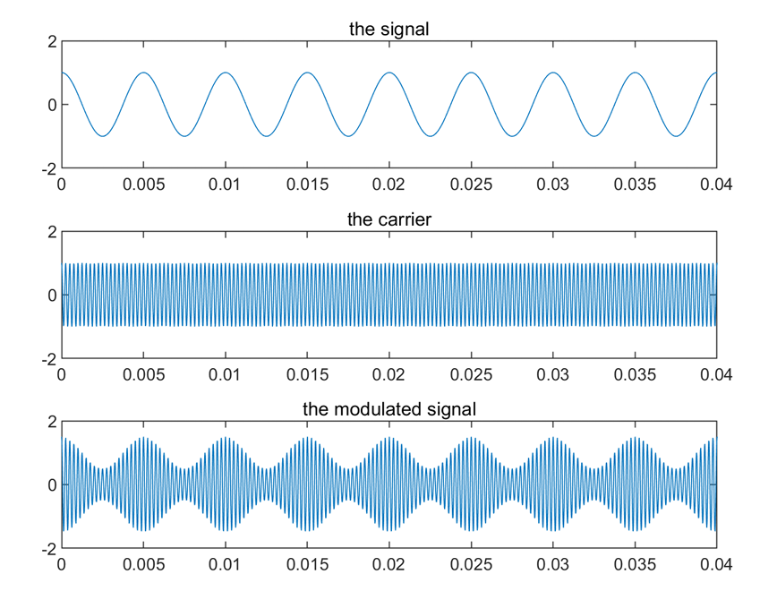

- 上图展示了信号(the signal)、载波(the carrier)、以及调制信号(the modulated signal) 的波形变化。

#### 带宽 vs. 最大数据速率(Bandwidth vs. Maximum Data Rate)

- 对电气工程师来说，（模拟）带宽是一个以赫兹(Hz)为单位的量。
- 对计算机科学家来说，（数字）带宽是信道的最大数据速率，以比特每秒(bits/sec)为单位。
- 数据速率是利用物理信道的模拟带宽进行数字传输的最终结果，这两者是相关的。

### 理论基础——信道的最大数据速率 (Theoretical Basis — The Maximum Data Rate of a Channel)

- 信道容量 (Channel Capacity) —— 在给定条件下，数据能够通过某个通信路径或信道传输的 **最大速率**。
- 四个相关概念：
    - **数据速率 (Data rate)** (bps)  
        - 如果二进制输入和二进制输出的信道没有噪声，数据速率将为 1 bps。
        - **带宽 (Bandwidth)**：由以下因素决定
        - 发射端故意限制以防止其他源的干扰。
        - 传输介质的物理属性（**赫兹 (Hz)**）。(带宽越大，通信系统的成本越高)
    - **噪声 (Noise)**
    - **误码率 (Error rate)**：错误发生的速率。错误是指在传输 "0" 时接收到了 "1"，或在传输 "1" 时接收到了 "0"。

### 理论基础 — 奈奎斯特带宽 (Theoretical Basis — Nyquist Bandwidth)

- 早在1924年，AT&T的工程师亨利·奈奎斯特(Henry Nyquist)意识到，即使是一个完美的信道也具有有限的传输能力。  
    - 调查确定在不产生符号间干扰(intersymbol interference)的情况下，给定带宽的电报信道上可使用的最大信号传输速率的问题。
    - 其中，\( g(t) \)表示基本脉冲形状，\( \{a_n\} \)是以1/T比特/秒的速率传输的二进制序列。
  
\[
s(t) = \sum_{n} a_n g(t - nT)
\]

### 问题

- 确定最佳脉冲形状(optimal pulse shape)，其带宽被限制在B Hz的范围内，并最大化比特率，约束条件是脉冲在采样时间\( kT \)(\( k = 0, \pm 1, \pm 2, \dots \))下不产生符号间干扰。

\[
g(t) = \frac{\sin(2\pi Bt)}{2\pi Bt}
\]

- 二进制(Binary)：\( C = 2B \)
- 多电平信号(Multilevel Signaling)：\( C = 2B \log_2 V \) (V是离散信号或电压级数的数量)

对于给定带宽，可以通过增加不同信号元素的数量来提高数据速率。

- 然而这会增加接收机的负担。
- 噪声和传输线上的其他损害将限制V的实际值。

### 理论基础 — 香农容量 (Theoretical Basis — Shannon Capacity)

- 数据速率、噪声和错误率之间的关系：
    - 对于给定的噪声模式，如果增加数据速率，那么比特会变得“更短”，因此更多的比特会受到影响。
    - 对于给定的噪声水平，增加信号强度将提高正确接收数据的能力。

- 香农容量(Shannon Capacity)：
    - \( C = B \log_2(1 + \text{SNR}) \)
    - 仅假设白噪声，不考虑衰减、延迟或脉冲噪声。
    - 理论最大值
    - 随着带宽(B)的增加，信噪比(SNR)会下降 —— 假设噪声为白噪声，带宽越宽，系统中引入的噪声就越多。

\[
\text{SNR}_{dB} = 10 \log_{10} \left( \frac{\text{信号功率}}{\text{噪声功率}} \right) = 10 \log_{10} (\text{SNR})
\]

### 传输媒体 I：引导传输媒体 (Transmission Media I: Guided Transmission Media)

- 持久存储 (Persistent storage)
- 双绞线 (Twisted pairs)
- 同轴电缆 (Coaxial cable)
- 电力线 (Power lines)
- 光纤 (Fiber optics)

#### 持久存储 (Persistent Storage)

- 由磁性或固态存储介质组成
- 传输数据的常见方法：
    - 写入持久存储介质
    - 物理传输磁带或磁盘到目的机器
    - 读取并传输数据
- 在需要高数据传输率或每比特成本的场景中，持久存储非常具有成本效益
- 别低估装满磁带的车在高速公路上行驶时的带宽
- 延迟特性较差：传输时间按小时或天计算，而不是毫秒
    - 网络 (The web)
    - 视频会议 (Video conference)
    - 网络游戏 (Online game)

#### 双绞线 (Twisted Pairs)

- 最古老且仍然最常见的传输媒体
- 双绞线由两根绝缘的铜线组成，通常约1毫米厚。两根线以螺旋形扭在一起，就像DNA分子一样
    - 扭绞是因为两根平行的线会构成一个天线
- 通常以电压差形式传输信号
    - 这样提供了对外部噪音的更强免疫力，因为噪音倾向于影响两根线一样，使得电压差保持不变
- 双绞线可以用来传输模拟或数字信息
- 带宽取决于线的厚度和传输距离，但在许多情况下，几公里内可以实现每秒几兆比特的传输速度

- 不同的局域网(LAN)标准可能对双绞线的使用有所不同
- 100Mbps以太网使用四对线中的两对，每个方向一对
- 1Gbps以太网同时使用所有四对线，但这需要接收器过滤掉本地传输的信号

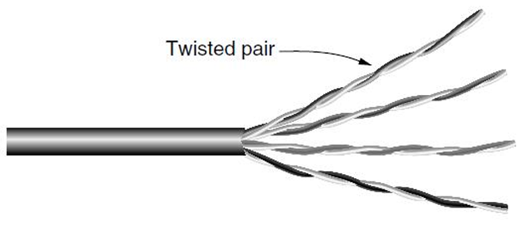

- 全双工 (Full duplex) 链接（1Gbps以太网，四对线同时双向传输）
- 半双工 (Half duplex) 链接（100Mbps以太网，每个方向一对线）
- 单工 (Simplex) 链接（单向传输）

#### 同轴电缆 (Coaxial Cable)

- 常用于有线电视和城域网 (MAN)，并为家庭提供高速互联网连接。
- 现代电缆的带宽可达几千兆赫兹 (GHz)。

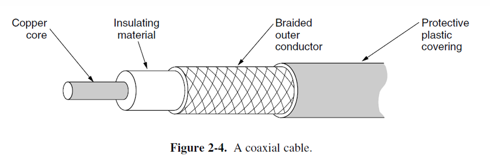

> 这张图片展示了同轴电缆的结构：
    - **铜芯**（Copper core）：电缆的中心导体，用于传输信号。
    - **绝缘材料**（Insulating material）：包围在铜芯外的材料，用于隔离铜芯与外部导体，以防止信号泄漏。
    - **编织外导体**（Braided outer conductor）：由编织金属丝构成，主要用于屏蔽外界的电磁干扰，确保信号的稳定传输。
    - **保护塑料外壳**（Protective plastic covering）：最外层的保护层，保护电缆免受物理损伤或环境因素的影响。
    这个结构示意图有助于理解同轴电缆如何通过一系列屏蔽和绝缘层来传输信号，同时减少外部干扰。

#### 电力线 (Power Lines)

- 数据信号叠加在低频率的电力信号上。
- 使用家庭电力线路作为网络传输存在的困难在于电力线原本设计用于传输电力信号。
    - 线路的电气特性会随着电器的开关变化，导致数据信号在线路中反弹。
    - 家用电器在开关时产生的瞬态电流会在各种频率范围内产生电噪声。

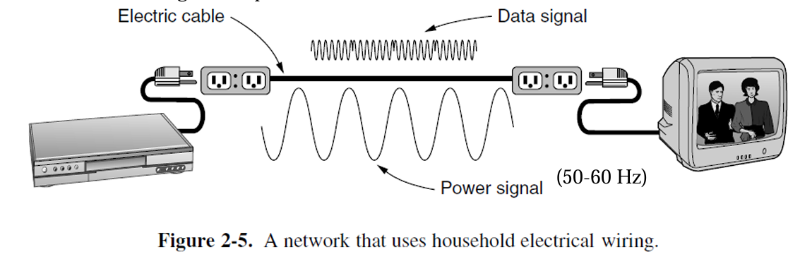

#### 光纤 (Fiber Optics)

- 允许几乎无限的带宽。
- 必须考虑成本，尤其是安装最后一英里和传输数据的成本。
- 用途：
    - 长途传输用于网络主干网(Long-haul transmission in network backbones)。
    - 高速局域网 (LAN)。
    - 高速互联网接入。
- 关键组件包括光源、传输介质和探测器。
- 传输系统基于物理学原理。

!!! note ""

    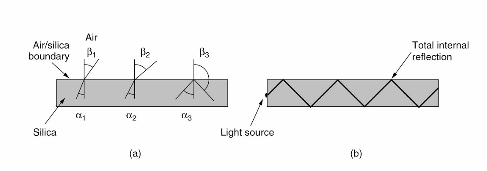

    这张图展示了光在光纤中的传播路径，分为两个部分：

    - **图(a)** 显示了一束光线以不同角度撞击空气/硅边界。在不同角度下（\(\alpha_1\), \(\alpha_2\), \(\alpha_3\)），光线的反射角度（\(\beta_1\), \(\beta_2\), \(\beta_3\)）发生变化。当光的入射角小于临界角时，光线部分会射出光纤边界，而当入射角大于临界角时，光线会反射回光纤内部。
    
    - **图(b)** 说明了光线在光纤中通过 **全内反射(total internal reflection)** 而被困住，这样光线可以在光纤内长距离传输，而不会从光纤边界逸出。这种现象是光纤通信技术的核心，利用光的全内反射实现高速数据传输。

    光纤通过控制光线的反射和折射来实现数据的高效传输，特别是在远距离通信中起到了关键作用。

##### 光纤传输光信号 (Transmission of Light Through Fiber)

- 光在玻璃中的衰减(Attenuation)：
    - 取决于光的波长。
    - 定义为输入信号与输出信号功率的比率。
- 光纤电缆(Fiber cables)：
    - 类似于同轴电缆(coax)，但没有编织层(braid)。
- 两种信号光源：
    - LED (发光二极管,Light Emitting Diodes)。
    - 半导体激光器(Semiconductor lasers)。

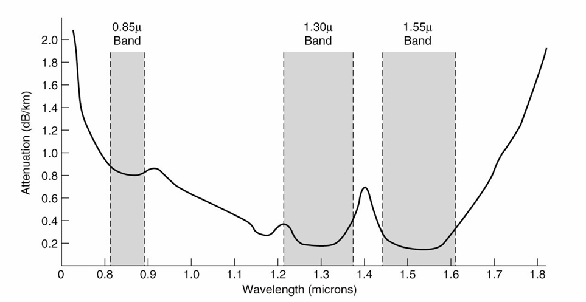

这张图展示了**光纤**（Fiber Optics）中光在不同波长（Wavelength）下的衰减特性（Attenuation）。图中标示了三个常用的波长带（Wavelength Bands），分别是：

- **0.85微米波段**（0.85μ Band）：衰减较高，通常用于短距离传输（Short-distance Transmission）。
- **1.30微米波段**（1.30μ Band）：衰减较低，是较长距离光纤通信（Long-distance Fiber Optic Communication）的常用波段。
- **1.55微米波段**（1.55μ Band）：衰减最低，是现代光纤通信中最常用的波段，适合长距离传输（Long-distance Transmission）。

每公里光纤的衰减单位为**分贝**（dB/km，Decibels per Kilometer）。从图中可以看出，波长为1.30微米和1.55微米的光具有更低的衰减（Lower Attenuation），因此更适合用于长距离光纤传输（Long-distance Fiber Transmission）。相较之下，0.85微米波段的衰减较高，适合短距离通信（Short-distance Communication）。

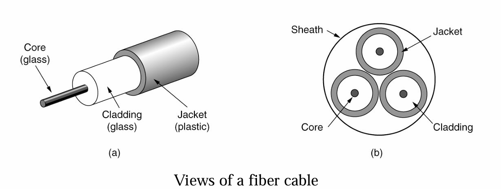

- **核心（Core）** 由玻璃（Glass）制成，外围包裹着折射率低于核心的玻璃包层（Cladding），以保证所有的光都被限制在核心内部。
  
- **多模光纤（Multimode Fiber）**（直径约50微米）：许多不同角度的光线会在包层和核心之间反射。
  
- **单模光纤（Single-mode Fiber）**（直径小于10微米）：光线只能沿直线传播，几乎没有反射。

- 光传输**本质上是单向的**（Optical transmission is inherently unidirectional），双向通信需要两根光纤，或者在一根光纤上使用两个不同的频带。

##### 光纤相比铜缆的优势

- **更高的带宽** (Handles higher bandwidth)
- **不受电源浪涌、电磁干扰、电源故障、腐蚀性化学品的影响** (Not affected by power surges, electromagnetic interference, power failures, corrosive chemicals)
- **轻薄且重量轻** (Thin and lightweight)
- **光信号不会泄漏** (Do not leak light)
- **难以被窃听** (Difficult to tap)

##### 光纤的缺点

- **技术不够普及，要求特定的工程技能** (Less familiar technology that requires specific engineering skills)
- **光纤易受损伤，特别是过度弯曲时** (Fibers damaged easily by being bent too much)

### 传输媒体 II：无线传输媒体 (Transmission Media II: Wireless)

#### 电磁频谱 (The Electromagnetic Spectrum)

- 电磁波的频谱从极低频到极高频，涵盖了不同的通信方式
    - **无线电波 (Radio waves)**: 主要用于无线电广播 (AM、FM) 和电视信号的传输
    - **微波 (Microwaves)**: 用于卫星通信、地面微波通信等
    - **红外线 (Infrared)**: 用于短距离的设备通信
    - **紫外线 (UV)**: 一般不用于通信，更多用于科学应用
    - **X射线 (X-rays)** 和 **伽马射线 (Gamma rays)**: 通常用于医学和科学研究，而不是通信

#### 常见使用频段的通信方式

- **双绞线 (Twisted pair)**: 用于较低频率的信号传输，如电话和以太网，频率大约在 10^4 到 10^7 Hz 之间
- **同轴电缆 (Coaxial cable)**: 用于更高频率的电视、互联网等信号传输，频率范围大约为 10^6 到 10^8 Hz
- **卫星 (Satellite)**: 在更高频率的微波频段中使用，通常在 10^9 到 10^11 Hz
- **光纤 (Fiber optics)**: 用于非常高频率的传输，通常是 10^15 Hz 以上的频率

这张图展示了不同通信技术在电磁频谱中的使用范围，包括从低频 (LF) 到超高频 (EHF) 等各个频段的应用。

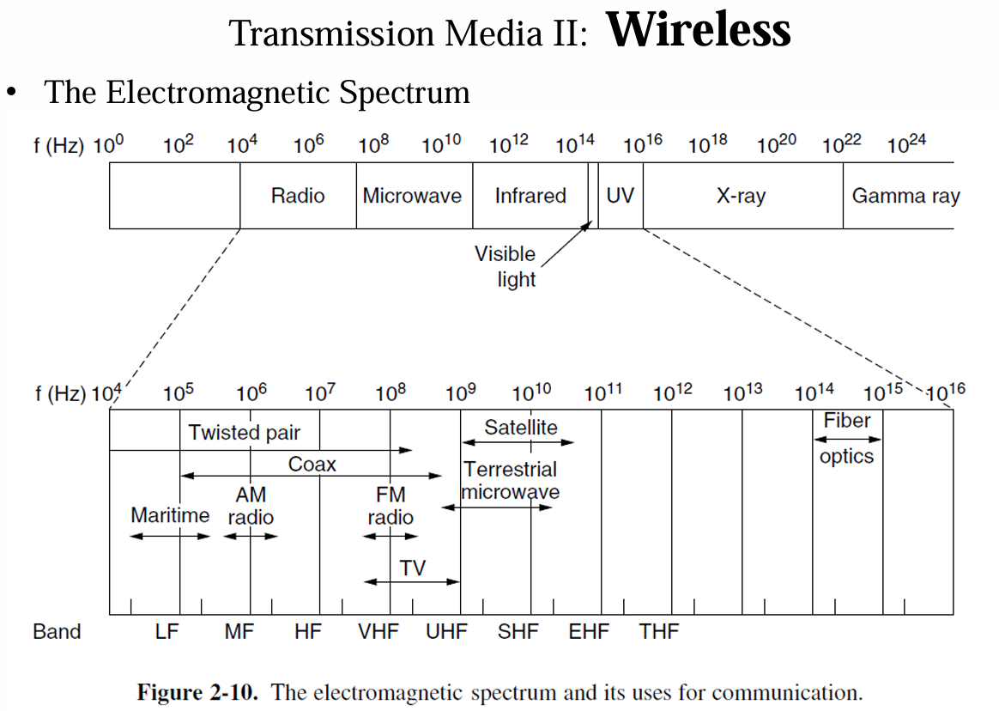

- 大多数无线传输通过将信号集中在窄频带 (narrow frequency band) 上来高效利用频谱 (spectrum)，获得合理的数据传输速率，并通过足够的功率传输。
- 频带宽度 (Δf/f << 1)
- 在某些情况下，使用较宽的频带 (wider band)，有三种变体：
    - **频率跳变扩频 (Frequency Hopping Spread Spectrum, FHSS)**：发射器每秒跳变多个频率，提高抗干扰能力。这一技术在 Bluetooth 和早期的 802.11 标准中应用广泛。
    - **直接序列扩频 (Direct Sequence Spread Spectrum, DSSS)**：例如 CDMA，通过将信号扩展到较宽频带来减少干扰。
    - **超宽带 (Ultra WideBand, UWB)**：UWB 发送一系列快速脉冲，通过快速的过渡来传播信息，信号被稀释到一个非常宽的频带中。

##### 无线电传输 (Radio Transmission)

- 无线电频率 (RF) 波容易生成，传播距离长，能轻易穿透建筑物，因此广泛应用于室内和室外的通信。
- 无线电波是全向传播的 (omnidirectional)，意味着它们从源头向所有方向传播，因此发射器和接收器不需要精确对准。
- 无线电波的特性取决于频率：
    - 在低频率下，无线电波能够很好地穿过障碍物，但随着与源的距离增加，信号强度会急剧衰减，至少以 \(1/r^2\) 的速度在空气中衰减，这种衰减被称为路径损耗 (path loss)。
    - 在高频率下，无线电波通常沿直线传播，并会从障碍物反射。
- 对于光纤、同轴电缆和双绞线 (fiber, coax, twisted pair)，信号随着每单位距离按照相同的比例衰减，例如双绞线每100米衰减20dB。而对于无线电 (radio)，信号强度随着距离的加倍而等比例衰减。
- 这种特性意味着无线电波可以传播很长距离，但用户之间的干扰是个问题。
- 地波 (Ground wave) 在低频 (VLF, LF, MF) 频段下跟随地球曲率传播，而高频 (HF) 频段下，无线电波会从电离层 (ionosphere) 反射。

##### 微波传输 (Microwave Transmission)

- 在100MHz以上，微波几乎以直线传播，可以集中在窄波束内。
- 通过抛物面天线将所有能量集中到一个小波束中，能获得更高的信噪比，但发射和接收天线必须精确对齐。
- 微波以直线传播，因此如果塔台间距过大，地球曲率将成为障碍。因此，需要定期使用中继器 (repeater)。
    - 中继器之间的距离大致与塔的高度的平方根成比例增加。
- 延迟的信号波可能与直接波不同步，从而抵消信号。
    - 这种效应称为多路径衰落 (multipath fading)。

##### 电磁频谱的管理 (The politics of the Electromagnetic spectrum)

- ITU-R（国际电信联盟无线电通信部门，International Telecommunication Union-Radiocommunication）
- FCC（美国联邦通信委员会，Federal Communications Commission）

##### 过去常用的三种频谱分配方式 (Three commonly used allocation methods in the past)

- 美容竞赛法 (Beauty contest)
- 抽签法 (Lottery)
- 拍卖法 (Auction)

##### 频谱分配 (Spectrum allocation)

- ISM 和 U-NII（非许可国家信息基础设施，Unlicensed National Information Infrastructure）频段在美国被无线设备广泛使用。
- 5 GHz 频段相对较少开发，但由于其带宽较大，通常用于诸如 802.11 ac 的 WiFi 规范。

##### 光传输 | Light Transmission

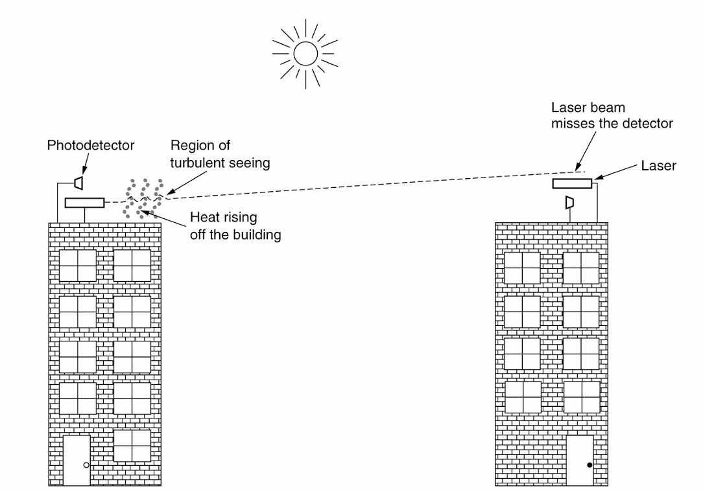

- 不同于微波传输(microwave transmission)，光传输(light transmission)无需政府许可。
- 对流气流(convection currents)（风、温度、雾等）可能会干扰激光通信系统(laser communication system)。图中展示了一个使用双向激光(bidirectional laser)的系统。

### 卫星传输 | Satellite Transmission

- 通信卫星位于地球不同的轨道上，具有不同的特性，包括到地球的高度、往返延迟时间以及覆盖全球所需的卫星数量。

- 主要的卫星频段 (satellite bands)：
    - L 频段：下行 1.5 GHz，上行 1.6 GHz，带宽 15 MHz，问题：带宽低，拥挤
    - S 频段：下行 1.9 GHz，上行 2.2 GHz，带宽 70 MHz，问题：带宽低，拥挤
    - C 频段：下行 4.0 GHz，上行 6.0 GHz，带宽 500 MHz，问题：地面干扰
    - Ku 频段：下行 11 GHz，上行 14 GHz，带宽 500 MHz，问题：降雨
    - Ka 频段：下行 20 GHz，上行 30 GHz，带宽 3500 MHz，问题：降雨，设备成本

- 中地球轨道卫星 (MEO, Medium-Earth Orbit satellites)：
    - 位于较低的高度——在两个范艾伦带(Van Allen belts)之间
    - 在经度方向上缓慢漂移（绕地球一圈需 6 小时）
    - 必须在天空中追踪
    - 在地面上具有较小的覆盖范围
    - 需要较小功率的发射器来连接

- 用于导航系统，例如：
    - 由大约 30 颗全球定位系统 (GPS, Global Positioning System) 卫星组成的星座，轨道高度约为 20,200 公里。

- 通信卫星在某些光纤无法覆盖的利基市场中具有显著优势：
    - 快速部署 (Rapid deployment)
    - 在地面基础设施较差的地区进行通信 (For communication in places where the terrestrial infrastructure is poorly developed)
    - 广播需求至关重要时 (When broadcasting is essential)

### 数字调制与多路复用 | Digital Modulation and Multiplexing

- 有线和无线信道传输模拟信号(analog signals)，例如连续变化的电压、光强或声音强度。
- 为了传输数字信息，我们必须设计模拟信号来表示比特(bits)。
    - 在比特与表示比特的信号之间转换的过程称为数字调制(digital modulation)。
- 大约有两种将比特转换为信号的方案：
    1) 基带传输(baseband transmission)（用于有线信道）
        - 信号占据的频率从零开始，直到依赖于信号速率的最大值。
    2) 带通传输(passband transmission)（用于无线和光学信道）
        - 调节载波信号的振幅(amplitude)、相位(phase)和频率(frequency)来传输比特。（信号占据载波信号频率范围内的一段频率带）。
- 信道通常由多个信号共享。
    - 使用一根线来传输多个信号——多路复用(Multiplexing)。

#### 数字调制：基带传输 | Digital Modulation: Baseband Transmission

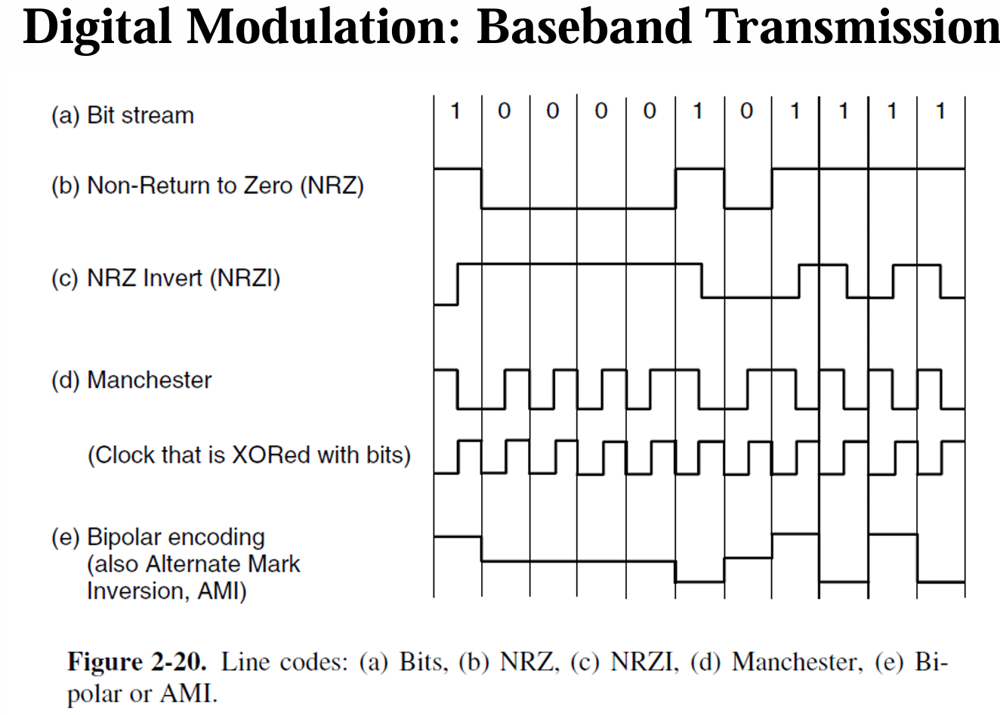

- (a) 比特流(Bit stream)
- (b) 非归零码(Non-Return to Zero, NRZ)
- (c) 非归零反码(NRZ Invert, NRZI)
- (d) 曼彻斯特编码(Manchester)
    - 使用与比特异或的时钟(Clock that is XORed with bits)
- (e) 双极编码(Bipolar encoding)
    - 也称为交替标记反转(Alternate Mark Inversion, AMI)

- **NRZ (Non-Return-to-Zero)**
    - 最简单的数字调制形式是使用**正电压**(positive voltage)表示1，使用**负电压**(negative voltage)表示0。对于光纤(Optical Fiber)，光的存在可能表示1，而光的缺失表示0。
    - 接收器将信号采样并定期转换成比特(bits)。
        - 信号将**不会**(not)与发送的信号完全相同。由于信道和噪声，信号将被**衰减**(attenuated)和**失真**(distorted)。
        - 为了解码比特，接收器将信号样本映射到最接近的符号(symbols)。

**使用有限带宽的策略 | Strategy for Using Limited Bandwidth**

- 一个策略是使用多于两个信号级别。
    - 例如，通过使用四种电压，我们可以一次发送2比特(bits)作为一个符号(symbol)。
    - 但是在接收端，接收器(receiver)应该足够强大，以区分四个级别。
    - 信号变化的速率(rate)是比特率(bit rate)的一半，因此所需的带宽(bandwidth)减少了。

- 比特率(bit rate) = 符号率(symbol rate) × 每个符号的比特数(bits per symbol)
    - 在二进制领域，波特率(baud rate)和每秒比特数(bits per second)是同义词。
    - 波特率(baud rate) = 符号率(symbol rate)

- 对于所有将**比特**(bits)编码为**符号**(symbols)的方案，**接收器**(receiver)必须知道一个符号何时结束，另一个符号何时开始，才能正确解码比特。
    - **准确的时钟**(clock)有助于解决这个问题。

- **策略**
    - 1) 向接收器发送单独的时钟信号。
    - 2) 一种巧妙的技巧是通过**异或**(XOR)将时钟信号与数据信号混合在一起，这样就不需要额外的线路了。

- **曼彻斯特编码**(Manchester Encoding)：0 —— **低到高转换**；1 —— **高到低转换**。
    - **曼彻斯特编码**的缺点是由于需要时钟，它比**非归零**(NRZ)编码需要两倍的**带宽**(bandwidth)。
    - 许多**以太网**(Ethernet)技术使用**曼彻斯特编码**。

- **NRZI** (非归零反转编码，**Non-Return-to-Zero Inverted**)
    - 通过将**1**编码为一个**转换**(transition)，将**0**编码为**无转换**(no transition)，或者反之亦然。
    - 流行的**USB**(通用串行总线，**Universal Serial Bus**)标准用于连接计算机外设采用**NRZI**。

- **扰码**(Scrambling)
    - 通过在传输前将数据与一个**伪随机**(pseudorandom)序列进行**异或**(XOR)，使数据看起来是随机的。
    - **扰码**可以防止出现主导的**频率成分**(dominant frequency components)（由重复的数据模式引起），这些成分可能辐射出**电磁干扰**(electromagnetic interference)。
        - **扰码**有助于使信号趋于“白色”(white)，或者在频率成分上能量均匀分布。

**平衡信号** | **Balanced signals**

- **平衡信号**(Balanced signals)是指正电压和负电压在短时间内保持相等的信号，平均为零（没有直流分量，**DC component**）。
- 缺少**直流分量**(DC component)是一种优势，因为某些信道（如同轴电缆或带有变压器的线路）由于其物理特性，会强烈衰减**直流分量**。
- 将接收器连接到信道的一种方法称为**电容耦合**(capacitive coupling)，它仅传递信号的交流成分。
- 构建**平衡码**(balanced code)的一种简单方法是使用两种电压电平来表示**逻辑1**(logical 1)（如+1伏或-1伏），使用0伏表示**逻辑0**(logical 0)。——**双极编码**(bipolar encoding)

#### 数字调制：带通传输 | Digital Modulation: Passband Transmission

- **带通传输**(Passband transmission)：使用任意频带传输信号。
    - 将占据0到B赫兹的基带信号移到S到S+B赫兹的带通频带，而不改变其所携带的信息量。
    - 在接收端，信号可以被移回基带。
  
- **为什么使用带通传输？**(Why passband transmission?)
    - 对于无线信道，发送非常低频率的信号并不实用，因为**天线的尺寸**(the size of the antenna)需要是信号波长的一个分数，这会使天线尺寸变大。
  
    - 法规限制和避免干扰的需求通常决定了频率的选择。
  
    - 即使对于电线，在给定的频带中放置信号也有助于让不同类型的信号共存于信道中。——**频分多址**(FDMA)用于多路复用

- 数字调制(Digital modulation)通过调节或调制带通中的载波信号来完成带通传输。
  
- 我们可以调制载波信号的**幅度**(amplitude)、**频率**(frequency)或**相位**(phase)。
    - **ASK** (幅移键控，Amplitude Shift Keying)：使用两种不同的幅度表示0和1。
    - **FSK** (频移键控，Frequency Shift Keying)：使用两个或多个不同的音调。
    - **PSK** (相移键控，Phase Shift Keying)：载波波形在每个符号周期内以0度或180度系统性地移相。
        - **BPSK** (二进制相移键控，Binary PSK)：0度和180度
        - **QPSK** (正交相移键控，Quadrature PSK)：45度、135度、225度和315度

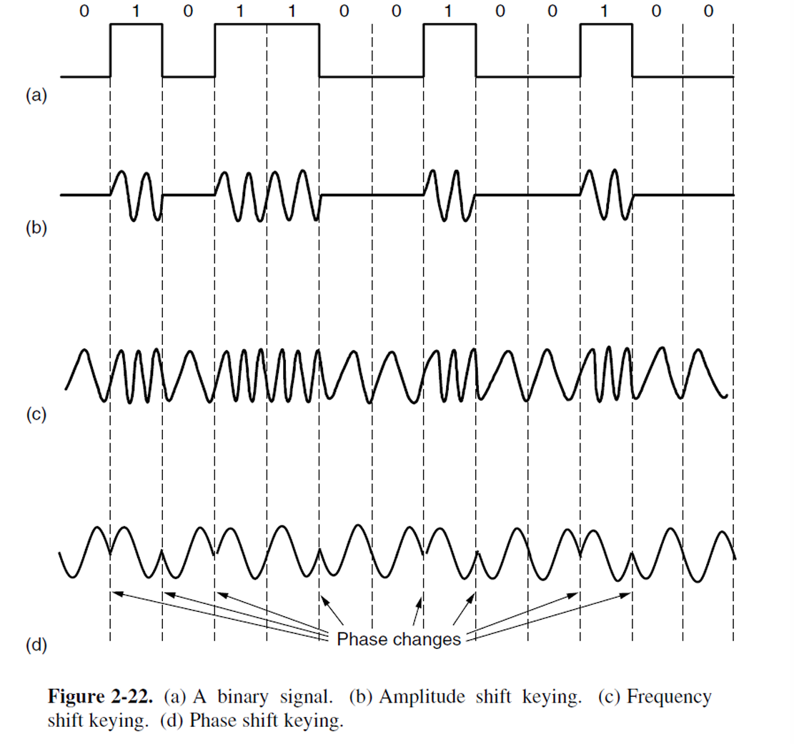

- 我们可以结合这些方案并使用更多级别来传输每个符号的更多比特。
    - 星座图 (Constellation diagram)

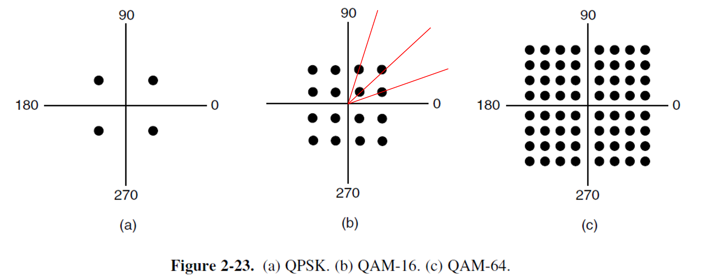

图表解释：
- (a) QPSK (正交相移键控)
- (b) QAM-16 (16阶正交幅度调制)
- (c) QAM-64 (64阶正交幅度调制)

**说明**：
构建电子设备以在每个坐标轴上产生符号比通过幅度和相位值的组合更容易。这就是为什么这些图案看起来像正方形而不是同心圆的原因。

- 之前看到的星座图并没有展示如何将比特分配给符号。在进行分配时，一个重要的考虑因素是**接收端的少量噪声**不会导致太多比特错误。
    - **格雷码** (Gray Code)

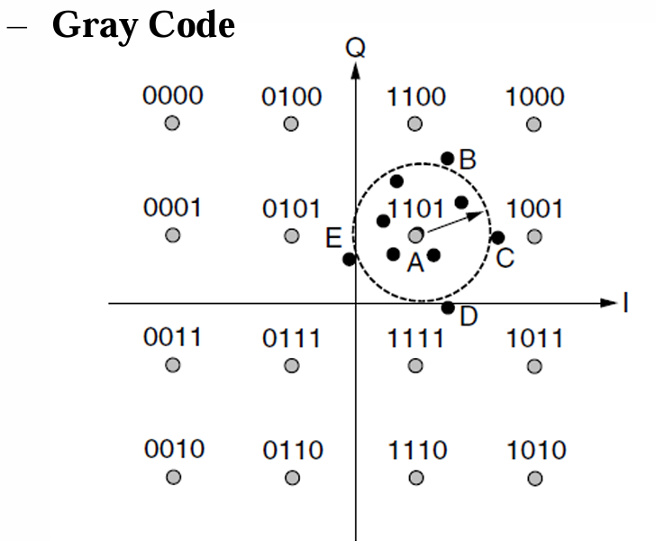{width=60%}

图示：
当发送1101时，不同点位的解码结果及比特错误：
- 点A: 1101 (0个比特错误)
- 点B: 1100 (1个比特错误)
- 点C: 1001 (1个比特错误)
- 点D: 1111 (1个比特错误)
- 点E: 0101 (1个比特错误)

#### 数字调制：频分复用 (Frequency Division Multiplexing | FDM)

- **FDM (Frequency Division Multiplexing)**  
    - 将频谱划分为频率带宽(frequency band)，每个用户拥有专属的频带用于发送信号。  
    - 例如：AM(Amplitude Modulation)广播——分配的频谱(spectrum)约为1 MHz，范围大约为500 kHz到1500 kHz。不同的频率(frequency)分配给不同的逻辑信道(logical channel)，每个信道在频谱的不同部分工作，信道之间的分离(interchannel separation)足够大以防止干扰(interference)。

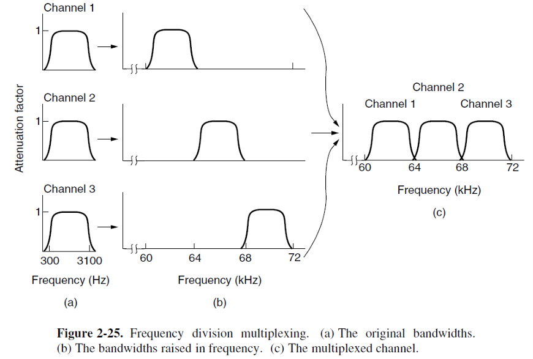

#### 数字调制：正交频分复用 (Orthogonal Frequency Division Multiplexing | OFDM)

- **OFDM (Orthogonal Frequency Division Multiplexing)**  
    - 频道带宽(channel bandwidth)被划分为多个子载波(subcarriers)，每个子载波独立地发送数据。每个子载波的频率响应(frequency response)设计为在相邻子载波中心为零。为了实现这一点，需要在时间上重复符号信号的一部分，作为保护时间(guard time)，以确保它们具有所需的频率响应。

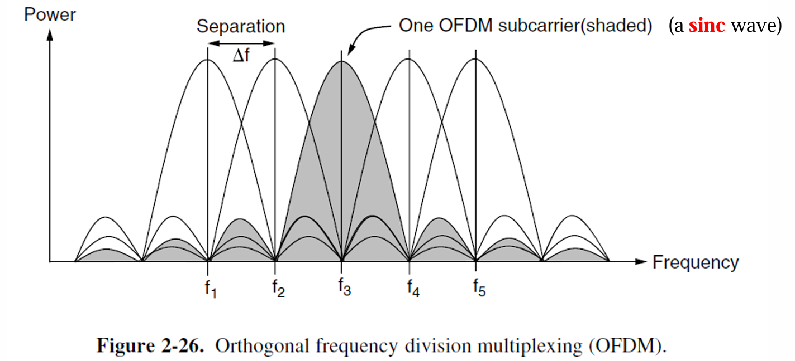

#### 数字调制：时分复用 (Time Division Multiplexing | TDM)

- **TDM (Time Division Multiplexing)** —— 用户依次轮流占用带宽(类似轮询机制)，每个用户在一个小的时间段内周期性地获取整个带宽。
    - **时间片 (Time slot)**

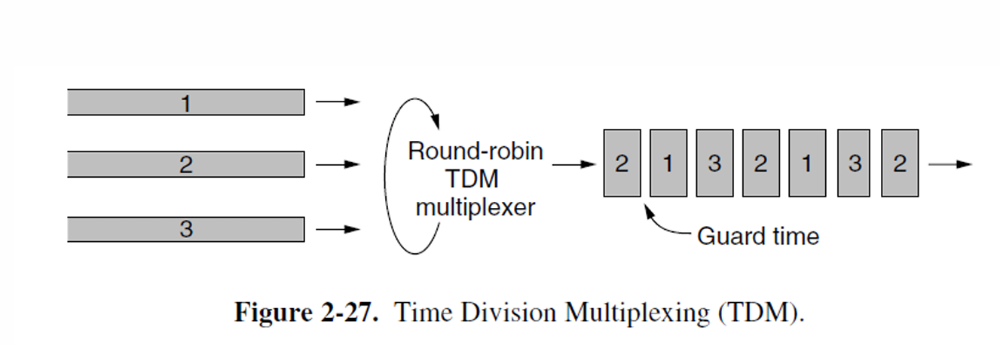

这个流(stream)的速率是各个独立流的总和。为了实现这一点，所有流必须在时间上同步(synchronized)。

#### 数字调制：码分复用 (Code Division Multiplexing | CDM)

- **CDM (Code Division Multiplexing)** 
   - 一种扩频通信形式，其中窄带信号被扩展(spread out)到更宽的频率带宽。
   - 更具抗干扰性。
   - 允许每个站点在整个频谱上同时进行传输。使用编码理论将多路同时传输区分开。
   - 在**CDMA**中，每个位时间被细分为**m**个短间隔，称为**码片 (chips)**。
       - 通常，每个位包含64或128个码片。
       - 每个站点都有自己独特的码片序列——**沃尔什码 (Walsh codes)**。

#### 数字调制: 码分复用 (Digital Modulation: CDM)

- 增加从 **b** 比特/秒到 **mb** 比特/秒的每个站点传输的信息量意味着，CDMA所需的带宽比不使用CDMA的站点大 **m** 倍。
    - 如果有1-MHz的频带可供100个站点使用，使用FDMA时，每个站点会获得10 kHz的带宽，并以10 kbps的速率发送。
    - 使用CDMA时，每个站点使用完整的1-MHz带宽，因此芯片速率是100芯片/比特，用于在信道上传播站点的10 kbps比特率。
    - 其中一个重要的限制是我们假设所有芯片在接收端是同步的(synchronized)。