# Lec01 颜色空间、图像的数字化、滤波与频域变换

## 颜色空间

光的光谱可以用波长在 400nm 到 700nm 之间单位时间的光子数量来描述。

尽管没有一个简单的函数可以描述所有观察条件下的光的颜色，但使用正态分布来描述物理光谱是一种有用的近似方法，可以在许多情况下提供对光的颜色和频谱特性的定量描述。

### 色调 | Hue

色调（hue），指的是颜色外观，用于区别颜色的种类，即当前光子的波长均值对应的颜色。

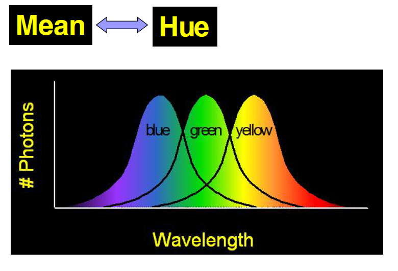

### 饱和度 | Saturation

饱和度（hue），指的是颜色的纯洁性，用于区分颜色的明暗程度，完全饱和的颜色是指没有渗入白光所呈现的颜色，单一波长组成的光谱色就是完全饱和的颜色。与当前光子波长的方差有关。

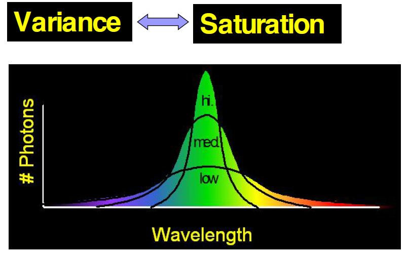

### 亮度 | Brightness

亮度（brightness）指的是视觉系统对可见物体辐射或者发光多少的感知属性。与当前光子波长围成的面积有关。

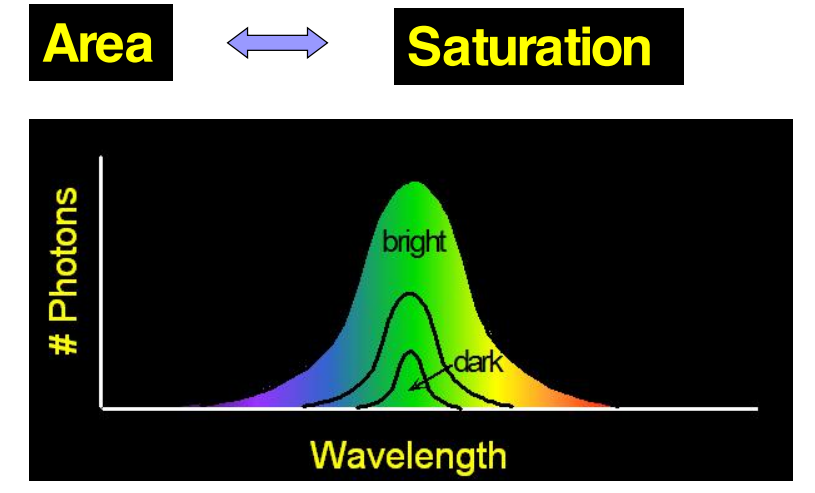

### 颜色空间 | Color Space

之前[DIP的笔记](../DIP/dip1.md)里面有详细的介绍

## 图像的数字化

图像数字化是将连续色调的模拟图像经采样量化后转换成数字影像的过程。数字化过程主要分为以下三个步骤：

1. 采样
2. 量化
3. 编码

!!! note "采样"

    采样的实质就是要用多少点来描述一幅图像，采样结果质量的高低就是用前面所说的**图像分辨率**来衡量。

    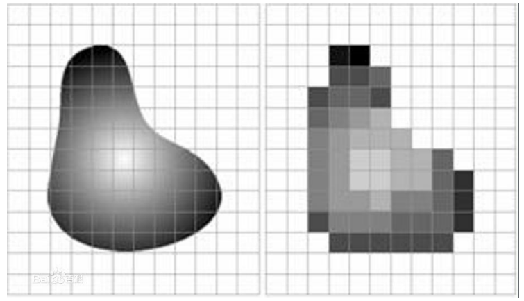{width=50%}

!!! note "量化"

    量化是指要使用多大范围的数值来表示图像采样之后的每一个点。量化的结果是图像能够容纳的颜色总数，它反映了采样的质量。

    !!! note ""
        如果以4位存储一个点，就表示图像只能有16种颜色；若采用16位存储一个点，则有216=65536种颜色。所以，量化位数越来越大，表示图像可以拥有更多的颜色，自然可以产生更为细致的图像效果。

    !!! note "量化原则"

        - 等间隔量化（均匀量化）—— 适合像素灰度值在黑白范围较均匀分布的图像。

        - 非等间隔量化（非均匀量化）—— 对图像中像素灰度值频繁出现的灰度值范围，量化间隔取小一些，而对那些像素灰度值极少出现的范围，则量化间隔取大一些。

!!! note "编码"

    数字化后得到的图像数据量十分巨大，必须采用编码技术来压缩其信息量。在一定意义上讲，编码压缩技术是实现图像传输与储存的关键。已有许多成熟的编码算法应用于图像压缩。常见的有图像的**预测编码**、**变换编码**、**分形编码**、**小波变换图像压缩编码**等。

## 图像格式

之前[DIP的笔记](../DIP/dip1.md)里面有详细的介绍

## 滤波与频域变换

### 滤波

之前DIP的笔记[(卷积和滤波 | Convolution and Filtering)](../DIP/dip5.md)里面有详细的介绍

### 频域变换

这个之前没学好，这里再学习一下。

**傅里叶变换**是一种函数在空间域和频率域的变换，从**空间域到频率域的**变换是**傅里叶变换**，而从**频率域到空间域**是**傅里叶的反变换**.

**时域**是描述数学函数或物理信号对**时间**的关系。例如一个信号的时域波形可以表达信号**随着时间的变化**。若考虑**离散**时间，时域中的函数或信号，在各个**离散时间点的数值**均为已知。若考虑**连续**时间，则函数或信号在**任意时间**的数值均为已知。在研究时域的信号时，常会用示波器将信号转换为其时域的波形。

**频域**是指在对函数或信号进行分析时，分析其和频率有关部分，而不是和时间有关的部份，和时域一词相对。

时域（信号对时间的函数）和频域（信号对频率的函数）的变换在数学上是通过积分变换实现。对**周期**信号可以直接使用**傅立叶变换**，对**非周期信号**则要进行周期扩展，使用**拉普拉斯变换**。

### 信号在频率域的表现

在频域中，**频率越大**说明原始信号**变化速度越快**；**频率越小**说明原**始信号越平缓**。当频率为0时，表示直流信号，没有变化。因此，频率的大小反应了信号的变化快慢。高频分量解释信号的突变部分，而低频分量决定信号的整体形象。

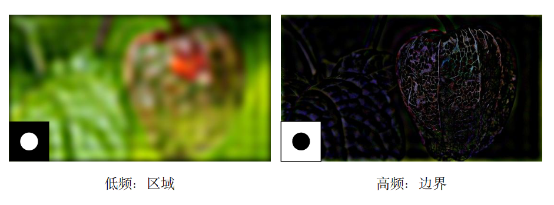

在图像处理中，频域反应了图像在空域**灰度变化剧烈程度**，也就是图像灰度的变化速度，也就是图像的梯度大小。对图像而言，图像的**边缘部分**是**突变部分**，变化较快，因此反应在频域上是**高频分量**；图像的**噪声**大部分情况下是高频部分；图像**平缓变化部分**则为**低频分量**。也就是说，傅立叶变换提供另外一个角度来观察图像，可以将图像从灰度分布转化到频率分布上来观察图像的特征。书面一点说就是，傅里叶变换提供了一条从空域到频率自由转换的途径。对图像处理而言，以下概念非常的重要：

- 图像高频分量：图像突变部分；在某些情况下指图像边缘信息，某些情况下指噪声，更多是两者的混合；
- 低频分量：图像变化平缓的部分，也就是图像轮廓信息
- 高通滤波器：让图像使低频分量抑制，高频分量通过
- 低通滤波器：与高通相反，让图像使高频分量抑制，低频分量通过
- 带通滤波器：使图像在某一部分的频率信息通过，其他过低或过高都抑制
- 还有个带阻滤波器，是带通的反。

## 频谱图的解释

我发现我最难以理解的是频谱图的解释，所以这里着重讲一下。

!!! note ""
    二维频谱中的每一个点都是一个与之一一对应的二维正弦/余弦波。

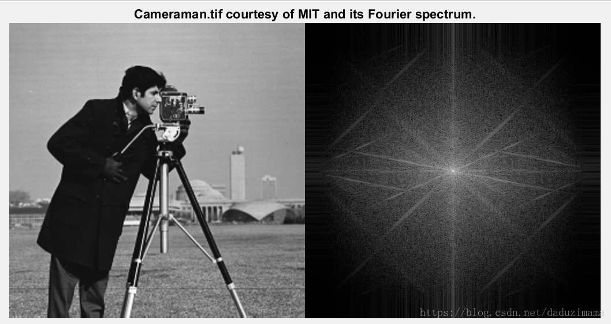

### 周期性

对于DFT而言，它的**空域**和**频域**始终都是沿着X和Y方向无限周期拓展的。如果只取其中的一个周期，则我们会得到如下频谱未中心化的结果。

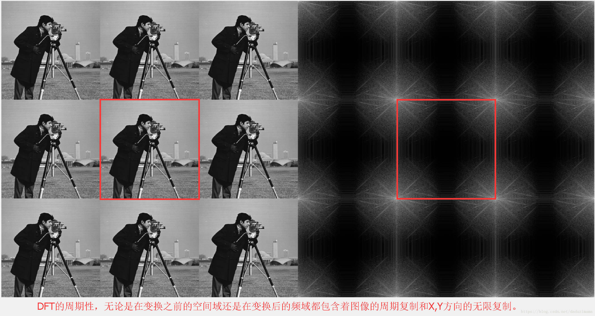

#### 中心化频谱

为了便于频域的滤波和频谱的分析，常常在变换之前进行频谱的中心化。

从数学上说是在变换之前用指数项乘以原始函数，又因为$e^{jπ} = 1$，所以往往我们在写程序的时候实际上是把原始矩阵乘以$(-1)^{x+y}$达到频谱居中的目的。

如下图所示：1<—–>3 对调，2<—–>4 对调。

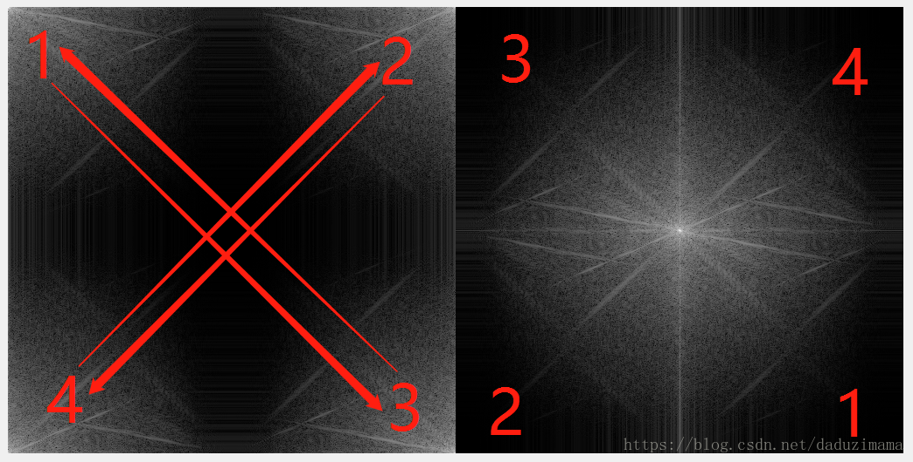

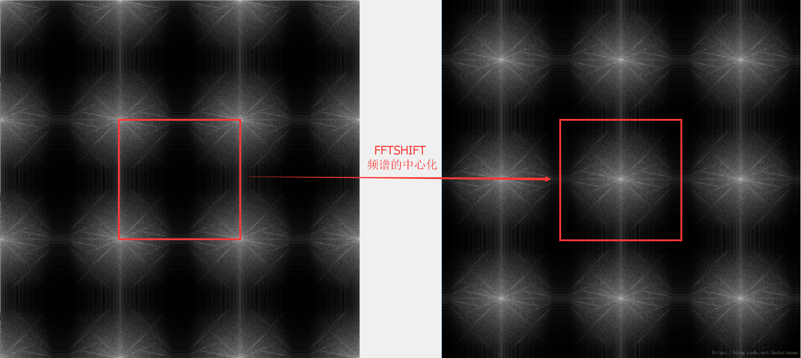

截取其中一个周期，作为图像的频谱

### 高低频率的分布

除了周期性之外，还应该知道的就是哪里是高频哪里是低频。在经过频谱居中后的频谱中，中间最亮的点是最低频率，属于直流分量（DC分量）。越往边外走，频率越高。所以，频谱图中的四个角和X,Y轴的尽头都是高频。

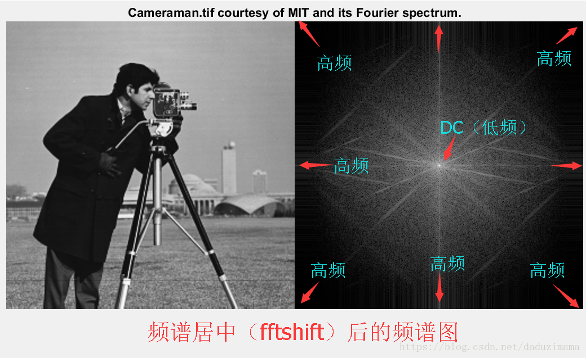

没有经过频谱居中处理的频谱图则正好相反，中间区域是高频，而四个角则是DC低频分量。

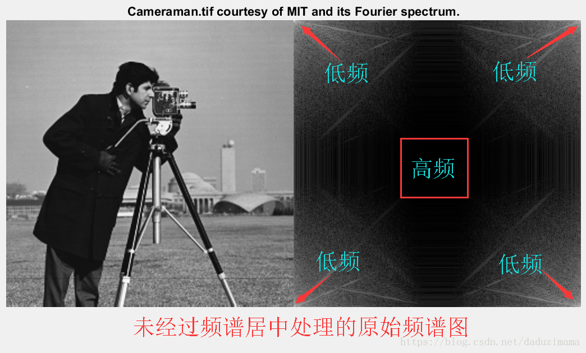

### 频谱图的能量分布

这里我顺便提一下频谱中的能级分布，则如下图所示。明显，DC分量所占能量最大最多，不论是二维还是一维都应该是这样。频率越高的部分，能量越少。如下图所示，图示画的不好，勉强能够理解就好。中间最小的那个圆圈内包含了大约85%的能量，中间那个圈包含了大约93%的能量，而最外面那个圈则包含了几乎99%的能量。

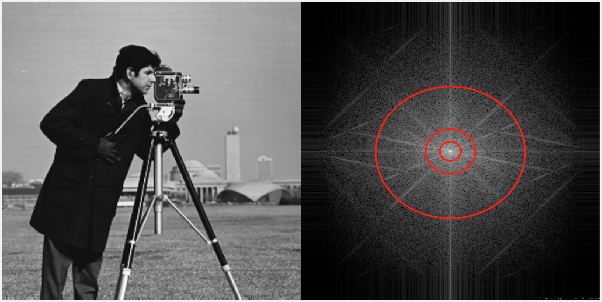

### 纵横“交错”性

在二维傅里叶变换中，空间域中横向的周期变化会反应在频谱图中的Y轴上，而空间域中纵向的周期变化会反应在频谱图中的X轴上。空间域中东南方向的周期变化会反应在频谱图中的东北方向，反之亦然。说明见下图。

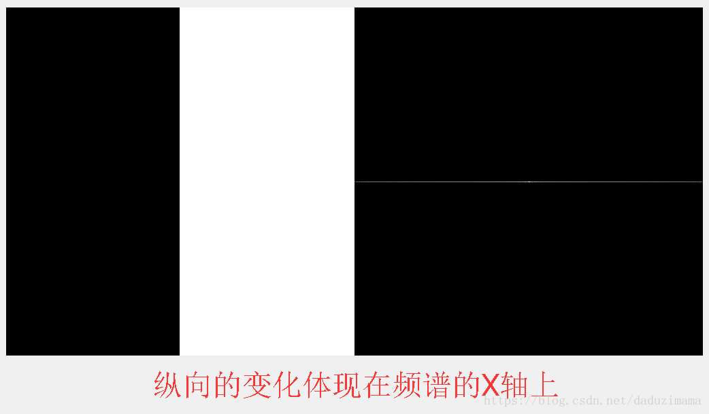

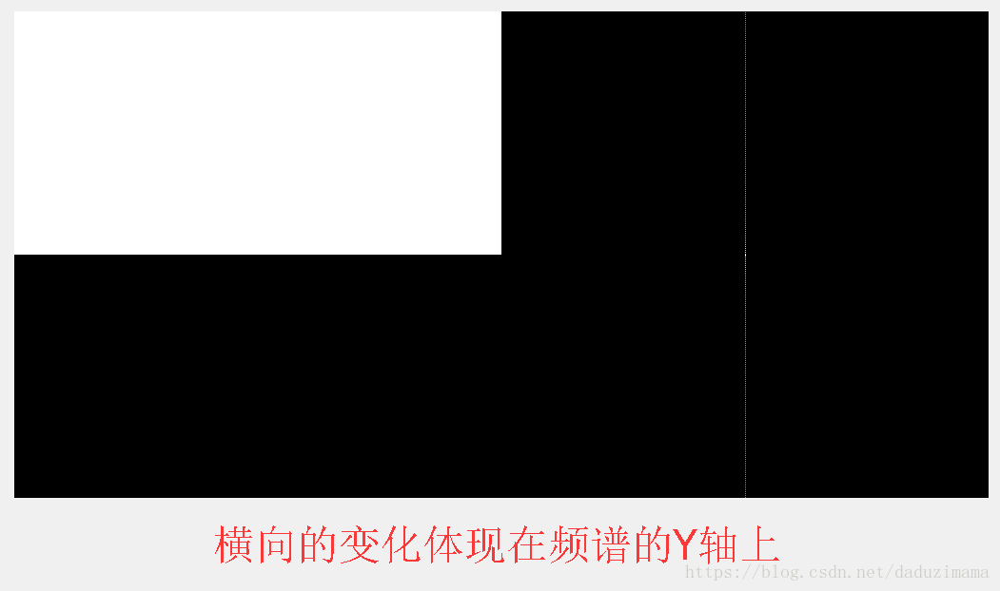

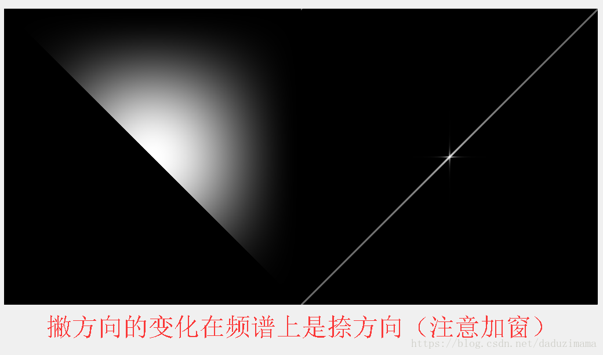

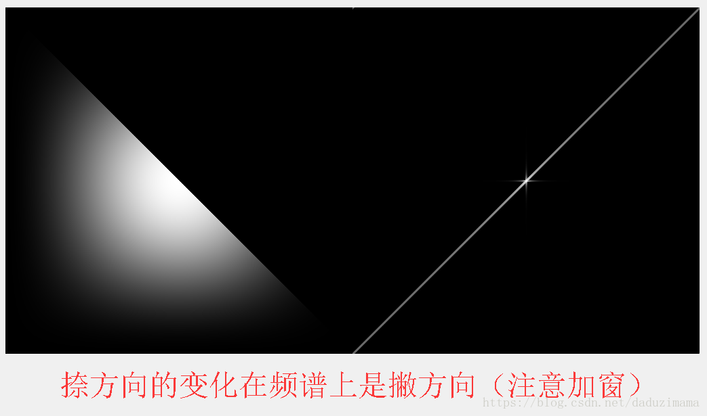

### 一些特殊频谱图

[https://www.cnblogs.com/xh6300/p/5956503.html](https://www.cnblogs.com/xh6300/p/5956503.html)

### 频谱图的应用

#### 低通/高通滤波

高通滤波就是保留频率比较高的部分，即突出边缘；低通滤波就是保留频率比较低的地方，即平滑图像，弱化边缘，消除噪声。

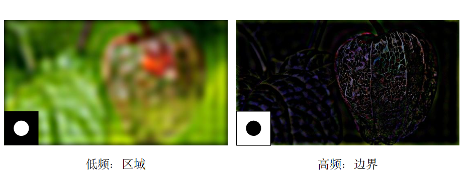

低频：区域 高频：边界

#### 更方便的卷积

时域卷积的傅里叶变换等于傅里叶变换在频域的乘积。

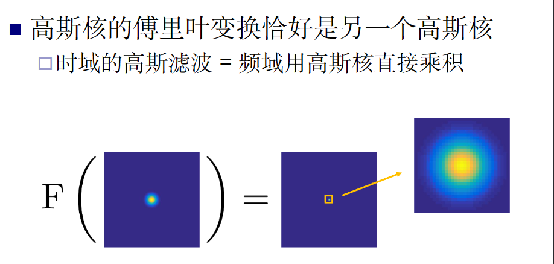

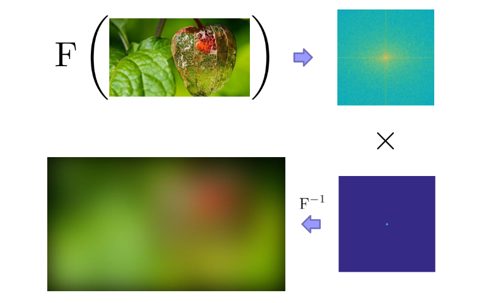

高斯滤波在频域上是一个以高斯核加权的低通滤波，这代表边缘的高频部分被抑制，图像会变平滑。