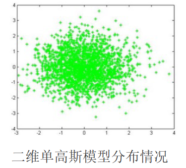
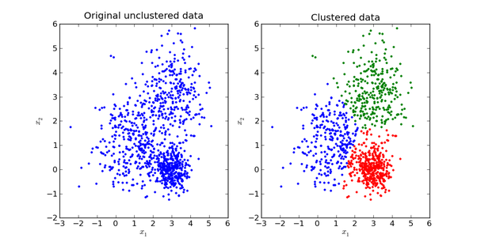
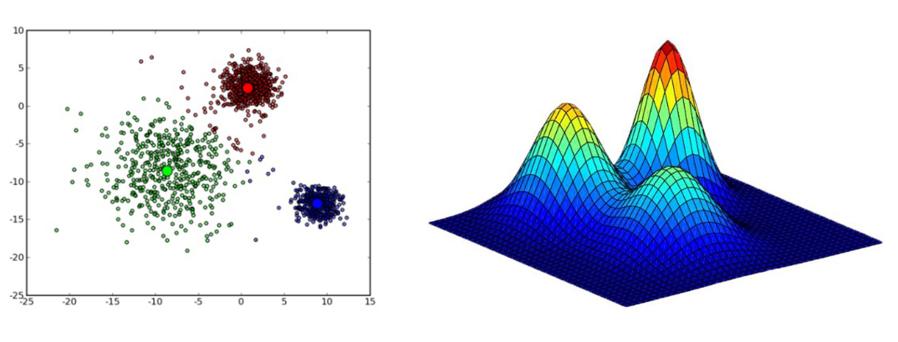
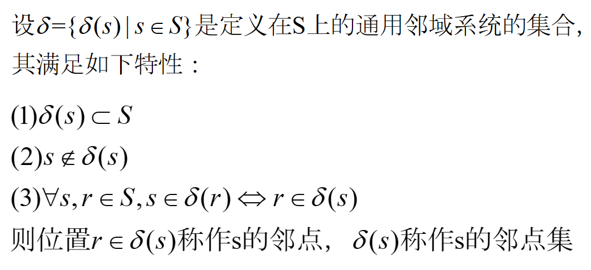
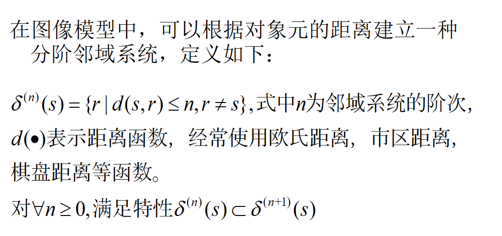
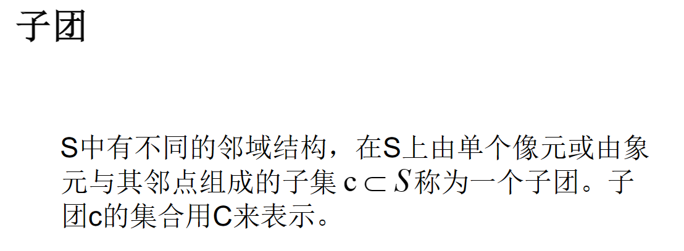
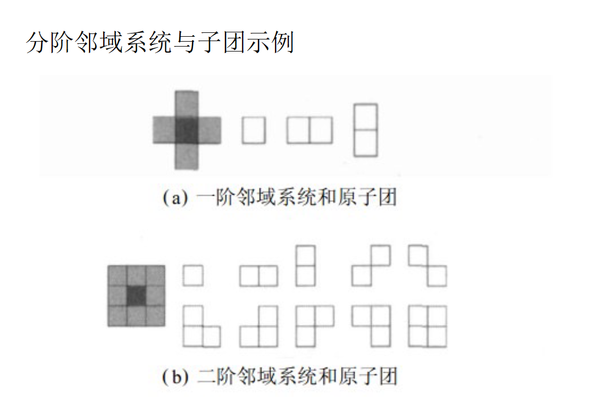
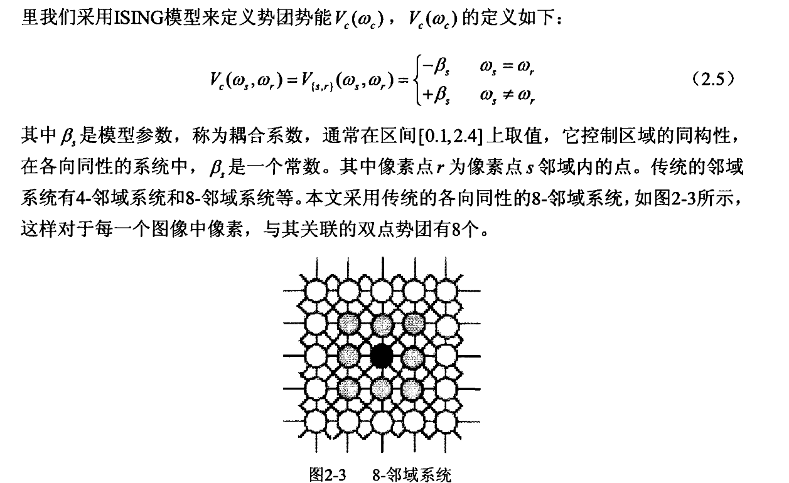

# 常用模型

## 高斯混合模型

### 混合模型

混合模型是一个可以用来表示在总体分布（distribution）中含有 K 个子分布的概率模型，换句话说，混合模型表示了观测数据在总体中的概率分布，它是一个由 K 个子分布组成的混合分布。混合模型不要求观测数据提供关于子分布的信息，来计算观测数据在总体分布中的概率。

### 高斯模型

高斯模型就是用高斯概率密度函数（正态分布曲线）精确地量化事物，将一个事物分解为若干的基于高斯概率密度函
数（正态分布曲线）形成的模型。

高斯模型有单高斯模型（SGM）和混合高斯模型（GMM）两种

#### 单高斯模型 | SGM

当样本数据 X 是一维数据（Univariate）时，高斯分布遵从下方概率密度函数（Probability Density Function）：

$$
N(x; \mu,\sigma^2) = \frac{1}{\sqrt{2\pi\sigma^2}}exp\left(-\frac{(x-\mu)^2}{2\sigma^2}\right)
$$

其中，$\mu$ 是均值，$\sigma^2$ 是方差。

当样本数据 X 是多维数据（Multivariate）时，高斯分布遵从下方概率密度函数：

$$
N(x; \mu,\Sigma) = \frac{1}{(2\pi)^{D/2}|\Sigma|^{1/2}}exp\left(-\frac{1}{2}(x-\mu)^T\Sigma^{-1}(x-\mu)\right)
$$

其中，$\mu$ 是均值，$\Sigma$ 是协方差矩阵。

在实际应用中，$\mu$ 通常用样本均值来代替，$\Sigma$ 通常用样本协方差矩阵来代替。

因为每个类别都有自己的 $\mu$ 和 $\Sigma$，所以我们很容易判断一个样本 $x$ 是否属于类别 C，只需把 $x$ 代入上式，当概率大于一定阈值时我们就认为 $x$ 属于类别 C。

从几何上讲，单高斯分布模型在二维空间应该近似于椭圆，在三维空间上近似于椭球。

{width=50%}

#### 高斯混合模型 | GMM

GMM（Gaussian Mixture Model），高斯混合模型（或者混合高斯模型），也可以简写为 MOG（Mixture of Gaussian）。

高斯混合模型可以看作是由 $K$ 个单高斯模型组合而成的模型，这 $K$ 个子模型是混合模型的隐变量（Hidden variable）。一般来说，一个混合模型可以使用任何概率分布，这里使用高斯混合模型是因为高斯分布具备很好的数学性质以及良好的计算性能。

举个不是特别稳妥的例子，比如我们现在有一组狗的样本数据，不同种类的狗，体型、颜色、长相各不相同，但都属于狗这个种类，此时单高斯模型可能不能很好的来描述这个分布，因为样本数据分布并不是一个单一的椭圆，所以用混合高斯分布可以更好的描述这个问题，如下图所示：

GMM认为数据是从几个GSM中生成出来的，即

$$
Pr(x) = \sum_{k=1}^{K} \pi_k N(x; \mu_k,\Sigma_k)
$$

其中的任意一个高斯分布 $N(x; \mu_k,\Sigma_k)$ 称为一个分量（Component）；$K$ 需要事先确定好，代表component个数；$\pi_k$ 是权值系数，满足 $\sum_{k=1}^{K} \pi_k = 1$。

将 $K$ 个高斯模型混合在一起，每个点出现的概率是几个高斯混合的结果。当 $K$ 足够大时，GMM可以用来逼近任意连续的概率密度分布。

GMM是一种聚类算法，每个component就是一个聚类中心。为了在只有样本点，不知道样本分类（含有隐含变量）的情况下，计算出模型参数 $\pi_k, \mu_k, \Sigma_k$，可以使用EM算法。

!!! note "样本分类已知情况下的 GMM"

    当每个样本所属分类已知时，GMM的参数非常好确定，直接利用Maximum Likelihood。设样本容量为 $N$ ，属于$K$个分类的样本数量分别是 $N_1, N_2, ..., N_k$，属于第 $k$ 个分类的样本集合是 $L(k)$。 

    于是我们有：

    $$
    \begin{aligned}
    \pi_k &= \frac{N_k}{N} \\
    \mu_k &= \frac{1}{N_k} \sum_{x \in L(k)} x \\
    \Sigma_k &= \frac{1}{N_k} \sum_{x \in L(k)} (x-\mu_k)(x-\mu_k)^T
    \end{aligned}
    $$

    其中，$\pi_k$ 是第 $k$ 个分类的权重，$\mu_k$ 是第 $k$ 个分类的均值，$\Sigma_k$ 是第 $k$ 个分类的协方差矩阵。

!!! note "样本分类未知情况下的 GMM"

    !!! note "对数似然函数"
        有 $N$ 个数据点，服从某种分布 $Pr(x;\theta)$，我们想找到一组参数 $\theta$，使得生成这些数据点的概率最大，这个概率就是

        $$ \prod_{i=1}^{N} Pr(x_i;\theta) $$

        这称作似然函数（Likelihood Function）。
        
        通常单个点的概率很小，连乘之后数据会更小，容易造成浮点数下溢，所以一般取其对数，变成

        $$ \sum_{i=1}^{N} log(Pr(x_i;\theta)) $$

        这称作对数似然函数（Log Likelihood Function）。

    对于 GMM，我们的目标是找到一组参数 $\theta = \{\pi_k, \mu_k, \Sigma_k\}$，使得数据点 $x_i$ 的对数似然函数最大，即

    $$ \max_{\theta} \sum_{i=1}^{N} log(\sum_{k=1}^{K} \pi_k N(x_i; \mu_k,\Sigma_k)) $$

    这里每个样本 $x_i$ 所属的类别 $z_k$ 是未知的，$Z$ 是隐含变量，我们就是要找到最佳的模型参数，使得上式所示的期望最大，**“期望最大化算法”**名字由此而来。

    对于每个观测数据点来说，事先并不知道它是属于哪个子分布的（hidden variable），因此 $\log$ 里面还有求和，对于每个子模型都有未知的 $\pi_k, \mu_k, \Sigma_k$，直接求导无法计算。需要通过迭代的方法求解。

    !!! note "EM 算法"

        EM 算法是一种迭代算法，1977 年由 Dempster 等人总结提出，用于含有隐变量（Hidden variable）的概率模型参数的最大似然估计。

        EM 要求解的问题一般形式是:

        $$
        \theta^* = \arg \max_{\theta} \prod_{j=1}^{|x|}\sum_{y\in Y} Pr(X=x_j,Y=y;\theta)
        $$

        其中，$X$ 是观测变量，$Y$ 是隐变量，$\theta$ 是模型参数。

        EM算法的基本思路是：随机初始化一组参数 $\theta(0)$，根据后验概率 $Pr(Y|X;\theta)$ 来更新 $Y$ 的期望 $E(Y)$，然后用 $E(Y)$ 代替 $Y$ 求出新的模型参数 $\theta(1)$。如此迭代直到 $\theta$ 趋于稳定。

        > 如果数据点的分类标签 $Y$ 是已知的，那么求解模型参数直接利用Maximum Likelihood就可以了。

        !!! note "E-Step"
            E 是Expectation的意思，就是假设模型参数已知的情况下求隐含变量 $Z$ 分别取 $z_1,z_2,...$ 的期望，亦即 $Z$ 分别取 $z_1,z_2,...$ 的概率。在 GMM 中就是求数据点由各个 component 生成的概率。

            $$ \gamma(i,k) = \alpha_k Pr(z_k|x_i;\pi,\mu,\Sigma) $$

            注意到我们在Z的后验概率前面乘以了一个权值因子 $\alpha_k$，它表示在训练集中数据点属于类别 $z_k$ 的频率，在 GMM 中它就是 $\pi_k$。

            因为 $Pr(x) = \sum_{k=1}^{K} \pi_k N(x; \mu_k,\Sigma_k)$，所以

            $$ 
            \gamma(i,k) = \alpha_k \frac{\pi_k N(x_i; \mu_k,\Sigma_k)}{\sum_{j=1}^{K} \pi_j N(x_i; \mu_j,\Sigma_j)}
            $$

        !!! note "M-Step"
            M 就是Maximization的意思，就是用最大似然的方法求出模型参数。

            现在我们认为上一步求出的 $\gamma(i,k)$ 就是“数据点 $x_i$ 由 component $k$ 生成的概率”，那么我们可以用这个概率来更新模型参数。

            $$
            \begin{aligned}
            N_k &= \sum_{i=1}^{N} \gamma(i,k) \\
            \pi_k &= \frac{N_k}{N} \\
            \mu_k &= \frac{1}{N_k} \sum_{i=1}^{N} \gamma(i,k) x_i \\
            \Sigma_k &= \frac{1}{N_k} \sum_{i=1}^{N} \gamma(i,k) (x_i-\mu_k)(x_i-\mu_k)^T
            \end{aligned}
            $$

        重复计算 E-step 和 M-step 直至收敛 （$\|\theta_{i+1}-\theta_i\| < \epsilon$，$\epsilon$ 是一个很小的正数，表示经过一次迭代之后参数变化非常小）。

    至此，我们就找到了高斯混合模型的参数。需要注意的是，EM 算法具备收敛性，但并不保证找到全局最大值，有可能找到局部最大值。解决方法是初始化几次不同的参数进行迭代，取结果最好的那次。

## 马尔科夫随机场与图像处理

### 马尔科夫随机过程

通俗的讲，马尔科夫随机过程就是，下一个时间点的状态只与当前的状态有关系，而与以前的状态没有关系，即未来的状态决定于现在而不决定于过去。

!!! note "一维马尔科夫过程"

    设有随机过程 $\{X_n,n\in T\}$，若对于任意正整数 $n \in T$ 和任意的 $i_0,i_1,...,i_{n+1} \in I$，条件概率满足

    $$
    P(X_{n+1}=i_{n+1}|X_n=i_n,X_{n-1}=i_{n-1},...,X_0=i_0) = P(X_{n+1}=i_{n+1}|X_n=i_n)
    $$

    就称 $\{X_n,n\in T\}$ 为马尔科夫过程，该随机过程的统计特性完全由条件概率所决定。

马尔科夫随机过程可以按照参数集和状态空间分成四类：

- 时间和状态都是离散的马尔科夫过程。也称为马尔科夫链；
- 时间连续、状态离散的马尔科夫过程。通常称为纯不连续马尔科夫过程；
- 时间和状态都是连续的马尔科夫过程；
- 时间离散、状态连续的马尔科夫过程。

!!! note "马尔科夫随机场"

    马尔科夫随机场包含两层意思：
    - 马尔科夫性质
    - 随机场

    !!! note "马尔科夫性质"

        马尔科夫性质指的是一个随机变量序列按时间先后关系依次排开的时候，第 $N+1$ 时刻的分布特性，与 $N$ 时刻以前的随机变量的取值无关。

        即在一个随机过程中，给定现在状态，未来状态与过去状态是独立的。即

        $$
        P(X_{n+1}=i_{n+1}|X_n=i_n,X_{n-1}=i_{n-1},...,X_0=i_0) = P(X_{n+1}=i_{n+1}|X_n=i_n)
        $$

    !!! note "随机场"

        **随机场**是一种随机变量的集合，这些随机变量的取值是空间上的某种结构，比如二维平面上的像素点。

        当给每一个位置中按照某种分布随机赋予相空间的一个值之后，其全体就叫做随机场。其中有两个概念：位置（site），相空间（phase space）。

        不妨拿种地来打个比方。“位置”好比是一亩亩农田；“**相空间**” 好比是要种的各种庄稼。我们可以给不同的地种上不同的庄稼，这就好比给随机场的每个“**位置**”，赋予相空间里不同的值。所以，通俗点讲，随机场就是在哪块地里种什么庄稼的事情。
        
        如果任何一块地里种的庄稼的种类仅仅与它邻近的地里种的庄稼的种类有关，与其它地方的庄稼的种类无关，那么这些地里种的庄稼的集合，就是一个**马尔科夫随机场**

    !!! note "马尔科夫随机场与图像的关系"

        一维马尔科夫随机过程很好的描述了随机过程中某点的状态只与该点之前的一个点的状态有关系。
        
        对于定义在二维空间上的图像，也可以将它看为一个二维随机场。
        
        说到二维随机场，自然也存在二维马尔科夫随机场。此时我们必须考虑空间上的关系，二维MRF的平面网格结构同样可以较好的**表现图像中像素之间的空间相关性**。

        设 
        
        - $S=\{(i,j)|1\leq i\leq M,1\leq j\leq N\}$ 表示 MN 位置的有限格点集，即随机场中的位置；
        - $\Lambda$ 表示状态空间，即随机场中的相空间；
        - $X=\{x_s|s\in S\}$ 表示定义在 $\forall s \in S$ 处的随机场；
            - $x_s$ 表示在随机场 $X$ 上，状态空间为 $\Lambda$ 的隐状态随机变量，即$x_s\in \Lambda$

        在图像中
        
        - 格点集 $S$ 表示像素的位置 ；
        - $X$ 称为标号场，也可以表示像素值的集合或图像经小波变换后的小波系数集合；
        - $\Lambda$为标号随机变量 $x_s$ 的集合；
        - $L$表示将图像分割为不同区域的数目。

    ??? note "邻域系统"
        比较好理解，但是定义比较拗口。简单来说，就是对于一个像素点，它的邻域是指与它相邻的像素点。

        

        

        

        !!! note "子团"

            

            

### 马尔科夫随机场的数学定义

!!! warning ""
    这里我觉得PPT上的不太对，用的是[浙江大学学报 · 基于马尔科夫专家场的泊松噪声图像去噪方法](https://www.zjujournals.com/eng/article/2020/1008-973X/202006013.shtml)的表述

设$\delta$为 $S$ 上的邻域系统，若随机场 $X=\{X_s,s\in S\}$满足如下条件：

$$
\begin{cases}
P=\{X=x\}>0\quad\forall x\in \Lambda\\
P=\{X_s=x_s,r\neq s,\forall r\in\mathcal{\delta}(s)\}=
P\left\{X_s=x_r,X_r=x_r,\forall r\in\mathcal{\delta}(s)\right\}
\end{cases}
$$

则称$X$为以$\delta$为邻域系统的马尔可夫随机场，第二个式子称为马尔可夫随机场的局部特性

!!! note "什么叫做以$\delta$为邻域系统的马尔可夫随机场？"
    在任意格点 $s$ 的其余格点位置上随机变量$x_s$ 取值已知的条件下，随机场在格点 $s$ 处的取值概率只与格点 $s$ 的 $\delta$ 相邻点有关。

!!! note ""
    在图像中，$P(\cdot)$ 表示标号场的先验概率，$P(\cdot |\cdot)$表示邻域系统标号的局部作用关系

在数字图像中，一个象元的灰度值仅与其邻域系统内各象元的灰度值有关，因而可以利用马尔科夫随机场来模拟数字图像。当邻域系统 $\delta$ 足够大时，任何定义在 $S$ 上的图像数据均可看成马尔科夫随机场的一个实现。

### MRF 与 Gibbs 分布的等价关系

由于标号场先验概率和标号场的邻域局部关系在实际应用中很难确定，20世纪80年代Hammersley-Clifford给出了Gibbs分布与MRF的关系，从而用Gibbs分布求解MRF中的概率分布。

!!! note ""

    [证明过程](Hammersley-Clifford.md)

$\delta$ 是定义在 $S$ 上的邻域系统，当且仅当随机场 $X=\{x_s,s\in S\}$ 的联合概率分布具有如下形式时，称 $X$ 为吉布斯随机场：

$$
P(X=x)=\frac{1}{Z}\exp\{-U(x)\}
$$

其中，$U(x)=-\sum\limits_{c\in C}V_c(x)$称为能量函数，$V_c(x)$是仅与团 $c$ 上的取值有关的势函数，$Z=\sum\limits_{x}e^{-U(x)}$是归一化因子。

**一个随机场是关于邻域系统的MRF，当且仅当这个随机场是关于邻域系统的Gibbs分布，表示为：**

$$
P(x_s|x_r,r\in\delta(s))=\frac{e^{-\sum\limits_{c\in C}V_c(x_s|x_r)}}{\sum\limits_{x_s=1}^Le^{-\sum\limits_{c\in C}V_c(x_s|x_r)}}
$$

上式解决了求MRF中概率分布的难题,使对MRF的研究转化为对势函数 $V_c(x)$ 的研究,使Gibbs分布与能量函数建立了等价关系,是研究邻域系统 $\delta(s)$ MRF的一个重要里程碑

### 基于 MRF 的图像分割

基于马尔科夫随机场模型，我们有图像分割算法。该算法假设待分割图像的像素只与其邻域内的像素相关，与邻域外的像素无关；

基于该假设我们能定量计算图像局部的先验结构信息，并根据最大后验概率准则（MAP），有效的利用像素间结构信息分割图像。

对于一幅给定的 $M*N$ 的图像$Y$，平面上的像素点集 $S=\{s_1,s_2,\cdots,s_{M\times N}\}$其中任意一个像素 $y_i$，分割后对应的标记为 $x_i$，定义两个随机场: 

1. $X=\{x_i,i\in S\}$是图像分割后的类别标号场:$x=1,2,\cdots L$表示分割成 $L$ 个区域，但其类别状态不能直接观察到。
2. $Y=\{y_i,i\in S\}$ 是可观测的随机场,即图像的观测灰度场，那么分割问题可以描述为:

$$y_i\in Y\to x_i=\begin{cases}1&\quad i=targ et1\\2&\quad i=targ et2\\\vdots&\quad\vdots\\L&\quad i=targ etL\end{cases}\quad x_i\in X,i\in\{1,2,\cdots M*N\}$$

根据贝叶斯准则，最优分割准则为：

$$
\hat{\operatorname*{X}}=\arg\max_Xp(X\mid Y)=\arg\max_X\frac{p(Y\mid X)p(X)}{p(Y)}
$$
 
对于一幅给定的图像，$Y$ 已知，所以 $P(Y)$ 为常数， 故上式等价于：$\underset{X}{\operatorname*{\arg\max}}\;p(Y|X)p(X)$

#### $p(X)$ 的计算

由于随机场X是MRF，具有正概率性和Markov性。由MRF与Gibbs分布的等价性可知

$$p(X)=\prod_{i=1}^{M*N}p(x_i)=\prod\limits_{i=1}^{M*N} \frac{   \exp\big(-\sum\limits_{c\in C}V_c(x_i)\big)}{\sum\limits_{x_i=1}^L\exp\big(-\sum\limits_{c\in C}V_c(x_i)\big)}$$

式中$\mathrm{V}_c(x_i)$是包含 $x_i$ 的基团 $c$ 的势函数，$C$ 是所有基团的集合

接下来，我们来定义势函数 $V_c(x_i)$。

$$
V_c(x_i)=\begin{cases}
-\beta \quad \text{if}\quad x_i = x_j\\
+\beta \quad \text{if}\quad x_i \neq x_j
\end{cases}
$$

其中，$\beta$ 是耦合系数。

!!! note ""
    [基于马尔可夫随机场的图像分割研究](https://d.wanfangdata.com.cn/thesis/Y1380732)
    

#### $p(Y|X)$ 的计算

对于似然函数 $P(Y|X)$，在大多数情况下假定它服从高斯分布是合理的，这时$P(Y |X)$由两组参数唯一确定，即  $u_m$ 和$\sigma_m$ ，其分别是第 $m$ 区域的均值和标准差，可以根据其在概率论中的公式计算。在很多情况下我们认为图像中各个位置的像素是独立同分布的，即满足：

$${p( Y=y| X=x)=}\prod_sp(Y=y_s\mid X=x_s)=\prod_s\frac1{\sqrt{2\pi}\sigma_m}\exp\biggl[-\frac{(y_s-u_m)^2}{2\sigma_m^2}\biggr]$$

#### 最优分割准则

综上所述 $p(Y|X)$ 和 $p(X)$ 的计算，我们可以得到最优分割准则。

#### MRF图像分割的关键点

- 基团的选取
- 势函数 $V_c(x)$ 的定义
- 先验概率 $p(X)$ 的确定（图像预分割）
- 选取合适的条件分布
- 条件分布中参数的估计
- 分割算法的选取
