# 基于深度学习的抠像

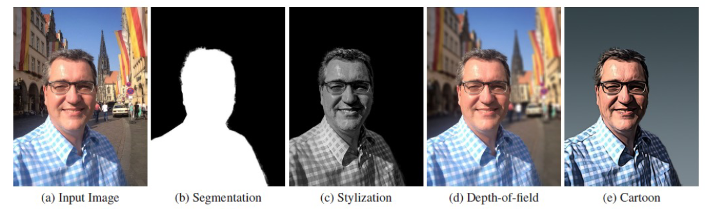

## PortraitFCN+

> 第一篇具有较好效果的人像抠图文章：Automatic Portrait Segmentation for Image Stylization，Xiaoyong Shen Aaron Hertzmann Jiaya Jia Sylvain Paris Brian Price Eli Shechtman Ian Sachs

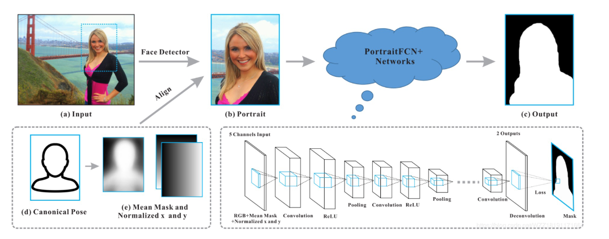

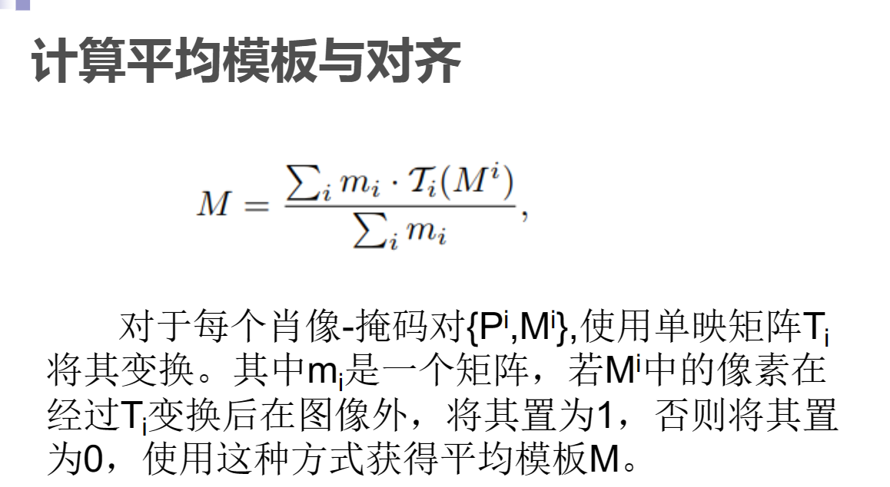

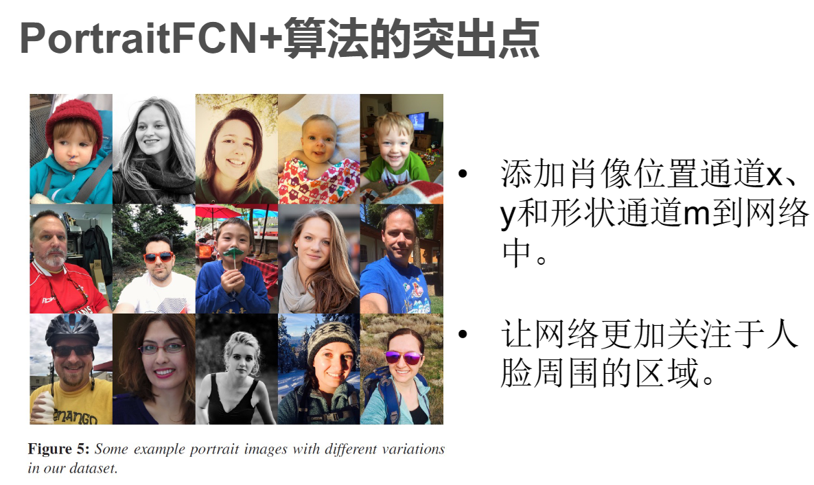

## Deep Automatic Portrait Matting

> Deep Automatic Portrait Matting，Xiaoyong ShenEmail authorXin TaoHongyun GaoChao ZhouJiaya Jia,ECCV 2016

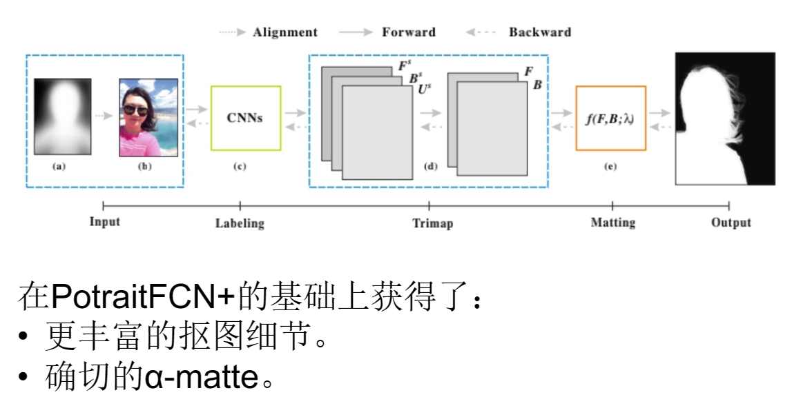

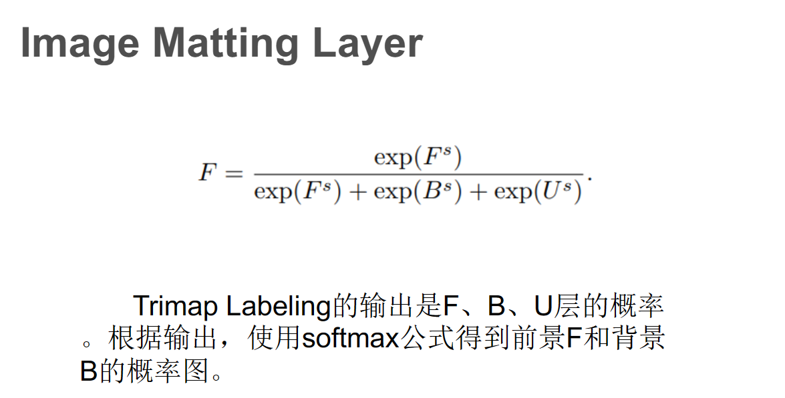

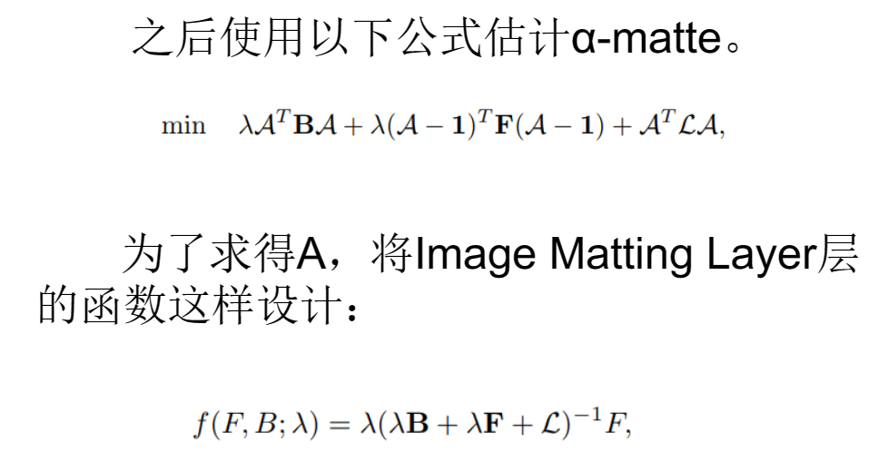

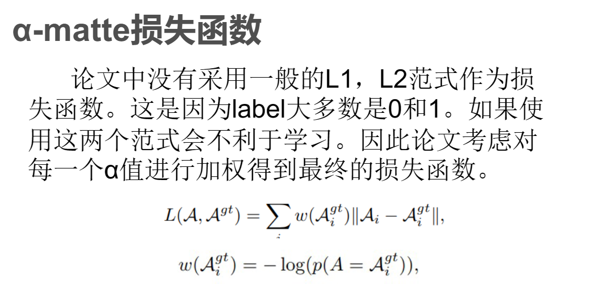

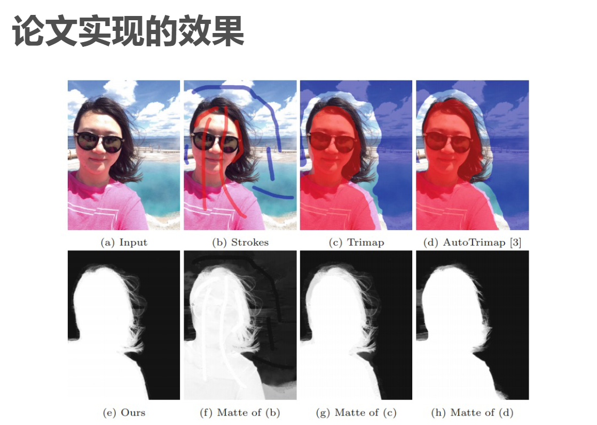

## Deep Image Matting

> Deep Image Matting，Ning Xu, Brian Price, Scott Cohen and Thomas Huang，CVPR 2017

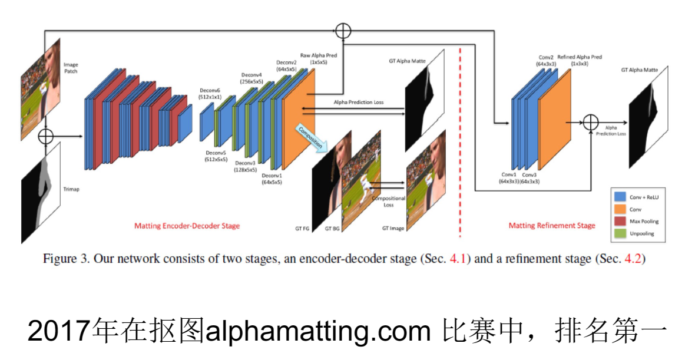

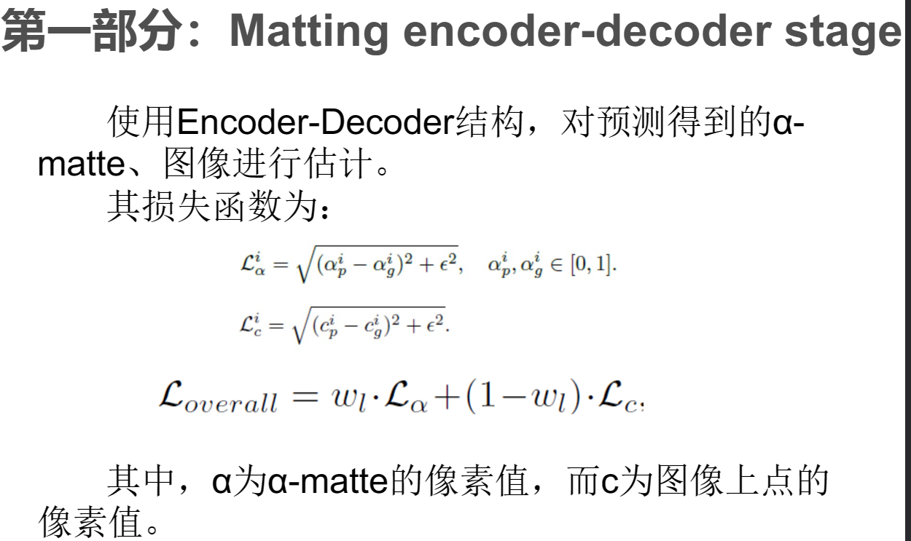

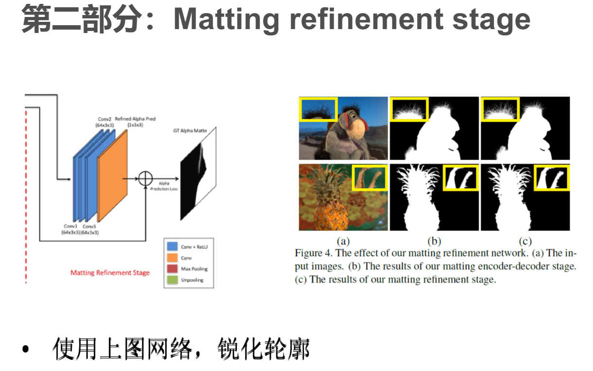

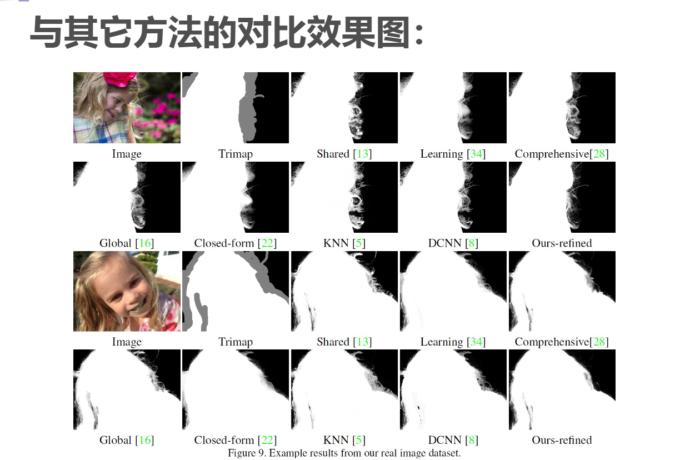

## Matting Anything

> https://arxiv.org/abs/2306.05399

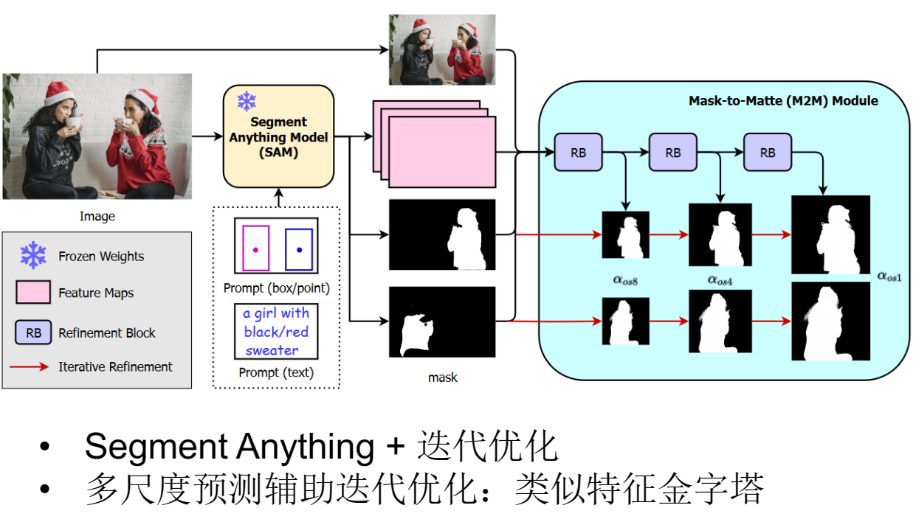

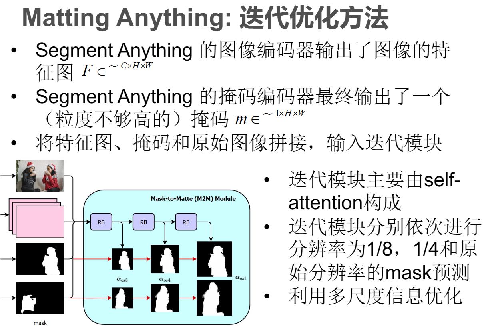

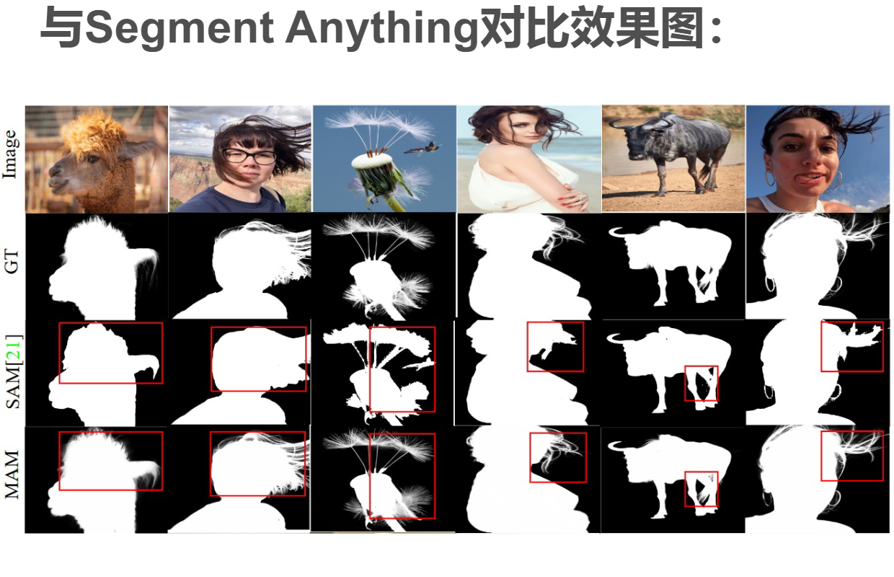

