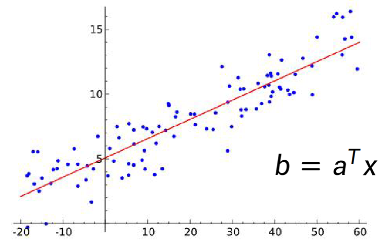
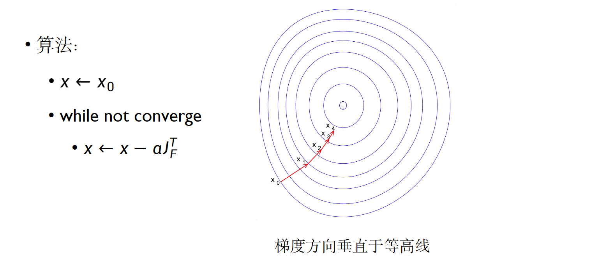
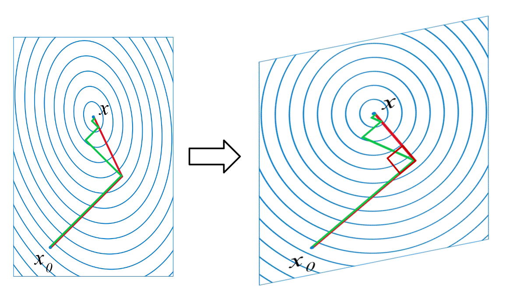
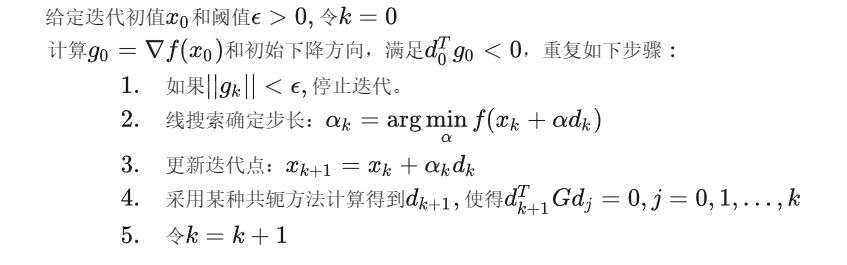
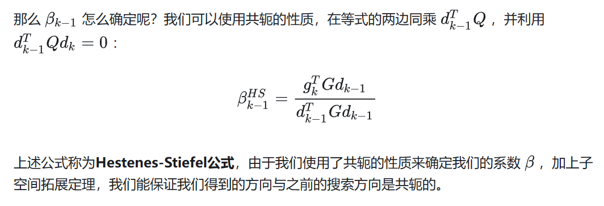
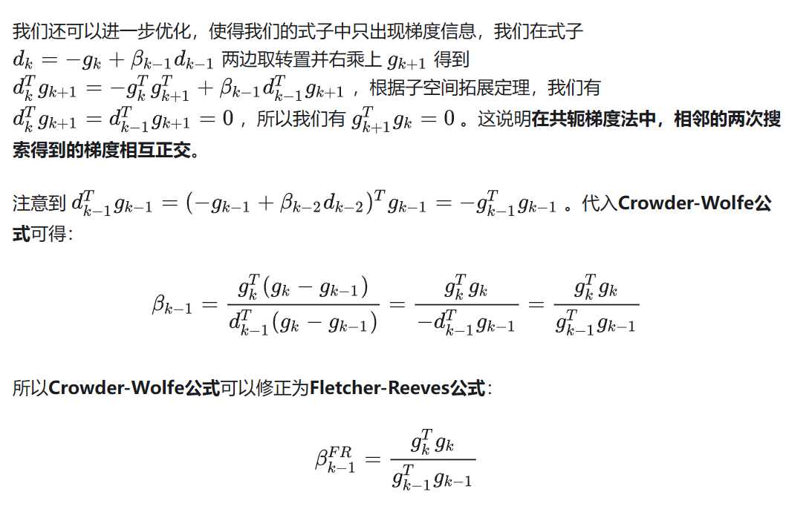
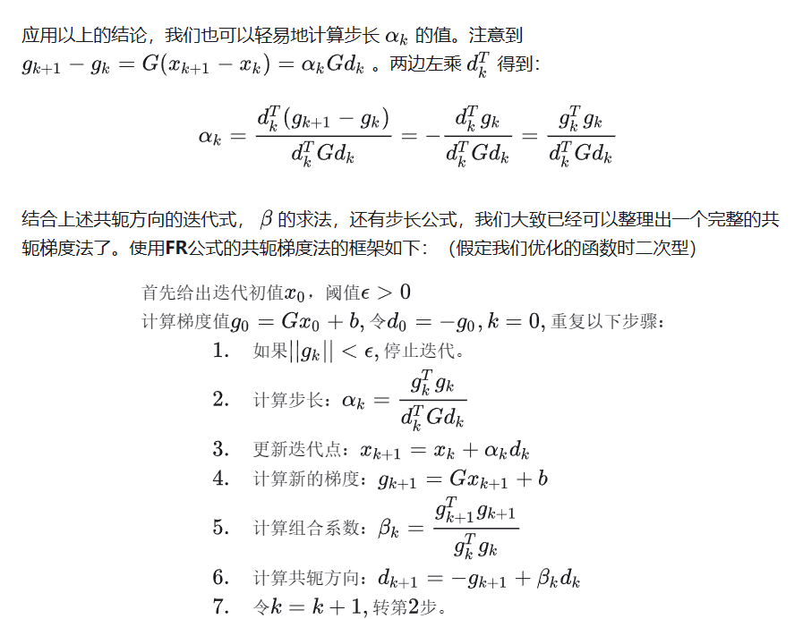
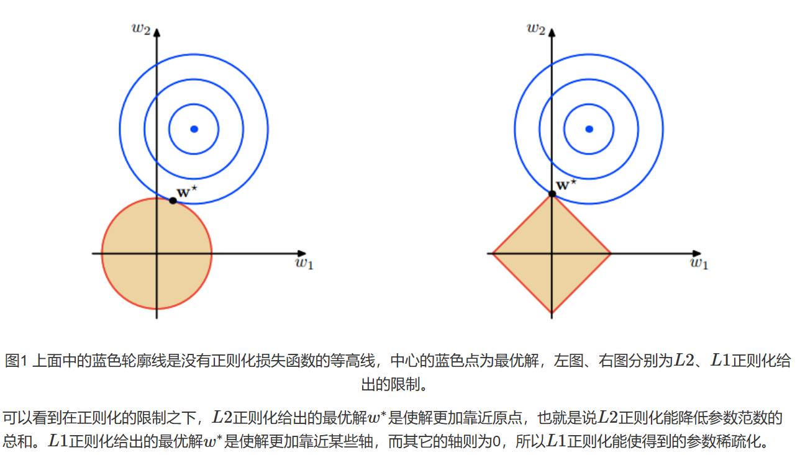

# Lec04 非线性数值优化

[关于优化的书](./assets/bv_cvxbook.pdf)

!!! question "为什么要学习最优化？"
    - 图像处理问题大多可以描述为最优化问题
    - 最优化是机器学习/深度学习的基础
    - 方法论：几乎任何决策问题都可以建模成数学优化问题来求解

!!! question "如何把问题建模成最优化问题？"
    - 确定优化变量
    - 制定目标函数
    - 写出限制条件

## 线性回归问题

线性模型：

$$ b = \mathbf{a}^T \mathbf{x} $$

输入 $\mathbf(a)$ 和输出 $b$ 之间的关系是线性的。

{width=50%}

从数据中估计模型参数一般称为**模型拟合（model fitting）**或者**回归（regression）**

### 最小二乘法

最小化均方误差（Mean Square Error，简称MSE）

$$ \hat{x} = \arg \min_x \sum_{i=1}^n (b_i - \mathbf{a}_i^T \mathbf{x})^2 $$

- 残差：$r_i = b_i - \mathbf{a}_i^T \mathbf{x}$
- 残差向量：$\mathbf{R} = \mathbf{b} - \mathbf{A} \mathbf{x}=[r_1, r_2, \cdots, r_n]^T$

#### $L_2$ 范数

$L_2$ 范数：$\| \mathbf{x} \|_2 = \sqrt{\sum_{i=1}^n x_i^2}$，即向量的欧式距离

MSE 等于残差向量的 $L_2$ 范数的平方，即 $MSE = \| \mathbf{R} \|_2^2$

#### 统计解释

假设数据带有高斯噪音

$$ b_i = \mathbf{a}_i^T \mathbf{x} + n, n \sim \mathcal{G}(0, \sigma) $$

给定 $x$ 观察到$(a_i, b_i)$，我们可以写出似然函数

$$ p((a_i, b_i) | x) = P(b_i - \mathbf{a}_i^T \mathbf{x}) \propto \exp(-\frac{(b_i - \mathbf{a}_i^T \mathbf{x})^2}{2\sigma^2}) $$

假定观测数据点彼此独立，则联合似然函数如下：

$$ p((\mathbf{a}, \mathbf{b}) | x) = \prod_{i=1}^n p((a_i, b_i) | x) \propto \exp(-\frac{\| \mathbf{R} \|_2^2}{2\sigma^2}) $$

最大似然估计寻找使得似然函数最大的参数值，等价于最小化残差向量的 $L_2$ 范数的平方。

即：**最小二乘法等价于高斯噪声假设下的最大似然估计**

#### 非线性最小二乘法

一般的非线性模型： $b = f_x(a)$

定义残差：

$$ R(x)=\begin{pmatrix} b_1 - f_x(a_1) \\ b_2 - f_x(a_2) \\ \vdots \\ b_n - f_x(a_n) \end{pmatrix} $$

最大似然估计等效于最小化残差向量的 $L_2$ 范数的平方

$$ \hat{x} = \arg \min_x \| R(x) \|_2^2 $$

## 数值优化方法

### 有解析解

有些问题有解析解，例如线性最小二乘：

$$ \hat{x} = \arg \min_x \| \mathbf{A} \mathbf{x} - \mathbf{b} \|_2^2 $$

对 $x$ 求导并令导数为零，可以得到解析解：

$$ \hat{x} = (\mathbf{A}^T \mathbf{A})^{-1} \mathbf{A}^T \mathbf{b} $$

### 无解析解

通用策略：寻找一系列使目标函数不断下降的变量值完成优化

#### 梯度下降法

梯度下降法是一种迭代算法，每次迭代都沿着目标函数的负梯度方向更新变量值

$$ x_{k+1} = x_k - \alpha \nabla f(x_k) $$

##### 多变量函数求导与逼近

一阶近似:

$$ F(x_k + \Delta x) \approx F(x) + \mathbf{J} \Delta x $$

其中 $\mathbf{J}$ 是 $F$ 在 $x$ 处的雅可比矩阵：

$$ \mathbf{J} = \begin{pmatrix} \frac{\partial F}{\partial x_1} & \frac{\partial F}{\partial x_2} & \cdots & \frac{\partial F}{\partial x_n} \end{pmatrix} $$

二阶近似：

$$ F(x_k + \Delta x) \approx F(x) + \mathbf{J} \Delta x + \frac{1}{2} \Delta x^T \mathbf{H} \Delta x $$

其中 $\mathbf{H}$ 是 $F$ 在 $x$ 处的海森矩阵：

$$ \mathbf{H} = \begin{pmatrix} \frac{\partial^2 F}{\partial x_1^2} & \frac{\partial^2 F}{\partial x_1 \partial x_2} & \cdots & \frac{\partial^2 F}{\partial x_1 \partial x_n} \\ \frac{\partial^2 F}{\partial x_2 \partial x_1} & \frac{\partial^2 F}{\partial x_2^2} & \cdots & \frac{\partial^2 F}{\partial x_2 \partial x_n} \\ \vdots & \vdots & \ddots & \vdots \\ \frac{\partial^2 F}{\partial x_n \partial x_1} & \frac{\partial^2 F}{\partial x_n \partial x_2} & \cdots & \frac{\partial^2 F}{\partial x_n^2} \end{pmatrix} $$

##### 下降方向

对目标函数 $F(x)$ 在 $x_0$ 处进行一阶近似：

$$ F(x_0 + \Delta x) \approx F(x_0) + \mathbf{J} \Delta x $$

当 $\mathbf{J} \Delta x<0$ 时，$\Delta x$ 是下降方向($\Delta x$ 要足够小的

##### 最速下降法

当 $\Delta x$ 的方向与负梯度方向相同时，下降最快

##### 步长选择

穷举太耗时，我们选择回溯法：

1. 选择一个较大的初始步长 $\alpha$
2. 减小 $\alpha$ 直到目标函数值下降

!!! note ""

    - 优点：
        - 实现简单计算量少
        - 在距离最优值较远时往往表现很好（启动快）
    - 缺点：
        - 在最优值附近收敛缓慢
        - 当能量函数性质不好时会浪费很多迭代

    !!! note "为什么收敛慢？"
        - 只利用了一阶梯度信息
        - 没有利用曲率信息

#### 共轭梯度法

[好的笔记](http://hliangzhao.me/materials/CG.pdf)

共轭梯度法是一种迭代算法，每次迭代都沿着共轭方向更新变量值

给定一个二次型目标函数：

$$ f(x) = \frac{1}{2} x^T \mathbf{A} x - b^T x $$

!!! note "为什么是这个函数？"

    其求导后，$f'(x)=\frac12A^Tx+\frac12Ax-b=Ax-b$，因为 $A$ 正定，所以 $f'(x)=0$ 时 $f(x)$ 取最小值

    取到最小值时 $x=\mathbf{A}^{-1}b$，即为我们要求的解

    

    当对称且正定时，才会有一条曲线，这条曲线就是我们的等高线。

!!! note "长什么样？"

    

    

$\mathbf{A}$包含了局部的曲率信息，我们可以知道哪里有峡谷。利用局部曲率信息，我们可以沿着狭长的峡谷更快下降。

{width=50%}

- 最速下降法中
    - 下降方向互相垂直 = 各个方向同等对待  
- 共轭梯度法
    - 下降方向互相“共轭”
    - 如果把空间稍微拉伸一下后，下降方向就会变成互相垂直的

!!! note "什么是共轭"
    

    

最速下降法每次更新一般都会改变迭代点的所有维度的值，因此，每次迭代一次后得到的迭代点就不一定是之前搜索方向上的最优点了。反观共轭方向法，共轭方向法每次只在影响一个维度的方向上搜索。共轭梯度法表现为逐维度搜索（也就是沿着坐标轴搜索），每次搜索只更新迭代点一个维度的值，而且每次迭代保证那个维度达到最优，那么如果优化目标的空间是 $n$ ​维空间，那么我们至多经过​ $n$ 次搜索就可以达到最优点，而且这个次数与Hessian矩阵的条件数无关。

在标准的欧式空间中，正交与共轭等价，假设我们的两个搜索方向是 $\mathbf{d}_1$ 和 $\mathbf{d}_2$，那么很显然 $\mathbf{d}_1^T \mathbf{d}_2 = 0$。然后我们将上图中对空间的线性变换记为 $\mathbf{Q}$，那么在对空间做线性变换后，度量空间由 $\mathbf{I}$ 变为了 $\mathbf{Q}$，而我们搜索方向的“这种性质”依旧存在，而我们的这个变换并不是仿射变换，因此，原空间内的0在 $\mathbf{Q}$ 度量的意义下还是0。所以 $\mathbf{d}_1^T \mathbf{Q} \mathbf{d}_2 = 0$ 在线性变换后变为：

$$ \mathbf{d}_1^T \mathbf{Q} \mathbf{d}_2 = 0 $$

这就是共轭的定义。

如果一组方向 $\mathbf{d}_0, \mathbf{d}_1, \cdots, \mathbf{d}_{n-1}$ 中的任意两个向量都是共轭的，那么这组向量就称为共轭向量组。

##### 共轭方向

对于一般的二次型函数，假设最优点为​ $x^*\in \mathbb{R}^n$，那么顺着共轭向量组走，每步的更新满足：

$$ \begin{aligned}x_{k+1} = x_k + \alpha_k \mathbf{d}_k \\
\alpha_k = \arg\min_{\alpha} f(x_k + \alpha \mathbf{d}_k) \end{aligned} $$

那么最多走 $n$ 步就可以到达最优点。既然这么爽，那么对于一个二次型，我们怎么获得它对应的一个共轭向量组呢？

##### 共轭梯度法的推导

!!! note ""
    共轭梯度法就是通过仿射变换将整个空间扭曲成A正交的空间，然后实现在直角坐标空间下不可能实现的改进的最速下降方法。

那我们试试吧！我们的目标函数是 $f(x)=\frac12x^TQx$ ，我们对 $x$ 做线性变换，使得 $x$ 变为 $Ux$ ,那么函数就为 $\bar{f}(x)=f(Ux)=\frac12x^TU^TQUx$ 。做到这儿了，我们当然希望确定 $U$ 使得 $U^TQU$ 是对角矩阵，但是这个地方我们可以偷个懒，直接暴力将 $U^TQU$ 变成 $I$：要是我们能将 $Q$ 拆成两半，给两边的 $U$ 一人一半，然后我们把 $U$ 取为那个一半的逆矩阵，不就可以暴力化成单位阵了吗？

由于二次型的$Q$ 是正定对称的(正定是大前提),因此 $Q$ 存在平方根 $A$,满足 $Q=AA$ ,所以 $\bar{f}(x)=\frac{1}{2}x^TU^TAAUx=\frac{1}{2}x^T(AU)^T(AU)x$ 。我们只要令 $U=A^{-1}$ 不就如愿以偿了吗？由于 $A=P^{-1}diag(\sqrt{\lambda_1},\ldots,\sqrt{\lambda_n})P$，其中 $P$ 是正交矩阵，$\lambda_i$ 是 $Q$ 的第 $i$ 个特征值。因此 $A$ 一定存在逆矩阵，所以我们的 

$$U=A^{-1}=P^{-1}diag(\frac{1}{\sqrt{\lambda_{1}}},\ldots,\frac{1}{\sqrt{\lambda_{n}}})P$$

对于横纵坐标完全垂直的椭圆，我们很容易知道，其Hessian矩阵为对角阵。我们有 $(e_1,\ldots,e_n)$ 为其共轭向量组，我们把它们拼成一个矩阵，很显然，这个矩阵就是一个单位阵 $I$。

对于一般情况，我们在 $I$ 的基础上将上述线性空间内的共轭向量组再映射到标准的 $I$ 度量的空间可以得到，这组共轭向量组拼成的矩阵为

$$UI=U=P^{-1}diag(\frac{1}{\sqrt{\lambda_{1}}},\cdots,\frac{1}{\sqrt{\lambda_{n}}})P$$

所以我们想要的共轭向量组为 $(u_1,\ldots u_n)$ ,也就是 $U$ 的列向量组或是行向量组。

!!! note ""
    $i\neq j$ 时，

    $\frac{1}{2}{u_i}^TQu_j=\frac{1}{2}{u_i}^TAAu_j=\frac{1}{2}{(Au_i)}^T(Au_j)=\frac{1}{2}{e_i}^T{e_j}=0$

!!! note "共轭方向法"

    对于正定二次型来说，我们刚才直接一下子得到了它的一组共轭向量组。然而对于一个一般的函数，想要一下获取它的一组共轭向量组很难做到，如果我们故技重施，只使用一次线性变换就妄想得到一个Hessian矩阵为对角阵的二次型未免过于理想，多次线性变换又会变得难以分析，所以，我们一般会通过迭代的方式来获取下一个与当前搜索方向共轭的方向，而不是一次获取整个共轭向量组。

    因此，这确定了我们的共轭方向法算法的框架。

    

    > 注意，这是共轭方向法，共轭梯度法（CG）是实现共轭方向法的一个方法。由于CG是通过梯度信息来获取共轭方向的，所以我们称之为共轭梯度法。

共轭梯度法是一种典型的共轭方向法，搜索方向的构造要求如下：

- 所以的搜索方向是相互共轭的。
- 搜索方向 $d_k$ 是关于梯度 $g_k$和 $d_{k-1}$ 的线性组合，即 $d_k = -g_k + \beta_{k-1} d_{k-1}$

!!! note "这时候，我们大概就可以理解PPT上公式的含义了"
    

    就是每一次把（`当前 x 梯度的负方向` 减去`上一次搜索方向在这上面的共轭投影`）作为下一次的搜索方向。

接下来我们进行 $\beta$ 的推导，[知乎文章](https://zhuanlan.zhihu.com/p/338838078)，对应PPT上的也是那个$\beta$，PPT上的和这里的符号系统不一样

!!! note ""
    

**Hestenes-Stiefel公式**

**Crowder-Wolfe公式**

**Fletcher-Reeves公式**

**Dixon公式**

!!! note "总结"

    

##### 步长选择

#### Newton-Raphson | 牛顿法

!!! note ""
    共轭梯度法在最优值附近收敛慢

    什么方法能快速收敛？—— 牛顿法

[知乎文章](https://zhuanlan.zhihu.com/p/293951317)

!!! note ""
    也就对应 PPT 里的

    

#### Gauss-Newton | 高斯牛顿法

!!! note ""
    牛顿法需要计算 Hessian 矩阵，计算量大

    什么方法能减少计算量？—— 高斯牛顿法

[知乎文章](https://zhuanlan.zhihu.com/p/113946848)

为了避免求解 Hessian 矩阵，我们选取了误差函数 $f(x)$ 来进行优化求解，以下采用 $J(x)$代替 Hessian 矩阵。

#### Levenberg-Marquardt

该方法是在高斯牛顿法的基础上进行的改进，基本的思路和原理和高斯牛顿法一样。

上文说到 $JJ^T$ 不可逆时算法不收敛，LM法就是为了解决这个问题的。

## Constrained optimzation | 约束优化

### 凸优化

### 正常值与离群值

{width=50%}

1. 正常值（Inlier）：满足模型/噪音假设的数据点
2. 离群值（Outlier）：不满足模型/噪音假设的错误点
    - 离群值会让最小二乘回归失败
        - MSE（平方误差）与残差平方成正比
        - 受离群值影响过大
            1. 如何降低离群值的影响？
                - 用其他目标函数替换MSE，降低对离群值的惩罚
                    - 例如L1范数、Huber函数
                - 这种目标函数一般称为鲁棒函数

{width=50%}

### RANSAC

RANSAC: Random Sample Concensus
- 目前最常用的处理离群值的方法
- 核心思想：
    - Inlier的分布总是相似，outlier的分布各有各的不同
    - 用数据点对可能的模型参数进行投票

## 病态问题

病态问题指的是问题的解不唯一，例如 $Ax=b$ 中方程数小于未知数个数，这时候就会有无穷多个解。

为了解决病态问题，我们可以使用正则化方法——通过添加先验知识来约束解的性质

### L2正则化

$$ \hat{x} = \arg \min_x \| \mathbf{A} \mathbf{x} - \mathbf{b} \|_2^2 + \lambda \| \mathbf{x} \|_2^2 $$

L2正则可以让 $x$ 的值趋向于0，可以用来抑制冗余信息

### L1正则化

$$ \hat{x} = \arg \min_x \| \mathbf{A} \mathbf{x} - \mathbf{b} \|_2^2 + \lambda \| \mathbf{x} \|_1 $$

L1正则可以让 $x$ 的值稀疏，可以用来筛选特征

