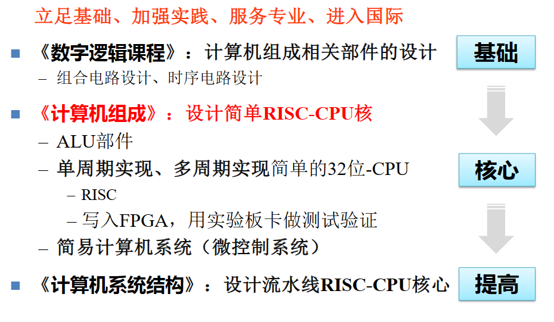

# Computer Organization & Design

!!! note ""

    
    课程评分方法：

    - 平时占 20%：作业、课堂、阅读
    - 期中闭卷(英文)考试(统一时间段)，10%
    - 期末闭卷(英文)考试 40%
    - 实验占 30%
        - Lab00~03: 基本实验 30%
        - Lab04 :单周期CPU 30%
        - Lab05 : 流水线CPU 40%
        - 附加分奖励：优秀作品 (附加后不超过100分)

    注：卷面成绩不到45分(满分100分)者，总评不及格。

## Preface

