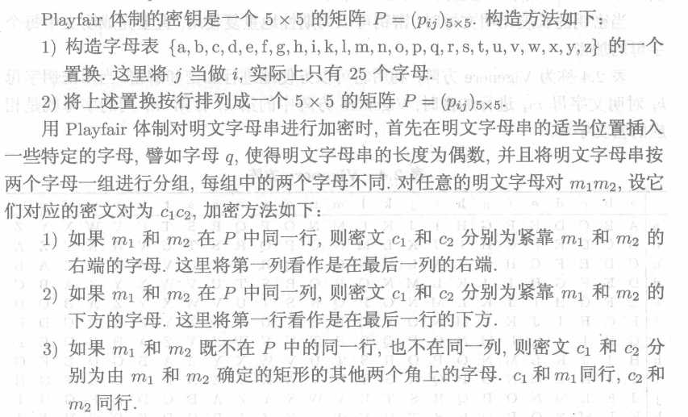
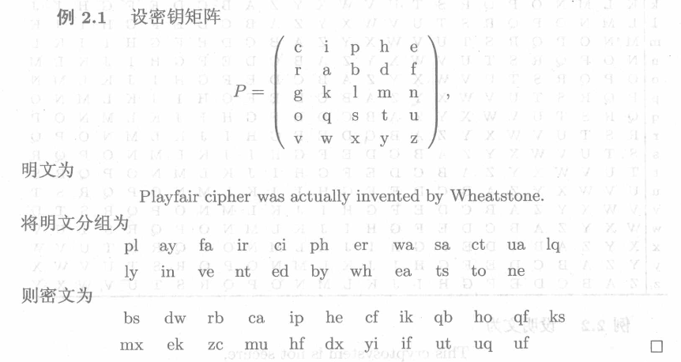

# 古典密码

## Playfair (P.10)

!!! note "Example"

    

## Vigenere (P.11)

> 多表简单相加的算法

加密算法: $y = (x+k_i) \% n$;

解密算法: $x = (y-k_i) \% n$;

例如:

明文 = this crypto system is not secure(19,7,8,18,2,17,24,15,19,14,...)

密钥=cipher cipher cipher ...(2,8,15,7,4,17)

密文=VPXZGIAXIV...(21,15,23,25,6,8,0,23,8,21,...)

## Beaufort (P.12)

## Enigma

1. plugboard
假定接线板设置为:A-B, C-D
char plug[27]	= 
 "BADCEFGHIJKLMNOPQRSTUVWXYZ";
/*ABCDEFGHIJKLMNOPQRSTUVWXYZ*/

S->S

1. rotor I
char rotor[27]=
  "EKMFLGDQVZNTOWYHXUSPAIBRCJ";
// ABCDEFGHIJKLMNOPQRSTUVWXYZ

S->T->P->O

1. rotor II
AJDKS IRUXB LHWTMCQGZNPYFVOE  
ABCDE FGHIJ KLMNOPQRSTUVWXYZ    

O->M

4. rotor III
BDFHJ LCPRT XVZNY EIWGAKMUSQO      
ABCDE FGHIJ KLMNO PQRSTUVWXYZ

M->Z

5. reflector
YRUHQ SLDPX NGOKMIEBFZCWVJAT
ABCDE FGHIJ KLMNOPQRSTUVWXYZ

Z->T

1. rotor III
"BDFHJ LCPRT XVZNY EIWGA KMUSQO";
/ABCDE FGHIJ KLMNO PQRST UVWXYZ

T->J

1. rotor II

AJDKS IRUXB LHWTM CQGZN PYFVOE  
ABCDE FGHIJ KLMNO PQRST UVWXYZ    

J->B

1. rotor I

EKMFL GDQVZ NTOWY HXUSPAIBRCJ
ABCDE FGHIJ KLMNO PQRSTUVWXYZ

B->L

1. plugboard
BADCEFGHIJKLMNOPQRSTUVWXYZ
ABCDEFGHIJKLMNOPQRSTUVWXYZ
