# 图像信息处理

!!! note "图像成像的各种形式"
    可见光、X射线、超声波、红外线

!!! note "图像信息处理涵盖的方面(what is image processing)"

    1. Image acquisition(图像获取)

        Automatic aperture correction and color balance(自动光圈校准和颜色平衡)

        Image reconstruction（图像修复）

    2. Display and print

        Automatic size adjustment（自动大小调整）

        Color correction (CMYK vs. RGB)（颜色校正）

    3. Storage and Transmission（存储和传输）

        High efficient storing: less temporal-spatial  cost（高效的存储以及较低的时空消耗）

        Convenient transmission: Lossless, efficient, and secure（便利的传输）

    4. Enhancement and restoration（增强与修复）

        Image restoration：Inpainting（图像的修补）

        Improve visual effect：dehazing, retinex, deblur, super-resolution（增强可视性）

    5. Recognition and understanding

        Character recognition：OCR，object detection: face detection（物体探测，文字识别）

        Scene understanding：image  retrieval, scene classification（场景理解，图像检索，场景分类）

!!! note "图像的压缩"

    目的：存储图像信息

    图像特点：以像素为单位，矩形区域

    Encoding methods： 不压缩，无损压缩，有损压缩

    Representative formats：BMP, JPEG, TIFF, GIF, PNG

!!! note "BMP图像的调色板"

    大小：N\*4 bytes，1 byte rgbBlue to specifies the blue part of the color, 1 byte rgbGreen to specifies the green part of the color, 1 byte rgbRed to specifies the blue part of the color

    1 byte rgb Reserved must always be set to zero

!!! note "BMP图像的存储"

    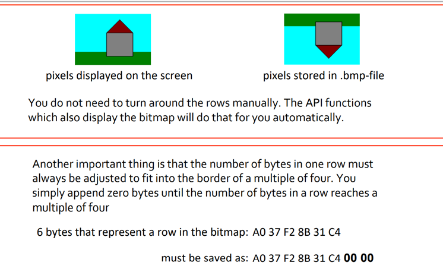

!!! note "光圈对于成像的影响"

    光圈孔径大的时候，会导致模糊，但同时如果孔径太小，可通过的光线就会很少，导致光强太弱，同时当孔径小到一定程度时，会发生衍射现象。

!!! note "弥散圆(circle of confusion)"

    通过使用透镜可以会聚更多的光线到一个成像点，只是只有在特殊的位置上才能达到这个目标，即大家以前就学习过的透镜聚焦。位于合适距离的物体点可以成清晰像，其他的点则会产生弥散圆。在焦点前后，光线开始聚集和扩散，点的影像变模糊，形成一个扩大的圆。如果弥散圆的直径小于人眼的鉴别能力，在一定范围内实际影像产生的模糊是不能辨认的。不能辨认的直径叫做容许弥散圆。焦点前后各有一个容许弥散圆。对于6寸照片，观察距离25－30cm ，大概是底片对角线1/1000-1/1500，

!!! note "光圈的大小与景深有密切关系"

    焦点前后各有一个容许弥散圆，他们之间的距离叫做景深。景深随镜头的焦距、光圈值、拍摄距离而变化

    (1) 镜头光圈：光圈越大，景深越小；光圈越小，景深越大；

    (2) 镜头焦距：镜头焦距越长，景深越小；焦距越短，景深越大；

    (3) 拍摄距离：距离越远，景深越大；距离越近，景深越小

!!! note "数码相机拍照6步曲"

    (1)摄景物时，景物反射的光线通过数码相机的镜头透射到CCD上。

    (2)当CCD曝光后，光电二极管受到光线的激发而释放出电荷，生成感光元件的电信号。

    (3) CCD控制芯片利用感光元件中的控制信号线路对发光二极管产生的电流进行控制，由电流传输电路输出，CCD会将一次成像产生的电信号收集起来，统一输出到放大器。

    (4)经过放大和滤波后的电信号被传送到ADC，由ADC将电信号（模拟信号）转换为数字信号，数值的大小和电信号的强度与电压的高低成正比，这些数值其实也就是图像的数据。

    (5)此时这些图像数据还不能直接生成图像，还要输出到DSP（数字信号处理器）中，在DSP中，将会对这些图像数据进行色彩校正、白平衡处理，并编码为数码相机所支持的图像格式、分辨率，然后才会被存储为图像文件。

    (6)当完成上述步骤后，图像文件就会被保存到存储器上,我们就可以欣赏了。

!!! note "色彩的分类（彩色和消色）"

    色彩可以分为彩色（chromatic color）和消色（achromatic color）两大类。

    彩色是指红、黄、蓝等单色以及它们的混合色。彩色物体对光谱各波长的反射具有选择性，所以它们在白光照射下呈现出不同的颜色。

    消色，又称非彩色，也就是我们通常所说的灰度，是指白色，黑色以及各种深浅不同的灰色。消色物体对光谱各波长的反射没有选择性，它们是中性色。

!!! note "需要了解（波长以及视网膜细胞）"

    色觉是指不同波长的光线作用于视网膜而在大脑中引起的感觉。人眼可见光线的波长是390nm～780nm，一般可辨出包括紫、蓝、青、绿、黄、橙、红7种主要颜色在内的120～180种不同的颜色。

    视网膜是人眼中最重要的组成部分，就像相机里的感光底片，专门负责感光成像。视网膜上分布着两种视觉细胞，一种为杆状体，另一种为锥状体。杆状体细胞比较多，大约有上亿个，它对光极为灵敏，但没有区分色彩的能力。锥状体细胞则只有六、七百万个，它要在较强的照度下才能激发，它的存在使我们能够辨别各种不同的颜色。

!!! note "三原色是目前最为代表性的色觉机制解释："

    在视网膜上存在着三种分别对红、绿和蓝光线的波长特别敏感的视锥细胞或相应的感光色素，当不同波长的光线进入人眼时，与之相符或相近的视锥细胞发生不同程度的兴奋，于是在大脑产生相应的色觉；三种视锥细胞若受到同等程度的刺激，则产生消色。

!!! note "感知的优先程度和敏感度"

    优先程度：同等条件下，人们往往会注意到色调（Hue, H）的变化，然后是饱和度（Saturation, S），然后是亮度（Value, V）。

    敏感度：人眼对于亮度的变化最为敏感，分辨能力最强。恰好与人眼的高动态能力相匹配。

!!! note "颜色空间的定义"

    与设备相关：RGB, CMY, HSV

    与设备无关：

    (1) CIE XYZ: XYZ 三刺激值的概念是以色视觉的三元理论为根据的，它说明人眼具有接受三原色(红、绿、蓝)的接受器，而所有的颜色均被视作该三原色的混合色。1931年CIE制定了一种假想的标准观察者，设置配色函数.XYZ三刺激值是利用这些标准观察者配色函数计算得来的。在此基础上，CIE于1931年规定了Yxy颜色空间，其中Y为亮度，x,y是从三刺激值XYZ计算得来的色坐标。它代表人类可见的颜色范围。

    (2) CIE L\*a\*b: L\*a\*b\* 颜色空间是在1976年制定的，它是CIE XYZ颜色模型的改进型，以便克服原来的Yxy颜色空间存在的在x，y色度图上相等的距离并不相当于我们所觉察到的相等色差的问题。它的“L”（明亮度），“a”（绿色到红色）和“b”(蓝色到黄色)代表许多的值。与XYZ比较，CIE L\*a\*b\*颜色更适合于人眼的感觉。利用CIE L\*a\*b\*，颜色的亮度（L）、灰阶和饱和度（a,b）可以单独修正，这样，图像的整个颜色都可以在不改变图像或其亮度的情况下，发生改变。

    (3) CIE YUV: 在现代彩色电视系统中，通常采用三管彩色摄像机或彩色CCD（电荷耦合器件）摄像机，它把摄得的彩色图像信号，经分色，分别放大校正得到RGB，再经过矩阵变换电路得到亮度信号Y和两个色差信号R－Y、B－Y，最后发送端将亮度和色差三个信号分别进行编码，用同一信道发送出去。这就是我们常用的YUV颜色空间。采用YUV颜色空间的重要性是它的亮度信号Y和色度信号U、V是分离的。如果只有Y信号分量而没有U、V分量，那么这样表示的图就是黑白灰度图。

    更接近人的对颜色的感知差异：HSV

!!! note "RGB颜色空间"

    RBG颜色模型是三维直角坐标颜色系统中的一个单位正方体，在正方体的主对角线上，各原色的量相等，产生由暗到亮的白色，即灰度。（0，0，0）为黑，（1，1，1）为白，正方体的其他6个角点分别为红、黄、绿、青、蓝和品红。RGB颜色模型构成的颜色空间是CIE原色空间的一个真子集。RGB颜色模型通常用于彩色阴极射线管和彩色光栅图形显示器（计算机和电视机采用）。

!!! note "CMY颜色空间"

    油墨或颜料的3种基色是以红、绿、蓝三色的补色青（Cyan）、品红（Magenta）、黄（Yellow）为基色。用CMY模型产生的颜色称为相减色，是因为它减掉了为视觉系统识别颜色所需要的反射光

!!! note "CMY空间与RGB空间互补"

    也就是用白色减去RGB空间中的某一颜色值就等于同样颜色在CMY空间中的值。RGB是光合色，颜色是基于光线进行混合的。黑色是各种颜色的空白状态，没有任何颜色。这时若要产生颜色，就要通过增加各种色彩的光线来产生，当各类色彩都加到最大值后形成了白色。

!!! note "HSV颜色空间"

    颜色空间是从人的视觉系统出发，用色调（Hue)、色饱和度（Saturation）和亮度（Intensity，或者Value）来。圆锥的顶面对应于V=1，它包含RGB模型中的R=1，G=1，B=1三个面，故所代表的颜色较亮。色度H由绕V轴的旋转角给定。红色对应于角度0o，绿色对应于角度120o，蓝色对应于角度240o。描述颜色。在圆锥的顶点处，V=0，H和S无定义，代表黑色。HSV颜色模型构成的是一个均匀的颜色空间，采用线性的标尺，彩色之间感觉上的距离与HSV颜色模型坐标上点的欧几里德距离成正比。

    {width=50%}

!!! note "JPEG压缩的基本思想"

    压缩策略：根据压缩比要求，从高频到低频逐步削减信息

    好处：高频信息占用存储空间大，减少高频信息更容易获得高压缩比；低频信息可以保留物体的基本轮廓和色彩分布，最大限度维持图像质量；适合用于互联网的视觉媒体。

!!! note "RLE 行程编码"

    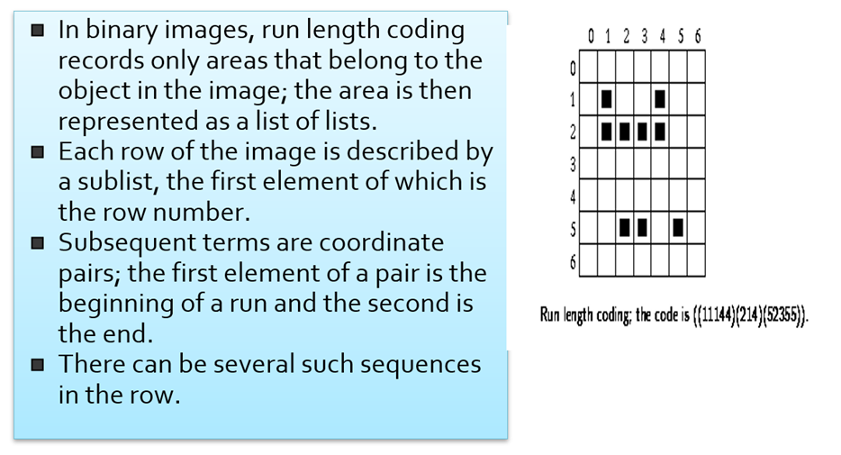

    首先第一个数字记录行数，其次的数字分别表示一个连续序列的起始列和末尾列，如第一行，（1，1）仅一个像素，所以为11，之后的4也仅为1个像素，所以也是44。因此最终结果为（11144），而第二行的从第一个像素到第四个像素均连续，因此只需要一个14即可表示，所以最后第二行的输出结果为（214）。

!!! note "二值化的优点缺点"

    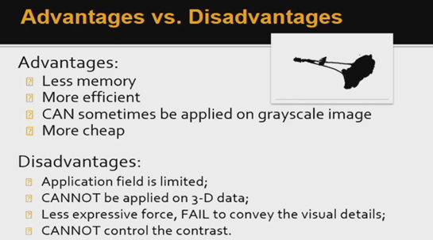

!!! note "二值化图像的获得"

    

!!! note "如何选取一个好的阈值"

    Step 1: 确定原始图像中像素的最大值和最小值；

    Step 2: 最小值加1作为threshold对原始图像进行二值化操作；

    Step 3: 根据对应关系确定前景和背景，分别计算当前threshold下的内部协方差和外部协方差；

    Step 4: 回到Step 2直到达到像素最大值；

    Step 5：找到最大外部和最小内部协方差对应的threshold.

!!! note "大津算法的简单推导"

    

!!! note "全局二值化不一定好（选择局部二值化）"

    局部自适应操作设定一个局部窗口，在整个图像上滑动该窗口；对于每一窗口位置，确定针对该窗口的threshold。

!!! note "形态学膨胀、腐蚀、开、闭操作以及物理意义"

    

    膨胀是将与物体“接触”的所有背景点合并到该物体中，使边界向外部扩张的过程。可以用来填补物体中的空洞（其中“接触”的含义由结构元描述）。

    

    

    腐蚀的物理意义：腐蚀是一种消除边界点，使边界向内部收缩的过程。可以用来消除小且无意义的物体。

    

    膨胀：

    由B对A膨胀所产生的二值图象D是满足以下条件的点(x,y)的集合：如果B的原点平移到点(x,y)，那么它与A的交集非空。

    腐蚀：

    由B对A腐蚀所产生的二值图象E是满足以下条件的点(x,y)的集合：如果B的原点平移到点(x,y)，那么B将完全包含于A中。

    填洞：

    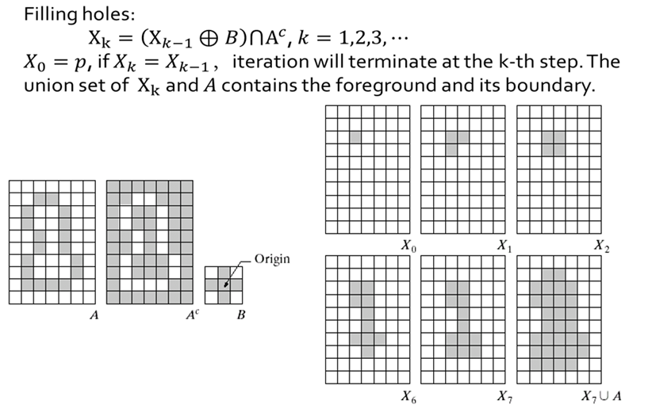

    开操作：

    先腐蚀，后膨胀；用来消除小物体、在纤细点处分离物体、平滑较大物体的边界的同时并不明显改变其面积。

    闭操作：

    先膨胀，后腐蚀；用来填充物体内细小空洞、连接邻近物体、平滑其边界的同时并不明显改变其面积。

!!! note "韦伯定律在灰度图上的应用"

    假设连续两个灰度级之间的亮度差异就是韦伯定律中的可视临界值，那么

    

    正常人眼所能看到的灰度级约为156

!!! note "可视化增强：以对数操作为例"

    

    为了增强图像的可视信息，对图像中的像素进行基于对数的操作

    Ld是显示亮度，Lw是真实世界亮度，Lmax是场景中的最亮值。

    这个映射能够确保不管场景的动态范围是怎么样的，其最大值都能映射到1（白），其他的值能够比较平滑地变化。

!!! note "直方图均衡化的理论与实践以及为什么没有做到真正均衡"

    连续性：将原图像的非均匀分布的直方图通过变换函数T修正为均匀分布的直方图，然后按均衡直方图修正原图像。图像均衡化处理后，图像的直方图是平直的，即各灰度级具有相同的出现频数。

    

    

    

    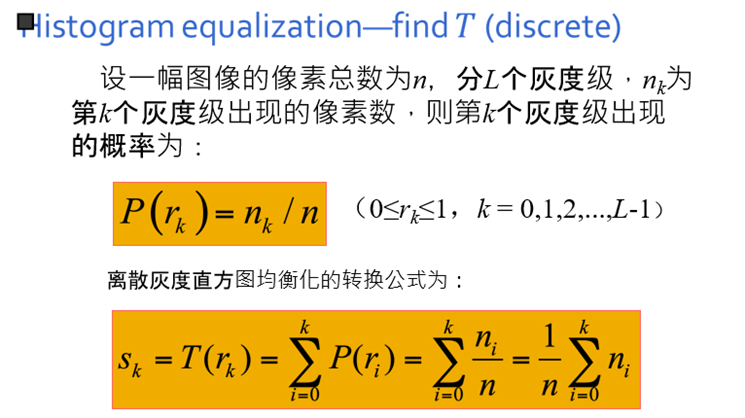

    

    所得的sk不可能正好等于8级灰度值中的某一级，因此需要就近归入某一个灰度级中。这样，相邻的多个sk就可能落入同一个灰度级，需要将处于同一个灰度级的像素个数累加。因此，离散灰度直方图均衡化操作以后，每个灰度级处的概率密度（或像素个数）并不完全一样。直方图均衡化实质上是减少图像的灰度级以换取对比度的加大。在均衡过程中，原来的直方图上出现概率较小的灰度级被归入很少几个甚至一个灰度级中，故得不到增强。若这些灰度级所构成的图象细节比较重要，则需采用局部区域直方图均衡化处理。

!!! note "直方图变换的一些应用"

    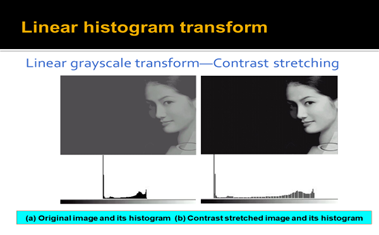

    

    

!!! note "几何变换"

    列举简单的几何变换：平移，旋转，缩放，错切，镜像

    

!!! note "几何变换后是否需要插值，列举一些插值的例子"

    行插值：按顺序寻找每一行中的空洞像素，设置其像素值与同一行中前一个像素的像素值相同。

    最近邻插值：

    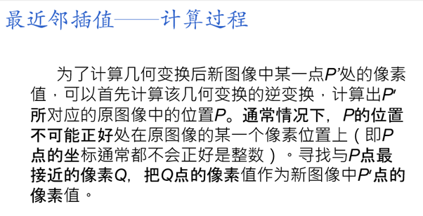

    双线性插值：

    （1）定义双线性方程g(x,y)=ax+by+cxy+d。

    （2）分别将A、B、C、D四点的位置和灰度代入方程，得到方程组。

    （3）解方程组，解出a、b、c、d四个系数。

    （4）将P点的位置代入方程，得到P点的灰度。

!!! note "Morph的方法"

    原理：让图a中每个像素的颜色，逐渐变成图b相同位置像素的颜色。

    方法：根据变换的快慢，设置相应的步长，将图a每一点的RGB逐渐变成图b相同位置像素的RGB。可以选择等比或等差的方式，对于灰度图像，可以直接用等比或等差级数定义步长，使颜色从原图变到目标图。对于彩色图像，RGB三色同时从原图变到目标图像。可以分别变化，也可考虑RGB的相对比例关系同时变化。

    

!!! note "表情比例图的方法"

    

!!! note "一维卷积"

    

    

    

    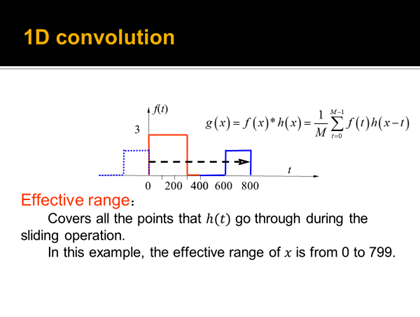

!!! note "卷积在图像处理中的意义"
    （对像素加权求和）

!!! note "滤波（均值滤波和中值滤波）"

    均值滤波：

    

    中值滤波（不会变的那么糊）：

    

!!! note "拉普拉斯（优点缺点）"

    拉普拉斯算子：

    

    

    优点：锐化图像

    缺点：使得噪声点更加明显

!!! note "双边滤波"

    基本思想：

    

    高斯滤波仅考虑了空间域，而双边滤波由于考虑了intensity domain，因此具有保边的作用

    式子中每个符号的意思：

    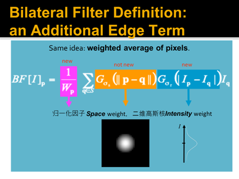

!!! note "双边滤波的加速"

    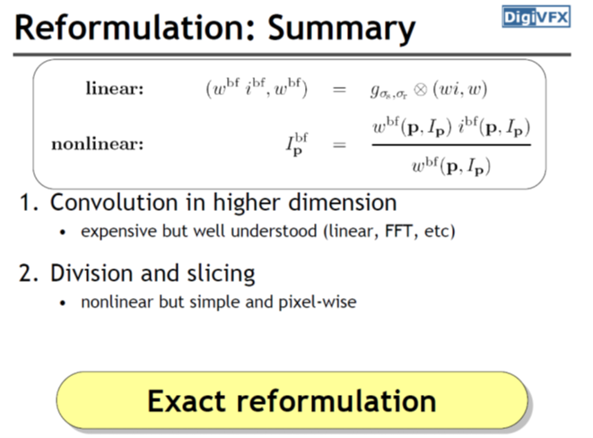

!!! note "Guided Filter（保梯度）"

除了保持边两边像素灰度级的差异，还保持梯度方向不发生变化（局部不会发生梯度逆转），而双边滤波保留的是difference的绝对值

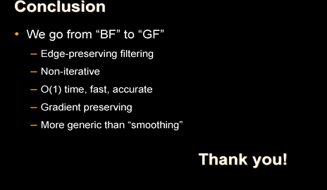

!!! note "sparse norm filter"

    l=1时候为中值滤波1=2时候高斯滤波，本质上求最小化

!!! note "用傅里叶变换解释发生了什么事情"

    

    

!!! note "FFT"

    

    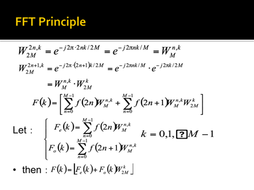

    

!!! note "相位和幅值的重要性（相位更重要）"

    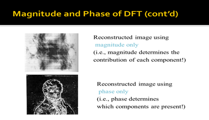

!!! note "能量函数推导H矩阵的过程"

    

    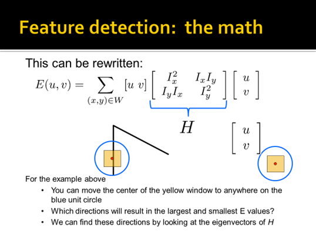

!!! note "Harris-corner Detector 对于灰度的变化，位移的变化，旋转的变化具有不变性，但对于尺度敏感，因而提出尺度不变检测如下"

    

!!! note "Harris-Laplace两步"

    

!!! note "SIFT特征的旋转不变性（计算直方图，投票最多的作为dominant orientation）"

    • Rotate patch according to its dominant gradient orientation

    • This puts the patches into a canonical orientation.

!!! note "SIFT的尺度不变性"

    

    第一步取16\*16的窗口，第5步将窗口分为了4\*4的格子，每一个直方图是八维向量

!!! note "SIFT的图像拼接"

    基本步骤

    

    RANSAC的基本步骤

    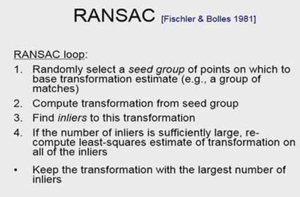

!!! note "SIFT的优缺点"

    

!!! note "SURF detectors and descriptors"

    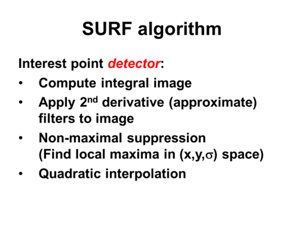

    1、 计算积分图

    2、 计算二阶导

    3、 非极大值抑制
    
    4、 最小二乘插值提升精度

    

    1、窗口分为4*4，16个cell

    2、计算类haar小波特征

    3、SURF是64维的向量，每一维的特征SIFT主要为方向，而SURF分别为1阶导和幅值，SIFT用赋值来筛选，SURF用了类haar小波特征。

!!! note "SURF相较于SIFT的优势"

    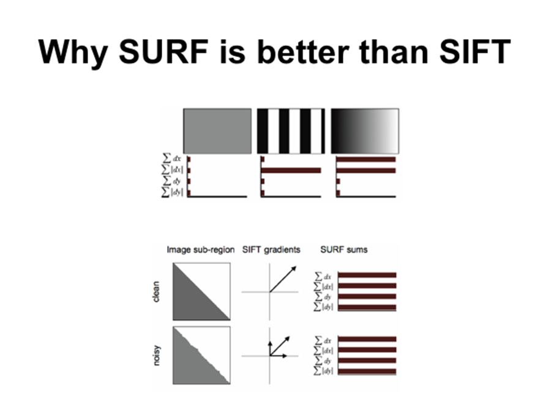

    SURF可以用于加速特征提取，SIFT特征不好算条纹类型，以及灰度值渐变的类型，SURF都可以计算，SIFT在计算有噪声时可能受到干扰，SURF抗干扰能力更强。

!!! note "BP"

    

!!! note "为什么要引进卷积神经网络（如何减少参数）"

    1、采用了局部连接，每个神经元其实没有必要对全局图像进行感知，只需要对局部进行感知，然后在更高层将局部的信息综合起来就得到了全局的信息。

    2、权值共享，把每个卷积核当作一种特征提取方式，而这种方式与图像等数据的位置无关。这就意味着，对于同一个卷积核，它在一个区域提取到的特征，由于图像的特征是稀疏的，也能适用于于其他区域。

    3、池化，降采样，只提取一些重要的特征，经过池化层之后，模型参数会减少很多。

!!! note "要具体了解池化的含义以及作用"

    池化（Pooling），在深度学习领域，特别是在卷积神经⽹络（CNN）中，是⼀种缩减采样（Downsampling）或⼦采样（Subsampling)技术，通常⽤于减少数据的维度，降低处理复杂度，同时保留重要的信息。池化操作可以减少模型对位置的敏感性，增加模型对⼩的变化和扰动的鲁棒性，并减少参数数量，从⽽帮助防⽌过拟合。
    
    常⻅的池化操作有：
    
    最⼤池化（Max Pooling）：在覆盖的区域内取最⼤值作为该区域的输出。
    
    平均池化（Average Pooling）：计算覆盖区域内所有元素的平均值作为输出。
    
    全局池化（Global Pooling）：例如全局平均池化（Global Average Pooling），在整个宽度和⾼度上进⾏池化，通常⽤在⽹络的最后⼏层，将每个特征图缩减为单个值。
    
    池化的意义主要体现在以下⼏个⽅⾯：特征不变性：通过池化，⽹络能够对输⼊图⽚中的⼩变动保持不变性，⽐如平移、旋转和缩放。
    
    降低维度：池化减少了后续层的输⼊数据的⼤⼩，这意味着计算量和参数数量降低，内存使⽤也减少。
    
    防⽌过拟合：由于减少了模型的参数数量和复杂度，池化有助于防⽌模型过度适应训练数据的细节，即过拟合现象。
    
    强化特征：最⼤池化有助于突出强特征，忽略不那么显著的特征。
    
    综上所述，池化是深度学习中⼀种重要的操作，它在简化⽹络结构的同时帮助提取和保留关键特征，对于构建⾼效和强⼤的卷积神经⽹络⾄关重要。

!!! note "考试第一题还考到数字图像为什么是现在主流的信息载体还是啥巴拉巴拉的，隐约记得老师说过是要点，但当时根本就没在意."
