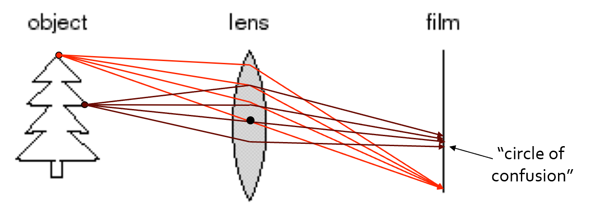
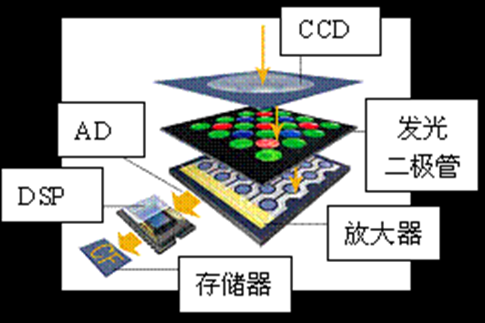
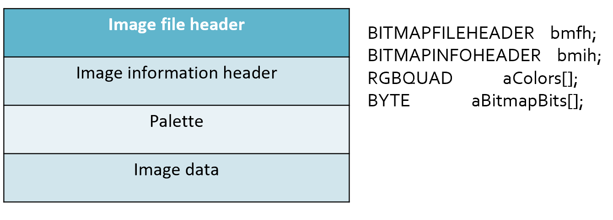
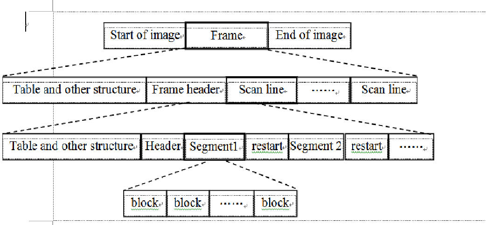
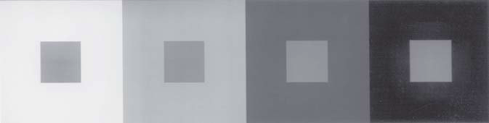
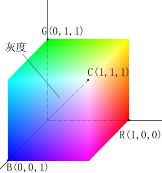
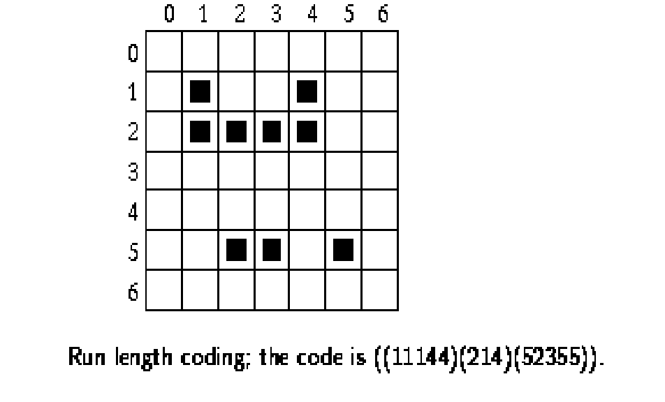

# 1 成像与图像的基本属性

## Basic Principle of Imaging

通过使用透镜可以会聚更多的光线到一个成像点，只是只有在特殊的位置上才能达到这个目标，即大家以前就学习过的透镜聚焦。位于合适距离的物体点可以成清晰像，其他的点则会产生弥散圆。

通过改变镜头的形状可以改变聚焦时的物体点所需要的距离。

**弥散圆**(circle of confusion) ：在焦点前后，光线开始聚集和扩散，点的影像变模糊，形成一个扩大的圆。如果弥散圆的直径小于人眼的鉴别能力，在一定范围内实际影像产生的模糊是不能辨认的。不能辨认的直径叫做容许弥散圆。焦点前后各有一个容许弥散圆。对于6寸照片，观察距离25－30cm ，大概是底片对角线1/1000-1/1500，

{:height="50%" width="50%"}

**数码相机的成像过程：**

1. 在拍摄照片时，场景中的光线经过镜头进入CCD。
2. 当CCD曝光后，光电二极管受到光线的激发而释放出电荷，生成感光元件的电信号。
3. CCD控制芯片利用感光元件中的控制信号点路对光电二极管产生的电流进行控制。CCD会将一次成像产生的电信号收集起来，统一输出到放大器。
4. 经过放大和滤波后的电信号被传送到ADC，由ADC将连续的电信号（模拟信号）转换为离散的数字信号，数字信号的值与电信号强度和电压成正比，这些值对应着图像中的像素。
5. 但是上述数据不能直接作为图像处理，它们需要进一步通过DSP(数字信号处理)处理。在DSP中，将会对这些图像数据进行色彩校正、白平衡处理，并编码为数码相机所支持的图像格式、分辨率，然后才会被存储为图像文件。
6. 当完成上述步骤后，图像文件就会被保存到存储器上,我们就可以欣赏了。

{:height="50%" width="50%"}

## Digital Image Representation

每个灰度图像可以看做是一个二维数组或者矩阵  

灰度图像(grayscale image)一般每个像素（pixel）用一个字节（8bit）表示，此时最大能表示[0,1,...,255]共256个灰度级。

在有色图中每个像素用24位来表示，每八位分别为R\G\B(有可能计算机中实际存储时是B\G\R的形式)

当前的大部分计算机采用 32 位来存储图像，多出来的八位是 $\alpha$ 通道, 用来表示透明度.

## 图像格式 | Image Format

目的: 存储图像信息  

图像的特点: 基于像素,矩形区域,信息量大。

操作系统不同，采用的软件不同，都会导致图像格式不一样。

编码方法: 无压缩, 有损压缩, 无损压缩

常见格式: BMP, JPEG, TIFF, GIF, PNG...

!!! Info
    手机里一般是 jpeg.  
    tiff 主要用于地理信息系统.  
    gif 是动态的.  
    互联网一般是 png.  

### BMP

BMP文件是Windows系统中的标准图像文件格式之一, 有时`.bmp`也以`.dib`文件的扩展名保存.  

大部分 BMP 文件是不压缩的形式, 但它本身还是支持图像压缩的，如 rle 格式（行程长度编码，runlength encoding）压缩格式等

我们来看看bmp的格式是什么样子的：



可以看到，bmp格式由图像文件头(Image file header)，图像信息头(Image information header)，调色板(Palette)，实际的图像数据(Image data)四部分组成

#### 图像文件头

第一部分是图像文件头`BITMAPFILEHEADER`，这是一个结构，其定义如下：

``` c
typedef struct tagBITMAPFILEHEADER {   
    WORD bfType;        // 2
    DWORD bfSize;       // 4
    WORD bfReserved1;   // 2
    WORD bfReserved2;   // 2
    DWORD bfOffBits;    // 4
} BITMAPFILEHEADER,*PBITMAPFILEHEADER;
```

这个结构的长度是固定的, 为 14 个字节( WORD 为无符号 16 位整数, DWORD 为无符号 32 位整数), 各个域的说明如下:

- **`bfType`**: 说明文件的类型。对BMP格式图像来说，该值必需是`0x4D42`，也就是字符串'BM'.(C 语言可用 fopen 读)  
- **`bfSize`**: 说明该位图文件的大小(包括这14个字节)，用字节为单位
- **`bfReserved1`**: 保留，必须设置为0
- **`bfReserved2`**: 保留，必须设置为0
- **`bfOffBits`**: 说明从文件头`BITMAPFILEHEADER`开始到实际的图像数据`Image Data`之间的字节偏移量。这个参数是非常有用的，因为位图信息头和调色板的长度会根据不同情况而变化，所以你可以用这个偏移值迅速的从文件中读取到位数据.  

#### 图像信息头

第二部分为位图信息头 `BITMAPINFOHEADER` , 也是一个结构, 其定义如下:

``` c
typedef struct tagBITMAPINFOHEADER{
    DWORD biSize;           // 4
    LONG biWidth;           // 4
    LONG biHeight;          // 4
    WORD biPlanes;          // 2
    WORD biBitCount;        // 2
    DWORD biCompression;    // 4
    DWORD biSizeImage;      // 4
    LONG biXPelsPerMeter;   // 4
    LONG biYPelsPerMeter;   // 4
    DWORD biClrUsed;        // 4
    DWORD biClrImportant;   // 4
} BITMAPINFOHEADER,*PBITMAPINFOHEADER;
```

这个结构的长度也是固定的, 为 40 个字节( LONG 为 32 位整数), 各个域的说明如下:

- **`biSize`**  
  
说明 BITMAPINFOHEADER(图像信息头) 结构所需要的字节数，也就是40

- **`biWidth`**  

说明图像的宽度，以像素为单位.  

- **`biHeight`**  

说明图像的高度，以像素为单位. 注：这个值除了用于描述图像的高度之外，它还有另一个用处，就是指明该图像是倒向的位图，还是正向的位图。如果该值是一个正数，说明图像是倒向的(头朝上脚朝下)，如果该值是一个负数，则说明图像是正向的。大多数的BMP文件都是倒向的位图，也就是说，高度值是一个正数.(操作系统中会提前处理以保证我们看到的是正向的)

- **`biPlanes`**  

为目标设备说明位面数，其值将总是被设为 1.  

- **`biBitCount`**  

说明每个像素多少位. 其值为1(黑白二色图)、4(16色图)、8(256色)、16(伪彩色)、24(真彩色)、或 32(不透明度+真彩色).

- **`biCompression`**  

说明图像数据压缩的类型，有效的值有 `BI_RGB`, `BI_RLE8`, `BI_RLE4`, `BI_BITFIELDS`。我们只讨论没有压缩的类型：`BI_RGB`.  

- **`biSizeImage`**  

说明实际的位图数据占用的字节数，以字节为单位. 可由`biSizeImage`= `biWidth'` * `biHeight` 计算得出（其中的`biWidth'`是大于等于`biWidth`的最小能被四整除的数,eg:`241'` -> `244`）  当用 `BI_RGB` 格式时，`biSizeImage`可设置为 0.  

- **`biXPelsPerMeter/biYPelsPerMeter`**  

水平/垂直方向分辨率, 单位为pixels/meter.
像素不是越多越好, 而是颗粒越小越好.(如果每一米的像素少，那么颗粒就很大)

- **`biClrUsd`**  

位图中实际用到的的颜色索引的数量.(如果该值为0，说明要使用所有的调色板项，也就是说色彩数为2的`biBit Count`次方).

- **`biClrImportant`**  

说明对图像显示有重要影响的颜色索引的数目，如果是 0，则认为所有的颜色都重要. 当不得不抛弃颜色时, 会先把不重要的颜色丢掉.

#### 调色板 | Palette

第三部分为调色板 `Palette`, 当然, 这里是对那些需要调色板的位图文件而言的。有些位图, 如真彩色图, 是不需要调色板的, `BITMAPINFOHEADER` 后直接是位图数据。

!!! note "调色板的作用"

    有一个长宽各为200个像素，颜色数为16的彩色图，每一个像素都用R，G，B三个分量表示。因为每个分量有256个级别，要用8位(bit)，即一个字节(byte)来表示，所以每个像素需要用3个字节。整个图像要用200×200×3，约120K字节，可不是一个小数目呀!如果我们用下面的方法，就能节省很多。

    因为是一个16色图，也就是说这幅图中最多只有16种颜色，因此可以用一个表，表中的每一行记录一种颜色的R，G，B值。这样当我们表示一个像素的颜色时，只需要指出该颜色是在第几行，即该颜色在表中的索引值。举个例子，如果表的第0行为255，0，0(红色)，那么当某个像素为红色时，只需要标明0即可。

    让我们再来计算一下:16种状态可以用4位表示，所以一个像素要用半个字节。整个图像要用200×200×0.5，约20K字节，再加上表占用的字节为3×16=48字节，整个占用的字节数约为前面的1/6，省很多吧?
    
    这张R，G，B的表，就是我们常说的调色板，另一种叫法是颜色查找表LUT(look up table)，似乎更确切一些。Windows位图中便用到了调色板技术。其实不光是Windows位图，许多图像文件格式如pcx，tif，gif等都用到了调色板。所以很好地掌握调色板的概念是十分必要的。

!!! note "调色板对真彩色图"
    对真彩色图，如果用调色板，表示一个像素也要用24位。这是因为每种颜色的索引要用24位(因为总共有$2^{24}$种颜色，即调色板有$2^{24}$行)，和直接用R，G，B三个分量表示的字节数一样，不但没有任何便宜，还要加上一个$2^{24}×4$个字节的大调色板。

调色板实际上是一个数组,共有`biClrUsed`个元素(在`BITMAPINFOHEADER`中存储的`biClrUsed`)。数组中每个元素的类型是一个`RGBQUAD`结构,占4个字节,其定义如下:

``` c
typedef struct tagRGBQUAD{
    BYTE rgbBlue;   // 1
    BYTE rgbGreen;  // 1
    BYTE rgbRed;    // 1
    BYTE rgbReserved;   // 1
} RGBQUAD;
```

可以看到，实际存储的顺序是BGR。其中，一个字节表示蓝色，一个字节表示绿色，一个字节表示红色，一个字节是保留值，必须为 0.(BGR)

#### 位图数据 | Bitmap data

第四部分就是实际的图像数据了。对于用到调色板的位图, 图像数据就是该像素在调色板中的索引值。对于真彩色图, 图像数据就是实际的 R, G, B值。

- 每一行的字节数必须是4的整倍数，如果不是，则需要补齐。 在前面介绍`biSizeImage`时已经提到了。
- 一般来说，`.bmp`文件的数据是从下到上，从左到右的。也就是说，从文件中最先读到的是图像最下面一行的左边第一个像素，然后是左边第二个像素……接下来是倒数第二行左边第一个像素，左边第二个像素……依次类推 ，最后得到的是最上面一行的最右一个像素。

### JPEG

- 文件扩展名:`.JPEG`,`.JFIF`,`.JPG`,`.JPE`
- 用于静态图像的压缩格式，是有损编码方法，允许用户在图像质量和图像大小之间做平衡。
- 基于变换的编码,例如离散余弦变换(DCT/Discrete Cosine Transformation)
    - JPEG2000基于小波变换(wavelet)。
    - JPEG is NOT JPEG2000
- 对高频信号和低频信号进行不同的操作。

!!! note "频率"

    低频就是颜色缓慢变化，也就是灰度缓慢地变化，就代表着那是连续渐变的一块区域。

    高频即频率变化快，相邻区域之间灰度相差很大。

    对图像高频区域和低频区域区别对待。想想计算机体系结构中的哈弗曼编码，低频部分放在树的顶端，高频部分放在树的低端

- 压缩策略：根据压缩比要求，从高频到低频逐步削减信息
- 好处
    - 高频信息占用存储空间大，减少高频信息更容易获得高压缩比；
    - 低频信息保留了物体的结构和色彩分布等关键信息,这是图像的关键因素
    - 适合用于互联网传播的视觉媒体

- 编码原则：DPCM编码, differential pulse-code modulation，是对模拟信号幅度抽样的差值进行量化编码的调制方式。这种方式是用已经过去的抽样值来预测当前的抽样值，对它们的差值进行编码。差值编码可以提高编码频率，这种技术已应用于模拟信号的数字通信之中。

不适合用于线条画、文字、图标等，其有损压缩会导致这类对象的瑕疵严重

#### JPEG 文件格式

JPEG文件是由一系列的segment组成的，每个segment从一个标记（Marker）开始。

标记目的：用以区分和识别图像数据及其相关信息

标记规范：每个标记都是由2个字节组成，其前一个字节是固定值`0xFF`

主要的标记有`SOI`、`APP0`、`APPn`、`DQT`、`SOF0`、`DHT`、`SOS`、`EOI`.


- **`SOI`**

    以`SOI`（Start of Image）标志图像开始，内容为固定值`0xD8`

- **`APP0`**

    `APP0`，Application 0, 应用程序保留标记0，标记代码为固定值`0XE0`，用2字节表示；该标记码之后包含了9个具体的字段：

    （1）数据长度(Length)：2个字节，用来表示（1）--（9）的9个字段的总长度，即不包含标记代码但包含本字段；

    （2）标示符(Identifier)：5个字节，固定值`0X4A6494600`，表示了字符串“JFIF0”；

    （3）版本号(Version)：2个字节，一般为`0X0102`，表示JFIF的版本号为1.2；但也可能为其它数值，从而代表了其它版本号；

    （4）X,Y方向的密度单位(Density unit of X and Y)：1个字节，只有三个值可选，0：无单位；1：points/inch；2：points/cm；

    （5）X方向像素密度 (X density)：2个字节

    （6）Y方向像素密度 (Y density)：2个字节

    （7）缩略图水平像素数目：1个字节，如果为0则表示没有缩略图；

    （8）缩略图垂直像素数目：1个字节，同上

    （9）缩略图RGB位图：长度为3n个字节，n = 缩略图水平像素数目*缩略图垂直像素数目，这是一个24bits/pixel的RGB位图

- **`APPn`**

    `APPn`，Application n, 应用程序保留标记n(n=1---15),标记代码为2个字节，取值为0XFFE1--0XFFFF；包含了两个字段：

    （1）数据长度，2个字节，表示（1）（2）两个字段的总长度；即，不包含标记代码，但包含本字段；

    （2）详细信息：长度为两个字节，包含图像的详细信息。例如，APP1中包含了EXIF信息，这里的EXIF是Exchangeable Image File Format的缩写，即可交换图像文件格式，包含了图像的拍摄参数信息，如光圈、快门速度、ISO感光度、焦距等信息。

- **`DQT`**

    !!! note "量化表"
        人眼对于一个相对较大范围的区域，辨别色彩细微差异能力比较强（低频），但对于高频区域，却表现一般。受此启发，人们可以对高频部分进行量化，也就是说，把频域上的每个分量，除以针对该分量的常数，然后四舍五入取整，这样一般会把高频分量变为0。但这样操作就要求针对每一个分量设置一个常数值，所以就最终形成了量化表。

    图像里会有一个或多个量化表，用来表示量化矩阵，这些量化表的标记为`DQT`，即Define Quantization Table，标记代码为固定值`0XDB`，包含了三个字段：

    ① 量化表长度(quantization table length)

    ② 量化表数目(quantization table number)

    ③ 量化表(quantization table)

- **`SOF0`**

    `SOF0`，Start of Frame 0, 标记代码为固定值`0xC0`，包含了三个字段：

    ① 帧开始长度(start of frame length)

    ② 精度(precision)，每个颜色分量每个像素的位数(bits per pixel per color component)

    ③ 图像高度(image height)

    ④ 图像宽度(image width)

    ⑤ 颜色分量数(number of color components)

    ⑥ 对每个颜色分量(for each component)
    - ID
    - 垂直方向的样本因子(vertical sample factor)
    - 水平方向的样本因子(horizontal sample factor)
    - 量化表号(quantization table #)

- **`DHT`**

    图像里会有一个或多个 `DHT`，Define Huffman Table, 标记代码为固定值`0XC4`，包含了两个字段：

    ① 霍夫曼表的长度(Huffman table length)

    ② 类型、AC或者DC(Type, AC or DC)

    ③ 索引(Index)

    ④ 位表(bits table):不同长度 Huffman 的码字数量

    ⑤ 值表(value table):每个符号码字对应的权值

- **`SOS`**

    `SOS`，Start of Scan, 标记代码为固定值`0XDA`，包含了三个字段：

    ① 扫描开始长度(start of scan length)

    ② 颜色分量数(number of color components)

    ③ 每个颜色分量

    ID
    交流系数表号(AC table #)
    直流系数表号(DC table #)
    ④ 压缩图像数据(compressed image data)

- **`EOI`**

    `EOI`，End of Image, 标记代码为固定值`0XD9`，表示图像结束。



### TIFF

TIFF是Tagged Image File Format的缩写，是一个广为应用的光栅图像文件格式，它的来源有：扫描仪、CAD系统、地理信息 。

TIFF是一个非常稳定的文件格式，有很长的应用历史，有公共的软件库来读写TIFF格式的图像（支持各种操作系统）

- 支持从高端到低端的设备
- 可扩展性强，支持公共和私用的标记结构（每个公司有自己私有的部分）
- 支持各种压缩格式
- 有公共软件库支持
- 二值图、灰度图、调色板、真彩色、其他扩展

``` c
struct TIFF_img {
     unsigned char **mono;
     unsigned char **cmap;
     unsigned char ***color;
     char          TIFF_type; 
     char          compress_type;
     int           height;
     int           width;
};
```

### GIF

Graphics Interchange Format

- 采用复杂的 LZW 编码方式
- 一个 GIF 文件可以存储多幅图像
- 带有色彩表（全局、局部色彩表）
- 支持图像定序显示或覆盖(播放次序，如从后往前)
- 可以错行存放
- 支持文本覆盖嵌入

## Light and Color

- **色彩**  

    色彩可以分为**彩色**（chromatic color）和**消色**（achromatic color）两大类。

    - **彩色**是指红、黄、蓝等单色(monochrome color)以及它们的混合色。彩色物体对光谱各波长的反射具有选择性，所以它们在白光照射下呈现出不同的颜色。  
    - **消色**，又称非彩色，也就是我们通常所说的**灰度**，是指白色，黑色以及各种深浅不同的灰色。消色物体对光谱各波长的反射没有选择性，它们是中性色。

- **色觉**  

    **色觉**是指不同波长的光线作用于视网膜而在大脑中引起的感觉。人眼可见光线的波长是390nm～780nm，一般可辨出包括紫、蓝、青、绿、黄、橙、红7种主要颜色在内的120～180种不同的颜色。  

- **视网膜**  

    视网膜是人眼中最重要的组成部分，就像相机里的感光底片，可以捕捉光线并产生图像。视网膜上有两种视觉细胞
    - 杆状(Rod) 约1亿个, 对光的亮度比较敏感, 但不能区分色彩
    - 锥形(Cone) 约600-700万个, 但可以区分色彩(前提: 光线比较充足，强光才能激发)

**三原色**是对色觉机制的一种典型解释：  

- 在视网膜上存在着三种分别对红、绿和蓝光线的波长特别敏感的视锥细胞或相应的感光色素(photopigment)。
- 当不同波长的光线进入人眼时，与之相符或相近的视锥细胞发生不同程度的兴奋，于是在大脑产生相应的色觉。
- 三种视锥细胞若受到同等程度的刺激，则产生**消色**。

### Color Vision Basic

国际照明委员会，简称**CIE**，在1931年根据已有的实验结果，选择700nm（R）、541.6nm（G）、435.8nm（B）作为三原色，计算出相应的光谱三刺激值 r、g 、b ，其三刺激值曲线如图所示：


#### Properties of Color Vision

- 绝对颜色视觉并不精确，人类会通过视觉环境识别颜色。

    ??? Example "eg"
        

- 感知能力, 不同的人的感知能力也不同
- Weber's Law  

感知到的对比度, 和背景的灰度成正比.  能被感知到的 $\delta I$ 与 $I$ 成正比(黄色线内符合这个定律)


- 感知的优先程度和敏感度
    - 优先程度：同等条件下，人们往往会先注意到**色调**（Hue, H）的变化，然后是**饱和度**（Saturation, S），然后是**亮度**（Value, V）。
    - 敏感度：人眼对于**亮度**的变化最为敏感，分辨能力最强。恰好与人眼的高动态能力相匹配。

### Color Space

颜色模型包括一系列颜色模型，这些颜色模型是由国际照明委员会提出的，是基于人的眼睛对RGB的反应，被用于精确表示对色彩的接收。  

**设备无关性**：这些颜色模型被用来定义所谓的独立于设备的颜色。它能够在任何类型的设备上产生真实的颜色，例如：扫描仪、监视器和打印机。这些模型被广泛地使用，因为它们很容易被用于计算机，描述颜色的范围。

- 与**设备有关**的颜色模型:  RGB, CMY, HSV

- 与**设备无关**的颜色模型：(主要是国际照明委员会定义的CIE)  **CIE XYZ, CIE L\*a\*b和 CIE YUV**  

    这些颜色模型被用来定义所谓的独立于设备的颜色。它能够在任何类型的设备上产生真实的颜色，例如：扫描仪、监视器和打印机。这些模型被广泛地使用，因为它们很容易被用于计算机，描述颜色的范围。

#### RGB Color Model

RBG 颜色模型是三维直角坐标颜色系统中的一个单位正方体

在正方体的主对角线上，各原色的量相等，产生由暗到亮的白色，即灰度。（0，0，0）为黑，（1，1，1）为白，正方体的其他6个角点分别为红、黄、绿、青、蓝和品红。

RGB颜色模型构成的颜色空间是CIE原色空间的一个真子集。

RGB颜色模型通常用于彩色阴极射线管和彩色光栅图形显示器（计算机和电视机采用）。

{width=30%}

#### CMY Color Model

彩色印刷或者彩色打印的纸张不能发射光线，因而印刷机或打印机就只能使用一些能够吸收特定光波而反射其他光波的油墨或者颜色。

油墨或颜料的3种基色是以红、绿、蓝三色的补色青（Cyan）、品红（Magenta）、黄（Yellow）为基色。

用CMY模型产生的颜色称为相减色，是因为它减掉了为视觉系统识别颜色所需要的反射光

### RGB vs CMY

CMY是subtractive color, RGB是additive color

{width=35%}

CMY空间与RGB空间互补，也就是用白色减去RGB空间中的某一颜色值就等于同样颜色在CMY空间中的值

| RGB | CMY |
| --- | --- |
| (0,0,0) | (255,255,255) |
|R+G = Y|C+M = B|
|G+B = C|M+Y = R|
|R+B = M|C+Y = G|

#### HSV Color Model

HIS/HSV颜色空间是基于人类视觉系统定义的。采用色调（Hue）、饱和度（Saturation）和亮度（Intensity，或者Value）来表示

HIS可以描绘为一个圆锥体

圆锥的顶面对应于V=1，它包含RGB模型中的R=1，G=1，B=1三个面，故所代表的颜色较亮。

色调H由绕V轴的旋转角给定。红色对应于角度0°，绿色对应于角度120°，蓝色对应于角度240°。

饱和度:是指色彩的鲜艳程度，沿径向方向越远越饱和。

在圆锥的顶点处，V=0，H和S无定义，代表黑色。

在圆锥体顶面中心，V=1，S=0，H无定义，代表白色。

{width=35%}

- 符合人类视觉系统
- 当采用RGB（或者CMY）颜色模型时，改变某一颜色的属性，比如改变色调就必须同时改变R、G、B（或者C、M、Y）三个坐标；而采用HSV颜色模型时只需改变H坐标。也就是说，HSV颜色模型中的三个坐标是独立的。
- HSV颜色模型构成一个均匀的颜色空间，让颜色在HSV圆锥体积内线性分布。也就是说，颜色差异的感知与HSV圆锥体上的欧几里得距离成正比。

#### CIE XYZ

XYZ颜色模型的概念基于三原色理论,它描述人眼有RGB三种感光细胞,所有其他颜色都是RGB的混合。

1931年CIE假定了一位标准观察者，设置配色函数 $\overline x(\lambda)$ $\overline y(\lambda)$ $\overline z(\lambda)$

XYZ三刺激值是利用这些标准观察者配色函数计算得来的。

在此基础上，CIE于1931年规定了Yxy颜色空间，其中Y为亮度，x,y是从三刺激值XYZ计算得来的色坐标。它描述了人眼可以感知的颜色范围。

#### CIE L\*a\*b

L*a*b*颜色空间是在1976年制定的，它是CIE XYZ颜色模型的改进型，以便克服原来的Yxy颜色空间存在的在x，y色度图上相等的距离并不相当于我们所觉察到的相等色差的问题。  

它的“L”（明亮度），“a”（绿色到红色）和“b”(蓝色到黄色)代表许多的值。与XYZ比较，CIE L\*a\*b\*颜色更适合于人眼的感觉。

利用CIE L\*a\*b\*，颜色的亮度（L）、灰阶和饱和度（a,b）可以单独修正，这样，图像的整个颜色都可以在不改变图像或其亮度的情况下，发生改变。

#### CIE YUV

在现代彩色电视系统中，通常采用三管彩色摄像机或彩色CCD（电荷耦合器件）摄像机，它把摄得的彩色图像信号，经分色，分别放大校正得到RGB，再经过矩阵变换电路得到亮度信号Y和两个色差信号R－Y、B－Y，最后发送端将亮度和色差三个信号分别进行编码，用同一信道发送出去。这就是我们常用的YUV颜色空间。

采用YUV颜色空间的重要性是它的亮度信号Y和色度信号U、V是分离的。如果只有Y信号分量而没有U、V分量，那么这样表示的图就是黑白灰度图。彩色电视采用YUV空间正是为了用亮度信号Y解决彩色电视机与黑白电视机的兼容问题，使黑白电视机也能接收彩色信号。

根据美国国家电视制式委员会，NTSC制式的标准，当白光的亮度用Y来表示时，它和红、绿、蓝三色光的关系可用如下式的方程描述：

{ width=35% }

## Image Processing Data Structure

- 矩阵(Matrix)
- 链式(Chain)
- 拓扑数据结构(Topological Data Structure)
- 有理数据结构/合理数据结构(Rational Data Structure)

Matrix 到有理数据结构是一个由底层到高层的关系，由没有语义到有语义。

本课程不讨论后两种数据结构。

### 矩阵

- 矩阵是图像最常见的底层表示的数据结构。
- 矩阵的元素:灰度级,亮度或其他属性。
- 通过像素位置的坐标进行访问。
- 二值图像: 由只包含0和1的矩阵来表示。
- 多光谱图像(Matrices of different resolution)由多个矩阵表示: 每个矩阵包含对应于一个光谱带的图像。

### 链式

链码(Chain Code):链码用于描述对象边界。

链码可以用静态数据结构(例如一维数组)来表示;其大小为预期的最长链码长度。

链码的一个例子是游程编码(run-length encoding/RLE)。

在二值图像中,游程编码只记录属于图像对象的区域;然后该区域表示为一个列表的列表。图像的每一行都由一个子列表描述,其第一个元素是行号。后续项是坐标对;每对的第一个元素是游程的开始,第二个是结束。一行中可以有多个这样的序列。

!!! note "eg"
    例如下图第三个括号里的内容，表示第五行的第二个像素到第三个像素，以及第五个像素到第五个像素是黑色的。
    
