# 5 卷积和滤波 | Convolution and Filtering

!!! abstract "Abstract"

    * Continuous 1D convolution
    * Properties of convolution
    * Discrete 1D convolution 
    * Spatial domain filtering

## 一维卷积 | 1D Convolution

### 连续卷积 | Continuous 1D convolution

两个一维连续函数 $f(x)$ 和 $h(x)$ 的卷积 $g(x)$ 为  

$$g(x)=f(x)*h(x)=\int_{-\infty}^{\infty}f(t)h(x-t)dt$$

它表示两个函数的卷积可以转化成乘积的积分来计算。通常将 $f(x)$ 称为输入函数，将 $h(x)$ 称为卷积函数。  

#### Computing process

已知两个函数，要求计算它们的卷积在任意点x处的值。

* 将卷积函数 $h(t)$ 反折  

{width="50%"}

* 将反折后的卷积函数向右移动距离 $x$

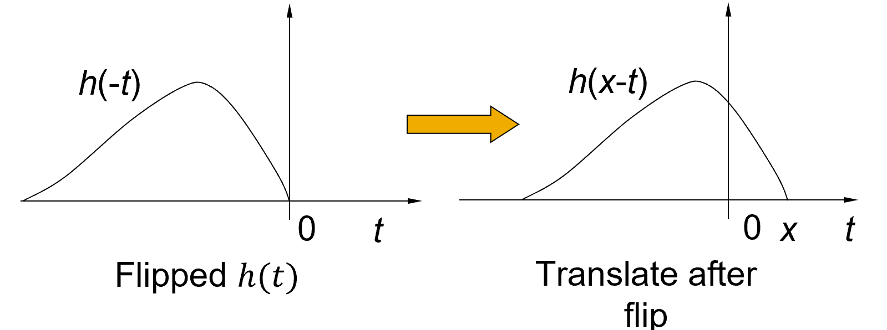{width="50%"}

* 计算 $f$ 和 $h$ 在任意 $t$ 的乘积，并积分

{width="50%"}

* 对每一个 $x$ 值重复上述计算过程，就得到了输出曲线 $g(x)$
* 当 $x$ 变化时，反折的函数被平移通过静止不动的输入函数, $g(x)$ 值取决于这两个函数的重叠部分的累积。

记卷积的运算符号为 $*$，则卷积的定义为：

$$g(x)=f(x)*h(x)=\int_{-\infty}^{\infty}f(t)h(x-t)dt$$

#### Property

* **Exchangeable**: $f(x)*g(x)=g(x)*f(x)$  
* **Distributive**: $f*(g+h)=f*g+f*h$  
* **Associative**: $f*(g*h)=(f*g)*h$  

### 离散卷积 | Discrete 1D convolution

对于离散序列，其卷积可用与连续函数相类似的方法求得。此时自变量变为下标，面积则由求和代替。
对于两个长度均为 M 的序列 $f(x)$ 和 $h(x)$，其卷积为:

$$g(x)=f(x)*h(x)=\dfrac{1}{M}=\sum\limits_{t=0}^{M-1}f(t)h(x-t)$$

有效范围：覆盖了所有 $h(t)$ 的点。

***e.g.***  

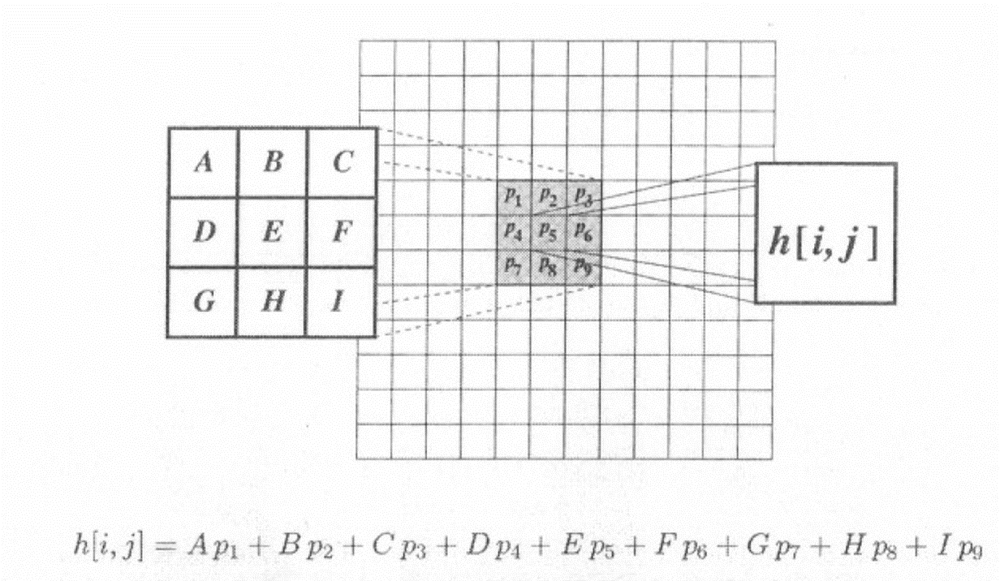{width="60%"}

如果要对边界的点进行卷积，可以将序列进行扩展（padding）。

!!! note ""

    **卷积实质上是对图像像素的加权求和**。

## 空间滤波 | Spatial filtering

**图像滤波 (Image Filter)**，即在尽量保留图像细节特征的条件下对目标图像的噪声进行抑制，是图像预处理中不可缺少的操作，其处理效果的好坏将直接影响到后续图像处理和分析的有效性和可靠性。

### 滤波器 | Filter

滤波器是一个大小为 $M\times N$ 的窗口，窗口中的元素与原图像的处于窗口内的像素进行某种运算，结果作为新图像的一个像素。当窗口滑过原图像并完成上述运算之后，就能够得到一幅新图像。（本质就是刚刚提到的卷积）

**滤波器(Filter)** 的别名：掩模(mask)、核(kernel)、模(template)、窗口(window)

滤波器子图像中的值是系数值，而不是像素值，它代表了影响新像素产生的权重。对于图像中的每个像素，根据滤波窗口中元素之间的定义关系计算滤波后对应的像素值。空间线性滤波将系数与对应像素之间相乘再求和来计算滤波后的像素值

边界如何处理？可以扩展行列（依然是Padding的思想），也可以直接将中心从第二行开始。

#### Procedure

在待处理图像中逐点移动掩模，在每一点 $(x,y)$ 处，滤波器在该点的响应通过实现定义的关系来计算。对于线性空间滤波，其响应由滤波器系数与滤波掩模扫过区域的对应像素值的乘积之和给出。

{width="60%"}

#### Response

响应值:

$$
\begin{align*}
R=&w(-1,-1)f(x-1,y-1)+w(-1,0)f(x-1, y)\\
&+\ldots+w(0,0)f(x,y)+\ldots\\
&+w(1,0)f(x+1,y)+w(1,1)f(x+1,y)
\end{align*}
$$

这实质上是一种卷积操作。

!!! note "卷积 Recall "

    $$h(x)=f(x)*h(x)=\dfrac{1}{M}=\sum\limits_{t=0}^{M-1}f(t)h(x-t)$$  

通常，掩模的长宽都为奇数。假设分别为 $2a+1$ 和 $2b+1$. 当窗口中心处于像素 $(x,y)$ 处时，新的像素值为：

$$g(x,y)=\sum\limits_{s=-a}^a\sum\limits_{t=-b}^b w(s,t)f(x+s,y+t)$$  

对图像 $f$ 中所有像素都与掩模进行运算之后，最终产生一幅新图像 $g$，即

$$R=w_1z_1+w_2z_2+\cdots+w_{mn}z_{mn}=\sum\limits_{i=1}^m w_iz_i$$

图像在传输过程中，由于传输信道、采样系统质量较差，或受各种干扰的影响，而造成图像毛糙，此时，就需对图像进行平滑处理。平滑可以抑制高频成分，但也使图像变得模糊。

### 平滑空间滤波器

**平滑空间滤波器**（也叫**低通滤波**，因为平滑的部分一般是低频的）用于模糊处理和减少噪声。模糊处理经常用于预处理，例如，在提取大的目标之前去除图像中一些琐碎的细节，桥接直线或曲线的缝隙。可以去掉噪声，但会使图模糊，一般用于预处理。

#### 均值滤波器 | Linear smoothing filter

**平滑线性空间滤波器(Linear smoothing filter)** 的输出是包含在滤波掩模邻域内像素的简单平均值。因此，这些滤波器也称为**均值滤波器**。

均值滤波主要用于细微的细节去除，即去除比遮罩窗口还小的不需要的区域。

* 简单平均，表示窗口中每一个像素对响应的贡献是一样的  

    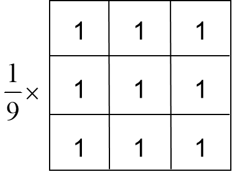{width="25%"}

* 加权平均，表示窗口中的像素对相应的贡献有大小之分。  

    两个3×3平滑（均值）滤波器掩模，每个掩模前边的乘数等于它的系数值的和，以计算平均值  

    {width="25%"}

    !!! example ""
        这样中间像素能更多地被保留，类似于一个高斯函数。

##### General equation

所以，我们可以将均值滤波的公式写成：

$$g(x,y)=\dfrac{\sum\limits_{s=-a}^a\sum\limits_{t=-b}^bw(s,t)f(x+s,y+t)}{\sum\limits_{s=-a}^a\sum\limits_{t=-b}^b w(s,t)}$$

其中，滤波器大小为 $(2a+1) \times (2b+1)$，$w$ 为滤波器，$f$ 为输入图像，$g$ 为输出图像。

遮罩窗口的大小对于最终结果非常重要。当遮罩很小时，模糊效果非常细微。当遮罩大小增加，模糊程度也随之增加。卷积核越大，图越模糊，保留的细节越少（类似照相机的光圈）  

为了得到感兴趣的物体的 brief description，我们常用均值滤波器来模糊它。以去除较小的对象，同时保留较大的对象。因此，遮罩的大小取决于要合并到背景中的对象。

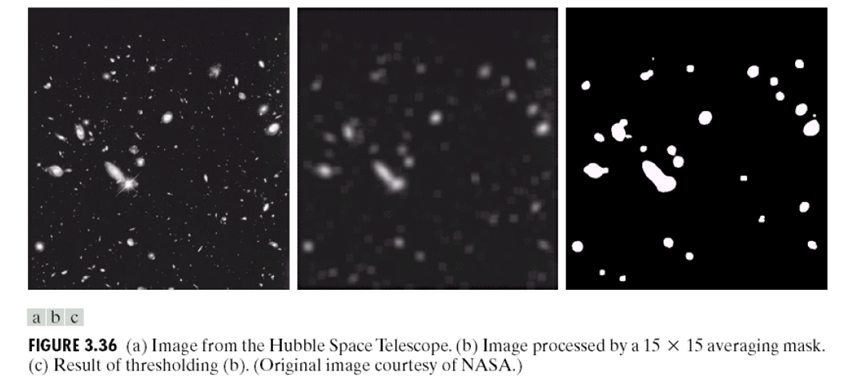

### 统计滤波器 | Statistical sorting filter

与均值滤波 (空间线性滤波) 相比，**统计滤波**是一种非线性的空间滤波，其效果基于窗口内像素值的排序结果，中心像素的值由统计排序结果决定。(由于每次都要排序，其计算速度比线性滤波慢)

统计滤波器中最常见的例子是**中值滤波器**。

* 用像素邻域内灰度的中值代替该像素的值。
* 提供了优秀的去噪能力，比小尺寸的线性平滑滤波器的模糊程度明显要低。
* 对处理脉冲噪声（pulse noise / pepper noise）非常有效，因为这种噪声是以黑白点叠加在图像上的。

为了对一幅图像上的某个点作中值滤波处理。必须先将掩模内欲求的像素及其邻域的像素值排序，确定出中值，并将中值赋予该像素点。

常用 $n\times n$ 的中值滤波器去除那些相对于其邻域像素更亮或更暗，并且其区域小于 $n^2/2$（滤波器区域的一半）的孤立像素集。

### 锐化滤波器 | Sharpening spatial filter

!!! note ""

    锐化处理的主要目的是突出灰度的过渡部分。补偿轮廓，增强图像的边缘及灰度跳变的部分，使图像变得清晰，增强图像中的细节或锐化模糊部分。

为了突出图像中的细节或者增强被模糊了的细节，我们引入微分算子。

微分算子是实现锐化的工具，其响应程度与图像在该点处的突变程度有关。微分算子增强了边缘和其他突变（如噪声），  削弱了灰度变化缓慢的区域。

* 基于二阶微分的图像增强——**拉普拉斯算子**
* 基于一阶微分的图像增强——**梯度法**

#### 差分算子 | Differential operator

对于一个整数值函数 $f(x)$ 来说，我们使用差分来表示微分算子：

$$\dfrac{\partial f}{\partial x}=f(x+1)-f(x)$$  

类似的，我们可以把二阶微分写成这样：

$$
\begin{align*}
\dfrac{\partial^2 f}{\partial x^2}&=f(x+1)-f(x)-(f(x)-f(x-1))
\\&=f(x+1)-2f(x)+f(x-1)
\end{align*}
$$

#### 梯度算子 | gradient based operator

对于一个二元函数 $f(x,y)$ 来说，我们首先定义一个二维的向量：

$$
\nabla f=\left[\dfrac{G_x}{G_y}\right]=\left[\dfrac{\dfrac{\partial f}{\partial x}}{\dfrac{\partial f}{\partial y}}\right]
$$

它的 **幅值(Magnitude)** 被表示为：

$$
\nabla f = (G_x^2+G_y^2)^{\frac{1}{2}}=\left[(\dfrac{\partial f}{\partial x})^2 + (\dfrac{\partial f}{\partial y})^2\right]^{\frac{1}{2}}
$$

当对整幅图像计算梯度时，运算量会很大，因此，在实际操作中，常用绝对值代替平方与平方根运算近似求梯度的模值

$$\nabla f\approx |G_x|+|G_y|$$

!!! note ""

    另一种计算方法: **Robert 交叉梯度算子**

    设我们有原始图像如下（$z_i$ is the pixel value）：

    {width="25%"}

    则在 Robert 交叉梯度算子 中，我们记

    $$G_x=z_9-z_5, G_y=z_8-z_6$$

    我们有

    $$
    \begin{align*}
    \nabla f &= (G_x^2+G_y^2)^{\frac{1}{2}}=[(z_9-z_5)^2+(z_8-z_6)^2]^{\frac{1}{2}}
    \\
    &\approx  |G_x|+|G_y|
    = |z_9-z_5|+|z_8-z_6|
    \end{align*}
    $$

#### 拉普拉斯算子 | Laplacian operator

可以证明，最简单的各向同性导数算子是拉普拉斯算子 (Rosenfeld and Kak [1982])。因为任何阶导数都是线性运算，所以拉普拉斯算子是线性算子。

对函数 $f(x, y)$，拉普拉斯算子定义如下(和梯度不同，拉普拉斯算子是一个标量)

$$
\nabla^2 f=\dfrac{\partial^2 f}{\partial x^2}+\dfrac{\partial^2 f}{\partial y^2}
$$

* 两个变量的离散拉普拉斯函数是:  

    $$
    \nabla^2 f(x,y)=f(x+1,y)+f(x-1,y)+f(x,y+1)+f(x,y-1)-4f(x,y)
    $$

    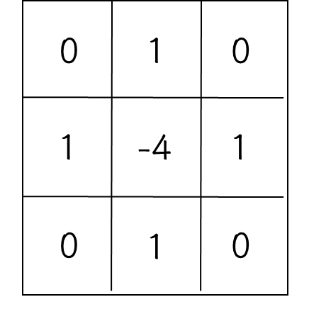{width="25%"}

    相当于用卷积核对图像做卷积（这个卷积核是各向同性，旋转不变的(*rotation-invariant*)）

* 对角线上的元素也可以用来设计掩膜：  

    $$
    \begin{align*}
    \nabla^2 f(x,y)  =&f(x-1,y-1)+f(x,y-1)+f(x+1,y-1)+\\&f(x-1,y)-8f(x,y)+
    f(x+1,y)+\\&f(x-1,y+1)+f(x,y+1)+f(x+1,y+1) \\
    =& \sum\limits_{i=-1}^1\sum\limits_{j=-1}^1 f(x+i,y+j)-9f(x,y)
    \end{align*}
    $$

    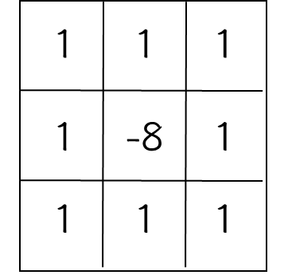{width="25%"}

* 当拉普拉斯滤波后的图像与其它图像合并时（相加或相减），则必须考虑符号上的差别。

    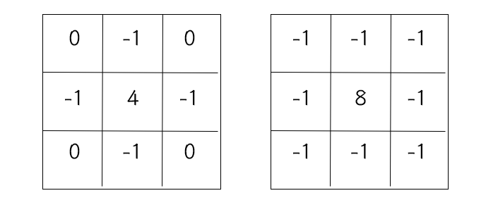{width="70%"}

#### 应用

用拉普拉斯算子对图像进行增强：

$$
g(x,y)=\left\{\begin{matrix}f(x,y)-\nabla^2f(x,y), If\ the\ center\ of\ the\ mask\ is\ negative \\
 f(x,y)+\nabla^2f(x,y), If\ the\ center\ of\ the\ mask\ is\ positive \end{matrix} \right.
$$

由于拉普拉斯算子是一种导数算子，它的使用会突出显示图像中的强度不连续性，而不强调具有缓慢变化的强度级别的区域，这将倾向于生成具有灰色边缘线和其他不连续性的图像。

所以将原始图像和拉普拉斯图像叠加(Fuse)在一起，可以在保护锐化效果的同时，又能“恢复”背景信息。

!!! note ""

    

    

    

    该图像中的细节明显比原始图像中的更清晰。

### 高斯滤波与双边滤波

目标：实现图像的平滑，保留 large-scale 的结构, 抹掉 small-scale 的纹路。

图像有两个主要特征：

* 空间域 (space domain) S, 是图像中可能位置的集合。这与分辨率有关，即图像中的行数和列数。
* 强度域 (intensity domain) R, 它是可能像素值的集合。用来表示像素值的位数可能不同。常见的像素表示是无符号字节(0到255)和浮点数。

#### 高斯滤波 | Gaussian filter

**高斯滤波**是最常用的图像去噪方法之一，它能很好地滤除掉图像中随机出现的高斯噪声。高斯滤波是一种低通滤波，它在滤除图像中噪声信号的同时，也会对图像中的边缘信息进行平滑，表现出来的结果就是图像变得模糊.

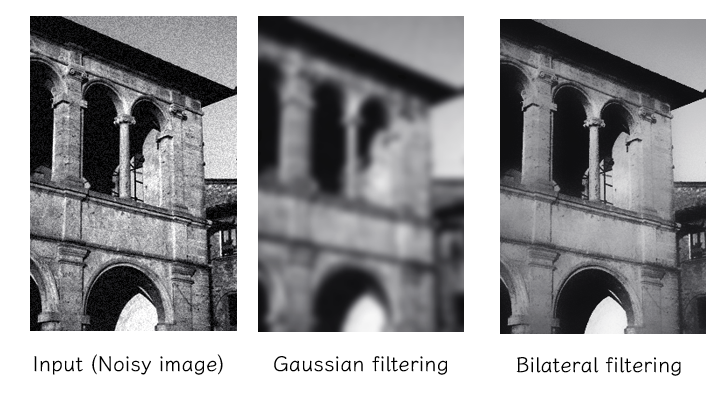

高斯滤波之所以会导致图像变得模糊，是因为它在滤波过程中只关注了位置信息；例如，以 $q$ 为中心的窗口中，某一点 $p$ 在高斯滤波过程中的**权重**的计算方法如下式；

$$
G_\sigma (||p-q||)=\dfrac{1}{2\pi\sigma^2}e^{-\dfrac{||p-q||^2}{2\sigma^2}}
$$

!!! note ""
    这里的 $\sigma$ 是我们选取的滤波窗口(Mask)的大小。根据经验，通常的策略将其设置为图像大小的一个比例，如 $2 \%$.

    $\sigma$ 越大，图像越平滑，趋于无穷大时，每个权重都一样，类似均值滤波; $\sigma$ 越小，中心点权重越大，周围点权重越小，对图像的滤波作用越小，趋于零时，输出等同于原图

!!! note "一维高斯分布"

    $$G(x)=\dfrac{1}{\sqrt{2\pi}\sigma}e^{-\dfrac{x^2}{2\sigma^2} } $$

!!! note "总计算式"
    $$
    GB[I]_p=\sum\limits_{q\in S}G_\sigma (||p-q||)I_q
    $$

即在滤波窗口内，距离中心点越近的点的权重越大，也就是说，它只关注图像主要特征中的空间域部分；

这种只关注距离的思想在某些情况下是可行的，例如在平坦的区域，距离越近的区域其像素分布也越相近，自然地，这些点的像素值对滤波中心点的像素值更有参考价值。但是在像素值出现跃变的边缘区域，这种方法会适得其反，损失掉有用的边缘信息。

此时就出现了一类算法——**边缘保护滤波方法(edge-preserving)**，**双边滤波**就是最常用的边缘保护滤波方法

#### 双边滤波 | Bilateral filter

!!! note ""

    
    
    而且，可以看到，双边滤波器下的细节保留的更好。

双边滤波的思想很简单，在高斯滤波的基础上加入了**像素值权重**项，也就是说既要考虑距离因素，也要考虑**像素值差异**的影响，像素值越相近，权重越大。

想法:  

* 每个样本都被相邻样本的加权平均值替代
* 权重要同时反映距离中心像素的远近，以及像素值和中心像素值的相似度
* 所有的权重都应该归一化以保持局部均值。

引入一个新的权重项 $G_{\sigma_r} (|I_p-I_q|)$，其中 $I_p$ 表示中心点的像素值，$I_q$ 表示窗口中的某一点的像素值，$|I_p-I_q|$ 表示两点像素值的差异，$G_{\sigma_r}$ 是一个关于像素值差异的高斯函数。我们得到双边滤波的计算公式：

$$
BF[I]_p=\dfrac{1}{W_p}\sum\limits_{q\in S}G_{\sigma_s} (||p-q||)G_{\sigma_r} (|I_p-I_q|)I_q
$$

* $\dfrac{1}{W_p}$ 归一化因子
* $G_{\sigma_s} (||p-q||)$ 空间(spatial)的权重，和高斯滤波中相同($\sigma_s$ 表示核的空间范围)
* $G_{\sigma_r} (|I_p-I_q|)$ 灰度(range)的权重(注意这里只是一范式而非二范式，因为灰度只是标量)($\sigma_r$ 表示灰度的范围)

!!! example "双边滤波的效果"

    

    如图，右图是有噪声的图像，左图是经过双边滤波后的图像，可以看到，双边滤波在去除噪声的同时，保留了“阶梯状”的边缘信息。

!!! question "如何设置参数？"

    !!! note "参数性质分析"
        对于 space parameter的$\sigma_s$，我们的思路和高斯滤波相同, $\sigma_s$ 越大，图像越平滑，趋于无穷大时，每个权重都一样，类似均值滤波；$\sigma_s$ 越小，中心点权重越大，周围点权重越小，对图像的滤波作用越小，趋于零时，输出等同于原图。

        对于 Intensity parameter的$\sigma_r$, $\sigma_r$ 越大，边缘越模糊，极限情况为 $\sigma_r$ 无穷大，值域系数近似相等，与高斯模板（空间域模板）相乘后可认为等效于高斯滤波; $\sigma_r$ 越小，边缘越清晰，极限情况为 $\sigma_r$无限接近 0，值域系数除了中心位置，其他近似为 0，与高斯模板（空间域模板）相乘进行滤波的结果等效于源图像。
    
    
    1. space parameter: proportional to image size
       - e.g. 2% of image diagonal

    2. Intensity parameter: proportional to edge amplitude
       - e.g. mean or median of image gradients
       - 对每一个小窗口都需要重新计算，这样才能保证每个窗口的 $\sigma_r$ 都是合适的

!!! note "范围变化对图像的影响"

    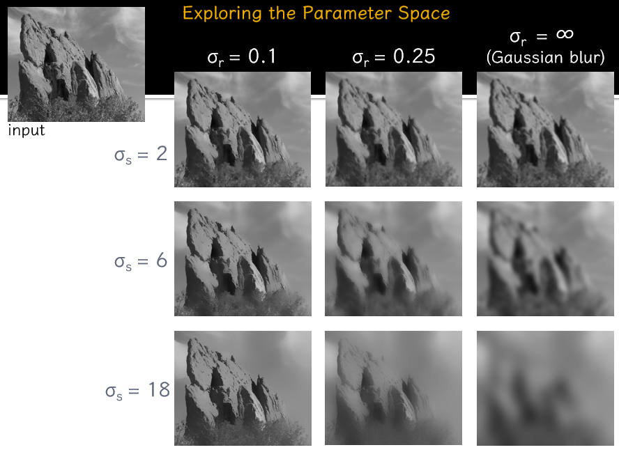

可以反复在一张图像上做双边滤波，$I_{(n+1)}=BF[I_{(n)}]$

##### 彩色图像上的双边滤波

若在彩色图上做双边滤波，只需要将式子改为  

$$
BF[I]_p=\dfrac{1}{W_p}\sum\limits_{q\in S}G_{\sigma_s} (||p-q||)G_{\sigma_r} (|||C_p-C_q|||)C_q
$$

其中 $|||C_p-C_q|||$ 是三维向量(RGB/Lab) 的欧氏距离

##### Denoising

* 较小的空间 $\sigma_s$
* 根据噪声水平调整 $\sigma_r$
* 可能不是最好的去噪方法，但能做好简洁性和效果的权衡
* 不需要加速(小内核)

##### Tone mapping

!!! info ""

    Tone Mapping原是摄影学中的一个术语，因为打印相片所能表现的亮度范围不足以表现现实世界中的亮度域，而如果简单的将真实世界的整个亮度域线性压缩到照片所能表现的亮度域内，则会在明暗两端同时丢失很多细节，这显然不是所希望的效果，Tone Mapping就是为了克服这一情况而存在的，既然相片所能呈现的亮度域有限，则我们可以根据所拍摄场景内的整体亮度通过光圈与曝光时间的长短来控制一个合适的亮度域，这样既保证细节不丢失，也可以不使照片失真。人的眼睛也是相同的原理，这就是为什么当我们从一个明亮的环境突然到一个黑暗的环境时，可以从什么都看不见到慢慢可以适应周围的亮度，所不同的是人眼是通过瞳孔来调节亮度域的。

    而这个问题同样存在在计算机图形上，为了让图像更真实的显示在显示器上，同样需要Tone Mapping来辅助。

整个Tone Mapping的过程就是首先要根据当前的场景推算出场景的平均亮度，再根据这个平均亮度选取一个合适的亮度域，再将整个场景映射到这个亮度域得到正确的结果。

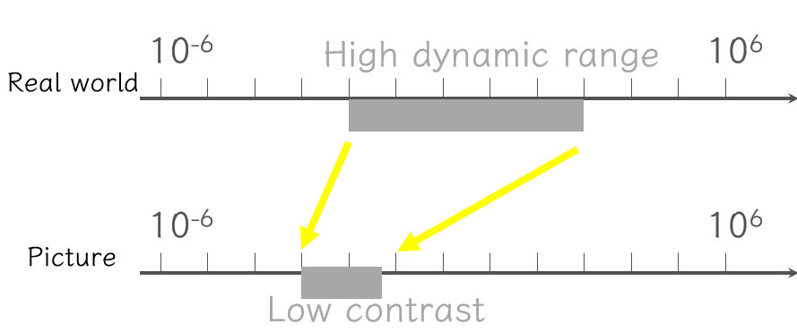

我们现在输入一个 HDR Image(high-dynamic-range, 高动态范围) 32 位图像，多出来的 8 位称为阿尔法通道，即透明度。每个像素是浮点数，这样可以增加范围。

{width="70%"}

场景的对比度是1:10,000（也就是说场景中较暗的部分和较亮的部分之间的差异非常大）。而显示器的对比度是1:100（也就是说显示器能够显示的最暗和最亮的颜色之间的差异较小）。最简单的对比度降低方法是什么？

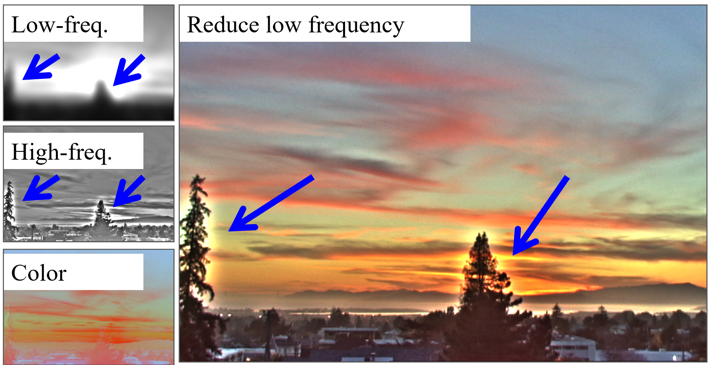{width="70%"}

减少低频，但可能会出现梯度逆转(halo)的现象

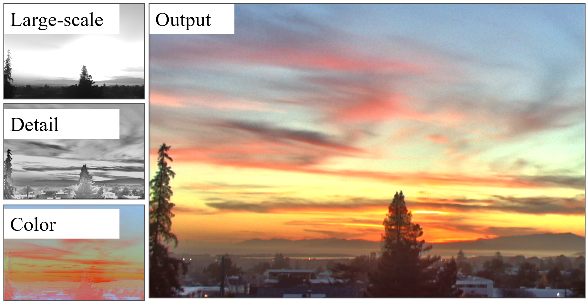{width="70%"}

!!! Question "Brute-force problem"
    暴力实现双边滤波的时间可能会非常慢，因为他是非线性的，而且每个核都不一样，不能提前算出

#### 增维型快速双边滤波 | A Fast Approximation of the Bilateral Filter using a Signal Processing Approach

!!! Abstract

    双边滤波非常有用，但速度很慢，因为它是非线性的，传统的加速算法例如在FFT之后执行卷积，是不适用的。

    课外资源: [http://people.csail.mit.edu/sparis/bf/#code](http://people.csail.mit.edu/sparis/bf/#code)

##### 双边滤波的定义

双边滤波可以使图像平滑，同时能保边。其**本质**是近邻的加权平均。原始的bilateral filter方程，权重包括：

* 空间域上的高斯函数
* 色彩域上的高斯函数
* 归一化因子

$$
\begin{aligned}
I_{\mathbf{p}}^{\mathrm{b}}&=\frac{1}{W_{\mathbf{p}}^{\mathrm{b}}}
\sum\limits_{\mathbf{q}\in\mathcal{S}}G_{\sigma_{\mathbf{s}}}(\|\mathbf{p}-\mathbf{q}\|)G_{\sigma_{\mathbf{r}}}(|I_{\mathbf{p}}-I_{\mathbf{q}}|)I_{\mathbf{q}}\\
\text{with }\;W_{\mathbf{p}}^{\mathrm{b}}&=\sum\limits_{\mathbf{q}\in\mathcal{S}}G_{\sigma_{s}}(\|\mathbf{p}-\mathbf{q}\|)G_{\sigma_{\mathbf{r}}}(|I_{\mathbf{p}}-I_{\mathbf{q}}|)
\end{aligned}
$$

##### 加速处理

我们将其与线性滤波相联系起来

加速后可以做到快、且准确的**近似**（有误差，并不是相等）

##### Intuition on 1D Signal

我们先在一维上做双边滤波，从图中可以看到，图像变平滑了。

{width="70%"}

分析可知：

* 近且相似的像素是有影响力的
* 远的像素没有影响力
* 和中心像素相差较大的影响力也比较小（为什么可以保边下）

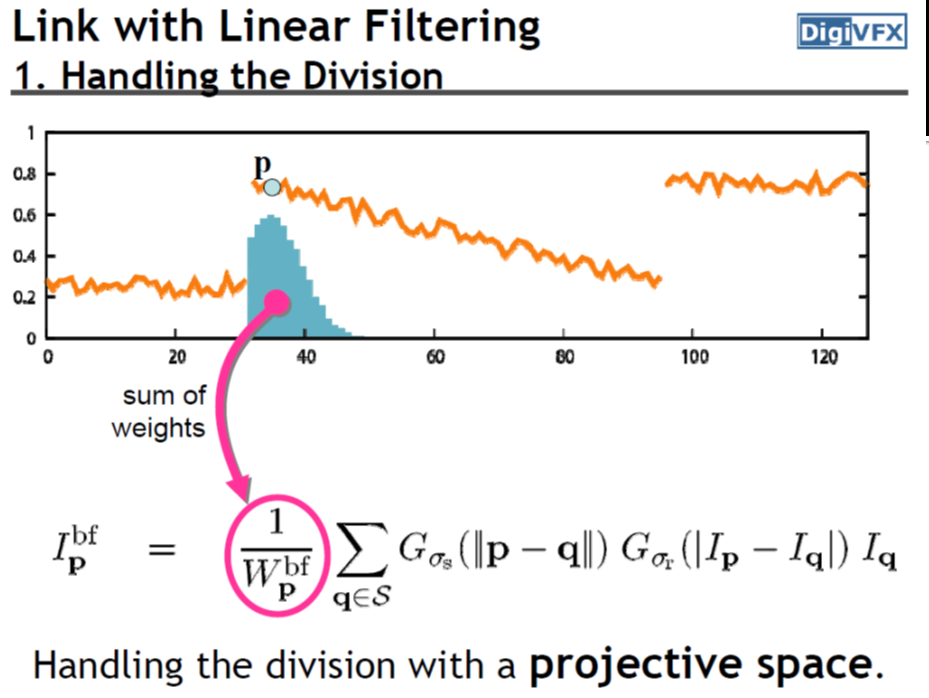{width="70%"}

由于我们要将其归一化。我们考虑在投射空间中处理归一化因子这里的除法

###### Handling the Division

通过投影空间的方法处理归一化因子这里的除法

{width="70%"}

* 第一行($I_p^{bf}$) 乘上归一化因子，从而形成一个 $2\times 1$向量，如上图下面所示。

* 类似于投影空间中的齐次坐标
* 我们可以把除法往后放，直到计算结束再进行归一化因子的除法
* 下一步：添加一维，使得可以进行卷积操作

###### Introducing a Convolution

此时我们研究右侧的式子。我们的两个一维卷积操作相乘时，就相当于一个二维卷积操作。

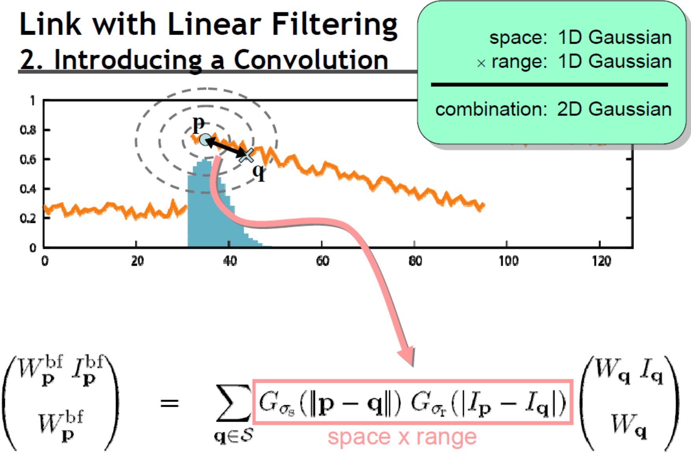

!!! note ""
    一维卷积对应二维高斯核。

二维卷积这里对应三维高斯核（卷积可以变为频率的乘积操作，可以利用 FFT 变换）

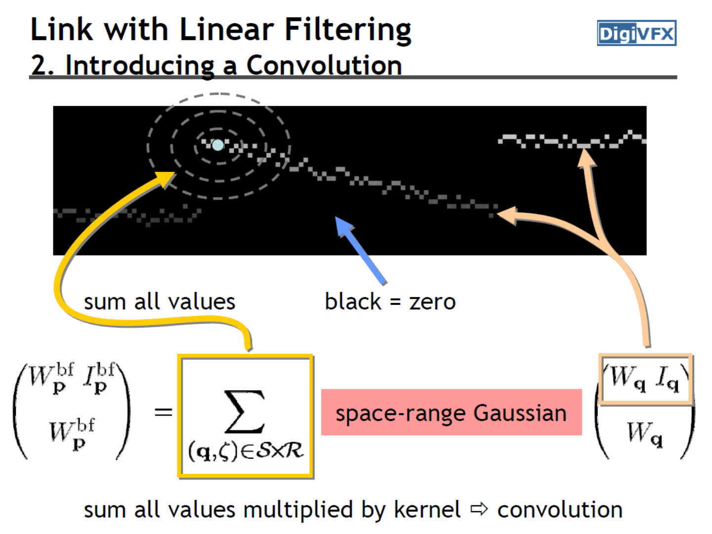

变为 $\sum\limits_{(q,\xi)\in S\times R}\left(\begin{matrix}W_q I_q \\ W_q \end{matrix}\right)$ **space-range Gaussian**

卷积完，我们可以得到：

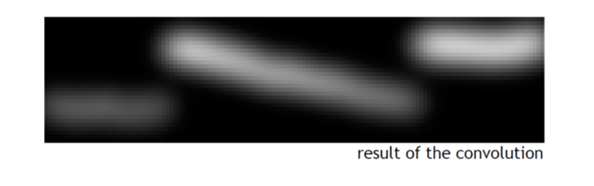

最后得到的结果还需要采样：

##### Summary

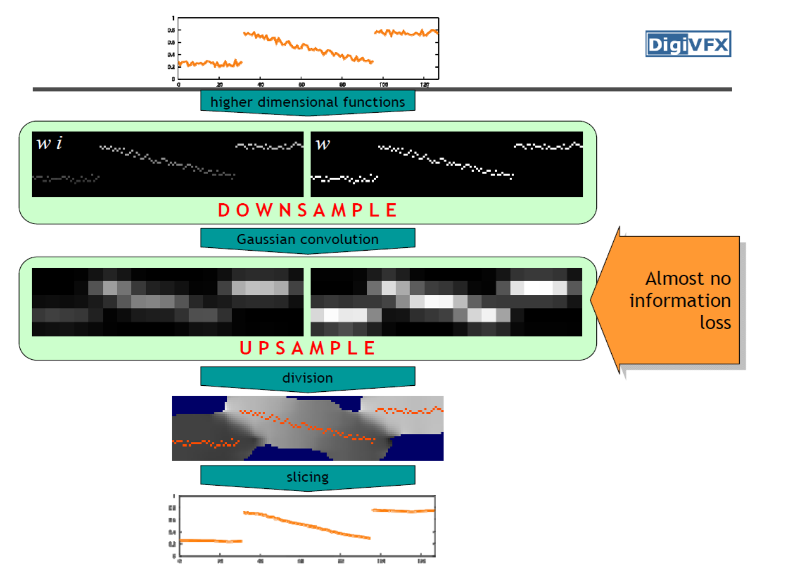

上采样，下采样并不是完全的双边滤波，做了一个近似

!!! note ""
    我们做的就是将双边滤波分成两步：

    

#### 导向滤波 | Guided Image Filtering

!!! Abstract
    导向滤波进一步解决了双边滤波的两个问题：1. 梯度逆转 2. 慢

    介绍 Guided Image Filtering, 包括其基本思想，优点和局限性，以及应用。

##### Guided Filter

双边滤波只能保边，没有保梯度（即正负号），很有可能发生梯度逆转的现象。为了解决这个问题，我们引入了**导向滤波**。

{width="70%"}

我们记输入的有噪声图像为 $p$, 输出的去噪后平滑图像为 $q$，记噪声（或者是纹路）为 $n_i$ 。则有

$$q_i = p_i - n_i $$

我们引入 Guided image $I$, 在这里我们认为输出图像可以看成导向图I 的一个局部线性变换。$a$ 是一个标量系数

$$\nabla q_i=a \nabla I_i\Rightarrow q_i=aI_i+b$$ 

接下来就是解出这样的系数，使得p和q的差别尽量小，而且还可以保持局部线性模型。我们要求的就是： (这里 $\epsilon a^2$ 是正则项，用来控制方向)

$$\min\limits_{(a,b)}\sum\limits_i (aI_i+b-p_i)^2+\epsilon a^2$$

对 $a$ 求偏导，令偏导数为 $0$; 对 $b$ 同理, 这样可以解一个二元一次方程组得到 $a$ 和 $b$. (这里 $\overline p$ 指的是 $I$ 这个邻域的平均值)

以上是对单个像素，我们可以扩充到整个图像：  

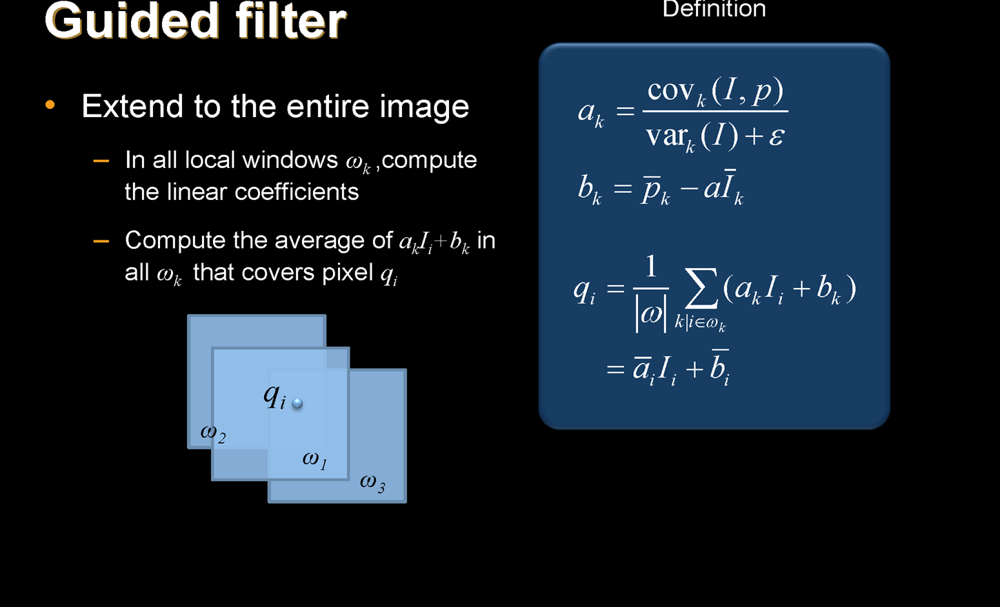{width="70%"}

* 对每一个局部窗口 $w_k$ 我们可以算出 $a_k, b_k$  
    窗口之间可能有重叠，要算窗口内 $q_k$ 的平均值，即所有包含 $q_i$ 的窗口的均值  

* 参数: 窗口半径 $r$, 正则系数 $\epsilon$

如果窗口的 $var(I)\ll \epsilon, Cov(I,p)\ll \epsilon\Rightarrow a\approx 0, b\approx \overline p\Rightarrow q_i\approx \overline{\overline p}$ (相当于对均值滤波的一个级联)  

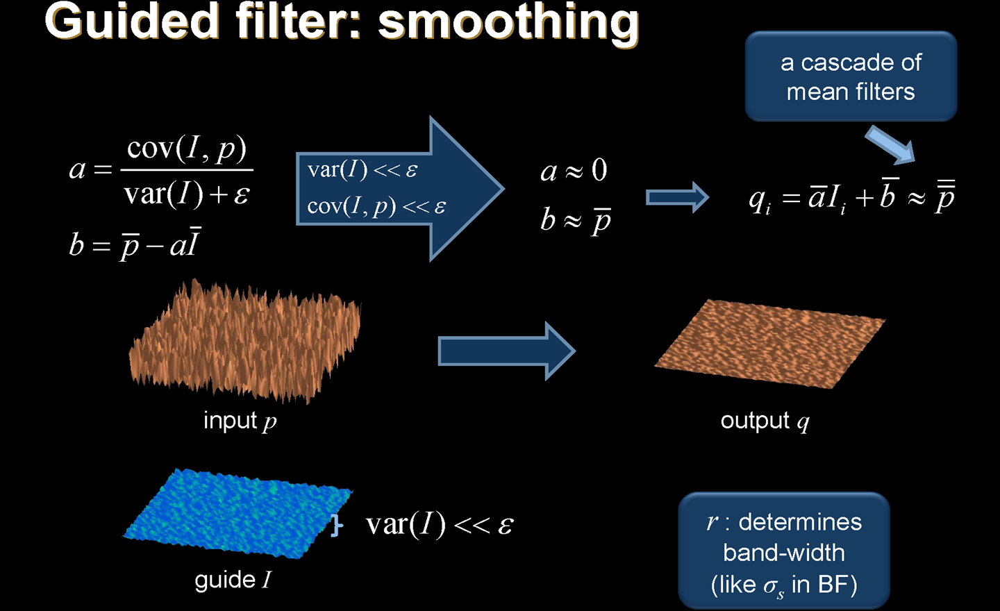{width="70%"}

怎么找到 Guided image $I$ ？可以用输出图像的平均值 $\overline p$ 作为 Guided image.  

$r$ 决定了采样窗口的大小

{width="70%"}

这说明它不仅可以保边，还可以保方向，即不会出现梯度逆转的情况。 $\epsilon$ 决定了我们保边的程度： $\epsilon$ 越大保边能力越强

!!! note "Example"

    

**Guided Filter** 的优点

* 保边（保梯度就一定能保边，反之不一定）
* 非迭代
* $O(1)$ 的时间，快且不需要通过近似的方法
* 不存在梯度逆转的问题

##### Complexity

* 在每个局部窗口计算均值、方差、协方差
* 级联，可以用积分图提前做计算
    * $O(1)$ 且不依赖于窗口大小 $r$
    * 非近似

##### Gradient Preserving

{width="70%"}

!!! note "Guided Filter 解决梯度逆转的例子"

    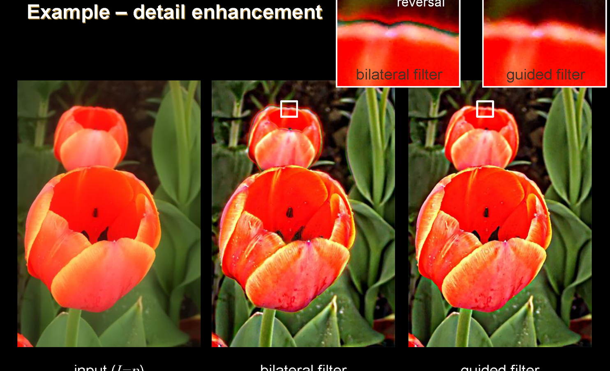{width="70%"}

除了图像平滑，还可以用来去雾、抠图

##### Limitation

对边缘的定义不清淅，而且边缘是 context-dependent 的。肉眼中的边界，可能不被认为是边界，最终还是会出现 halo 的现象。

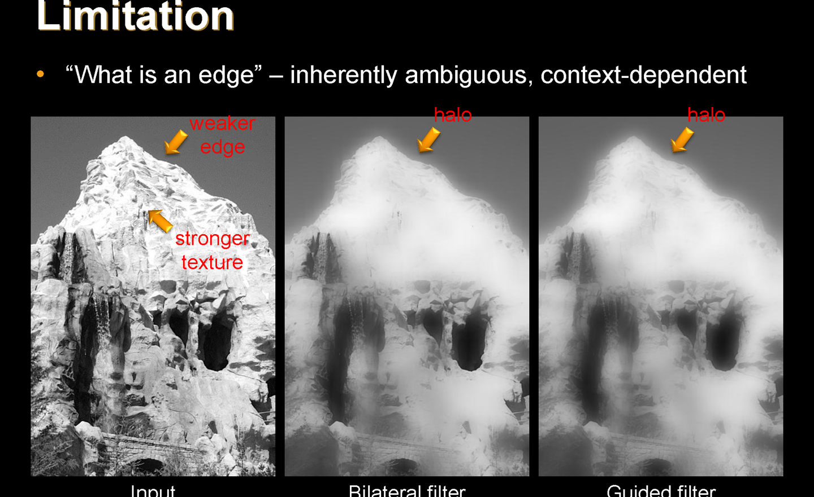

#### 稀疏范数滤波 | Sparse Norm Filtering

##### Core Algorithm

平滑一个图像最简单的方法是使用 $l^2$ 范式并求: 

$$\min\limits_{l_i^{new}}\sum\limits_{j\in N_i}(l_i^{new}-l_j)^2$$

也就是均值滤波。 求偏导并令其等于 $0$, 可以得到每个点的像素值。  

为了让滤波能够保边，我们将其改为 $p$ 范式，变为 sparser norm, 式子推广为**Sparse Norm Filter** ：

$$\min\limits_{l_i^{new}}\sum\limits_{j\in N_i}|l_i^{new}-l_j|^p,0<p\leq 2\Rightarrow$$

##### Application

###### Halo free filtering

加权平均会带来 Halo,。基于滤波算法的最优化很慢，有时会产生不想要的结果。

我们能通过 **Sparse Norm Filter** 生成 halo free 的结果，是因为我们可以改变 $p$ 范式

!!! note "Example"
    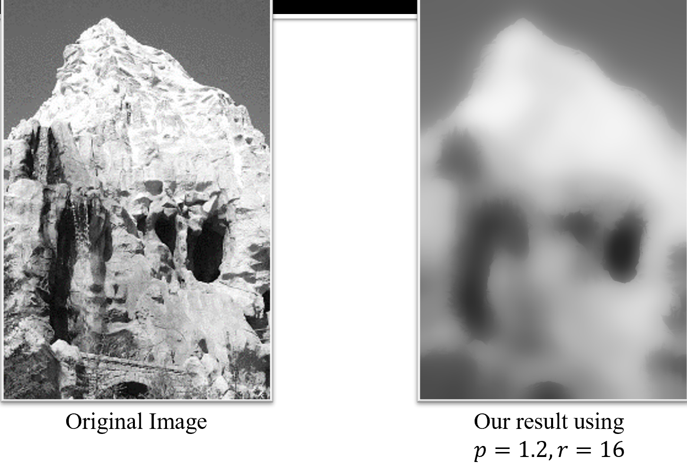

    

    可以看到，我们通过调节 $p$ 的大小，在第二张图像中梯度逆转的现象消失了！  

    $p>1$ 时不能防止梯度逆转，$p<1$ 可以.  

###### Outlier tolerant filtering

SNF 是一类通用的滤波，它包括中值滤波器（$l^1$ 范式滤波器）这一特殊情况(𝑙^1范数滤波器)。

也可以起到去噪的效果

!!! note "Example"

    原图：

    

    $p=1$ norm filter:

    

    $p=0.1$ norm filter:

    

###### HDR Compression

SNF 的微分是非局部的，因此不像基于梯度下降的算法那样容易被困住。

!!! note "Example"

    原图

    

    $p=0.2$ norm filter

    

###### Non-blind Deconvolution

运动去模糊

!!! note "Example"

    原图

    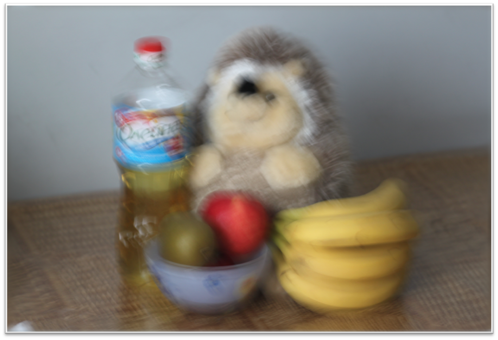{width="50%"}

    $p=0.5, r=5$

    {width="50%"}

如何做运动去模糊？我们首先需要先估计出运动的轨迹（和墙对齐），再通过对弧（轨迹）进行去卷积。  

###### Joint filtering

我们可以利用另一个引导图像来提供滤波的引导权重，如将引导图像的色调用到另一张图像上

!!! note "Example"

    

    

###### Segmentation

我们可以利用联合滤波 (joint filtering) 来加速归一化切割 (normalized cut) 的图像分割 (image segmentation)。

在特征求解器 (eigensolver) 中用高效的联合滤波代替矩阵乘法

!!! note "Example"

    

我们可以把这个技术扩展到归一化切割的相关算法。

###### Colorization

基于对图像的分割，再上色

!!! note "Example"

    输入图像

    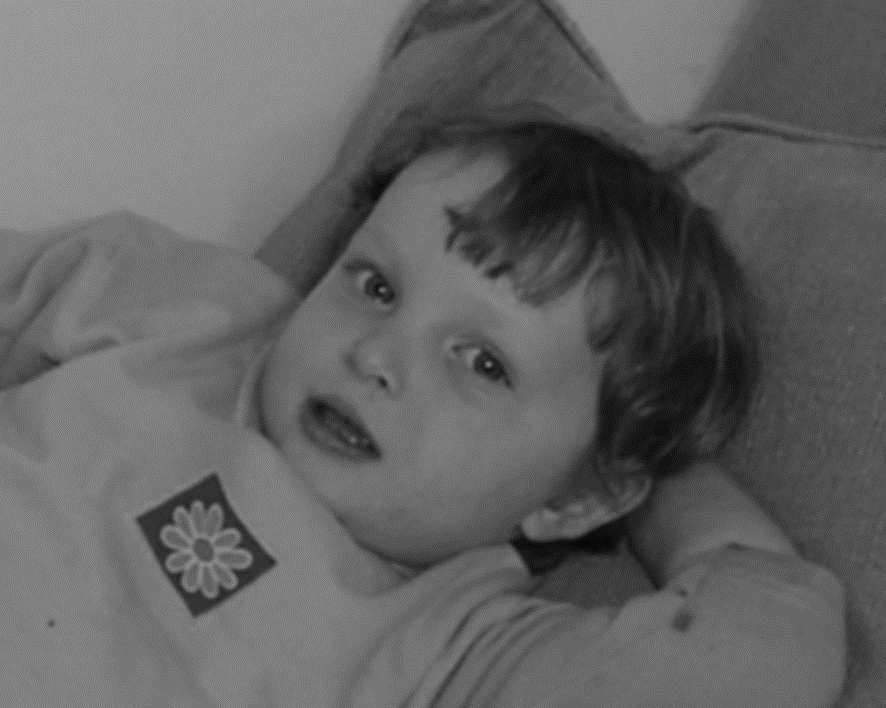{width="50%"}

    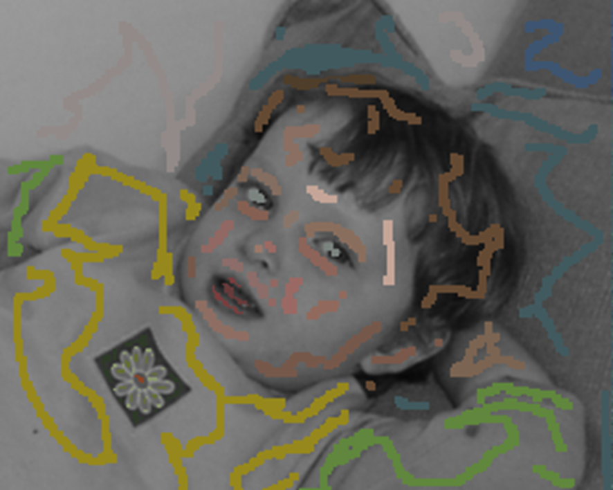{width="50%"}

    Result after 5 iter

    {width="50%"}

    Final result by SNF using $p=0.1,r=1/4$  of the image height

    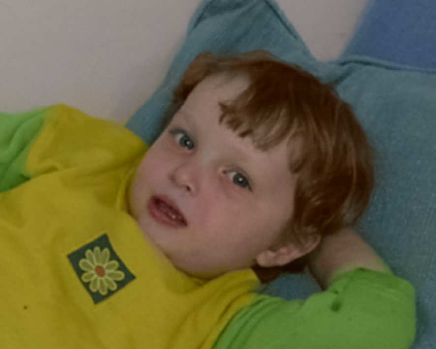{width="50%"}

###### Seamless editing

无缝衔接，思路类似上色，不断使用 SNF 迭代

!!! note "Example"

    输入图像

    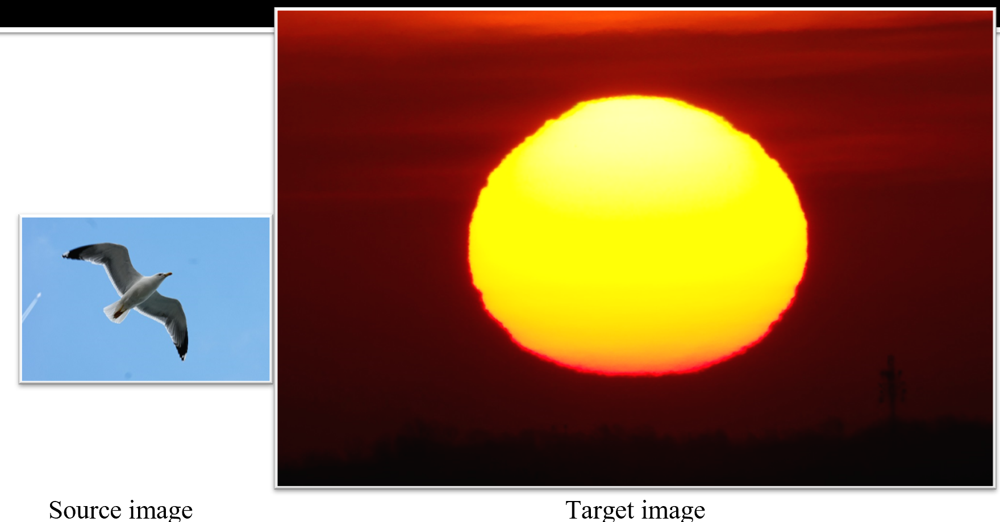{width="50%"}

    Result by drag-and-drop

    {width="50%"}

    Final result by SNF

    {width="50%"}
