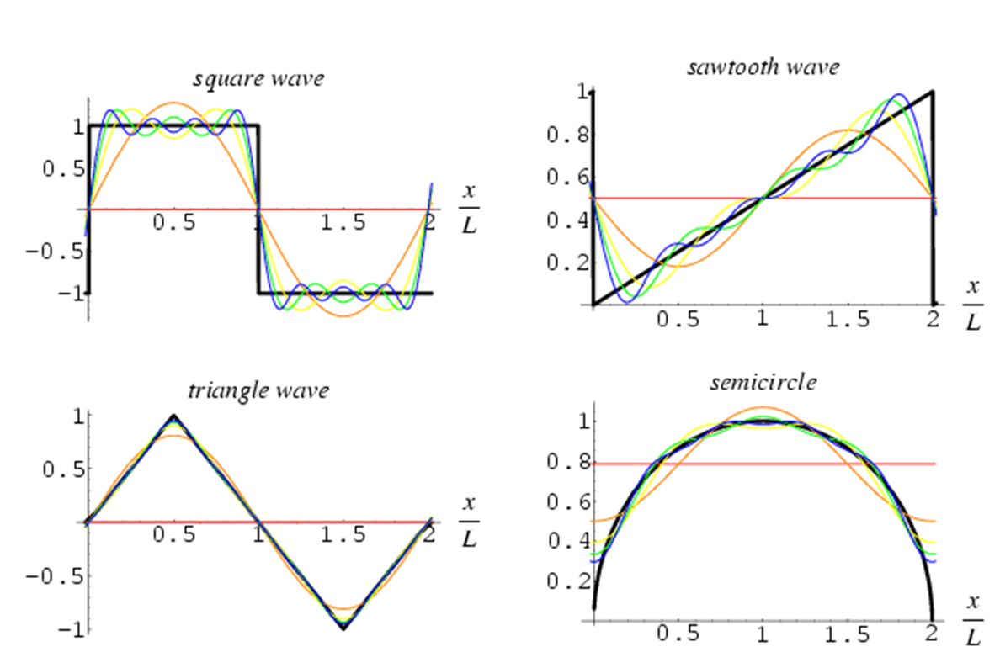
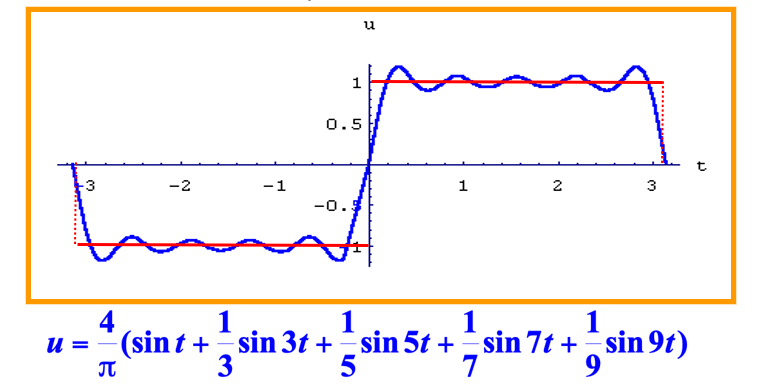
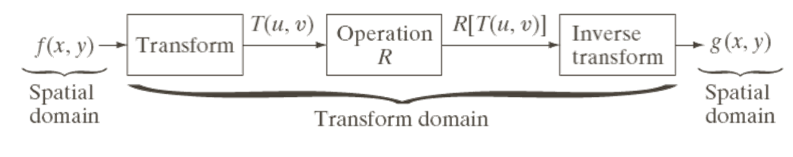
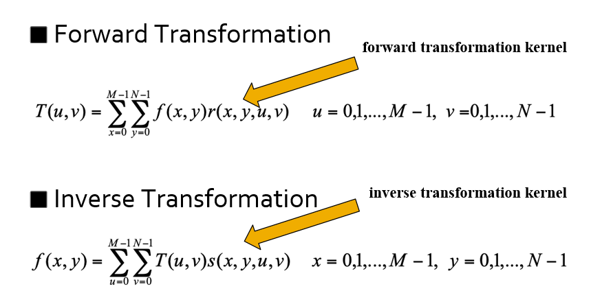
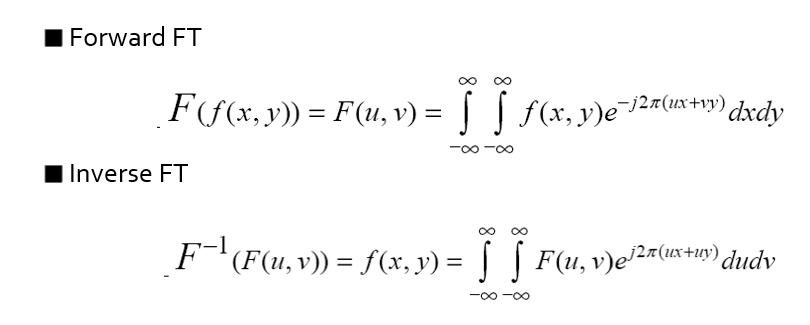
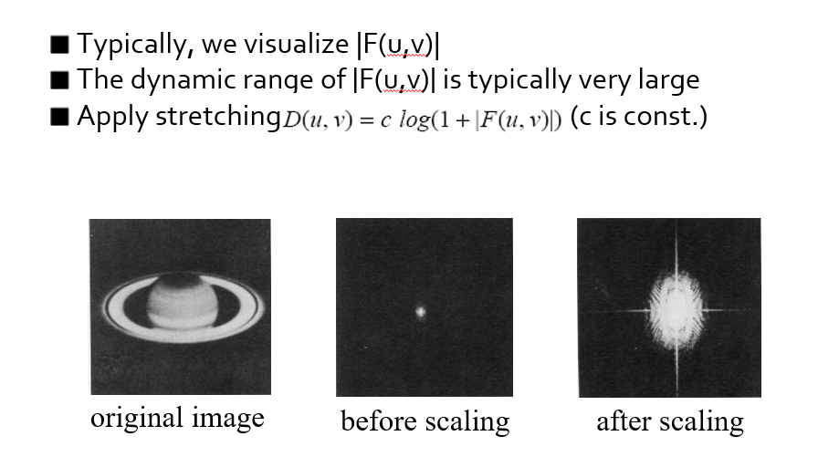
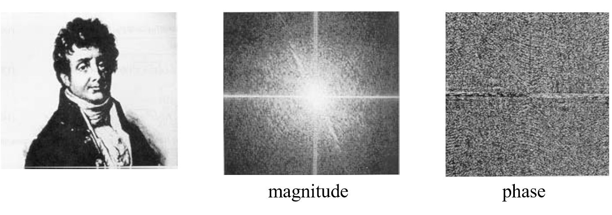

# 傅里叶变换 | Fourier Transform

!!! Abstract  

    * Fourier and his work
    * Background of Fourier Transform
    * Fourier Transform
    * Discrete Fourier Transform (1D)
    * FFT
    * Discrete Fourier Transform (2D)
    * FFT for Image in Matlab

## Fourier Transform

### Expansion of a Function

英国数学家泰勒在17世纪找到了用幂函数的无限线性组合表示一般的解析函数的方法。

$$
f(x)=f(a)+f'(a)(x-a)+\dfrac{f''(a)}{2!}(x-a)^2+\dfrac{f'''(a)}{3!}(x-a)^3+\ldots+\dfrac{f^{(n)}(a)}{n!}(x-a)^n+\ldots
$$

### Fourier Series

18世纪中叶，法国数学家傅里叶在研究热传导问题时，找到了三角函数的无限线性组合表示有限区间上的一般函数的方法，即把函数展开成三角级数。

$$
\begin{align*}
f(x) & =\dfrac{1}{2}a_0+\sum\limits_{n=1}^{\infty}a_n\cos(nx)+\sum\limits_{n=1}^{\infty}b_n\sin(nx)\\
a_0 & = \dfrac{1}{\pi}\int_{-\pi}^{\pi}f(x)dx\\
a_n & =\dfrac{1}{\pi}\int_{-\pi}^{\pi}f(x)\cos(nx)dx\\
b_n & =\dfrac{1}{\pi}\int_{-\pi}^{\pi}f(x)\sin(nx)dx
\end{align*}
$$

简谐振动: $y=A\sin(\omega t+\phi)$  

物理学上可以将一个周期运动分成若干个简谐振动的叠加：

$$y=\sum\limits_{k=1}^n y_k=\sum\limits_{k=1}^n A_k\sin(k\omega t+\phi)$$

!!! note ""
    

### Complex Numbers

{width=30%}

复数(a+bj)可以采用 **Magnitude-Phase**(i.e.,vector)  的形式表示，即 $x=|x|e^{j\phi(x)}$, 其中 **幅度** (Magnitude)记作 $|x|=\sqrt{a^2+b^2}$, **相位** (Phase) 记作 $\phi(x)=\tan^{-1}(b/a)$  

在这种表示下，复数乘法可以写作 $xy=|x|e^{j\phi(x)}\cdot |y|e^{j\phi(y)}=|x||y|e^{j(\phi(x)+\phi(y))}$  

共轭复数 $x^* = a-jb$, 它满足 $|x|=|x^*|,\phi(x)=-\phi(x),xx^*=|x|^2$  

**Euler Formula**: 

$$e^{j\theta}=\cos(\theta)+j\sin(\theta)$$ 

它满足 $|e^{j\theta}|=1, phi(e^{j\theta})=\theta,sin(\theta)=\dfrac{1}{2j}(e^{j\theta}-e^{-j\theta}),cos(\theta)=\dfrac{1}{2}(e^{j\theta}+e^{-j\theta})$  

### Fourier Transform

傅里叶变换是复傅里叶系数在给定区间上的一个推广。

傅里叶分析指频率区域分析，其中 $n$ 较小时为低频， $n$ 较大时为高频。  

注意到正弦波和余弦波都是无限长的，这是傅里叶分析的一个不足，因此小波(wavelet)分析比特定信号的分析更好。  

!!! note "example"

    

对于非周期函数,如果函数 $f(x)$只在区间 $[−\pi,\pi]$ 上,也可展开成傅氏级数.

周期延拓  

$$
\begin{align*}
F(x)=\left\{\begin{matrix}
& f(x) ,x \in(-\pi,\pi] \\  
& f(x-2k\pi) ,x\in ((2k-1)\pi,(2k+1)\pi], k=\pm 1 ,\pm 2,\ldots \end{matrix}\right.
\end{align*}
$$

### Image Transform

很多时候，图像处理任务在变换域（频域）而不是空间域中执行得最好。

关键步骤：

1. 变换图像
2. 在变换后的域中执行任务。
3. 应用逆变换返回到空间域。

前向变换与反向变换

### Continuous Fourier Transform

一维情况下，将信号(即函数)从空间域变换到频域的变换方法为：

要去除某些频率，就是将其相应的F(u)系数设置为零

低频对应于缓慢变化的信息(例如，连续的表面)。

高频对应于快速变化的信息(例如，边缘)

#### Frequency Filtering Steps

* 对 $f(x)$ 傅里叶变换 $F(f(x))$
* 去掉不想要的频率 $D(F(f(x)))$
* 转换回原来的信号 $\hat f(x)=F^{-1}(D(F(f(x))))$

### Discrete Fourier Transform (DFT)

记 $N$ 为频率的数目，$x$ 为采样点的数目

Forward DFT  

$$F(u)=\sum\limits_{x=0}^{N-1}f(x)e^{-\frac{j2\pi ux}{N}}, u=0,1,\ldots,N-1$$

Inverse DFT  

$$f(x)=\dfrac{1}{N}\sum\limits_{u=0}^{N-1}f(u)e^{\frac{j2\pi ux}{N}}, x=0,1,\ldots,N-1$$  

### Fast Fourier Transform(FFT)  

为了加快计算速度，我们可以利用 DFT 的对称性质，将计算量从 $O(N^2)$ 降低到 $O(N\lg N)$

* 将原始的 N 点序列依次分解为一系列短序列；
* 求出这些短序列的离散傅立叶变换；
* 组合出所需的变换值；
* 计算量（乘除法）：$2N^2\rightarrow 2N\lg_2N$

#### FFT Principle

DFT 的式子为

$$F(k)=\sum\limits_{n=0}^{N-1}f(n)e^{-\frac{j2\pi kn}{N}}$$  

我们记 $W_N^{n,k}=e^{-j2\pi nk/N}$ 则有

$$F(k)=\sum\limits_{n=0}^{N-1}f(n)W_N^{n,k}$$  

假定 $N$ 为 $2$ 的正整数幂：$N=2^H\Rightarrow N=2M$, 将原式子分为奇数项和偶数项

$$
\begin{align*}
F(k) & =  \sum\limits_{n=0}^{2M-1}f(n)W_{2M}^{n,k}\\
& = \sum\limits_{n=0}^{M-1}f(2n)W_{2M}^{2n,k}+\sum\limits_{n=0}^{M-1}f(2n+1)W_{2M}^{2n+1,k}\\
W_{2M}^{2n,k} & = e^{-j2\pi \cdot 2nk/2M} = e^{-j2\pi nk/M} = W_M^{n,k}\\
W_{2M}^{2n+1,k} & = e^{-j2\pi \cdot (2n+1)k/2M} = e^{-j2\pi nk/M} \cdot e^{-j2\pi k/2M}= W_M^{n,k}\cdot  W_{2M}^k\\
F(k) & = \left[\sum\limits_{n=0}^{M-1}f(2n)W_M^{n,k}+\sum\limits_{n=0}^{M-1}f(2n+1)W_M^{n,k}W_{2M}^k\right], k=0,1,\ldots,M-1
\end{align*}
$$

令 $\left\{ \begin{matrix} F_e(k) & = \sum\limits_{n=0}^{M-1}f(2n)W_M^{n,k} \\ F_o(k) & = \sum\limits_{n=0}^{M-1}f(2n+1)W_M^{n,k} \end{matrix}\right.$ 那么 

$$F(k)=\lfloor F_e(k)+F_o(k)W_{2M}^k \rfloor$$  

如果 $e, o$ 是 $2$ 的幂次，还可以继续拆

对于 $k=M,M+1\ldots,2M-1$  

$$
\begin{align*}
W_M^{n,k+M} & = e^{-j2\pi (k+M)/M}\\
    & = e^{-j2\pi n k/M} \cdot e^{-j2n\pi}\\
    & = e^{-j2\pi n k /M}\\
    & = W_M^{n,k}\\
W_{2M}^{k+M} & = e^{-j2\pi k/2M\cdot e^{-j\pi}=-W_{2M}^k}
\end{align*}
$$

因此 $F(k+M)=\lfloor F_e(k)-F_o(k)W_{2M}^k\rfloor$

意义：对一个长度为 $N$ 的序列进行傅立叶变换可以通过将其分成两半计算，对第一部分的计算需要通过计算两个长度为 $N/2$ 长度序列的傅立叶变换式进行，然后利用这两个长度为 $N/2$ 的序列可以得到第二部分的值。

## Extending FT in 2D

### Visualizing DFT

### Magnitude and Phase of DFT

!!! Example "Magnitude VS Phase"
    {width=70%}

    如果我们只用振幅/相位作为信息重建图像，会得到什么样的结果？  
    
    * 利用振幅  
    
    {width=25%}

    * 利用相位  

    {width=25%}

    相位传递了图像更多的结构信息！