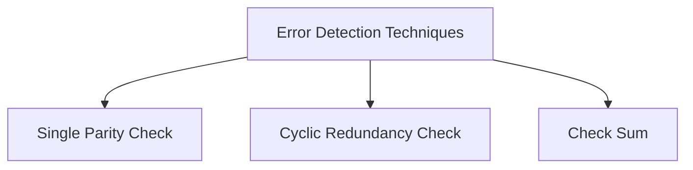

# Chap 1 Digital Systems and Information

!!! note "单元概述"
    - 介绍信息的表示和编码
    - 介绍信息传输中的错误检测机制及解决方案

## 两种逻辑系统

- 组合逻辑（Combinational Logic）：任意时刻的输出仅取决于该时刻的输入
- 时序逻辑（Suquential Logic）：任意时刻的输出既取决于该时刻的输入，也取决于电路原来的状态
    - 同步（Synchronous）：State updated at discrete times
    - 异步（Asynchronous）：State updated at any time

## 信息表达 | Information Representation

现实世界中的信息往往是 **连续(continuous)** 的，但在人造物的世界中，大部分信息都是 **离散(discrete)** 的。

在电子信息系统中，信号分为 **模拟信号(analog signal)** 和 **数字信号(digital signal)** 两种。其中，在 **数字信号(digital signal)** 中又有多种表示方法，如今我们最常用的是 **二进制(binary)**。对应到电路层面，我们常常用 **高电位(HIGH)** 和 **低电位(LOW)** 来表征 `1` 和 `0`。

|HIGH input|LOW input| HIGH output| LOW output|
|:--:|:--:|:--:|:--:|
|0.6 \~ 1.1 | -0.1 \~ 0.4|0.9 \~ 1.1|-0.1 \~ 0.1|

值得注意的是，在输入和输出中，高低电位的接受范围是不同的。可以发现，输入的判定范围比输出的判定范围大，即 **宽进严出**。其目的是为了进一步提高电路在噪音等异常影响下也能正常表现的能力。

可以发现，(b) 图中的模拟信号在经过我们的器件后，会被认为是 \(c) 图所示的信号。而这些操作在硬件层面，我们通过 **晶体管(transistors)** 来实现。

!!! note ""
    或许你也已经注意到了，在图中，HIGH 的接受范围和 LOW 的接受范围之间还存在一段**阈值区域**(Threshold Region)。

    !!! question "落在这部分的电平会怎么样呢？"

        A: 落在这一部分的电平是 **未定义(undefined)** 的，也被称为是 **浮动(floating)** 的。如果输出的电平是在浮动区间的，那么其认定值将是随机的。

两个对应电平区间之间的差值被称为 **噪声裕度(noise margin)**。噪声裕度越大，电路的抗干扰能力越强。

!!! question "我们为什么最终使用二进制来表示信息？"

    - 一方面是因为二值器件比较常见，亦即这里提到的晶体管；

    - 另外一方面是使用二进制可以节省材料，降低电路成本。

        !!! example "表达100以内的数："
          
            - 如果用10进制，则从00-99，每一位都有10个状态，共需要20个状态。
            - 但是用二进制，则从0000000-1111111，每一位只有2个状态，共只需14个状态，而且能表示更多数。

---

## 数字系统 vs 编码

数字系统与编码的概念是不一样的，仔细思考就可以发现两者的不同之处：

- 数字系统（Number System）：指数字的不同进制系统，如十进制、二进制、八进制、十六进制
    - 数字系统的前导 `0` 可以省略
- 编码（Codes）：较为灵活，只要求一一映射即为合法编码
    - 编码系统的前导 `0` 不能省略

## 数字系统 | Number Systems

首先需要涉及的问题是进制转换。

对于一个 $r$ 进制数，它一般被写成这样：

$$
(A_{n-1}A_{n-2}...A_1A_0A_{-1}...A_{-(m-1)}A_{-m})_{r}
$$

而它对应的十进制真值为：

$$
\begin{aligned}
\sum_{i = -m}^{n-1} A_ir^i\;\;
=&A_{n-1}r^{n-1}+A_{n-2}r^{n-2}+...\\
+&A_{1}r^{1}+A_0r^0+A_{-1}r^{-1}+...\\
+&A_{-(m-1)}r^{m-1}+A_{-m}r^{-m}
\end{aligned}
$$

计算机领域常见的进制主要是 **二进制(binary)**，**八进制(octal)**，**十进制(decimal)** 和 **十六进制(hexadecimal)**。

其中二、八、十六进制之间的转换非常简单，存在多位到一位之间的无后效性映射，例如二进制转换到十六进制只需要将从低到高每四位转化成十六进制中的一位即可。

!!! note ""
    需要注意，由于二进制和十进制在零位上的权重相同，这意味着在整数部分，二进制和十进制是可以相互精准转化的（即最小精度是一致的，都是 1）；然而该性质在小数部分并不成立（因为小数部分不存在“最小精度”一说），即十进制无法精准转化为二进制，但二进制可以转化为十进制。

---

### 算术运算 | Arithmetic Operations

这里涉及的主要是 **加法(Addition)**、**减法(Subtraction)**、**乘法(Multiplication)**。

整体流程和小学竖式加法是一致的。

术语：

LSB(Least Significant Bit): 最低有效位；

MSB(Most Significant Bit): 最高有效位。

**Carry/Borrow in**(Z): 输入进位/借位；

**Carry/Borrow**(C/B): 输出进位/借位；

??? summary "二进制运算"
    

    
    
    
    

---

## 编码 | Codes

二进制编码主要分为这么几种：

- Numeric
    - 必须表达一定范围内的数字；
    - 能够支持简单且普遍的计算；
    - 和二进制数值本身有较大关联；
- Non-numeric
    - 相对灵活，因为不需要适配普遍的运算法则；
        - 灵活性指，保证编码映射关系是唯一的的情况下都可以称为合法编码；
    - 和二进制数值本身未必有关系；

---

### 独热码 & 独冷码

**独热码(one-hot)** 要求比特向量中只有一位是 `1`，例如 `0001`，`0010`，`0100`，`1000` 等；对应的还有 **独冷码(one-cold)**。

使用这种编码的好处是，决定或改变状态机目前的状态的成本相对较低，容易设计也容易检测非法行为等。

但是相对应的，缺点是信息表示率较低，非法状态非常多而有效状态很少。

---

### BCD 码

由于真实世界中大部分数据表述都是以十进制实现的，所以我们需要研究如何用二进制来表示十进制。

首先，一位二进制数能包含的信息是 1bit，也就是一个“真”或者一个“假”。我们称一个拥有 n 个元素的二进制向量为一个 **n位二进制编码(n-bit binary code)**。一个 n 位二进制数拥有 $2^{n}$ 种可能的组合，因而可以表示 $2^n$ 种信息。

而我们需要设计的编码系统，就是将我们需要的信息映射到这 $2^n$ 个“空位”中。当然，当我们需要表示的信息数量并不是 2 的幂次时候，会出现一些 未分配(unassigned) 的比特组合。

而在这种编码中，最常用的就是 **BCD码(binary-coded demical)**。其核心思路就是，将十进制的每一位 **分别** 用 **真值相等的 4 位二进制** 表示，即 `0` ~ `9` 分别用 `0000` ~ `1001` 表示。而 `1010` 及之后的编码都是非法的。

|Decimal Symbol|BCD Digit|
|:-:|:-:|
|`0`|`0000`|
|`1`|`0001`|
|`2`|`0010`|
|`3`|`0011`|
|`4`|`0100`|
|`5`|`0101`|
|`6`|`0110`|
|`7`|`0111`|
|`8`|`1000`|
|`9`|`1001`|

!!! note ""
    不要将十进制数转换为二进制数与用二进制编码的十进制数混淆。

    $13_{10}=1101_2$，这是转换(Conversion)

    $13_{10}=0001\;0011_{BCD}$，这是编码(Coding)

!!! note "例子"
    $$
    \mathrm{ (185)_{10}\;=\;(0001\;1000\;0101)_{BCD}\;=\;(10111001)_2 }
    $$

#### BCD 码的加法

BCD 码的加法和二进制加法类似，只不过需要考虑进位的问题。比如：

$$
\begin{aligned}
&\mathrm{ (1001)_{BCD} }\\
+&\mathrm{ (0101)_{BCD} }\\
=&\mathrm{ (1110)_{BCD} }
\end{aligned}
$$

注意到最后的结果是非法的($>9$)。所以我们需要进位，即：如果结果大于 $9_{10}=1001_{BCD}$，则再加上 $6_{10}={0101}$ (因为BCD编码为10的时候要进位成"16")。

$$
\begin{aligned}
&\mathrm{ (1001)_{BCD} }\\
+&\mathrm{ (0101)_{BCD} }\\
=&\mathrm{ (1110)_{BCD} }\\
+&\mathrm{ (0110)_{BCD} }\\
=&\mathrm{ (0001\;0100)_{BCD} }
\end{aligned}
$$

!!! example "$2905+1897$转换成BCD码计算"

---

### 余三码

一种 **BCD码** 的改进是 **余三码(Excess3)**。其核心思路是在 BCD码的基础上，增加一个大小为 3 的偏移量。

|Decimal Symbol|Excess3 Digit|
|:-:|:-:|
|`0`|`0011`|
|`1`|`0100`|
|`2`|`0101`|
|`3`|`0110`|
|`4`|`0111`|
|`5`|`1000`|
|`6`|`1001`|
|`7`|`1010`|
|`8`|`1011`|
|`9`|`1100`|

为什么是 3 呢？首先这个 3 来自于 $\frac{16-10}{2}$，也就是 8421 码的容量减去我们需要表示的数字数量，再除以二。这样的好处是，十进制下能进位的两个数，在余三码下相加也刚好进位。

!!! warning ""
    余三码只是方便判断进位。用其运算后还需修正，表现为：如果结果没进位，则减去 3；如果结果进位了，则加上 3。

但是需要强调的一点是，编码和数值是存在区别的，虽然我们提到了余三码相加，但是编码做运算多数情况下是没有意义的。“运算”的主体更多是数值。

---

### ASCII 码

字符编码所使用的一般是 ASCII 编码，由于 ASCII 已经是老生常谈了，所以这里不再展开。

!!! note ""
    小写($0110 0001_{16}-0111 1010_{16}$)和大写($0100 0001_{16}-0101 1010_{16}$)的字母之间的转换，是通过翻转第 5 位实现的；
    - 此时是从第 0 位开始数的，即第0位是最低有效位。

---

### 错误检测 | Error-Detection

在信道编码中，可能会有噪声干扰，导致信息传输出错，例如：

!!! note "信源编码(Source Coding)与信道编码(Channel Coding)"

    

#### Shannon Capacity Theorem/Limit

香农容量定理定义了在存在噪声的情况下，可以在特定带宽的通信信道上传输信息的最大速率。下面是香农容量/极限方程(Shannon Capacity/Limit Equation)：

$$
C=B\log_2(1+\frac{S}{N})
$$

!!! note ""
    $C$ 是信道的容量(capacity)，单位是比特/秒；

    $B$ 是信道的带宽(bandwidth)，单位是赫兹；

    $S$ 是平均信号接收功率(average received signal power)，单位是瓦特；

    $N$ 是平均噪声接收功率(average received noise power)，单位是瓦特。

    $S/N$ 是信噪比(SNR, signal-to-noise ratio)。

#### 错误检测机制

在信号传输过程中，可能由于环境干扰等原因，出现各种信号抖动，所以为了保证数据的可信度，我们需要一个错误检测机制。

一种常见的方法是 **冗余(Redundancy)**，即加入一些额外的信息用以校验。

其中一种做法是引入 **奇偶校验位(Parity Bit)**。它分为 **奇校验(Odd Parity)** 和 **偶校验(Even Parity)**。分别通过引入额外的一位，来保证整个信息串中 `1` 的数量是奇数/偶数。

- 比如，如果我们采用偶校验，原始信息为 `1101`，其中有 3 个 `1`，这时我们在后面再加上一个 `1`，保证了整个信息串中有偶数个 `1`；或者如果原始信息为 `1001`，其中有 2 个 `1`，这时我们则在后面加一个 `0`。此时，如果传输过程中出现了问题，那么 `1` 的数量很可能变成了一个奇数，此时我们就知道，这个信息是不对的。

---

### 格雷码 | Gray Codes

为了解决可能产生的错误，不得不提的另外一个编码是 **格雷码(Gray Codes)**。格雷码的特征，也是他的优点，就是相邻的两个数在二进制下的表示只差一位（当在占满时，对于整个编码序列，环状满足该条件）。

下图的光轴编码器，左侧是二进制编码，右侧是格雷码。二进制数由于信号抖动可能会出现多种中间状态（如下图3到4(100->011)中间有7个状态），而这里的格雷码能有效地防止由于信号抖动导致的错误（因为必然只变动一位），防止伪输出（spurious output）。

格雷码在许多状态控制中有着广泛的应用。

从笔试做题角度来说，格雷码最麻烦的其实是与十进制数的转换。（此处 [@CSP-S2019-Day1-T1](https://www.luogu.com.cn/problem/P5657)）

!!! note ""
    个人认为最好做的做法就是，假设我们要找的是第 k 个格雷码(用二进制表示)，则对应的格雷码为：

    $$
    k \;\;\mathrm{XOR}\;\; (k>>1)
    $$

    此时得到的格雷码也叫**二进制反射格雷码(Binary Reflected Gray Code, BRGC)**。

    !!! example "Example"

        $$
        \begin{aligned}
        3 \;\;&\mathrm{XOR}\;\; (3>>1)\\
        =&\mathrm{011\;XOR\;001}\\
        =&\mathrm{010}\\
        \end{aligned}
        $$

常见的格雷码有：

|Decimal|Binary|Gray Code|
|:-:|:-:|:-:|
|0|000|000|
|1|001|001|
|2|010|011|
|3|011|010|
|4|100|110|
|5|101|111|
|6|110|101|
|7|111|100|

---

!!! note ""

    格雷码的一种简单粗暴的写法，是通过「镜像」的技巧来倍增已知的格雷编码。

    具体来说，如果现在有 `0` - `3` 的格雷码，分别是 `00`，`01`，`11`，`10`，那么我们可以将其增添一位前导 `0`，然后镜面对称地书写出带有前导 `1` 的 `4` - `7` 的格雷码。

    最终我们得到的 `0` - `7` 的格雷码是：`000`，`001`，`011`，`010`，`110`，`111`，`101`，`100`
