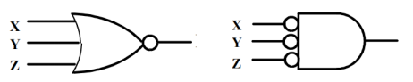
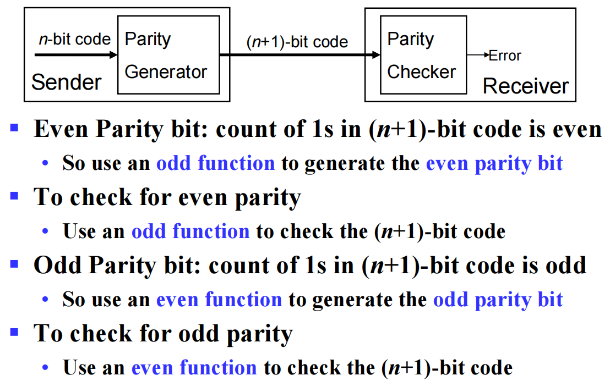
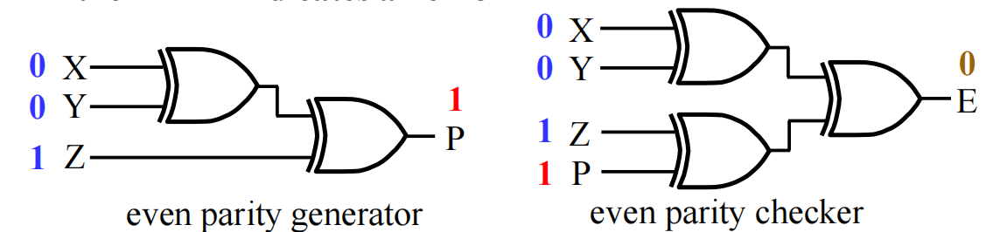
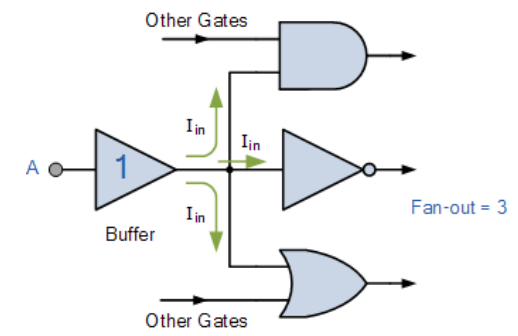

# 逻辑门补充

## 或非门 | 与非门

- 或非：`NOR` ，可以用`OR-Invert`和`Invert-AND`分别表示，如下图所示：



- 与非：`NAND` ，可以用`AND-Invert`和`Invert-OR`分别表示，如下图所示：


与非门和或非门都是**通用门**(universal gate)，我们可以只使用与非（NAND）门或只使用或非（NOR）门来实现这个电路中的所有逻辑运算。

## 异或门 | 同或门

- 异或(Exclusive OR)：`XOR`，符号为$\oplus$。

    

- 同或(Exclusive NOR)：`XNOR`(就是异或门的输出取反)，符号为$\odot$。

    

同或门也被称作*equivalence function*，因为它可以实现等价函数。

!!! note "异或门 | 同或门的作用"
    - 加法器、减法器、乘法器；( • Adders/subtractors/multipliers)
    - 计数器、递增器、递减器；( • Counters/incrementers/decrementers)
    - 奇偶生成/校验器；( • Parity  generators/checkers)

- `XOR`和`XNOR`满足交换律和结合律。

!!! note ""
    在很多成对的正整数中找一个单身狗，最好的方法是异或，因为异或满足交换律和结合律，所以我们可以把所有的数异或起来，最后得到的结果就是单身狗。

    ``` c
    int Singular(int a[], int Count){
        if (Count == 0) {
            return 0;
        int value = 0;
        for (int i = 0; i < Count; i++) {
            value ^= a[i];
        }
    }
       
    ```

- 严格地说，`XOR`和`XNOR`门不存在超过两个输入。我们称多输入的`XOR`和`XNOR`门为奇/偶函数(Odd/Even function)。

!!! note ""
    奇函数——多输入的异或：输出为`1`时，与二变量函数只需要一个变量的值为`1`相比，三变量或者三变量以上的函数则需要奇数个变量的值为`1`。

    偶函数——多输入的同或：输出为`1`时，与二变量函数只需要两个变量的值相同相比，三变量或者三变量以上的函数则需要偶数个变量的值相同。

    根据这个性质，我们可以把它们应用于奇偶生成/校验器。

    

    生成器和校验器所使用门的数量也不同，如下图为偶数生成器和校验器：

    

- 观察其卡诺图的形状（棋盘形），可以发现，它们是天然优化的，即不可优化的。

## Buffer | 缓冲器

Buffer：$F=X$

- buffer 可以作为放大器，提高电路的电压水平（回忆数字信号的宽进严出）
- buffer 可以提高电路运行的速度



## 三态门

!!! note ""
    我们不能把多个输出直接连在一起，因为这样会导致短路，所以我们需要三态门来解决这个问题。

**三态缓冲器(3-State Buffer)**:

除了输入和输出，它还有一个 **使能端(enable)** 来控制输出。

所谓的三态指的是：

- 当使能端为 `1`，且输入为 `1` 时，输出为 `1`；
- 当使能端为 `1`，且输入为 `0` 时，输出为 `0`；
- 当使能端为 `0`，输出为 `Hi-Z`/`Z`/`z`(浮动，高阻态)；


!!! note "作用"
    我们可以用三态门来解决多路输出互联的问题，这可以让多个输入在同一时刻只有一个被输出到总线中——实现的手段就是通过电路来使同一时刻只有一个使能端为 `1`。

    在数字逻辑设计中，三态门实现总线的相关知识将在 **[第六章](../Chap06.md#三态门实现)** 提到。

!!! tip "碎碎念"

    所以什么是「高阻态」？它要如何理解？以下是我根据它的应用反推得到的结论：

    高阻态同它字面意思相同，我们可以当它此时是断路，而高阻态重点要与低电平做区分：如果现在存在一个“导线”，它有三个端，其中我们人为地认为其中两个是输入，分别命名为 a 和 b，另外一个认为是输出，命名为 c。

    此时，我们是不允许 a 和 b 一个为高电平，一个为低电平的，因为我们这里人为定义的输入输出并不影响电流的流动方向，所以当 a 为 `1`，b 为 `0` 时，电流很可能会变成从 a 流向 b，电源可能直接接地，这是我们不希望看到的，这也是为什么我们需要一个或门来实现这个逻辑行为（换言之，这种“三端”电路是相当危险的，不过当我们人为定义多个输出时，一般作为接收端的电路都有二极管防止逆流，所以单输入多输出是很常见的）。

    从更抽象地角度来理解，一根导线最多承载一份信息，然而有两个输入介入，此时我们只有 `0`/`1` 两态，不管怎么样，我们都同时拿到了来自两个输入的数据，而对于只能承载一份信息的导线来说，这两个信息冲突了。所以我们需要 `MUX`(Multiplexer | 多路选择器) 来选择我们需要的到底是哪个信息，然后再给导线。

    而三态门，在高低电平外引入了「高阻态」，就非常巧妙地解决了这个「多输入」危险的问题，当我们不希望这个数据被输入时，我们直接把它断开，类似于直接把开关断开，只要我们让导线的若干输入中只有一个三态门不在「高阻态」，就能够优雅地实现多路输出互联。

---

## 复杂门

通过一些基本门组合出来的门，它们的表示方法大致如下：


