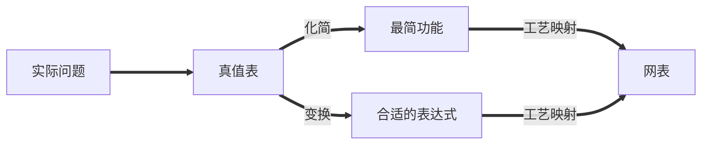
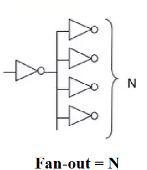
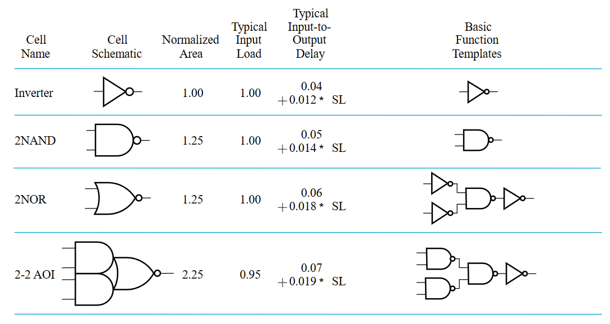

# 技术实现和逻辑设计 | Implementation Technology and Logic Design

!!! note "表示逻辑的方法"
    1. <u>真值表(Truth Table)</u>；
    2. 布尔函数(Boolean Function)；
    3. <u>卡诺图(Karnaugh Maps)</u>；
    4. <u>时序图(Timing Diagram)</u>；
    5. 逻辑电路图(Logic Circuit)；

    其中，下划线的方法在功能确定的情况下，其表示是唯一的。

而我们的设计，就是在满足功能的前提下，尽可能优化和找到最好的设计。

而主要的设计过程如下：

1. 确定系统的行为；
2. 阐述输入和输出之间的逻辑关系，并用真值表或逻辑表达式表达出来；
3. 优化逻辑表达以减少成本(比如使用卡诺图)；
4. 将优化后的逻辑设计<u>工艺映射</u>到硬件实现上；
5. 验证正确性（在仿真环境中）；

---

## 分层设计 | Hierarchical Design

分层设计即将复杂问题模块化分解为若干层次，然后逐个抽象解决。

其设计方法分为 **自顶向下(Top-Down)** 和 **自底向上(Bottom-Up)**。

前者从需求开始，自顶向下分解功能设计；后者根据现有的元件去组合成目标功能。

---

### 集成电路 | Integrated Circuit

**集成电路** 又叫 **芯片(chip)**，分为如下若干等级：

- SSI(small-scale integrated)  含 不到 10 个 gates；
- MSI(medium-scale integrated)  含 10 ~ 100 个 gates；
- LSI(large-scale integrated)  含 成百上千 个 gates；
- VLSI(very large-scale integrated)  含 成千上亿 个 gates；

---

## 技术参数

门的实现主要通过这些参数特性来描述：

| Name                  |Description|
|:----------------------|:--|
| **Fan-in**            | 一个逻辑门可用的输入数量 |
| **Fan-out**           | 一个逻辑门输出时可驱动的标准负载数量 |
| Logic Levels          | 高低电平的输入输出电压范围 |
| Noise Margin          | 对外界噪声的容忍能力(具体来说是不会导致行为异变的最大噪声阈值) |
| Cost for a gate       | 衡量门对集成电路成本的贡献 |
| **Propagation Delay** | 输入信号改变后，输出改变所需的时间 |
| Power Dissipation     | 电源输出能耗和门的能耗 |

---

### 扇入\扇出 | Fan-in\out

扇入描述了一个门能够接受的最多输入量，如一个四输入与非门的扇入就是 4；

{: width=20%}

而扇出描述的则是一个门的输出(栅极输出)在不降低工作性能的情况下能够负载多少门，例如一个非门的输出能够同时负载 4 个非门并且都能正常工作，则其扇出为 4，其也能通过标准负载来定义。

{: width=20%}

!!! note "标准负载"
    所谓的标准负载，是衡量“负载”的一个“单位砝码”。其大小等于一个非门(逆变器)贡献的负载压力。

那么要如何评估负载呢？首先我们引入 **转换时间(transition time)**：

---

#### 转换时间 | Transition Time

转换时间分为 $\mathrm{t_{LH}}$(rise time) 和 $\mathrm{t_{HL}}$(fall time) 两个部分。

- rise time 等于栅极输出从 $\mathrm{V_{CC}}$ 的 10% 升高到 90% 所需要的时间；
- fall time 等于栅极输出从 $\mathrm{V_{CC}}$ 的 90% 降低到 10% 所需要的时间；

通过时序图表示就是这样：

---

随着负载增加，转换时间也会增加（给电容充电的时间增加），而扇出定义中提到的“最大负载”，就是指它的转换时间不超过它预定的最大转换时间。

> 从左到右表示负载不断增加时，rise time 的变化趋势。

---

### 传播延迟

**传播延迟(propagation delay)** 衡量了门的输入变化导致输出变化所需要的时间。由于从低电平转化到高电平和高电平转化到低电平所需要的时间不一样，所以传播延迟同样有两个部分，分别使用 $\mathrm{t_{PHL}}$ 和 $\mathrm{t_{PLH}} 来表示$。

更具体的来说，传播延迟的计算方法是输入和输出的变化中点（即变化到 $\frac{1}{2}V_{CC}$ 时）的时间差，通过时序图表示就是这样：

> 此外，我们还可以引入 $\mathrm{ t_{pd} }$ 来统一表示 $\mathrm{t_{PHL}}$ 和 $\mathrm{t_{PLH}}$。数值上，$\mathrm{ t_{pd} } = average(\mathrm{t_{PHL}}, \mathrm{t_{PLH}})$ 或 $\mathrm{ t_{pd} } = max(\mathrm{t_{PHL}}, \mathrm{t_{PLH}})$。

!!! note ""
    === "题面"
        根据时序图，写出门的传播延迟，此处 $\mathrm{ t_{pd} } = average(\mathrm{t_{PHL}}, \mathrm{t_{PLH}})$。

        

    === "答案"
        

!!! question "Transition Time vs. Propagation Delay"
    转换时间专注于输出的变化，而传播延迟则包含了输入的变化和输出的变化整个过程。

    从时序图上的表示来看，转换时间只需要输出的时序图即可表示；但传播延迟则是通过比较输入和输出的偏差来表示的。

    

---

## 延迟模型

为了刻画门的 **固有门延迟(inherent gate delay)**，我们需要对其建模，常见的 **延迟模型(delay model)** 有以下两种：

- 传输延迟(transport delay): 认为输入和输出之间的延迟是一个定值的；
 

- 惯性延迟(inertial delay): 引入了 **拒绝时间(rejection time)**，只有当输入达到一定能量后，才会出发栅极输出（在这种模型下，噪音等会被过滤）；

将不存在延迟的模型、传输延迟模型和惯性延迟模型做比较地来看，就是如下情况：

---

## 延迟以及相关问题

!!! info "引入"
    由于实际电路中实现延迟，数学上的逻辑表达式与实际电路情况会存在不同——即存在若干数学上无法直接解决的问题。

    所以研究延迟是非常必要的。

---

### 延迟计算

计算一个电路的延迟时，有两方面需要考虑，一方面是电路自身所导致的一个固定延迟，另外一方面则是由于不同的负载导致的额外延迟。

> 在这个例子中，0.07 为固定延迟，0.021 为一个标准负载带来的延迟系数，SL(4.5 here) 则是标准化的负载量。

而具体的表达式，会在 Cell Library 里写。

---

### 延迟带来的问题

由于存在延迟，许多在数学意义上没有问题的逻辑表达式在电路中就存在非常大的问题。

例如，从数学角度看，$\mathrm{Y=\overline{A}A}$ 的值恒为 `0`，但是实际上由于延迟，其仿真波形中会出现这样一个 **毛刺(glitch)**，而这在工程意义上有很大的问题。

{: width=20%}

???+ note "更复杂的 🌰"
    让我们分析下面这个二路选择器，其功能是通过 S 控制输出表达的是 A 还是 B，在传输延迟模型下，其波形如下：

    
    > 可以发现，Y 中出现了意料之外的毛刺。

    而这中毛刺可以用添加冗余项来解决：

    

---

## 成本 | Cost

!!! question "为什么我们之前拿门的计数来作为成本？"

    在集成电路中：

    - 门的成本与门占用的芯片面积成正比
    - 门的面积大致与晶体管的数量和尺寸以及连接它们的布线量成正比
    - 忽略布线面积，栅极面积大致与栅极输入数量成正比。
    
    因此，栅极输入数量是栅极成本的粗略衡量标准。当然，如果已知栅极占用的实际芯片布局面积，则这是一个更准确的衡量标准

## 正逻辑和负逻辑

**正逻辑(positive logic)** 就是 `1` 是有效信号，**负逻辑(negative logic)** 就是 `0` 是有效信号。而在正逻辑中 AND 门的作用就等效于负逻辑中 OR 门的作用，这也正是我在前面几章的笔记中提到的对称。

而正逻辑的电路的符号一般就是正常的逻辑门符号，而负逻辑的逻辑门符号则可能有小三角标，即 **极性指示器(polarity indicator)**：

> 如图，左侧是正逻辑电路的符号，右侧是负逻辑电路的符号。

---

## 工艺映射 | Technology mapping

### 元器件库

??? note "读元器件库"

    

### 工艺映射

**工艺映射(technology mapping)** 是指将逻辑图或网表转化为可以用工艺实现的新的图或网表的过程。

有时我们会使用与非门和非门替换与门和或门(因为电路层面，与门实际上就是通过与非门实现的)，然后会发现有一些连续非门可以相互抵消，例如下面的情况：

> 蓝绿色块中即为被替换后的内容，然后我们发现出现了若干可以抵消的非门。

当然，也可以通过或非门来实现，比如下面的情况：

---

## 验证正确性

**验证正确性(Verification)**指的是证明最终设计的电路能够实现预期**行为(Specification)**。

简单的行为可以用真值表、布尔代数式、HDL 代码等描述。

最基本的验证正确性方法有：

- 人工逻辑分析(Manual Logic Analysis)：
    - 找到最终电路的真值表或布尔代数式，判断其是否和预期行为一致；
- 仿真(Simulation)：
    - 在仿真环境中，使用合适的测试输入（激励信号）来测试最终电路（或其网表，可能编写为 HDL），通过观察其响应结果来判断是否实现预期行为；

!!! question "Why Simulate?"

    我们曾在数逻实验中验证过二输入与非门的正确性，那时我们采用人工逻辑分析，通过测试确定了待测门的真值表，并将其与标准的二输入与非门真值表比较，从而判断我们的二输入与非门是否正确实现；

    但如果我们需要验证一个一百万输入与非门的正确性呢？（仅用于举例）

    我们发现，在现实世界中人工求解这个电路的真值表或布尔代数式是不可能的。这时候我们可以设计一组具有代表性的输入（仍然是个不小的数目），让计算机在仿真环境中用这组输入去测试电路，并将测试结果与预期结果进行对比。我们无法确保验证是否**充分**，但至少这是实践意义上**足够充分**的验证。

---
