# 组合功能模块 | Combinational Functional Blocks

---

## 基本逻辑函数

- **常量函数(Value-Fixing)**：$F=0\;\;or\;\;F=1$ | 输出定值；
- **传输函数(Transferring)**：$F=X$ | 直接输出输入值；
- **逆变函数(Inverting)**：$F=\overline{X}$ | 输出输入的相反；
- **使能函数(Enabling)**：$F=X\cdot En \;\; or \;\; F = X + \overline{En}$ | 通过使能控制输出是否可变，分为两种，比如与的形式中，只有 $En$ 为 `1` 时，$F$ 表现为 $X$ 的值；反之输出必定为 `0`（注意区分它与三态门的区别，高阻态or定值）；

    

- **多位基本函数(Multiple-bit Rudimentary Functions)**: 传输过程中用总线(bus)表示

    

---

## 基本功能块 | Functional Blocks

!!! note ""
    最广泛，最有用的四个功能块

- 译码器(Decoder)
- 编码器(Encoder)

- （三端）多路选择器(Multiplexer) `MUX`
- （三端）信号分离器(Demultiplexer) `DEMUX`

---

### 译码器 | Decoder

译码器（Decoder）能将信息从 $n$ 个输入转换为 $2^n$ 个或更少的唯一输出。具体是怎么实现的呢？实际上，译码器是在枚举 $n$ 个输入的所有排列方式（共 $2^n$ 种）。更进一步的，这可以理解为是在枚举最小项（minterms）。比如 $3-to-8$ 译码器，当输入为某个特定组合 `101` 时，只有相应的表示 `101`（或者说 $\sum_m(5)$）这个组合的输出是 `1`。

如何构造一个 $n-to-2^n$ 译码器？我们用递归的思路来求解：

1. 设 $k=n$；
2. 如果 $k$ 为偶数，问题分解为设计两个 $\frac{k}{2}-to-2^{\frac{k}{2}}$ 译码器，并将它们用 $2^k$ 个与门连接起来；如果 $k$ 为奇数，问题分解为设计一个 $\frac{k-1}{2}-to-2^{\frac{k-1}{2}}$ 和一个 $\frac{k+1}{2}-to-2^{\frac{k+1}{2}}$ 译码器，并将它们用 $2^k$ 个与门连接起来；
3. 对每个译码器重复第二步，直到 $k=1$，这时候我们使用一个 $1-to-2$ 译码器；

!!! example "$3-to-8$"
    设计一个 $3-to-8$ 译码器。

    1. $k=3$，为奇数，分解为 $2-to-4$ 和 $1-to-2$ 译码器，并将它们用 $2^3$ 个与门连接起来；
    2. $k=2$，为偶数，分解为两个 $1-to-2$ 译码器，并将它们用 $2^2$ 个与门连接起来；
    3. $k=1$，使用一个 $1-to-2$ 译码器；

    

    通过上图可以看到，用门连接的方式就是下方与上方的笛卡尔积：比如上方输出为$(B, C, D, E)$，下方输出为$(\overline{A}, A)$，则 链接方式为$(B, \overline{A}), (C, \overline{A}), (D, \overline{A}), (E, \overline{A}), (B, A), (C, A), (D, A), (E, A)$

    {width=20%}

!!! example "$6-to-64$"
    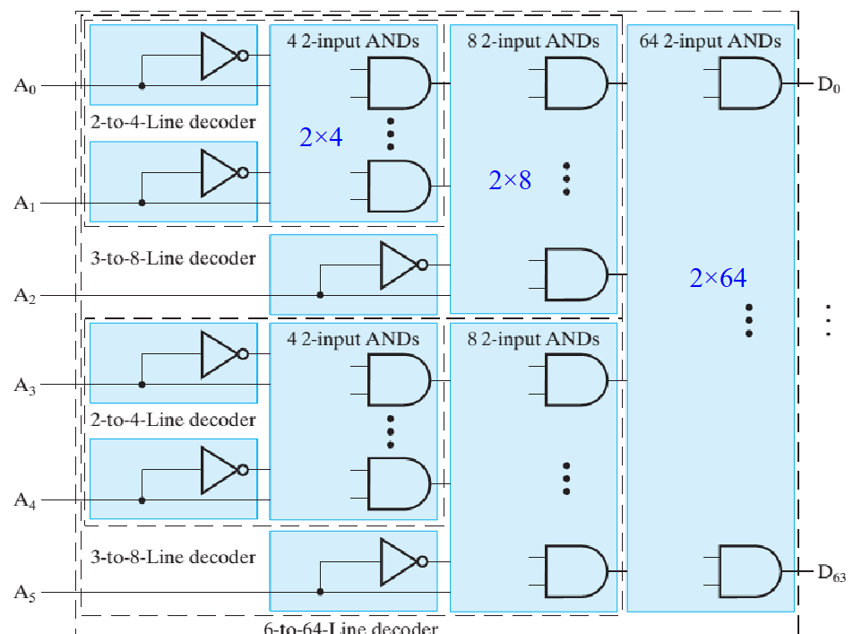

    原先的门输入代价为 $GN = 6+6*64=390$
    
    用译码器分层实现后，门输入代价为 $GN = 6 + 2*64 + 2*2*8 + 2*2*4 = 182$

!!! example "$8-to-256$"
    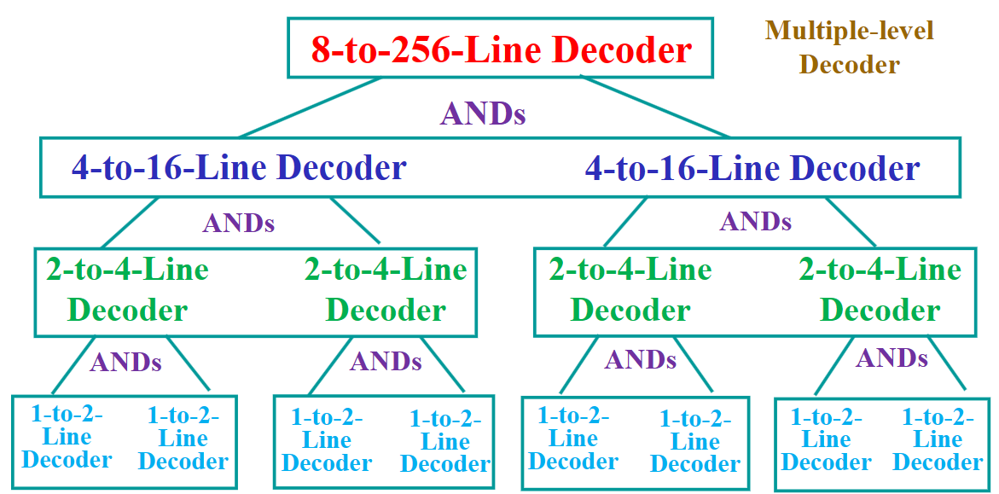

#### 添加使能端

我们通常会为译码器添加一个使能端：

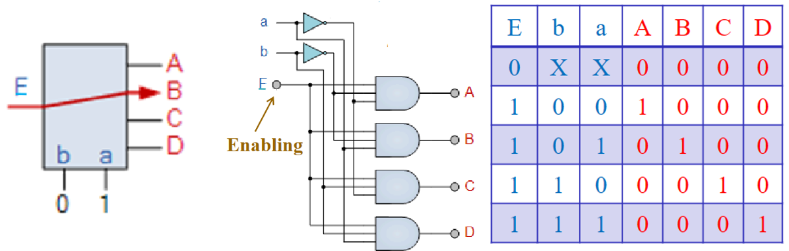

事实上，这也可以称作信号分离器(`demultiplexer`)

!!! note "运用使能端的$3-8$译码器"

    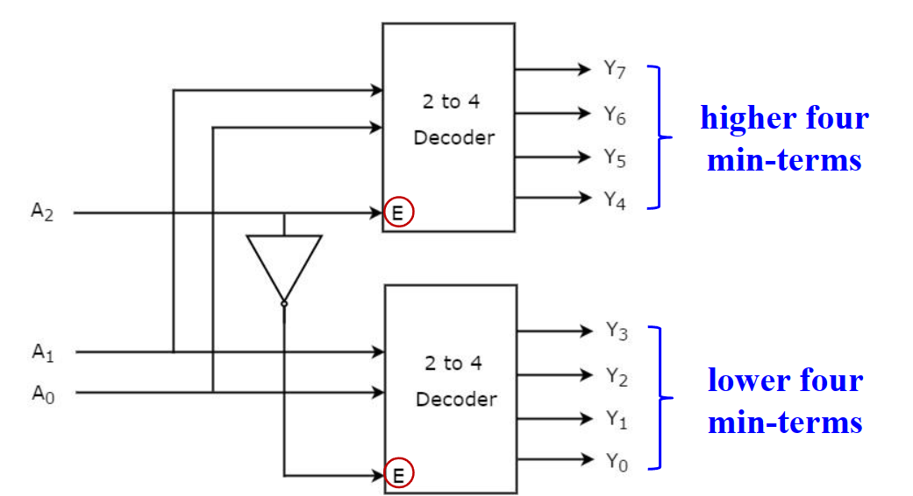

    轮流使能。空间比刚刚的二分法大了。

#### 译码器的应用

译码器本质上完成了枚举最小项的工作，如果我们在译码器的输出后面接上或门，就可以实现 SOM 的逻辑表达。因为 SOM 可以表达任何组合逻辑，所以译码器就可以实现任何的组合逻辑。

由于底层的电路能够直接实现的运算十分局限，所以需要用译码器来实现一些基础运算，例如加法。

!!! note ""

    === "加法器"

        一位加法器就可以通过译码器和或门实现，核心就是枚举输入的各种情况，然后用或门拾取 sum 和 carry 的最小项。

        

    === "三值异或"

        

    === "用 7 段数码管显示 BCD 码"

        首先要判断使用的数码管是共阳极(Common anode)还是共阴极(Common cathode)，这会导致发光的有效电平不同

        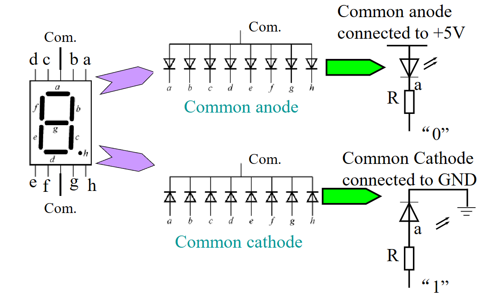

        之后就可以通过真值表来进行设计(此时是共阴极)

        

---

### 编码器 | Encoder

编码器（Encoder）与译码器是对称的，能将信息从 $2^n$ 个或更少的输入转换为 $n$ 个输出。但和译码器不同的是，普通编码器必须要求输入是 one-hot 的，即只允许存在一个输入为 `1`，否则无法判断得出唯一输出。此外，编码器的逻辑表达式和具体电路实现，通常都比译码器更为复杂。

!!! note "one hot -> binary"

    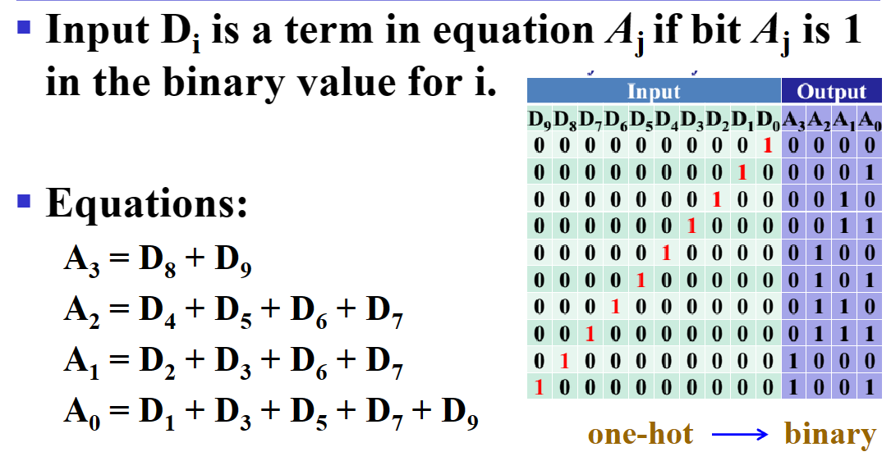

!!! note ""
    使用独热码的时候，因为别的输入都是未知的，如果别的量作`X`来方便优化，那此时就无法判断得出唯一输出。

#### 优先编码器

优先编码器（Priority Encoder）可以解决上述问题。

优先编码器能够实现优先级函数，它不要求输入是 one-hot 的，而是总是关注有效输入中优先级最高的那一个。即比如当优先级最高的那一位是 `1` 时，其它所有优先级不如它的位置的值都是我们不关心的内容了。

!!! example "中断(interrupt)判优器"
    优先编码器的一种应用就是中断判优器。

    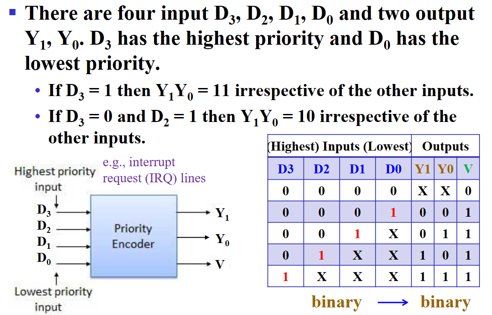

    > 其中 $V$ 表示输出是否有效，在中断判优系统中即表示是否有中断请求。

!!! example "计算逻辑表达式"
    是正难求反的思路。

    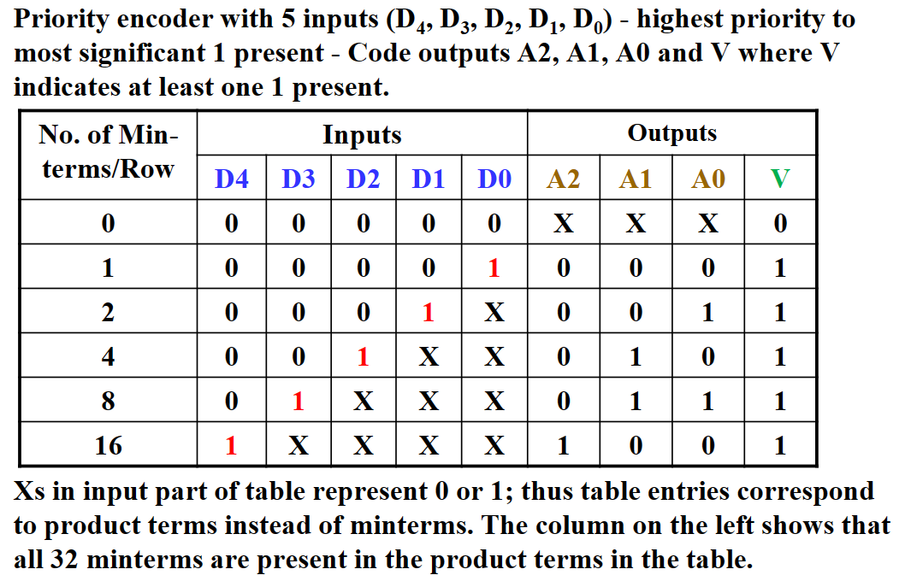

    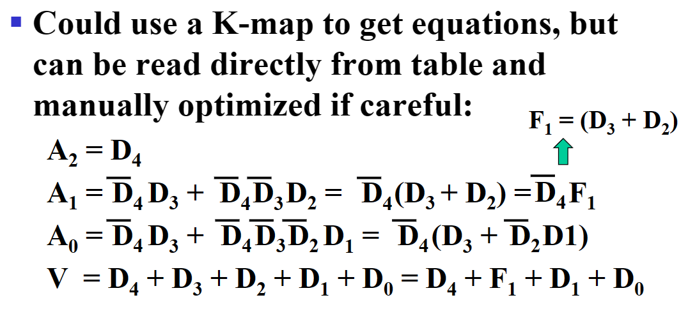

---

### 多路选择器 | Multiplexer

多路复用器（Multiplexer，或称为数据选择器）可以通过 $n$ 个控制信号，对 $2^n$ 个或更少的数据信号做选择，并得到 $1$ 个选择结果输出。

MUX 和译码器一样，都可以表达任意组合逻辑。这是因为 MUX 的实现内部就存在一个译码器，我们只需要将 MUX 的控制端（也就是译码器）用作输入，将组合逻辑的真值表写入 MUX 的选项端进行选择，就可以表达任何组合逻辑。

通常，一个 $2^n-to-1$ MUX 的组成为：

- 一个 $n-to-2^n$ 译码器（MUX 利用了译码器每次只有一个输出为 `1` 的特性，从而实现选择功能）；
- $2^n \times 2$ AND-OR；

!!! example ""

    === "$4-to-1$ MUX"

        

    === "$64-to-1$ MUX"

        

如果使用三态门来实现 `MUX`，那么门输入将大大减少。

!!! example ""

    === "$4-to-1$ MUX 用三态门代替AND-OR那扇门"

        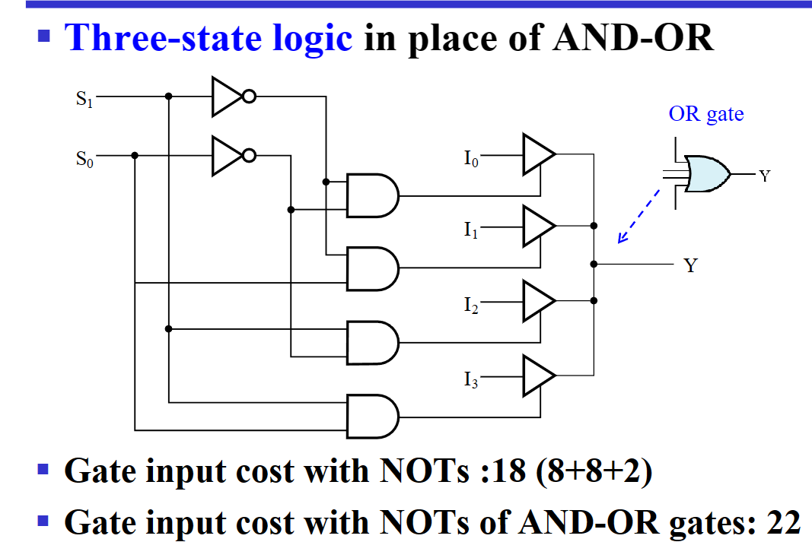

    === "$4-to-1$ MUX 完全用三态门来实现"

        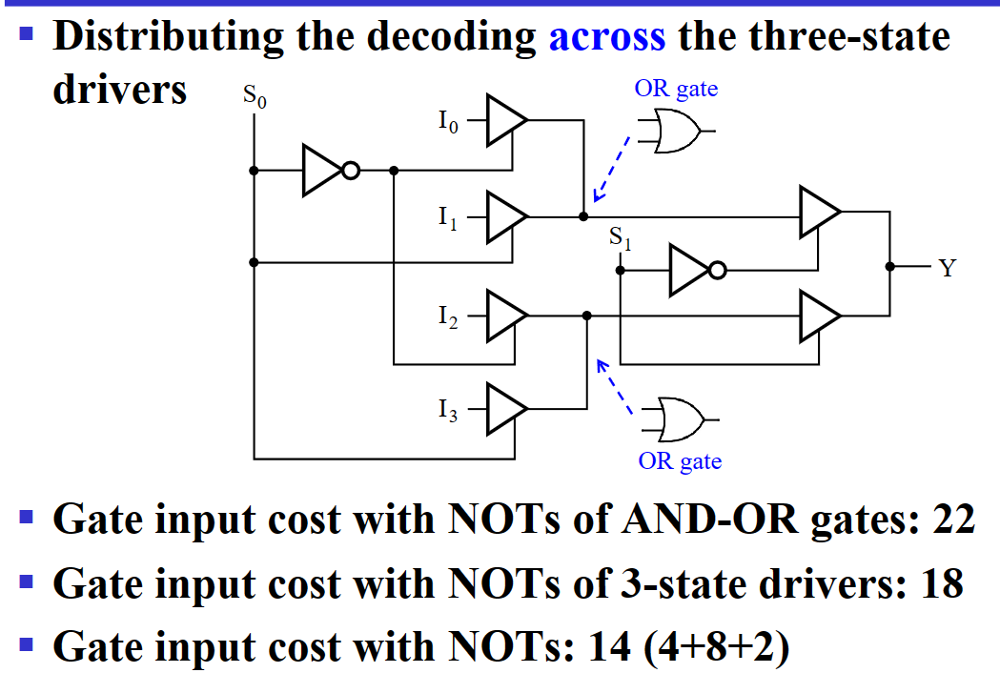

> 完全使用三态门来实现四输入 `MUX`，门输入大大减少。

<u>重要：`MUX` 还可以 **实现任意的逻辑函数**</u>：

- 将控制端当作输入，原来的输入当作待选择的值；
- 即可以将一个四输入 `MUX` 当作一个二输入的函数；

换句话来说，就是将原来的控制端当作输入端，并在原来的输入端写入逻辑函数的真值表，以实现任意逻辑函数。

!!! example "Gray To Binary"

    Gray To Binary 的真值表为
    
    |Gray A B C|Binary X Y Z|
    |:---:|:---:|
    |000|000|
    |001|111|
    |010|011|
    |011|100|
    |100|001|
    |101|110|
    |110|010|
    |111|101|

    我们就可以用一个三输入 `MUX` （以控制端作为输入，原输入端为常量）来实现这个函数：

    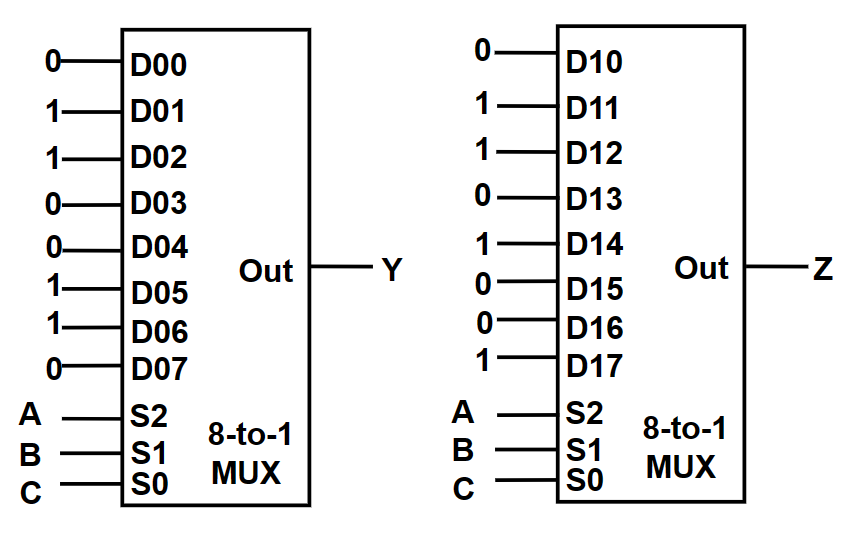

    我们还可以通过把一部分的输入当作常量端来简化元件（降维）：

    

    观察其最小项，使其输出所有最小项。
    
    !!! note "" 
        实际上在降维过程中并不需要全都是 C，如果卡诺图中存在双 `1` 或者双 `0`，也可以仍然使用常量。

!!! note "译码器与多路复用器"

    译码器和多路复用器的原理与实现都有相似之处。如果我们要实现任何组合逻辑，大部分情况下使用译码器会更好，因为它只需要把枚举出的最小项用一个或门连接即可，而 MUX 则需要用很多的与门来达到相同的效果。当然，在某些情况下 MUX 可以进行降维优化，有时候会比译码器效果更好。

    事实上，这样的比较不算公平，因为它们虽然很相似，但设计的目的是差别很大的。译码器用于译码（interpret a coded data），而 MUX 用于选择并传输数据（select and transmit data）。虽然 MUX 中经常用译码器来作为控制端，但 MUX 中的译码器和一个正常的译码器的用途相去甚远：MUX 中的译码器只用于控制，它用 $n$ 个输入信号来表示选择 $n$ 个待选项中的哪一项，译码器信号本身并不传递除了“选择”之外的任何意义；而在一个正常的译码器中，$n$ 个输入显然是有意义的，它们就是译码器所“译”的“码”。这就是两者的区别。

#### 题目例子

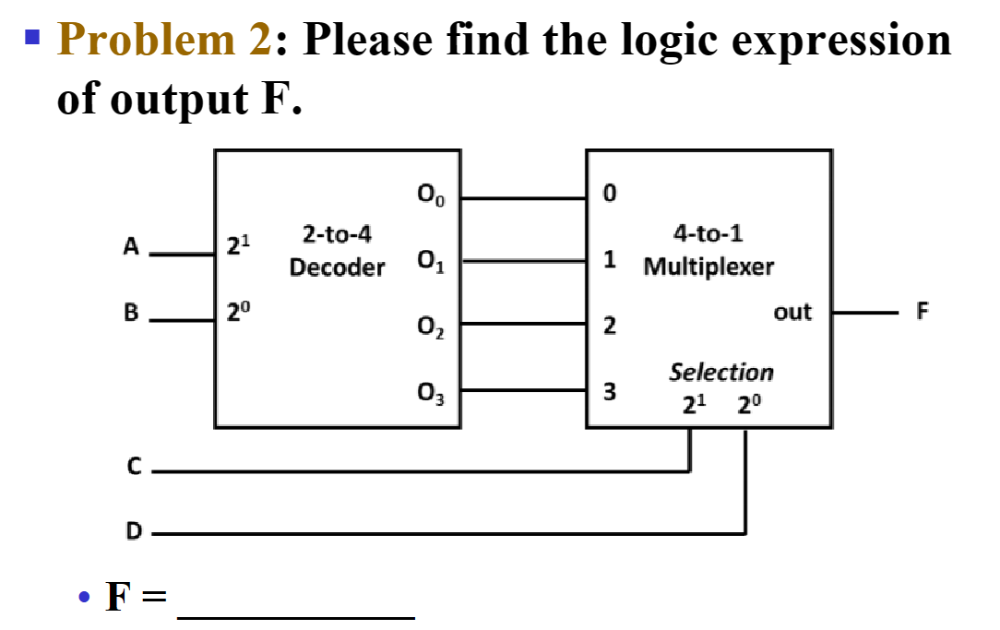

$O_0$=$\overline{A}\overline{B}$，$O_1$=$\overline{A}B$，$O_2$=$A\overline{B}$，$O_3$=$AB$

|$O$|$CD$|
|:---:|:---:|
|$O_0$|`00`|
|$O_1$|`01`|
|$O_2$|`10`|
|$O_3$|`11`|

$\therefore F = O_0\overline{C}\overline{D} + O_1\overline{C}D + O_2C\overline{D} + O_3CD=\overline{A}\overline{B}\overline{C}\overline{D} + \overline{A}B\overline{C}D + A\overline{B}C\overline{D} + ABCD$

---

### 信号分离器 | Demultiplexer

简写为 `DEMUX`，通过控制端选择输入给到若干输出中的哪一个。

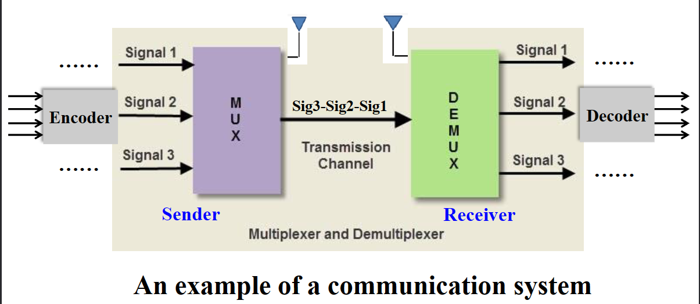

---

后续 👉 **[可编程技术](../Chap05.md#_1)**

---
