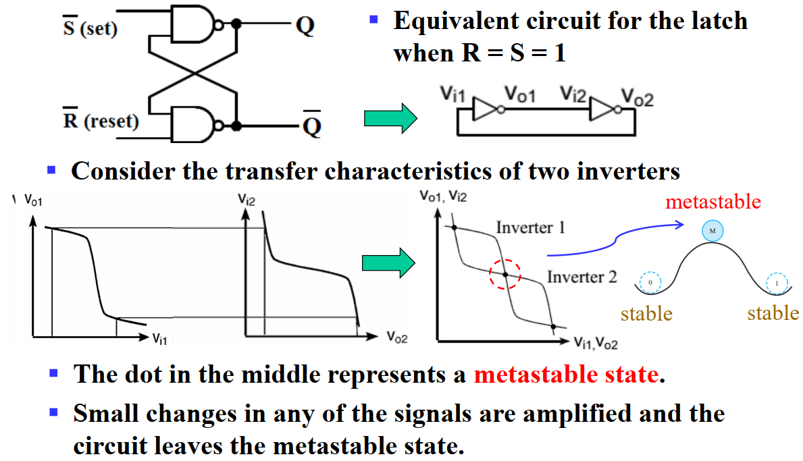
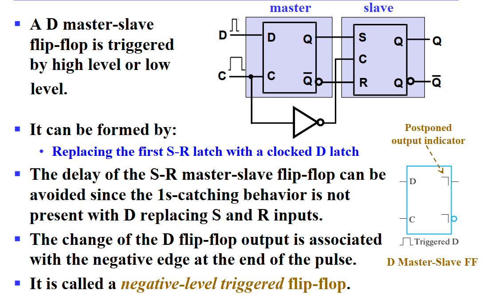
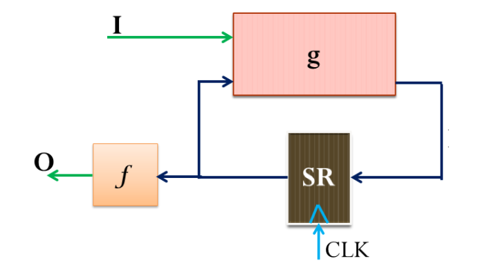
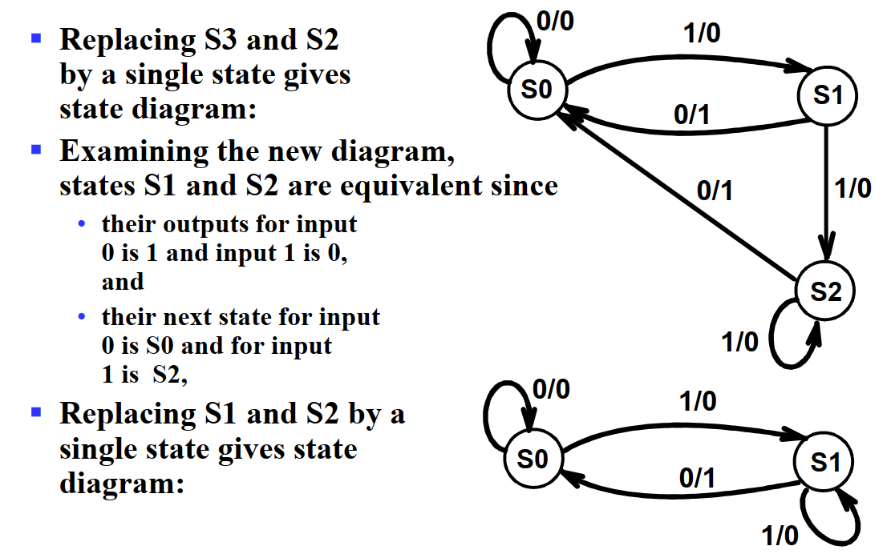

# 存储元件与时序电路分析

!!! info "引入"

    时序电路中最重要的就是信息存储元件。当输入信号不发生变化时（重点是变化，即输入和存储信息未必存在对应关系）存储元件就能够保持其内部存储的二进制数据。

    存储元件主要有 **锁存器(latch)** 和 **触发器(flip-flop)** 两种，其中前者是后者的基础，或者说多数情况下我们使用后者，但后者由前者构成。

    
---

## 锁存器 | Latch

!!! summary "缓冲"

    缓冲器(buffer) 一般通过两个非门串联，并将输入连通输出实现，这样能够实现信息的存储，然而无法修改。而锁存器就是在缓冲器的基础上，将非门替换为或非门或与非门实现的。

    
    > 其中，从给定输入到更新输出有一个 $t_G$ 的延时。

    !!! note "Metastable"
        在 (d) 图中，可能会产生 **亚稳态(metastable)**。这在 Latch 中也可能出现。

        

为了让锁存器稳定，我们要避免**振荡(oscillation)**和**亚稳态(metastable)**。这要求我们不同时将 S 和 R 置 `1`，且改变输入时确保结果已经稳定。

### SR & S'R' 锁存器 | SR & S'R' Latch

SR 锁存器和 S'R' 锁存器的基本原理是一致的，只不过前者用的是或非门，后者用的是与非门。

SR 锁存器和 S'R' 锁存器的输入都是 S(Set) 和 R(Reset) 两个部分，输出都是 Q 和 Q' 两个部分。

> **名称上** 的共同点是，当 S 为 `1` 时，Q 都会是 `1`；对于 R 和 Q' 也是这样，只不过要注意，S'R'锁存器输入的并不是这里所说的 S，而是将 S' 作为输入。

!!! note ""

    === "SR 锁存器"
        
    === "S'R' 锁存器"
        

!!! note ""
    这两个电路都属于异步电路。

一个记忆方法是，SR 的门元件对 `1` 敏感，所以是 或非门 的实现；而 S'R' 的门元件对 `0` 敏感，所以是 与非门 的实现。而通过 「当 S 为 `1` 时，Q 都会是 `1`」可以得到 S、R 与 Q、Q' 的位置。

但是实际的存储元件并不是单纯的 SR/S'R' Latches，因为后者容易受到毛刺信号干扰。所以我们需要将该电路改进。

我们改进电路并添加使能端，得到**带控制输入的 SR 锁存器(SR Latch with Control Input)**（S'R'略），这里的控制输入是 C(Control)，若为时钟脉冲，则此时电路为同步电路。

!!! warning "注意！"

    SR 锁存器通过 或非门 实现，但带输入控制的 SR 锁存器则通过 **与非门** 实现！

---

### D 锁存器 | D Latch

D 锁存器实际上是带控制输入的 SR 锁存器的改进。

我们关注到，即使是带控制输入的 SR 锁存器，也存在一个「undefined」状态，而这是我们不希望出现的。为了避免这种情况的发生，我们可以直接强制要求 $S = \overline R$，于是就避免了 undefined 情况的出现，而电路中 C 的存在保证了原来的`0`，`0` 。我们称之为 **D 锁存器**，电路图如下：

只有当 C 为 `1` 时，D 锁存器才能写入数据；而当 C 为 `0` 时，D 锁存器的数据就不会变化。

---

!!! warning "透明的危害：空翻"

    当然，D 锁存器也存在问题。如果我门将 $\overline Q$ 接到 D 上，就会发现 D 锁存器将不停的变化其中的数据，出现 **空翻**，导致我们无法确定 C 置 `0` 时 Q 的输出究竟是什么，而这是非常危险的。

    这主要是因为 D 锁存器的输入和输出都是直接暴露出来、同时允许变化的（不是同时变化，是指在 Input 可以变的时候 Output 也能变），即 **透明(transparent)** 的。这就导致了在一个时钟周期里，同时存在 **可以互相影响** 的两个东西。这也是触发器所解决的问题。

---

## 触发器 | Flip-Flop

为了解决上面提到的，由「透明」引发的问题，而采用触发器的设计。通过组合两个锁存器，主要有两种实现方法：

1. 在有脉冲（高电平）时，修改第一个锁存器的值，保持第二个锁存器的值；在没有脉冲（低电平）时候保持第一个锁存器的值，修改第二个锁存器的值，更新触发器的状态，即 **主从式(master-slave)触发器**；
2. 仅在时钟的边缘触发，即在特定时刻仅接受一个输入，即 **边沿触发式(edge-triggered)触发器**；

> 边沿触发式 D 触发器是目前使用最广泛的触发器。

---

### SR 主从触发器 | SR Master-Slave Flip-Flop

这个能解决上述问题，是因为二者的时钟脉冲是相反的，所以在一个时钟周期内，只有一个锁存器是可以变化的的，而另一个是保持的。Master触发器采样数据，Slave触发器展示状态。

在上升沿的时候，Master 触发器可能会采样到毛刺(Glitch)，导致出现错误的状态。这个行为叫做 **(1s 采样)1s catch**

---

### 边沿触发式触发器 | Edge-Triggered Flip-Flop

为了解决上面最后的毛刺问题，我们可以将输入端减半，使用 **D master-slave FF**，在 Master 触发器的输入端加上一个 **同步(synchronizer)**，即将输入信号通过一个 D 锁存器，这样就能够保证输入信号的稳定性。

但此时还是有一个输入窗口，还是会发生干扰。所以，我们缩小输入窗口，使用 **Edge-Triggered FF**。边缘触发触发器仅在时钟信号的过渡期间触发——当脉冲处于恒定电平时，边缘触发触发器忽略脉冲。

!!! note ""

    上图右下角的图示中，下方的凸起表示高电平采样；“┐”表示输出信号的延迟，即输出信号在采样结束后才会发生变化。这里也就是说，输出信号在时钟下降沿后才会发生变化。所以称其为 **negative-edge-triggered FF（负边沿触发式触发器）**。

与之相对应的，我们还有**正边沿触发 D 触发器**。

> 关注上升沿前后，上升沿前一刻，主锁存器可写，从锁存器只读；上升沿后一刻，主锁存器只读，从锁存器只写，且写入的是主锁存器存储的值——换句话来说，存的是上升沿前一刻写入主锁存器的内容。

而它为什么能做到边缘采样？因为它的内部结构为：

需要注意的一点是，D 触发器没有「保持」态。如果要使 D 触发器保持，可以使时钟脉冲失效或通过 `MUX` 将输出接到输入实现。其中前者不太常用，因为受门控的时钟脉冲进入触发器时有延迟，即 **时钟偏移(clock skew)**

---

### 标准图形符号

带尖尖的三角形的表示边沿采样

---

### 直接输入 | Direct Inputs

这些直接输入往往是异步的，一般用来异步置位（直接置位或预置）或异步复位（直接复位或清零）。

对于时序电路来说，「复位」或「置位」这种输入常常作为初始化，即确定各个触发器的「初始状态」。

---

### 触发器的时序参数 | Flip-Flop Timing Parameters

**Setup Time**：在时钟信号的上升沿之前，输入信号必须保持稳定的时间。

**Hold Time**：在时钟信号的上升沿之后，输入信号必须保持稳定的时间。

如果数据在 "setup-hold-window" 内发生变化，则输出是不可预测的或亚稳态的。

## 时序电路分析 | Sequential Circuit Analysis

时序电路的分析包括：

- 用状态表、状态图和输入/输出布尔方程生成时序电路的功能
- 确定时序电路必须满足的时序约束，以防止亚稳态，从而使电路可以无误地使用

!!! note ""
    时序电路的分析过程主要包括：

    1. 推导输入方程、下一状态方程和输出方程
    2. 推导状态表（带状态的真值表）：
        - 输入：电路的输入、电路的当前状态
        - 输出：电路的输出、所有触发器的下一状态
    3. 列出时序电路的下一状态
    4. 得到状态图
    5. 分析电路的性能
    6. 验证电路的正确性，检查自恢复能力并绘制时序参数

为了分析时序电路，我们需要一些工具来表示时序电路的一些特征与逻辑。观察时序电路和组合电路的区别，发现最核心的就是逻辑运算过程中出现了「状态」参与运算。因此，我们需要在各个组合电路分析中采用的表示方法中，添加表示「状态」的信息。

除此之外，如果只是单纯的将「状态」作为一个新的输入，作为增量添加到表达方式中，会发现这些表述会显得很重。所以我们也需要寻找一种更好的办法来表达时序电路中的逻辑，这就是「状态图」。

---

### 触发器的输入方程 | Flip-Flop Input Equation

**触发器的输入方程(flip-flop input equation)** 主要是为其提供一个代数表达方式。它的主要想法是：

1. 表达每一个触发器的输入与输出之间的关系；
2. 表达每一个直接输出的逻辑表达式。其中，触发器的输出符号表示了其类型（即符号）与输出（即下标）。

具体来说，例如下面这个电路：

可以发现，其中包含两个触发器 $D_A$ 和 $D_B$，以及一个组合逻辑输出 $Y$，因而可以根据电路的特征，得到下面这几个式子：

$$
\begin{aligned}
    \text{Output: }\qquad Y(t)   & = (A(t) + B(t))\overline{X(t)}\\
    \text{Input: }\qquad D_A(t) & = A(t)X(t) + B(t)X(t) \\
    \qquad D_B(t) & = \overline{A(t)}X(t) \\
    \text{Next: }\quad A(t+1) & = D_A(t) \\
    \quad B(t+1) & = D_B(t)
\end{aligned}
$$

---

### 状态表 | State Table

当然，时序电路的逻辑有时候也可以通过状态表来描述，只不过与组合电路的 真值表 不同，**状态表(state table)** 有四栏：当前状态(present state)、输入(input)、下一状态(next state)、输出(output)。其含义是比较显然的，只不过需要通过电路图得到状态表，需要首先得到「当前状态」向「下一状态」转移的方程，即对于某个时刻 $t$ 的触发器 $A$ 的输出 $A(t)$，需要得到它下一刻的状态 $A(t+1) = f(A(t), ...)$。

同样以这个电路为 🌰：

首先我们对 $D_A$ 得到转移方程：$A(t+1) = D_A(t) = A(t)X(t) + B(t)X(t)$。类似地也能得到 $B$ 的转移方程。

于是，根据这些信息，我们可以写出它的状态表：

|Present State `A(t)` `B(t)`|Input `X(t)`|Next State `A(t+1)` `B(t+1)`|Output `Y(t)`|
|:--:|:--:|:--:|:--:|
|`0` `0`|`0`|`0` `0`|`0`|
|`0` `0`|`1`|`0` `1`|`0`|
|`0` `1`|`0`|`0` `0`|`1`|
|`0` `1`|`1`|`1` `1`|`0`|
|`1` `0`|`0`|`0` `0`|`1`|
|`1` `0`|`1`|`1` `0`|`0`|
|`1` `1`|`0`|`0` `0`|`1`|
|`1` `1`|`1`|`1` `0`|`0`|

!!! note "Mealy model circuit & Moore model circuit"
    如果输出既依赖于当前状态，也依赖于输入的时序电路，则称为 **米勒型电路(Mealy model circuit)**；而如果输出只依赖于当前状态，则称为 **摩尔型电路(Moore model circuit)**。

    在 **[状态图](#状态图)** 中，我们还将再一次遇到这两个人名。

---

### 状态图 | State Diagram

可以发现，状态表比较清晰的表达了不同的状态和输入得到的结果，但是对于「不同状态之间是如何转换的」这件事的描述并不清晰。而对于「联系」这件事，有向图是一个非常好的形式，所以我们将介绍 **状态图(state diagram)**。

状态图承载的信息量和状态表是一样的，所以也是需要表达 当前状态(present state)、输入(input)、下一状态(next state)、输出(output) 这四个东西。只不过「下一状态」是通过有向边来表示的。当前状态作为一个 node 的属性；而输入作为 edge 的一个属性；至于输出，根据它是放在 edge 上还是 node 上，分为 **米勒型(Mealy)** 和 **摩尔型(Moore)** 两种。

!!! example "Mealy"

    例如，这是一个 米勒型 的状态图，以及对应的状态表。

    

    !!! note ""

        因为米勒型电路的 **输出与当前状态和输入都有关**，所以输出会和输入一起放在 edge 里。
        
        对于米勒型，node 内的二进制为 present state 中的 `AB`；edge 上分别为 input / output：`X`/`Y`；有向边表达了每个状态在特定输入下的下一个状态。
        
        例如，关注 node `00`，它有一条自环 `0`/`0`，对应 状态表 的第一行；它有一条 edge `1`/`0` 指向 node `01`，对应 状态表的第二行。

    {width=50%}
   
    当然，米勒型是有 **缺陷** 的，在时序电路设计之后的步骤中，我们需要根据它来对每一个状态设计输出方程。此时由于两个输出共享同一个目标状态，所以我们需要将两个输出结合到同一个式子中，这将提高设计难度和组合电路成本。

!!! example "Moore"

    而下面是一个 摩尔型 的状态图，以及对应的状态表。

    

    !!! note ""

        因为摩尔型电路的 **输出只与当前状态有关**，所以输出会和当前状态放在一起，即放在 node 里。
        
        对于摩尔型，node 内的二进制表示 present state / output：`A`/`Z`；edge 上列举了这种转移可能的 inputs：`XY`。
        
        例如，关注 node `0`/`0`，它有两条自环 `00` 和 `11`，分别对应 状态表 的第一行和第四行；它有两条 edge `01` 和 `10` 指向 node `1`/`1`，对应 状态表 的第二行和第三行。

    {width=50%}

    摩尔型也存在 **缺陷** 的，非常显然，相比于米勒型，摩尔型需要更多的状态。

换句话来说，米勒型倾向于表达「在特定状态下，特定输入将导致某种结果，以及状态转移」；而摩尔型倾向于表达「特定输入将导致某个状态向另外一个状态转移，而输出更像是一种状态的结果」。

状态图还有进阶形态，之后会提及，就是 **[状态机](./Chap04_2.md/#_2)**。

---

### 等价状态

同一输入序列下，输出序列相同的两个状态是等价的，换句话来说，如果两个状态的输出序列相同，且在每一个输入下，它们的下一状态也相同或等价，则这两个状态是等价的。

例如下图中的 `S2` 和 `S3` 就是等价的。

我们可以消去等价状态，从而简化状态图。

---

!!! info "延时分析"

    延时分析是一个重难点，对于时序电路的延时分析，将在之后单独开一个小结重点介绍。
    
    请参考 **[延时分析](./Chap04_2.md/#_3)**

---
