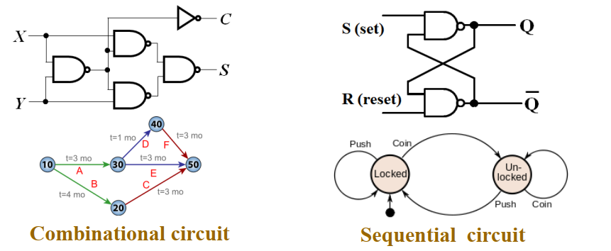

# Chap 4 Sequential Circuits

!!! note "引入"

    上一章讲的是组合电路，虽然组合电路能够实现诸多功能，但是它依然存在一些的问题：

    1. 对于复杂的逻辑，抽象层级多，导致硬件层面开销大、耗时长，一方面提高成本，一方面降低效率；
    2. 组合电路没法实现信息的存储，所有的功能模块对于特定的输入给出相同的输出；

    

    而时序电路则拥有存储信息的能力，对于时序电路来说，输出除了与输入有关（甚至可以没有输入），也可以与自身 **状态(state)** 有关。

时序电路主要分为两类（主要分类依据是输入信号的时间和内部状态改变的时间）：**同步时序电路(synchronous sequential circuit)** 和 **异步时序电路(asynchronous sequential circuit)**。

!!! quote "Wikipedia"

    !!! note "Sequential logic"
        
        Sequential logic is a type of logic circuit whose output depends on the present value of its input signals and on the sequence of past inputs.
    
        That is, sequential logic has state (memory) while combinational logic does not.

    !!! note "Synchronous vs. asynchronous"

        Digital sequential logic circuits are divided into synchronous and asynchronous types.
        
        In synchronous sequential circuits, the state of the device changes only at discrete times in response to a clock signal.
        
        In asynchronous circuits the state of the device can change at any time in response to changing inputs.

很自然地，异步时序逻辑是 input-driven 的，每当输入发生变化，就要进行状态的更新。但是，异步时序逻辑的弊端在于，当输入包含多个变量而它们的抵达有先后区分的时候，电路可能会偏离预期而进入错误的状态。

一般来说，异步电路的设计相对困难（行为与门的传播延迟和输入信号变化的时间序列密切相关），但仍然十分必要，比如触发器就是以一部锁存器为模块设计的；而同步电路的使用更加广泛，通常这些“离散的时刻”都是由 **时钟发生器(clock generator)** 这种时序器件产生周期性的 **时钟脉冲(clock pulse)** 序列来实现的（这种电路一般被称为 **钟控时序电路(clocked sequential circuit)**，由于设计相对容易，鲁棒性强，所以被广泛应用）。

!!! note "单元概述"
    - [存储元件与时序电路分析 | Storage Elements and Sequential Circuit Analysis](./Chap04_1.md)
    - [时序电路设计 | Sequential Circuit Design](./Chap04_2.md)