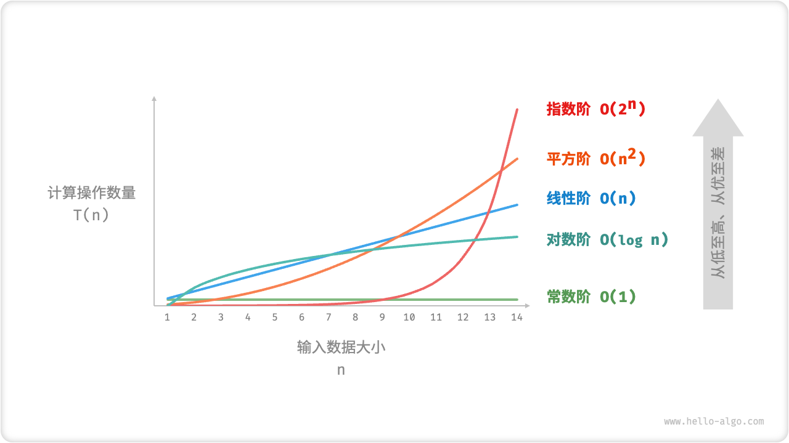

# 算法分析 | Algorithm Analysis

!!! note "本章概述"
    在深入学习数据结构与算法之前，我们要**先对复杂度分析建立初步的了解，以便能够完成简单算法的复杂度分析**。

## 算法定义

「算法 algorithm 」是在有限时间内解决特定问题的一组指令或操作步骤，它具有`Input`/`Output`/`Finiteness`/`Effectiveness`/`Definiteness`这五个特性。

- 问题是明确的，包含清晰的输入和输出定义。
- 具有可行性，能够在有限步骤、时间和内存空间下完成。
- 各步骤都有确定的含义，相同的输入和运行条件下，输出始终相同。

!!! note ""
    程序是可以不 finite 的(***e.g.*** 操作系统)

## 分析内容

由于实际测试具有较大的局限性（难以排除测试环境的干扰因素，展开完整测试非常耗费资源），我们可以考虑仅通过一些计算来评估算法的效率。这种估算方法被称为「渐近复杂度分析 asymptotic complexity analysis」，简称「复杂度分析」。

复杂度分析体现算法运行所需的时间（空间）资源与输入数据大小之间的关系。**它描述了随着输入数据大小的增加，算法执行所需时间和空间的增长趋势**。这个定义有些拗口，我们可以将其分为三个重点来理解。

- “时间和空间资源”分别对应「时间复杂度 time complexity」和「空间复杂度 space complexity」。
- “随着输入数据大小的增加”意味着复杂度反映了算法运行效率与输入数据体量之间的关系。
- “时间和空间的增长趋势”表示复杂度分析关注的不是运行时间或占用空间的具体值，而是时间或空间增长的“快慢”。

**复杂度分析克服了实际测试方法的弊端**，体现在以下两个方面。

- 它独立于测试环境，分析结果适用于所有运行平台。
- 它可以体现不同数据量下的算法效率，尤其是在大数据量下的算法性能。

### 时间复杂度

时间复杂度分析统计的不是算法运行时间，而是算法运行时间随着数据量变大时的增长趋势。

假设：

- 指令按顺序执行
- 每条指令是简单的，只需要一个时间单位执行
- 数据规模是给定的，而空间是无限的

通常我们需要分析 $T_{avg}(N) \& T_{worst}(N)$, $N$ 是输入规模（可以有多个输入）

### 渐进符号 | Asymptotic Notation

!!! note "定义"

    大 $O$ 表示法 $T(N) = O(f(N))$，如果存在常数 $c$ 和 $n_0$​使得当 $N\geq n_0$ 时 $T(N)\leq c\cdot f(N)$ 。
    
    > 表示渐进上界，即 $T(N)$ 的阶不会高于 $f(N)$（增长比 $f(N)$ 慢或相同，$\leq$）

    大 $\Omega$ 表示法 $T(N) = \Omega(g(N))$，如果存在常数 $c$ 和 $n_0$​使得当 $N\geq n_0$ 时 $T(N)\geq c\cdot f(N)$ 。
    
    > 表示渐进下界，即 $T(N)$ 的阶不会低于 $f(N)$（增长比 $f(N)$ 快或相同，$\geq$）

    大 $\Theta$ 表示法 $T(N) = \Theta(h(N))$，当且仅当 $T(N) = O(h(N))$ 且 $T(N) = \Omega(h(N))$。
    
    > 表示渐进紧确界，即 $T(N)$ 与 $h(N)$ 同阶（增长速度相同，$=$）

    小 $o$ 表示法 $T(N) = o(p(N))$，当 $T(N)=O(p(N))$ 且 $T(N)\neq \Theta(p(N))$ 时成立。
    
    > 表示非渐进紧确上界，（即 $T(N)$ 增长比 $p(N)$慢，$<$）

$2N + 3 = O( N ) = O( N^{k\geq1} ) = O( 2^N ) = \cdots$ We shall always take the smallest f (N).

#### 运算规则

- 若 $T_1(N)=O(f(N)), T_2(N)=O(g(N))$  
    - $T_1(N)+T_2(N)=\max(O(f(N)), O(g(N))$
    - $T_1(N)\cdot T_2(N)=O(f(N)\cdot g(N))$
- 若 $T(N)$ 是最高次数为 k 次的多项式，那么 $T(N)=\Theta (N^k)$  
- 对于任意常数 $k$, 都有 $\log^kN=O(N)$，这说明对数增长非常缓慢。

设输入数据大小为 $n$ ，常见的时间复杂度类型如下图所示（按照从低到高的顺序排列）。

$$
\begin{aligned}
O(1) < O(\log n) < O(n) < O(n \log n) < O(n^2) < O(2^n) < O(n!) \newline
\text{常数阶} < \text{对数阶} < \text{线性阶} < \text{线性对数阶} < \text{平方阶} < \text{指数阶} < \text{阶乘阶}
\end{aligned}
$$

|Time| Name | 1 | 2 | 4 | 8 | 16 |
|:---:|:---:|:---:|:---:|:---:|:---:|:---:|
|1|Constant|1|1|1|1|1|
|$\log n$|Logarithmic|0|1|2|3|4|
|$n$|Linear|1|2|4|8|16|
|$n\log n$|Log Linear|0|2|8|24|64|
|$n^2$|Quadratic|1|4|16|64|256|
|$n^3$|Cubic|1|8|64|512|4096|
|$2^n$|Exponential|2|4|16|256|65536|
|$n!$|Factorial|1|2|24|40326|20922789880000|

- 比较时的规则
    - $N$足够大

- 分析时的规则

    - for loop  
    运行时间是循环内部语句的最长时间（包括 for 边界判断）乘循环的次数
    - 嵌套 for loop  
    运行时间是各个 for loop 的运行时间逐次相乘
    - 连续执行的语句  
    相加
    - if else  
    运行时间 $\leq$ 判断时间 $ + $ 用时最多的语句块的时间
