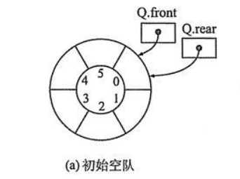

# 循环队列

队列元素的出列是在队头，即下标为0的位置，那也就意味着，队列中的所有元素都得向前移动，以保证队列的队头（也就是下标为0的位置）不为空，此时的时间复杂度为0(n)。

可有时想想，为什么出队列时一定要全部移动呢，如果不去限制队列的元素必须存储在数组的前n个单元这一条件，出队的性能就会大大增加。也就是说，队头不需要一定在下标为0的位置，比如也可以是a[1]等。

而为了避免当只有一个元素时，队头和队尾重合使处理变得麻烦，我们引入两个指针，front指针指向队头元素，rear指针指向队尾元素的下一个位置，这样当front等于rear时，此队列不是还剩一个元素，而是空队列。

根据这种循环的性质，我们易知，对于队列最好的方法是使用链表实现。但是，如果使用数组实现，我们可以通过取余操作实现数组首尾相连，当front或rear越过数组尾部时，回到数组头部，当front或rear越过数组头部后，回到数组尾部。

=== "初始空队"

    

=== "a, b, c 入队"

    

=== "a 出队"

    

=== "d,e,f 入队"

    

!!! note ""
    注意，我们总会浪费一个数组单元。这是为了区分队列为空和队列为满的情况。当front等于rear时，队列为空，当(rear + 1) % maxSize等于front时，队列为满。

!!! note ""
    - 判断循环队列是否为空的条件：rear == front
    - 判断循环队列是否为满的条件：(rear + 1) % maxSize == front
    - 循环队列当前有效元素个数：(rear + maxSize - front) % maxSize【可看作对rear-front取绝对值】