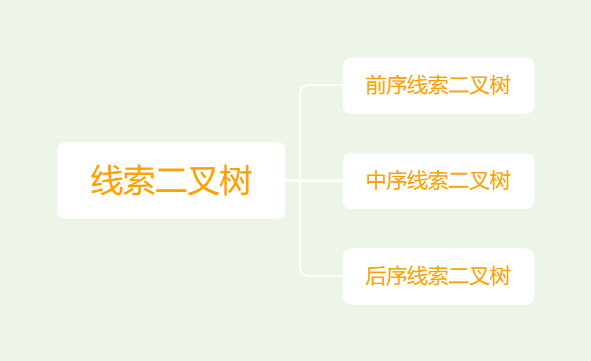

# 二叉树

!!! warning "注意"
    以下着重讲述常用的二叉树，普通的树结构与二叉树的区别只在于，普通树的节点可以有多个子节点，而二叉树的节点最多只能有两个子节点。其余部分是类似的，因此，本文中关于边、深度、高度、层等概念同样适用于普通树。

    普通树转换为二叉树的方法是：将每个节点的第一个子节点作为其左子节点，其余子节点作为其左子节点的右子节点。这样，普通树就转换为了二叉树。
    

「二叉树 binary tree」是一种非线性数据结构，代表着祖先与后代之间的派生关系，体现着“一分为二”的分治逻辑。与链表类似，二叉树的基本单元是节点，每个节点包含：值、左子节点引用、右子节点引用。

=== "C"

    ```c title=""
    /* 二叉树节点结构体 */
    struct TreeNode {
        int val;                // 节点值
        int height;             // 节点高度
        struct TreeNode *left;  // 左子节点指针
        struct TreeNode *right; // 右子节点指针
    };

    typedef struct TreeNode TreeNode;

    /* 构造函数 */
    TreeNode *newTreeNode(int val) {
        TreeNode *node;

        node = (TreeNode *)malloc(sizeof(TreeNode));
        node->val = val;
        node->height = 0;
        node->left = NULL;
        node->right = NULL;
        return node;
    }
    ```

每个节点都有两个引用（指针），分别指向「左子节点 left-child node」和「右子节点 right-child node」，该节点被称为这两个子节点的「父节点 parent node」。当给定一个二叉树的节点时，我们将该节点的左子节点及其以下节点形成的树称为该节点的「左子树 left subtree」，同理可得「右子树 right subtree」。

**在二叉树中，除叶节点外，其他所有节点都包含子节点和非空子树**。如下图所示，如果将“节点 2”视为父节点，则其左子节点和右子节点分别是“节点 4”和“节点 5”，左子树是“节点 4 及其以下节点形成的树”，右子树是“节点 5 及其以下节点形成的树”。


## 二叉树常见术语

二叉树的常用术语如下图所示。

- 「根节点 root node」：位于二叉树顶层的节点，没有父节点。
- 「叶节点 leaf node」：没有子节点的节点，其两个指针均指向 $\text{None}$ 。
- 「边 edge」：连接两个节点的线段，即节点引用（指针）。
- 节点所在的「层 level」：从顶至底递增，根节点所在层为 1 。
- 节点的「度 degree」：节点的子节点的数量。在二叉树中，度的取值范围是 0、1、2 。
- 二叉树的「度 degree」：二叉树中所有节点的度的最大值。
- 二叉树的「高度 height」：从根节点到最远叶节点所经过的边的数量。
- 节点的「深度 depth」：从根节点到该节点所经过的边的数量。
- 节点的「高度 height」：从最远叶节点到该节点所经过的边的数量。


### 二叉树的性质

- 第 i 层节点个数最多为 $2^{i-1},i\geq 1$. 深度为 k 的二叉树最多有 $2^k-1$ 个节点。
- 对于任何非空二叉树都有 $n_0=n_2+1$. 其中 $n_0$ 是叶子节点的个数，$n_2$ 是度数为 2 的节点个数。

    ??? Note "Proof" 
        令 $n_1$ 表示度数为 1 的节点个数，那么我们有 $n=n_0+n_1+n_2$.  
        令 $B$ 表示所有的边，那么 $B=n-1$，同时又有 $B=n_1+2n_2$.  
        联立可得到 $n_0=n_2+1$.  

## 二叉树基本操作

### 初始化二叉树

与链表类似，首先初始化节点，然后构建引用（指针）。

=== "C"

    ```c
    /* 初始化二叉树 */
    // 初始化节点
    TreeNode *n1 = newTreeNode(1);
    TreeNode *n2 = newTreeNode(2);
    TreeNode *n3 = newTreeNode(3);
    TreeNode *n4 = newTreeNode(4);
    TreeNode *n5 = newTreeNode(5);
    // 构建引用指向（即指针）
    n1->left = n2;
    n1->right = n3;
    n2->left = n4;
    n2->right = n5;
    ```

### 插入与删除节点

与链表类似，在二叉树中插入与删除节点可以通过修改指针来实现。下图给出了一个示例。


=== "C"

    ```c title="binary_tree.c"
    /* 插入与删除节点 */
    TreeNode *P = newTreeNode(0);
    // 在 n1 -> n2 中间插入节点 P
    n1->left = P;
    P->left = n2;
    // 删除节点 P
    n1->left = n2;
    ```

!!! note

    需要注意的是，插入节点可能会改变二叉树的原有逻辑结构，而删除节点通常意味着删除该节点及其所有子树。因此，在二叉树中，插入与删除操作通常是由一套操作配合完成的，以实现有实际意义的操作。

## 常见二叉树类型

### 完美二叉树

「完美二叉树 perfect binary tree」所有层的节点都被完全填满。在完美二叉树中，叶节点的度为 $0$ ，其余所有节点的度都为 $2$ ；若树高度为 $h$ ，则节点总数为 $2^{h+1} - 1$ ，呈现标准的指数级关系，反映了自然界中常见的细胞分裂现象。

!!! tip

    请注意，在中文社区中，完美二叉树常被称为「满二叉树」。


### 完全二叉树

如下图所示，「完全二叉树 complete binary tree」只有最底层的节点未被填满，且最底层节点尽量靠左填充。


### 完满二叉树

如下图所示，「完满二叉树 full binary tree」除了叶节点之外，其余所有节点都有两个子节点。


### 平衡二叉树

如下图所示，「平衡二叉树 balanced binary tree」中任意节点的左子树和右子树的高度之差的绝对值不超过 1 。


### 线索二叉树

「线索二叉树 threaded binary tree」是一种特殊的二叉树，其中每个节点都有一个指向前驱节点的指针和一个指向后继节点的指针。线索二叉树的目的是为了提高遍历效率，因为在普通二叉树中，为了找到一个节点的前驱或后继节点，需要遍历整个二叉树。

线索二叉树分为三类：



我们先例举中序线索二叉树的方法，所有原本为空的右(孩子)指针改为指向该节点在中序序列中的后继，所有原本为空的左(孩子)指针改为指向该节点的中序序列的前驱。如下图所示。


#### 中序线索二叉树

##### 结构

如果ltag=0，表示指向节点的左孩子。如果ltag=1，则表示lchild为线索，指向节点的直接前驱

如果rtag=0，表示指向节点的右孩子。如果rtag=1，则表示rchild为线索，指向节点的直接后继


??? 如下中序线索二叉树，它的线索二叉树如何表示呢？
    <div align=center>  </div>  
    那么它对应的线索二叉树如下: 
    <div align=center>  </div>  

#### 规则

规则: 

* 如果 `Tree->Left` 为空，用一个指向遍历中当前节点的前驱的指针代替它
* 如果 `Tree->Right` 为空，用一个指向遍历中当前节点的后继的指针代替它 
* 这里没有空闲的指针，因此一棵线索二叉树需要有一个左儿子指针指向第一个节点的头节点。

``` C
typedef  struct  ThreadedTreeNode  *PtrTo  ThreadedNode;
typedef  struct  PtrToThreadedNode  ThreadedTree;
typedef  struct  ThreadedTreeNode {
       int           LeftThread;   /* if it is TRUE, then Left */
       ThreadedTree  Left;      /* is a thread, not a child ptr.   */
       ElementType   Element;
       int           RightThread; /* if it is TRUE, then Right */
       ThreadedTree  Right;    /* is a thread, not a child ptr.   */
}
```


!!! Note
    在树里面，儿子的次序没有影响。但对于二叉树而言，左儿子和右儿子是不同的。

## 二叉树的退化

下图展示了二叉树的理想与退化状态。当二叉树的每层节点都被填满时，达到“完美二叉树”；而当所有节点都偏向一侧时，二叉树退化为“链表”。

- 完美二叉树是理想情况，可以充分发挥二叉树“分治”的优势。
- 链表则是另一个极端，各项操作都变为线性操作，时间复杂度退化至 $O(n)$ 。


如下表所示，在最佳和最差结构下，二叉树的叶节点数量、节点总数、高度等达到极大或极小值。

<p align="center"> 表 <id> &nbsp; 二叉树的最佳与最差情况 </p>

|                               | 完美二叉树 | 链表         |
| ----------------------------- | ---------- | ---------- |
| 第 $i$ 层的节点数量    | $2^{i-1}$          | $1$     |
| 高度 $h$ 树的叶节点数量 | $2^h$          | $1$     |
| 高度 $h$ 树的节点总数 | $2^{h+1} - 1$      | $h + 1$     |
| 节点总数 $n$ 树的高度 | $\log_2 (n+1) - 1$ | $n - 1$     |
