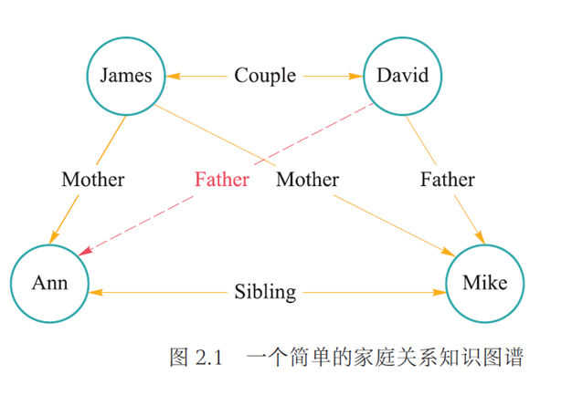
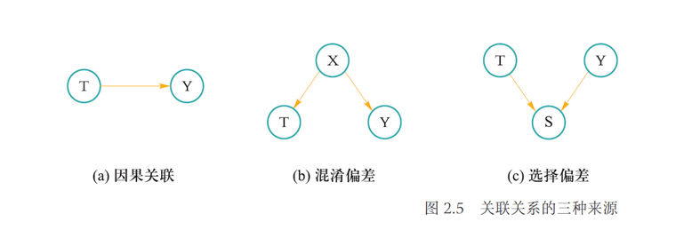
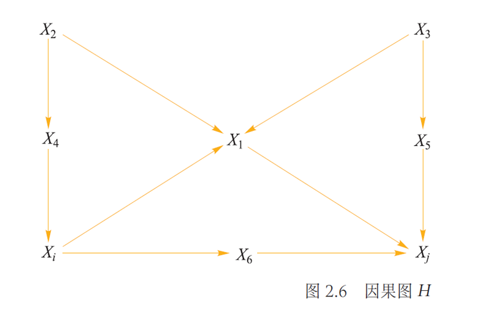

# 知识表达与推理

!!! note ""
    如何将知识更好地表达出来？

## 命题逻辑

- 命题逻辑（proposition logic）是应用一套形式化规则对以符号表示的描述性陈述（称为命题）进行推理的系统
- 命题逻辑以原子命题作为最基本的单位，无法对原子命题进行分解（分离其主语与谓语）
- 命题逻辑是数理逻辑的基础
- 通过命题联结词（connectives）对已有命题进行组合，得到新命题，称为复合命题（compound proposition）

!!! note "常见命题联结词："
    - 命题合取 conjunction，$p\wedge q$
    - 命题析取 disjunction，$p\vee q$
    - 命题否定 negation，$\neg p$
    - 命题蕴含 implication，$p\rightarrow q$，$p$ 为前件，$q$ 为后件
    - 命题双向蕴含 bi-implication，$p\leftrightarrow q$

- 逻辑等价：在所有情况下都有相同真假结果

!!! note "逻辑等价"
    - 逆否命题：$(\alpha\rightarrow\beta)\equiv\neg\beta\rightarrow\neg\alpha$
    - 蕴含消除：$(\alpha\rightarrow\beta)\equiv\neg\alpha\vee\beta$
    - 双向消除：$(\alpha\leftrightarrow\beta)\equiv(\alpha\rightarrow\beta)\wedge(\beta\rightarrow\alpha)$
    - ...

- 推理：按照某种策略从前提出发推出结论的过程。

!!! note "常见推理规则："
    - 假言推理 modus ponens：$\alpha\rightarrow\beta, \alpha\Rightarrow\beta$
    - 与消解 and-elimination：$\alpha_1\wedge\alpha_2\wedge\cdots\wedge\alpha_n\Rightarrow\alpha_i(1\leq i\leq n)$
    - 与导入 and-introduction：$\alpha_1,\alpha_2,\cdots,\alpha_n\Rightarrow\alpha_1\wedge\alpha_2\wedge\cdots\wedge\alpha_n$
    - 双重否定 double-negation elimation
    - 单项消解或单项归结 unit resolution：$\alpha\vee\beta,\neg\beta\Rightarrow\alpha$
    - 消解或归结 resolution：$\alpha\vee\beta,\neg\beta\vee\gamma\Rightarrow\alpha\vee\gamma$

- 范式（normal form）是把命题公式化为一种标准的形式，作用是可以进行两个命题的等价判断
    - 析取范式 disjunctive normal form（DNF）：有限个简单合取式构成的析取式称为析取范式
    - 合取范式 conjunctive normal form（CNF）：有限个简单析取式构成的合取式称为合取范式
    - 一个 DNF 不成立当且仅当每个简单合取式都不成立
    - 一个 CNF 成立当且仅当每个简单析取式都成立
    - 命题公式的 DNF 和 CNF 都是不唯一的

## 谓词逻辑

!!! note ""
    命题逻辑无法表达局部与整体、一般与个别的关系

将原子命题进一步细化，分解出个体、谓词和量词，来表达个体与总体的内在联系和数量关系，就是谓词逻辑（predicate logic）的研究内容

### 个体

个体是指所研究领域中可以独立存在的具体或抽象的概念

- 具体、特定 -> 个体常量；抽象、泛指 -> 个体变量
- 规定，用小写字母 $a$ 至 $w$ 表示个体常量（$x,y,z$ 表示个体变量）
- 个体的取值范围称为个体域

### 谓词

谓词是用来刻画个体属性或者描述个体之间的关系存在性的元素，其值为真或假

- 包含一个参数的谓词称为一元谓词，表示一元关系
- 包含多个参数的谓词称为多元谓词，表示个体间的多元关系
- 规定，用 $A(\cdots)$ 至 $Z(\cdots)$ 表示谓词，为大写字母后跟括号，括号内放置个体常量或变量

### 量词

全称量词和存在量词统称为量词

!!! note ""
    - 全称量词：表示一切的、所有的、凡事、每一个等，符号 $\forall$
    - 存在量词：表示存在、有一个、某些等，符号 $\exists$

全称量词的描述性是可以用相应的存在量词的描述形式替换，反之亦然。其实就是双重否定。

!!! note ""
    - 约束变元：在全称量词或存在量词约束条件下的变量符号
    - 自由变元：不受全称量词或存在量词约束的变量符号

自由变元既可以存在于量词的约束范围之内，也可以存在于量词约束范围之外，即：

!!! note ""

    - $(\forall x)(A(x)\vee B)\equiv(\forall x)A(x)\vee B$
    - $(\forall x)(A(x)\wedge B)\equiv(\forall x)A(x)\wedge B$
    - $(\exists x)(A(x)\vee B)\equiv(\exists x)A(x)\vee B$
    - $(\exists x)(A(x)\wedge B)\equiv(\exists x)A(x)\wedge B$

- 定理：在约束变元相同的条件下，量词的运算满足分配律
- 定理：当公式中存在多个量词时，若多个量词都是全称量词或者都是存在量词，则量词位置可以互换；若多个量词中既有全称量词又有存在量词，则量词位置不可以随意互换

#### 谓词逻辑具体形式

- 项：项是描述对象的逻辑表达式，递归定义：
    - 常量符号和变量符号是项
    - 若 $f(x_1, x_2,\cdots, x_n)$ 是 $n$ 元函数符号，$t_1, t_2, \cdots, t_n$ 是项，则 $f(t_1, t_2, \cdots, t_n)$ 是项
    - 有限次数地使用上述规则产生的符号串是项
- 原子谓词公式：若 $P(x_1, x_2, \cdots, x_n)$ 是 $n$ 元谓词，$t_1, t_2, \cdots, t_n$ 是项，则称 $P(t_1, t_2, \cdots, t_n)$ 为原子谓词公式，简称原子公式
- 合式公式：由逻辑联结词和原子公式构成的用于陈述事实的复杂语句，又称谓词公式：
    - 命题常项，命题变项，原子谓词公式都是合式公式
    - 通过逻辑联结词联结合式公式得到的也是合式公式
    - 如果 $A$ 是合式公式，$x$ 是个体变项，则 $(\exists x)A(x), (\forall x)A(x)$ 也是合式公式
    - 有限次数地使用上述规则
- 推理规则（$A(x)$ 是谓词公式，$x$ 和 $y$ 是变元，$a$ 是常量符号）

!!! note ""

    - 全称量词消去 universal instantiation（UI）：$(\forall x)A(x)\Rightarrow A(y)$
    - 全称量词引入 universal generalization（UG）：$A(y)\Rightarrow(\forall x)A(x)$
    - 存在量词消去 existential instantiation（EI）：$(\exists x)A(x)\Rightarrow A(a)$
    - 存在量词引入 existential generalization（EG）：$A(a)\Rightarrow(\exists x)A(x)$

## 知识图谱推理

### 知识图谱

知识图谱(knowledge graph)由有向图(directed graph)构成，被用来描述现实世界中实体及实体之间的关系，是人工智能中进行知识表达的重要方式。在知识图谱中，每个节点表示客观世界中的一个实体，两个节点之间的连线表示节点具有某一关系。知识图谱中存在连线的两个实体可表达为形如<left_node，relation，right_node>的三元组形式，这种三元组也可以表示为一阶逻辑(first order logic, FOL)的形式，从而为基于知识图谱的推理创造了条件。

关系推理是统计关系学习研究的基本问题，也是当前知识图谱领域研究的热点问题。对实体之间存在的关系进行推理，能够从现有知识中发现新的知识，在实体间建立新关联，从而扩充和丰富现有知识库。

!!! note ""
    下图中，形如<James, Couple, David>的关系可用一阶逻辑的形式来描述，即Couple(James, David)。其中，Couple(x, y)是一阶谓词，Couple是图中实体之间具有的关系，x和y是谓词变量，可由知识图谱中的实体将其实例化。很显然，从图已有关系可推知David和Ann具有父女关系，但这一关系在图中所示初始图(无红线)中并不存在，是需要推理的目标。
    

### 知识图谱推理方法

本节将介绍知识图谱推理中具有代表性的两个方法：归纳逻辑程序设计（inductivelogicprogramming，ILP）和路径排序算法（path ranking algorithm，PRA）。

#### 归纳逻辑程序设计 | ILP

归纳逻辑程序设计（inductive logic programming，ILP）

- ILP 是机器学习和逻辑程序设计交叉领域的研究内容
- ILP 使用一阶谓词逻辑进行知识表示，通过修改和扩充逻辑表达式对现有知识进行归纳，完成推理内容
- FOIL（first order inductive learner）算法是 ILP 的代表性方法，通过**序贯覆盖**学习推理规则

!!! note "FOIL 算法"
    - 算法内容
        - 输入：目标谓词 $P$，目标谓词 $P$ 的训练样例（正例集合 $E^+$ 和反例集合 $E^-$），以及其它背景知识样例
        - 输出：可得到目标谓词这一结论的推理规则
        - 过程：
            1. 将目标谓词作为所学习推理规则的结论
            2. 将其它谓词逐一作为**前提约束谓词**加入推理规则，计算所得到推理规则的 FOIL 信息增益值，选取可带来最大信息增益值的前提约束谓词加入原来的推理规则，得到新的推理规则，并将训练样例集合中与该推理规则不符的样例去掉
            3. 重复 b. 过程，知道所得到的推理规则不覆盖任何反例
    - 目标谓词是需要推断规则的结论，也称为规则头
    - 给定推理结论后，FOIL 算法学习得到使得结论满足的前提条件，即目标谓词作为结论的推理规则
    - FOIL 算法从一般到特殊，逐步添加目标谓词的前提约束谓词，直到所构成的推理规则不覆盖任何反例
    - 添加前提约束谓词后所得的推理规则的质量的好坏由信息增益值（information gain）作为评估标准，计算方法：

        $$
        \mathrm{FOIL\_Gain} = \widehat{m_+}\cdot\left(\log_2\frac{\widehat{m_+}}{\widehat{m_+}+\widehat{m_-}}-\log_2\frac{m_+}{m_++m_-}\right)
        $$

        - $\widehat{m_+}, \widehat{m_-}$ 是增加前提约束谓词后得到的新推理规则能覆盖的正例和反例数目
        - $m_+, m_-$ 是原推理规则覆盖的正例和反例数目

    !!! note "例如"

        为了推导出(∀𝑥)(∀𝑦)(∀𝑧)(𝑀𝑜𝑡ℎ𝑒𝑟(𝑧, 𝑦)∧ 𝐶𝑜𝑢𝑝𝑙𝑒(𝑥,𝑧)→𝐹𝑎𝑡ℎ𝑒𝑟(𝑥, 𝑦))，给定目标谓词 𝐹𝑎𝑡ℎ𝑒𝑟(𝑥, 𝑦)，结合目前的知识图谱，可得到如下推理规则：

        
        对这些样例，我们可以得到以下信息增益值：

        

        !!! note ""
            举一个Mother(z,y)分析得出0.32的例子。我们的背景知识中有两个Mother的项，分别是Mother(James, Ann)和Mother(James, Mike)。
            
            - 对于Mother(James, Ann)，z=James，y=Ann，x是一个自由变量。所以我们考察Father(x,Ann)，它有一个反例$\neg$ Father(James,Ann)。
            - 对于Mother(James, Mike)，z=James，y=Mike，x是一个自由变量。所以我们考察Father(x,Mike)，它有一个正例Father(David,Mike)和两个反例$\neg$ Father(James,Mike)和$\neg$ Father(Ann,Mike)。
            
            所以$\widehat{m_+}=1$，$\widehat{m_-}=1+2=3$，$m_+=1$，$m_-=4$。所以信息增益值为：

            $$
            \mathrm{FOIL\_Gain} = 1\cdot\left(\log_2\frac{1}{1+3}-\log_2\frac{1}{1+4}\right)=\log_2\frac{5}{4}\approx 0.32
            $$

        由此，我们可以得知𝐶𝑜𝑢𝑝𝑙𝑒(𝑥, 𝑧)是最佳的前提约束谓词，因为它的信息增益值最大。因此选择𝐶𝑜𝑢𝑝𝑙𝑒(𝑥, 𝑧)加入推理规则, 得到𝐶𝑜𝑢𝑝𝑙𝑒(𝑥, 𝑧)→𝐹𝑎𝑡ℎ𝑒𝑟(𝑥, 𝑦)这一新的推理规则，

        此时的背景知识样例和目标谓词的训练样例集合变为：

        |背景知识样例|目标谓词的训练样例|
        |:---:|:---:|
        |Sibling(Ann, Mike)|Father(David, Mike)|
        |Couple(David, Ann)|$\neg$ Father(David, James)|
        |Mother(James, Ann)||
        |Mother(James, Mike)||

        !!! warning ""
            此时因为𝐶𝑜𝑢𝑝𝑙𝑒和𝐹𝑎𝑡ℎ𝑒𝑟的第一项要求一样，所以目标谓词的训练样例只剩两个

        我们再逐一添加前提约束谓词，可以得到：

        

        当𝑀𝑜𝑡ℎ𝑒𝑟(𝑧, 𝑦)作为前提约束谓词加入到推理规则后𝐹𝑂𝐼𝐿_𝐺𝑎𝑖𝑛值最大，因此将𝑀𝑜𝑡ℎ𝑒𝑟(𝑧, 𝑦)加入，得到新的推理规则𝑀𝑜𝑡ℎ𝑒𝑟(𝑧, 𝑦)∧ 𝐶𝑜𝑢𝑝𝑙𝑒(𝑥,𝑧)→𝐹𝑎𝑡ℎ𝑒𝑟(𝑥, 𝑦)。

        当$x = David$、$y=Mike$和$z=James$时，该推理规则覆盖表2.4.2中训练样本集合的正例𝐹𝑎𝑡ℎ𝑒𝑟(David, Mike)、且不覆盖任意反例，因此算法学习结束。

        于是我们学习得到的推理规则为：

        $$
        \forall x \forall y \forall z \mathrm{Mother}(z, y) \wedge \mathrm{Couple}(x, z) \rightarrow \mathrm{Father}(x, y)
        $$

    给定目标谓词，FOIL算法从实例（正例、反例、背景知识样例）出发，不断测试所得推理规则是否还包含反例，一旦不包含，则学习结束，由此充分展示了“归纳学习”的能力。在学得推理规则后，再给推理规则中的变量赋予具体例子，经过“演绎”得到新的知识。

    

#### 路径排序算法 | PRA

- 路径排序算法（path ranking algorithm，PRA）
    - 基本思想：将实体之间的关联路径作为特征，来学习目标关系的分类器
    - 流程：
        1. 特征抽取：生成并选择路径特征集合。生成路径方法：随机游走（random walk）、广度优先搜索、深度优先搜索等
        2. 特征计算：计算每个训练样例的特征值 $P(s\rightarrow t; \pi_j)$，表示从实体节点 $s$ 出发，通过关系路径 $\pi_j$ 达到实体节点 $t$ 的概率。或表示是否存在这样一条路径，或表示路径出现的频次频率
        3. 分类器训练：根据训练样例特征值，为目标关系训练分类器。训练后可用于推理两个实体间是否存在目标关系

!!! note "例子"

    

    

## 概率图推理

概率图（probabilistic graph）：在图数据中，如果两个节点之间存在连边，则可视为这两个节点之间具有概率依赖关系而相互影响。在这类图中，可用概率描述两个相连节点之间的关联，而不是假设节点之间的影响一定会百分之百发生。

概率推理：而基于概率图进行的推理。

很明显，概率推理反映了推理过程中存在的不确定性特点。

概率图模型一般分为贝叶斯网络（Bayesian Network）和马尔可夫网络（Markov Network）两大类。

### 贝叶斯网络

!!! note "贝叶斯网络"
    用一个有向无环图（directed acyclic graph）来表示，其用有向边来表示节点和节点之间的单向概率依赖。

贝叶斯网络满足局部马尔可夫性（local Markov property），即在给定一个节点的父节点的情况下，该父亲节点有条件地独立于它的非后代节点（non-descendant）

!!! note "例子"

    例如，多云情况下有10%的概率会出动洒水车和80%的概率会下雨，在有洒水车和不下雨的情况下有10%的概率路面不湿
    
    

    

### 马尔可夫逻辑网络

!!! note "马尔可夫网络"
    表示成一个无向图的网络结构，其用无向边来表示节点和节点之间的相互概率依赖。

- 从概率统计角度来看，马尔可夫逻辑网络不仅简洁明了描述了马尔可夫网(Markov networks，简称MNs)中所存在信息之间关联，还因在马尔可夫网络中引入谓词逻辑融入了结构化知识；

- 从一阶谓词逻辑角度来看，马尔可夫逻辑网在一阶谓词逻辑中添加了不确定性而对严格推理进行了松绑，更好反映了客观世界的复杂性

马尔可夫逻辑网络的概率分布如下：

$$
P(X=x)=\frac{1}{Z}\exp\left(\sum_{1}w_in_i(x)\right)
= \frac{1}{Z}\prod_{i}\phi_i(x_{\{i\}})^{n_i(x)}
$$

其中：$n_i(x)$是推导 $x$ 中所涉及第 $i$ 条规则的逻辑取值（为1或0），$w_i$是该规则对应的权重，$Z$是配分函数，是一个固定的常量，表示所有分配方案的测度总和，是用来归一化的，可由下式计算

$$
Z=\sum_{x \in \mathcal{X}}\exp\left(\sum_{1}w_in_i(x)\right)
$$

!!! note "例子"

    

    |一阶谓词逻辑|内容描述|规则的权重取值|
    |:---:|:---:|:---:|
    |$𝑟_1:𝑖𝑛𝑑𝑜𝑜𝑟∨𝑜𝑢𝑡𝑑𝑜𝑜𝑟$|或者室内举行、或者室外举行|1（不特别重要）|
    |$𝑟_2:¬(𝑖𝑛𝑑𝑜𝑜𝑟∧𝑜𝑢𝑟𝑑𝑜𝑜𝑟)$|不能既在室内举行、又在室外举行|9（特别重要，因为不能同时发生）
    |$𝑟_3:𝑟𝑎𝑖𝑛→𝑖𝑛𝑑𝑜𝑜𝑟$|如果下雨，则室内举行|5（重要）
    |$𝑟_4:𝑙𝑖𝑔ℎ𝑡𝑠ℎ𝑜𝑤→𝑜𝑢𝑡𝑑𝑜𝑜𝑟$|如果有灯光秀，则室外举行|7（很重要，因为同学们热切盼望）|

    可以计算得到“如果下雨（且无论是否灯光秀），在室外而不是室内举行开学典礼”的概率取值：
    
    $$
    \begin{aligned}
    𝑃(𝑜𝑢𝑡𝑑𝑜𝑜𝑟∧¬𝑖𝑛𝑑𝑜𝑜𝑟)&=\frac{1}{𝑍}  exp⁡(1∗(𝑖𝑛𝑑𝑜𝑜𝑟∨𝑜𝑢𝑡𝑑𝑜𝑜𝑟)+9∗¬(𝑖𝑛𝑑𝑜𝑜𝑟∧𝑜𝑢𝑡𝑑𝑜𝑜𝑟)
    \\&\quad +5∗(¬𝑟𝑎𝑖𝑛∨𝑖𝑛𝑑𝑜𝑜𝑟)+7∗(¬𝑙𝑖𝑔ℎ𝑡𝑠ℎ𝑜𝑤∨𝑜𝑢𝑡𝑑𝑜𝑜𝑟))\\
    &=\frac{1}{𝑍}  exp⁡(1∗1+9∗1+5∗0+7∗1)\\
    &=\frac{1}{𝑍}  exp⁡(17) 
    \end{aligned}
    $$

    同理可以计算得到“如果灯光秀（且无论是否下雨），在室内而不是室外举行开学典礼”的概率取值：

    $$
    \begin{aligned}
    𝑃(𝑖𝑛𝑑𝑜𝑜𝑟∧¬𝑜𝑢𝑡𝑑𝑜𝑜𝑟)&=\frac{1}{𝑍}  exp⁡(1∗(𝑖𝑛𝑑𝑜𝑜𝑟∨𝑜𝑢𝑡𝑑𝑜𝑜𝑟)+9∗¬(𝑖𝑛𝑑𝑜𝑜𝑟∧𝑜𝑢𝑡𝑑𝑜𝑜𝑟)
    \\&\quad+5∗(¬𝑟𝑎𝑖𝑛∨𝑖𝑛𝑑𝑜𝑜𝑟)+7∗(¬𝑙𝑖𝑔ℎ𝑡𝑠ℎ𝑜𝑤∨𝑜𝑢𝑡𝑑𝑜𝑜𝑟))
    \\&=\frac{1}{𝑍}  exp⁡(1∗1+9∗1+5∗1+7∗0)\\
    &=\frac{1}{𝑍}  exp⁡(15)
    \end{aligned}
    $$

## 因果推理

因果推理是一种重要的推理手段，是人类智能的重要组成。回答诸如“吸烟是否导致癌症”和“某个广告发布是否导致了某个商品销量上涨”等问题时，往往需要因果推理的能力。

### 辛普森悖论 | Simpson's paradox

- 从整体上看，用药的患者恢复率低于不用药的患者
- 从局部上看，用药的男性患者恢复率高于不用药的男性患者，用药的女性患者恢复率高于不用药的女性患者

从数学角度而言，上述悖论可写成初等数学不等式

$$
\frac{A}{B} < \frac{C}{D} \quad \text{and} \quad \frac{A'}{B'} < \frac{C'}{D'}
\quad \text{but} \quad \frac{A+A'}{B+B'} > \frac{C+C'}{D+D'}
$$

辛普森悖论表明，在某些情况下，忽略潜在的“第三个变量”（本例中性别就是用药与否和恢复率之外的第三个变量），可能会改变已有的结论，而我们常常会忽略这一因素。

#### 克服辛普森悖论：厘清真/假关联

复杂数据中变量之间的关联关系有三种来源：因果关联（causation）、混淆偏差（confounding bias）和选择偏差（selection bias）。

- 因果关联：数据中两个变量，如一个变量是另一个变量的原因，则该两变量之间存在因果关联。如图(a)所示，变量T是变量Y的原因，即变量T和Y之间存在因果关联。在日常生活中，我们常说“下雨会导致地面湿”，其中下雨就是地面湿的原因，也就是说下雨和地面湿是变量，它们之间其实就是一种因果关系：下雨会导致地面湿。

- 混淆关联：数据中待研究的两个变量之间存在共同的原因变量，如图2.5(b）所示，变量T和Y存在共同的原因变量X，即X是T的原因，同时也是Y的原因。如果忽略掉X，那么T和Y在数据中会存在虚假关联。由于该关联是混淆偏差导致的，我们称之为混淆关联。例如，我们用X表示下雨，T表示地面湿，Y表示行人撑伞，那么我们在数据中会发现地面湿和行人撑伞十分相关。但这种相关会随着数据、环境、时间等变化而发生变化，如炎热的夏天，也会有很多行人撑伞，但地面很干燥。上述介绍的辛普森悖论例子其实也是混淆关联，其中性别会影响到患者吃药与否以及其恢复率，如果我们忽略了性别，那么吃药与否和恢复率之间的关系就存在混淆关联。

- 选择关联：数据中待研究的两个变量之间存在共同的结果变量，如图 2.5(c)所示，变量T和Y存在共同的结果变量S，即T是S的原因，Y也是S的原因。如果我们基于特定S的取值来选择一部分变量进行研究，那么T和Y在数据中就会存在虚假关联。由于该关联是选择偏差导致的，我们称之为选择关联。例如，在收集图片数据时，有意或无意选择了许多狗在草地上的图片（即“草地”和“狗的特征”导致收集的图片是狗在草地上）。本来草地和狗之间不相关，但当我们选择了大量狗在草地上的图片时，草地和狗之间就十分相关。这种相关也会随着数据、环境、时间等变化而发生变化，如选择大量狗在沙滩上的图片，草地和狗之间可能是负相关或者不相关了。

### 理论框架

- 潜在结果框架（Potential Outcome Framework）：也被称为Neyman–Rubin因果模型。这一模型最早可追溯于Jerzy Neyman在1923年用波兰语所撰写论文中提出的“潜在结果”（potential outcome）的概念。之后，Donald Rubin发展了“潜在结果”这一概念，并将其和缺失数据的理论联系在一起。

- 结构因果模型（Structure Causal Model, SCM）：因果图（causal diagram）是由Judea Pearl于1995年提出。一般而言，结构因果图是一种有向无环图(directed acyclic graphs, DAG)。有向无环图指的是一个无回路的有向图，即从图中任意一个节点出发经过任意条边，均无法回到该节点。有向无环图刻画了图中所有节点之间的依赖关系。DAG 可用于描述数据的生成机制。这样描述变量联合分布或者数据生成机制的模型，被称为 “贝叶斯网络”（Bayesian network）。本书介绍因果推理采用因果图这一结构。

!!! note "因果图的优势：易于计算变量的联合概率"

    
    
    $$
    \begin{aligned}
     &𝑃(𝑋_1,𝑋_2,𝑋_3,𝑋_4,𝑋_5,𝑋_6,𝑋_𝑖,𝑋_𝑗 )
    \\
    =&𝑃(𝑋_2 )×𝑃(𝑋_3 )×𝑃(𝑋_1│𝑋_2,𝑋_3,𝑋_𝑖 )×𝑃(𝑋_4│𝑋_2 )×𝑃(𝑋_5│𝑋_3 ) ×𝑃(𝑋_6│𝑋_𝑖 )×𝑃(𝑋_𝑖│𝑋_4 )×𝑃(𝑋_𝑗 |𝑋_1, 𝑋_5, 𝑋_6 )
    \end{aligned}
    $$

### 因果干预与do算子

干预（intervention）：改变明确存在关联关系的某变量取值，研究变量取值改变对结果变量的影响，就是因果推理中常用的“干预（intervention）”手段。比如：在已知商品价格和销售量存在关联关系的情况下，将商品价格提高一倍后，研究销售量会发生怎样的变化? 在已知吸烟频率和患癌症概率存在关联关系的情况下，研究人们放弃吸烟后，患癌症概率会发生怎样的变化?

“do”算子：为了从因果分析角度实现这一任务，图灵奖获得者朱迪亚·珀尔（Judea Pearl）提出了“do”算子，计算当系统中一个变量取值发生变化、其他变量保持不变时，系统输出结果是否变化，这样可判断改变取值的变量是否是系统中起决定作用的“原因要素”。

!!! note "干预过程"

    !!! warning ""
        寻找事物之间关联关系改变了我们看世界的角度，而干预和反事实推理则改变了世界本身

    干预过程中，我们固定系统中其他变量，然后改变某一变量取值，观察其他变量的变化。

    为了与𝑋的自然取值𝑥进行区分，在对𝑋进行干预时，引入“𝑑𝑜算子”(𝑑𝑜-calculus)，记作𝑑𝑜(𝑋=𝑥)。因此，𝑃(𝑌=𝑦|𝑋=𝑥)表示的是当发现𝑋=𝑥时，𝑌=𝑦的概率；而𝑃(𝑌=𝑦|𝑑𝑜(𝑋=𝑥))表示的是对𝑋进行干预，固定其值为𝑥时，𝑌=𝑦的概率。
    
    用统计学的术语来说，𝑃(𝑌=𝑦|𝑋=𝑥)反映的是在取值为𝑥的个体𝑋上，𝑌的总体分布；而𝑃(𝑌=𝑦|𝑑𝑜(𝑋=𝑥))反映的是如果将每一个𝑋取值都固定为𝑥时，𝑌的总体分布。

    

#### 因果效应差

{width=50%}

以前面所言辛普森悖论为例，其因果图可以用上图表示，其中，𝑋表示用药情况(1表示用药，0表示不用药)，𝑌表示病人的恢复情况(1表示恢复，0表示未恢复)，𝑍表示性别(1表示男性，0表示女性)。为了比较病人用药与否的恢复情况，可以对病人的用药情况进行干预，即将病人随机划分成用药病人和不用药病人来进行给药。不妨令𝑑𝑜(𝑋=1)和𝑑𝑜(𝑋=0)表示给药干预，来计算效应差：

$$
P(Y=1|do(X=1)) - P(Y=1|do(X=0))
$$

对$x$进行干预后，将所有指向𝑋的边均移除，则因果效应𝑃(𝑌=𝑦│𝑑𝑜(𝑋=𝑥))等价于下图所示的引入干预的操纵图模型(manipulated model)中的条件概率$𝑃_𝑚 (𝑌=𝑦│𝑋=𝑥)$。

{width=50%}

计算因果效应的关键在于计算操纵概率(manipulated probability) $𝑃_𝑚$。$𝑃_𝑚$与正常(无干预)条件下的概率𝑃有两个相同的重要性质：

1. 边缘概率$𝑃(𝑍=𝑧)$不随干预而变化，因为𝑍的取值不会因为去掉从𝑍到𝑋的箭头而变化；即$𝑃_𝑚 (𝑌=𝑦│𝑋=𝑥, 𝑍=𝑧)=𝑃(𝑌=𝑦│𝑋=𝑥, 𝑍=𝑧)$  
2. 条件概率$𝑃(𝑌=𝑦│𝑋=𝑥, 𝑍=𝑧)$不变，因为𝑌关于𝑋和𝑍的函数$𝑓_𝑌=(𝑋, 𝑍, 𝑈_2)$并未改变；即$𝑃_𝑚 (𝑍=𝑧)=𝑃(𝑍=𝑧)$
3. 在操纵图模型中，存在$𝑃_𝑚 (𝑍=𝑧|𝑋=𝑥)= 𝑃_𝑚 (𝑍=𝑧)= 𝑃(𝑍=𝑧)$。

所以我们有因果效应𝑃(𝑌=𝑦│𝑑𝑜(𝑋=𝑥) )：

$$
\begin{aligned}
𝑃(𝑌=𝑦│𝑑𝑜(𝑋=𝑥) )&=𝑃_𝑚 (𝑌=𝑦│𝑋=𝑥)\\
&=\sum\limits_z𝑃_𝑚 (𝑌=𝑦│𝑋=𝑥, 𝑍=𝑧) 𝑃_𝑚 (𝑍=𝑧|𝑋=𝑥) \\
&=\sum\limits_z𝑃_𝑚 (𝑌=𝑦│𝑋=𝑥, 𝑍=𝑧) 𝑃_𝑚 (𝑍=𝑧) 
\end{aligned}
$$

上式第一行来源于定义，第二行来源于贝叶斯公式，第三行来源于𝑋和𝑍在操纵图模型中的独立性。

最后，由于性质1和2，我们可以得到：

$$
𝑃(𝑌=𝑦│𝑑𝑜(𝑋=𝑥) )=\sum\limits_z𝑃 (𝑌=𝑦│𝑋=𝑥, 𝑍=𝑧) 𝑃(𝑍=𝑧) 
$$

这被称为调整公式(adjustment formula)，对于𝑍的每一个取值𝑧，这一式子计算𝑋和𝑌的条件概率并取均值。这个过程称之为“𝑍调整”(adjusting for 𝑍)或“𝑍控制”(controlling for 𝑍)。上式右端只包含正常(无干预)条件下的概率𝑃，即可用正常(无干预)条件下的条件概率来计算干预后的条件概率。

!!! note "用调整公式计算辛普森悖论"

    

    下面将调整公式用于本节最开始提到的辛普森悖论，其中𝑋=1表示用药， 𝑌=1表示病人恢复，𝑍=1表示男性，𝑍=0表示女性，则有：
    
    $$
    \begin{aligned}
    𝑃(𝑌=1│𝑑𝑜(𝑋=1) )
    &=\sum\limits_z𝑃 (𝑌=1│𝑋=1, 𝑍=𝑧) 𝑃 (𝑍=𝑧)
    \\&= 𝑃(𝑌=1│𝑋=1, 𝑍=1)𝑃(𝑍=1)+ 𝑃(𝑌=1│𝑋=1, 𝑍=0)𝑃(𝑍=0)
    \\&=0.93×((87+270))/((350+350))+0.73×((263+80))/((350+350))
    \\&=0.832
    \end{aligned}
    $$

    类似地，将病人干预为不用药病人的因果效应为：

    $$
    \begin{aligned}
    𝑃(𝑌=1│𝑑𝑜(𝑋=0) )
    &=\sum\limits_z𝑃 (𝑌=1│𝑋=0, 𝑍=𝑧) 𝑃 (𝑍=𝑧)
    \\&= 𝑃(𝑌=1│𝑋=0, 𝑍=1)𝑃(𝑍=1)+ 𝑃(𝑌=1│𝑋=0, 𝑍=0)𝑃(𝑍=0)
    \\&=0.87×((87+270))/((350+350))+0.69×((263+80))/((350+350))
    \\&=0.7818
    \end{aligned}
    $$

    在分别计算完用药病人和不用药病人的干预因果效应后，再计算其因果效应差：

    $$
    \begin{aligned}
    𝐴𝐶𝐸&=𝑃(𝑌=1│𝑑𝑜(𝑋=1) )−𝑃(𝑌=1│𝑑𝑜(𝑋=0) )
    \\&=0.832−0.7818
    \\&=0.0502
    \end{aligned}
    $$

    说明用药病人的恢复率高于不用药病人的恢复率，即该新药能帮助治愈病人。

    !!! warning ""
        在本题中其实就是多乘个性别比例，减少性别造成的影响

#### 反事实推理

!!! note ""
    如果当时我...，那么

反事实描述的是：假设存在一个虚拟的平行世界，里面的所有因素与现实世界一模一样，两个相同的个体他和“他”，分别在现实世界和平行世界中同时同地做了不同的选择，现在我们知道了现实世界中他的结果，他想知道平行世界中的那个“他”的选择所带来的结果。然而，现有的科学手段无法判断平行世界的存在性更无法对其进行观测，无从获取平行世界“他”的结果。因此，通过设计反事实来推演另一个“他”的选择所带来的结果。

#### 因果模型的层次化示意图

Judea Pearl把因果分析分类为表中所示的层次化，包括从可观测结果中得到的数据关联、对观测结果进行干预介入后的决策问题、对已经发生的结果进行否定的反事实推理。表中𝐴可视为一种观测变量，𝑦和𝑦^′可视为一种结果
