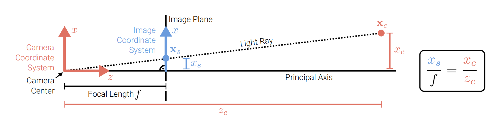
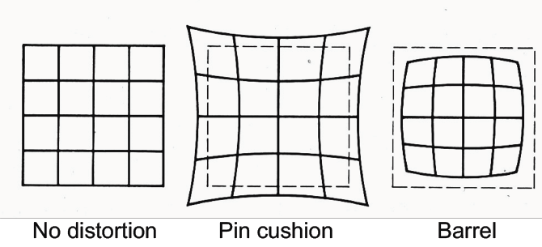

# 2.2 Geometric Image Formation

!!! note "单元概述"
    - 介绍基本的投影模型。
    - 了解到如何将三维点投影到图像平面上，介绍相机内参和外参的概念以及相机矩阵的计算方法。
    - 介绍畸变的概念。

## 2.2.1 Basic camera models

基本的针孔相机模型有两种：物理针孔相机模型和数学针孔相机模型。

在物理针孔相机(physical pinhole camera)中，图像上下颠倒地投影到位于焦点后面的图像平面上

而在数学相机模型(mathematical pinhole camera)中，图像平面位于焦点的前面。

两个模型是等效的，只要适当改变图像坐标即可。我们在本课程中只考虑数学模型，因为它具有一些优点，即图像不会颠倒投影。

## 2.2.2 Projection models

投影模型也有两种：正交投影(orthographic projection)和透视投影(perspective projection)。

### Orthographic Projection

正交投影(orthographic projection)只需要简单地将相机坐标系(camera coordinates)中的3D点$\mathbf{x}_c$的z分量丢弃，以获得图像平面(image plane= screen)上的相应2D点$\mathbf{x}_s$。下图表示分量$x_s = x_c$.

$$\mathbf{x}_s=\begin{bmatrix}1&0&0\\0&1&0\end{bmatrix}\mathbf{x}_c
\Leftrightarrow \overline{\mathbf{x}}_s=\begin{bmatrix}1&0&0&0\\0&1&0&0\\0&0&0&1\end{bmatrix}\overline{\mathbf{x}}_c$$

正交投影对于远心镜头(telecentric lenses)是精确的，对于长焦镜头(telephoto lenses)是近似的。

#### Scaled Orthographic Projection

实际应用中，世界坐标（world coordinates，以米为单位测量尺寸）必须缩放以适合图像传感器（image sensor，以像素为单位测量）⇒缩放正交(scaled orthography)：

$$\mathbf{x}_s=\begin{bmatrix}s&0&0\\0&s&0\end{bmatrix}\mathbf{x}_c
\Leftrightarrow \overline{\mathbf{x}}_s=\begin{bmatrix}s&0&0&0\\0&s&0&0\\0&0&0&1\end{bmatrix}\overline{\mathbf{x}}_c$$

这里$s$ 的单位是px/m或px/mm，以将米制3D点转换为像素。

在正交投影法下，可以使用[因式分解法(factorization methods)]()同时估计结构和运动.

### Perspective Projection

对于透视投影，我们可以得到下图右侧关系(简单的相似三角形)：

所以我们有$x_s=f\cdot \frac{x_c}{z_c}$和$y_s=f\cdot \frac{y_c}{z_c}$，其中$f$是焦距(focal length)。因此，我们有：

$$\begin{pmatrix}x_s\\y_s\end{pmatrix}
=\begin{pmatrix}fx_c/z_c\\fy_c/z_c\end{pmatrix}
\Leftrightarrow
\widetilde{\mathbf{x}}_s
=\begin{bmatrix}f&0&0\\0&f&0\\0&0&1\end{bmatrix}\overline{\mathbf{x}}_c$$

这里$f$的单位是px(=pixels)，以将米制3D点转换为像素。

使用齐次坐标时该投影是线性的。投影后，无法恢复 3D 点与图像的距离。

#### Principal Point Offset

实践中，我们计算**主点偏移(principal point offset)**以导出一个更方便的图像平面坐标系，因为它不包括负值。

如上图所示，添加主点偏移$\begin{pmatrix}c_x\\c_y\end{pmatrix}$，我们将坐标系移到图像平面的角点，从而不产生负值。

#### Complete perspective projection model

考虑到包含主点偏移、传感器未垂直于光轴安装的情况，我们可以得到下式的**完整透视投影模型(complete perspective projection model)**

$$\begin{pmatrix}x_s\\y_s\end{pmatrix}=\begin{pmatrix}f_xx_c/z_c+sy_c+c_x\\f_yy_c/z_c+c_y\end{pmatrix} \Leftrightarrow \widetilde{\mathbf{x}}_s=\begin{bmatrix}f_x&s&c_x&0\\0&f_y&c_y&0\\0&0&1&0\end{bmatrix}\overline{\mathbf{x}}_c$$

!!! note "note"
    - 记$\mathbf{K}=\begin{bmatrix}f_x&s&c_x\\0&f_y&c_y\\0&0&1\end{bmatrix}$，称作**标定矩阵(calibration matrix)**。
    - $\mathbf{K}$的参数称为**相机内参(camera intrinsics)**（与外参相对）。
    - 这里$f_x$和$f_y$是独立的，允许不同的像素宽高比(pixel aspect ratio)。
    - 由于传感器不垂直于光轴安装，因此出现了倾斜参数$s$。
    - 在实践中，我们经常设置$s=0$和$f_x=f_y=f$以简化模型，但$\mathbf{c}=(c_x,c_y)$仍然是必需的。

#### Chaining Transformations for Projection matrix

将相机内参和外参组合起来，我们可以得到完整相机矩阵(complete camera/projection matrix)：

记$\mathbf{K}$是标定矩阵(内参)，$\begin{bmatrix}\mathbf{R}&\mathbf{t}\end{bmatrix}$是相机姿态(外参)。我们将两个变换链接起来，将世界坐标中的点投影到图像中：

$$\widetilde{\mathbf{x}}_s=\begin{bmatrix}\mathbf{K}&\mathbf{0}\end{bmatrix}\overline{\mathbf{x}}_c=\begin{bmatrix}\mathbf{K}&\mathbf{0}\end{bmatrix}\begin{bmatrix}\mathbf{R}&\mathbf{t}\\\mathbf{0}^T&1\end{bmatrix}\overline{\mathbf{x}}_w=\mathbf{K}\begin{bmatrix}\mathbf{R}&\mathbf{t}\end{bmatrix}\overline{\mathbf{x}}_w=\mathbf{P}\overline{\mathbf{x}}_w$$

这里的$\mathbf{P}$是**投影矩阵(projection matrix)**，也称作**相机矩阵(camera matrix)**，是一个$3\times 4$的矩阵，可以预先计算，并用于将3D点投影到图像平面上。

#### Full Rank Representation for Projection Matrix

有时候，我们更喜欢使用**满秩**的$4\times 4$投影矩阵：

$$\widetilde{\mathbf{x}}_s=\begin{bmatrix}\mathbf{K}&\mathbf{0}\\\mathbf{0}^T&1\end{bmatrix}\begin{bmatrix}\mathbf{R}&\mathbf{t}\\\mathbf{0}^T&1\end{bmatrix}\overline{\mathbf{x}}_w$$

现在，这个齐次向量$\widetilde{\mathbf{x}}_s$是一个4D向量. 该向量必须相对于其第3个分量进行归一化，以获得非齐次坐标：

$$\overline{\mathbf{x}}_s=\frac{\widetilde{\mathbf{x}}_s}{\widetilde{z}_s}= \begin{pmatrix}x_s/z_s & y_s/z_s & 1 & 1/z_s\end{pmatrix}^T$$

也就是说此时的非齐次坐标为$\mathbf{x}_s=\begin{pmatrix}x_s/z_s & y_s/z_s \end{pmatrix}^T$ (因为它落在二维平面)，其中$z_s$是$\widetilde{\mathbf{x}}_s$的第3个分量。

!!! note "第四个分量"
    - $\overline{\mathbf{x}}_s$的第4个分量是**逆深度(inverse depth)**，即$z_s^{-1}$。
    - 如果已知逆深度，可以通过$\widetilde{\mathbf{x}}_w=\mathbf{P}^{-1}\overline{\mathbf{x}}_s$计算得出世界坐标系下的齐次坐标，然后对$\widetilde{\mathbf{x}}_w$的第4个分量进行归一化，来获得世界坐标系下的非齐次坐标（因为它落在三维空间）。

## 2.2.3 Lens Distortion

由于相机镜头的特性会引入**畸变(distortion)**，因此在实践中违反了线性投影的假设（直线保持直线）。

径向(radial)和切向(tangential)的畸变效应都可以相对容易地建模

记 $x = x_c/z_c, y = y_c/z_c, r^2 = x^2 + y^2$ . 畸变点由下式获得:

$$\mathbf{x}' = (1+\kappa_1r^2+\kappa_2r^4)\begin{pmatrix}x\\y\end{pmatrix}+\begin{pmatrix}2\tau_1xy+\tau_2(r^2+2x^2)\\2\tau_2xy+\tau_1(r^2+2y^2)\end{pmatrix}=\begin{pmatrix}x'\\y'\end{pmatrix}$$

$$\mathbf{x}_s=\begin{pmatrix}f_xx'+c_x\\f_yy'+c_y\end{pmatrix}$$

这里的 $\kappa_1, \kappa_2$ 是径向畸变系数(radial distortion coefficients)，$\tau_1, \tau_2$ 是切向畸变系数(tangential distortion coefficients)。

!!! note "例子"
    例如，枕形畸变(pincushion distortion)和桶形畸变(barrel distortion)是径向畸变。

    
