# 数值分析

!!! note "课程架构"

    !!! note "Basic Knowledge"
        - [x] Chapter 1
            - Mean value theorem
            - Taylor expansion
            - Roundoff  error
    
    !!! note "Solution of Equations"

        - [x] Chapter 2
            - Solution of equations with one variable
        - [x] Chapter 6
            - Direct Matrix Solver
        - [x] Chapter 7
            - Iterative Matrix Solver
        - [x] Chapter 5
            - Initial value problem
              - Euler, Runge-kutta, multi-step

        !!! note ""
            Convergence + Stability

    !!! note "Interpolation and approximation"

        - [x] Chapter 3:  interpolation
            - Lagrange polynomial
            - Piecewise polynomial

        - [x] Chapter 4
            - Numerical differentiation
            - Numerical integration
  
        - [x] Chapter 8:  approximation
            - Orthogonal polynomials
            - Least squares
            - Chebyshev polynomial

        !!! note ""
            Error

## Chapter 1 数学基础 | Mathematical Preliminaries

!!! note "本讲概述"
    本讲主要介绍数值计算中的误差类型和误差分析，以及IEEE 754浮点数表示。

### 1.2 舍入误差和计算机算术 | Roundoff Errors and Computer Arithmetic

#### 1.2.1 截断误差和舍入误差 | Truncation Error and Roundoff Error

- **截断误差**: 使用截断的(或者说有限的)求和来近似无穷级数的和->产生的误差

    - 理论：$e=\sum\limits_{n=0}^{\infty} \frac{1}{n!} $

    - 计算机: $e=\sum\limits_{n=0}^{N} \frac{1}{n!} $
  
- **舍入误差**: 当计算机执行实数计算时产生的误差。这是因为计算机中的算术运算涉及到的数字只有有限位数。
    - 理论：$0.3333333\cdots$
    - 计算机: $0.333333$

#### 1.2.2 截断法和舍入法 | Chopping and Rounding

使用舍入法或截断法产生的误差都叫做**舍入误差**。

- Chopping: 0.1119 -> 0.111，直接截断
- Rounding: 0.1119 -> 0.112，四舍五入

!!! note "函数表示"
    Given a real number $y = 0.d_1d_2d_3\ldots d_kd_{k+1}\ldots \times 10^n$(which is called **Normalized decimal floating-point form of a real number**)

    $$fl(y) = \begin{cases} 0.d_1d_2d_3\ldots d_k \times 10^n& \text{/* chopping */} \\ chop(y + 5 \times 10^{n-(k+1)}) & \text{/* rounding */} \end{cases}$$

#### 1.2.3 绝对误差与相对误差 | Absolute error and relative error

Denote $p^*$ as the approximation of $p$.

- **Absolute error**: $|p^* - p|$
- **Relative error**: $\frac{|p^* - p|}{|p|}$

!!! note "近似产生的误差"

    **chopping**:  

    $$\frac{|y - fl(y)|}{|y|} = \frac{0.d_{k+1}d_{k+2}\ldots \times 10^{n-k}}{0.d_1d_2d_3\ldots d_k \times 10^n} = \frac{0.d_{k+1}d_{k+2}\ldots}{0.d_1d_2d_3\ldots d_k} \times 10^{-k} < \frac{1}{0.1} \times 10^{-k} = 10^{-k+1}$$

    **Rounding**:

    $$\frac{|y - fl(y)|}{|y|} \leq \frac{0.5 \times 10^{n-k}}{0.d_1d_2d_3\ldots d_k \times 10^n} = \frac{0.5}{0.1} \times 10^{-k} = 0.5 \times 10^{-k+1}$$

!!! note "误差产生"

    - 两个近乎相等的数相减二导致有效数字的相消，例如：$a=0.123456789, b=0.123456788$，两者本来有9位有效数字，但是相减后只剩下1位有效数字。
    - 如果有限位的表示或计算产生了误差，则除以一个小数（或者乘以一个大数）会放大绝对误差。

误差计算举例：

Evaluate $f(x) = x^3 - 6.1x^2 + 3.2x + 1.5$ at $x = 4.71$ using 3-digit arithmetic(3位有效数字).

|          | $x$    | $x^2$     | $x^3$        | $6.1x^2$                     | $3.2x$   |
| -------- | ------ | --------- | ------------ | ---------------------------- | -------- |
| exact    | $4.71$ | $22.1841$ | $104.487111$ | $135.32301$                  | $15.072$ |
| Chopping | $4.71$ | $22.1$    | $104.$       | $6.1*22.1=134.81\approx134.$ | $15.0$   |
| Rounding | $4.71$ | $22.2$    | $105.$       | $6.1*22.2=135.42\approx135.$ | $15.1$   |

Exact value: $f(4.71) = 104.487111 - 135.32301 + 15.072 + 1.5 = -14.263899$

Chopping: $f(4.71) = 104 - 134 + 15.0 + 1.5 = -13.5$

- Relative error: $\frac{|-14.263899 + 13.5|}{|-14.263899|} \approx 5.35\%$

Rounding: $f(4.71) = 105 - 135 + 15.1 + 1.5 = -13.4$

- Relative error: $\frac{|-14.263899 + 13.4|}{|-14.263899|} \approx 6.06\%$

可见，有时候舍入误差比截断误差更大。

!!! note ""
    但现在的误差还是太大了！介绍——**秦九韶算法**！

乘法较多会导致式子的误差较大，此时可以使用秦九韶算法（其实就是不断提取$x$）来减少乘法的次数。

把一个多项式$f(x) = a_nx^n + a_{n-1}x^{n-1} + \ldots + a_1x + a_0$写成如下形式：

$$f(x) = ((\ldots(a_nx + a_{n-1})x + a_{n-2})x + \ldots)x + a_1)x + a_0$$

然后从最内层开始计算。

将上例改写成秦九韶算法：

$$f(x) = ((x-6.1)x + 3.2)x + 1.5$$

**Chopping**:

$$\begin{aligned}
&((4.71-6.1)4.71 + 3.2)4.71 + 1.5 \\
=& (-1.39*4.71 + 3.2)4.71 + 1.5 \\
=& (-6.54 + 3.2)4.71 + 1.5 \\
=& -3.34*4.71 + 1.5 \\
=& -15.7 + 1.5 \\
=& -14.2
\end{aligned}
$$

Relative error: $\frac{|-14.263899 + 14.2|}{|-14.263899|} \approx 0.44\%$

**Rounding**:

$$\begin{align*}
&((4.71-6.1)4.71 + 3.2)4.71 + 1.5 \\
=& (-1.39*4.71 + 3.2)4.71 + 1.5 \\
=& (-6.55 + 3.2)4.71 + 1.5 \\
=& -3.35*4.71 + 1.5 \\
=& -15.8 + 1.5 \\
=& -14.3
\end{align*}
$$

Relative error: $\frac{|-14.263899 + 14.3|}{|-14.263899|} \approx 0.25\%$

可见，此时误差明显减小了。

### 1.3 算法和收敛性 | Algorithms and Convergence

#### 稳定性 | Stability

一个算法，如果初始数据的**小变化**会导致最终结果的**小变化**，则称为**稳定**(stable)；否则称为**不稳定**(unstable)。

一个算法，如果只有在某些初始数据的选择下才是稳定的，则称为**条件稳定**(conditionally stable)。

#### 误差增长 | The growth of errors

假设$E_0 > 0$是初始误差(initial error)，$E_n$是第$n$步的误差。

- 如果$E_n \approx CnE_0$，则称为**线性增长**(linear growth)。

线性增长的误差通常是无法避免的，当$C$和$E_0$都很小的时候，结果通常是可以接受的。

- 如果$E_n \approx C^nE_0$，则称为**指数增长**(exponential growth)。

指数增长的误差应该避免，因为即使$E_0$很小，$C^n$也会变得很大。这会导致不可接受的不准确性。

#### 收敛速度 | Convergence rate

使用$O$符号来表示收敛速度。

假设$\lim_{h\to 0} F(h) = L$，$\lim_{h\to 0} G(h) = 0$。如果存在正常数$K$使得

$$|F(h)-L| \leq K|G(h)|$$

对于足够小的$h$成立，则记为$F(h)=L+O(G(h))$

我们通常取$G(h)=h^p,(p>0)$，并对最大的$p$值感兴趣。

!!! example "求当$h\to 0$时下列函数的收敛速度"

    $F(h) = \frac{\sin h}{h}$, $\lim_{h\to 0}\frac{\sin h}{h} = 1$

    解: $F(h)-L=\frac{\sin h}{h}-1 = \frac{\sin h-h}{h} \sim \frac{h-\frac{h^3}{6}+o(h^3)-h}{h} \sim-\frac{h^2}{6}\leq K|h^2|$

    所以收敛速度为$O(h^2)$。

### 1.4 IEEE 754 FLOATING POINT REPRESENTATION

二进制的科学计数法：$x = \pm 1.d_1d_2d_3\ldots d_k \times 2^n$，这里的$d_i$是二进制的数字,$1.d_1d_2d_3\ldots d_k$为有效位数(Significand)。

在计算机里有两种表示方法，分别是Single(32位)和double(64位)。均为下图的形式。

!!! note ""

    

    $$x = (-1)^S \times (1+Fraction) \times 2^{Exponent-Bias}$$

    - $S$代表符号位(sign bit)。$S$为$0$表示非负数，$S$为$1$表示负数。
    - 有效位数($Significand = 1 + Fraction$) 中$1$是默认的，我们只存储小数点后面的位数(即Fraction)。
    - $Fraction$ 代表尾数部分(也称作**mantissa**)。
      - Single: $23$ $bits$
      - Double: $52$ $bits$
    - $Exponent$ 表示指数部分(也称作**characteristic**)。
        - Single: $8$ $bits$
        - Double: $11$ $bits$
        - excess representation(偏移表示法) $=$ actual exponent $-$ bias，其中：
            - Single: $bias = 127$ $bits$
            - Double: $bias = 1023$ $bits$
        - 指数为全 $0$ 和全 $1$ 时用作特殊值处理
    
    !!! tip "Single & Double的值域"

        !!! example "Single的值域"
            - 最小值：
            - Exponent = 00000001, Fraction = 000...000
            - $$x = \pm  (1+0.0) \times 2^{1-127} = \pm 1.0 \times 2^{-126} \approx \pm 1.2 \times 10^{-38}$$

            - 最大值：
            - Exponent = 11111110, Fraction = 111...111
            - $$x = \pm (1+0.111\ldots 111) \times 2^{254-127} \approx \pm 2.0 \times 2^{127} \approx \pm 3.4 \times 10^{38}$$

        !!! example "Double的值域"
            - 最小值：
            - Exponent = 00000000001, Fraction = 000...000
            - $$x = \pm (1+0.0) \times 2^{1-1023} = \pm 1.0 \times 2^{-1022} \approx \pm 2.2 \times 10^{-308}$$

            - 最大值：
            - Exponent = 11111111110, Fraction = 111...111
            - $$x = \pm (1+0.111\ldots 111) \times 2^{2046-1023} \approx \pm 2.0 \times 2^{1023} \approx \pm 1.8 \times 10^{308}$$

    !!! tip "Single & Double的十进制精度"
    
        !!! example "Single的十进制精度"
            - 最小分度: $2^{-23}$
            - $\log_{10}{2^{-23}}\approx -6.92$
            - 所以约为小数点后六位有效数字

        !!! example "Double的值域"
            - 最小分度: $2^{-52}$
            - $\log_{10}{2^{-52}}\approx -15.65$
            - 所以约为小数点后十六位有效数字

!!! note "十进制->IEEE754 浮点数"
    !!! question "Represent $–0.75$"
    1. Convert to binary: $0.75 = 0.11$
    2. Normalize: $0.11 = 1.1 × 2^{–1}$
    3. Sign bit: $S = 1$
    4. Exponent:
        - Single: $–1 + 127 = 126 = 01111110$
        - Double: $–1 + 1023 = 1022 = 01111111110$
    5. Fraction:
        - Single: $0.1 = 100\cdots 00$，共23位
        - Double: $0.1 = 100\cdots 00000$，共52位
    $\therefore$ IEEE 754 Representation:
        - Single: $1\ 01111110\ 100\cdots 00$
        - Double: $1\ 01111111110\ 100\cdots 00000$

!!! note "IEEE754 浮点数->十进制"
    !!! question "What number is represented by the single-precision float 11000000101000…00"
    1. Sign bit: $S = 1$
    2. Exponent: $E = 10000001 = 129$
    3. Actual exponent: $E - 127 = 2$
    4. Fraction: $01000\cdots 00$
    5. Significand: $1.01000\cdots 00 = 1.25$
    6. $\therefore$ Number: $–1.25 × 2^2 = –5.0$

## Chapter 2 一元方程的求解 | Solutions of Equations in One Variable

### 2.0 停机程序 | Stopping procedure

我们可以选择一个精度要求$\epsilon$，逐步迭代，直到满足下列条件之一：

1. $|x_{i+1} - x_i| < \epsilon$
2. $|f(x_{i+1})| < \epsilon$
3. $\frac{|x_{i+1} - x_i|}{|x_{i+1}|} < \epsilon$

如果$|x_{i+1} - x_i|$收敛于0而序列本身发散 ，1号会失效。

也有可能$f(x)$与0很接近，但是$x_n$与$x$差别很大，2号也不行了。

3号条件是能运用的最好的停机准则，因为它最接近测试相对误差。

### 2.1 二分法 | Bisection Method

!!! question "为什么要用a+(b-a)/2，而不用(b+a)/2？"
    1. 因为a和b可能是很大的数，相加可能会溢出。
    2. 因为a和b可能是很小的数，相加可能会产生舍入误差。用此方法可以确保a+(b-a)/2落在a和b之间。
       1. 例如，用截断保留2位有效数字，a=0.91，b=0.93，(a+b)/2=1.8/2=0.9，而a+(b-a)/2=0.91+(0.93-0.91)/2=0.92。

### 2.2 不动点迭代 | Fixed-Point Iteration

不动点的存在性和唯一性的充分条件：

a. $g\in C[a,b]$且$g(x)\in [a,b], \forall x\in [a,b]$，则$g$在$[a,b]$上有不动点。

b. $|g'(x)|\leq k < 1, \forall x\in (a,b)$，则该不动点是唯一的。

则对于任意$p_0\in [a,b]$，不动点迭代序列$p_{n+1}=g(x_n)$收敛于不动点。

且我们有误差限$|p_n-p| \leq \frac{k^n}{1-k}|p_1-p_0|$，这将收敛速率和一阶导数的界联系起来。

!!! note "误差界分析"
    $$
    \begin{align*}
    |p_{n+1}-p_n| &= |g(p_n)-g(p_{n-1})| = |g'(\xi)||p_n-p_{n-1}| \leq k|p_n-p_{n-1}| \\
    &\leq k^2|p_{n-1}-p_{n-2}| \leq \ldots \leq k^n|p_1-p_0|
    \end{align*}
    $$

    $$
    \begin{align*}
    |p_{n}-p| &= |p_{n}-p_{n-1}+p_{n-1}-p_{n-2}+\ldots+p_1-p_0| \\
    &\leq |p_{n}-p_{n-1}|+|p_{n-1}-p_{n-2}|+\ldots+|p_1-p_0| \\
    &\leq (k^{n-1}+k^{n-2}+\ldots+1)|p_1-p_0| \\
    &= \frac{k^n-1}{k-1}|p_1-p_0| \leq \frac{k^n}{1-k}|p_1-p_0|
    \end{align*}
    $$

### 2.3 牛顿迭代法 | Newton's Method

就是用切线逼近零点，然后求切线与x轴的交点，作为下一个点，如此往复。

$$
x_{n+1} = x_n - \frac{f(x_n)}{f'(x_n)}
$$

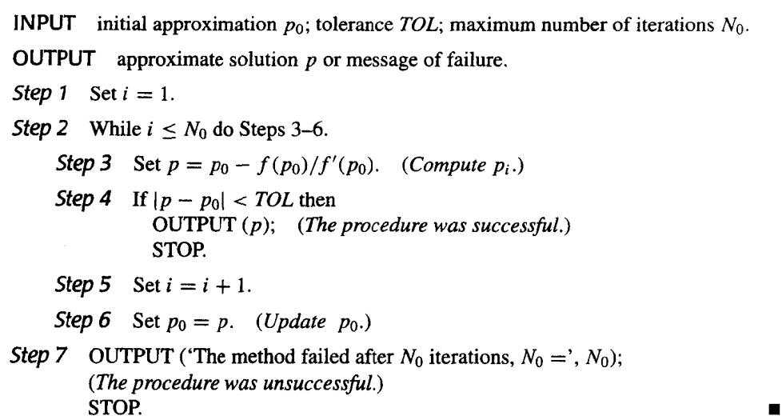

!!! note "定理：设$f\in C^2[a,b]$，如果$p\in [a,b]$满足$f(p)=0$且$f'(p)\neq 0$，则存在$\delta>0$，使得对任何初始值$p_0\in (p-\delta, p+\delta)$，牛顿迭代法产生收敛于$p$的序列$\{p_n\}_{n=1}^\infty$。"

    证明：

    

牛顿迭代法的收敛性取决于初始近似值的选择。

### 2.4 迭代法的误差分析 | Error Analysis for Iterative Methods

假设$\{p_n\}_{n=0}^\infty$收敛于$p$，其中对$\forall p_n \neq p$。如果存在正数$\lambda$和$\alpha$，使得

$$
\lim_{n\to\infty}\frac{|p_{n+1}-p|}{|p_n-p|^\alpha} = \lambda
$$

则称$\{p_n\}_{n=0}^\infty$是$\alpha$阶收敛的(converges to p of order α)，$\lambda$称为**渐进误差常数**(asymptotic error constant)。

一般具有高阶收敛性的序列收敛速度更快。

- 如果$\alpha=1$，则该序列是**线性收敛**的(linearly convergent)。

- 如果$\alpha=2$，则该序列是**二次收敛**的(quadratically convergent)。

#### 不动点法

不动点法的收敛阶和渐进误差常数：

$$
\begin{aligned}
p_{n+1}-p = g(p_n)-g(p) = g'(\xi)(p_n-p) &\Rightarrow \frac{|p_{n+1}-p|}{|p_n-p|} = |g'(\xi)|\\
&\Rightarrow \lim_{n\to\infty}\frac{|p_{n+1}-p|}{|p_n-p|} = \lim_{n\to\infty}|g'(\xi)| = |g'(p)|
\end{aligned}
$$

因此，如果$g'(p)\neq 0$，则不动点迭代法是线性收敛的，且渐进误差常数为$|g'(p)|$。

#### 牛顿迭代法

牛顿迭代法的收敛阶和渐进误差常数：

由泰勒展开：

$$
\begin{aligned}
0 &= f(p) = f(p_n) + f'(p_n)(p-p_n) + \frac{f''(\xi)}{2}(p-p_n)^2\\
&\Rightarrow p =     p_n-\frac{f(p_n)}{f'(p_n)} - \frac{f''(\xi)}{2f'(p_n)}(p-p_n)^2\\
&\Rightarrow \lim_{n\to\infty}\frac{|p_{n+1}-p|}{|p_n-p|^2} = \lim_{n\to\infty}\frac{|f''(\xi)|}{2|f'(p_n)|} = \frac{|f''(p)|}{2|f'(p)|}
\end{aligned}
$$

因此，牛顿迭代法是二次收敛的，且渐进误差常数为$\frac{|f''(p)|}{2|f'(p)|}$。

#### 不动点法的多重根情况

如果$p$是$g(x)$的不动点，存在正整数$m$，使得$g'(p)=g''(p)=\ldots=g^{(m-1)}(p)=0$，且$g^{(m)}(p)\neq 0$，则称$p_n = g(p_{n-1})$以阶$m$收敛于$p$，渐进误差常数为$\frac{|g^{(m)}(p)|}{m!}$。

$$
\begin{aligned}
p_{n+1} &= g(p_n) = g(p) + g'(p)(p_n-p) + \frac{g''(\xi)}{2}(p_n-p)^2 + \ldots + \frac{g^{(m)}(\xi)}{m!}(p_n-p)^m\\
&\Rightarrow \lim_{n\to\infty}\frac{|p_{n+1}-p|}{|p_n-p|^m} = \lim_{n\to\infty}\frac{|g^{(m)}(\xi)|}{m!} = \frac{|g^{(m)}(p)|}{m!}
\end{aligned}
$$

#### 牛顿法的多重根情况

如果$p$是$f$的$m$重零点，则有$f(x)=(x-p)^mq(x)$，记$g(x)=x-\frac{f(x)}{f'(x)}$，牛顿法即为 $p_n=g(p_{n-1})$

$$
\begin{align*}
g'(x)
&= 1-\frac{f'(x)^2-f(x)f''(x)}{(f'(x))^2} \\
&= \frac{f(x)f''(x)}{(f'(x))^2} \\
&= \frac{(x-p)^mq(x)(m(m-1)(x-p)^{m-2}q(x)+2m(x-p)^{m-1}q'(x)+q''(x)(x-p)^m)}{(m(x-p)^{m-1}q(x)+q'(x)(x-p)^m)^2} \\
&= \frac{(x-p)^{2m-2}q(x)(m(m-1)q(x)+2m(x-p)q'(x)+q''(x)(x-p)^2)}{(x-p)^{2m-2}(mq(x)+q'(x)(x-p))^2} \\
&= \frac{q(x)(m(m-1)q(x)+2m(x-p)q'(x)+q''(x)(x-p)^2)}{(mq(x)+q'(x)(x-p))^2}
\end{align*}
$$

所以

$$g'(p)=\frac{q(p)m(m-1)q(p)}{(mq(p))^2}=1-\frac{1}{m}<1$$

由不动点法的迭代情况可知，此时为线性收敛，不为二次收敛。

#### 牛顿法多重根下的优化

定义

$$\mu(x)=\frac{f(x)}{f'(x)}$$

如果$p$是$f$ 的$m$重零点，$f(x)=(x-p)^mq(x)$，则

$$\mu(x)=\frac{(x-p)^mq(x)}{m(x-p)^{m-1}q(x)+q'(x)(x-p)^m}=\frac{(x-p)q(x)}{mq(x)+q'(x)(x-p)}$$

又$q(p)\neq 0$，且

$$\frac{q(p)}{mq(p)+q'(p)(p-p)}=\frac{1}{m}\neq 0$$

所以$p$是$\mu(x)$的单根，那么我们对$\mu$应用牛顿迭代法，就有

$$
\begin{align*}
p_{n+1}=g(p_n) &= p_n-\frac{\mu(p_n)}{\mu'(p_n)} \\
&= p_n-\frac{\frac{f(p_n)}{f'(p_n)}}{\frac{f'(p_n)f'(p_n)-f(p_n)f''(p_n)}{(f'(p_n))^2}} \\
&= p_n-\frac{f(p_n)f'(p_n)}{f'(p_n)^2-f(p_n)f''(p_n)} \\
\end{align*}
$$

这就是让有多重根的牛顿法二次收敛的方法。

!!! warning ""
    1. 要求二阶导
    2. 分母由两个接近于0的数相减，会引起严重的舍入误差。

### 2.5 加速收敛 | Accelerating Convergence

二次收敛是很少可以得到的，我们在日常中总会碰到线性收敛。为了考虑如何加速线性收敛序列的收敛速度，下面介绍——**AITKEN$\Delta^2$方法**。

#### AITKEN$\Delta^2$方法

!!! note "$\Delta$"
    对于给定的序列，向前差分(forward difference)定义为$\Delta p_n = p_{n+1}-p_n$，对于更高的幂，我们有$\Delta^k p_n = \Delta(\Delta^{k-1}p_n)$，比如$\Delta^2 p_n = \Delta(\Delta p_n)= \Delta(p_{n+1}-p_n) = (p_{n+2}-p_{n+1}) -(p_{n+1}-p_n)$

假设$\{p_n\}_{n=0}^\infty$是线性收敛的，其极限为$p$。

为了便于构造比$\{p_n\}_{n=0}^\infty$收敛更快的序列$\{\hat{p}_n\}_{n=0}^\infty$，我们假设$p_n-p, p_{n+1}-p, p_{n+2}-p$的符号一致，又假设$n$足够大，有

$$
\frac{p_{n+1}-p}{p_n-p} \approx \frac{p_{n+2}-p}{p_{n+1}-p}
$$

从而

$$
p_{n+1}^2-2p_{n+1}p+p^2 \approx p_{n+2}p_n-(p_n+p_{n+2})p+p^2
$$

解出$p$，得到

$$
p \approx \frac{p_{n+2}p_{n}-p_{n+1}^2}{p_{n+2}-2p_{n+1}+p_n} \approx p_n - \frac{(p_{n+1}-p_n)^2}{p_{n+2}-2p_{n+1}+p_n}
$$

于是，我们可以构造序列$\{\hat{p}_n\}_{n=0}^\infty$，其中

$$
\hat{p}_n = p_n - \frac{(p_{n+1}-p_n)^2}{p_{n+2}-2p_{n+1}+p_n}=p_n -\frac{(\Delta p_n)^2}{\Delta^2 p_n}
$$

这样定义序列的方法就是AITKEN$\Delta^2$法

!!! note "为什么说更快？"

    可以证明

    $$\lim_{n\rightarrow \infty} \frac{\hat{p_n}-p}{p_n-p} = 0$$

!!! note "怎么迭代？"
    其实还是用序列本身的迭代法，不过在计算值的时候采取了AITKEN$\Delta^2$法。

    构造按如下顺序：

    $$
    p_0, p_1 = g(p_0), p_2 = g(p_1)  \\
    \hat{p_0} = \{\Delta^2\}(p_0)\\
    p_3 = g(p_2) \\
    \hat{p_1} = \{\Delta^2\}(p_1)\\
    \vdots
    $$

#### Steffensen 方法

这个方法假设$\hat{p_0}$比$p_2$更好地逼近$p$，从而把上述过程第三行的不动点迭代应用到$\hat{p_0}$上

$$
p_0^{(0)}, p_1^{(0)} = g(p_0^{(0)}), p_2^{(0)} = g(p_1^{(0)})  \\
p_0^{(1)} = \{\Delta^2\}(p_0^{(0)})\\
p_1^{(1)} = g(p_0^{(0)}) \\
\vdots
$$

算法如下：

注意$\Delta^2 p_n$可能为0，如果发生，则终止并选取$p_2^{(n-1)}$为近似解。

!!! note ""
    我们一般要求$g'(p)\neq 0$，则在邻域内Steffensen法是二次收敛的

## Chapter 3 插值和多项式逼近 | Interpolation and Polynomial Approximation

### 3.1 插值和 Lagrange 多项式 | Interpolation and Lagrange Polynomials

#### 构造 Lagrange 多项式

拉格朗日插值就是构造一个次数至多为 $n$ 次的多项式使它通过 $n+1$ 个给定的点，这个多项式就是拉格朗日多项式。

!!! note  " $n = 1$ "

    构造$P(x)=a_0+a_1x$，使得$P(x_0)=y_0$，$P(x_1)=y_1$。
    
    则$P(x)=y_0+\frac{y_1-y_0}{x_1-x_0}(x-x_0)=\frac{x-x_1}{x_0-x_1}y_0+\frac{x-x_0}{x_1-x_0}y_1$。 

    其中$\frac{x-x_1}{x_0-x_1}$和$\frac{x-x_0}{x_1-x_0}$分别记作$L_{1,0}(x)$和$L_{1,1}(x)$（第一个下标即为$n$的值，第二个下标为样本点的序号），这称为拉格朗日基函数（Lagrange Basis）。

!!! note ""
    可以知道，拉格朗日基函数总是满足Kronecker Delta函数$\delta_{ij}$。

    $$\delta_{ij} = \begin{cases} 1, & i = j \\ 0, & i \neq j \end{cases}$$

推广到$n$次插值，构造$P(x)=a_0+a_1x+\cdots+a_nx^n$，使得$P(x_i)=y_i$，$i=0,1,\cdots,n$。就是要找到 $L_{n,i}(x)$ 使得 $L_{n,i}(x_j) = \delta_{ij}$

分析可知，这里的$L_{n,i}(x)$有 $n$ 个根，分别为$x_0,x_1,\cdots,x_{i-1},x_{i+1},\cdots,x_n$。所以可以构造出

$$L_{n,i}(x)=C(x-x_0)(x-x_1)\cdots(x-x_{i-1})(x-x_{i+1})\cdots(x-x_n)$$

又因为$L_{n,i}(x_i)=1$，所以

$$L_{n,i}(x)=\frac{(x-x_0)(x-x_1)\cdots(x-x_{i-1})(x-x_{i+1})\cdots(x-x_n)}{(x_i-x_0)(x_i-x_1)\cdots(x_i-x_{i-1})(x_i-x_{i+1})\cdots(x_i-x_n)}$$

即

$$L_{n,i}(x)=\prod\limits_{j=0,j\neq i}^n\frac{x-x_j}{x_i-x_j}$$

于是我们根据拉格朗日基函数构造出了 $n$ 次拉格朗日插值多项式

$$P_n(x)=\sum\limits_{i=0}^nL_{n,i}(x)y_i$$

#### Lagrange 多项式的唯一性

对 $n$ 个不同的点 ， $n$ 次拉格朗日插值多项式是唯一的

***证明：***

如果不唯一，假设存在另一个多项式$Q_n(x)$，使得$Q_n(x_i)=y_i$，$i=0,1,\cdots,n$，且$Q_n(x)\neq P_n(x)$。

则$R_n(x)=P_n(x)-Q_n(x)$是一个次数不超过$n$的多项式，且$R_n(x_i)=0$，$i=0,1,\cdots,n$。

由于$R_n(x)$的次数不超过$n$，$n$次多项式不可能有 $n+1$ 个解，所以$R_n(x)=0$，即$P_n(x)=Q_n(x)$，与假设矛盾。

!!! note ""

    如果 对 $n$ 个点 运用 超过$n$ 次的拉格朗日插值多项式，那么得到的多项式就不唯一了。

    例如 $P(x)=L_n\left(x\right)+p(x)\prod\limits_{i=0}^n\left(x-x_i\right)$

#### 拉格朗日逼近的余项

假定$a\leq x_0<x_1<\cdots<x_n\leq b$，$f\in C[a,b]$，$P_n(x)$是$f(x)$在$x_0,x_1,\cdots,x_n$上的拉格朗日插值多项式，则对任意$x\in[a,b]$，存在$\xi(x)\in(a,b)$，使得

$$f(x)-P_n(x)=\frac{f^{(n+1)}(\xi(x))}{(n+1)!}\prod\limits_{i=0}^n(x-x_i)$$

!!! note "证明"

    记$R_n(x)=f(x)-P_n(x)$，则$R_n(x)$是一个次数不超过$n$的多项式，且$R_n(x_i)=0$，$i=0,1,\cdots,n$。所以$R_n(x)$可记作$C(x)\prod\limits_{i=0}^n(x-x_i)$

    固定一个点$x$ ($x\neq x_i$) 时，记$g(t)=R_n(t)-C(x)\prod\limits_{i=0}^n(t-x_i)$，则$g(x)=0$，$g(x_i)=0$，$i=0,1,\cdots,n$，所以$g(t)$存在$n+2$个不同的零点
    
    根据推广的Rolle定理，存在$\xi(x)\in(a,b)$，使得$g^{(n+1)}(\xi(x))=0$，即
    
    $$
    \begin{aligned}
    0=g^{(n+1)}(\xi(x))&=(R_n(\xi(x))-C(x)\prod\limits_{i=0}^n(\xi(x)-x_i))^{(n+1)}\\&=(f(\xi(x))-P_n(\xi(x))-C(x)\prod\limits_{i=0}^n(t-x_i))^{(n+1)}\\
    &=f^{(n+1)}(\xi(x))-C(x)(n+1)! \quad //因为P_n(x)是n次多项式，所以P_n^{(n+1)}(x)=0\\
    \end{aligned}
    $$
    
    所以$C(x)=\frac{f^{(n+1)}(\xi(x))}{(n+1)!}$，所以$R_n(x)=\frac{f^{(n+1)}(\xi(x))}{(n+1)!}\prod\limits_{i=0}^n(x-x_i)$

因为这里的$f^{(n+1)}(\xi(x))$是不知道的，所以我们经常用$f^{(n+1)}(x)$的上界来估计余项。

!!! note ""

    分析余项可知，对于小于等于 $n$ 次的多项式 $f$ ，经过$n$次拉格朗日插值得到的余项为0，得到的多项式就是 $f$ 本身

    !!! note ""
        这里限制了$f$为多项式

##### 例子 1

假设为 $x\in [0,1]$ 的函数 $f(x)=e^x$ 做一个表格。设表中每一项精确的位数是 $d\geq 8$，相邻 $x$ 值之差即步长为 $h$。为使线性插值（即一次Lagrange插值）的误差不超过 $10^{-6}$，$h$应该是多少？

***解：***

假设 $[0, 1]$ 被分成 $n$ 个等距的子区间 $[x_0, x_1], [x_1, x_2], \cdots, [x_{n-1} , x_n]$，$x$ 在区间 $[x_k, x_{k+1}]$ 中。则误差估计为

$$
\begin{aligned}
|f(x)-P_1(x)| &= |\frac{f''(\xi(x))}{2!}(x-x_k)(x-x_{k+1})| \\
&\leq |\frac{e^\xi}{2}(x-kh)(x-(k+1)h)| \\
&\leq \frac{e}{2}\cdot \frac{h^2}{4} \\
&\leq 10^{-6}
\end{aligned}
$$

所以 $h\leq 1.72\times 10^{-3}$。我们不妨取 $h=10^{-3}$，则 $n=1000$。

##### 例子 2

!!! note ""

    给三个点，我们有两种方法来线性插值。往往，**内插(Intrapolation)** 会比 **外插(Extrapolation)** 更加准确。

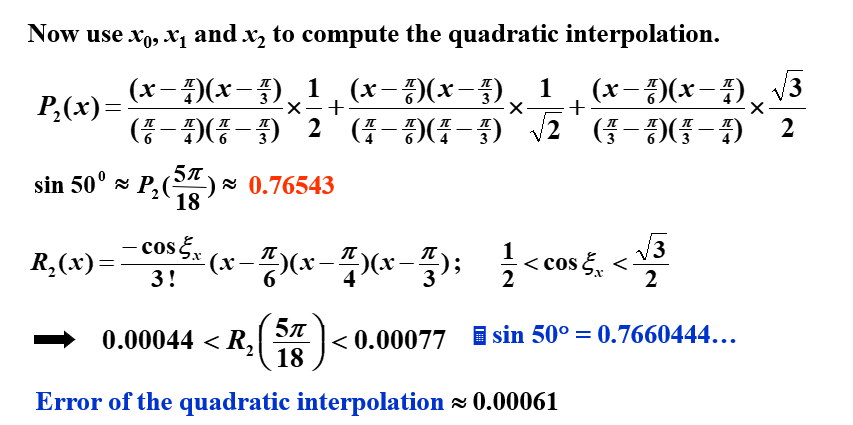

!!! note ""

    高次的拉格朗日插值一般会比低次的插值更加准确，但是这不一定总成立。

#### Neville 迭代插值法

**记号说明：** 设 $f$ 在 $x_0,x_1,\cdots,x_n$ 上有定义，$m_1,m_2,\cdots,m_k$ 是 $k$ 个不同的整数，$0\leq m_i\leq n$，$i=1,2,\cdots,k$。记在这 $k$ 个点上与 $f(x)$ 相同的拉格朗日多项式为 $P_{m_1,m_2,\cdots,m_k}(x)$。

**定理：** 设 $f$ 在 $x_0,x_1,\cdots,x_n$ 上有定义，让 $x_i$ 和 $x_j$ 是这个集合中的两个不同的数。则

$$P(x)=\frac{(x-x_j)P_{0,1,...,j-1,j+1,...,k}(x)-(x-x_i)P_{0,1,...,i-1,i+1,...,k}(x)}{(x_i-x_j)}$$

描述了对 $f$ 在 $x_0,x_1,\cdots,x_k$ 这 $k+1$个点 上的 $k$ 次插值多项式。

!!! example "五个点"
    

**证明：**

对于任意 $0\leq r\leq k$，$r\neq i$ 和 $r\neq j$，分子上的两个插值多项式在 $x_r$ 处都等于 $f(x_r)$，所以 $P(x_r)=f(x_r)$。

分子上的第一个多项式在 $x_i$ 处等于 $f(x_i)$，而第二个多项式在 $x_i$ 处为0，所以 $P(x_i)=f(x_i)$。同理 $P(x_j)=f(x_j)$。

所以 $P(x)$ 在 $x_0,x_1,\cdots,x_k$ 上与 $f(x)$ 相同，因为 $P(x)$ 是 $k$ 次多项式，所以 $P(x)=P_{0,1,\cdots,k}(x)$。

##### 伪代码

### 3.2 Divided Differences | 差商

#### Newton's Interpolatory Divided-Difference formula | 差商型 Newton 插值多项式

设 $P_n(x)$ 是函数 $f$ 在点 $x_0, x_1,\cdots,x_n$ 上的拉格朗日多项式，$f$ 关于 $x_0,x_1,\cdots,x_n$ 的差商被用于将 $P_n(x)$ 表示为：

$$P_n(x)=f[x_0]+f[x_0,x_1](x-x_0)+\cdots+f[x_0,x_1,\cdots,x_n](x-x_0)(x-x_1)\cdots(x-x_{n-1})$$

其中 $f[x_0,x_1,\cdots,x_n]$ 是 $f$ 关于 $x_0,x_1,\cdots,x_n$ 的差商，通过代值可以得到

$$f[x_0]=f(x_0), f[x_0,x_1]=\frac{f(x_1)-f(x_2)}{x_1-x_0}, f[x_0,x_1,x_2]=\frac{f[x_1,x_2]-f[x_0,x_1]}{x_2-x_0}, \cdots$$

$$f[x_0,x_1,\cdots,x_n]=\frac{f[x_1,x_2,\cdots,x_n]-f[x_0,x_1,\cdots,x_{n-1}]}{x_n-x_0}$$

我们记 $f[x_0], f[x_0,x_1],\cdots,f[x_0,x_1,\cdots,x_n]$ 为 $f$ 关于 $x_0,x_1,\cdots,x_n$ 的 $0$ 阶差商，$1$ 阶差商，$\cdots$，$n$ 阶差商。

!!! note "六个点的三阶差商计算的例子"
    

同时，我们称

$$P_n(x)=f[x_0]+f[x_0,x_1](x-x_0)+\cdots+f[x_0,x_1,\cdots,x_n](x-x_0)(x-x_1)\cdots(x-x_{n-1})$$

为**差商型 Newton 插值多项式**(Newton's Interpolatory Divided-Difference formula)。

##### 伪代码

##### 差商和导数的关系

###### 一阶差分

将中值定理应用到 $f$ 在 $[x_0,x_1]$ 上，得到

$$f[x_0,x_1]=\frac{f(x_1)-f(x_0)}{x_1-x_0}=f'(\xi)$$

###### $n$ 阶差分

设 $f\in C^n[a,b]$ 且 $x_0,x_1,\cdots,x_n\in[a,b]$，则存在 $\xi\in(a,b)$，使得

$$f[x_0,x_1,\cdots,x_n]=\frac{f^{(n)}(\xi)}{n!}$$

***证明：***

设 $g(t)=f(t)-P_n(t)$，则 $g(x_i)=0$，$i=0,1,\cdots,n$。所以 $g(t)$ 在 $[x_0,x_n]$ 上有 $n+1$ 个零点，根据推广的 Rolle 定理，存在 $\xi\in(a,b)$，使得 $g^{(n)}(\xi)=0$，即

$$f^{(n)}(\xi)-P_n^{(n)}(\xi)=0$$

所以 $P_n^{(n)}(\xi)=f^{(n)}(\xi)$，因为

$$P_n^{(n)}(\xi)=n!f[x_0,x_1,\cdots,x_n]$$

所以

$$f[x_0,x_1,\cdots,x_n]=\frac{f^{(n)}(\xi)}{n!}$$

!!! note "PPT上采用的证明方法"
    

##### 差分记号引入

如果每个点都连续等步长排列，记步长为$h$，令$x_i=x_0+ih$，则

引入**向前差分(forward difference)**记号：

$$\begin{aligned}
\Delta f(x_i)&=f(x_{i+1})-f(x_i)\\
\Delta^2 f(x_i)&=\Delta f(x_{i+1})-\Delta f(x_i)\\
\Delta^3 f(x_i)&=\Delta^2 f(x_{i+1})-\Delta^2 f(x_i)\\
\cdots
\end{aligned}$$

引入**向后差分(backward difference)**记号：

$$\begin{aligned}
\nabla f(x_i)&=f(x_i)-f(x_{i-1})\\
\nabla^2 f(x_i)&=\nabla f(x_i)-\nabla f(x_{i-1})\\
\nabla^3 f(x_i)&=\nabla^2 f(x_i)-\nabla^2 f(x_{i-1})\\
\cdots
\end{aligned}$$

引入**中心差分(central difference)**记号：

$$\delta^k f_i = \delta^{k-1}f_{i+\frac{1}{2}}-\delta^{k-1}f_{i-\frac{1}{2}}$$

其中

$$f_{i\pm\frac{1}{2}}=f(x_i\pm\frac{h}{2})$$

##### 等距下的向前差商公式

在等距情况下，向前差商的公式可表示为：

$$\begin{aligned}
P_n(x_s)=P_n(x_0+sh)&=f[x_0]+f[x_0,x_1]sh+\cdots+f[x_0,x_1,\cdots,x_n]s(s-1)\cdots(s-n+1)h^n\\
&=\sum\limits_{k=0}^n\begin{pmatrix}s\\k\end{pmatrix}k!h^kf[x_0,x_1,\cdots,x_k]
\end{aligned}$$

!!! note ""
    这里的 $\begin{pmatrix}s\\k\end{pmatrix}$ 是组合数，即 $\frac{s(s-1)\cdots(s-k+1)}{k!}$

##### 等距下的向前差分公式

由向前差分的记号可知道

$$
\begin{aligned}
f[x_{0},x_{1}]& =\frac{f(x_{1})-f(x_{0})}{x_{1}-x_{0}}=\frac{1}{h}\Delta f(x_{0})  \\
f[x_{0},x_{1},x_{2}]& =\frac{1}{2h}\left[\frac{\Delta f(x_{1})-\Delta f(x_{0})}{h}\right]=\frac{1}{2h^{2}}\Delta^{2}f(x_{0}),
\end{aligned}
$$

由此可推广得出

$$f[x_{0},x_{1},\ldots,x_{k}]=\frac{1}{k!h^{k}}\Delta^{k}f(x_{0}).$$

所以

$$P_n(x_s)=\sum\limits_{k=0}^n\begin{pmatrix}s\\k\end{pmatrix}\Delta^{k}f(x_{0})$$

此即为向前差分的公式

##### 等距下的向后差商公式

重排插值节点再计算，此时：

$$\begin{aligned}P_n(x)=&f[x_n]+f[x_n,x_{n-1}](x-x_n)+f[x_n,x_{n-1},x_{n-2}](x-x_n)(x-x_{n-1})\\&+\cdots+f[x_n,\ldots,x_0](x-x_n)(x-x_{n-1})\cdots(x-x_1).\end{aligned}$$

在等距情况下，记 $x_s=x_n+sh=x_i+(s+n-i)h$，有

$$
\begin{aligned}
P_{n}(x_s) =&P_{n}(x_{n}+sh)  \\
=&f[x_{n}]+shf[x_{n},x_{n-1}]+s(s+1)h^{2}f[x_{n},x_{n-1},x_{n-2}]+\cdots  \\
&+s(s+1)\cdots(s+n-1)h^nf[x_n,\ldots,x_0]\\
=&\sum\limits_{k=0}^n(-1)^k\begin{pmatrix}-s\\k\end{pmatrix}k!h^kf[x_n,x_{n-1},\cdots,x_{n-k}]
\end{aligned}
$$

!!! note ""
    这里的 $\begin{pmatrix}-s\\k\end{pmatrix}$ 是组合数，即 $\frac{-s(-s-1)\cdots(-s-k+1)}{k!}=(-1)^k \cdot \frac{s(s+1)\cdots(s+k-1)}{k!}$

##### 等距下的向后差分公式

由向后差分的记号可知道

$$\begin{aligned}
f[x_n,x_{n-1}]&=\frac1h\nabla f(x_n),\\
f[x_n,x_{n-1},x_{n-2}]&=\frac1{2h^2}\nabla^2f(x_n),\\\end{aligned}$$

由此可推广得出

$$
\begin{aligned}
f[x_n,x_{n-1},\ldots,x_{n-k}]&=\frac1{k!h^k}\nabla^kf(x_n).\end{aligned}$$

所以

$$P_n(x_s)=\sum\limits_{k=0}^n(-1)^k\begin{pmatrix}-s\\k\end{pmatrix}\nabla^kf(x_n)$$

### 3.3 Hermite Interpolation | Hermite 插值

Hermite 插值的目标是找到一个插值多项式

#### Osculating polynomials | 密切多项式

在 $x_0,x_1,\cdots,x_n$ 上逼近 $f\in C^m[a,b]$ 的**密切多项式(osculating polynomial)** 是具有以下性质的多项式 $P_n(x)$：

1. $P_n(x)$ 在 $x_0,x_1,\cdots,x_n$ 上与 $f(x)$ 相同
2. 对每个 $x_i$，$P_n(x)$ 和 $f(x)$ 在 $x_i$ 处的前 $m_i$ 阶导数相同
3. 因此，我们可以得到 $\sum\limits_{i=0}^n(m_i+1)=\sum\limits_{i=0}^nm_i+(n+1)$ 个条件，于是 $P_n(x)$ 是一个次数至多为 $\sum\limits_{i=0}^nm_i+n$ 的多项式

我们给出密切多项式的定义：

**定义：** 设 $x_0,x_1,\cdots,x_n$ 是 $[a,b]$ 上的 $n+1$ 个不同的点，$m_0,m_1,\cdots,m_n$ 是 $n+1$ 个非负整数，假设$ f\in C^m[a,b]$，其中 $m=\max\limits_{0\leq i\leq n}m_i$。逼近 $f$ 的**密切多项式** $P_n(x)$ 是使得下式成立的**最小次数**的多项式：

$$\frac{d^k}{dx^k}P_n(x_i)=\frac{d^k}{dx^k}f(x_i),\quad k=0,1,\cdots,m_i,\quad i=0,1,\cdots,n$$

!!! note ""

    1. 当 $n=0$ 时，逼近 $f$ 的密切多项式是 $f$ 在 $x_0$ 处的 $m_0$ 阶 Taylor 多项式。
    2. 当 $m_i=0$ 时，密切多项式就是对 $f$ 在 $x_0,x_1,\cdots,x_n$ 上插值的 $n$ 次拉格朗日插值多项式。

#### Hermite 插值多项式

对密切多项式 $m_i=1$ 的情况，我们定义其为 Hermite 多项式。也就是说，多项式 $P(n)$ 和它的一阶导数 $P'(n)$ 在 $x_i$ 处与 $f$ 和 $f'$ 相同。

##### 特殊例子

假设 $x_0\neq x_1 \neq x_2$，给定 $f(x_0),f(x_1),f(x_2),f'(x_1)$，找到多项式使得$P(x_i)=f(x_i)$，$P'(x_1)=f'(x_1)$。

首先，其次数为3次，我们猜想其形式为

$$P(x)=\sum\limits_{i=0}^2f(x_i)h_i(x)+f'(x_1)\hat{h}_1(x)$$

其中$h_i(x_j)=\delta_i(x_j),h'_i(x_1)=0,\hat{h}_1(x_i)=0,\hat{h}'_1(x_1)=1$。

根据这个猜想，我们试图构造出 $h_i(x)$ 和 $\hat{h}_1(x)$ 。

首先，我们可以用拉格朗日同样的方法构造出三次多项式$h_i(x)$，使得$h_i(x_j)=\delta_i(x_j)$，$h'_i(x_1)=0$，$i=0,1,2$。

对于$h_0(x)$，有根$x_1,x_2$，且因为 $h'_0(x_1)=0$ 所以 $x_1$ 是 $h_0(x)$ 的二重根，所以其形式为

$$h_0(x)=C_0(x-x_1)^2(x-x_2)$$

又因为$h'_0(x_0)=1$，所以

$$h_0(x)=\frac{(x-x_1)^2(x-x_2)}{(x_0-x_1)^2(x_0-x_2)}$$

类似地，我们可以得到

$$h_2(x)=\frac{(x-x_0)(x-x_1)^2}{(x_2-x_0)(x_2-x_1)^2}$$

对于$h_1(x)$，有根$x_0,x_2$，都是单根。所以其形式为

$$h_1(x)=(Ax+B)(x-x_0)(x-x_2)$$

通过计算 $h_1(x_1)=1$，$h'_1(x_1)=0$，可以得到 $A$ 和 $B$ 的值。此处略。

然后，我们构造$\hat{h}_1(x)$，使得$\hat{h}_1(x_i)=0$，$\hat{h}'_1(x_1)=1$。对于$\hat{h}_1(x)$，有根$x_0,x_1,x_2$，所以

$$\hat{h}_1(x)=C(x-x_0)(x-x_1)(x-x_2)$$

又因为$\hat{h}'_1(x_1)=1$，所以可以通过计算得到 $C$ 的值。此处略。

##### 一般情况

如果已知 $f(x_0),f(x_1),\cdots,f(x_n)$ 和 $f'(x_0),f'(x_1),\cdots,f'(x_n)$，则可以构造出 Hermite 插值多项式

$$H_{2n+1}(x)=\sum\limits_{i=0}^nf(x_i)h_i(x)+\sum\limits_{i=0}^nf'(x_i)\hat{h}_i(x)$$

其中$(2n+1)$阶多项式$h_i(x_j)=\delta_i(x_j),h'_i(x_j)=0,\hat{h}_i(x_j)=0,\hat{h}'_i(x_j)=\delta_i(x_j)$。

对于$h_i(x)$，有根$x_0,x_1,\cdots,x_{i-1},x_{i+1},\cdots,x_n$，且因为 $h'_i(x_j)=0(j\neq i)$ 所以 $x_j$ 是 $h_i(x)$ 的 $2$ 重根，所以其形式为

$$
\begin{aligned}
h_i(x)&=(A'x+B')(x-x_0)^2(x-x_1)^2\cdots(x-x_{i-1})^2(x-x_{i+1})^2\cdots(x-x_n)^2\\
&=(Ax+B)L_{n,i}^2(x)
\end{aligned}
$$

!!! note ""
    这里的常系数改变是因为引入 $L_{n,i}(x)$ 的话，它相较前面的有额外系数

    $$L_{n,i}(x)=\prod\limits_{j=0,j\neq i}^n\frac{x-x_j}{x_i-x_j}$$

因为$h_i(x_i)=1$，$h'_i(x_i)=0$，所以

$$h_i(x)=\left(1-2(x-x_i)L'_{n,i}(x_i)\right)\left(L_{n,i}(x)\right)^2$$

对于$\hat{h}_i(x)$，有根$x_0,x_1,\cdots,x_n$，且因为 $\hat{h}'_i(x_j)=0(j\neq i)$，$\hat{h}'_i(x_i)=1$ 所以 $x_i$ 是 $\hat{h}_i(x)$ 的 $1$ 重根，其余的都是 $2$ 重根，所以其形式为

$$\hat{h}_i(x)=C_i(x-x_i)\left(L_{n,i}(x)\right)^2$$

因为$\hat{h}'_i(x_i)=1$，所以

$$\hat{h}_i(x)=\left(x-x_i\right)\left(L_{n,i}(x)\right)^2$$

##### 余项

如果 $a=x_0<x_1<\cdots<x_n=b$，$f\in C^{2n}[a,b]$，余项为

$$f(x)-P_n(x)=\frac{f^{(2n+2)}(\xi(x))}{(2n+2)!}\prod\limits_{i=0}^n(x-x_i)^2$$

### 3.4 Cubic Spline Interpolation | 三次样条插值

#### Piecewise-polynomial approximation | 分段多项式逼近

最简单的分段多项式逼近是分段线性逼近，即在每个子区间上用一个一次多项式逼近函数 $f$。但是，分段线性逼近的函数不光滑，所以我们希望用更高次的多项式来逼近 $f$。

{width=50%}

一个可替代的方法是使用 Hermite 插值多项式。例如，如果 $f$ 和 $f'$ 的值在每一个点 $x_i$ 处都已知，那么我们可以在每个子区间上使用一个三次多项式来逼近 $f$。这样的逼近是光滑的，但是为了将该多项式应用于一般插值，需要知道所有的 $f'$ 的值，这是不现实的。

由此，我们引入了三次样条插值。

#### Cubic spline interpolation | 三次样条插值

!!! note ""
    三次样条的构造不假设插值函数的导数值与原函数的导数值相等，即使在插值点处也如此。

给定在 $[a,b]$ 上的 $n+1$ 个点 $x_0,x_1,\cdots,x_n$，$a=x_0<x_1<\cdots<x_n=b$，以及 $f$。三次样条插值是一个函数 $S(x)$，满足以下条件：

1. $S(x)$ 在每个子区间 $[x_i,x_{i+1}]$ 上是一个三次多项式，$i=0,1,\cdots,n-1$
2. $S(x_i)=f(x_i)$，$i=0,1,\cdots,n$
3. $S_{i+1}(x_{i+1})=S_i(x_{i+1})$，$i=0,1,\cdots,n-2$
4. $S'_{i+1}(x_{i+1})=S'_i(x_{i+1})$，$i=0,1,\cdots,n-2$
5. $S''_{i+1}(x_{i+1})=S''_i(x_{i+1})$，$i=0,1,\cdots,n-2$
6. 下列的边界条件之一成立：
    1. $S''(x_0)=S''(x_n)=0$，称为**自由或自然边界(free or natural boundary)**
    2. $S'(x_0)=f'(x_0)$，$S'(x_n)=f'(x_n)$，称为**固支边界(clamped boundary)**
    3. 其他边界条件（上面两个条件其实已经足以满足目的了）

我们介绍一种构造三次样条插值的方法：

##### Method of Bending Moments

记 $h_j=x_j-x_{j-1}$，在 $x\in[x_{j-1},x_j]$ 上，$S(x)=S_j(x)$，$S'(x)=S'_j(x)$，$S''(x)=S''_j(x)$。

因为 $S(x)$ 是一个三次多项式，所以 $S''_j(x)$ 是一个一次多项式，由端点值决定，假设 $S''_j(x_{j-1})=M_{j-1}$，$S''_j(x_j)=M_j$。那么对于 $x\in[x_{j-1},x_j]$，有

$$S''_j(x)=M_{j-1}\frac{x_j-x}{h_j}+M_j\frac{x-x_{j-1}}{h_j}$$

积分得到

$$S'_j(x)=-M_{j-1}\frac{(x_j-x)^2}{2h_j}+M_j\frac{(x-x_{j-1})^2}{2h_j}+A_j$$

再积分得到

$$S_j(x)=M_{j-1}\frac{(x_j-x)^3}{6h_j}+M_j\frac{(x-x_{j-1})^3}{6h_j}+A_jx+B_j$$

$A_j$ 和 $B_j$ 是常数，可以通过 $S_j(x_{j-1})=y_{j-1}$ 和 $S_j(x_j)=y_{j}$ 得到。

$$\begin{aligned}
\begin{cases}
S_j(x_{j-1})=y_{j-1}\\
S_j(x_j)=y_{j}
\end{cases}
&\Rightarrow
\begin{cases}
M_{j-1}\frac{h_j^2}{6}+A_jx_{j-1}+B_j=y_{j-1}\\
M_j\frac{h_j^2}{6}+A_jx_j+B_j=y_{j}
\end{cases}\\
&\Rightarrow
\begin{cases}
A_j=\frac{y_j-y_{j-1}}{h_j}-\frac{M_j-M_{j-1}}{6}h_j\\
B_j=\frac{y_{j-1}x_j-y_jx_{j-1}}{h_j}-\frac{M_{j-1}x_j-M_jx_{j-1}}{6}h_j
\end{cases}\\
\end{aligned}$$

所以

$$
\begin{aligned}
A_jx+B_j&=\frac{y_j-y_{j-1}}{h_j}x+\frac{y_{j-1}x_j-y_jx_{j-1}}{h_j}-\frac{M_j-M_{j-1}}{6}h_jx-\frac{M_{j-1}x_j-M_jx_{j-1}}{6}h_j\\
&=(y_{j-1}-\frac{M_{j-1}}{6}h_j^2)\frac{x_j-x}{h_j}+(y_j-\frac{M_j}{6}h_j^2)\frac{x-x_{j-1}}{h_j}
\end{aligned}
$$

所以，我们的目的就是求出 $M_j$，$j=0,1,\cdots,n$。

因为 $S'$ 是连续的，所以

在 $[x_{j-1},x_j]$ 上，$S'_j(x)=-M_{j-1}\frac{(x_j-x)^2}{2h_j}+M_j\frac{(x-x_{j-1})^2}{2h_j}+f[x_{j-1},x_j]-\frac{M_j-M_{j-1}}{6}h_j$

在 $[x_j,x_{j+1}]$ 上，$S'_{j+1}(x)=-M_{j}\frac{(x_{j+1}-x)^2}{2h_{j+1}}+M_{j+1}\frac{(x-x_{j})^2}{2h_{j+1}}+f[x_j,x_{j+1}]-\frac{M_{j+1}-M_{j}}{6}h_{j+1}$

有 $S'_{j+1}(x_j)=S'_j(x_j)$，所以我们可以得到 $M_{j-1}, M_j, M_{j+1}$ 之间的关系：

记 $\lambda_j=\frac{h_{j+1}}{h_j+h_{j+1}}$，$\mu_j=\frac{h_{j}}{h_j+h_{j+1}}$，$g_j=\frac{6}{h_j+h_{j+1}}(f[x_j,x_{j+1}]-f[x_{j-1},x_j])$，则

$$
\mu_jM_{j-1}+2M_j+\lambda_jM_{j+1}=g_j
$$

其中 $j=1,2,\cdots,n-1$。

$$
\begin{bmatrix}
\mu_1 & 2 & \lambda_1 &  & & \\
& \mu_2 & 2 & \lambda_2 &  & \\
& & \ddots & \ddots & \ddots & \\
& & & \mu_{n-1} & 2 & \lambda_{n-1} \\
\end{bmatrix}
\begin{bmatrix}
M_0\\
M_1\\
\vdots\\
M_n\\
\end{bmatrix}=
\begin{bmatrix}
g_1\\
g_2\\
\vdots\\
g_{n-1}\\
\end{bmatrix}
$$

我们有 $n+1$ 个未知数，$n-1$个方程 → 由边界条件增加两个方程

###### Clamped boundary | 固支边界

此时我们知道 $S'(x_0)=f'(x_0)$，$S'(x_n)=f'(x_n)$，所以

在 $[x_0,x_1]$ 上，$S'_1(x)=-M_0\frac{(x_1-x)^2}{2h_1}+M_1\frac{(x-x_0)^2}{2h_1}+f[x_0,x_1]-\frac{M_1-M_0}{6}h_1$

在 $[x_{n-1},x_n]$ 上，$S'_n(x)=-M_{n-1}\frac{(x_n-x)^2}{2h_n}+M_n\frac{(x-x_{n-1})^2}{2h_n}+f[x_{n-1},x_n]-\frac{M_n-M_{n-1}}{6}h_n$

所以我们额外有两个方程：

$$
\begin{cases}
f'(x_0)=-M_0\frac{h_1}{2}+f[x_0,x_1]-\frac{M_1-M_0}{6}h_1\\
f'(x_n)=M_{n }\frac{h_n}{2}+f[x_{n-1},x_n]-\frac{M_n-M_{n-1}}{6}h_n
\end{cases}
\Rightarrow
\begin{cases}
2M_0+M_1=\frac{6}{h_1}(f[x_0,x_1]-f'(x_0))\triangleq g_0\\
M_{n-1}+2M_n=\frac{6}{h_n}(f'(x_n)-f[x_{n-1},x_n]) \triangleq g_n
\end{cases}
$$

所以我们可以得到

$$
\begin{bmatrix}
2 & 1 &  & & &\\
\mu_1 & 2 & \lambda_1 &  & &\\
& \ddots & \ddots & \ddots & &\\
& & \mu_{n-1} & 2 & \lambda_{n-1} &\\
& &   & 1  & 2
\end{bmatrix}
\begin{bmatrix}
M_0\\
M_1\\
\vdots\\
M_n\\
\end{bmatrix}=
\begin{bmatrix}
g_0\\
g_1\\
\vdots\\
g_n
\end{bmatrix}
$$

###### Natural boundary | 自由边界

!!! note ""
    根据之前的假设，有 $M_0=S''(x_0)=y''_0$，$M_n=S''(x_n)=y''_n$，则

    $$ \lambda_0 = 0, g_0 = 2y''_0, \mu_n = 0, g_n = 2y''_n $$

    当 $S''(x_0)=S''(x_n)=0$，我们称之为**自由边界(free boundary)**，此时 $g_0=g_n=0$。

$$
\begin{bmatrix}
2 & 0 & 0 & & &\\
\mu_1 & 2 & \lambda_1 &   \\
 & \ddots & \ddots & \ddots & \\
 & & \mu_{n-1} & 2 & \lambda_{n-1} \\
 & &   0& 0  & 2
\end{bmatrix}_{(n+1)\times (n+1)}
\begin{bmatrix}
M_0\\
M_1\\
\vdots\\
M_{n-1}\\
M_n\\
\end{bmatrix}_{(n+1)\times 1}=
\begin{bmatrix}
g_0\\
g_1\\
\vdots\\
g_{n-1}\\
g_n
\end{bmatrix}_{(n+1)\times 1}
$$

自由边界的情况下，有 $S''(x_0)=S''(x_n)=0$。

##### 书上的方法

我们介绍另一种构造三次样条插值的方法：

给定在 $[a,b]$ 上的 $n+1$ 个点 $x_0,x_1,\cdots,x_n$，$a=x_0<x_1<\cdots<x_n=b$，设三次多项式 $S_j(x)$ 为

$$S_j(x)=a_j+b_j(x-x_{j})+c_j(x-x_{j})^2+d_j(x-x_{j})^3,\quad j=0,1,\cdots,n-1$$

且满足

!!! note ""

      1. $S(x)$ 在每个子区间 $[x_i,x_{i+1}]$ 上是一个三次多项式，$i=0,1,\cdots,n-1$
      2. $S(x_i)=f(x_i)$，$i=0,1,\cdots,n$
      3. $S_{i+1}(x_{i+1})=S_i(x_{i+1})$，$i=0,1,\cdots,n-2$
      4. $S'_{i+1}(x_{i+1})=S'_i(x_{i+1})$，$i=0,1,\cdots,n-2$
      5. $S''_{i+1}(x_{i+1})=S''_i(x_{i+1})$，$i=0,1,\cdots,n-2$
      6. 下列的边界条件之一成立：
          1. $S''(x_0)=S''(x_n)=0$，称为**自由或自然边界(free or natural boundary)**
          2. $S'(x_0)=f'(x_0)$，$S'(x_n)=f'(x_n)$，称为**固支边界(clamped boundary)**
          3. 其他边界条件（上面两个条件其实已经足以满足目的了）

记 $h_j=x_j-x_{j-1}$，由条件3，可得

$$a_{j+1}=S_{j+1}(x_{j+1})=S_j(x_{j+1})=a_j+b_jh_j+c_jh_j^2+d_jh_j^3,\quad j=0,1,\cdots,n-1$$

又由条件4，因为 $S'(x)=b_j+2c_j(x-x_j)+3d_j(x-x_j)^2$，所以

$$b_{j+1}=S'_{j+1}(x_{j+1})=S'_j(x_{j+1})=b_j+2c_jh_j+3d_jh_j^2,\quad j=0,1,\cdots,n-1$$

又由条件5，因为 $S''(x)=2c_j+6d_j(x-x_j)$，所以

$$c_{j+1}=\frac{S''_{j+1}(x_{j+1})}{2}=c_j+3d_jh_j,\quad j=0,1,\cdots,n-1$$

所以

$$\begin{cases}
a_{j+1}=a_j+b_jh_j+c_jh_j^2+d_jh_j^3\\
b_{j+1}=b_j+2c_jh_j+3d_jh_j^2\\
c_{j+1}=c_j+3d_jh_j
\end{cases},\quad j=0,1,\cdots,n-1$$

把最后一个式子代入前两个式子，消去 $d_j$，得到

$$\begin{cases}
a_{j+1}=a_j+b_jh_j+\frac{h_j^2}{3}(2c_j+c_{j+1})\\
b_{j+1}=b_j+h_j(c_j+c_{j+1})\\
\end{cases},\quad j=0,1,\cdots,n-1$$

为了减少未知数，我们有

$$
\begin{aligned}
a_{j+1}=a_j+b_jh_j+\frac{h_j^2}{3}(2c_j+c_{j+1})&\Rightarrow
\begin{cases}
b_j=\frac{1}{h_j}(a_{j+1}-a_j)-\frac{h_j}{3}(2c_j+c_{j+1})\\
b_{j-1}=\frac{1}{h_{j-1}}(a_{j}-a_{j-1})-\frac{h_{j-1}}{3}(2c_{j-1}+c_{j})
\end{cases}\\
b_{j+1}=b_j+h_j(c_j+c_{j+1})&\Rightarrow b_j=b_{j-1}+h_{j-1}(c_{j-1}+c_j)
\end{aligned}
$$

所以

$$
\begin{aligned}
&\begin{cases}
b_j&=\frac{1}{h_j}(a_{j+1}-a_j)-\frac{h_j}{3}(2c_j+c_{j+1})\\
b_{j-1}&=\frac{1}{h_{j-1}}(a_{j}-a_{j-1})-\frac{h_{j-1}}{3}(2c_{j-1}+c_{j})\\
b_j&=b_{j-1}+h_{j-1}(c_{j-1}+c_j)
\end{cases}\\
&\Rightarrow
\frac{1}{h_j}(a_{j+1}-a_j)-\frac{h_j}{3}(2c_j+c_{j+1})
=\frac{1}{h_{j-1}}(a_{j}-a_{j-1})-\frac{h_{j-1}}{3}(2c_{j-1}+c_{j})+h_{j-1}(c_{j-1}+c_j)\\
&\Rightarrow
h_{j-1}c_{j-1}+2(h_{j-1}+h_j)c_j+h_jc_{j+1}
=\frac{3}{h_j}(a_{j+1}-a_j)-\frac{3}{h_{j-1}}(a_{j}-a_{j-1}) \quad (j=1,2,\cdots,n-1)\\
\end{aligned}
$$

因为 $a_j$, $h_j$ 已知，所以上式未知量仅为 $c_j$，而且求出 $c_j$ 后，$b_j$ 也就求出了。（$b_j=\frac{1}{h_j}(a_{j+1}-a_j)-\frac{h_j}{3}(2c_j+c_{j+1})$）

所以我们有 $n-1$ 个方程，$n+1$ 个未知数，所以我们需要额外的两个方程。

###### Natural boundary | 自由边界

书上给的是 $S''(a)=S''(b)=0$，实际上，我们在做题中扩展到了 $S''(a)=s_0$，$S''(b)=s_n$，此时

$$
c_0=\frac{S''(a)}{2}=\frac{s_0}{2},\quad c_n=\frac{S''(b)}{2}=\frac{s_n}{2}$$

所以，我们可以将上面的方程组写成 $\mathbf{Ax}=\mathbf{b}$ 的形式，其中 $\mathbf{A}$ 为 $(n+1)\times(n+1)$ 的矩阵

$$
\mathbf{A}=\begin{bmatrix}
1&0&0&\cdots&0&0&0\\
h_0&2(h_0+h_1)&h_1&\cdots&0&0&0\\
0&h_1&2(h_1+h_2)&\cdots&0&0&0\\
\vdots&\vdots&\vdots&\ddots&\vdots&\vdots&\vdots\\
0&0&0&\cdots&h_{n-2}&2(h_{n-2}+h_{n-1})&h_{n-1}\\
0&0&0&\cdots&0&0&1
\end{bmatrix}
$$

$\mathbf{b}$ 和 $\mathbf{x}$ 为 $(n+1)\times1$ 的向量

$$
\mathbf{b}=\begin{bmatrix}
\frac{s_0}{2}\\
\frac{3}{h_1}(a_{2}-a_1)-\frac{3}{h_0}(a_{1}-a_0)\\
\frac{3}{h_2}(a_{3}-a_2)-\frac{3}{h_1}(a_{2}-a_1)\\
\vdots\\
\frac{3}{h_{n-1}}(a_{n}-a_{n-1})-\frac{3}{h_{n-2}}(a_{n-1}-a_{n-2})\\
\frac{s_n}{2}
\end{bmatrix}
,\quad
\mathbf{x}=\begin{bmatrix}
c_0\\
c_1\\
c_2\\
\vdots\\
c_{n-1}\\
c_n
\end{bmatrix}
$$

因为矩阵 $\mathbf{A}$ 是严格对角占优的，所以该方程组有唯一解。

###### 伪代码

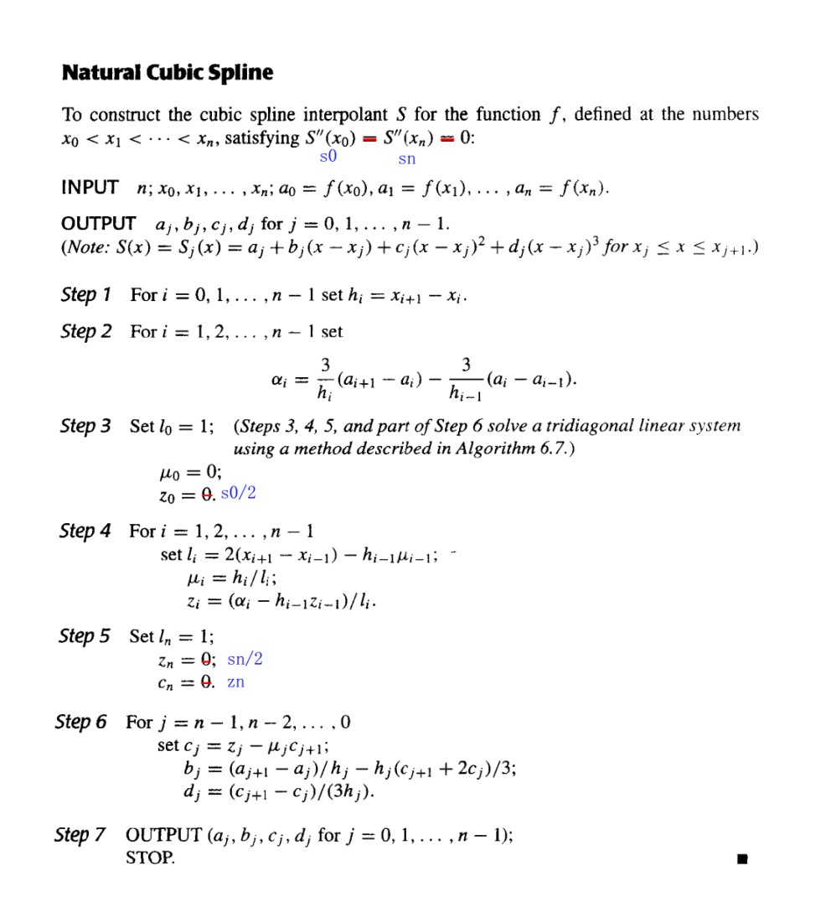

###### 固支边界

固支边界要求 $S'(a)=f'(a)$，$S'(b)=f'(b)$。

因为 $f'(a)=S'(a)=S'(x_0)=b_0$，$f'(b)=S'(b)=S'(x_n)=b_n$，所以

$$
\begin{aligned}
&\begin{cases}
f'(a)&=b_0=\frac{1}{h_0}(a_1-a_0)-\frac{h_0}{3}(2c_0+c_1)\\
f'(b)&=b_n=b_{n-1}+h_{n-1}(c_{n-1}+c_n)=\frac{1}{h_{n-1}}(a_{n}-a_{n-1})+\frac{h_{n-1}}{3}(c_{n-1}+2c_n)
\end{cases}\\
\Rightarrow&
\begin{cases}
2h_0c_0+h_0c_1&=\frac{3}{h_0}(a_1-a_0)-3f'(a)\\
h_{n-1}c_{n-1}+2h_{n-1}c_n&=3f'(b)-\frac{3}{h_{n-1}}(a_n-a_{n-1})
\end{cases}
\end{aligned}
$$

所以，我们可以将上面的方程组写成 $\mathbf{Ax}=\mathbf{b}$ 的形式，其中 $\mathbf{A}$ 为 $(n+1)\times(n+1)$ 的矩阵

$$
\mathbf{A}=\begin{bmatrix}
2h_0&h_0&0&\cdots&0&0&0\\
h_0&2(h_0+h_1)&h_1&\cdots&0&0&0\\
0&h_1&2(h_1+h_2)&\cdots&0&0&0\\
\vdots&\vdots&\vdots&\ddots&\vdots&\vdots&\vdots\\
0&0&0&\cdots&h_{n-2}&2(h_{n-2}+h_{n-1})&h_{n-1}\\
0&0&0&\cdots&0&h_{n-1}&2h_{n-1}
\end{bmatrix}
$$

$\mathbf{b}$ 和 $\mathbf{x}$ 为 $(n+1)\times1$ 的向量

$$
\mathbf{b}=\begin{bmatrix}
\frac{3}{h_0}(a_1-a_0)-3f'(a)\\
\frac{3}{h_1}(a_{2}-a_1)-\frac{3}{h_0}(a_{1}-a_0)\\
\frac{3}{h_2}(a_{3}-a_2)-\frac{3}{h_1}(a_{2}-a_1)\\
\vdots\\
\frac{3}{h_{n-1}}(a_{n}-a_{n-1})-\frac{3}{h_{n-2}}(a_{n-1}-a_{n-2})\\
3f'(b)-\frac{3}{h_{n-1}}(a_n-a_{n-1})
\end{bmatrix}
,\quad
\mathbf{x}=\begin{bmatrix}
c_0\\
c_1\\
c_2\\
\vdots\\
c_{n-1}\\
c_n
\end{bmatrix}
$$

因为矩阵 $\mathbf{A}$ 是严格对角占优的，所以该方程组有唯一解。

###### 伪代码

#### Properties of cubic splines | 三次样条的性质

- 只要系数矩阵严格对角占优（实际上是确保可逆），三次样条就可以由其边界条件唯一确定。
- 如果 $\frac{\max h_i}{\min h_i}$ 有界，那么 $S(x)$ 是收敛的。
- 增加点可以更贴近原函数。

## Chapter 4 数值微分与积分 | Numerical Differentiation and Integration

### 4.1 数值微分 | Numerical Differentiation

#### 两点法

最简单的方法：用两个点，取$h>0$

Forward : $f'(x) = \frac{f(x+h) - f(x)}{h} + O(h)$

Backward : $f'(x) = \frac{f(x) - f(x-h)}{h} + O(h)$

构造由 $x_0$ 和 $x_0+h$ 确定的一次 Lagrange 插值多项式：

$$
\begin{aligned}
f(x) &=\frac{f(x_0)(x-x_0-h)}{x_0-x_0-h}+\frac{f(x_0+h)(x-x_0)}{x_0+h-x_0} + \frac{(x-x_0)(x-x_0-h)}{2!}f''(\xi_x) \\
f'(x) &= \frac{f(x_0+h)-f(x_0)}{h} + \frac{2(x-x_0)-h}{2}f''(\xi_x) + \frac{(x-x_0)(x-x_0-h)}{2!}\frac{\mathrm{d}}{\mathrm{d}x}f''(\xi_x) \\
f'(x_0) &= \frac{f(x_0+h)-f(x_0)}{h} - \frac{h}{2}f''(\xi_x)
\end{aligned}
$$

#### 一般方法

用 $n+1$ 个点，构造 $n$ 次 Lagrange 插值多项式：

$$
\begin{aligned}f(x)&=\sum\limits_{k=0}^nf(x_k)L_k(x)+\frac{(x-x_0)\cdots(x-x_n)}{(n+1)!}f^{(n+1)}(\xi_x)\\
f^{\prime}(x_j)&=\sum\limits_{k=0}^nf(x_k)L_k^{\prime}(x_j)+\frac{f^{(n+1)}(\xi_j)}{(n+1)!}\prod_{k = 0,k\neq j}^n(x_j-x_k)
\end{aligned}$$

!!! note ""
    总体而言，更多的评估点会产生更高的准确性。另一方面，功能评估的数量增加，舍入误差也会增加。因此，数值微分是不稳定的！

#### 三点公式

因为

$$L_0(x) = \frac{(x-x_1)(x-x_2)}{(x_0-x_1)(x_0-x_2)}$$

所以

$$L'_0(x) = \frac{2x-x_1-x_2}{(x_0-x_1)(x_0-x_2)}$$

同理有

$$L'_1(x) = \frac{2x-x_0-x_2}{(x_1-x_0)(x_1-x_2)}$$

$$L'_2(x) = \frac{2x-x_0-x_1}{(x_2-x_0)(x_2-x_1)}$$

所以

$$
\begin{aligned}
f'(x_j) =& f(x_0)\frac{2x_j-x_1-x_2}{(x_0-x_1)(x_0-x_2)} + f(x_1)\frac{2x_j-x_0-x_2}{(x_1-x_0)(x_1-x_2)} \\&+ f(x_2)\frac{2x_j-x_0-x_1}{(x_2-x_0)(x_2-x_1)}+\frac{f^{(3)}(\xi_j)}{3!}\prod_{k=0,k\neq j}^2(x_j-x_k)
\end{aligned}
$$

如果 $x_0,x_1,x_2$ 等距，即 $x_1=x_0+h,x_2=x_0+2h$，则

$$
\begin{aligned}
f'(x_j) =& f(x_0)\frac{2x_j-2x_0-3h}{2h^2} + f(x_1)\frac{2x_j-2x_0-2h}{-h^2} \\&+ f(x_2)\frac{2x_j-2x_0-h}{2h^2}+\frac{f^{(3)}(\xi_j)}{3!}\prod_{k=0,k\neq j}^2(x_j-x_k)
\end{aligned}
$$

所以

$$
\begin{aligned}
f'(x_0) &= \frac{1}{h}(-\frac{3}{2}f(x_0)+2f(x_0+h)-\frac{1}{2}f(x_0+2h))+\frac{h^2}{3}f^{(3)}(\xi_0)\\
f'(x_1) &= \frac{1}{h}(-\frac{1}{2}f(x_0)+\frac{1}{2}f(x_0+2h))-\frac{h^2}{6}f^{(3)}(\xi_1)\\
f'(x_2) &= \frac{1}{h}(\frac{1}{2}f(x_0)-2f(x_0+h)+\frac{3}{2}f(x_0+2h))+\frac{h^2}{3}f^{(3)}(\xi_2)
\end{aligned}
$$

显然，中间的点误差最小，所以，我们可以用这种方法来估计导数值，即

$$f^{\prime}(x_0)=\frac1{2h}[f(x_0+h)-f(x_0-h)]-\frac{h^2}6f^{(3)}(\xi_1)$$

{width=30%}

#### 二阶导数

将函数 $f$ 在 $x_0$ 处展开为三阶 Taylor 多项式，并求在 $x_0+h$ 和 $x_0-h$ 处的值：

$$\begin{gathered}
f(x_0+h)=f(x_0)+f^{\prime}(x_0)h+\frac12f^{\prime\prime}(x_0)h^2+\frac16f^{\prime\prime\prime}(x_0)h^3+\frac1{24}f^{(4)}(\xi_1)h^4 \\
f(x_0-h)=f(x_0)-f^{\prime}(x_0)h+\frac12f^{\prime\prime}(x_0)h^2-\frac16f^{\prime\prime\prime}(x_0)h^3+\frac1{24}f^{(4)}(\xi_{-1})h^4
\end{gathered}$$

将上面两式相加，得

$$f^{\prime\prime}(x_0)=\frac{f(x_0+h)-2f(x_0)+f(x_0-h)}{h^2}-\frac{h^2}{24}[f^{(4)}(\xi_1)+f^{(4)}(\xi_{-1})]$$

由于 $f^{(4)}$ 是连续函数，所以存在 $\xi$ 使得

$$f^{(4)}(\xi)=\frac12[f^{(4)}(\xi_1)+f^{(4)}(\xi_{-1})]$$

所以

$$f^{\prime\prime}(x_0)=\frac{f(x_0+h)-2f(x_0)+f(x_0-h)}{h^2}-\frac{h^2}{12}f^{(4)}(\xi)$$

### 4.3 数值积分基础 | Elements of Numerical Integration

对于没有显式原函数或原函数难以计算的函数，我们通过 **数值求积（Numerical Quadrature）** 来近似计算积分值：使用和 $\sum\limits_{i=0}^n a_if(x_i)$ 来近似计算积分值 $\int_a^b f(x)\mathrm{d}x$。

为了确定系数 $a_i$ ，我们给出一种求积方法：

以第三章中给出的插值多项式为基础，得到 Lagrange 插值多项式：

$$P_n(x)=\sum\limits_{i=0}^nf(x_i)L_i(x)$$

所以

$$\int_a^b f(x)\mathrm{d}x\approx\int_a^b P_n(x)\mathrm{d}x=\sum\limits_{i=0}^nf(x_i)\int_a^b L_i(x)\mathrm{d}x=\sum\limits_{i=0}^n f(x_i)a_i$$

误差项为

$$\int_a^b f(x)\mathrm{d}x-\sum\limits_{i=0}^n f(x_i)a_i=\int_a^b (f(x)-P_n(x))\mathrm{d}x=\int_a^b \frac{f^{(n+1)}(\xi)}{(n+1)!}\prod_{i=0}^n(x-x_i)\mathrm{d}x$$

#### 精确度 | Precision

求积公式的精确度 (precision/degree of accuracy) 是使得求积公式对 $x^k$ 精确成立的最大正整数 $k$。

#### 通用法则 - Newton-Cotes 求积公式

在等距节点上（$h = \frac{b-a}{n}$），考察系数 $a_i$ 的值，我们可以得到一些通用的求积法则：

$$
\begin{aligned}
a_i=\int_{x_0}^{x_n}L_i(x)\mathrm{d}x&=\int_{x_0}^{x_n}\prod_{j=0,j\neq i}^n\frac{x-x_j}{x_i-x_j}\mathrm{d}x\\
\end{aligned}
$$

令 $x = a+th$，则

$$
\begin{aligned}
a_i&=\int_{x_0}^{x_n}\prod_{j=0,j\neq i}^n\frac{x-x_j}{x_i-x_j}\mathrm{d}x\\
&=\int_0^n\prod_{j=0,j\neq i}^n\frac{(t-j)h}{(i-j)h}\cdot h\mathrm{d}t\\
&=h\cdot \frac{(-1)^{n-i}}{i!(n-i)!}\cdot \int_0^n\prod_{j=0,j\neq i}^n(t-j)\mathrm{d}t\\
\end{aligned}
$$

#### 梯形法则 | Trapezoidal Rule

当 $n=1$ 时：

$$
\begin{aligned}
a_i&=h\cdot \frac{(-1)^{1-i}}{i!(1-i)!}\cdot \int_0^1\prod_{j=0,j\neq i}^1(t-j)\mathrm{d}t\\
a_0&=h\cdot \frac{(-1)^{1-0}}{0!(1-0)!}\cdot \int_0^1(t-1)\mathrm{d}t=\frac{1}{2}h\\
a_1&=h\cdot \frac{(-1)^{1-1}}{1!(1-1)!}\cdot \int_0^1(t-0)\mathrm{d}t=\frac{1}{2}h\\
\end{aligned}
$$

此时，$n=1$ 的求积公式为

$$\int_a^b f(x)\mathrm{d}x  = \frac{h}{2}[f(a)+f(b)]-\frac{h^3}{12}f''(\xi)$$

此即为 **梯形法则（Trapezoidal Rule）**。

##### 精确度

梯形法则的精确度为 $k=1$。

#### Simpson 法则 | Simpson's Rule

当 $n=2$ 时：

$$
\begin{aligned}
a_i&=h\cdot \frac{(-1)^{2-i}}{i!(2-i)!}\cdot \int_0^2\prod_{j=0,j\neq i}^2(t-j)\mathrm{d}t\\
a_0&=h\cdot \frac{(-1)^{2-0}}{0!(2-0)!}\cdot \int_0^2(t-1)(t-2)\mathrm{d}t=\frac{1}{3}h\\
a_1&=h\cdot \frac{(-1)^{2-1}}{1!(2-1)!}\cdot \int_0^2(t-0)(t-2)\mathrm{d}t=\frac{4}{3}h\\
a_2&=h\cdot \frac{(-1)^{2-2}}{2!(2-2)!}\cdot \int_0^2(t-0)(t-1)\mathrm{d}t=\frac{1}{3}h\\
\end{aligned}
$$

此时，$n=2$ 的求积公式为

$$\int_a^b f(x)\mathrm{d}x  = \frac{h}{3}[f(a)+4f(\frac{a+b}{2})+f(b)]-\frac{h^5}{90}f^{(4)}(\xi)$$

此即为 **Simpson 法则（Simpson's Rule）**。

其精确度为 $k=3$。

#### Simpson 3/8 法则 | Simpson's 3/8 Rule

当 $n=3$ 时，求积公式为

$$
\begin{aligned}
\int_a^b f(x)\mathrm{d}x  &= \frac{3h}{8}[f(a)+3f(\frac{2a+b}{3})+3f(\frac{a+2b}{3})+f(b)]\\
&-\frac{3h^5}{80}f^{(4)}(\xi)\\
\end{aligned}
$$

其精确度为 $k=3$。

#### Cotes 求积公式 | Cotes Rule

当 $n=4$ 时，求积公式为

$$
\begin{aligned}
\int_a^b f(x)\mathrm{d}x  &= \frac{2h}{45}[7f(a)+32f(\frac{3a+b}{4})+12f(\frac{a+b}{2})+32f(\frac{a+3b}{4})+7f(b)]\\
&-\frac{8h^7}{945}f^{(6)}(\xi)\\
\end{aligned}
$$

#### 通用法则的一般结论

注意：当 $n$ 是偶数时，精度的次数为 $n+1$，即使插值多项式的次数至多为 $n$。在 $n$ 是奇数的情况，精度的次数仅为 $n$。

### 4.4 复合数值积分 | Composite Numerical Integration

Newton-Cotes 以等距节点的插值多项式为基础。由于高次多项式的振荡性，这个过程在大的区间上是不精确的。为了解决这个问题，我们采用低阶 Newton-Cotes 的分段（piecewise）方法。

#### 复合梯形法则 | Composite Trapezoidal Rule

将区间 $[a,b]$ 分成 $n$ 个子区间，每个子区间长度为 $h = \frac{b-a}{n}$，则

$$\int_{x_{k-1}}^{x_k}f(x)dx\approx\frac{x_k-x_{k-1}}2[f(x_{k-1})+f(x_k)],\mathrm{~}k=1,...,n$$

$$\int_a^b f(x)\mathrm{d}x = \sum\limits_{i=0}^{n-1}\int_{x_i}^{x_{i+1}}f(x)\mathrm{d}x=\frac{h}{2}[f(a)+2\sum\limits_{j=1}^{n-1}f(x_j)+f(b)]=\color{blue}{T_n}$$

其中，$x_i = a+ih$，$\xi\in[a,b]$。

误差项为

$$\int_a^b f(x)\mathrm{d}x-T_n=\frac{h^2}{12}(b-a)f''(\xi)$$

#### 复合 Simpson 法则 | Composite Simpson's Rule

!!! warning ""
    $n$ 必须是偶数。

将区间 $[a,b]$ 分成 $n$ 个子区间，每个子区间长度为 $h = \frac{b-a}{n}$，则

$$\int_{x_k}^{x_{k+1}}f(x)dx\approx\frac h6[f(x_k)+4f(x_{k+\frac12})+f(x_{k+1})]$$

$$\int_a^bf(x)dx\approx\frac h6[f(a)+4\sum\limits_{k=0}^{n-1}f(x_{k+\frac12})+2\sum\limits_{k=0}^{n-2}f(x_{k+1})+f(b)]=\color{blue}{S_n}$$

其中，$x_i = a+ih$，$\xi\in[a,b]$。

误差项为

$$\int_a^b f(x)\mathrm{d}x-S_n=-\frac{b-a}{180}(\frac{h}2)^4f^{(4)}(\xi)$$

为简化表达，我们取 $n'=2n$，则 $h' = \frac{b-a}{n'} = \frac{h}{2}$，$x_{2k} = x_k$，$x_{2k+1} = x_k+\frac{h}{2}$，则

$$\int_a^bf(x)dx\approx\frac{h'}3[f(a)+4\sum\limits_{odd\;k}f(x_{k})+2\sum\limits_{even\;k}f(x_{k})+f(b)]=\color{blue}{S_{n'}}$$

#### 例题

#### 舍入误差的稳定性

所有的复合积分方法共有的一个重要性质是 **舍入误差的稳定性**。

可见，误差界与 $h$ 和 $n$ 无关。这说明即使将一个区间分成更多子区间，也不会增加舍入误差。

### 4.5 Romberg 积分 | Romberg Integration

考察残差项，对于梯形法则，有

$$R_{2n}[f]=-(\frac{h}{2})^2\frac{1}{12}(b-a)f''(\xi)\approx\frac{1}{4}R_n[f]$$

所以

$$\frac{I-T_{2n}}{I-T_n}\approx\frac{1}{4}$$

即

$$I\approx\frac{4T_{2n}-T_n}{4-1}=\frac43T_{2n}-\frac13T_n=\color{blue}{S_n}$$

同理，总体上，我们有

$$\frac{4T_{2n}-T_n}{4-1}= S_n, \frac{4^2S_{2n}-S_n}{4^2-1}=C_n, \frac{4^3C_{2n}-C_n}{4^3-1}=R_n, ...$$

这里的 $R_n$ 就是 **Romberg 积分**。

所以算法为：

!!! note ""
    其中，每一步计算误差有没有到，如果没到，继续向后算。

#### 伪代码

### 4.2 Richardson 外推法 | Richardson's Extrapolation

**Target**：使用低阶公式产生高精度的结果。

### 4.6 自适应求积方法 | Adaptive Quadrature Methods

Target: 预测函数变化的大小，使步长适应变化的需求。

其实就是先整体估摸着求积，然后看看精度如何（此处判断精度的方式是与上一次得到的值作比较，以比值为判断条件——如果本次和上次的值差不多，说明趋于收敛）；如果不够，就再细分一下，再求积。

举个例子：

这里可以看到，$S(a,\frac{a+b}{2})+S(\frac{a+b}{2},b)$ 逼近 $\int_a^b f(x)\mathrm{d}x$ 的效果比 $S(a,\frac{a+b}{2})+S(\frac{a+b}{2},b)$ 逼近$S(a,b)$ 好15倍。

### 4.7 Gauss 求积 | Gauss Quadrature

Target: 通过选择 $n+1$ 个合适的节点，使得求积公式的精度达到 $2n+1$。

!!! note "例子"

    用 Gauss 求积公式，在 $n=1$ 的情况下估计 $\int_{-1}^1 \sqrt{x}f(x)\mathrm{d}x$，则精度为3，需满足 $f(x)=1,x,x^2,x^3$。

    设 $\int_{-1}^1 \sqrt{x}f(x)\mathrm{d}x \approx A_0f(x_0)+A_1f(x_1)$，则

    $$\begin{cases}
    \int_{-1}^1 \sqrt{x}\mathrm{d}x = A_0+A_1 \\
    \int_{-1}^1 \sqrt{x}x\mathrm{d}x = A_0x_0+A_1x_1 \\
    \int_{-1}^1 \sqrt{x}x^2\mathrm{d}x = A_0x_0^2+A_1x_1^2 \\
    \int_{-1}^1 \sqrt{x}x^3\mathrm{d}x = A_0x_0^3+A_1x_1^3 \\
    \end{cases}$$

    由此可求得四个未知数，从而得到求积公式

但是，求解非线性方程组是很困难的，所以我们采用另一种方法。

我们可以证明： $x_0...x_n$ are Gaussian points $\color{blue}\text{iff}$  $W(x)=\prod\limits_{k=0}^n\left(x-x_k\right)$ is orthogonal to all the polynomials of degree no greater than $n.$

所以我们就是要找到一个正交多项式，它的零点就是我们要找的节点。

!!! note ""

    回到上面那个例子，我们就是要找到一个二阶多项式，其与小于二次的多项式的内积为0。

    

    

#### Gauss-Legendre 求积公式

**Legendre 多项式**：$P_n(x)=\frac{1}{2^nn!}\frac{\mathrm{d}^n}{\mathrm{d}x^n}[(x^2-1)^n]$。

其内积关系为：$(P_k,P_l)=\begin{cases}0, & k\neq l \\ \frac{2}{2k+1}, & k=l\end{cases}$。

根据 $P_0(x)=1,P_1(x)=x$，我们有递推关系：

$$P_{n+1}(x)=\frac{2n+1}{n+1}xP_n(x)-\frac{n}{n+1}P_{n-1}(x)$$

这些就是Legendre多项式的集合，也就是我们要找的正交多项式。

#### Gauss-Chebyshev 求积公式

## Chapter 5 常微分方程的初值问题 | Initial-Value Problems for Ordinary Differential Equations

用数值方法来求解常微分方程的初值问题，就是找到 $w_0,w_1,\cdots,w_N$，使得 $w_i\approx y(t_i)$。

### 5.1 初值问题的基本理论 | The Elementary Theory of Initial-Value Problems

#### Lipschitz 条件 | Lipschitz Condition

!!! note ""
    实际上，就是关于 $y$ 的偏导数（如果可导）的上界

在 Lipschitz 条件下，初值问题的解是唯一的：

#### 良态问题 | Well-Posed Problems

!!! note ""
    $z(t)$ 那行的式子是原式的摄动问题（perturbed problem），即在原式的基础上加上一个扰动项（假定微分方程可能有误差$\delta$，或者初值有误差$\epsilon$）

在 Lipschitz 条件下，初值问题是良态的：

### 5.2 Euler 法 | Euler's Method

Euler 法的目的是获得如下形式的近似解：

$$
\begin{cases}\frac{dy}{dt}=f\left(t,y\right)\quad t\in[a,b]\\y(a)=\alpha&\end{cases}
$$

得到的是一系列点的近似值。

Euler 法的思想是，用 $f(t,y)$ 在 $(t_i,y_i)$ 处的线性近似值来代替 $f(t,y)$，即：

$$w_{i+1}=w_i+hf(t_i,w_i)$$

我们称其为**差分方程**（difference equation）

{width=50%}

!!! note ""
    就是用一个点的导数值作为这个区间上的导数值

#### 误差界

如果考虑每次计算中的舍入误差，则有

此时，往往有 $h>\sqrt{2\delta /M}$（$\delta$ 通常很小），所以随着 $h$ 的减小，误差会越来越小。（打勾函数的右沿）

#### 其他 Euler 法

##### 隐式欧拉法 | Implicit Euler Method

隐式欧拉法(implicit Euler method)，又称后退欧拉法，是按照隐式公式进行数值求解的方法。隐式公式不能直接求解，一般需要用欧拉显式公式得到初值，然后用欧拉隐式公式进行迭代求解。因此，隐式公式比显式公式计算复杂，但稳定性好。

##### 梯形法 | Trapezoidal Method

梯形法(trapezoidal method)是一种求解常微分方程初值问题的数值方法。它是欧拉法和隐式欧拉法的结合，是一种二阶方法。梯形法的基本思想是用 $f(t_i,y_i)$ 和 $f(t_{i+1},y_{i+1})$ 的平均值来代替 $f(t,y)$，即：

$$w_{i+1}=w_i+\frac{h}{2}(f(t_i,w_i)+f(t_{i+1},w_{i+1}))$$

!!! note ""
    Note: The local truncation error is indeed $O(h^2)$.  However an implicit equation has to be solved iteratively.

##### 双步法 | Double-step Method

双步法相较于之前的方法，需要两个初始值，即 $w_0$ 和 $w_1$，然后用这两个初始值来计算 $w_2$，再用 $w_1$ 和 $w_2$ 来计算 $w_3$，以此类推。

##### 对比

### 5.3 高阶 Taylor 法 | Higher-Order Taylor Methods

#### 局部截断误差

局部截断误差只考虑一步的误差，即假设前面没有误差：

$$w_0=\alpha$$

$$w_{i+1}=w_i+h\phi(t_i,w_i),\quad i=0,1,\cdots,N-1$$

有局部截断误差

$$ \tau_{i+1}(h)=\frac{y_{i+1}-(y_i+h\phi(t_i,y_i))}{h}=\frac{y_{i+1}-y_i}{h}-\phi(t_i,y_i)$$

!!! note "对于 Euler 法"

    

Euler 法实际上就是高阶 Taylor 法的一阶近似。

#### 高阶 Taylor 法

$$y_{i+1}=y_i+hf(t_i,y_i)+\frac{h^2}2f^{\prime}(t_i,y_i)+\cdots+\frac{h^n}{n!}f^{(n-1)}(t_i,y_i)+\frac{h^{n+1}}{(n+1)!}f^{(n)}(\xi_i,y(\xi_i))$$

$n$ 阶的 Taylor 法：

$$
\begin{aligned}
w_{0}&=\alpha  \\
w_{i+1}&=w_{i}+hT^{(n)}(t_{i},w_{i})\quad(i=0,...,n-1) \\
&\text{where}\quad T^{(n)}(t_i,w_i)=f(t_i,w_i)+\frac{h}{2}f^{\prime}(t_i,w_i)+...+\frac{h^{n-1}}{n!}f^{(n-1)}(t_i,w_i)
\end{aligned}
$$

其局部截断误差为 $O(h^{n})$（如果 $y\in C^{n+1}[a,b]$）。

!!! note "例子"

    

    !!! note ""
        
        求 $f(t,y(t))=\frac{2}{t}y(t)+t^2e^t$ 关于 $t$ 的一阶导数

        $$
        \begin{aligned}
        f(t,y(t))&=\frac2ty+t^2e^t\\
        f'(t,y(t))&=\frac2ty'-\frac{2}{t^2}y+2te^t+t^2e^t\\
        &=\frac{2}{t}(\frac{2}{t}y+t^2e^t)-\frac{2}{t^2}y+2te^t+t^2e^t\\
        &=\frac{4}{t^2}y+2te^t-\frac{2}{t^2}y+2te^t+t^2e^t\\
        &=\frac{2}{t^2}y+4te^t+t^2e^t
        \end{aligned}
        $$

        $$
        \begin{aligned}
        T^{(2)}(t_i,w_i)&=f(t_i,w_i)+\frac{h}{2}f'(t_i,w_i)\\
        &=\frac{2}{t_i}w_i+t_i^2e^{t_i}+\frac{h}{2}(\frac{2}{t_i^2}w_i+4t_ie^{t_i}+t_i^2e^{t_i})\\
        \end{aligned}
        $$

        所以 $w_{i+1}$ 的表达式为：

        $$
        \begin{aligned}
        w_{i+1}&=w_i+hf(t_i,w_i)+\frac{h^2}{2}f'(t_i,w_i)\\
        &=w_i+h(\frac{2}{t_i}w_i+t_i^2e^{t_i})+\frac{h^2}{2}(\frac{2}{t_i^2}w_i+4t_ie^{t_i}+t_i^2e^{t_i})\\
        \end{aligned}
        $$

        $h=0.1$ 时：

        |$i$|$t_i$|$w_i$|$y(t_i)$|
        |:-:|:-:|:-:|:-:|
        |0|1.00|0.0000000|0.0000000|
        |1|1.10|0.3397852|0.3459199|
        |2|1.20|0.8521434|0.8666425|
        |3|1.30|1.581770|1.607215|
        |4|1.40|2.580997|2.620360|
        |5|1.50|3.910985|3.967666|
        |6|1.60|5.643081|5.720962|
        |7|1.70|7.860382|7.963874|
        |8|1.80|10.65951|10.79362|
        |9|1.90|14.15268|14.32308|
        |10|2.00|18.46999|18.68310|

    !!! note ""
        应用线性插值法，我们有

        $$
        \begin{aligned}
        y(1.04)&\approx 0.6y(1.00)+0.4y(1.10)\\
        &=0.6*0.0000000+0.4*0.3397852\\
        &=0.1359141\\
        y(1.55)&\approx 0.5y(1.50)+0.5y(1.60)\\
        &=0.5*3.910985+0.5*5.643081\\
        &=4.777033\\
        y(1.97)&\approx 0.3y(1.90)+0.7y(2.00)\\
        &=0.3*14.15268+0.7*18.46999\\
        &=17.17480
        \end{aligned}
        $$

        其精确值为：

        $$
        \begin{aligned}
        y(1.04)&=0.1199875\\
        y(1.55)&=4.788635\\
        y(1.97)&=17.27930
        \end{aligned}
        $$

### 5.4 Runge-Kutta 法 | Runge-Kutta Methods

!!! note ""

    泰勒方法需要计算 $f(t,y)$ 的导数并求值，这是一个复杂、耗时的过程。Runge-Kutta 方法具有 Taylor 方法的高阶局部截断误差，但是不需要计算 $f(t,y)$ 的导数。

#### 二阶 Runge-Kutta 法 | Runge-Kutta method of order 2

我们考察改进欧拉法 $K$ 前面的系数以及 $K_2$ 的步长，使局部截断误差为 $O(h^2)$：

$$
\begin{cases}w_{i+1}&=&w_i+h[{\color{red}{\lambda_1}}K_1+{\color{red}{\lambda_2}}K_2]\\K_1&=&f(t_i,w_i)\\K_2&=&f(t_i+{\color{red}{p}}h,w_i+{\color{red}{p}}hK_1)\end{cases}$$

这有无穷多种可能，我们称其为 **二阶 Runge-Kutta 方法**（Runge-Kutta method of order 2）。

!!! note ""
    以下三个是二阶 Runge-Kutta 方法的特例

##### 中点法 | Midpoint Method

$$\begin{cases}w_0=\alpha\\
w_{i+1}=w_i+hf(t_i+\frac{h}{2},w_i+\frac{h}{2}f(t_i,w_i))\end{cases}$$

##### 改进欧拉法 | Modified Euler Method

$$\begin{cases}w_0=\alpha\\
w_{i+1}=w_i+h(\frac12K_1+\frac12K_2)\\
K_1=f(t_i,w_i)\\
K_2=f(t_{i}+h,w_i+hK_1)\end{cases}$$

!!! note "是不是感觉和梯形法很像？"

    梯形法是用 $f(t_i,w_i)$ 和 $f(t_{i+1},w_{i+1})$ 的平均值来代替 $f(t,y)$，而改进欧拉法是用 $f(t_i,w_i)$ 和 $f(t_{i}+h,w_i+hK_1)$ 的平均值来代替 $f(t,y)$。区别在于前者是隐式的，后者是显式的。

##### Heun 法 | Heun's Method

$$\begin{cases}w_0=\alpha\\
w_{i+1}=w_i+h(\frac{1}{4}K_1+\frac{3}{4}K_2)\\
K_1=f(t_i,w_i)\\
K_2=f(t_{i}+\frac{2}{3}h,w_i+\frac{2}{3}hK_1)\end{cases}$$

#### 高阶 Runge-Kutta 法 | Runge-Kutta methods of order $m$

$$\begin{cases}w_0=\alpha\\
w_{i+1}=w_i+h({\color{red}{\lambda_1}}K_1+{\color{red}{\lambda_2}}K_2+\cdots+{\color{red}{\lambda_m}}K_m)\\
K_1=f(t_i,w_i)\\
K_2=f(t_i+{\color{red}{\alpha_2}}h,w_i+{\color{red}{\beta_{21}}}hK_1)\\
K_3=f(t_i+{\color{red}{\alpha_3}}h,w_i+{\color{red}{\beta_{31}}}hK_1+{\color{red}{\beta_{32}}}hK_2)\\
\vdots\\
K_m=f(t_i+{\color{red}{\alpha_m}}h,w_i+{\color{red}{\beta_{m1}}}hK_1+{\color{red}{\beta_{m2}}}hK_2+\cdots+{\color{red}{\beta_{m,m-1}}}hK_{m-1})\end{cases}$$

!!! note "Order 4-the most popular one"

    $$\begin{cases}w_0=\alpha\\
    w_{i+1}=w_i+h(\frac16K_1+\frac13K_2+\frac13K_3+\frac16K_4)\\
    K_1=f(t_i,w_i)\\
    K_2=f(t_i+\frac{h}{2},w_i+\frac{h}{2}K_1)\\
    K_3=f(t_i+\frac{h}{2},w_i+\frac{h}{2}K_2)\\
    K_4=f(t_i+h,w_i+hK_3)\end{cases}$$

!!! note ""

    我们给出每步的求值次数和局部阶段误差的阶之间的关系：

    

    这说明了为什么人们更喜欢使用具有较小步长的小于 5 阶的 Runge-Kutta 方法。

!!! note ""

    因为 Runge-Kutta 方法是基于 Taylor 展开的，所以 y 必须足够平滑，才能获得更高阶方法的更高精度。通常情况下，人们更喜欢使用较小步长的低阶方法，而不是使用较大步长的高阶方法。

    如果 $y$ 不够光滑，那么高阶的 Runge-Kutta 方法也不会有很好的效果，所以一般会用低阶的 Runge-Kutta 方法，但是步长会更小

### 5.6 多步法 | Multistep Methods

!!! note ""
    在一些网格点（mesh points）上使用 $y$ 和 $y'$ 的线性组合来更好地近似 $y(t_{i+1})$

求解初值问题

$$y'=f(t,y),\quad a\leq t\leq b,\quad y(a)=\alpha$$

的 $m$ 步多步法（$m$-step multistep method）的一般形式为

$$\begin{aligned}
w_{i+1}=&{\color{red}{a_{m-1}}}w_i+{\color{red}{a_{m-2}}}w_{i-1}+...+{\color{red}{a_0}}w_{i+1-m}\\+&h[{\color{red}{b_m}}f(t_{i+1},w_{i+1})+{\color{red}{b_{m-1}}}f(t_i,w_i)+...+{\color{red}{b_0}}f(t_{i+1-m},w_{i+1-m})]
\end{aligned}$$

其中 $h=(b-a)/N$，给定 $m$ 个初始值 $w_0,w_1,...,w_{m-1}$，$a_0,a_1,...,a_{m-1}$ 和 $b_0,b_1,...,b_m$ 是常数。

!!! note ""
    $b_m=0$ 的方法称为**显式**（explicit）；$b_m\neq 0$ 的方法称为**隐式**（implicit）

**局部截断误差**（local truncation error）为

$$
\begin{aligned}
\tau_{i+1}(h)&=\frac{y_{i+1}-w_{i+1}}{h}\\
&=\frac{y_{i+1}-{\color{red}{a_{m-1}}}y_i-{\color{red}{a_{m-2}}}y_{i-1}-...-{\color{red}{a_0}}y_{i+1-m}}{h}\\
&-{\color{red}{b_m}}f(t_{i+1},y_{i+1})-{\color{red}{b_{m-1}}}f(t_i,y_i)-...-{\color{red}{b_0}}f(t_{i+1-m},y_{i+1-m})
\end{aligned}
$$

#### Adams-Bashforth 显式 m 步方法 | Adams-Bashforth explicit m-step technique

注意到

$$y(t_{i+1})=y(t_i)+\int_{t_i}^{t_{i+1}}f(t,y(t))dt$$

为了推导 Adams-Bashforth 显式 m 步方法，我们通过$(t_i,f(t_i,y(t_i)))$，$(t_{i-1},f(t_{i-1},y(t_{i-1})))$，$(t_{i-2},f(t_{i-2},y(t_{i-2})))$，...，$(t_{i+1-m},f(t_{i+1-m},y(t_{i+1-m})))$ 形成向后差分多项式 $P_{m-1}(t)$，然后用 $P_{m-1}(t)$ 来代替 $f(t,y(t))$，从而得到

$$f(t,y(t))=P_{m-1}(t)+\frac{f^{(m)}(\xi_i,y(\xi_i))}{m!}(t-t_i)(t-t_{i-1})...(t-t_{i+1-m})$$

!!! note "向后差分多项式"
    $$P_n(x_s)=\sum\limits_{k=0}^n(-1)^k\begin{pmatrix}-s\\k\end{pmatrix}\nabla^kf(x_n)$$

$$\begin{aligned}
\int_{t_i}^{t_{i+1}}f(t,y(t))dt&=\int_{t_i}^{t_{i+1}}P_{m-1}(t)dt+\int_{t_i}^{t_{i+1}}R_{m-1}(t)dt\\
&=h\int_{0}^{1}P_{m-1}(t_i+sh)ds+h\int_{0}^{1}R_{m-1}(t_i+sh)ds\\
&=h\sum\limits_{k=0}^{m-1}\nabla^kf(t_i,y(t_i))(-1)^k\int_{0}^{1}\begin{pmatrix}-s\\k\end{pmatrix}ds\\&+\frac{h^{m+1}}{m!}\int_{0}^{1}f^{(m)}(\xi_i,y(\xi_i))s(s+1)...(s+m-1)ds\\
\end{aligned}$$

其中 $R_{m-1}(t)$ 是余项，也就是截断误差。

我们有

$$
\begin{aligned}
w_{i+1}&=w_i+h\int_{0}^{1}P_{m-1}(t_i+sh)ds\\
&=w_i+h\sum\limits_{k=0}^{m-1}\nabla^kf(t_i,y(t_i))(-1)^k\int_{0}^{1}\begin{pmatrix}-s\\k\end{pmatrix}ds\\
\int_{t_i}^{t_{i+1}}R_{m-1}(t)dt&=\frac{h^{m+1}}{m!}\int_{0}^{1}f^{(m)}(\xi_i,y(\xi_i))s(s+1)...(s+m-1)ds\\
&=\frac{h^{m+1}f^{(m)}(\mu_i,y(\mu_i))}{m!}\int_{0}^{1}s(s+1)...(s+m-1)ds\\
&={h^{m+1}f^{(m)}(\mu_i,y(\mu_i))}(-1)^m\int_{0}^{1}\begin{pmatrix}-s\\m\end{pmatrix}ds\\
\end{aligned}
$$

其**局部截断误差**为

$$
\begin{aligned}
\tau_{i+1}(h)&=\frac{y_{i+1}-{\color{red}{a_{m-1}}}y_i-{\color{red}{a_{m-2}}}y_{i-1}-...-{\color{red}{a_0}}y_{i+1-m}}{h}\\
&-{\color{red}{b_m}}f(t_{i+1},y_{i+1})-{\color{red}{b_{m-1}}}f(t_i,y_i)-...-{\color{red}{b_0}}f(t_{i+1-m},y_{i+1-m})\\
&=\frac{1}{h}\int_{t_i}^{t_{i+1}}R_{m-1}(t)dt\\
&={h^{m}f^{(m)}(\mu_i,y(\mu_i))}(-1)^m\int_{0}^{1}\begin{pmatrix}-s\\m\end{pmatrix}ds
\end{aligned}
$$

!!! note "$(-1)^k\int_{0}^{1}\begin{pmatrix}-s\\k\end{pmatrix}ds$"

    |$k$|$(-1)^k\int_{0}^{1}\begin{pmatrix}-s\\k\end{pmatrix}ds$|
    |:-:|:-:|
    |$0$|$1$|
    |$1$|$\frac{1}{2}$|
    |$2$|$\frac{5}{12}$|
    |$3$|$\frac{3}{8}$|
    |$4$|$\frac{251}{720}$|
    |$5$|$\frac{95}{288}$|

!!! example "2步"

    取 $m=2$，我们有

    $$
    \begin{aligned}
    w_{i+1}&=w_i+h[\nabla^0f(t_i,w_i)+\frac12\nabla^1f(t_i,w_i)]\\
    &=w_i+h[\frac32f(t_i,w_i)-\frac12f(t_{i-1},w_{i-1})]\\
    \end{aligned}
    $$

    因为 $y_{i+1}=y_i+h[{\color{red}{b_m}}f(t_{i+1},w_{i+1})+{\color{red}{b_{m-1}}}f(t_i,w_i)+...+{\color{red}{b_0}}f(t_{i+1-m},w_{i+1-m})]+\int_{t_i}^{t_{i+1}}R_{m-1}(t)dt$，所以

    其局部截断误差为

    $$
    \begin{aligned}
    \tau_{i+1}(h)&={h^{m}f^{(m)}(\mu_i,y(\mu_i))}(-1)^m\int_{0}^{1}\begin{pmatrix}-s\\m\end{pmatrix}ds\\
    &=\frac{5}{12}h^2f''(\mu_i,y(\mu_i))\\
    &=\frac{5}{12}h^2y'''(\mu_i)    
    \end{aligned}
    $$

|$m$|$f_i$|$f_{i-1}$|$f_{i-2}$|$f_{i-3}$|
|:-:|:-:|:-:|:-:|:-:|
|$1$|$1$|$-$|$-$|$-$|
|$2$|$\frac{3}{2}$|$-\frac{1}{2}$|$-$|$-$|
|$3$|$\frac{23}{12}$|$-\frac{4}{3}$|$\frac{5}{12}$|$-$|
|$4$|$\frac{55}{24}$|$-\frac{59}{24}$|$\frac{37}{24}$|$-\frac{3}{8}$|

查表可得，Adams-Bashforth 显式 4 步方法的为

$$w_{i+1}=w_i+\frac{h}{24}(55f_i-59f_{i-1}+37f_{i-2}-9f_{i-3})$$

#### Adams-Moulton 隐式 m 步方法 | Adams-Moulton implicit m-step technique

同样的，我们采用向前差分多项式，可以得到 Adams-Moulton 隐式 m 步方法：

#### Adams 预测-校正系统 | Adams predictor-corrector system

Adams 预测-校正系统是 Adams-Bashforth 显式 m 步方法和 Adams-Moulton 隐式 m 步方法的结合：

1. 用 Runge-Kutta 法计算出 $m$ 个初始值 $w_0,w_1,...,w_{m-1}$ （如果初值的个数不够）
2. **预测**：用 Adams-Bashforth 显式 m 步方法计算出 $w_m,w_{m+1},...$ 直到 $w_{N-1}$
3. **校正**：用 Adams-Moulton 隐式 m 步方法计算出 $w_m,w_{m+1},...$ 直到 $w_{N-1}$

!!! note ""
    在这三步中使用的所有公式的局部截断误差的阶必须相同。

    最常用的系统是以 4 阶 Adams-Bashforth 方法作为预测器，以 Adams-Moulton 方法的一次迭代作为校正器，其起始值来自 4 阶 Runge-Kutta 方法。

#### 宏观角度：Taylor 展开

通过对比系数，可以有一族解。

通过对这个解的再限制（添加两个条件），我们可以得到多种方法。

### 5.9 高阶方程和微分方程组 | Higher-Order Equations and Systems of Differential Equations

#### 微分方程组的矩阵形式

对 $m$ 阶微分方程组：

$$\begin{cases}
u_1'(t)=f_1(t,u_1(t),u_2(t),...,u_m(t))\\
\vdots\\
u_m'(t)=f_m(t,u_1(t),u_2(t),...,u_m(t))\\
\end{cases}$$

给定 $m$ 个初始值 $u_1(a),u_2(a),...,u_m(a)$，我们可以用 $m$ 步的 Runge-Kutta 法来求解。

用矩阵的形式可以记作

$$\begin{cases}
\mathbf{y}'(t)=\mathbf{f}(t,\mathbf{y}(t))\\
\mathbf{y}(a)=\mathbf{\alpha}\\
\end{cases}$$

#### 高阶微分方程的转化

!!! example "例题"

    

    !!! note "modified Euler's method"
        
    
    

    
    !!! note "第一次迭代："
        {width=50%}

    !!! note "第二次迭代："
        {width=50%}

## 5.10 稳定性 | Stability

### 相容 | Consistency

!!! note ""
    注意到这个定义是在**局部**上的定义

### 收敛 | Convergence

!!! note ""
    这是对**整体**而言

### 稳定性 | Stability

除了这两个概念，我们还需要一个概念：**稳定性**。如果初始条件的小变化或扰动会导致后续近似值的相应小变化，则该方法被称为**稳定**。

#### 特征方程与稳定性

已知方程

$$\begin{aligned}
w_0&=\alpha,w_1=\alpha_1,\cdots,w_{m-1}=\alpha_{m-1}\\
w_{i+1}&=a_{m-1}w_i+a_{m-2}w_{i-1}+\cdots+a_0w_{i+1-m}+hF(t_i,h,w_{i+1},w_i,\cdots,w_{i+1-m})
\end{aligned}$$

我们给出一个相关的多项式，称为**特征多项式**（characteristic polynomial）：

$$P(\lambda)=\lambda^m-a_{m-1}\lambda^{m-1}-a_{m-2}\lambda^{m-2}-\cdots-a_0$$

!!! note ""

    - 如果 $P(\lambda)$ 的所有根的模都小于等于 1，且取等时为单根，则称该方法满足**根条件**（root condition）
       - 如果有且仅有一个根的模等于 1，则该方法是**强稳定**（strongly stable）的
       - 如果有多个根的模等于 1，则该方法是**弱稳定**（weakly stable）的
    - 如果方法不满足**根条件**，则该方法是不稳定的

#### 测试方程 | Test Equation

我们将一个特定的方法应用于一个简单的测试方程：

$$y’ = \lambda y,  y(0) = \alpha,  \text{where } Re(\lambda) < 0$$

假设舍入误差只在初始点引入。如果这个初始误差会在某个步长 $h$ 下减小，那么这个方法就被称为**绝对稳定**（absolutely stable），此时 $H = \lambda h$。所有这样的 $H$ 的集合构成了**绝对稳定域**（region of absolute stability）。

如果方法 A 的绝对稳定域比方法 B 的大，那么方法 A 就比方法 B 更稳定

##### 显式 Euler 法的稳定性

在显式 Euler 法中，我们有

$$w_{i+1}=w_i+hf(t_i,w_i)$$

在这个测试方程中，我们有

$$w_{i+1}=(1+\lambda h)w_i=(1+H)w_i=(1+H)^{i+1}\alpha$$

我们给初值加上一个扰动项 $\epsilon$，即 $\alpha^*=\alpha+\epsilon$，则

$$w_{i+1}^*=(1+H)^{i+1}(\alpha+\epsilon)$$

所以

$$\epsilon_{i+1}=(1+H)^{i+1}\epsilon$$

要确保稳定性，我们需要 $|(1+H)^{i+1}|<1$，即 $|1+H|<1$。

##### 隐式 Euler 法的稳定性

在隐式 Euler 法中，我们有

$$w_{i+1}=w_i+hf(t_{i+1},w_{i+1})$$

在这个测试方程中，我们有

$$w_{i+1}=w_i+h\lambda w_{i+1}$$

所以

$$w_{i+1}=\frac{1}{1-h\lambda}w_i=\frac{1}{1-H}w_i=(\frac{1}{1-H})^{i+1}\alpha$$

我们给初值加上一个扰动项 $\epsilon$，即 $\alpha^*=\alpha+\epsilon$，则

$$w_{i+1}^*=(\frac{1}{1-H})^{i+1}(\alpha+\epsilon)$$

所以

$$\epsilon_{i+1}=(\frac{1}{1-H})^{i+1}\epsilon$$

要确保稳定性，我们需要 $|(\frac{1}{1-H})^{i+1}|<1$，即 $|\frac{1}{1-H}|<1$。

##### 二阶 隐式 Runge-Kutta 法的稳定性

在二阶 隐式 Runge-Kutta 法中，我们有

$$
\begin{cases}w_{i+1}&=&w_i+hK_1\\K_1&=&f(t_i+\frac12h,w_i+\frac12hK_1)\end{cases}
$$

在这个测试方程中，我们有

$$
\begin{aligned}
K_1&=\lambda (w_i+\frac12hK_1)\Rightarrow K_1=\frac{\lambda w_i}{1-\frac12h\lambda}\\
w_{i+1}&=w_i+hK_1\\
&=w_i+h\frac{\lambda w_i}{1-\frac12h\lambda}\\
&=w_i+\frac{H w_i}{1-\frac12H}\\
&=\frac{2+H}{2-H}w_i\\
&=(\frac{2+H}{2-H})^{i+1}\alpha\\
\end{aligned}
$$

我们给初值加上一个扰动项 $\epsilon$，即 $\alpha^*=\alpha+\epsilon$，则

$$w_{i+1}^*=(\frac{2+H}{2-H})^{i+1}(\alpha+\epsilon)$$

所以

$$\epsilon_{i+1}=(\frac{2+H}{2-H})^{i+1}\epsilon$$

要确保稳定性，我们需要 $|\frac{2+H}{2-H}|<1$。

##### 四阶 显式 Runge-Kutta 法的稳定性

在四阶 显式 Runge-Kutta 法中，我们有

$$
\begin{cases}w_{i+1}&=&w_i+\frac{h}{6}(K_1+2K_2+2K_3+K_4)\\
K_1&=&f(t_i,w_i)\\
K_2&=&f(t_i+\frac12h,w_i+\frac12hK_1)\\
K_3&=&f(t_i+\frac12h,w_i+\frac12hK_2)\\
K_4&=&f(t_i+h,w_i+hK_3)\\
\end{cases}
$$

在这个测试方程中，我们有

$$
\begin{aligned}
K_1&=\lambda w_i\\
K_2&=\lambda (w_i+\frac12hK_1)=\lambda w_i(1+\frac12H )\\
K_3&=\lambda (w_i+\frac12hK_2)=\lambda w_i(1+\frac12H +\frac14H^2 )\\
K_4&=\lambda (w_i+hK_3)=\lambda w_i(1+H  +\frac12H^2  +\frac14H^3  )\\
w_{i+1}&=w_i+\frac{h}{6}(K_1+2K_2+2K_3+K_4)\\
&=w_i+\frac{h}{6} \lambda w_i(1+2(1+\frac12H )+2(1+\frac12H +\frac14H^2 )+(1+H  +\frac12H^2  +\frac14H^3  ))\\
&=w_i+\frac{H}{6} w_i(6+3H+H^2+\frac{1}{4}H^3)\\
&=w_i(1+H+\frac{1}{2}H^2+\frac{1}{6}H^3+\frac{1}{24}H^4)\\
&=\alpha(1+H+\frac{1}{2}H^2+\frac{1}{6}H^3+\frac{1}{24}H^4)^{i+1}\\
\end{aligned}
$$

我们给初值加上一个扰动项 $\epsilon$，即 $\alpha^*=\alpha+\epsilon$，则

$$w_{i+1}^*=\alpha^*(1+H+\frac{1}{2}H^2+\frac{1}{6}H^3+\frac{1}{24}H^4)^{i+1}$$

所以

$$\epsilon_{i+1}=(1+H+\frac{1}{2}H^2+\frac{1}{6}H^3+\frac{1}{24}H^4)^{i+1}\epsilon$$

要确保稳定性，我们需要 $|1+H+\frac{1}{2}H^2+\frac{1}{6}H^3+\frac{1}{24}H^4|<1$。

#### 微分方程组

考虑一个微分方程组

$$\begin{cases}u_1^{\prime}&=9u_1+24u_2+5\cos t-\frac13\sin t,&u_1(0)&=\frac43\\\\u_2^{\prime}&=-24u_1-51u_2-9\cos t+\frac13\sin t,&u_2(0)&=\frac23\end{cases}
$$

应用欧拉显式法，我们该如何选择步长 $h$ 才能保证稳定性？

我们将条件改写为矩阵形式：

$$
\begin{pmatrix}u_1^{\prime}\\u_2^{\prime}\end{pmatrix}=\begin{pmatrix}9&24\\-24&-51\end{pmatrix}\begin{pmatrix}u_1\\u_2\end{pmatrix}+\begin{pmatrix}5\cos t-\frac13\sin t\\-9\cos t+\frac13\sin t\end{pmatrix}
$$

应用欧拉显式法，我们有

$$
\begin{pmatrix}u_1^{i+1}\\u_2^{i+1}\end{pmatrix}=\begin{pmatrix}u_1^i\\u_2^i\end{pmatrix}+h\begin{pmatrix}9&24\\-24&-51\end{pmatrix}\begin{pmatrix}u_1^i\\u_2^i\end{pmatrix}+h\begin{pmatrix}5\cos t_i-\frac13\sin t_i\\-9\cos t_i+\frac13\sin t_i\end{pmatrix}
$$

记 $\mathbf{A}=\begin{pmatrix}9&24\\-24&-51\end{pmatrix}$，则

$$
\begin{pmatrix}u_1^{i+1}\\u_2^{i+1}\end{pmatrix}=(\mathbf{I}+h\mathbf{A})\begin{pmatrix}u_1^i\\u_2^i\end{pmatrix}+h\begin{pmatrix}5\cos t_i-\frac13\sin t_i\\-9\cos t_i+\frac13\sin t_i\end{pmatrix}
$$

我们给初值加上一个扰动项 $\epsilon_0$ 和 $\mu_0$，即 $\mathbf{u}^*_0=\mathbf{u}_0+\begin{pmatrix}\epsilon_0\\\mu_0\end{pmatrix}$，则

$$
\begin{pmatrix}u_1^{i+1*}\\u_2^{i+1*}\end{pmatrix}=(\mathbf{I}+h\mathbf{A})\begin{pmatrix}u_1^{i*}\\u_2^{i*}\end{pmatrix}+h\begin{pmatrix}5\cos t_i-\frac13\sin t_i\\-9\cos t_i+\frac13\sin t_i\end{pmatrix}
$$

上面两个式子相减，我们有

$$
\begin{pmatrix}\epsilon_{i+1}\\\mu_{i+1}\end{pmatrix}=(\mathbf{I}+h\mathbf{A})\begin{pmatrix}\epsilon_i\\\mu_i\end{pmatrix}
$$

所以

$$
\begin{pmatrix}\epsilon_{i+1}\\\mu_{i+1}\end{pmatrix}=(\mathbf{I}+h\mathbf{A})^{i+1}\begin{pmatrix}\epsilon_0\\\mu_0\end{pmatrix}
$$

要确保稳定性，我们需要 $|(\mathbf{I}+h\mathbf{A})^{i+1}|<1$。

也就是说，我们需要 $|1+h\lambda|<1\Leftrightarrow -2<h\lambda<0$，其中 $\lambda$ 是 $\mathbf{A}$ 的特征值。

我们求解 $\mathbf{A}$ 的特征值，得到 $\lambda_1=-3$ 和 $\lambda_2=-39$。

所以，我们需要 $-2<h\lambda_1<0\Leftrightarrow \frac23>h>0$ 和 $-2<h\lambda_2<0\Leftrightarrow \frac{2}{39}>h>0$。

所以，我们需要 $0<h<\frac{2}{39}$。

## Chapter 6 解线性方程组的直接法 | Direct Methods for Solving Linear Systems

### 6.1 回代的Gauss消去法 | Gaussian elimination with backward substitution

#### 算法内容

解方程组$\mathbf{A}\vec{x}=\vec{b}$，记$\mathbf{A}^{(1)}=\mathbf{A}=a_{ij}^{(1)}$，$\vec{b}^{(1)}=\vec{b}=\begin{pmatrix}b_{1}^{(1)}\\b_{2}^{(1)}\\\vdots\\b_{n}^{(1)}\end{pmatrix}$，$\vec{x}^{(1)}=\vec{x}=\begin{pmatrix}x_{1}^{(1)}\\x_{2}^{(1)}\\\vdots\\x_{n}^{(1)}\end{pmatrix}$，则增广矩阵$\tilde{\mathbf{A}}$为：

$$\tilde{\mathbf{A}}=\begin{bmatrix}a_{11}^{(1)}&a_{12}^{(1)}&\cdots&a_{1n}^{(1)}&b_{1}^{(1)}\\a_{21}^{(1)}&a_{22}^{(1)}&\cdots&a_{2n}^{(1)}&b_{2}^{(1)}\\\vdots&\vdots&\ddots&\vdots&\vdots\\a_{n1}^{(1)}&a_{n2}^{(1)}&\cdots&a_{nn}^{(1)}&b_{n}^{(1)}\end{bmatrix}$$

通过高斯消元我们可以得到新的增广矩阵$\tilde{\mathbf{A}}^{(k)}$：

$$\tilde{\mathbf{A}}^{(k)}=\begin{bmatrix}a_{11}^{(k)}&a_{12}^{(k)}&\cdots&a_{1n}^{(k)}&b_{1}^{(k)}\\0&a_{22}^{(k)}&\cdots&a_{2n}^{(k)}&b_{2}^{(k)}\\\vdots&\vdots&\ddots&\vdots&\vdots\\0&0&\cdots&a_{nn}^{(k)}&b_{n}^{(k)}\end{bmatrix}$$

第$1$次迭代过程为：如果 $a_{11}^{(1)}\neq 0$ ，记 $m_{i1}= {a_{i1}^{(1)}}/{a_{11}^{(1)}}$ ，则

$$\begin{cases}a_{ij}^{(2)}=a_{ij}^{(1)}-m_{i1}a_{1j}^{(1)}\\b_{i}^{(2)}=b_{i}^{(1)}-m_{i1}b_{1}^{(1)}\end{cases}$$

第$t$次迭代过程为：如果$a_{tt}^{(t)}\neq 0$，记 $m_{it}={a_{it}^{(t)}}/{a_{tt}^{(t)}}$ ，则

$$\begin{cases}a_{ij}^{(t+1)}=a_{ij}^{(t)}-m_{it}a_{tj}^{(t)}\\b_{i}^{(t+1)}=b_{i}^{(t)}-m_{it}b_{t}^{(t)}\end{cases}$$

如果$a_{tt}^{(t)}=0$，则交换第$t$行与第$k$行，使得$a_{kk}^{(k)}\neq 0$，然后再进行第$k$次迭代。如果找不到$a_{kk}^{(k)}\neq 0$，则方程组没有唯一解，算法停止。

写成伪代码如下：

#### 计算次数

!!! note ""
    由于在计算机上完成乘法或除法所需的时间大致相同，且大于完成加法或减法所需的时间，所以我们分开考虑乘法和除法的计算次数。

对上述算法进行分析，可以得到计算次数如下：

##### 消元过程

在每个 $i$ 中，

- `Step 5` 需要完成 $n-i$ 次除法，
- `Step 6` 由 $E_j-m_{ji}E_i$ 代替方程 $E_j$ 的过程中，对每个 $j$ ，需要完成 $n-i+1$ 次乘法和 $n-i+1$ 次减法。所以共需要完成 $(n-i)(n-i+1)$ 次乘法和 $(n-i)(n-i+1)$ 次减法。

所以，消元过程共需要完成 $\sum\limits_{i=1}^{n-1}((n-i)+(n-i)(n-i+1))$ 次乘法/除法和 $\sum\limits_{i=1}^{n-1}(n-i)(n-i+1)$ 次加法/减法。

即消元过程共需要完成 $\frac{1}{3}n^3+\frac{1}{2}n^2-\frac{5}{6}n$ 次乘法/除法和 $\frac{1}{3}n^3-\frac{1}{3}n$ 次加法/减法。

##### 回代过程

`Step 8` 需要完成 $1$ 次除法。

在每个 $i$ 中，

- `Step 9` 需要完成 $n-i$ 次乘法和 $n-i-1$ 次加法（对每个相加项），然后是一次减法和一次除法。

所以，回代过程共需要完成 $1+\sum\limits_{i=1}^{n-1}((n-i)+1)$ 次乘法/除法和 $\sum\limits_{i=1}^{n-1}(n-i)$ 次加法/减法。

即回代过程共需要完成 $\frac{1}{2}n^2+\frac{1}{2}n$ 次乘法/除法和 $\frac{1}{2}n^2-\frac{1}{2}n$ 次加法/减法。

##### 总计算次数

乘法/除法：

$$(\frac{1}{3}n^3+\frac{1}{2}n^2-\frac{5}{6}n)+(\frac{1}{2}n^2+\frac{1}{2}n)=\frac{1}{3}n^3+n^2-\frac{1}{3}n$$

加法/减法：

$$(\frac{1}{3}n^3-\frac{1}{3}n)+(\frac{1}{2}n^2-\frac{1}{2}n)=\frac{1}{3}n^3+\frac{1}{2}n^2-\frac{5}{6}n$$

!!! note ""
    从这里我们可以得知，高斯消元法的算法复杂度为$O(N^3)$

### 6.2 选主元策略 | Pivoting Strategies

在上个算法中，我们观察到，如果与$a_{jk}^{(k)}$相比，$|a_{kk}^{(k)}|$很小，那么乘数$m_{ik}^{(k)}=\frac{a_{ik}^{(k)}}{a_{kk}^{(k)}}$就会很大，这样就会导致误差的积累。而且在代换时，$x_{k}^{(k)}$的值也会很大，这样就会导致误差的积累。所以我们需要选取一个合适的主元，使得误差的积累最小。

#### 部分主元选取策略 | Partial Pivoting

我们考虑选择一个比较大的元素作为主元，这样就可以减小误差的积累。

所以我们可以在每次迭代时，从第$k$行开始，选取该列中绝对值最大的元素作为主元，然后再进行消元。

!!! note "伪代码如下："

    

    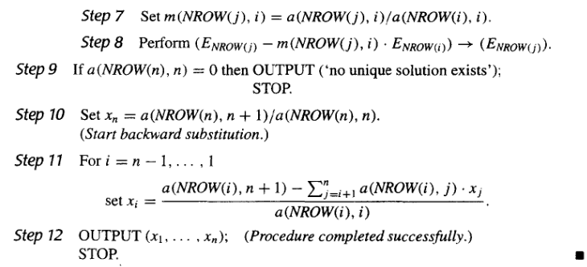

#### 比例因子选取策略 | Scaling Partial Pivoting

这个方法通过比较"每一行的元素都除以该行的最大元素的绝对值"，然后通过这个结果进行部分主元选取策略，再对原方程组部分进行行交换，从而选取主元。

这里的比例因子就是每一行的最大元素的绝对值，即

$$s_{i}=\max_{1\leq j\leq n}|a_{ij}|$$

比例因子只在初始过程中计算一次，然后在每次迭代过程中，比例因子也需要参与交换。

!!! note "伪代码与部分主元策略的差别如下："

    

    

#### 全主元选取策略 | Complete Pivoting

上个算法中，比例因子只在初始过程中计算一次。如果考虑到过程被修改，使得每次作行变换的决定时，要确定新的比例因子，那这种方法就是全主元选取策略(Complete Pivoting)。

### 6.5 矩阵分解 | Matrix Factorization

#### LU分解 | LU Factorization

假设Gauss消去法在此次解方程后没有进行行交换，Gauss消去法的第一步是对$j=2,3,\cdots,n$行进行计算：

$$(E_j-m_{j1}E_1)\rightarrow E_j,\quad m_{j1}=\frac{a_{j1}^{(1)}}{a_{11}^{(1)}}$$

那我们可以把这个过程写成矩阵的形式：

$$\begin{bmatrix}1&0&\cdots&0\\-m_{21}&1&\cdots&0\\-m_{31}&0&\cdots&0\\\vdots&\vdots&\ddots&\vdots\\-m_{n1}&0&\cdots&1\end{bmatrix}\begin{bmatrix}a_{11}^{(1)}&a_{12}^{(1)}&\cdots&a_{1n}^{(1)}\\a_{21}^{(1)}&a_{22}^{(1)}&\cdots&a_{2n}^{(1)}\\\vdots&\vdots&\ddots&\vdots\\a_{n1}^{(1)}&a_{n2}^{(1)}&\cdots&a_{nn}^{(1)}\end{bmatrix}=\begin{bmatrix}a_{11}^{(1)}&a_{12}^{(1)}&\cdots&a_{1n}^{(1)}\\0&a_{22}^{(2)}&\cdots&a_{2n}^{(2)}\\0&a_{32}^{(2)}&\cdots&a_{3n}^{(2)}\\\vdots&\vdots&\ddots&\vdots\\0&a_{n2}^{(2)}&\cdots&a_{nn}^{(2)}\end{bmatrix}$$

记最左边的矩阵为$\mathbf{M}^{(1)}$，中间的矩阵为$\mathbf{A}^{(1)}$，右边的矩阵为$\mathbf{A}^{(2)}$，则有$\mathbf{M}^{(1)}\mathbf{A}^{(1)}=\mathbf{A}^{(2)}$。

这里的$\mathbf{M}^{(1)}$称作第一Gauss交换矩阵（first Gauss transformation matrix）。

用$\mathbf{b}^{(2)}$表示$\mathbf{b^{(1)}}$经过第一次Gauss消去法后的结果，则有$\mathbf{A}^{(2)}\mathbf{x}=\mathbf{M}^{(1)}\mathbf{A}^{(1)}\mathbf{x}=\mathbf{M}^{(1)}\mathbf{b}^{(1)}=\mathbf{b}^{(2)}$。

一般的，如果$\mathbf{A}^{(k)}\mathbf{x}=\mathbf{b}^{(k)}$已经构建，则由第$k$个Gauss变换矩阵：

$$\mathbf{M}^{(k)}=
\begin{bmatrix}
1&0&\cdots&\cdots&\cdots&\cdots&\cdots&0\\
0&1&0&\cdots&\cdots&\cdots&\cdots&0\\
\vdots&\vdots&\ddots&\ddots&\cdots&\cdots&\cdots&\vdots\\
0&\cdots&\cdots&1&0&\cdots&\cdots&0\\
0&\cdots&\cdots&-m_{k+1,k}&1&\cdots&\cdots&0\\
0&\cdots&\cdots&-m_{k+2,k}&0&\ddots&\cdots&0\\
\vdots&\vdots&\vdots&\vdots&\vdots&\ddots&\ddots&\vdots\\
0&\cdots&\cdots&-m_{n,k}&0&\cdots&\cdots&1
\end{bmatrix}$$

则有$\mathbf{A}^{(k+1)}\mathbf{x}=\mathbf{M}^{(k)}\mathbf{A}^{(k)}\mathbf{x}=\mathbf{M}^{(k)}\mathbf{b}^{(k)}=\mathbf{b}^{(k+1)}$。

这个过程结束在第$\mathbf{A}^{(n)}\mathbf{x}=\mathbf{b}^{(n)}$，这里的$\mathbf{A}^{(n)}=\mathbf{M}^{(n-1)}\mathbf{A}^{(n-2)}=\cdots=\mathbf{M}^{(n-1)}\mathbf{M}^{(n-2)}\cdots\mathbf{M}^{(1)}\mathbf{A}^{(1)}$。由高斯消元法知道，$\mathbf{A}^{(n)}$是一个上三角矩阵。

此过程就形成了$\mathbf{A}=\mathbf{L}\mathbf{U}$的分解中的$\mathbf{U}$部分，而$\mathbf{L}$部分就是上文$\mathbf{A}$左侧矩阵的逆矩阵，即($\mathbf{M}^{(n-1)}\mathbf{M}^{(n-2)}\cdots\mathbf{M}^{(1)})^{-1}=\mathbf{M}^{(1)^{-1}}\mathbf{M}^{(2)^{-1}}\cdots\mathbf{M}^{(n-1)^{-1}}$。

因为$\mathbf{M}^{(k)}$的逆矩阵就是把对角线下方的元素取反，所以$\mathbf{L}$的元素为：

$$\mathbf{L}^{(k)}=(\mathbf{M}^{(k)})^{-1}=\begin{bmatrix}1&0&\cdots&\cdots&\cdots&\cdots&\cdots&0\\0&1&0&\cdots&\cdots&\cdots&\cdots&0\\\vdots&\vdots&\ddots&\ddots&\cdots&\cdots&\cdots&\vdots\\0&\cdots&\cdots&1&0&\cdots&\cdots&0\\0&\cdots&\cdots&m_{k+1,k}&1&\cdots&\cdots&0\\0&\cdots&\cdots&m_{k+2,k}&0&\ddots&\cdots&0\\\vdots&\vdots&\vdots&\vdots&\vdots&\ddots&\ddots&\vdots\\0&\cdots&\cdots&m_{n,k}&0&\cdots&\cdots&1\end{bmatrix}$$

所以

$$\mathbf{L}=\mathbf{L}^{(1)}\mathbf{L}^{(2)}\cdots\mathbf{L}^{(n-1)}=\begin{bmatrix}1&0&\cdots&\cdots&0\\m_{21}&1&0&\cdots&0\\m_{31}&m_{32}&\ddots&\ddots&\vdots\\\vdots&\vdots&\ddots&\ddots&0\\m_{n1}&m_{n2}&\cdots&m_{n,n-1}&1\end{bmatrix}$$

由此我们可以得到：

如果Gauss消去法在线性方程组$\mathbf{A}\vec{x}=\vec{b}$中没有进行行交换，则$\mathbf{A}=\mathbf{L}\mathbf{U}$，
其中

$$\mathbf{L}=\mathbf{L}^{(1)}\mathbf{L}^{(2)}\cdots\mathbf{L}^{(n-1)}=\begin{bmatrix}1&0&\cdots&\cdots&0\\m_{21}&1&0&\cdots&0\\m_{31}&m_{32}&\ddots&\ddots&\vdots\\\vdots&\vdots&\ddots&\ddots&0\\m_{n1}&m_{n2}&\cdots&m_{n,n-1}&1\end{bmatrix}$$

$$\mathbf{U}=\mathbf{A}^{(n)}=\begin{bmatrix}a_{11}^{(1)}&a_{12}^{(1)}&\cdots&a_{1n}^{(1)}\\0&a_{22}^{(2)}&\cdots&a_{2n}^{(2)}\\0&0&\cdots&a_{3n}^{(3)}\\\vdots&\vdots&\ddots&\vdots\\0&0&\cdots&a_{nn}^{(n)}\end{bmatrix}$$

如果$L$是单位下三角矩阵，则这个分解是唯一的。

用反证法。

如果$\mathbf{A}=\mathbf{L}_1\mathbf{U}_1=\mathbf{L}_2\mathbf{U}_2$，其中$\mathbf{L}_1$和$\mathbf{L}_2$是单位下三角矩阵，$\mathbf{U}_1$和$\mathbf{U}_2$是上三角矩阵。则有

$$\mathbf{U_1}\mathbf{U_2}^{-1}=\mathbf{L_1}^{-1}\mathbf{L_2}$$

因为上三角阵的逆依然是上三角阵，下三角阵同理。所以等式左右分别为上三角阵和下三角阵。又因为$\mathbf{L_1}^{-1}\mathbf{L_2}$的对角线上的元素均为$1$，所以两式相等当且仅当

$$\mathbf{U_1}\mathbf{U_2}^{-1}=\mathbf{L_1}^{-1}\mathbf{L_2}=\mathbf{I}$$

即$\mathbf{U_1}=\mathbf{U_2}$，$\mathbf{L_1}=\mathbf{L_2}$。

所以这个分解是唯一的。

##### 伪代码

先进行LU分解。

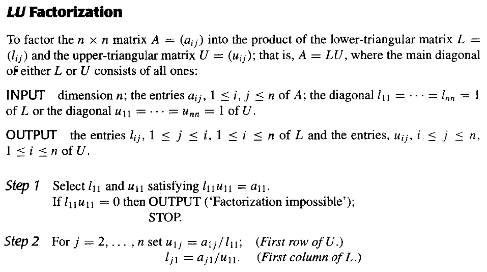

解第一个方程$\mathbf{L}\vec{y}=\vec{b}$。

解第二个方程$\mathbf{U}\vec{x}=\vec{y}$。

### 6.6 特殊类型的矩阵 | Special Types of Matrices

#### 严格对角占优矩阵 | Strictly Diagonally Dominant Matrices

如果对矩阵$\mathbf{A}$的每一行，对角线上的元素的绝对值大于该行上其他元素的绝对值之和，则称$\mathbf{A}$为严格对角占优矩阵。

定理：严格对角占优矩阵是非奇异的。而且，在此情况下，Gauss消去法可用在形如$\mathbf{A}\vec{x}=\vec{b}$的方程组中以得到唯一解，而且不需要进行或列交换，并且对于舍入误差的增长而言计算是稳定的。

#### 正定矩阵 | Positive Definite Matrices

!!! warning ""
    本书中的正定矩阵是指对称正定矩阵，与其他书中的定义不同。

一个矩阵$\mathbf{A}$是正定的，如果它是对称的，并且对于所有非零向量$\vec{x}$，都有$\vec{x}^T\mathbf{A}\vec{x}>0$。

!!! note "定理"

    如果$\mathbf{A}$是$n\times n$的正定矩阵，则

    a. $\mathbf{A}$是非奇异的。

    b. $a_{ii}>0$，$i=1,2,\cdots,n$。

    c. $\max\limits_{1\leq k,j\leq n}|a_{kj}|<\max\limits_{1\leq i\leq n}|a_{ii}|$，其中 $k\neq j$。

    d. $(a_{ij})^2<a_{ii}a_{jj}$，$i\neq j$。

重要结论：如果$\mathbf{A}$是正定的，则$\mathbf{A}$的所有主子式都是正的。

##### $\mathbf{A}=\mathbf{L}\mathbf{D}\mathbf{L}^T$分解

我们可以把$\mathbf{A}=\mathbf{L}\mathbf{U}$中的$\mathbf{U}$进一步分解为对角矩阵$\mathbf{D}$和单位上三角矩阵$\widetilde{\mathbf{U}}$，如下图所示：

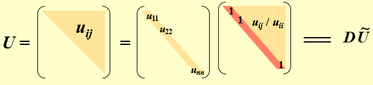

我们知道，$\mathbf{A}$是对称的，所以$\mathbf{A}=\mathbf{A}^T$，即$\mathbf{L}\mathbf{U}=\mathbf{L}\mathbf{D}\widetilde{\mathbf{U}}=\widetilde{\mathbf{U}}^T\mathbf{D}\mathbf{L}^T$，所以可以有$\mathbf{L}=\widetilde{\mathbf{U}}^T$，所以$\mathbf{A}=\mathbf{L}\mathbf{D}\mathbf{L}^T$。其中$\mathbf{L}$是一个主对角线为1的下三角矩阵，$\mathbf{D}$是对角线元素为正值的对角矩阵。

伪代码如下：

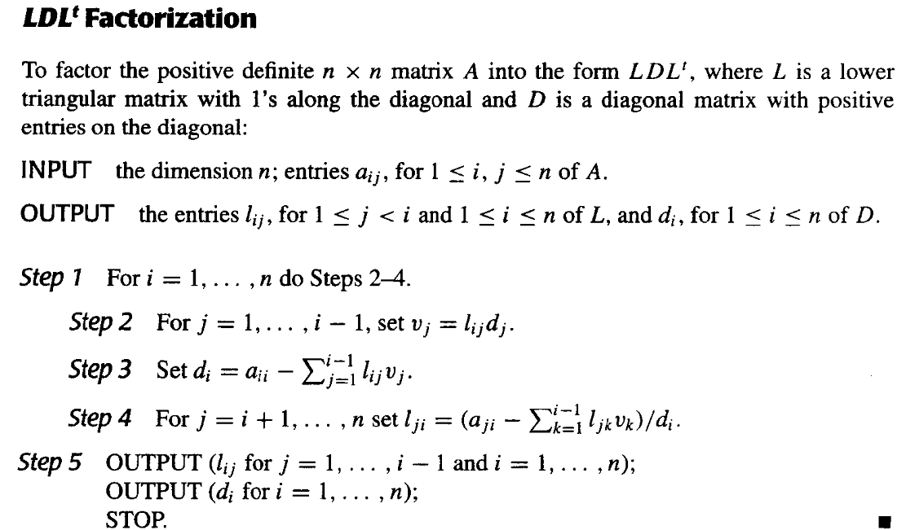

##### Cholesky分解

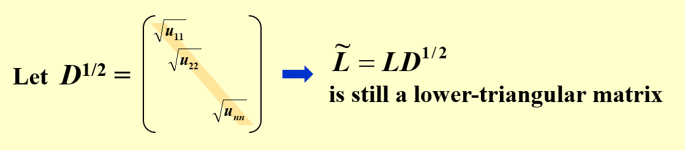

取$\widetilde{\mathbf{L}}=\mathbf{L}\mathbf{D}^{\frac{1}{2}}$，则有$\mathbf{A}=\widetilde{\mathbf{L}}\widetilde{\mathbf{L}}^T$。其中$\widetilde{\mathbf{L}}$是一个具有非零对角线元素的下三角矩阵。

伪代码如下：

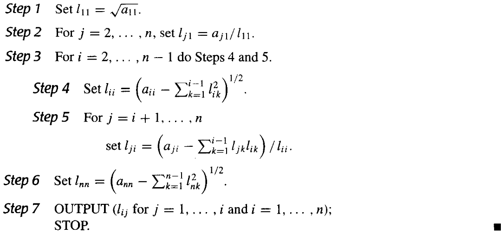

#### 三对角矩阵 | Tridiagonal Matrices

三对角矩阵是指除了对角线和对角线上方和下方的第一条对角线外，其他元素均为0的矩阵，形式如下：

$$\begin{bmatrix}a_{11}&a_{12}&0&\cdots&\cdots&0\\a_{21}&a_{22}&a_{23}&0&\cdots&0\\0&a_{32}&a_{33}&a_{34}&\cdots&0\\\vdots&\ddots&\ddots&\ddots&\ddots&\vdots\\\vdots&\cdots&\ddots&\ddots&\ddots&a_{n-1,n}\\0&\cdots&\cdots&0&a_{n,n-1}&a_{nn}\end{bmatrix}$$

定理：假设$\mathbf{A}$是三对角矩阵，对每个$i=2,3,\cdots,n-1$，有$a_{i,i-1}a_{i,i+1}\neq 0$，如果$|a_{11}|>|a_{12}|$，$|a_{ii}|>|a_{i,i-1}|+|a_{i,i+1}|$，$|a_{nn}|>|a_{n,n-1}|$，则$\mathbf{A}$是非奇异的，且在Crout分解中，$l_{ii}$的值都是非零的。

##### Crout分解

Crout分解是LU分解的一种特殊情况，我们可以求出具有形式

$$\mathbf{L}=\begin{bmatrix}l_{11}&0&0&\cdots&0\\l_{21}&l_{22}&0&\cdots&0\\0&l_{32}&l_{33}&\cdots&0\\\vdots&\ddots&\ddots&\ddots&\vdots\\0&\cdots&0&l_{n,n-1}&l_{nn}\end{bmatrix},\quad\mathbf{U}=\begin{bmatrix}1&u_{12}&0&\cdots&0\\0&1&u_{23}&\cdots&0\\0&0&1&\cdots&0\\\vdots&\ddots&\ddots&\ddots&\vdots\\0&\cdots&0&0&1\end{bmatrix}$$

的三对角矩阵$\mathbf{A}$的分解。

通过矩阵乘法，我们可以得到：

$$\begin{cases}a_{11}=l_{11}\\a_{i,i-1}=l_{i,i-1}\\a_{i,i}=l_{i,i-1}u_{i-1,i}+l_{i,i}\\a_{i,i+1}=l_{i,i}u_{i,i+1}\end{cases}$$

在求解部分，我们可以先解$\mathbf{L}\mathbf{z}=\mathbf{b}$，然后再解$\mathbf{U}\mathbf{x}=\mathbf{z}$。有伪代码：

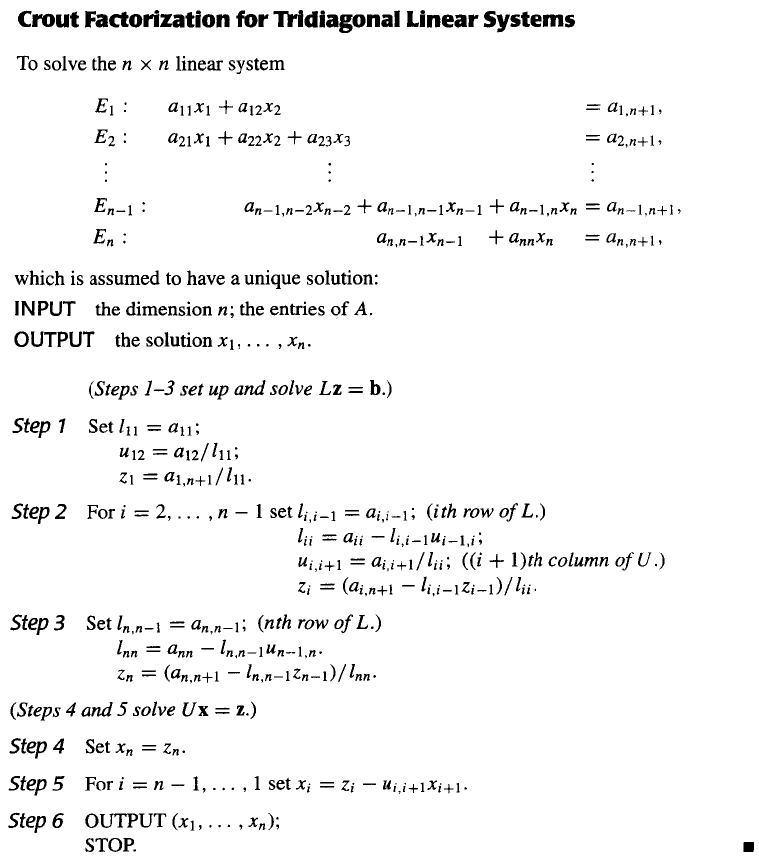

## Chapter 7 矩阵代数中的迭代方法 | Iterative Techniques in Matrix Algebra

### 7.1 向量和矩阵范数 | Norms of Vectors and Matrices

#### 向量范数

$\mathbf{R}^n$上的向量范数是一个函数$\|\cdot\|:\mathbf{R}^n\rightarrow\mathbf{R}$，满足下列条件：

1. $\|\mathbf{x}\|\geq 0$，且$\|\mathbf{x}\|=0$当且仅当$\mathbf{x}=\mathbf{0}$；($\mathbf{x}\in\mathbf{R}^n$)
2. $\|\alpha\mathbf{x}\|=|\alpha|\|\mathbf{x}\|$，其中$\alpha\in\mathbf{R},\mathbf{x}\in\mathbf{R}^n$；
3. $\|\mathbf{x}+\mathbf{y}\|\leq\|\mathbf{x}\|+\|\mathbf{y}\|$。($\mathbf{x},\mathbf{y}\in\mathbf{R}^n$)

常用的向量范数有：

1. $p$-范数：$\|\mathbf{x}\|_p=(\sum\limits_{i=1}^n|x_i|^p)^{1/p}$，其中$p\geq 1$；
2. 无穷范数：$\|\mathbf{x}\|_\infty=\max_{1\leq i\leq n}|x_i|$；

##### 向量的收敛性

$\mathbf{R}^n$上的向量序列$\{\mathbf{x}^{(k)}\}_{k=1}^\infty$按照向量范数$\|\cdot\|$收敛到向量$\mathbf{x}$，当且仅当对于任意的$\epsilon>0$，存在整数$N(\epsilon)$，使得当$k>N(\epsilon)$时，有$\|\mathbf{x}^{(k)}-\mathbf{x}\|<\epsilon$。

对于无穷范数，如果向量序列$\{\mathbf{x}^{(k)}\}_{k=1}^\infty$按照无穷范数$\|\cdot\|_\infty$收敛到向量$\mathbf{x}$，当且仅当对于任意$i=1,2,\cdots,n$，有$\lim_{k\rightarrow\infty}x_i^{(k)}=x_i$。

##### 范数的等价性

等价性定义：$\mathbf{R}^n$上的向量范数$\|\cdot\|$和$\|\cdot\|'$等价，当且仅当存在正常数$c_1,c_2$，使得对于任意的$\mathbf{x}\in\mathbf{R}^n$，有$c_1\|\mathbf{x}\|\leq\|\mathbf{x}\|'\leq c_2\|\mathbf{x}\|$。

实际上，$\mathbf{R}^n$上的所有范数都是等价的。也就是说，如果$\|\cdot\|$和$\|\cdot\|'$是$\mathbf{R}^n$上的任意两个范数，并且$\{\mathbf{x}^{(k)}\}_{k=1}^\infty$按照$\|\cdot\|$收敛到$\mathbf{x}$，那么$\{\mathbf{x}^{(k)}\}_{k=1}^\infty$也按照$\|\cdot\|'$收敛到$\mathbf{x}$。

我们接下来证明对于范数$\|\cdot\|_2$和$\|\cdot\|_\infty$，它们是等价的。

!!! note "$\|\cdot\|_2$和$\|\cdot\|_\infty$的等价性"

    设$\|\mathbf{x}\|_\infty=\max\limits_{1\leq i\leq n}|x_i|=|x_j|$。那么
    
    $$\|\mathbf{x}\|_2=\sqrt{\sum\limits_{i=1}^n|x_i|^2}\geq\sqrt{|x_j|^2}=|x_j|=\|\mathbf{x}\|_\infty$$
    
    并且
    
    $$\|\mathbf{x}\|_2=\sqrt{\sum\limits_{i=1}^n|x_i|^2}\leq\sqrt{\sum\limits_{i=1}^n|x_j|^2}=\sqrt{n}|x_j|$$
    
    所以$\|\mathbf{x}\|_\infty\leq\|\mathbf{x}\|_2\leq\sqrt{n}\|\mathbf{x}\|_\infty$，即$\|\cdot\|_2$和$\|\cdot\|_\infty$是等价的。

#### 矩阵范数

$\mathbf{R}^{n\times n}$上的矩阵范数是一个函数$\|\cdot\|:\mathbf{R}^{n\times n}\rightarrow\mathbf{R}$，满足下列条件：

1. $\|\mathbf{A}\|\geq 0$，且$\|\mathbf{A}\|=0$当且仅当$\mathbf{A}$是零矩阵；($\mathbf{A}\in\mathbf{R}^{n\times n}$)
2. $\|\alpha\mathbf{A}\|=|\alpha|\|\mathbf{A}\|$，其中$\alpha\in\mathbf{R},\mathbf{A}\in\mathbf{R}^{n\times n}$；
3. $\|\mathbf{A}+\mathbf{B}\|\leq\|\mathbf{A}\|+\|\mathbf{B}\|$。($\mathbf{A},\mathbf{B}\in\mathbf{R}^{n\times n}$)
4. $\|\mathbf{AB}\|\leq\|\mathbf{A}\|\|\mathbf{B}\|$。($\mathbf{A},\mathbf{B}\in\mathbf{R}^{n\times n}$)

矩阵$\mathbf{A}$和$\mathbf{B}$之间的距离定义为$\|\mathbf{A}-\mathbf{B}\|$。

##### Frobenius范数

$\mathbf{A}\in\mathbf{R}^{n\times n}$的Frobenius范数是$\mathbf{A}$的所有元素的平方和的平方根，即$\|\mathbf{A}\|_F=\sqrt{\sum\limits_{i=1}^n\sum\limits_{j=1}^na_{ij}^2}$。

##### 自然矩阵范数 | Natural Matrix Norm

如果$\|\cdot\|$是$\mathbf{R}^{n\times n}$上的向量范数，那么$\|\mathbf{A}\|=\max\limits_{\|\mathbf{x}\|=1}\|\mathbf{Ax}\|$是$\mathbf{R}^{n\times n}$上的矩阵范数,称为与向量范数$\|\cdot\|$相关的自然矩阵范数。

$\|\mathbf{A}\|=\max\limits_{\|\mathbf{x}\|=1}\|\mathbf{Ax}\|$也可以写成$\|\mathbf{A}\|=\max\limits_{\mathbf{x}\neq\mathbf{0}}\frac{\|\mathbf{Ax}\|}{\|\mathbf{x}\|}$。

常用的自然矩阵范数(Natural Norm)有：

1. $p$-范数：$\|\mathbf{A}\|_p=\max\limits_{\mathbf{x}\neq\mathbf{0}}\frac{\|\mathbf{Ax}\|_p}{\|\mathbf{x}\|_p}$，其中$p\geq 1$；
2. 无穷范数：$\|\mathbf{A}\|_\infty=\max\limits_{1\leq i\leq n}\sum\limits_{j=1}^n|a_{ij}|$；也就是$\mathbf{A}$的所有行和的最大值；
3. $1$-范数：$\|\mathbf{A}\|_1=\max\limits_{1\leq j\leq n}\sum\limits_{i=1}^n|a_{ij}|$；也就是$\mathbf{A}$的所有列和的最大值；
4. $2$-范数(spectral norm)：$\|\mathbf{A}\|_2=\sqrt{\lambda_{\max}(\mathbf{A}^T\mathbf{A})}$，其中$\lambda_{\max}(\mathbf{A}^T\mathbf{A})$是$\mathbf{A}^T\mathbf{A}$的最大特征值。

!!! note "推论"
    根据 $p$-范数的定义，我们可以得到：对于任意非零向量 $\mathbf{z}$ 和矩阵 $\mathbf{A}$ 和任意一个自然范数 $\|\cdot\|$，有

    $$\frac{\|\mathbf{Az}\|}{\|\mathbf{z}\|}\leq\|\mathbf{A}\|$$

    即

    $$\|\mathbf{A}\mathbf{z}\|\leq\|\mathbf{A}\|\|\mathbf{z}\|$$

### 7.2 特征值与特征向量 | Eigenvalues and Eigenvectors

#### 谱半径 | Spectral Radius

$\mathbf{A}\in\mathbf{R}^{n\times n}$的谱半径定义为$\rho(\mathbf{A})=\max\limits_{1\leq i\leq n}|\lambda_i|$，其中$\lambda_i$是$\mathbf{A}$的特征值，这里的特征值可以是复数。

!!! note ""
    $\rho(\mathbf{A})=\max\{1,|1+\sqrt{3}i|,|1-\sqrt{3}i|\}=\max\{1,2,2\}=2$。

对于任意一个自然范数$\|\cdot\|$，有$\rho(\mathbf{A})\leq\|\mathbf{A}\|$。

#### 矩阵的收敛性

当满足以下条件时，矩阵$\mathbf{A}\in\mathbf{R}^{n\times n}$是收敛的：

$$\lim_{k\rightarrow\infty}(\mathbf{A}^k)_{ij}=\mathbf{0}$$

以下命题是等价的：

1. 矩阵$\mathbf{A}\in\mathbf{R}^{n\times n}$是收敛的；
2. $\rho(\mathbf{A})<1$；
3. 对于某些自然范数$\|\cdot\|$，有$\lim\limits_{k\rightarrow\infty}\|\mathbf{A}^k\|=0$。
4. 对于任意的自然范数$\|\cdot\|$，有$\lim\limits_{k\rightarrow\infty}\|\mathbf{A}^k\|=0$。
5. 对于每一个$\mathbf{x}\in\mathbf{R}^n$，有$\lim\limits_{k\rightarrow\infty}\mathbf{A}^k\mathbf{x}=\mathbf{0}$。

### 7.3 求解线性方程组的迭代法 | Iterative Techniques for Solving Linear Systems

#### Jacobi迭代法

记矩阵$\mathbf{A}\in\mathbf{R}^{n\times n}$的下三角部分为$-\mathbf{L}$，上三角部分为$-\mathbf{U}$，对角线部分为$\mathbf{D}$，即$\mathbf{A}=\mathbf{D}-\mathbf{L}-\mathbf{U}$。

所以方程组$\mathbf{Ax}=\mathbf{b}$可以写成$\mathbf{Dx}=(\mathbf{L}+\mathbf{U})\mathbf{x}+\mathbf{b}$。

即$\mathbf{x}=\mathbf{D}^{-1}(\mathbf{L}+\mathbf{U})\mathbf{x}+\mathbf{D}^{-1}\mathbf{b}$。

引入符号$\mathbf{T}_j=\mathbf{D}^{-1}(\mathbf{L}+\mathbf{U})$，$\mathbf{c}_j=\mathbf{D}^{-1}\mathbf{b}$，则$\mathbf{x}=\mathbf{T}_j\mathbf{x}+\mathbf{c}_j$。

Jacobi迭代法的迭代格式为：

$$\mathbf{x}^{(k+1)}=\mathbf{T}_j\mathbf{x}^{(k)}+\mathbf{c}_j$$

其伪代码为：

#### Gauss-Seidel迭代法

我们可以改进Jacobi迭代法，使得每次迭代时，都使用已经算出来的$\mathbf{x}^{(k)}$的元素来计算$\mathbf{x}^{(k)}$之后的元素。如下图所示：

也就是说，可以使用：

$$ x_i^{(k)}=\frac{-\sum\limits_{j=1}^{i-1}a_{ij}x_j^{(k)}-\sum\limits_{j=i+1}^na_{ij}x_j^{(k-1)}+b_i}{a_{ii}} $$

来计算$x_i^{(k)}$。

结合之前$\mathbf{D}$，$\mathbf{L}$，$\mathbf{U}$的定义，我们可以得到：

$$(\mathbf{D}-\mathbf{L})\mathbf{x}^{(k)}=\mathbf{U}\mathbf{x}^{(k-1)}+\mathbf{b}$$

即：

$$\mathbf{x}^{(k)}=(\mathbf{D}-\mathbf{L})^{-1}\mathbf{U}\mathbf{x}^{(k-1)}+(\mathbf{D}-\mathbf{L})^{-1}\mathbf{b}$$

引入符号$\mathbf{T}_{g}=(\mathbf{D}-\mathbf{L})^{-1}\mathbf{U}$，$\mathbf{c}_{g}=(\mathbf{D}-\mathbf{L})^{-1}\mathbf{b}$，则$\mathbf{x}=\mathbf{T}_{g}\mathbf{x}^{(k-1)}+\mathbf{c}_{g}$。

Gauss-Seidel迭代法的迭代格式为：

$$\mathbf{x}^{(k+1)}=\mathbf{T}_{g}\mathbf{x}^{(k)}+\mathbf{c}_{g}$$

其伪代码为：

#### 两种迭代法的收敛性

对于任意一个$\mathbf{x}^{(0)}\in\mathbf{R}^n$，由

$$\mathbf{x}^{(k+1)}=\mathbf{Tx}^{(k)}+\mathbf{c}$$

定义的序列 $\{\mathbf{x}^{(k)}\}_{k=0}^\infty$ 收敛到$\mathbf{x}=\mathbf{Tx}+\mathbf{c}$的唯一解，当且仅当$\rho(\mathbf{T})<1$。

!!! note "证明"
    $\Leftarrow$：

    设$\rho(\mathbf{T})<1$，那么

    $$\begin{aligned}
    \mathbf{x}^{(k)}=&\mathbf{Tx}^{(k-1)}+\mathbf{c}\\
    =&\mathbf{T}(\mathbf{Tx}^{(k-2)}+\mathbf{c})+\mathbf{c}\\
    =&\mathbf{T}^2\mathbf{x}^{(k-2)}+(\mathbf{T}+\mathbf{I})\mathbf{c}\\
    \vdots&\\
    =&\mathbf{T}^k\mathbf{x}^{(0)}+(\mathbf{T}^{k-1}+\mathbf{T}^{k-2}+\cdots+\mathbf{T}+\mathbf{I})\mathbf{c}\\
    \end{aligned}$$

    由于$\rho(\mathbf{T})<1$，所以矩阵$\mathbf{T}$是收敛的，且$\lim\limits_{k\rightarrow\infty}\mathbf{T}^k\mathbf{x}^{(0)}=\mathbf{0}$
    
    由于$\lim\limits_{k\rightarrow\infty}(\mathbf{T}^{k-1}+\mathbf{T}^{k-2}+\cdots+\mathbf{T}+\mathbf{I})\mathbf{c}=(\mathbf{I}-\mathbf{T})^{-1}\mathbf{c}$，所以$\lim\limits_{k\rightarrow\infty}\mathbf{x}^{(k)}=(\mathbf{I}-\mathbf{T})^{-1}\mathbf{c}=\mathbf{x}$，这里的$\mathbf{x}$就是$\mathbf{x}=\mathbf{Tx}+\mathbf{c}$的唯一解。

    $\Rightarrow$：

    设$\{\mathbf{x}^{(k)}\}_{k=0}^\infty$收敛到$\mathbf{x}=\mathbf{Tx}+\mathbf{c}$的唯一解，取任意一个向量$\mathbf{y}\in\mathbf{R}^n$，定义$\mathbf{x}^{(0)}=\mathbf{x}-\mathbf{y}$，那么
    
    $$\mathbf{x}-\mathbf{x}^{(k)}=(\mathbf{Tx}+\mathbf{c})-(\mathbf{Tx}^{(k-1)}+\mathbf{c})=\mathbf{T}(\mathbf{x}-\mathbf{x}^{(k-1)})$$

    所以

    $$\mathbf{x}-\mathbf{x}^{(k)}=\mathbf{T}^k(\mathbf{x}-\mathbf{x}^{(0)})=\mathbf{T}^k\mathbf{y}$$

    因此

    $$\lim_{k\rightarrow\infty}\mathbf{T}^k\mathbf{y}=\lim_{k\rightarrow\infty}(\mathbf{x}-\mathbf{x}^{(k)})=\mathbf{0}$$

    由于$\mathbf{y}$是任意的，根据矩阵的收敛性，$\rho(\mathbf{T})<1$。

##### 误差界 | Error Bounds for Iterative Methods

如果对任意自然矩阵范数$\|\mathbf{T}\|<1$，$\mathbf{c}$是给定的向量，那么由$\mathbf{x}^{(k+1)}=\mathbf{Tx}^{(k)}+\mathbf{c}$定义的序列$\{\mathbf{x}^{(k)}\}_{k=0}^\infty$收敛到$\mathbf{x}=\mathbf{Tx}+\mathbf{c}$的唯一解，且有误差界：

1. $\|\mathbf{x}-\mathbf{x}^{(k)}\|\leq\|\mathbf{T}\|^k\|\mathbf{x}^{(0)}-\mathbf{x}\|$；
2. $\|\mathbf{x}-\mathbf{x}^{(k)}\|\leq\frac{\|\mathbf{T}\|^k}{1-\|\mathbf{T}\|}\|\mathbf{x}^{(1)}-\mathbf{x}^{(0)}\|$；

通过(2)式，我们可以根据我们要的精度算出迭代次数$k$

!!! note "证明(1)式"

    $$
    \mathbf{x}-\mathbf{x}^{(k)}=(\mathbf{Tx}+\mathbf{c})-(\mathbf{Tx}^{(k-1)}+\mathbf{c})=\mathbf{T}(\mathbf{x}-\mathbf{x}^{(k-1)})
    $$

    所以

    $$
    \begin{aligned}
    \|\mathbf{x}-\mathbf{x}^{(k)}\|&=\|\mathbf{T}(\mathbf{x}-\mathbf{x}^{(k-1)})\|\\
    &\leq\|\mathbf{T}\|\|\mathbf{x}-\mathbf{x}^{(k-1)}\|\\
    &\leq\|\mathbf{T}\|^k\|\mathbf{x}-\mathbf{x}^{(0)}\|
    \end{aligned}
    $$

    !!! note ""
        $\|\mathbf{x}^{(k)}-\mathbf{x}\|\approx\rho(T)^k\|\mathbf{x}^{(0)}-\mathbf{x}\|$

!!! note "证明(2)式"

    $$\begin{aligned}
    \|\mathbf{x}^{(k+1)}-\mathbf{x}^{(k)}\|
    &=\|\mathbf{T}(\mathbf{x}^{(k)}-\mathbf{x}^{(k-1)})\|\\
    &\leq\|\mathbf{T}\|\|\mathbf{x}^{(k)}-\mathbf{x}^{(k-1)}\|\\
    &\leq\|\mathbf{T}\|^k \|\mathbf{x}^{(1)}-\mathbf{x}^{(0)}\|
    \end{aligned}$$

    所以对于任意的$m\geq n$，有

    $$\begin{aligned}
    \|\mathbf{x}^{(m)}-\mathbf{x}^{(n)}\|
    &=\|\mathbf{x}^{(m)}-\mathbf{x}^{(m-1)}+\mathbf{x}^{(m-1)}-\mathbf{x}^{(m-2)}+\cdots+\mathbf{x}^{(n+1)}-\mathbf{x}^{(n)}\|\\
    &\leq\|\mathbf{x}^{(m)}-\mathbf{x}^{(m-1)}\|+\|\mathbf{x}^{(m-1)}-\mathbf{x}^{(m-2)}\|+\cdots+\|\mathbf{x}^{(n+1)}-\mathbf{x}^{(n)}\|\\
    &\leq\|\mathbf{T}\|^{m-1}\|\mathbf{x}^{(1)}-\mathbf{x}^{(0)}\|+\|\mathbf{T}\|^{m-2}\|\mathbf{x}^{(1)}-\mathbf{x}^{(0)}\|+\cdots+\|\mathbf{T}\|^{n}\|\mathbf{x}^{(1)}-\mathbf{x}^{(0)}\|\\
    &=\|\mathbf{x}^{(1)}-\mathbf{x}^{(0)}\|\sum\limits_{k=n}^{m-1}\|\mathbf{T}\|^k\\
    \end{aligned}$$

    当$m\rightarrow\infty$时，$\sum\limits_{k=n}^{m-1}\|\mathbf{T}\|^k=\frac{\|\mathbf{T}\|^n}{1-\|\mathbf{T}\|}$，所以

    $$\|\mathbf{x}-\mathbf{x}^{(n)}\|\leq\frac{\|\mathbf{T}\|^n}{1-\|\mathbf{T}\|}\|\mathbf{x}^{(1)}-\mathbf{x}^{(0)}\|$$

##### 对于严格对角占优矩阵

如果$\mathbf{A}$是严格对角占优的，那么Jacobi迭代法和Gauss-Seidel迭代法都是收敛的。

!!! note ""
    证明其不存在大于1的特征值

#### 松弛法 | Relaxation Methods

假设$\tilde{\mathbf{x}}\in R^n$是$\mathbf{Ax}=\mathbf{b}$的一个近似解，那么相对于该方程组的剩余向量（residual vector）为$\mathbf{r}=\mathbf{b}-\mathbf{A}\tilde{\mathbf{x}}$。

我们从剩余向量的视角来看Gauss-Seidel迭代法。

$$
\begin{aligned}
x_i^{(k)}&=\frac{-\sum\limits_{j=1}^{i-1}a_{ij}x_j^{(k)}-\sum\limits_{j=i+1}^na_{ij}x_j^{(k-1)}+b_i}{a_{ii}} \\
&=x_i^{(k-1)}+\frac{1}{a_{ii}}(b_i-\sum\limits_{j=1}^{i-1}a_{ij}x_j^{(k)}-\sum\limits_{j=i}^na_{ij}x_j^{(k-1)}) \\
&=x_i^{(k-1)}+\frac{r_i^{(k)}}{a_{ii}}
\end{aligned}
$$

我们可以添加一个参数$\omega$，使得

$$x_i^{(k)}=x_i^{(k-1)}+\omega\frac{r_i^{(k)}}{a_{ii}}$$

这就是松弛法的基本思想，可以用来减少剩余向量的范数和加速收敛。

根据$\omega$的取值，松弛法可以分为：

1. $\omega<1$：欠松弛法(Under-Relaxation methods)；可使由Gauss-Seidel方法不能收敛的方程组收敛；
2. $\omega=1$：退化为Gauss-Seidel迭代法；
3. $\omega>1$：超松弛法(Over-Relaxation methods)；可使收敛速度加快。

这些方法缩写为SOR方法（Successive Over-Relaxation）。

##### SOR方法的矩阵形式

我们尝试把SOR方法的迭代格式写成矩阵形式：

$$
\begin{aligned}
x_i^{(k)}&=x_i^{(k-1)}+\omega\frac{r_i^{(k)}}{a_{ii}}\\
&=x_i^{(k-1)}+\frac{\omega}{a_{ii}}(b_i-\sum\limits_{j=1}^{i-1}a_{ij}x_j^{(k)}-\sum\limits_{j=i}^na_{ij}x_j^{(k-1)}) \\
&=(1-\omega)x_i^{(k-1)}+\frac{\omega}{a_{ii}}(b_i-\sum\limits_{j=1}^{i-1}a_{ij}x_j^{(k)}-\sum\limits_{j=i+1}^na_{ij}x_j^{(k-1)}) \\
\end{aligned}
$$

所以

$$
\begin{aligned}
\mathbf{x}^{(k)}&=(1-\omega)\mathbf{x}^{(k-1)}+\omega\mathbf{D}^{-1}(\mathbf{b}+\mathbf{L}\mathbf{x}^{(k)}+\mathbf{U}\mathbf{x}^{(k-1)}) \\
(\mathbf{I}-\omega\mathbf{D}^{-1}\mathbf{L})\mathbf{x}^{(k)}&=((1-\omega)\mathbf{I}+\omega\mathbf{D}^{-1}\mathbf{U})\mathbf{x}^{(k-1)}+\omega\mathbf{D}^{-1}\mathbf{b} \\
\mathbf{x}^{(k)}&=(\mathbf{I}-\omega\mathbf{D}^{-1}\mathbf{L})^{-1}((1-\omega)\mathbf{I}+\omega\mathbf{D}^{-1}\mathbf{U})\mathbf{x}^{(k-1)}+(\mathbf{I}-\omega\mathbf{D}^{-1}\mathbf{L})^{-1}\omega\mathbf{D}^{-1}\mathbf{b} \\
\mathbf{x}^{(k)}&=(\mathbf{D}-\omega\mathbf{L})^{-1}((1-\omega)\mathbf{D}+\omega\mathbf{U})\mathbf{x}^{(k-1)}+\omega(\mathbf{D}-\omega\mathbf{L})^{-1}\mathbf{b} \\
\end{aligned}
$$

记$\mathbf{T}_{\omega}=(\mathbf{D}-\omega\mathbf{L})^{-1}((1-\omega)\mathbf{D}+\omega\mathbf{U})$，$\mathbf{c}_{\omega}=\omega(\mathbf{D}-\omega\mathbf{L})^{-1}\mathbf{b}$，则SOR方法的迭代格式为：

$$\mathbf{x}^{(k)}=\mathbf{T}_{\omega}\mathbf{x}^{(k-1)}+\mathbf{c}_{\omega}$$

##### Kahan定理

如果$a_{ii}\neq 0(i=1,2,\cdots,n)$，那么$\rho(\mathbf{T}_{\omega})\geq|\omega-1|$。这表明，SOR方法当且仅当$\omega\in(0,2)$时收敛。

##### Ostrowski-Reich定理

如果$\mathbf{A}$是一个正定矩阵，并且$\omega\in(0,2)$，那么SOR方法对于任意的初始近似向量$\mathbf{x}^{(0)}\in\mathbf{R}^n$都收敛。

##### $\omega$的最佳选择

如果$\mathbf{A}$是一个正定的三对角矩阵，那么$\rho(\mathbf{T}_{g})=[\rho(\mathbf{T}_{j})]^2<1$，并且SOR方法的最佳$\omega$选择是：

$$\omega_{opt}=\frac{2}{1+\sqrt{1-[\rho(\mathbf{T}_{j})]^2}}$$

由此选择的$\omega$，有$\rho(\mathbf{T}_{\omega})=\omega-1$。

##### SOR伪代码

### 7.4 误差界与迭代改进 | Error Bounds and Iterative Refinement

#### 误差界

对于线性方程组 $\mathbf{Ax}=\mathbf{b}$ ，$\mathbf{A}$是非奇异的。如果 $\mathbf{A}$ 和 $\mathbf{b}$ 存在误差，那么解 $\mathbf{x}$ 也会存在误差。

##### $\mathbf{A}$ 精确，$\mathbf{b}$ 有误差

即 $\mathbf{Ax}=\mathbf{b}$ 变成 $\mathbf{A(x+\delta x)}=\mathbf{b}+\delta\mathbf{b}$ 。所以有：

$$
\begin{aligned}
\mathbf{A}\delta\mathbf{x}&=\delta\mathbf{b}\\
\Rightarrow \delta\mathbf{x}&=\mathbf{A}^{-1}\delta\mathbf{b}\\
\end{aligned}
$$

根据推论

!!! note ""
    对于任意向量 $\mathbf{z}\neq\mathbf{0}$，矩阵 $\mathbf{A}$ 和任意一个自然范数 $\|\cdot\|$，有

    $$\frac{\|\mathbf{Az}\|}{\|\mathbf{z}\|}\leq\|\mathbf{A}\|$$

我们有：

$$
\| \delta\mathbf{x} \|\leq\|\mathbf{A}^{-1}\|\|\delta\mathbf{b}\|\\
$$

$$
\mathbf{b}=\mathbf{Ax}\Rightarrow\|\mathbf{b}\|=\|\mathbf{Ax}\|\leq\|\mathbf{A}\|\|\mathbf{x}\|\\
$$

所以

$$
\frac{\|\delta\mathbf{x}\|}{\|\mathbf{x}\|}\leq\|\mathbf{A}\|\|\mathbf{A}^{-1}\|\frac{\|\delta\mathbf{b}\|}{\|\mathbf{b}\|}
$$

我们记非奇异矩阵 $A$ 相对于范数 $\|\cdot\|$ 的条件数为：

$$
K(\mathbf{A})=\|\mathbf{A}\|\|\mathbf{A}^{-1}\|
$$

当 $K(\mathbf{A})$ 很大时，$\mathbf{A}$ 是病态的，当 $K(\mathbf{A})$ 接近于 $1$ 时，$\mathbf{A}$ 是良态的。

##### $\mathbf{A}$ 有误差，$\mathbf{b}$ 精确

即 $\mathbf{Ax}=\mathbf{b}$ 变成 $\mathbf{(A+\delta A)(x+\delta x)}=\mathbf{b}$ 。所以有：

$$(\mathbf{A}+\delta\mathbf{A})\delta\mathbf{x}+\mathbf{x}\delta\mathbf{A}=0$$

这里的 $\delta\mathbf{A}$ 往往是一个小量。

!!! note "证明$\|\mathbf{(I+A^{-1}\delta A)^{-1}}\|\leq\frac{1}{1-\|\mathbf{A^{-1}\delta A}\|}$"

    !!! note "推论"

        对于矩阵 $\mathbf{F}$，若$\|\mathbf{F}\|<1$，则$\mathbf{I}\pm\mathbf{F}$是非奇异的，且

        $$\left\|\left(\mathbf{I}\pm \mathbf{F}\right)^{-1}\right\|\leq\frac1{1-\left\|\mathbf{F}\right\|}$$

        !!! note "下面给出 $\mathbf{I} - \mathbf{F}$情况的证明"
        
            !!! warning ""
                因为 $\|\mathbf{-F}\|=\|\mathbf{F}\|<1$，所以我们将$\mathbf{-F}$替换 $\mathbf{F}$ ，就可以得到 $\mathbf{I+F}$情况的证明

            

    !!! note "推论"

        $$\|\mathbf{A}^{-1}\|_{p}=\frac{1}{\min\frac{\left|\left|\mathbf{A}\mathbf{x}\right|\right|p}{\left|\left|\mathbf{x}\right|\right|p}}$$

        !!! note "证明"

            $$\begin{aligned}
            &\|\mathbf{A}^{-1}\|_{p}\\
            =&\max_{\mathbf{x}\neq0}\frac{\|\mathbf{A}^{-1}\mathbf{x}\|_{p}}{\|\mathbf{x}\|_{p}})\\
            =&\max_{\mathbf{A}\mathbf{x}\neq0}\frac{\| \mathbf{A}^{-1}\mathbf{A}\mathbf{x}\|p}{\parallel \mathbf{A}^{-1}\mathbf{x}\|p} \\
            =&\max_{\mathbf{x}\neq0}\frac{\|\mathbf{x}\|p}{\|\mathbf{A}\mathbf{x}\|p} \\
            =&\max_{\mathbf{x}\neq0}\frac{1}{\frac{\|\mathbf{A}\mathbf{x}\|p}{\|\mathbf{x}\|p}} \\
            =&\frac{1}{\min\frac{\left|\left|\mathbf{A}\mathbf{x}\right|\right|p}{\left|\left|\mathbf{x}\right|\right|p}}
            \end{aligned}$$

    我们有

    $$\mathbf{(A+\delta A)}=\mathbf{A}\mathbf{(I+A^{-1}\delta A)}$$

    而

    $$\|\mathbf{A^{-1}\delta A}\|
    \leq
    \|\mathbf{A^{-1}}\|\|\mathbf{\delta A}\|
    =\frac{\|\mathbf{\delta A}\|}{\min\frac{\left|\left|\mathbf{A}\mathbf{x_1}\right|\right|p}{\left|\left|\mathbf{x_1}\right|\right|p}}
    $$

    因为$\|\delta\mathbf{A}\|$相对于$\|\mathbf{A}\|$很小，所以往往有$\|\mathbf{A^{-1}\delta A}\|\leq 1$，所以$\mathbf{I+A^{-1}\delta A}$是非奇异的，且

    $$\|\mathbf{(I+A^{-1}\delta A)^{-1}}\|\leq\frac{1}{1-\|\mathbf{A^{-1}\delta A}\|}$$

所以在$\|\mathbf{A^{-1}\delta A}\|\leq 1$的情况下（我们不妨将其放缩为$\|\mathbf{\delta A}\|\leq\|\frac{\mathbf{1}}{A^{-1}}\|$），有：

$$\|\mathbf{(I+A^{-1}\delta A)^{-1}}\|\leq\frac{1}{1-\|\mathbf{A^{-1}\delta A}\|}$$

所以

$$
\begin{aligned}
(\mathbf{A}+\delta\mathbf{A})\delta\mathbf{x}+\mathbf{x}\delta\mathbf{A}&=0\\
\mathbf{A}(I+\mathbf{A}^{-1}\delta\mathbf{A})\delta\mathbf{x}&=-\mathbf{x}\delta\mathbf{A}\\
 \delta\mathbf{x} &= -(I+\mathbf{A}^{-1}\delta\mathbf{A})^{-1}\mathbf{A}^{-1}\mathbf{x}\delta\mathbf{A}\\
 \|\delta\mathbf{x}\| &\leq\|\mathbf{(I+A^{-1}\delta A)^{-1}}\|\|\mathbf{A}^{-1}\|\|\mathbf{x}\|\|\delta\mathbf{A}\|\\
&\leq \frac{\|\mathbf{A}^{-1}\|\|\mathbf{x}\|\|\delta\mathbf{A}\|}{1-\|\mathbf{A}^{-1}\|\|\delta\mathbf{A}\|}\\
\end{aligned}
$$

所以：

$$
\frac{\|\delta\mathbf{x}\|}{\|\mathbf{x}\|}\leq\frac{\|\mathbf{A}^{-1}\|\|\delta\mathbf{A}\|}{1-\|\mathbf{A}^{-1}\|\|\delta\mathbf{A}\|}=\frac{K(\mathbf{A})\frac{\|\delta\mathbf{A}\|}{\|\mathbf{A}\|}}{1-K(\mathbf{A})\frac{\|\delta\mathbf{A}\|}{\|\mathbf{A}\|}}
$$

##### $\mathbf{A}$，$\mathbf{b}$ 都有误差

即 $\mathbf{Ax}=\mathbf{b}$ 变成 $\mathbf{(A+\delta A)(x+\delta x)}=\mathbf{b}+\delta\mathbf{b}$ 。所以有：

$$
\begin{aligned}
(\mathbf{A}+\delta\mathbf{A})\delta\mathbf{x}+\mathbf{x}\delta\mathbf{A}&=\delta\mathbf{b}\\
\end{aligned}
$$

所以，当$\|\delta\mathbf{A}\|<\frac{1}{\|\mathbf{A}^{-1}\|}$时，有：

$$
\begin{aligned}
\delta\mathbf{x}&=(I+\mathbf{A}^{-1}\delta\mathbf{A})^{-1}\mathbf{A}^{-1}(\delta\mathbf{b}-\mathbf{x}\delta\mathbf{A})\\
\end{aligned}
$$

所以

$$
\begin{aligned}
\|\delta\mathbf{x}\|&\leq \frac{\|\mathbf{A}^{-1}\|}{1-\|\mathbf{A}^{-1}\|\|\delta\mathbf{A}\|}\|\delta\mathbf{b}-\mathbf{x}\delta\mathbf{A}\|\\
&\leq \frac{\|\mathbf{A}^{-1}\|}{1-\|\mathbf{A}^{-1}\|\|\delta\mathbf{A}\|}(\|\delta\mathbf{b}\|+\|\mathbf{x}\|\|\delta\mathbf{A}\|)\\
&\leq \frac{K(\mathbf{A})}{1-K(\mathbf{A})\frac{\|\delta\mathbf{A}\|}{\|\mathbf{A}\|}}(\frac{\|\delta\mathbf{b}\|}{\|\mathbf{A}\|}+\frac{\|\mathbf{x}\|\|\delta\mathbf{A}\|}{\|\mathbf{A}\|})\\
&\leq \frac{K(\mathbf{A})}{1-K(\mathbf{A})\frac{\|\delta\mathbf{A}\|}{\|\mathbf{A}\|}}(\frac{\|\delta\mathbf{b}\|}{\|\mathbf{A}\|\|\mathbf{x}\|}+\frac{\|\delta\mathbf{A}\|}{\|\mathbf{A}\|})\|\mathbf{x}\|\\
&\leq \frac{K(\mathbf{A})}{1-K(\mathbf{A})\frac{\|\delta\mathbf{A}\|}{\|\mathbf{A}\|}}(\frac{\|\delta\mathbf{b}\|}{\|\mathbf{A}\mathbf{x}\|}+\frac{\|\delta\mathbf{A}\|}{\|\mathbf{A}\|})\|\mathbf{x}\|\\
&\leq \frac{K(\mathbf{A})}{1-K(\mathbf{A})\frac{\|\delta\mathbf{A}\|}{\|\mathbf{A}\|}}(\frac{\|\delta\mathbf{b}\|}{\|\mathbf{b}\|}+\frac{\|\delta\mathbf{A}\|}{\|\mathbf{A}\|})\|\mathbf{x}\|\\
\end{aligned}
$$

因此，当$\|\delta\mathbf{A}\|<\frac{1}{\|\mathbf{A}^{-1}\|}$时，有：

$$
\frac{\|\delta\mathbf{x}\|}{\|\mathbf{x}\|}\leq\frac{K(\mathbf{A})}{1-K(\mathbf{A})\frac{\|\delta\mathbf{A}\|}{\|\mathbf{A}\|}}(\frac{\|\delta\mathbf{b}\|}{\|\mathbf{b}\|}+\frac{\|\delta\mathbf{A}\|}{\|\mathbf{A}\|})
$$

##### $K(\mathbf{A})$ 的性质

我们记非奇异矩阵 $A$ 相对于范数 $\|\cdot\|$ 的条件数为：

$$
K(\mathbf{A})=\|\mathbf{A}\|\|\mathbf{A}^{-1}\|
$$

当 $K(\mathbf{A})$ 很大时，$\mathbf{A}$ 是病态的，当 $K(\mathbf{A})$ 接近于 $1$ 时，$\mathbf{A}$ 是良态的。

1. $K(\mathbf{A})_p\geq 1$ 对所有的自然范数 $\|\cdot\|_p$ 成立；
2. 如果 $\mathbf{A}$ 是对称的，那么 $K(\mathbf{A})_2=\frac{|\lambda_{max}|}{|\lambda_{min}|}$，其中 $\lambda_{max}$ 和 $\lambda_{min}$ 分别是 $\mathbf{A}$ 的最大和最小特征值；
3. $K(a\mathbf{A})=K(\mathbf{A})$，其中 $a$ 是一个非零常数；
4. $K(\mathbf{A})_2=1$ 当且仅当 $\mathbf{A}$ 是正交矩阵($\mathbf{A}^T\mathbf{A}=\mathbf{I}$)；
5. $K(\mathbf{RA})_2 =K(\mathbf{AR})_2 = K(\mathbf{A})_2$，其中 $\mathbf{R}$ 是一个正交矩阵；

#### 题目例子

!!! note "(1)"

    

!!! note "(2)"

    

## Chapter 8 逼近论 | Approximation Theory

!!! note ""
    逼近和插值的区别在于，插值是要求通过所有的数据点，而逼近没有这个限制，而是要求逼近的函数和原函数的误差尽可能小——尽可能接近每个点。

### 8.1 Discrete Least Squares Approximation | 离散最小二乘逼近

#### 误差表达

设 $p(x)$ 是逼近函数，$y_{i}$ 是给定的 $n$ 个数据点，那么逼近误差的三种表达方式如下：

##### Minimax problem

$$E_\infty(p) = \max \{|y_i - f(x)|\}$$

这用初等技术是解决不了的

##### Absolute deviation

$$E_1(p) = \sum\limits_{i=1}^{n} |y_i - f(x)|$$

困难在于绝对值函数在零点不可微，可能无法求解多元函数的最小值。

##### Least squares

$$E_2(p) = \sum\limits_{i=1}^{n} (y_i - f(x))^2$$

此即为**最小二乘**的误差表达，也是最常用的逼近方法。

我们的目标是找到一个 $p(x)$，使得 $E_2(p)$ 最小。

#### 离散最小二乘逼近

定义： $P_n(x)$ 是 $m$ 个数据点的**离散最小二乘逼近**，如果 $P_n(x)$ 是 $n$ 次多项式，且满足

$$
p=\arg \min _{p \in \mathbb{P}_{n}} \sum\limits_{i=1}^{m}\left(y_{i}-p\left(x_{i}\right)\right)^{2}$$

其中 $\mathbb{P}_{n}$ 是 $n$ 次多项式的集合，$n$ 应远远小于 $m$，如果 $n=m-1$，其即为 lagrange 插值。

##### 离散最小二乘逼近的解

设 $P_n(x) = a_0 + a_1 x + \cdots + a_n x^n= \sum\limits_{i=0}^{n} a_i x^i$。

$$
\begin{aligned}
E_2&=\sum\limits_{i=1}^{m}\left(y_{i}-P_n\left(x_{i}\right)\right)^{2} \\
\end{aligned}
$$

为了使 $E_2$ 最小，则其必要条件是

$$
\frac{\partial E_{2}}{\partial a_{k}}=0, \quad k=0,1, \cdots, n
$$

即

$$
\begin{aligned}
\frac{\partial E_{2}}{\partial a_{k}}&=2 \sum\limits_{i=1}^{m}\left(P_{n}\left(x_{i}\right)-y_{i}\right) \frac{\partial P_{n}\left(x_{i}\right)}{\partial a_{k}}\\
&=2 \sum\limits_{i=1}^{m}\left(\sum _{j=0}^{n} a_j x_i^j - y_i\right) x_i^k\\
&=2 \left(\sum\limits_{j=0}^{n} (a_j \sum\limits_{i=1}^{m} x_i^{j+k}) -  \sum\limits_{i=1}^{m} y_i x_i^k \right)= 0
\end{aligned}
$$

即

$$
\sum\limits_{j=0}^{n} (a_{j} \sum\limits_{i=1}^{m} x_{i}^{j+k})=\sum\limits_{i=1}^{m} y_{i} x_{i}^{k}, \quad k=0,1, \cdots, n
$$

也就是

$$
\begin{bmatrix}
\sum\limits_{i=1}^{m} x_{i}^{0} & \sum\limits_{i=1}^{m} x_{i}^{1} & \cdots & \sum\limits_{i=1}^{m} x_{i}^{n} \\
\sum\limits_{i=1}^{m} x_{i}^{1} & \sum\limits_{i=1}^{m} x_{i}^{2} & \cdots & \sum\limits_{i=1}^{m} x_{i}^{n+1} \\
\vdots & \vdots & \ddots & \vdots \\
\sum\limits_{i=1}^{m} x_{i}^{n} & \sum\limits_{i=1}^{m} x_{i}^{n+1} & \cdots & \sum\limits_{i=1}^{m} x_{i}^{2 n}
\end{bmatrix}
\begin{bmatrix}
a_0\\
a_1\\
\vdots\\
a_n
\end{bmatrix}=
\begin{bmatrix}
\sum\limits_{i=1}^{m} y_{i} x_{i}^{0}\\
\sum\limits_{i=1}^{m} y_{i} x_{i}^{1}\\
\vdots\\
\sum\limits_{i=1}^{m} y_{i} x_{i}^{n}
\end{bmatrix}
$$

###### $P(x)$ 线性

即 $n=1$ 。此时，$P_1(x) = a_0 + a_1 x$，有

$$
\begin{bmatrix}
m & \sum\limits_{i=1}^{m} x_{i} \\
\sum\limits_{i=1}^{m} x_{i} & \sum\limits_{i=1}^{m} x_{i}^{2}
\end{bmatrix}
\begin{bmatrix}
a_0\\
a_1
\end{bmatrix}=
\begin{bmatrix}
\sum\limits_{i=1}^{m} y_{i}\\
\sum\limits_{i=1}^{m} y_{i} x_{i}
\end{bmatrix}
$$

所以

$$
\begin{cases}
a_0 = \frac{\sum\limits_{i=1}^{m} x_{i}^{2} \sum\limits_{i=1}^{m} y_{i}-\sum\limits_{i=1}^{m} x_{i} \sum\limits_{i=1}^{m} x_{i} y_{i}}{m \sum\limits_{i=1}^{m} x_{i}^{2}-\left(\sum\limits_{i=1}^{m} x_{i}\right)^{2}}\\
a_1 = \frac{m \sum\limits_{i=1}^{m} x_{i} y_{i}-\sum\limits_{i=1}^{m} x_{i} \sum\limits_{i=1}^{m} y_{i}}{m \sum\limits_{i=1}^{m} x_{i}^{2}-\left(\sum\limits_{i=1}^{m} x_{i}\right)^{2}}
\end{cases}
$$

###### $P(x)=\frac{x}{ax+b}$

令 $Y_i = \frac{1}{y_i}$，$X_i = \frac{1}{x_i}$，则可化为

$$
Y_i = a  + bX_i
$$

线性最小二乘即可

###### $P(x)=a e^{-b/x}$

令 $Y_i = \ln y_i$，$X_i = \frac{1}{x_i}$，则可化为

$$
Y_i = \ln a - bX_i
$$

线性最小二乘即可。

#### 8.2 Orthogonal Polynomials and Least Squares Approximation | 正交多项式与最小二乘逼近

!!! note ""
    刚刚是离散化的最小二乘逼近，现在是连续的最小二乘逼近。

给定定义在 $[a,b]$ 上的函数 $f(x)$，我们希望找到一个 简单的函数 $p(x)$ 来逼近 $f(x)$，使得

$$
E = \int_{a}^{b}\left|f(x)-p(x)\right|^{2}  d x
$$

最小。

**广义多项式(Generalized Polynomial)**：用线性无关的函数 $\phi_0(x), \phi_1(x), \cdots, \phi_n(x)$ 的线性组合 $P(x)=\sum\limits_{i=0}^{n} a_{i} \phi_{i}(x)$ 来逼近 $f(x)$，这里的 $P(x)$ 称为广义多项式。

!!! note ""
    - Trigonometric  polynomial: $\phi_{i}(x)=\cos (i x)$ or $\sin (i x)$
    - Exponential polynomial: $\phi_{i}(x)=e^{k_i x}, k_i \neq k_j$
    - 记 $\Pi_n(x)$ 为 阶数最多为 $n$ 的多项式的集合，$\Pi_n(x)$ 是一个线性空间，$\Pi_n(x)$ 的基为 $\{1, x, x^2, \cdots, x^n\}$，可以拿来做广义多项式的基。

##### Weight Function | 权函数

离散的情况下，为了在某些点上分配不同程度的重要性，我们在计算离散最小二乘逼近的误差表达式时附上权重：

$$
E = \sum\limits_{i=1}^{m} w_i (y_i - p(x_i))^2
$$

连续的情况下，我们也可以引入权重函数 $w(x)$，使得

$$
E = \int_{a}^{b} w(x) \left|f(x)-p(x)\right|^{2}  d x
$$

##### Inner Product and Norm | 内积与范数

我们定义内积为

$$
\langle f, g\rangle=
\begin{cases}
\sum\limits_{i=1}^{m} w_i f(x_i) g(x_i) & \text{离散}\\
\int_{a}^{b} w(x) f(x) g(x) d x & \text{连续}
\end{cases}
$$

如果 $\langle f, g\rangle = 0$，则称 $f$ 和 $g$ 正交。

我们定义范数为

$$
\|f\|=\sqrt{\langle f, f\rangle}
$$  

所以我们可以把误差表达式写成

$$
E = \langle f-p, f-p\rangle=\|f-p\|^2
$$

##### 寻找多项式的系数

设 $P(x)=a_{0} \phi_{0}(x)+a_{1} \phi_{1}(x)+\cdots+a_{n} \phi_{n}(x)$，与离散的情况类似，我们要使得 $E$ 最小，即

$$
\begin{aligned}
\frac{\partial E}{\partial a_{k}}&=0\\
\frac{\partial (\int_{a}^{b} w(x) \left|\sum\limits_{i=0}^{n} a_{i} \phi_{i}(x)-f(x)\right|^{2} ) d x}{\partial a_{k}}&=0\\
\frac{\partial (\int_{a}^{b} w(x) ((\sum\limits_{i=0}^{n} a_{i} \phi_{i}(x))^2-2f(x)\sum\limits_{i=0}^{n} a_{i} \phi_{i}(x)+f(x)^2)  )d x}{\partial a_{k}}&=0\\
\int_{a}^{b} w(x) (2\phi_{k}(x)\sum\limits_{i=0}^{n} a_{i} \phi_{i}(x)-2f(x)\phi_{k}(x)) d x&=0\\
\int_{a}^{b} w(x) \phi_{k}(x)\sum\limits_{i=0}^{n} a_{i} \phi_{i}(x) d x&=\int_{a}^{b} w(x)\phi_{k}(x)f(x) d x\\
\sum\limits_{i=0}^{n} a_{i} \int_{a}^{b} w(x) \phi_{k}(x)\phi_{i}(x) d x&=\int_{a}^{b} w(x) \phi_{k}(x)f(x) d x\\
\sum\limits_{i=0}^{n} a_{i} \langle \phi_{k}, \phi_{i}\rangle&=\langle \phi_{k},f\rangle\\
\end{aligned}
$$

写成矩阵形式即为

$$
\begin{bmatrix}
\langle \phi_{0}, \phi_{0}\rangle & \langle \phi_{0}, \phi_{1}\rangle & \cdots & \langle \phi_{0}, \phi_{n}\rangle \\
\langle \phi_{1}, \phi_{0}\rangle & \langle \phi_{1}, \phi_{1}\rangle & \cdots & \langle \phi_{1}, \phi_{n}\rangle \\
\vdots & \vdots & \ddots & \vdots \\
\langle \phi_{n}, \phi_{0}\rangle & \langle \phi_{n}, \phi_{1}\rangle & \cdots & \langle \phi_{n}, \phi_{n}\rangle
\end{bmatrix}
\begin{bmatrix}
a_0\\
a_1\\
\vdots\\
a_n
\end{bmatrix}=
\begin{bmatrix}
\langle \phi_{0},f\rangle\\
\langle \phi_{1},f\rangle\\
\vdots\\
\langle \phi_{n},f\rangle
\end{bmatrix}
$$

!!! note ""
    左边的矩阵为对称矩阵。

!!! note "离散例子"

    可以证明，离散时的式子也是这样的。

    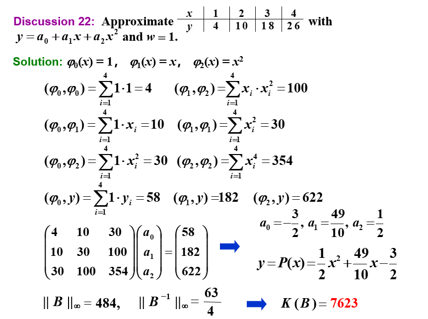

##### 构造正交多项式

由 $H_{ij}^{(n)}=\frac{1}{i+j-1}$ 定义的 $n\times n$ 的 Hilbert 矩阵是一个病态矩阵。在求解中往往因为舍入误差而导致结果不准确。

为了解决这个问题，我们可以通过正交化的方法来构造正交多项式，也就是让前文中提到的矩阵变成对角矩阵。这样就不需要进行求逆了。

此时的系数可以直接通过

$$
a_k = \frac{\langle \phi_{k},f\rangle}{\langle \phi_{k}, \phi_{k}\rangle}
$$

来计算。

我们可以构造出一系列的正交多项式。用下面定义的多项式函数集 $\{\phi_{0}(x), \phi_{1}(x), \cdots, \phi_{n}(x)\}$ 关于权函数 $w(x)$ 是正交的：

$$\phi_{0}(x)=1, \quad \phi_{1}(x)=x-B_{1}, \quad \phi_{k}(x)=(x-B_{k}) \phi_{k-1}(x)-C_{k} \phi_{k-2}(x), \quad k=2,3, \cdots$$

其中 $B_k$ 和 $C_k$ 是常数，可以通过

$$
B_{k}=\frac{\langle x \phi_{k-1}, \phi_{k-1}\rangle}{\langle \phi_{k-1}, \phi_{k-1}\rangle}, \quad C_{k}=\frac{\langle x\phi_{k-1}, \phi_{k-2}\rangle}{\langle \phi_{k-2}, \phi_{k-2}\rangle}
$$

来计算。

!!! note "题目例子"

    

    里面各项已经在之前的图片中计算过了。

##### 伪代码

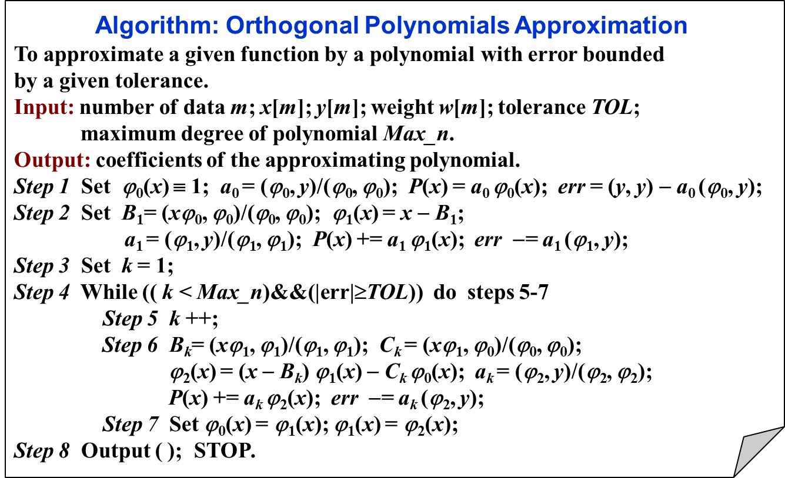

其中误差的计算推导如下：

#### 8.3 Chebyshev Polynomials and Economization of Power Series | 切比雪夫多项式与幂级数的缩减

##### Chebyshev Polynomials | 切比雪夫多项式

###### Target 1

上文我们知道了误差的计算方式，现在我们试图找到一个 $n$ 阶多项式 $P_n$ 来逼近函数，使得误差 $\|P_n-f\|$ 最小。

若 $P(x_0)-f(x_0)=\pm \|P_n-f\|$ ，则定义点 $x_0$ 为 **Deviation point**

我们的多项式 $P_n$ 有如下性质：

- 如果 $f\in C[a,b]$，且 $f$ 不是 $n$ 阶多项式，则存在唯一的多项式 $P_n$ 使得 $||P_n-f||_\infty$ 最小
- $P_n(x)$ 存在，且必须有正负偏差点，否则肯定还有更好的逼近函数
- **（切比雪夫定理）**$P_n(x)$ 最小化 $||P_n-f||_\infty$ $\Leftrightarrow$ $P_n(x)$ 至少有 $n+2$ 个正负偏差点。也就是说，存在一组点 $a \leq t_1 < \cdots < t_{n+2} \leq b$，使得

    $$P_n(t_k) - f(t_k) = \pm (-1)^k ||P_n-f||_\infty$$

    这组点 $\{t_k\}$ 被称为**切比雪夫交替序列(Chebyshev alternating sequence)**。

{width=80%}

###### Target 2.0

决定插值点 $\{x_0, \cdots, x_n\}$ 使得 $P_n(x)$ 最小化余项。余项为：

$$|P_n(x)-f(x)|=|R_n(x)|=\left|\frac{f^{(n+1)}(\xi)}{(n+1)!}\prod_{i=0}^n(x-x_i)\right|$$

###### Target 2.1

找到插值点 $\{x_1, \cdots, x_n\}$ 使得 $||w_n||_\infty$ 在 $[-1,1]$上最小化，其中 $w_n(x)=\prod\limits_{i=1}^n(x-x_i)$

注意到

$$w_n(x)=x^n-P_{n-1}(x)$$

!!! note ""
    这里的 $P_{n-1}(x)$ 是 $n-1$ 阶多项式，和上文的 $P_n(x)$ 不是一个东西，此语境下没有关联。

###### Target 3.0

问题转化为找到 $x_1, \cdots, x_n$ 使得 $||x^n-P_{n-1}(x)||_\infty$ 在 $[-1,1]$上最小化。

从切比雪夫定理我们知道，$P_{n-1}(x)$ 相对于 $x^n$ 有 $n+1$ 个偏差点，也就是说，$w_n(x)$ 在 $n+1$ 个点上交替取得最大值和最小值。

###### 引入Chebyshev Polynomials

为了实现上面的目标，我们先想到三角函数。$cos(n\theta)$ 在 $[-1,1]$ 上有 $n+1$ 个交替的最大值和最小值，但是 $cos(n\theta)$ 不是多项式。
又由于 $cos(n\theta)$ 可以表示为 $\sum\limits_{k=0}^{n} a_k (\cos\theta)^k$，这就是我们想要的多项式形式。

令 $x=\cos\theta$，则 $x \in [-1,1]$，所以我们可以把 $cos(n\theta)$ 写成 $T_n(x)$ 的形式，$T_n(x)$ 称为**切比雪夫多项式(Chebyshev polynomial)**。

$$
T_{n}(x)=\cos (n \cdot \arccos x)
$$

切比雪夫多项式的性质：

- 当 $x=\cos\frac{k\pi}{n}$ 时，$T_n(x)$ 取到极值 $(-1)^k$

我们也可以用递推公式来定义切比雪夫多项式：

$$
\begin{aligned}
T_{0}(x)&=1\\
T_{1}(x)&=x\\
T_{n}(x)&=2 x T_{n-1}(x)-T_{n-2}(x), \quad n=2,3, \cdots
\end{aligned}
$$

可以得出性质：

- 最高阶项的系数为 $2^{n-1}$
- 在$[0,1]$上，$T_0(x), T_1(x), \cdots, T_n(x)$ 关于权函数 $\frac{1}{\sqrt{1-x^2}}$ 正交

通过计算得出

$$\langle T_{n}, T_{m}\rangle= \int _{-1}^{1} \frac{T_{n}(x) T_{m}(x)}{\sqrt{1-x^{2}}} d x=\left\{\begin{array}{ll}{\pi} & {n=m=0} \\ {\frac{\pi}{2}} & {n=m \neq 0} \\ {0} & {n \neq m}\end{array}\right.$$

###### 回到 Target 3.0

我们可以把 $w_n$ 写成 $T_n(x)$ 的形式：

$$
w_{n}(x)=x^{n}-P_{n-1}(x)=\frac{T_{n}(x)}{2^{n-1}}
$$

称之为**首一切比雪夫多项式(The monic Chebyshev polynomial)**。

可以证明，首一切比雪夫多项式是所有首一多项式中，最小化 $||w_n||_\infty$ 的多项式。

###### 回到 Target 2.1

我们将 $w_n$ 写成 $T_n(x)$ 的形式：

$$
\min_{w_n\in \tilde\Pi_n} \|w_{n}\|_{\infty}=\big\|\frac{T_{n}(x)}{2^{n-1}}\big\|_{\infty}=\frac{1}{2^{n-1}}
$$

!!! note ""
    这里的 $\tilde\Pi_n$ 是所有首一多项式的集合。

所以，我们取的插值点即为 $T_n(x)$ 的 $n$ 个零点

###### 回到 Target 2.0

在 $[-1,1] 上选取的插值点为 $T_n(x)$ 的 $n$ 个零点，能够使得余项最小，其上确界为

$$
\max _{x \in[-1,1]}\left|f(x)-P_{n}(x)\right| \leq \frac{1}{2^{n}(n+1) !} \max _{x \in[-1,1]}\left|f^{(n+1)}(x)\right|
$$

使用线性变换 $x=\frac{b-a}{2} t+\frac{b+a}{2}$，我们可以将其推广到闭区间 $[a,b]$ 上。

###### 例题

##### Economization of Power Series | 幂级数的缩减

考虑到，用一个 $n$ 阶多项式 $P_n(x) = a_n x^n + a_{n-1} x^{n-1} + \cdots + a_1 x + a_0$ 来逼近一个任意的 $n$ 阶多项式 $P_n(x)$，我们可以通过去掉 $P_n(x)$ 中的 含 $a_n x^n$ 项的 $n$ 阶多项式 $Q_n(x)$ 来逼近 $P_n(x)$，那么

$$
\begin{aligned}
\max _{x \in[-1,1]}\left|f(x)-P_{n-1}(x)\right| &\leq \max _{x \in[-1,1]}\left|f(x)-P_{n}(x)\right|+\max _{x \in[-1,1]}\left|Q_{n}(x)\right|+\max _{x \in[-1,1]}\left|P_{n}(x)-P_{n-1}(x)-Q_{n}(x)\right|\\
&\leq \max _{x \in[-1,1]}\left|f(x)-P_{n}(x)\right|+\max _{x \in[-1,1]}\left|Q_{n}(x)\right|
\end{aligned}
$$

为了使得精确度的损失最小， $Q_n(x)$ 必须为 

$$a_n \cdot \frac{T_n(x)}{2^{n-1}}$$

###### 例题

!!! note ""
    降两阶就都要做两次。

## Chapter 9 逼近特征值 | Approximating Eigenvalues

### 9.2 幂法 | Power Method

幂法是用来确定矩阵的主特征值（即，绝对值最大的特征值）和对应的特征向量的一种方法。

#### 基本思想

设$\mathbf{A}$是一个$n\times n$的矩阵，且恰有一个特征值$\lambda_1$的绝对值最大
有$n$个特征值$\lambda_1,\lambda_2,\cdots,\lambda_n$($|\lambda_1|>|\lambda_2|\geq\cdots\geq|\lambda_n|$)，对应的特征向量为$\mathbf{v}_1,\mathbf{v}_2,\cdots,\mathbf{v}_n$，则任意一个非零向量$\mathbf{x}^{(0)}$都可以表示为这$n$个特征向量的线性组合，记$\beta_j$为常数，则

$$\mathbf{x}^{(0)}=\sum\limits_{j=1}\limits^n\beta_j\mathbf{v}_j$$

!!! note ""
    $\mathbf{x}^{(0)} \neq 0$，且$(\mathbf{x}^{(0)},\mathbf{v}_1)\neq 0$，否则：因为我们无法确保对于任意的初始向量$\mathbf{x}^{(0)}$都有$\beta_1\neq 0$，所以迭代的结果可能不是$\mathbf{v}_1$，而是满足 $(\mathbf{x}^{(0)},\mathbf{v}_m)\neq 0$ 的第一个向量$\mathbf{v}_m$，相应地，得到的特征值为 $\lambda_m$ 。

等式两边同时左乘$\mathbf{A},\mathbf{A}^2,\cdots,\mathbf{A}^k$，得到

$$\begin{aligned}
\mathbf{x}^{(1)}=\mathbf{A}\mathbf{x}&=\sum\limits_{j=1}\limits^n\beta_j\mathbf{A}\mathbf{v}_j=\sum\limits_{j=1}\limits^n\beta_j\lambda_j\mathbf{v}_j\\
\mathbf{x}^{(2)}=\mathbf{A}^2\mathbf{x}&=\sum\limits_{j=1}\limits^n\beta_j\mathbf{A}^2\mathbf{v}_j=\sum\limits_{j=1}\limits^n\beta_j\lambda_j^2\mathbf{v}_j\\
&\vdots\\
\mathbf{x}^{(k)}=\mathbf{A}^k\mathbf{x}&=\sum\limits_{j=1}\limits^n\beta_j\mathbf{A}^k\mathbf{v}_j=\sum\limits_{j=1}\limits^n\beta_j\lambda_j^k\mathbf{v}_j=\lambda_1^k\sum\limits_{j=1}\limits^n\beta_j(\frac{\lambda_j}{\lambda_1})^k\mathbf{v}_j
\end{aligned}$$

所以

$$\lim\limits_{k\to\infty}\mathbf{A}^k\mathbf{x}=\lim\limits_{k\to\infty}\lambda_1^k\sum\limits_{j=1}\limits^n\beta_j(\frac{\lambda_j}{\lambda_1})^k\mathbf{v}_j=\lim\limits_{k\to\infty}\beta_1\lambda_1^k\mathbf{v}_1$$

如果$|\lambda_1|<1$，则$\lim\limits_{k\to\infty}\mathbf{A}^k\mathbf{x}=0$，即$\mathbf{x}$收敛到0向量。如果$|\lambda_1|>1$，则序列发散。

对足够大的$k$，$\mathbf{x}^{(k)},\mathbf{x}^{(k-1)}$可以近似地表示为

$$\mathbf{x}^{(k)}\approx\beta_1\lambda_1^k\mathbf{v}_1, \quad\mathbf{x}^{(k-1)}\approx\beta_1\lambda_1^{k-1}\mathbf{v}_1\quad
\Rightarrow\quad\frac{\mathbf{x}^{(k)}}{\mathbf{x}^{(k-1)}}\approx\lambda_1$$

所以，我们可以通过迭代$\mathbf{x}^{(k)}=\mathbf{A}\mathbf{x}^{(k-1)}$来逼近$\lambda_1$。

##### 归一化

实际计算时，为了避免计算过程中出现绝对值过大或过小的数参加运算，通常在每步迭代时，将向量“归一化”即用的按模最大的分量。

我们需要对$\mathbf{x}^{(k)}$进行归一化，使得$\|\mathbf{x}^{(k)}\|_\infty=1$，即

$$\mathbf{u}^{(k-1)}=\frac{\mathbf{x}^{(k-1)}}{\|\mathbf{x}^{(k-1)}\|_\infty},\quad \mathbf{x}^{(k)}=\mathbf{A}\mathbf{u}^{(k-1)}\\
\Rightarrow \mathbf{u}^{(k)}=\frac{\mathbf{x}^{(k)}}{\|\mathbf{x}^{(k)}\|_\infty},\quad \lambda_1\approx\frac{\mathbf{x}_{i}^{(k)}}{\mathbf{u}_{i}^{(k-1)}}=\|\mathbf{x}^{(k)}\|_\infty$$

#### 伪代码

!!! note ""
    - 对唯一的主特征值$\lambda_1$，如果其重数大于1，则幂法仍然有效
    - 如果$\lambda_1=-\lambda_2$，则幂法失效
    - 因为我们无法确保对于任意的初始向量$\mathbf{x}^{(0)}$都有$\beta_1\neq 0$，所以迭代的结果可能不是$\mathbf{v}_1$，而是满足 $(\mathbf{x}^{(0)},\mathbf{v}_m)\neq 0$ 的第一个向量$\mathbf{v}_m$，相应地，得到的特征值为 $\lambda_m$ 。
    - Aitken's $\Delta^2$ 可以加速收敛

#### 收敛速度

因为$\mathbf{x}^{(k)}=\lambda_1^k\sum\limits_{j=1}\limits^n\beta_j(\frac{\lambda_j}{\lambda_1})^k\mathbf{v}_j$，假设$\lambda_1>\lambda_2\geq\cdots\geq\lambda_n$，且$|\lambda_2|\geq |\lambda_n|$，则我们的目标就是让$\frac{\lambda_2}{\lambda_1}$尽可能小，这样收敛速度更快。

记$\mathbf{B}=\mathbf{A}-p\mathbf{I}$，其中$p=\frac{\lambda_2+\lambda_n}{2}$，则$\mathbf{B}$的特征值为$\lambda_1-p,\lambda_2-p,\cdots,\lambda_n-p$，因为$|\frac{\lambda_2-p}{\lambda_1-p}|<|\frac{\lambda_2}{\lambda_1}|$，所以此时$\mathbf{B}$的收敛速度更快。

但是我们并不知道$\lambda_2$和$\lambda_n$，所以这不一定是一个好的选择。

#### 反幂法 | Inverse Power Method

反幂法一般是用来确定$\mathbf{A}$中与特定数$q$最接近的特征值，即$\lambda_i\approx q$。
此时对任意的$j\neq i$，有

$$|\lambda_i-q|\ll|\lambda_j-q|$$

根据刚刚在收敛速度中的分析，可知：此时 $(\mathbf{A}-q\mathbf{I})^{-1}$ 的主特征值凸显出来了，可以更快地收敛到 $\frac{1}{\lambda_i-q}$。

其伪代码为：

