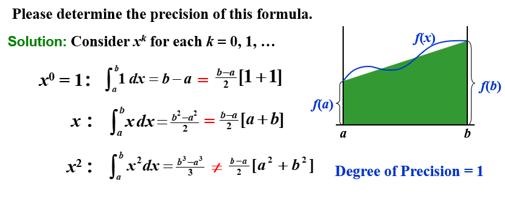
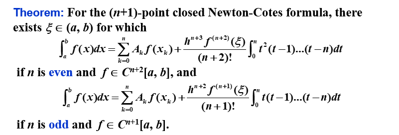
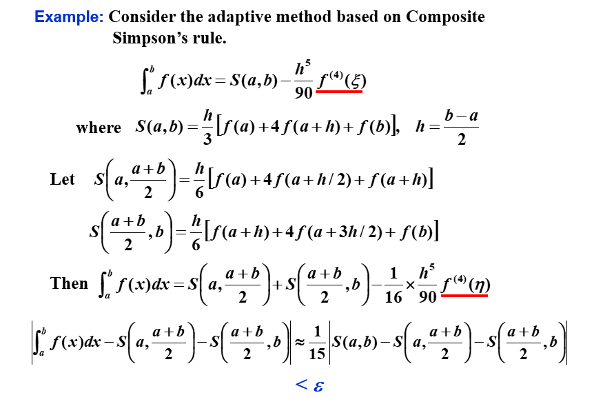
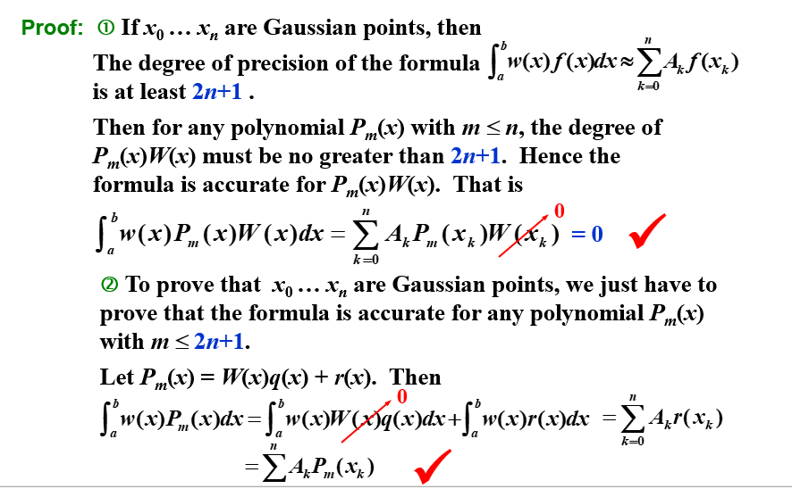
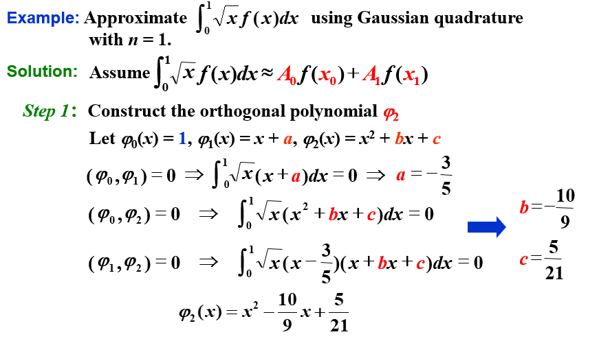

# Chapter 4 数值微分与积分 | Numerical Differentiation and Integration

## 4.1 数值微分 | Numerical Differentiation

### 两点法

最简单的方法：用两个点，取$h>0$

Forward : $f'(x) = \frac{f(x+h) - f(x)}{h} + O(h)$

Backward : $f'(x) = \frac{f(x) - f(x-h)}{h} + O(h)$

构造由 $x_0$ 和 $x_0+h$ 确定的一次 Lagrange 插值多项式：

$$
\begin{aligned}
f(x) &=\frac{f(x_0)(x-x_0-h)}{x_0-x_0-h}+\frac{f(x_0+h)(x-x_0)}{x_0+h-x_0} + \frac{(x-x_0)(x-x_0-h)}{2!}f''(\xi_x) \\
f'(x) &= \frac{f(x_0+h)-f(x_0)}{h} + \frac{2(x-x_0)-h}{2}f''(\xi_x) + \frac{(x-x_0)(x-x_0-h)}{2!}\frac{\mathrm{d}}{\mathrm{d}x}f''(\xi_x) \\
f'(x_0) &= \frac{f(x_0+h)-f(x_0)}{h} - \frac{h}{2}f''(\xi_x)
\end{aligned}
$$

### 一般方法

用 $n+1$ 个点，构造 $n$ 次 Lagrange 插值多项式：

$$
\begin{aligned}f(x)&=\sum\limits_{k=0}^nf(x_k)L_k(x)+\frac{(x-x_0)\cdots(x-x_n)}{(n+1)!}f^{(n+1)}(\xi_x)\\
f^{\prime}(x_j)&=\sum\limits_{k=0}^nf(x_k)L_k^{\prime}(x_j)+\frac{f^{(n+1)}(\xi_j)}{(n+1)!}\prod_{k = 0,k\neq j}^n(x_j-x_k)
\end{aligned}$$

!!! note ""
    总体而言，更多的评估点会产生更高的准确性。另一方面，功能评估的数量增加，舍入误差也会增加。因此，数值微分是不稳定的！

### 三点公式

因为

$$L_0(x) = \frac{(x-x_1)(x-x_2)}{(x_0-x_1)(x_0-x_2)}$$

所以

$$L'_0(x) = \frac{2x-x_1-x_2}{(x_0-x_1)(x_0-x_2)}$$

同理有

$$L'_1(x) = \frac{2x-x_0-x_2}{(x_1-x_0)(x_1-x_2)}$$

$$L'_2(x) = \frac{2x-x_0-x_1}{(x_2-x_0)(x_2-x_1)}$$

所以

$$
\begin{aligned}
f'(x_j) =& f(x_0)\frac{2x_j-x_1-x_2}{(x_0-x_1)(x_0-x_2)} + f(x_1)\frac{2x_j-x_0-x_2}{(x_1-x_0)(x_1-x_2)} \\&+ f(x_2)\frac{2x_j-x_0-x_1}{(x_2-x_0)(x_2-x_1)}+\frac{f^{(3)}(\xi_j)}{3!}\prod_{k=0,k\neq j}^2(x_j-x_k)
\end{aligned}
$$

如果 $x_0,x_1,x_2$ 等距，即 $x_1=x_0+h,x_2=x_0+2h$，则

$$
\begin{aligned}
f'(x_j) =& f(x_0)\frac{2x_j-2x_0-3h}{2h^2} + f(x_1)\frac{2x_j-2x_0-2h}{-h^2} \\&+ f(x_2)\frac{2x_j-2x_0-h}{2h^2}+\frac{f^{(3)}(\xi_j)}{3!}\prod_{k=0,k\neq j}^2(x_j-x_k)
\end{aligned}
$$

所以

$$
\begin{aligned}
f'(x_0) &= \frac{1}{h}(-\frac{3}{2}f(x_0)+2f(x_0+h)-\frac{1}{2}f(x_0+2h))+\frac{h^2}{3}f^{(3)}(\xi_0)\\
f'(x_1) &= \frac{1}{h}(-\frac{1}{2}f(x_0)+\frac{1}{2}f(x_0+2h))-\frac{h^2}{6}f^{(3)}(\xi_1)\\
f'(x_2) &= \frac{1}{h}(\frac{1}{2}f(x_0)-2f(x_0+h)+\frac{3}{2}f(x_0+2h))+\frac{h^2}{3}f^{(3)}(\xi_2)
\end{aligned}
$$

显然，中间的点误差最小，所以，我们可以用这种方法来估计导数值，即

$$f^{\prime}(x_0)=\frac1{2h}[f(x_0+h)-f(x_0-h)]-\frac{h^2}6f^{(3)}(\xi_1)$$

{width=30%}

### 二阶导数

将函数 $f$ 在 $x_0$ 处展开为三阶 Taylor 多项式，并求在 $x_0+h$ 和 $x_0-h$ 处的值：

$$\begin{gathered}
f(x_0+h)=f(x_0)+f^{\prime}(x_0)h+\frac12f^{\prime\prime}(x_0)h^2+\frac16f^{\prime\prime\prime}(x_0)h^3+\frac1{24}f^{(4)}(\xi_1)h^4 \\
f(x_0-h)=f(x_0)-f^{\prime}(x_0)h+\frac12f^{\prime\prime}(x_0)h^2-\frac16f^{\prime\prime\prime}(x_0)h^3+\frac1{24}f^{(4)}(\xi_{-1})h^4
\end{gathered}$$

将上面两式相加，得

$$f^{\prime\prime}(x_0)=\frac{f(x_0+h)-2f(x_0)+f(x_0-h)}{h^2}-\frac{h^2}{24}[f^{(4)}(\xi_1)+f^{(4)}(\xi_{-1})]$$

由于 $f^{(4)}$ 是连续函数，所以存在 $\xi$ 使得

$$f^{(4)}(\xi)=\frac12[f^{(4)}(\xi_1)+f^{(4)}(\xi_{-1})]$$

所以

$$f^{\prime\prime}(x_0)=\frac{f(x_0+h)-2f(x_0)+f(x_0-h)}{h^2}-\frac{h^2}{12}f^{(4)}(\xi)$$

## 4.3 数值积分基础 | Elements of Numerical Integration

对于没有显式原函数或原函数难以计算的函数，我们通过 **数值求积（Numerical Quadrature）** 来近似计算积分值：使用和 $\sum\limits_{i=0}^n a_if(x_i)$ 来近似计算积分值 $\int_a^b f(x)\mathrm{d}x$。

为了确定系数 $a_i$ ，我们给出一种求积方法：

以第三章中给出的[插值多项式](./Chapter_03.md/#31-lagrange-interpolation-and-lagrange-polynomials)为基础，得到 Lagrange 插值多项式：

$$P_n(x)=\sum\limits_{i=0}^nf(x_i)L_i(x)$$

所以

$$\int_a^b f(x)\mathrm{d}x\approx\int_a^b P_n(x)\mathrm{d}x=\sum\limits_{i=0}^nf(x_i)\int_a^b L_i(x)\mathrm{d}x=\sum\limits_{i=0}^n f(x_i)a_i$$

误差项为

$$\int_a^b f(x)\mathrm{d}x-\sum\limits_{i=0}^n f(x_i)a_i=\int_a^b (f(x)-P_n(x))\mathrm{d}x=\int_a^b \frac{f^{(n+1)}(\xi)}{(n+1)!}\prod_{i=0}^n(x-x_i)\mathrm{d}x$$

### 精确度 | Precision

求积公式的精确度 (precision/degree of accuracy) 是使得求积公式对 $x^k$ 精确成立的最大正整数 $k$。

### 通用法则 - Newton-Cotes 求积公式

在等距节点上（$h = \frac{b-a}{n}$），考察系数 $a_i$ 的值，我们可以得到一些通用的求积法则：

$$
\begin{aligned}
a_i=\int_{x_0}^{x_n}L_i(x)\mathrm{d}x&=\int_{x_0}^{x_n}\prod_{j=0,j\neq i}^n\frac{x-x_j}{x_i-x_j}\mathrm{d}x\\
\end{aligned}
$$

令 $x = a+th$，则

$$
\begin{aligned}
a_i&=\int_{x_0}^{x_n}\prod_{j=0,j\neq i}^n\frac{x-x_j}{x_i-x_j}\mathrm{d}x\\
&=\int_0^n\prod_{j=0,j\neq i}^n\frac{(t-j)h}{(i-j)h}\cdot h\mathrm{d}t\\
&=h\cdot \frac{(-1)^{n-i}}{i!(n-i)!}\cdot \int_0^n\prod_{j=0,j\neq i}^n(t-j)\mathrm{d}t\\
\end{aligned}
$$

### 梯形法则 | Trapezoidal Rule

当 $n=1$ 时：

$$
\begin{aligned}
a_i&=h\cdot \frac{(-1)^{1-i}}{i!(1-i)!}\cdot \int_0^1\prod_{j=0,j\neq i}^1(t-j)\mathrm{d}t\\
a_0&=h\cdot \frac{(-1)^{1-0}}{0!(1-0)!}\cdot \int_0^1(t-1)\mathrm{d}t=\frac{1}{2}h\\
a_1&=h\cdot \frac{(-1)^{1-1}}{1!(1-1)!}\cdot \int_0^1(t-0)\mathrm{d}t=\frac{1}{2}h\\
\end{aligned}
$$

此时，$n=1$ 的求积公式为

$$\int_a^b f(x)\mathrm{d}x  = \frac{h}{2}[f(a)+f(b)]-\frac{h^3}{12}f''(\xi)$$

此即为 **梯形法则（Trapezoidal Rule）**。

#### 精确度

梯形法则的精确度为 $k=1$。

### Simpson 法则 | Simpson's Rule

当 $n=2$ 时：

$$
\begin{aligned}
a_i&=h\cdot \frac{(-1)^{2-i}}{i!(2-i)!}\cdot \int_0^2\prod_{j=0,j\neq i}^2(t-j)\mathrm{d}t\\
a_0&=h\cdot \frac{(-1)^{2-0}}{0!(2-0)!}\cdot \int_0^2(t-1)(t-2)\mathrm{d}t=\frac{1}{3}h\\
a_1&=h\cdot \frac{(-1)^{2-1}}{1!(2-1)!}\cdot \int_0^2(t-0)(t-2)\mathrm{d}t=\frac{4}{3}h\\
a_2&=h\cdot \frac{(-1)^{2-2}}{2!(2-2)!}\cdot \int_0^2(t-0)(t-1)\mathrm{d}t=\frac{1}{3}h\\
\end{aligned}
$$

此时，$n=2$ 的求积公式为

$$\int_a^b f(x)\mathrm{d}x  = \frac{h}{3}[f(a)+4f(\frac{a+b}{2})+f(b)]-\frac{h^5}{90}f^{(4)}(\xi)$$

此即为 **Simpson 法则（Simpson's Rule）**。

其精确度为 $k=3$。

### Simpson 3/8 法则 | Simpson's 3/8 Rule

当 $n=3$ 时，求积公式为

$$
\begin{aligned}
\int_a^b f(x)\mathrm{d}x  &= \frac{3h}{8}[f(a)+3f(\frac{2a+b}{3})+3f(\frac{a+2b}{3})+f(b)]\\
&-\frac{3h^5}{80}f^{(4)}(\xi)\\
\end{aligned}
$$

其精确度为 $k=3$。

### Cotes 求积公式 | Cotes Rule

当 $n=4$ 时，求积公式为

$$
\begin{aligned}
\int_a^b f(x)\mathrm{d}x  &= \frac{2h}{45}[7f(a)+32f(\frac{3a+b}{4})+12f(\frac{a+b}{2})+32f(\frac{a+3b}{4})+7f(b)]\\
&-\frac{8h^7}{945}f^{(6)}(\xi)\\
\end{aligned}
$$

### 通用法则的一般结论

注意：当 $n$ 是偶数时，精度的次数为 $n+1$，即使插值多项式的次数至多为 $n$。在 $n$ 是奇数的情况，精度的次数仅为 $n$。

## 4.4 复合数值积分 | Composite Numerical Integration

Newton-Cotes 以等距节点的插值多项式为基础。由于高次多项式的振荡性，这个过程在大的区间上是不精确的。为了解决这个问题，我们采用低阶 Newton-Cotes 的分段（piecewise）方法。

### 复合梯形法则 | Composite Trapezoidal Rule

将区间 $[a,b]$ 分成 $n$ 个子区间，每个子区间长度为 $h = \frac{b-a}{n}$，则

$$\int_{x_{k-1}}^{x_k}f(x)dx\approx\frac{x_k-x_{k-1}}2[f(x_{k-1})+f(x_k)],\mathrm{~}k=1,...,n$$

$$\int_a^b f(x)\mathrm{d}x = \sum\limits_{i=0}^{n-1}\int_{x_i}^{x_{i+1}}f(x)\mathrm{d}x=\frac{h}{2}[f(a)+2\sum\limits_{j=1}^{n-1}f(x_j)+f(b)]=\color{blue}{T_n}$$

其中，$x_i = a+ih$，$\xi\in[a,b]$。

误差项为

$$\int_a^b f(x)\mathrm{d}x-T_n=\frac{h^2}{12}(b-a)f''(\xi)$$

### 复合 Simpson 法则 | Composite Simpson's Rule

将区间 $[a,b]$ 分成 $n$ 个子区间，每个子区间长度为 $h = \frac{b-a}{n}$，则

$$\int_{x_k}^{x_{k+1}}f(x)dx\approx\frac h6[f(x_k)+4f(x_{k+\frac12})+f(x_{k+1})]$$

$$\int_a^bf(x)dx\approx\frac h6[f(a)+4\sum\limits_{k=0}^{n-1}f(x_{k+\frac12})+2\sum\limits_{k=0}^{n-2}f(x_{k+1})+f(b)]=\color{blue}{S_n}$$

其中，$x_i = a+ih$，$\xi\in[a,b]$。

误差项为

$$\int_a^b f(x)\mathrm{d}x-S_n=-\frac{b-a}{180}(\frac{h}2)^4f^{(4)}(\xi)$$

为简化表达，我们取 $n'=2n$，则 $h' = \frac{b-a}{n'} = \frac{h}{2}$，$x_{2k} = x_k$，$x_{2k+1} = x_k+\frac{h}{2}$，则

$$\int_a^bf(x)dx\approx\frac{h'}3[f(a)+4\sum\limits_{odd\;k}f(x_{k})+2\sum\limits_{even\;k}f(x_{k})+f(b)]=\color{blue}{S_{n'}}$$

### 例题

### 舍入误差的稳定性

所有的复合积分方法共有的一个重要性质是 **舍入误差的稳定性**。

可见，误差界与 $h$ 和 $n$ 无关。这说明即使将一个区间分成更多子区间，也不会增加舍入误差。

## 4.5 Romberg 积分 | Romberg Integration

考察残差项，对于梯形法则，有

$$R_{2n}[f]=-(\frac{h}{2})^2\frac{1}{12}(b-a)f''(\xi)\approx\frac{1}{4}R_n[f]$$

所以

$$\frac{I-T_{2n}}{I-T_n}\approx\frac{1}{4}$$

即

$$I\approx\frac{4T_{2n}-T_n}{4-1}=\frac43T_{2n}-\frac13T_n=\color{blue}{S_n}$$

同理，总体上，我们有

$$\frac{4T_{2n}-T_n}{4-1}= S_n, \frac{4^2S_{2n}-S_n}{4^2-1}=C_n, \frac{4^3C_{2n}-C_n}{4^3-1}=R_n, ...$$

这里的 $R_n$ 就是 **Romberg 积分**。

所以算法为：

!!! note ""
    其中，每一步计算误差有没有到，如果没到，继续向后算。

### 伪代码

## 4.2 Richardson 外推法 | Richardson's Extrapolation

**Target**：使用低阶公式产生高精度的结果。

## 4.6 自适应求积方法 | Adaptive Quadrature Methods

Target: 预测函数变化的大小，使步长适应变化的需求。

其实就是先整体估摸着求积，然后看看精度如何（此处判断精度的方式是与上一次得到的值作比较，以比值为判断条件——如果本次和上次的值差不多，说明趋于收敛）；如果不够，就再细分一下，再求积。

举个例子：

这里可以看到，$S(a,\frac{a+b}{2})+S(\frac{a+b}{2},b)$ 逼近 $\int_a^b f(x)\mathrm{d}x$ 的效果比 $S(a,\frac{a+b}{2})+S(\frac{a+b}{2},b)$ 逼近$S(a,b)$ 好15倍。

## 4.7 Gauss 求积 | Gauss Quadrature

Target: 通过选择 $n+1$ 个合适的节点，使得求积公式的精度达到 $2n+1$。

!!! note "例子"

    用 Gauss 求积公式，在 $n=1$ 的情况下估计 $\int_{-1}^1 \sqrt{x}f(x)\mathrm{d}x$，则精度为3，需满足 $f(x)=1,x,x^2,x^3$。

    设 $\int_{-1}^1 \sqrt{x}f(x)\mathrm{d}x \approx A_0f(x_0)+A_1f(x_1)$，则

    $$\begin{cases}
    \int_{-1}^1 \sqrt{x}\mathrm{d}x = A_0+A_1 \\
    \int_{-1}^1 \sqrt{x}x\mathrm{d}x = A_0x_0+A_1x_1 \\
    \int_{-1}^1 \sqrt{x}x^2\mathrm{d}x = A_0x_0^2+A_1x_1^2 \\
    \int_{-1}^1 \sqrt{x}x^3\mathrm{d}x = A_0x_0^3+A_1x_1^3 \\
    \end{cases}$$

    由此可求得四个未知数，从而得到求积公式

但是，求解非线性方程组是很困难的，所以我们采用另一种方法。

我们可以证明： $x_0...x_n$ are Gaussian points $\color{blue}\text{iff}$  $W(x)=\prod\limits_{k=0}^n\left(x-x_k\right)$ is orthogonal to all the polynomials of degree no greater than $n.$

所以我们就是要找到一个正交多项式，它的零点就是我们要找的节点。

!!! note ""

    回到上面那个例子，我们就是要找到一个二阶多项式，其与小于二次的多项式的内积为0。

    

    

### Gauss-Legendre 求积公式

**Legendre 多项式**：$P_n(x)=\frac{1}{2^nn!}\frac{\mathrm{d}^n}{\mathrm{d}x^n}[(x^2-1)^n]$。

其内积关系为：$(P_k,P_l)=\begin{cases}0, & k\neq l \\ \frac{2}{2k+1}, & k=l\end{cases}$。

根据 $P_0(x)=1,P_1(x)=x$，我们有递推关系：

$$P_{n+1}(x)=\frac{2n+1}{n+1}xP_n(x)-\frac{n}{n+1}P_{n-1}(x)$$

这些就是Legendre多项式的集合，也就是我们要找的正交多项式。

### Gauss-Chebyshev 求积公式

