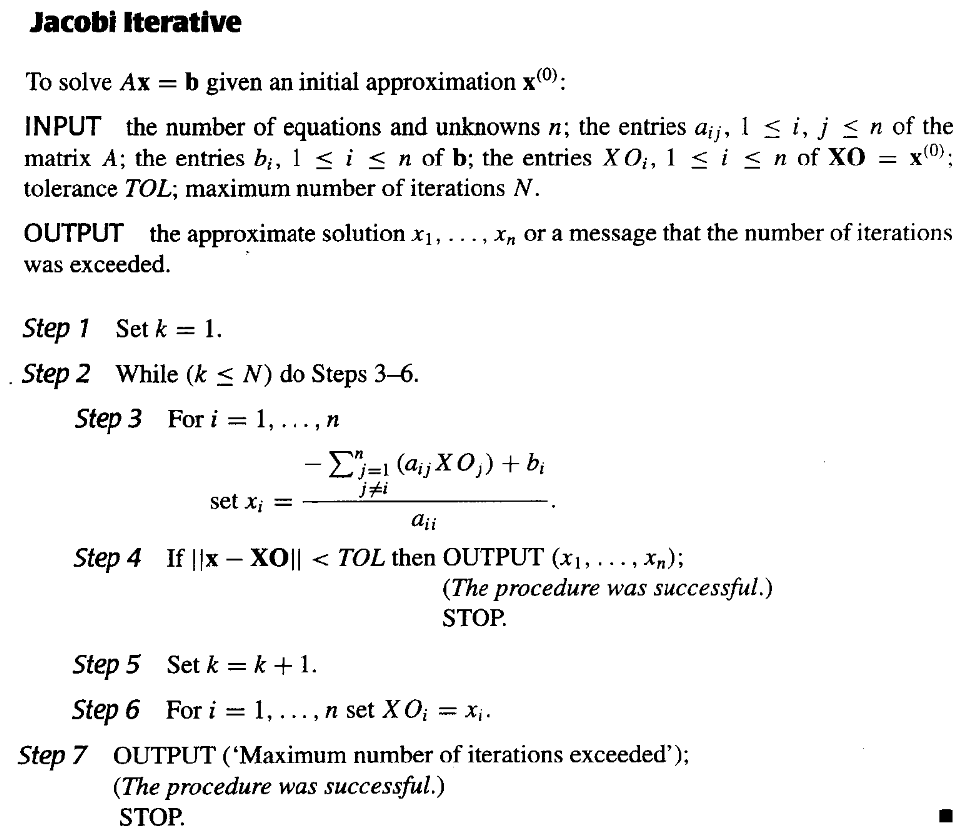
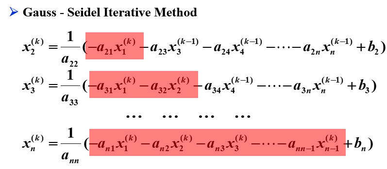
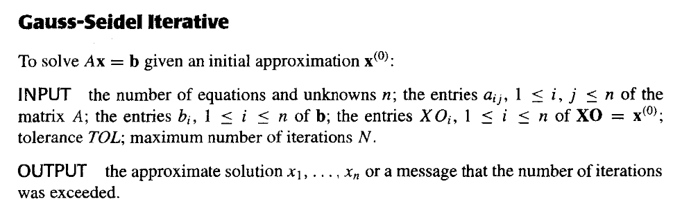

# Chapter 7 矩阵代数中的迭代方法 | Iterative Techniques in Matrix Algebra

## 7.1 向量和矩阵范数 | Norms of Vectors and Matrices

### 向量范数

$\mathbf{R}^n$上的向量范数是一个函数$\|\cdot\|:\mathbf{R}^n\rightarrow\mathbf{R}$，满足下列条件：

1. $\|\mathbf{x}\|\geq 0$，且$\|\mathbf{x}\|=0$当且仅当$\mathbf{x}=\mathbf{0}$；($\mathbf{x}\in\mathbf{R}^n$)
2. $\|\alpha\mathbf{x}\|=|\alpha|\|\mathbf{x}\|$，其中$\alpha\in\mathbf{R},\mathbf{x}\in\mathbf{R}^n$；
3. $\|\mathbf{x}+\mathbf{y}\|\leq\|\mathbf{x}\|+\|\mathbf{y}\|$。($\mathbf{x},\mathbf{y}\in\mathbf{R}^n$)

常用的向量范数有：

1. $p$-范数：$\|\mathbf{x}\|_p=(\sum\limits_{i=1}^n|x_i|^p)^{1/p}$，其中$p\geq 1$；
2. 无穷范数：$\|\mathbf{x}\|_\infty=\max_{1\leq i\leq n}|x_i|$；

#### 向量的收敛性

$\mathbf{R}^n$上的向量序列$\{\mathbf{x}^{(k)}\}_{k=1}^\infty$按照向量范数$\|\cdot\|$收敛到向量$\mathbf{x}$，当且仅当对于任意的$\epsilon>0$，存在整数$N(\epsilon)$，使得当$k>N(\epsilon)$时，有$\|\mathbf{x}^{(k)}-\mathbf{x}\|<\epsilon$。

对于无穷范数，如果向量序列$\{\mathbf{x}^{(k)}\}_{k=1}^\infty$按照无穷范数$\|\cdot\|_\infty$收敛到向量$\mathbf{x}$，当且仅当对于任意$i=1,2,\cdots,n$，有$\lim_{k\rightarrow\infty}x_i^{(k)}=x_i$。

#### 范数的等价性

等价性定义：$\mathbf{R}^n$上的向量范数$\|\cdot\|$和$\|\cdot\|'$等价，当且仅当存在正常数$c_1,c_2$，使得对于任意的$\mathbf{x}\in\mathbf{R}^n$，有$c_1\|\mathbf{x}\|\leq\|\mathbf{x}\|'\leq c_2\|\mathbf{x}\|$。

实际上，$\mathbf{R}^n$上的所有范数都是等价的。也就是说，如果$\|\cdot\|$和$\|\cdot\|'$是$\mathbf{R}^n$上的任意两个范数，并且$\{\mathbf{x}^{(k)}\}_{k=1}^\infty$按照$\|\cdot\|$收敛到$\mathbf{x}$，那么$\{\mathbf{x}^{(k)}\}_{k=1}^\infty$也按照$\|\cdot\|'$收敛到$\mathbf{x}$。

我们接下来证明对于范数$\|\cdot\|_2$和$\|\cdot\|_\infty$，它们是等价的。

!!! note "$\|\cdot\|_2$和$\|\cdot\|_\infty$的等价性"

    设$\|\mathbf{x}\|_\infty=\max\limits_{1\leq i\leq n}|x_i|=|x_j|$。那么
    
    $$\|\mathbf{x}\|_2=\sqrt{\sum\limits_{i=1}^n|x_i|^2}\geq\sqrt{|x_j|^2}=|x_j|=\|\mathbf{x}\|_\infty$$
    
    并且
    
    $$\|\mathbf{x}\|_2=\sqrt{\sum\limits_{i=1}^n|x_i|^2}\leq\sqrt{\sum\limits_{i=1}^n|x_j|^2}=\sqrt{n}|x_j|$$
    
    所以$\|\mathbf{x}\|_\infty\leq\|\mathbf{x}\|_2\leq\sqrt{n}\|\mathbf{x}\|_\infty$，即$\|\cdot\|_2$和$\|\cdot\|_\infty$是等价的。

### 矩阵范数

$\mathbf{R}^{n\times n}$上的矩阵范数是一个函数$\|\cdot\|:\mathbf{R}^{n\times n}\rightarrow\mathbf{R}$，满足下列条件：

1. $\|\mathbf{A}\|\geq 0$，且$\|\mathbf{A}\|=0$当且仅当$\mathbf{A}$是零矩阵；($\mathbf{A}\in\mathbf{R}^{n\times n}$)
2. $\|\alpha\mathbf{A}\|=|\alpha|\|\mathbf{A}\|$，其中$\alpha\in\mathbf{R},\mathbf{A}\in\mathbf{R}^{n\times n}$；
3. $\|\mathbf{A}+\mathbf{B}\|\leq\|\mathbf{A}\|+\|\mathbf{B}\|$。($\mathbf{A},\mathbf{B}\in\mathbf{R}^{n\times n}$)
4. $\|\mathbf{AB}\|\leq\|\mathbf{A}\|\|\mathbf{B}\|$。($\mathbf{A},\mathbf{B}\in\mathbf{R}^{n\times n}$)

矩阵$\mathbf{A}$和$\mathbf{B}$之间的距离定义为$\|\mathbf{A}-\mathbf{B}\|$。

#### Frobenius范数

$\mathbf{A}\in\mathbf{R}^{n\times n}$的Frobenius范数是$\mathbf{A}$的所有元素的平方和的平方根，即$\|\mathbf{A}\|_F=\sqrt{\sum\limits_{i=1}^n\sum\limits_{j=1}^na_{ij}^2}$。

#### 自然矩阵范数 | Natural Matrix Norm

如果$\|\cdot\|$是$\mathbf{R}^{n\times n}$上的向量范数，那么$\|\mathbf{A}\|=\max\limits_{\|\mathbf{x}\|=1}\|\mathbf{Ax}\|$是$\mathbf{R}^{n\times n}$上的矩阵范数,称为与向量范数$\|\cdot\|$相关的自然矩阵范数。

$\|\mathbf{A}\|=\max\limits_{\|\mathbf{x}\|=1}\|\mathbf{Ax}\|$也可以写成$\|\mathbf{A}\|=\max\limits_{\mathbf{x}\neq\mathbf{0}}\frac{\|\mathbf{Ax}\|}{\|\mathbf{x}\|}$。

常用的自然矩阵范数(Natural Norm)有：

1. $p$-范数：$\|\mathbf{A}\|_p=\max\limits_{\mathbf{x}\neq\mathbf{0}}\frac{\|\mathbf{Ax}\|_p}{\|\mathbf{x}\|_p}$，其中$p\geq 1$；
2. 无穷范数：$\|\mathbf{A}\|_\infty=\max\limits_{1\leq i\leq n}\sum\limits_{j=1}^n|a_{ij}|$；也就是$\mathbf{A}$的所有行和的最大值；
3. $1$-范数：$\|\mathbf{A}\|_1=\max\limits_{1\leq j\leq n}\sum\limits_{i=1}^n|a_{ij}|$；也就是$\mathbf{A}$的所有列和的最大值；
4. $2$-范数(spectral norm)：$\|\mathbf{A}\|_2=\sqrt{\lambda_{\max}(\mathbf{A}^T\mathbf{A})}$，其中$\lambda_{\max}(\mathbf{A}^T\mathbf{A})$是$\mathbf{A}^T\mathbf{A}$的最大特征值。

!!! note "推论"
    根据 $p$-范数的定义，我们可以得到：对于任意非零向量 $\mathbf{z}$ 和矩阵 $\mathbf{A}$ 和任意一个自然范数 $\|\cdot\|$，有

    $$\frac{\|\mathbf{Az}\|}{\|\mathbf{z}\|}\leq\|\mathbf{A}\|$$

    即

    $$\|\mathbf{A}\mathbf{z}\|\leq\|\mathbf{A}\|\|\mathbf{z}\|$$

## 7.2 特征值与特征向量 | Eigenvalues and Eigenvectors

### 谱半径 | Spectral Radius

$\mathbf{A}\in\mathbf{R}^{n\times n}$的谱半径定义为$\rho(\mathbf{A})=\max\limits_{1\leq i\leq n}|\lambda_i|$，其中$\lambda_i$是$\mathbf{A}$的特征值，这里的特征值可以是复数。

!!! note ""
    $\rho(\mathbf{A})=\max\{1,|1+\sqrt{3}i|,|1-\sqrt{3}i|\}=\max\{1,2,2\}=2$。

对于任意一个自然范数$\|\cdot\|$，有$\rho(\mathbf{A})\leq\|\mathbf{A}\|$。

### 矩阵的收敛性

当满足以下条件时，矩阵$\mathbf{A}\in\mathbf{R}^{n\times n}$是收敛的：

$$\lim_{k\rightarrow\infty}(\mathbf{A}^k)_{ij}=\mathbf{0}$$

以下命题是等价的：

1. 矩阵$\mathbf{A}\in\mathbf{R}^{n\times n}$是收敛的；
2. $\rho(\mathbf{A})<1$；
3. 对于某些自然范数$\|\cdot\|$，有$\lim\limits_{k\rightarrow\infty}\|\mathbf{A}^k\|=0$。
4. 对于任意的自然范数$\|\cdot\|$，有$\lim\limits_{k\rightarrow\infty}\|\mathbf{A}^k\|=0$。
5. 对于每一个$\mathbf{x}\in\mathbf{R}^n$，有$\lim\limits_{k\rightarrow\infty}\mathbf{A}^k\mathbf{x}=\mathbf{0}$。

## 7.3 求解线性方程组的迭代法 | Iterative Techniques for Solving Linear Systems

### Jacobi迭代法

记矩阵$\mathbf{A}\in\mathbf{R}^{n\times n}$的下三角部分为$-\mathbf{L}$，上三角部分为$-\mathbf{U}$，对角线部分为$\mathbf{D}$，即$\mathbf{A}=\mathbf{D}-\mathbf{L}-\mathbf{U}$。

所以方程组$\mathbf{Ax}=\mathbf{b}$可以写成$\mathbf{Dx}=(\mathbf{L}+\mathbf{U})\mathbf{x}+\mathbf{b}$。

即$\mathbf{x}=\mathbf{D}^{-1}(\mathbf{L}+\mathbf{U})\mathbf{x}+\mathbf{D}^{-1}\mathbf{b}$。

引入符号$\mathbf{T}_j=\mathbf{D}^{-1}(\mathbf{L}+\mathbf{U})$，$\mathbf{c}_j=\mathbf{D}^{-1}\mathbf{b}$，则$\mathbf{x}=\mathbf{T}_j\mathbf{x}+\mathbf{c}_j$。

Jacobi迭代法的迭代格式为：

$$\mathbf{x}^{(k+1)}=\mathbf{T}_j\mathbf{x}^{(k)}+\mathbf{c}_j$$

其伪代码为：

### Gauss-Seidel迭代法

我们可以改进Jacobi迭代法，使得每次迭代时，都使用已经算出来的$\mathbf{x}^{(k)}$的元素来计算$\mathbf{x}^{(k)}$之后的元素。如下图所示：

也就是说，可以使用：

$$ x_i^{(k)}=\frac{-\sum\limits_{j=1}^{i-1}a_{ij}x_j^{(k)}-\sum\limits_{j=i+1}^na_{ij}x_j^{(k-1)}+b_i}{a_{ii}} $$

来计算$x_i^{(k)}$。

结合之前$\mathbf{D}$，$\mathbf{L}$，$\mathbf{U}$的定义，我们可以得到：

$$(\mathbf{D}-\mathbf{L})\mathbf{x}^{(k)}=\mathbf{U}\mathbf{x}^{(k-1)}+\mathbf{b}$$

即：

$$\mathbf{x}^{(k)}=(\mathbf{D}-\mathbf{L})^{-1}\mathbf{U}\mathbf{x}^{(k-1)}+(\mathbf{D}-\mathbf{L})^{-1}\mathbf{b}$$

引入符号$\mathbf{T}_{g}=(\mathbf{D}-\mathbf{L})^{-1}\mathbf{U}$，$\mathbf{c}_{g}=(\mathbf{D}-\mathbf{L})^{-1}\mathbf{b}$，则$\mathbf{x}=\mathbf{T}_{g}\mathbf{x}^{(k-1)}+\mathbf{c}_{g}$。

Gauss-Seidel迭代法的迭代格式为：

$$\mathbf{x}^{(k+1)}=\mathbf{T}_{g}\mathbf{x}^{(k)}+\mathbf{c}_{g}$$

其伪代码为：

### 两种迭代法的收敛性

对于任意一个$\mathbf{x}^{(0)}\in\mathbf{R}^n$，由

$$\mathbf{x}^{(k+1)}=\mathbf{Tx}^{(k)}+\mathbf{c}$$

定义的序列 $\{\mathbf{x}^{(k)}\}_{k=0}^\infty$ 收敛到$\mathbf{x}=\mathbf{Tx}+\mathbf{c}$的唯一解，当且仅当$\rho(\mathbf{T})<1$。

!!! note "证明"
    $\Leftarrow$：

    设$\rho(\mathbf{T})<1$，那么

    $$\begin{aligned}
    \mathbf{x}^{(k)}=&\mathbf{Tx}^{(k-1)}+\mathbf{c}\\
    =&\mathbf{T}(\mathbf{Tx}^{(k-2)}+\mathbf{c})+\mathbf{c}\\
    =&\mathbf{T}^2\mathbf{x}^{(k-2)}+(\mathbf{T}+\mathbf{I})\mathbf{c}\\
    \vdots&\\
    =&\mathbf{T}^k\mathbf{x}^{(0)}+(\mathbf{T}^{k-1}+\mathbf{T}^{k-2}+\cdots+\mathbf{T}+\mathbf{I})\mathbf{c}\\
    \end{aligned}$$

    由于$\rho(\mathbf{T})<1$，所以矩阵$\mathbf{T}$是收敛的，且$\lim\limits_{k\rightarrow\infty}\mathbf{T}^k\mathbf{x}^{(0)}=\mathbf{0}$
    
    由于$\lim\limits_{k\rightarrow\infty}(\mathbf{T}^{k-1}+\mathbf{T}^{k-2}+\cdots+\mathbf{T}+\mathbf{I})\mathbf{c}=(\mathbf{I}-\mathbf{T})^{-1}\mathbf{c}$，所以$\lim\limits_{k\rightarrow\infty}\mathbf{x}^{(k)}=(\mathbf{I}-\mathbf{T})^{-1}\mathbf{c}=\mathbf{x}$，这里的$\mathbf{x}$就是$\mathbf{x}=\mathbf{Tx}+\mathbf{c}$的唯一解。

    $\Rightarrow$：

    设$\{\mathbf{x}^{(k)}\}_{k=0}^\infty$收敛到$\mathbf{x}=\mathbf{Tx}+\mathbf{c}$的唯一解，取任意一个向量$\mathbf{y}\in\mathbf{R}^n$，定义$\mathbf{x}^{(0)}=\mathbf{x}-\mathbf{y}$，那么
    
    $$\mathbf{x}-\mathbf{x}^{(k)}=(\mathbf{Tx}+\mathbf{c})-(\mathbf{Tx}^{(k-1)}+\mathbf{c})=\mathbf{T}(\mathbf{x}-\mathbf{x}^{(k-1)})$$

    所以

    $$\mathbf{x}-\mathbf{x}^{(k)}=\mathbf{T}^k(\mathbf{x}-\mathbf{x}^{(0)})=\mathbf{T}^k\mathbf{y}$$

    因此

    $$\lim_{k\rightarrow\infty}\mathbf{T}^k\mathbf{y}=\lim_{k\rightarrow\infty}(\mathbf{x}-\mathbf{x}^{(k)})=\mathbf{0}$$

    由于$\mathbf{y}$是任意的，根据[矩阵的收敛性](#_5)，$\rho(\mathbf{T})<1$。

#### 误差界 | Error Bounds for Iterative Methods

如果对任意自然矩阵范数$\|\mathbf{T}\|<1$，$\mathbf{c}$是给定的向量，那么由$\mathbf{x}^{(k+1)}=\mathbf{Tx}^{(k)}+\mathbf{c}$定义的序列$\{\mathbf{x}^{(k)}\}_{k=0}^\infty$收敛到$\mathbf{x}=\mathbf{Tx}+\mathbf{c}$的唯一解，且有误差界：

1. $\|\mathbf{x}-\mathbf{x}^{(k)}\|\leq\|\mathbf{T}\|^k\|\mathbf{x}^{(0)}-\mathbf{x}\|$；
2. $\|\mathbf{x}-\mathbf{x}^{(k)}\|\leq\frac{\|\mathbf{T}\|^k}{1-\|\mathbf{T}\|}\|\mathbf{x}^{(1)}-\mathbf{x}^{(0)}\|$；

通过(2)式，我们可以根据我们要的精度算出迭代次数$k$

!!! note "证明(1)式"

    $$
    \mathbf{x}-\mathbf{x}^{(k)}=(\mathbf{Tx}+\mathbf{c})-(\mathbf{Tx}^{(k-1)}+\mathbf{c})=\mathbf{T}(\mathbf{x}-\mathbf{x}^{(k-1)})
    $$

    所以

    $$
    \begin{aligned}
    \|\mathbf{x}-\mathbf{x}^{(k)}\|&=\|\mathbf{T}(\mathbf{x}-\mathbf{x}^{(k-1)})\|\\
    &\leq\|\mathbf{T}\|\|\mathbf{x}-\mathbf{x}^{(k-1)}\|\\
    &\leq\|\mathbf{T}\|^k\|\mathbf{x}-\mathbf{x}^{(0)}\|
    \end{aligned}
    $$

    !!! note ""
        $\|\mathbf{x}^{(k)}-\mathbf{x}\|\approx\rho(T)^k\|\mathbf{x}^{(0)}-\mathbf{x}\|$

!!! note "证明(2)式"

    $$\begin{aligned}
    \|\mathbf{x}^{(k+1)}-\mathbf{x}^{(k)}\|
    &=\|\mathbf{T}(\mathbf{x}^{(k)}-\mathbf{x}^{(k-1)})\|\\
    &\leq\|\mathbf{T}\|\|\mathbf{x}^{(k)}-\mathbf{x}^{(k-1)}\|\\
    &\leq\|\mathbf{T}\|^k \|\mathbf{x}^{(1)}-\mathbf{x}^{(0)}\|
    \end{aligned}$$

    所以对于任意的$m\geq n$，有

    $$\begin{aligned}
    \|\mathbf{x}^{(m)}-\mathbf{x}^{(n)}\|
    &=\|\mathbf{x}^{(m)}-\mathbf{x}^{(m-1)}+\mathbf{x}^{(m-1)}-\mathbf{x}^{(m-2)}+\cdots+\mathbf{x}^{(n+1)}-\mathbf{x}^{(n)}\|\\
    &\leq\|\mathbf{x}^{(m)}-\mathbf{x}^{(m-1)}\|+\|\mathbf{x}^{(m-1)}-\mathbf{x}^{(m-2)}\|+\cdots+\|\mathbf{x}^{(n+1)}-\mathbf{x}^{(n)}\|\\
    &\leq\|\mathbf{T}\|^{m-1}\|\mathbf{x}^{(1)}-\mathbf{x}^{(0)}\|+\|\mathbf{T}\|^{m-2}\|\mathbf{x}^{(1)}-\mathbf{x}^{(0)}\|+\cdots+\|\mathbf{T}\|^{n}\|\mathbf{x}^{(1)}-\mathbf{x}^{(0)}\|\\
    &=\|\mathbf{x}^{(1)}-\mathbf{x}^{(0)}\|\sum\limits_{k=n}^{m-1}\|\mathbf{T}\|^k\\
    \end{aligned}$$

    当$m\rightarrow\infty$时，$\sum\limits_{k=n}^{m-1}\|\mathbf{T}\|^k=\frac{\|\mathbf{T}\|^n}{1-\|\mathbf{T}\|}$，所以

    $$\|\mathbf{x}-\mathbf{x}^{(n)}\|\leq\frac{\|\mathbf{T}\|^n}{1-\|\mathbf{T}\|}\|\mathbf{x}^{(1)}-\mathbf{x}^{(0)}\|$$

#### 对于严格对角占优矩阵

如果$\mathbf{A}$是严格对角占优的，那么Jacobi迭代法和Gauss-Seidel迭代法都是收敛的。

!!! note ""
    证明其不存在大于1的特征值

### 松弛法 | Relaxation Methods

假设$\tilde{\mathbf{x}}\in R^n$是$\mathbf{Ax}=\mathbf{b}$的一个近似解，那么相对于该方程组的剩余向量（residual vector）为$\mathbf{r}=\mathbf{b}-\mathbf{A}\tilde{\mathbf{x}}$。

我们从剩余向量的视角来看Gauss-Seidel迭代法。

$$
\begin{aligned}
x_i^{(k)}&=\frac{-\sum\limits_{j=1}^{i-1}a_{ij}x_j^{(k)}-\sum\limits_{j=i+1}^na_{ij}x_j^{(k-1)}+b_i}{a_{ii}} \\
&=x_i^{(k-1)}+\frac{1}{a_{ii}}(b_i-\sum\limits_{j=1}^{i-1}a_{ij}x_j^{(k)}-\sum\limits_{j=i}^na_{ij}x_j^{(k-1)}) \\
&=x_i^{(k-1)}+\frac{r_i^{(k)}}{a_{ii}}
\end{aligned}
$$

我们可以添加一个参数$\omega$，使得

$$x_i^{(k)}=x_i^{(k-1)}+\omega\frac{r_i^{(k)}}{a_{ii}}$$

这就是松弛法的基本思想，可以用来减少剩余向量的范数和加速收敛。

根据$\omega$的取值，松弛法可以分为：

1. $\omega<1$：欠松弛法(Under-Relaxation methods)；可使由Gauss-Seidel方法不能收敛的方程组收敛；
2. $\omega=1$：退化为Gauss-Seidel迭代法；
3. $\omega>1$：超松弛法(Over-Relaxation methods)；可使收敛速度加快。

这些方法缩写为SOR方法（Successive Over-Relaxation）。

#### SOR方法的矩阵形式

我们尝试把SOR方法的迭代格式写成矩阵形式：

$$
\begin{aligned}
x_i^{(k)}&=x_i^{(k-1)}+\omega\frac{r_i^{(k)}}{a_{ii}}\\
&=x_i^{(k-1)}+\frac{\omega}{a_{ii}}(b_i-\sum\limits_{j=1}^{i-1}a_{ij}x_j^{(k)}-\sum\limits_{j=i}^na_{ij}x_j^{(k-1)}) \\
&=(1-\omega)x_i^{(k-1)}+\frac{\omega}{a_{ii}}(b_i-\sum\limits_{j=1}^{i-1}a_{ij}x_j^{(k)}-\sum\limits_{j=i+1}^na_{ij}x_j^{(k-1)}) \\
\end{aligned}
$$

所以

$$
\begin{aligned}
\mathbf{x}^{(k)}&=(1-\omega)\mathbf{x}^{(k-1)}+\omega\mathbf{D}^{-1}(\mathbf{b}+\mathbf{L}\mathbf{x}^{(k)}+\mathbf{U}\mathbf{x}^{(k-1)}) \\
(\mathbf{I}-\omega\mathbf{D}^{-1}\mathbf{L})\mathbf{x}^{(k)}&=((1-\omega)\mathbf{I}+\omega\mathbf{D}^{-1}\mathbf{U})\mathbf{x}^{(k-1)}+\omega\mathbf{D}^{-1}\mathbf{b} \\
\mathbf{x}^{(k)}&=(\mathbf{I}-\omega\mathbf{D}^{-1}\mathbf{L})^{-1}((1-\omega)\mathbf{I}+\omega\mathbf{D}^{-1}\mathbf{U})\mathbf{x}^{(k-1)}+(\mathbf{I}-\omega\mathbf{D}^{-1}\mathbf{L})^{-1}\omega\mathbf{D}^{-1}\mathbf{b} \\
\mathbf{x}^{(k)}&=(\mathbf{D}-\omega\mathbf{L})^{-1}((1-\omega)\mathbf{D}+\omega\mathbf{U})\mathbf{x}^{(k-1)}+\omega(\mathbf{D}-\omega\mathbf{L})^{-1}\mathbf{b} \\
\end{aligned}
$$

记$\mathbf{T}_{\omega}=(\mathbf{D}-\omega\mathbf{L})^{-1}((1-\omega)\mathbf{D}+\omega\mathbf{U})$，$\mathbf{c}_{\omega}=\omega(\mathbf{D}-\omega\mathbf{L})^{-1}\mathbf{b}$，则SOR方法的迭代格式为：

$$\mathbf{x}^{(k)}=\mathbf{T}_{\omega}\mathbf{x}^{(k-1)}+\mathbf{c}_{\omega}$$

#### Kahan定理

如果$a_{ii}\neq 0(i=1,2,\cdots,n)$，那么$\rho(\mathbf{T}_{\omega})\geq|\omega-1|$。这表明，SOR方法当且仅当$\omega\in(0,2)$时收敛。

#### Ostrowski-Reich定理

如果$\mathbf{A}$是一个正定矩阵，并且$\omega\in(0,2)$，那么SOR方法对于任意的初始近似向量$\mathbf{x}^{(0)}\in\mathbf{R}^n$都收敛。

#### $\omega$的最佳选择

如果$\mathbf{A}$是一个正定的三对角矩阵，那么$\rho(\mathbf{T}_{g})=[\rho(\mathbf{T}_{j})]^2<1$，并且SOR方法的最佳$\omega$选择是：

$$\omega_{opt}=\frac{2}{1+\sqrt{1-[\rho(\mathbf{T}_{j})]^2}}$$

由此选择的$\omega$，有$\rho(\mathbf{T}_{\omega})=\omega-1$。

#### SOR伪代码

## 7.4 误差界与迭代改进 | Error Bounds and Iterative Refinement

### 误差界

对于线性方程组 $\mathbf{Ax}=\mathbf{b}$ ，$\mathbf{A}$是非奇异的。如果 $\mathbf{A}$ 和 $\mathbf{b}$ 存在误差，那么解 $\mathbf{x}$ 也会存在误差。

#### $\mathbf{A}$ 精确，$\mathbf{b}$ 有误差

即 $\mathbf{Ax}=\mathbf{b}$ 变成 $\mathbf{A(x+\delta x)}=\mathbf{b}+\delta\mathbf{b}$ 。所以有：

$$
\begin{aligned}
\mathbf{A}\delta\mathbf{x}&=\delta\mathbf{b}\\
\Rightarrow \delta\mathbf{x}&=\mathbf{A}^{-1}\delta\mathbf{b}\\
\end{aligned}
$$

根据推论

!!! note ""
    对于任意向量 $\mathbf{z}\neq\mathbf{0}$，矩阵 $\mathbf{A}$ 和任意一个自然范数 $\|\cdot\|$，有

    $$\frac{\|\mathbf{Az}\|}{\|\mathbf{z}\|}\leq\|\mathbf{A}\|$$

我们有：

$$
\| \delta\mathbf{x} \|\leq\|\mathbf{A}^{-1}\|\|\delta\mathbf{b}\|\\
$$

$$
\mathbf{b}=\mathbf{Ax}\Rightarrow\|\mathbf{b}\|=\|\mathbf{Ax}\|\leq\|\mathbf{A}\|\|\mathbf{x}\|\\
$$

所以

$$
\frac{\|\delta\mathbf{x}\|}{\|\mathbf{x}\|}\leq\|\mathbf{A}\|\|\mathbf{A}^{-1}\|\frac{\|\delta\mathbf{b}\|}{\|\mathbf{b}\|}
$$

我们记非奇异矩阵 $A$ 相对于范数 $\|\cdot\|$ 的条件数为：

$$
K(\mathbf{A})=\|\mathbf{A}\|\|\mathbf{A}^{-1}\|
$$

当 $K(\mathbf{A})$ 很大时，$\mathbf{A}$ 是病态的，当 $K(\mathbf{A})$ 接近于 $1$ 时，$\mathbf{A}$ 是良态的。

#### $\mathbf{A}$ 有误差，$\mathbf{b}$ 精确

即 $\mathbf{Ax}=\mathbf{b}$ 变成 $\mathbf{(A+\delta A)(x+\delta x)}=\mathbf{b}$ 。所以有：

$$(\mathbf{A}+\delta\mathbf{A})\delta\mathbf{x}+\mathbf{x}\delta\mathbf{A}=0$$

这里的 $\delta\mathbf{A}$ 往往是一个小量。

??? note "证明$\|\mathbf{(I+A^{-1}\delta A)^{-1}}\|\leq\frac{1}{1-\|\mathbf{A^{-1}\delta A}\|}$"

    !!! note "推论"

        对于矩阵 $\mathbf{F}$，若$\|\mathbf{F}\|<1$，则$\mathbf{I}\pm\mathbf{F}$是非奇异的，且

        $$\left\|\left(\mathbf{I}\pm \mathbf{F}\right)^{-1}\right\|\leq\frac1{1-\left\|\mathbf{F}\right\|}$$

        ??? note "下面给出 $\mathbf{I} - \mathbf{F}$情况的证明"
        
            !!! warning ""
                因为 $\|\mathbf{-F}\|=\|\mathbf{F}\|<1$，所以我们将$\mathbf{-F}$替换 $\mathbf{F}$ ，就可以得到 $\mathbf{I+F}$情况的证明

            

    !!! note "推论"

        $$\|\mathbf{A}^{-1}\|_{p}=\frac{1}{\min\frac{\left|\left|\mathbf{A}\mathbf{x}\right|\right|p}{\left|\left|\mathbf{x}\right|\right|p}}$$

        ??? note "证明"

            $$\begin{aligned}
            &\|\mathbf{A}^{-1}\|_{p}\\
            =&\max_{\mathbf{x}\neq0}\frac{\|\mathbf{A}^{-1}\mathbf{x}\|_{p}}{\|\mathbf{x}\|_{p}})\\
            =&\max_{\mathbf{A}\mathbf{x}\neq0}\frac{\| \mathbf{A}^{-1}\mathbf{A}\mathbf{x}\|p}{\parallel \mathbf{A}^{-1}\mathbf{x}\|p} \\
            =&\max_{\mathbf{x}\neq0}\frac{\|\mathbf{x}\|p}{\|\mathbf{A}\mathbf{x}\|p} \\
            =&\max_{\mathbf{x}\neq0}\frac{1}{\frac{\|\mathbf{A}\mathbf{x}\|p}{\|\mathbf{x}\|p}} \\
            =&\frac{1}{\min\frac{\left|\left|\mathbf{A}\mathbf{x}\right|\right|p}{\left|\left|\mathbf{x}\right|\right|p}}
            \end{aligned}$$

    我们有

    $$\mathbf{(A+\delta A)}=\mathbf{A}\mathbf{(I+A^{-1}\delta A)}$$

    而

    $$\|\mathbf{A^{-1}\delta A}\|
    \leq
    \|\mathbf{A^{-1}}\|\|\mathbf{\delta A}\|
    =\frac{\|\mathbf{\delta A}\|}{\min\frac{\left|\left|\mathbf{A}\mathbf{x_1}\right|\right|p}{\left|\left|\mathbf{x_1}\right|\right|p}}
    $$

    因为$\|\delta\mathbf{A}\|$相对于$\|\mathbf{A}\|$很小，所以往往有$\|\mathbf{A^{-1}\delta A}\|\leq 1$，所以$\mathbf{I+A^{-1}\delta A}$是非奇异的，且

    $$\|\mathbf{(I+A^{-1}\delta A)^{-1}}\|\leq\frac{1}{1-\|\mathbf{A^{-1}\delta A}\|}$$

所以在$\|\mathbf{A^{-1}\delta A}\|\leq 1$的情况下（我们不妨将其放缩为$\|\mathbf{\delta A}\|\leq\|\frac{\mathbf{1}}{A^{-1}}\|$），有：

$$\|\mathbf{(I+A^{-1}\delta A)^{-1}}\|\leq\frac{1}{1-\|\mathbf{A^{-1}\delta A}\|}$$

所以

$$
\begin{aligned}
(\mathbf{A}+\delta\mathbf{A})\delta\mathbf{x}+\mathbf{x}\delta\mathbf{A}&=0\\
\mathbf{A}(I+\mathbf{A}^{-1}\delta\mathbf{A})\delta\mathbf{x}&=-\mathbf{x}\delta\mathbf{A}\\
 \delta\mathbf{x} &= -(I+\mathbf{A}^{-1}\delta\mathbf{A})^{-1}\mathbf{A}^{-1}\mathbf{x}\delta\mathbf{A}\\
 \|\delta\mathbf{x}\| &\leq\|\mathbf{(I+A^{-1}\delta A)^{-1}}\|\|\mathbf{A}^{-1}\|\|\mathbf{x}\|\|\delta\mathbf{A}\|\\
&\leq \frac{\|\mathbf{A}^{-1}\|\|\mathbf{x}\|\|\delta\mathbf{A}\|}{1-\|\mathbf{A}^{-1}\|\|\delta\mathbf{A}\|}\\
\end{aligned}
$$

所以：

$$
\frac{\|\delta\mathbf{x}\|}{\|\mathbf{x}\|}\leq\frac{\|\mathbf{A}^{-1}\|\|\delta\mathbf{A}\|}{1-\|\mathbf{A}^{-1}\|\|\delta\mathbf{A}\|}=\frac{K(\mathbf{A})\frac{\|\delta\mathbf{A}\|}{\|\mathbf{A}\|}}{1-K(\mathbf{A})\frac{\|\delta\mathbf{A}\|}{\|\mathbf{A}\|}}
$$

#### $\mathbf{A}$，$\mathbf{b}$ 都有误差

即 $\mathbf{Ax}=\mathbf{b}$ 变成 $\mathbf{(A+\delta A)(x+\delta x)}=\mathbf{b}+\delta\mathbf{b}$ 。所以有：

$$
\begin{aligned}
(\mathbf{A}+\delta\mathbf{A})\delta\mathbf{x}+\mathbf{x}\delta\mathbf{A}&=\delta\mathbf{b}\\
\end{aligned}
$$

所以，当$\|\delta\mathbf{A}\|<\frac{1}{\|\mathbf{A}^{-1}\|}$时，有：

$$
\begin{aligned}
\delta\mathbf{x}&=(I+\mathbf{A}^{-1}\delta\mathbf{A})^{-1}\mathbf{A}^{-1}(\delta\mathbf{b}-\mathbf{x}\delta\mathbf{A})\\
\end{aligned}
$$

所以

$$
\begin{aligned}
\|\delta\mathbf{x}\|&\leq \frac{\|\mathbf{A}^{-1}\|}{1-\|\mathbf{A}^{-1}\|\|\delta\mathbf{A}\|}\|\delta\mathbf{b}-\mathbf{x}\delta\mathbf{A}\|\\
&\leq \frac{\|\mathbf{A}^{-1}\|}{1-\|\mathbf{A}^{-1}\|\|\delta\mathbf{A}\|}(\|\delta\mathbf{b}\|+\|\mathbf{x}\|\|\delta\mathbf{A}\|)\\
&\leq \frac{K(\mathbf{A})}{1-K(\mathbf{A})\frac{\|\delta\mathbf{A}\|}{\|\mathbf{A}\|}}(\frac{\|\delta\mathbf{b}\|}{\|\mathbf{A}\|}+\frac{\|\mathbf{x}\|\|\delta\mathbf{A}\|}{\|\mathbf{A}\|})\\
&\leq \frac{K(\mathbf{A})}{1-K(\mathbf{A})\frac{\|\delta\mathbf{A}\|}{\|\mathbf{A}\|}}(\frac{\|\delta\mathbf{b}\|}{\|\mathbf{A}\|\|\mathbf{x}\|}+\frac{\|\delta\mathbf{A}\|}{\|\mathbf{A}\|})\|\mathbf{x}\|\\
&\leq \frac{K(\mathbf{A})}{1-K(\mathbf{A})\frac{\|\delta\mathbf{A}\|}{\|\mathbf{A}\|}}(\frac{\|\delta\mathbf{b}\|}{\|\mathbf{A}\mathbf{x}\|}+\frac{\|\delta\mathbf{A}\|}{\|\mathbf{A}\|})\|\mathbf{x}\|\\
&\leq \frac{K(\mathbf{A})}{1-K(\mathbf{A})\frac{\|\delta\mathbf{A}\|}{\|\mathbf{A}\|}}(\frac{\|\delta\mathbf{b}\|}{\|\mathbf{b}\|}+\frac{\|\delta\mathbf{A}\|}{\|\mathbf{A}\|})\|\mathbf{x}\|\\
\end{aligned}
$$

因此，当$\|\delta\mathbf{A}\|<\frac{1}{\|\mathbf{A}^{-1}\|}$时，有：

$$
\frac{\|\delta\mathbf{x}\|}{\|\mathbf{x}\|}\leq\frac{K(\mathbf{A})}{1-K(\mathbf{A})\frac{\|\delta\mathbf{A}\|}{\|\mathbf{A}\|}}(\frac{\|\delta\mathbf{b}\|}{\|\mathbf{b}\|}+\frac{\|\delta\mathbf{A}\|}{\|\mathbf{A}\|})
$$

#### $K(\mathbf{A})$ 的性质

我们记非奇异矩阵 $A$ 相对于范数 $\|\cdot\|$ 的条件数为：

$$
K(\mathbf{A})=\|\mathbf{A}\|\|\mathbf{A}^{-1}\|
$$

当 $K(\mathbf{A})$ 很大时，$\mathbf{A}$ 是病态的，当 $K(\mathbf{A})$ 接近于 $1$ 时，$\mathbf{A}$ 是良态的。

1. $K(\mathbf{A})_p\geq 1$ 对所有的自然范数 $\|\cdot\|_p$ 成立；
2. 如果 $\mathbf{A}$ 是对称的，那么 $K(\mathbf{A})_2=\frac{|\lambda_{max}|}{|\lambda_{min}|}$，其中 $\lambda_{max}$ 和 $\lambda_{min}$ 分别是 $\mathbf{A}$ 的最大和最小特征值；
3. $K(a\mathbf{A})=K(\mathbf{A})$，其中 $a$ 是一个非零常数；
4. $K(\mathbf{A})_2=1$ 当且仅当 $\mathbf{A}$ 是正交矩阵($\mathbf{A}^T\mathbf{A}=\mathbf{I}$)；
5. $K(\mathbf{RA})_2 =K(\mathbf{AR})_2 = K(\mathbf{A})_2$，其中 $\mathbf{R}$ 是一个正交矩阵；

### 题目例子

!!! note "(1)"

    

!!! note "(2)"

    
