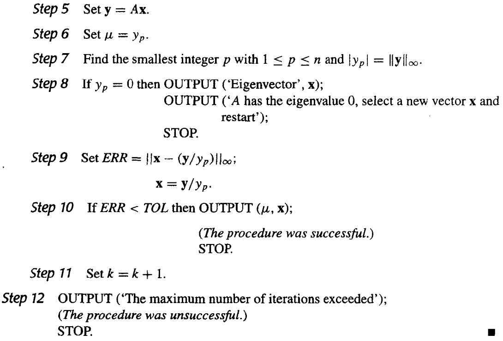
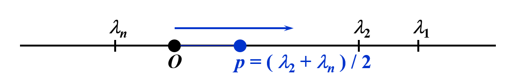
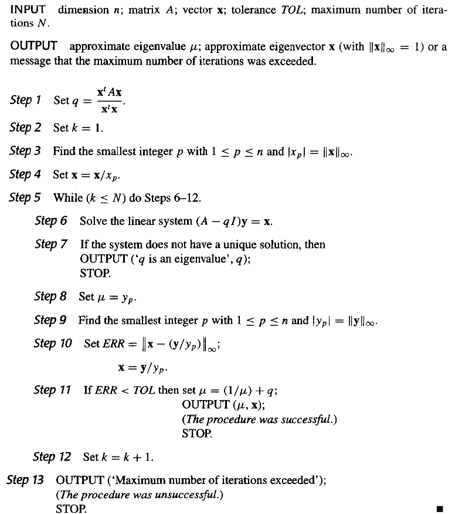

# Chapter 9 逼近特征值 | Approximating Eigenvalues

## 9.2 幂法 | Power Method

幂法是用来确定矩阵的主特征值（即，绝对值最大的特征值）和对应的特征向量的一种方法。

### 基本思想

设$\mathbf{A}$是一个$n\times n$的矩阵，且恰有一个特征值$\lambda_1$的绝对值最大
有$n$个特征值$\lambda_1,\lambda_2,\cdots,\lambda_n$($|\lambda_1|>|\lambda_2|\geq\cdots\geq|\lambda_n|$)，对应的特征向量为$\mathbf{v}_1,\mathbf{v}_2,\cdots,\mathbf{v}_n$，则任意一个非零向量$\mathbf{x}^{(0)}$都可以表示为这$n$个特征向量的线性组合，记$\beta_j$为常数，则

$$\mathbf{x}^{(0)}=\sum\limits_{j=1}\limits^n\beta_j\mathbf{v}_j$$

!!! note ""
    $\mathbf{x}^{(0)} \neq 0$，且$(\mathbf{x}^{(0)},\mathbf{v}_1)\neq 0$，否则：因为我们无法确保对于任意的初始向量$\mathbf{x}^{(0)}$都有$\beta_1\neq 0$，所以迭代的结果可能不是$\mathbf{v}_1$，而是满足 $(\mathbf{x}^{(0)},\mathbf{v}_m)\neq 0$ 的第一个向量$\mathbf{v}_m$，相应地，得到的特征值为 $\lambda_m$ 。

等式两边同时左乘$\mathbf{A},\mathbf{A}^2,\cdots,\mathbf{A}^k$，得到

$$\begin{aligned}
\mathbf{x}^{(1)}=\mathbf{A}\mathbf{x}&=\sum\limits_{j=1}\limits^n\beta_j\mathbf{A}\mathbf{v}_j=\sum\limits_{j=1}\limits^n\beta_j\lambda_j\mathbf{v}_j\\
\mathbf{x}^{(2)}=\mathbf{A}^2\mathbf{x}&=\sum\limits_{j=1}\limits^n\beta_j\mathbf{A}^2\mathbf{v}_j=\sum\limits_{j=1}\limits^n\beta_j\lambda_j^2\mathbf{v}_j\\
&\vdots\\
\mathbf{x}^{(k)}=\mathbf{A}^k\mathbf{x}&=\sum\limits_{j=1}\limits^n\beta_j\mathbf{A}^k\mathbf{v}_j=\sum\limits_{j=1}\limits^n\beta_j\lambda_j^k\mathbf{v}_j=\lambda_1^k\sum\limits_{j=1}\limits^n\beta_j(\frac{\lambda_j}{\lambda_1})^k\mathbf{v}_j
\end{aligned}$$

所以

$$\lim\limits_{k\to\infty}\mathbf{A}^k\mathbf{x}=\lim\limits_{k\to\infty}\lambda_1^k\sum\limits_{j=1}\limits^n\beta_j(\frac{\lambda_j}{\lambda_1})^k\mathbf{v}_j=\lim\limits_{k\to\infty}\beta_1\lambda_1^k\mathbf{v}_1$$

如果$|\lambda_1|<1$，则$\lim\limits_{k\to\infty}\mathbf{A}^k\mathbf{x}=0$，即$\mathbf{x}$收敛到0向量。如果$|\lambda_1|>1$，则序列发散。

对足够大的$k$，$\mathbf{x}^{(k)},\mathbf{x}^{(k-1)}$可以近似地表示为

$$\mathbf{x}^{(k)}\approx\beta_1\lambda_1^k\mathbf{v}_1, \quad\mathbf{x}^{(k-1)}\approx\beta_1\lambda_1^{k-1}\mathbf{v}_1\quad
\Rightarrow\quad\frac{\mathbf{x}^{(k)}}{\mathbf{x}^{(k-1)}}\approx\lambda_1$$

所以，我们可以通过迭代$\mathbf{x}^{(k)}=\mathbf{A}\mathbf{x}^{(k-1)}$来逼近$\lambda_1$。

#### 归一化

实际计算时，为了避免计算过程中出现绝对值过大或过小的数参加运算，通常在每步迭代时，将向量“归一化”即用的按模最大的分量。

我们需要对$\mathbf{x}^{(k)}$进行归一化，使得$\|\mathbf{x}^{(k)}\|_\infty=1$，即

$$\mathbf{u}^{(k-1)}=\frac{\mathbf{x}^{(k-1)}}{\|\mathbf{x}^{(k-1)}\|_\infty},\quad \mathbf{x}^{(k)}=\mathbf{A}\mathbf{u}^{(k-1)}\\
\Rightarrow \mathbf{u}^{(k)}=\frac{\mathbf{x}^{(k)}}{\|\mathbf{x}^{(k)}\|_\infty},\quad \lambda_1\approx\frac{\mathbf{x}_{i}^{(k)}}{\mathbf{u}_{i}^{(k-1)}}=\|\mathbf{x}^{(k)}\|_\infty$$

### 伪代码

!!! note ""
    - 对唯一的主特征值$\lambda_1$，如果其重数大于1，则幂法仍然有效
    - 如果$\lambda_1=-\lambda_2$，则幂法失效
    - 因为我们无法确保对于任意的初始向量$\mathbf{x}^{(0)}$都有$\beta_1\neq 0$，所以迭代的结果可能不是$\mathbf{v}_1$，而是满足 $(\mathbf{x}^{(0)},\mathbf{v}_m)\neq 0$ 的第一个向量$\mathbf{v}_m$，相应地，得到的特征值为 $\lambda_m$ 。
    - Aitken's $\Delta^2$ 可以加速收敛

### 收敛速度

因为$\mathbf{x}^{(k)}=\lambda_1^k\sum\limits_{j=1}\limits^n\beta_j(\frac{\lambda_j}{\lambda_1})^k\mathbf{v}_j$，假设$\lambda_1>\lambda_2\geq\cdots\geq\lambda_n$，且$|\lambda_2|\geq |\lambda_n|$，则我们的目标就是让$\frac{\lambda_2}{\lambda_1}$尽可能小，这样收敛速度更快。

记$\mathbf{B}=\mathbf{A}-p\mathbf{I}$，其中$p=\frac{\lambda_2+\lambda_n}{2}$，则$\mathbf{B}$的特征值为$\lambda_1-p,\lambda_2-p,\cdots,\lambda_n-p$，因为$|\frac{\lambda_2-p}{\lambda_1-p}|<|\frac{\lambda_2}{\lambda_1}|$，所以此时$\mathbf{B}$的收敛速度更快。

但是我们并不知道$\lambda_2$和$\lambda_n$，所以这不一定是一个好的选择。

### 反幂法 | Inverse Power Method

反幂法一般是用来确定$\mathbf{A}$中与特定数$q$最接近的特征值，即$\lambda_i\approx q$。
此时对任意的$j\neq i$，有

$$|\lambda_i-q|\ll|\lambda_j-q|$$

根据刚刚在收敛速度中的分析，可知：此时 $(\mathbf{A}-q\mathbf{I})^{-1}$ 的主特征值凸显出来了，可以更快地收敛到 $\frac{1}{\lambda_i-q}$。

其伪代码为：

