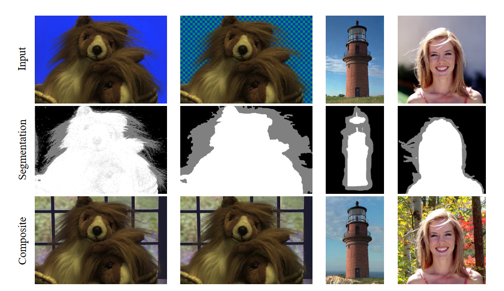

# 抠像算法

## Bayesian Matting

[论文： A Bayesian Approach to Digital Matting](https://grail.cs.washington.edu/projects/digital-matting/image-matting/)

[Implementation](https://people.csail.mit.edu/mrub/bayesmat/index.html)

[知乎读论文笔记](https://zhuanlan.zhihu.com/p/458797699)

## Closed Form Matting

Matting 是个ill posed 问题: 7 个未知量， 但 每个pixel仅有 3 个约束。

解析解，更好地处理了ill posed问题。

[论文：A Closed-Form Solution to Natural Image Matting](https://ieeexplore.ieee.org/stamp/stamp.jsp?tp=&arnumber=4359322)