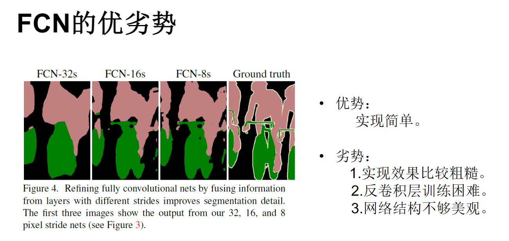
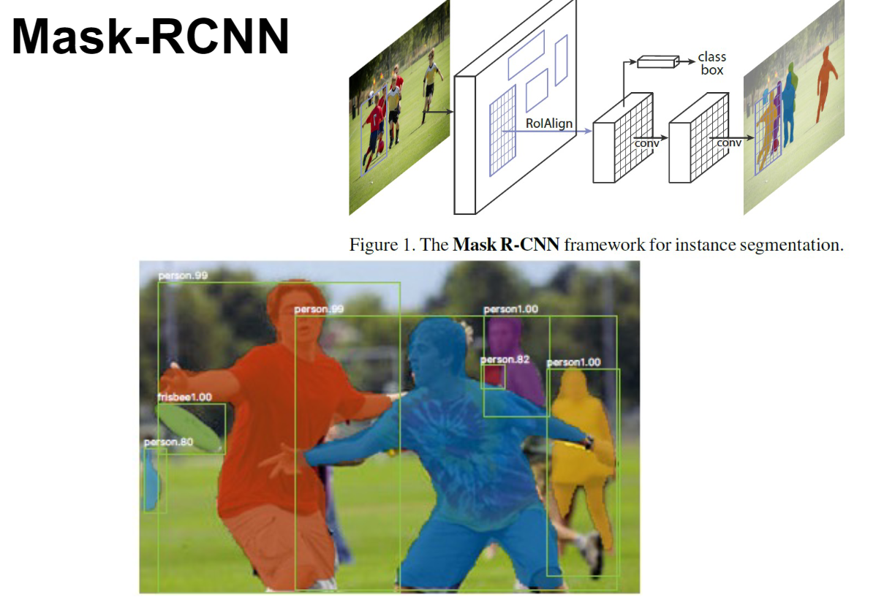

# 基于深度学习的图像分割

> [Fully Convolutional Networks for Semantic Segmentation, Jonathan Long, Evan Shelhamer, Trevor Darrell，CVPR 2015](https://arxiv.org/abs/1411.4038)

深度学习将图像分割从普通分割提升到了语义分割，即将图像中的每个像素分配到一个类别中。

## 网络结构

### FCN | Fully Convolutional Networks

全卷积网络可以有效地学习对语义分割等每像素任务进行密集预测。

将全连接层转换为卷积层使分类网络能够输出热图。

### DeconvNet

> Learning Deconvolution Network for Semantic Segmentation，Hyeonwoo Noh, Seunghoon Hong, Bohyung Han，CVPR 2015

### SegNet

> SegNet: A Deep Convolutional Encoder-Decoder Architecture for Robust Semantic Pixel-Wise Labelling，Vijay Badrinarayanan, Ankur Handa, Roberto Cipolla，CVPR 2015

### PSPNet | Pyramid Scene Parsing Network

> Pyramid Scene Parsing Network， Hengshuang Zhao, Jianping Shi, Xiaojuan Qi, Xiaogang Wang, Jiaya Jia，CVPR 2017

### FPN | 特征金字塔网络

### Mask-RCNN

> Mask-RCNN, Kaiming He,Georgia Gkioxari,Piotr Doll´ar,Ross Girshick,arxiv 1703.06870

### 框架总结

1. 整体网络由一个下采样过程与一个上采样过程搭建。（卷积、反卷积）
2. 网络使用多尺度的特征进行融合。（特征金字塔网络）
3. 最终获得像素级别的图像分割：对每一个像素点进行判断类别。

## Segment Anything

> https://arxiv.org/abs/2304.02643 好新的论文

### 关键组件

#### 1. 任务

#### 2. 模型

#### 3. 数据

