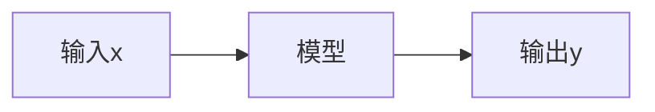

# Lec05 深度学习

!!! note ""
    周晓巍老师过来上的第一门课

!!! note "课程大纲"
    - Machine learning
    - Linear classifier
    - Neural networks
    - Convolutional neural networks
    - Training neural networks
    - Network architectures

## Machine Learining

### What is machine learning

传统编程 | Traditional programming

机器学习 | Machine learning

#### 模型 | Model

用于描述输入x和输出y之间关系的数学模型。

> 模型其实就是**函数**

##### 问题分类

- 回归（Regression）：输出 $y$ 是连续的。
- 分类（Classification）：输出 $y$ 是离散的。

### What is supervised learning

从有标签的数据中学习模型。

- **Training**: given labeled data, find $f_W$ (**model fitting**)
- **Testing**: given $f_W$ and a new $x$, find $y$ (also called **inference**)

!!! note "A simple example - Linear regression"

    

    - What is the model?
        - 线性表达式
    - Why is it called regression?
        - $y$ 是连续的
    - What is the training algorithm?
        - 最小二乘法

### How to solve a problem

#### 总流程 | General pipeline

- Modeling: describe the problem by a mathematical model
- Training: find the optimal model parameters (model fitting)
- Testing: apply the trained model to new data

分类是基于数据驱动的方法。

1. **收集数据集**：首先，你需要一个包含图像和对应标签的数据集。图像是我们的输入，标签描述了我们想从图像中获取的信息。例如，在一个狗的品种分类任务中，图像将是狗的图像，标签将是狗的品种。
2. **使用机器学习训练分类器**：这个步骤涉及到选择一个机器学习模型（例如：决策树、神经网络或支持向量机等）并使用我们的数据集来训练它。模型将学习识别输入图像的特性，并学习如何将它们与特定的标签相关联。
3. **在新图像上评估分类器**：在这个阶段，我们在训练完模型后，使用一些模型未见过的图像（测试集）来评估模型的性能。这通常涉及到计算一些评价指标，如精度（accuracy）、召回率（recall）或F1值等。

## Image classification

老师的Slide从下面摘的

[Slide1](https://web.eecs.umich.edu/~justincj/slides/eecs498/WI2022/598_WI2022_lecture02.pdf)
[Slide2](https://web.eecs.umich.edu/~justincj/slides/eecs498/WI2022/598_WI2022_lecture03.pdf)

### Linear classifier

!!! note ""
    输入：猫猫的图片，输出：类别是猫。
    

An Image classifier is hard to define

- Unlike e.g. sorting a list of numbers
- No obvious way to hard-code the algorithm for recognizing a cat or other classes

!!! note "矩阵内积什么时候最大？"
    在这列和图像数据很像的时候。所以分类器就是找和图像最相近的那列，得到最大值，输出为分类结果。

!!! note "在图像分类时为什么不能用最小二乘？"
    因为通过线性分类器得到的数并不是一个介于0~1的数，而可能无穷大或无穷小。这可能导致误差太大，即使是对的预测。

### Softmax function

所以我们将其转化为介于0~1的数，表现为概率。

### Cross-entropy loss

## Neural networks

### Perceptron

对线性分类器来说，其图形化表述为：

但很多时候，我们的数据可能不能被线性分割

### Activation function

为了可适应非线性性数据，我们可以添加一个非线性转换 $\sigma$，这被称作 激活函数（activation function）。例如 ReLU 和 Sigmoid。

### Neural networks – multi-layer perceptron

多分类问题

!!! note " What will happen if there is no activation functions?"
    这样就和一层的线性分类器没有区别了

#### Deep Neural networks

深度神经网络就是有很多层的神经网络，可以表示更复杂的函数

!!! note "层数越多越好吗？"
    1. 参数越多意味着需要学习更多
        需要更多的数据
    2. 训练变得更加困难
        “梯度消失”

        !!! note ""
            梯度消失问题（Vanishing Gradient Problem）是神经网络，尤其是深层神经网络在训练过程中常见的一个问题。它指的是在神经网络的训练过程中，当误差梯度（gradient）被反向传播回网络的输入层时，梯度的值变得非常小，甚至接近于零，导致网络权重的更新非常缓慢或者几乎不更新，这使得网络很难继续学习或者完全无法收敛到一个好的解。

### Fully connected layer | 全连接层

全连接层具有大量的权重。其表达式为 $f(x)=\sigma(Wx+b)$

- 深度网络通常具有许多层和潜在的百万参数。

!!! note "如果参数过多会导致什么问题？"

    需要越多的训练数据，训练难度大

!!! note "如何减少参数数量？"

    卷积神经网络

## Convolutional neural networks

### CNN

CNN = a multi-layer neural network with convolution layers

我们可以通过局部特征来推断图像，并**不需要全连接**。

!!! note ""

    我们可以通过猫猫的局部特征看出来这是猫猫

    

此时，我们的权重数量下降，如下图：

这里三个权重是共享的。

!!! note ""
    局部连接 + 权重共享 = 卷积！

图片中的过程可以表述为 

$$
y=\sigma(x\otimes w+b)
$$

### Convolution

#### 2D convolution

> 这里的 Size 指的是边长
> $5-3+1 = 3$

#### Padding & stride

- **Padding**: adding zero pixels around the border

- **Stride**: step size larger than 1 in convolution（如果为2，就是做一次，跳过一个再做）

> Output :(ImageSize – FilterSize + Padding * 2) / Stride + 1

!!! note "Padding = 1, Stride = 2"
    

    $OutputSize = (5-3+1*2)/2+1 =3$ 

#### RGB-3通道卷积

可以分别卷积

也可以用三通道的卷积核进行卷积：

!!! note "参数量真的比全连接少了很多"
    本来要3072，现在要 $5*5*3+1=76$个，这里的 $1$ 意味着偏置量。

### Layer types

!!! note ""
    卷积层（Convolutional Layers）：卷积层是CNN的核心。它使用卷积核（也称为过滤器）来提取输入数据中的特征，例如图像中的边缘、纹理等。卷积操作有助于减少参数数量，从而提高网络的计算效率和泛化能力。

    池化层（Pooling Layers）：池化层用于降低卷积层输出的空间分辨率，同时保留关键信息。常见的池化操作包括最大池化和平均池化。

    全连接层（Fully Connected Layers）：全连接层位于CNN的顶部，通常用于分类任务。这是我们将要深入探讨的层级。

#### Convolutional layer (including activation function)

- Input: image
- Output: feature map (activation map)
- Parameters: filter

可以不止做一次卷积，得到多个特征图。

为什么要多层呢？我们之前看猫猫，可以看猫猫的头，也可以看猫猫的脚，进行判断。我们可以不止判断一个特征，所以需要多层。

##### Convolution neural network(CNN)

##### Receptive fields | 感受野

卷积神经网络每一层输出的特征图（feature map）上的像素点映射回输入图像上的区域大小。通俗点的解释是，特征图上一点，相对于原图的大小，也是卷积神经网络特征所能看到输入图像的区域。

!!! note ""
    就是最右边的那一格像素和原图中多少像素有关。

    !!! note ""
        For successive convolution with $K$ kernel size and $L$ layers, the receptive field is $1 + L * (K – 1)$
    
    上图中 $K=3,L=3$ ，感受域为 $1+3*2=7$

#### Pooling layer

池化：将滤波器在不同位置的输出进行合并，用来整合特征。

{width=50%}

池化操作符有：最大池化，平均池化

!!! note "为什么要进行池化？"
    - 聚合空间信息
    - 使特征图变得更小、更易处理（更容易卷积了）

##### 加上 Pooling 的 CNN

#### Fully-connected layer

CNN最后要全连接层是因为全连接层能够整合卷积和池化层提取的特征，并将其映射到最终的输出类别。全连接层可以帮助网络学习特征之间的复杂关系，并最终对输入进行分类或回归预测。

## Training neural networks

训练：找到网络权重 $w$，使得真实训练标签 $y_i$ 和预测标签 $f_w(x_i)$ 之间的误差最小化，即  
  
$$  
L(w) = \frac{1}{n} \sum_{i=1}^{n} l(y_i, f_w(x_i))  
$$  
  
例如：  
- 对于回归问题使用 L2 损失  
- 对于分类问题使用交叉熵损失  

!!! note "怎么优化呢？"
    - 通过梯度下降进行最小化(前提是 $f$ 可微分)  
    - 这种训练方法称为**反向传播**(back-propagation)  

### Training CNN with gradient descent

#### Backpropagation

### Stochastic gradient descent | SGD

有时训练数据集太大，例如 ImageNet 中有数百万张图片，使用梯度下降的话，在每次迭代中计算所有图片的损失和梯度代价太高。

此时我们采用随机梯度下降——仅计算在随机抽取的一批图像上的损失和梯度

### 参数设置

炼丹调参调的就是这个

- **超参数**
    1. 使用多少层？
    2. 每层使用多少过滤器？
    3. 最佳的 batch 大小和学习率是多少？

- **我们如何设置它们？**
    1. 一个选择：尝试它们所有，并查看哪个效果最佳

#### 怎么判断预测的准确率？

- idea 1 太拟合自己的数据集了
- idea 2 太拟合 test 的数据集了
- idea 3 好，在train上训练，在validation上调参，在test上判断效果。

### Data augmentation

- **数据增强**：通过对训练数据进行随机变换，如旋转、翻转、缩放等，来生成更多的训练样本。这有助于提高模型的泛化能力，减少过拟合。

### Deep learning frameworks

- **TensorFlow**
- **PyTorch**
- **Caffe**

## Network architectures | 网络架构

### AlexNet

AlexNet 是一个深度卷积神经网络，由 Alex Krizhevsky、Ilya Sutskever 和 Geoffrey Hinton 设计。它是第一个在 ImageNet 数据集上取得成功的深度学习模型，赢得了 2012 年 ImageNet 大规模视觉识别挑战赛的冠军。

### ResNet

!!! note "为什么添加网络层数会导致性能下降？"
    - 观察到恒等映射，即 $f(x)=x$，在网络中的表现不佳

ResNet 是由微软研究院的 Kaiming He 等人提出的一种深度卷积神经网络架构。ResNet 通过引入残差模块（residual block）来解决深度神经网络训练过程中的梯度消失问题，使得网络可以**训练更深**。

现在，我们学的$F(x)$实际上是输入和输出的差值，即残差。

残差网络由多个残差块组成，每个残差块包含两个卷积层和一个跳跃连接。跳跃连接将输入直接添加到输出，从而使得网络可以学习残差映射。

## Why deep learning is powerful

深度学习是端到端的学习，不需要人工特征提取。

## Applications

### Semantic segmentation | 语义分割

#### Sliding window

Slide window 的方法：以像素为中心，取一个窗口，然后进行分类。

用 Slide window 的方法，效果不好：效率低，感受域小

#### Fully convolutional network | 全卷积网络

<!-- Make predictions all at once
• What is the loss function for training?
– Per-pixel cross-entropy
 -->
全卷积网络（FCN）：将全连接层替换为卷积层，使得网络可以接受任意大小的输入图像，并输出相同大小的预测图像。

这样做的好处是，我们可以一次性预测所有像素，而不是一个像素一个像素的预测。

### Object detection | 目标检测

输入：图像，输出：图像中的物体的Bounding Box（边界框）和类别

#### R-CNN

#### Faster R-CNN

#### YOLO

### Instance segmentation | 实例分割

#### Mask R-CNN

