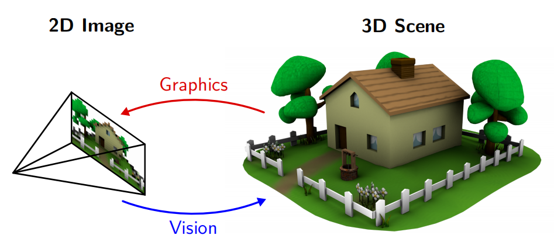

# 1 Computer Vision – Summer 2022

!!! note "说明"
    - 本课程主题：Introduction
    - 本课程概述：简单宏观了解计算机视觉的基本概念和应用。

## 1.1 Introduction

### 1.1.1 Artificial Intelligence

??? note "AI领域包括"
    - Machine Learning
    - Computer Vision
    - Computer graphics
    - Natural language processing
    - Robotics & Control
    - Art, Industry 4.0, Education

这些领域都是互相关联的。例如一个机器人系统，需要视觉、语言、控制等多个领域的知识。

### 1.1.2 Computer Vision

计算机视觉可以被非常一般地描述为将<u>光</u>转换为<u>意义</u>。这个意义可以是几何(geometry)，用几何或语义(semantics)来重建场景，识别我们所看到的某些方面。计算机视觉接收到的作为输入的是对光图像(light pattern)的采样(sample)。

!!! note "主要任务："
    - 三维重建 / Reconstruction
    - 图像理解 / Understanding
    - 图像合成 / Synthesis

### 1.1.3 Computer Vision vs. Computer Graphics

- 在<u>计算机图形学</u>中，给定由物体、材料、某些语义姿态和运动组成的三维场景，我们关心的是如何渲染该场景逼真的二维图像。
- 在<u>计算机视觉</u>中，我们试图反过来解决问题。这就是为什么有时我们也说这是逆图形(inverse graphic)。

### 1.1.4 Computer Vision vs. Image Processing

- <u>图像处理</u>是对图像进行操作，图像处理涉及到对图像的低水平操作，如颜色调整、边缘检测、去噪、图像扭曲和图像变形等。**这一切都发生在2D环境中。**
- <u>计算机视觉</u>关注的是获得一个更整体的场景表示和场景理解。特别是恢复世界的底层**三维结构**，这在图像处理正在处理的二维表示中是不存在的。

### 1.1.5 Computer Vision vs. Machine Learning

- <u>机器学习</u>是一种方法，它允许计算机从数据中学习，而不是通过明确编程来执行任务。机器学习的目标是让计算机能够自动学习，而不是明确地编程。
- <u>计算机视觉</u>是一种应用，它使用机器学习方法来解决计算机视觉问题。计算机视觉的目标是让计算机能够看到，理解和解释视觉世界。

### 1.1.6 学术圈概况

CV 领域的几个顶会

- CVPR (Computer Vision and Pattern Recognition)
- ICCV (International Conference on Computer Vision)
- ECCV (European Conference on Computer Vision)
