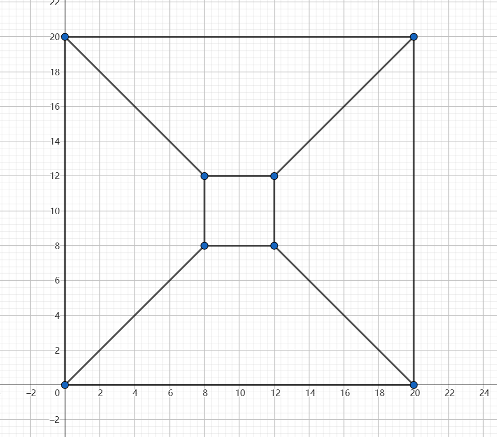
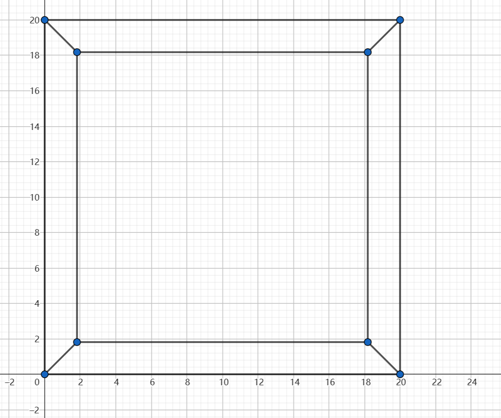

# 1.1 Pen and Paper

!!! note "Homogeneous Coordinates"

    ??? question "a) Proof that in homogeneous coordinates, the intersection point $\tilde{x}$ of the two lines $\tilde{l}_1$ and $\tilde{l}_2$ is given by $\tilde{x} = \tilde{l}_1 \times \tilde{l}_2$."

        Proof:

        假设两条直线分别为$\tilde{l}_1 = (a_1, b_1, c_1)^T$和$\tilde{l}_2 = (a_2, b_2, c_2)^T$，则
        
        $$
        \begin{aligned}
        & \tilde{l}_1 \times \tilde{l}_2 \\
        =& \begin{pmatrix} a_1 \\ b_1 \\ c_1 \end{pmatrix} \times \begin{pmatrix} a_2 \\ b_2 \\ c_2 \end{pmatrix} \\
        =& \begin{pmatrix} b_1c_2 - b_2c_1 \\ a_2c_1 - a_1c_2 \\ a_1b_2 - a_2b_1 \end{pmatrix}
        \end{aligned}
        $$
        
        由于$\tilde{x}$是直线$\tilde{l}_1$和$\tilde{l}_2$的交点，因此$\tilde{x}$必然同时满足直线$\tilde{l}_1$和$\tilde{l}_2$的方程，即：
        
        $$
        \begin{aligned}
        a_1x + b_1y + c_1 &= 0 \\
        a_2x + b_2y + c_2 &= 0
        \end{aligned}
        $$
        
        解这个方程组，得到：
        
        $$
        x = \frac{b_1c_2 - b_2c_1}{a_1b_2 - a_2b_1}, y = \frac{a_2c_1 - a_1c_2}{a_1b_2 - a_2b_1}
        $$
        
        所以$\tilde{x} = (x, y, 1)^T = \tilde{l}_1 \times \tilde{l}_2$。

    ??? question "b) Similarly, proof that the line that joins two points $\tilde{x}_1$ and $\tilde{x}_2$ is given by $\tilde{l} = \tilde{x}_1 \times \tilde{x}_2$."

        Proof:
        
        假设两个点分别为$\tilde{x}_1 = (x_1, y_1, 1)^T$和$\tilde{x}_2 = (x_2, y_2, 1)^T$，则
        
        $$
        \begin{aligned}
        & \tilde{x}_1 \times \tilde{x}_2 \\
        =& \begin{pmatrix} x_1 \\ y_1 \\ 1 \end{pmatrix} \times \begin{pmatrix} x_2 \\ y_2 \\ 1 \end{pmatrix} \\
        =& \begin{pmatrix} y_1 - y_2 \\ x_2 - x_1 \\ x_1y_2 - x_2y_1 \end{pmatrix}
        \end{aligned}
        $$
        
        由于$\tilde{l}$是点$\tilde{x}_1$和$\tilde{x}_2$的连线，因此$\tilde{l}$必然同时满足点$\tilde{x}_1$和$\tilde{x}_2$的方程，即：
        
        $$
        \begin{aligned}
        x_1x + y_1y + 1 &= 0 \\
        x_2x + y_2y + 1 &= 0
        \end{aligned}
        $$
        
        解这个方程组，得到：
        
        $$
        x = \frac{y_1 - y_2}{x_2y_1 - x_1y_2}, y = \frac{x_2 - x_1}{x_2y_1 - x_1y_2}
        $$
        
        所以$\tilde{l} = (x, y, 1)^T = \tilde{x}_1 \times \tilde{x}_2$。

    ??? question "c) You are given the following two lines:$\\ \mathbf{l}_1=\{(x,y)|x+y+3=0\}\\\mathbf{l}_2=\{(x,y)|-x-2y+7=0\}\\$. First, find the intersection point of the two lines by solving the system of linear equations. $\\$Next write the lines using homogeneous coordinates and calculate the intersection point using the cross product. Do you obtain the same intersection point?"

        Solution:
        
        - **First**: 解方程组,解得$\mathbf{l}_1$和$\mathbf{l}_2$的交点为$(-13,10)$。

        - **Next**: 用齐次坐标表示直线$\mathbf{l}_1$和$\mathbf{l}_2$，并计算交点. $(1,1,3)^T \times (-1,-2,7)^T = (13,-10,-1)\sim(-13,10,1)$，与上面的结果一致。

    ??? question "d)  Write down the line whose normal vector is pointing into the direction $(3, 4)^T$ and which has a distance of 3 from the origin."

        Note: normal vector的意思是法向量。
        
        Solution:
        
        单位化$(3,4)^T$得到$(\frac{3}{5},\frac{4}{5})^T$，所以直线的vector为$(\frac{3}{5},\frac{4}{5},3)^T$，直线的方程为$\frac{3}{5}x + \frac{4}{5}y + 3 = 0$。

    ??? question "e) What distance from the origin and what (normalized) normal vector does the homogeneous line $\tilde{l} = (2,5,\frac{\sqrt{29}}{5})^T$ have?"

        Solution:
        
        $$\tilde{l} = (2,5,\frac{\sqrt{29}}{5})^T = (\frac{2}{\sqrt{29}},\frac{5}{\sqrt{29}},\frac{1}{5})^T$$
        
        So the distance from the origin is $\frac{1}{5}$, and the normal vector is $(\frac{2}{\sqrt{29}},\frac{5}{\sqrt{29}})^T$.

!!! note "Transformations"

    ??? question "a) Write down the $2 × 3$ translation matrix which maps $(1, 2)^T$ onto $(0, 3)^T$."

        Solution:
        
        根据Translation的表达式：
        
        $$\mathbf{x}'=\mathbf{x}+\mathbf{t} \Leftrightarrow \begin{pmatrix}x'\\y'\\1\end{pmatrix}=\begin{bmatrix}1&0&t_x\\0&1&t_y\\0&0&1\end{bmatrix}\begin{pmatrix}x\\y\\1\end{pmatrix} \Leftrightarrow \mathbf{\overline{x}}'=\begin{bmatrix}\mathbf{I}&\mathbf{t}\\\mathbf{0}^T&1\end{bmatrix}\mathbf{\overline{x}}$$
        
        容易得出该矩阵为：
        
        $$\begin{bmatrix}1&0&-1\\0&1&1\\0&0&1\end{bmatrix}$$
        
        写成$2\times3$的形式为：
        
        $$\begin{bmatrix}1&0&-1\\0&1&1\end{bmatrix}$$

    ??? question "b)Let’s assume that you are given $N$ 2D correspondence pairs $(\mathbf{x}_i,\mathbf{y}_i)=\begin{pmatrix}{\begin{pmatrix}x^i_1\\x^i_2\end{pmatrix}},{\begin{pmatrix}y^i_1\\y^i_2\end{pmatrix}}\end{pmatrix}$,where $i = 1, . . . , N$.Find the $2 × 3$ translation matrix mapping $x_i$ onto $y_i$ which is optimal in the least square sense."

        Solution:
        
        构造函数:
        
        $$E(\mathbf{T})=\sum_{i=1}^N\|\mathbf{y}_i-\mathbf{T}\mathbf{x}_i\|^2_2$$
        
        现在就是要找出使得$E(\mathbf{T})$最小的$\mathbf{T}$。
        
        因为题干说的是translation，所以$\mathbf{T}$的形式为：
        
        $$\mathbf{T}=\begin{bmatrix}1&0&t_x\\0&1&t_y\end{bmatrix}$$
        
        代入$E(\mathbf{T})$，得到：

        $$\begin{aligned}
        E(\mathbf{T}) &= \sum_{i=1}^N\|\mathbf{y}_i-\begin{bmatrix}1&0&t_x\\0&1&t_y\end{bmatrix}\mathbf{x}_i\|^2_2 \\
        &= \sum_{i=1}^N\|\begin{pmatrix}y^i_1-t_x-x^i_1\\y^i_2-t_y-x^i_2\end{pmatrix}\|^2_2 \\
        &= \sum_{i=1}^N(y^i_1-t_x-x^i_1)^2+(y^i_2-t_y-x^i_2)^2
        \end{aligned}$$

        分别对$t_x$和$t_y$求导，令导数为0，得到：

        $$\begin{cases}
        \frac{\partial E(\mathbf{T})}{\partial t_x} = 2\sum_{i=1}^N(y^i_1-t_x-x^i_1) = 0 \\
        \frac{\partial E(\mathbf{T})}{\partial t_y} = 2\sum_{i=1}^N(y^i_2-t_y-x^i_2) = 0
        \end{cases}$$

        所以：

        $$\begin{cases}
        t_x = \frac{1}{N}\sum_{i=1}^N(y^i_1-x^i_1) \\
        t_y = \frac{1}{N}\sum_{i=1}^N(y^i_2-x^i_2)
        \end{cases}$$

        可见，最优的$\mathbf{T}$就是：

        $$\mathbf{T}=\begin{bmatrix}1&0&\frac{1}{N}\sum_{i=1}^N(y^i_1-x^i_1)\\0&1&\frac{1}{N}\sum_{i=1}^N(y^i_2-x^i_2)\end{bmatrix}$$

        也就是说，最优的$\mathbf{T}$就是所有$\mathbf{T}_i$的平均值，其中$\mathbf{T}_i$是将$\mathbf{x}_i$映射到$\mathbf{y}_i$的translation matrix。

    ??? question "c) You are given the following three correspondence pairs: $\begin{pmatrix}{\begin{pmatrix}0\\1\end{pmatrix},\begin{pmatrix}3\\-5\end{pmatrix}}\end{pmatrix}\begin{pmatrix}{\begin{pmatrix}5\\7\end{pmatrix},\begin{pmatrix}7\\6\end{pmatrix}}\end{pmatrix}\begin{pmatrix}{\begin{pmatrix}4\\1\end{pmatrix},\begin{pmatrix}5\\-4\end{pmatrix}}\end{pmatrix}$. Using your derived equation, calculate the optimal 2 × 3 translation matrix $\mathbf{T}^*$."

        Solution:
        
        由上一问的结论，可知：
        
        $$\mathbf{T}^*=\begin{bmatrix}1&0&\frac{3+2+1}{3}\\0&1&\frac{-6-1-5}{3}\end{bmatrix}=\begin{bmatrix}1&0&2\\0&1&-4\end{bmatrix}$$

!!! note "Camera Projections"

    ??? question "a) Calculate the full rank $4 × 4$ projection matrix $\tilde{P}$ for the following scenario:$\\$- The camera pose consists of a $90°$ rotation around the $x$ axis and translation of $(1, 0, 2)^T$.$\\$- The focal lengths $f_x, f_y$ are $100$.$\\$- The principal point $(c_x, c_y)^T$ is $(25, 25)^T$."

        Note:

        - Full rank projection matrix是$\begin{bmatrix}\mathbf{K}&\mathbf{0}\\\mathbf{0}^T&1\end{bmatrix}\begin{bmatrix}\mathbf{R}&\mathbf{t}\\\mathbf{0}^T&1\end{bmatrix}$的形式
        - $\mathbf{K}$是内参矩阵，$\mathbf{K}=\begin{bmatrix}f_x&s&c_x\\0&f_y&c_y\\0&0&1\end{bmatrix}$
        - $\mathbf{R}$是旋转矩阵
        - 绕$x$轴旋转的矩阵形式为$\begin{bmatrix}1&0&0\\0&\cos\theta&-\sin\theta\\0&\sin\theta&\cos\theta\end{bmatrix}$
        - 绕$y$轴旋转的矩阵形式为$\begin{bmatrix}\cos\theta&0&\sin\theta\\0&1&0\\-\sin\theta&0&\cos\theta\end{bmatrix}$
        - 绕$z$轴旋转的矩阵形式为$\begin{bmatrix}\cos\theta&-\sin\theta&0\\\sin\theta&\cos\theta&0\\0&0&1\end{bmatrix}$
        - $\mathbf{t}$是平移向量
        
        Solution:

        依题意，可知：
        
        $$\mathbf{K}=\begin{bmatrix}100&0&25\\0&100&25\\0&0&1\end{bmatrix}$$
        
        $$\mathbf{R}=\begin{bmatrix}1&0&0\\0&0&-1\\0&1&0\end{bmatrix}$$
        
        $$\mathbf{t}=\begin{bmatrix}1\\0\\2\end{bmatrix}$$
        
        所以：
        
        $$\begin{aligned}
        \tilde{P} &= \begin{bmatrix}\mathbf{K}&\mathbf{0}\\\mathbf{0}^T&1\end{bmatrix}\begin{bmatrix}\mathbf{R}&\mathbf{t}\\\mathbf{0}^T&1\end{bmatrix} \\
        &= \begin{bmatrix}100&0&25&0\\0&100&25&0\\0&0&1&0\\0&0&0&1\end{bmatrix}\begin{bmatrix}1&0&0&1\\0&0&-1&0\\0&1&0&2\\0&0&0&1\end{bmatrix} \\
        &= \begin{bmatrix}100&25&0&150\\0&25&-100&50\\0&1&0&2\\0&0&0&1\end{bmatrix}
        \end{aligned}$$

    ??? question "b) For the previously defined projection, find the world point in inhomogeneous coordinates $\mathbf{x}_w$ which corresponds to the projected homogeneous point in screen space $\tilde{\mathbf{x}}_s = (25, 50, 1, 0.25)^T$."

        Solution:
        
        我们有：$\tilde{\mathbf{x}}_s = \tilde{P}\tilde{\mathbf{x}}_w$，所以：
        
        $$\tilde{\mathbf{x}}_w = \tilde{P}^{-1}\tilde{\mathbf{x}}_s$$
        
        经计算，得到$\tilde{P}^{-1}$为：
        
        $$\tilde{P}^{-1}=\frac{1}{100}\begin{bmatrix}1&0&-25&-100\\0&0&100&200\\0&-1&25&0\\0&0&0&100\end{bmatrix}$$
        
        所以：
        
        $$\tilde{\mathbf{x}}_w = \frac{1}{100}\begin{bmatrix}1&0&-25&-100\\0&0&100&200\\0&-1&25&0\\0&0&0&100\end{bmatrix}\begin{pmatrix}25\\50\\1\\0.25\end{pmatrix}=\begin{pmatrix}0.25\\1.5\\-0.25\\0.25\end{pmatrix}$$
        
        由$\tilde{\mathbf{x}}_w$的最后一维进行归一化，得到$\mathbf{x}_w$为：
        
        $$\mathbf{x}_w=\begin{pmatrix}1\\6\\-1\end{pmatrix}$$
        
    ??? question "c) Let’s perform our first projection of a geometric shape.  We define $\mathcal{C}_0$ as the cube centered at $\mathbf{c}_c = (0, 0, 15)^T$ with equal side lengths $s = 20$."

        ??? question "i) Project the $8$ corners of the cube $\mathcal{C}_0$ to the image plane for the pinhole camera with focal lengths $f_x = f_y = 5$ and the principal point $(c_x, c_y)^T = (10, 10)^T$. Draw the projected points and edges of the cube in a coordinate system on a paper."

            Solution:

            依题意：$\mathbf{K}=\begin{bmatrix}5&0&10\\0&5&10\\0&0&1\end{bmatrix}$，所以：$\mathbf{\tilde{x}}_s=\begin{bmatrix}\mathbf{K}&\mathbf{0}\end{bmatrix}\mathbf{\overline{x}}_c$。
            
            由于$\mathcal{C}_0$是一个正方体，所以它的8个顶点的坐标为：
            
            $$\begin{aligned}
            \mathbf{\overline{x}}_{c_1} &= \begin{pmatrix}-10\\-10\\5\\1\end{pmatrix}
            \mathbf{\overline{x}}_{c_2} = \begin{pmatrix}-10\\10\\5\\1\end{pmatrix}
            \mathbf{\overline{x}}_{c_3} = \begin{pmatrix}10\\10\\5\\1\end{pmatrix}
            \mathbf{\overline{x}}_{c_4} = \begin{pmatrix}10\\-10\\5\\1\end{pmatrix} \\
            \mathbf{\overline{x}}_{c_5} &= \begin{pmatrix}-10\\-10\\25\\1\end{pmatrix}
            \mathbf{\overline{x}}_{c_6} = \begin{pmatrix}-10\\10\\25\\1\end{pmatrix}
            \mathbf{\overline{x}}_{c_7} = \begin{pmatrix}10\\10\\25\\1\end{pmatrix}
            \mathbf{\overline{x}}_{c_8} = \begin{pmatrix}10\\-10\\25\\1\end{pmatrix}
            \end{aligned}$$
            
            经由$\mathbf{K}$的变换，得到：
            
            $$\begin{aligned}
            \mathbf{\tilde{x}}_{s_1} &= \begin{pmatrix}0\\0\\1\end{pmatrix}
            \mathbf{\tilde{x}}_{s_2} = \begin{pmatrix}0\\20\\1\end{pmatrix}
            \mathbf{\tilde{x}}_{s_3} = \begin{pmatrix}20\\20\\1\end{pmatrix}
            \mathbf{\tilde{x}}_{s_4} = \begin{pmatrix}20\\0\\1\end{pmatrix} \\
            \mathbf{\tilde{x}}_{s_5} &= \begin{pmatrix}8\\8\\1\end{pmatrix}
            \mathbf{\tilde{x}}_{s_6} = \begin{pmatrix}8\\12\\1\end{pmatrix}
            \mathbf{\tilde{x}}_{s_7} = \begin{pmatrix}12\\12\\1\end{pmatrix}
            \mathbf{\tilde{x}}_{s_8} = \begin{pmatrix}12\\8\\1\end{pmatrix}
            \end{aligned}$$
            
            

        ??? question "ii) Let’s move the cube further away from the pinhole camera along the $z$-axis such that the distance of the center of the new cube $\mathcal{C}_1$ is now $20$. Further, let’s zoom in with our camera such that the focal lengths are $f_x = f_y = 10$ and the principal point remains the same. Draw the projected points and edges of the cube in a coordinate system on a paper."

            Solution:

            依题意：$\mathbf{K}=\begin{bmatrix}10&0&10\\0&10&10\\0&0&1\end{bmatrix}$，所以：$\mathbf{\tilde{x}}_s=\begin{bmatrix}\mathbf{K}&\mathbf{0}\end{bmatrix}\mathbf{\overline{x}}_c$。

            由于$\mathcal{C}_1$是一个正方体，所以它的8个顶点的坐标为：

            $$\begin{aligned}
            \mathbf{\overline{x}}_{c_1} &= \begin{pmatrix}-10\\-10\\10\\1\end{pmatrix}
            \mathbf{\overline{x}}_{c_2} = \begin{pmatrix}-10\\10\\10\\1\end{pmatrix}
            \mathbf{\overline{x}}_{c_3} = \begin{pmatrix}10\\10\\10\\1\end{pmatrix}
            \mathbf{\overline{x}}_{c_4} = \begin{pmatrix}10\\-10\\10\\1\end{pmatrix} \\
            \mathbf{\overline{x}}_{c_5} &= \begin{pmatrix}-10\\-10\\30\\1\end{pmatrix}
            \mathbf{\overline{x}}_{c_6} = \begin{pmatrix}-10\\10\\30\\1\end{pmatrix}
            \mathbf{\overline{x}}_{c_7} = \begin{pmatrix}10\\10\\30\\1\end{pmatrix}
            \mathbf{\overline{x}}_{c_8} = \begin{pmatrix}10\\-10\\30\\1\end{pmatrix}
            \end{aligned}$$

            经由$\mathbf{K}$的变换，得到：

            $$\begin{aligned}
            \mathbf{\tilde{x}}_{s_1} &= \begin{pmatrix}0\\0\\1\end{pmatrix}
            \mathbf{\tilde{x}}_{s_2} = \begin{pmatrix}0\\20\\1\end{pmatrix}
            \mathbf{\tilde{x}}_{s_3} = \begin{pmatrix}20\\20\\1\end{pmatrix}
            \mathbf{\tilde{x}}_{s_4} = \begin{pmatrix}20\\0\\1\end{pmatrix} \\
            \mathbf{\tilde{x}}_{s_5} &= \begin{pmatrix}\frac{20}{3}\\\frac{20}{3}\\1\end{pmatrix}
            \mathbf{\tilde{x}}_{s_6} = \begin{pmatrix}\frac{20}{3}\\\frac{40}{3}\\1\end{pmatrix}
            \mathbf{\tilde{x}}_{s_7} = \begin{pmatrix}\frac{40}{3}\\\frac{40}{3}\\1\end{pmatrix}
            \mathbf{\tilde{x}}_{s_8} = \begin{pmatrix}\frac{40}{3}\\\frac{20}{3}\\1\end{pmatrix}
            \end{aligned}$$

            

        ??? question "iii) Let’s move it even further away along the $z$-axis while zooming in. Now, the distance of the center of cube $\mathcal{C}_2$ is $100$ and the focal lengths are $f_x = f_y = 90$. Draw the projected points and edges of the cube in a coordinate system on a paper."

            Solution:
            
            依题意：$\mathbf{K}=\begin{bmatrix}90&0&10\\0&90&10\\0&0&1\end{bmatrix}$，所以：$\mathbf{\tilde{x}}_s=\begin{bmatrix}\mathbf{K}&\mathbf{0}\end{bmatrix}\mathbf{\overline{x}}_c$。
            
            由于$\mathcal{C}_2$是一个正方体，所以它的8个顶点的坐标为：
            
            $$\begin{aligned}
            \mathbf{\overline{x}}_{c_1} &= \begin{pmatrix}-10\\-10\\90\\1\end{pmatrix}
            \mathbf{\overline{x}}_{c_2} = \begin{pmatrix}-10\\10\\90\\1\end{pmatrix}
            \mathbf{\overline{x}}_{c_3} = \begin{pmatrix}10\\10\\90\\1\end{pmatrix}
            \mathbf{\overline{x}}_{c_4} = \begin{pmatrix}10\\-10\\90\\1\end{pmatrix} \\
            \mathbf{\overline{x}}_{c_5} &= \begin{pmatrix}-10\\-10\\110\\1\end{pmatrix}
            \mathbf{\overline{x}}_{c_6} = \begin{pmatrix}-10\\10\\110\\1\end{pmatrix}
            \mathbf{\overline{x}}_{c_7} = \begin{pmatrix}10\\10\\110\\1\end{pmatrix}
            \mathbf{\overline{x}}_{c_8} = \begin{pmatrix}10\\-10\\110\\1\end{pmatrix}
            \end{aligned}$$
            
            经由$\mathbf{K}$的变换，得到：
            
            $$\begin{aligned}
            \mathbf{\tilde{x}}_{s_1} &= \begin{pmatrix}0\\0\\1\end{pmatrix}
            \mathbf{\tilde{x}}_{s_2} = \begin{pmatrix}0\\20\\1\end{pmatrix}
            \mathbf{\tilde{x}}_{s_3} = \begin{pmatrix}20\\20\\1\end{pmatrix}
            \mathbf{\tilde{x}}_{s_4} = \begin{pmatrix}20\\0\\1\end{pmatrix} \\
            \mathbf{\tilde{x}}_{s_5} &= \begin{pmatrix}\frac{20}{11}\\\frac{20}{11}\\1\end{pmatrix}
            \mathbf{\tilde{x}}_{s_6} = \begin{pmatrix}\frac{20}{11}\\\frac{200}{11}\\1\end{pmatrix}
            \mathbf{\tilde{x}}_{s_7} = \begin{pmatrix}\frac{200}{11}\\\frac{200}{11}\\1\end{pmatrix}
            \mathbf{\tilde{x}}_{s_8} = \begin{pmatrix}\frac{200}{11}\\\frac{20}{11}\\1\end{pmatrix}
            \end{aligned}$$
            
            

        ??? question "iv) Project the $8$ corners of the first cube $\mathcal{C}_0$ using an orthographic projection and add the principal point $\mathbf{c}_c = (10, 10)^T$ onto the obtained pixel coordinates to be in the same coordinate system as before. Draw the projected points and edges of the cube in a coordinate system on a paper."

            Solution:

            

        ??? question "v) When is the perspective projection most similar to the orthographic projection?"

            Solution:

            当焦距$f_x$和$f_y$趋近于无穷大时，透视投影就趋近于正交投影。

!!! note "Photometric Image Formation"

    ??? question "a) Write down the thin lens formula and calculate the focus distance $z_c$ in meters for focal length $f = 100mm$ and the distance to the image plane $z_s = 102mm$."

        Solution:

        the thin lens formula:
        
        $$\frac{1}{f}=\frac{1}{z_c}+\frac{1}{z_s}$$
        
        所以：
        
        $$z_c=\frac{z_sf}{z_s-f}=\frac{102\times100}{102-100}=5100mm=5.1m$$

    ??? question "b) Write the diameter of the circle of confusion $c$ as a function of the focal length $f$, the image plane distance $z_s$ as well as the distance $\Delta z_s$ and the f-number $N$."

        
        
        Solution:

        We have:
        
        $$\frac{c}{\Delta z_s}=\frac{d}{z_s},\quad N=\frac{f}{d}$$
        
        So
        
        $$c=\frac{d\Delta z_s}{z_s}=\frac{f\Delta z_s}{Nz_s}$$

    ??? question "c) Using your derived formula, calculate the diameter of the circle of confusion for the setting $f = 35mm, N = 1.4, z_s = 40mm$ when $\Delta z_s = 0.1mm$ as well as when $\Delta z_s = 0.03mm$. Assuming the camera uses a sensor of size $64mm^2$ and a pixel resolution of $400 × 400$ with squared pixels, are the calculated projections sharp or not?"

        Solution:

        $$c_1=\frac{f\Delta z_s}{Nz_s}=\frac{35\times0.1}{1.4\times40}=0.0625mm 
        $$

        $$
        c_2=\frac{f\Delta z_s}{Nz_s}=\frac{35\times0.03}{1.4\times40}=0.01875mm $$

        每个像素的面积为$\frac{64}{400\times400}=0.0004mm^2$，所以像素的边长为$\sqrt{0.0004}=0.02mm$。对比可知 $c_1$比像素的边长大，$c_2$比像素的边长小，所以$c_1$对应的投影不清晰，$c_2$对应的投影清晰。
