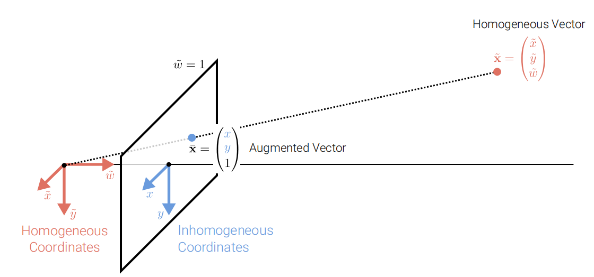
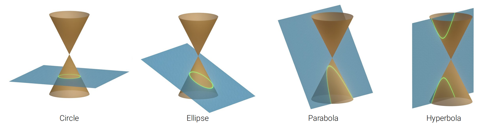
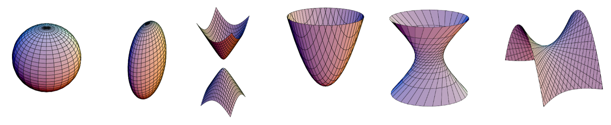
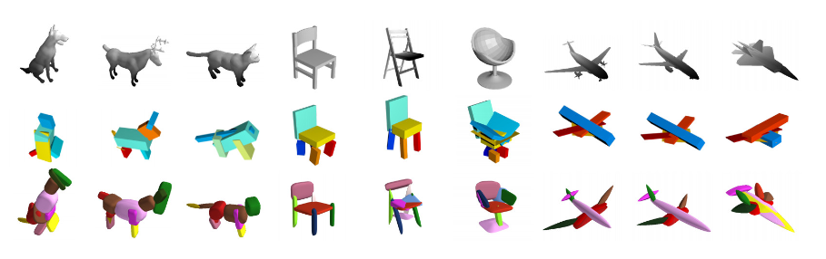
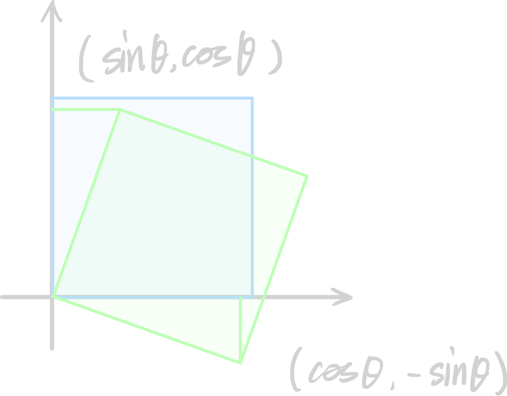

# 2.1 Primitives and Transformations

!!! note "单元概述"
    - 介绍了点、线和面在齐次坐标系下的表示。
    - 介绍了基本的转换。
    - 用DLT方法计算单应性矩阵。

## 2.1.1 2D Primitives

### 2D Points

**2D上的点** 可以用 **非齐次坐标(inhomogeneous coordinates)** 写成

$$\mathbf{x} =(x,y)^T\in \mathbb{R}^2$$

或者用 **齐次坐标(inhomogeneous coordinates)** 写成

$$\widetilde{\mathbf{x} } =\left(\widetilde{x},\widetilde{y},\widetilde{w}\right)^T\in \mathbb{P}^2$$

这里的 $\mathbb{P}^2=\mathbb{R}^2\backslash(0,0,0)$ 指的是**射影空间(projective space)**。$\widetilde{\mathbf{x}}$ 是**投影点(projective point)**。

!!! note "注意"
    - 齐次坐标的最后一个元素通常为1，但是也可以是其他值。
    - 波浪号(~)是齐次坐标的约定。
    - 齐次向量只定义到尺度(scale)。

??? question "为什么要用齐次坐标？"

    !!! note "1. 齐次坐标允许表达平行线的交点，无穷远的向量, "
         $\widetilde{w} = 0$ 的齐次点称为理想点(ideal points)或无穷远点(points at infinity)
    !!! note "2. 引入齐次坐标的作用，把各种变换都统一了起来，即：把缩放，旋转，平移等变换都统一起来，都表示成一连串的矩阵相乘的形式。保证了形式上的线性一致性。"
        例如：**仿射变换(Affine Transformations)** 主要包括两个部分，即线性变换和平移（换言之，仿射变换并不是线性变换），其数学表述为：
        
        $$\begin{bmatrix}x'\\y'\end{bmatrix}=
        \begin{bmatrix} 
            a & b \\ 
            c & d
        \end{bmatrix} 
        \begin{bmatrix} 
            x \\ 
            y 
        \end{bmatrix}
        +
        \begin{bmatrix} 
            t_x \\ 
            t_y 
        \end{bmatrix}$$

        为了让仿射变换也能写成 $a=Mb$ 的形式以简化运算，我们可以用 $n+1$ 维向量来表示 $n$ 维点，即使用**齐次坐标(homogenous coordinates)**：

        $$
        \begin{bmatrix}
            x'\\
            y'\\
            1
        \end{bmatrix}
        \cong
        \begin{bmatrix}
            a & b & t_x \\
            c & d & t_y \\
            0 & 0 & 1
        \end{bmatrix}
        \begin{bmatrix}
            x \\
            y \\
            1
        \end{bmatrix}
        $$

???+ note "齐次坐标添加的最后一个维度是什么意思？"

    其实就是用 $n+1$ 维空间中 从原点发出的一条 <u>射线</u> 来<u>描述</u> $n$ 维空间中的一个<u>点</u>。 

    引入这种想法后，我们就知道为什么通过齐次坐标化就能把平移变成线性变换——我们可以将 $n$ 维**点**的**平移**看作 $n+1$ 维**射线**的**旋转**，而旋转显然是一个线性变换。
    

**非齐次向量** $\mathbf{x}$ 可以这样转换为**齐次向量** $\widetilde{\mathbf{x}}$ :

$$\widetilde{\mathbf{x} }=\begin{pmatrix}\widetilde{x}\\\widetilde{y}\\\widetilde{w}\end{pmatrix}=\begin{pmatrix}x\\y\\1\end{pmatrix}=\begin{pmatrix}\mathbf{x}\\1\end{pmatrix}= \overline{\mathbf{x} }$$

我们称所有齐次向量的**增广向量(augmented vector)** ́$\overline{\mathbf{x} }$ 为最后一个坐标等于 1 的向量。

### 2D Lines

**2D 的线段** 也可以用齐次坐标表示为 $\mathbf{\widetilde{l}}=(a,b,c)^T$，我们用 $\mathbf{\widetilde{l}}$ 与点 $\mathbf{\overline{x}}$ 的内积为 $0$ 来表示点 $\mathbf{\overline{x}}$ 在线段 $\mathbf{\widetilde{l}}$ 上：

$$\{\mathbf{\overline{x}}|{\mathbf{\overline{x}}}^T\mathbf{\widetilde{l}}=0\} \Leftrightarrow (x,y,1)\begin{pmatrix}a\\b\\c\end{pmatrix}=0\Leftrightarrow \{x,y | ax+by+c=0\}$$

将 $\mathbf{\widetilde{l}}$ 标准化为 $\mathbf{\widetilde{l}}=(n_x,n_y,d)^T=(\mathbf{n},d)^T$，其中 $||\mathbf{n}||=n_x^2+n_y^2=1$。此时$\mathbf{n}$ 是 $\mathbf{\widetilde{l}}$ 的**法向量**(normal vector) ，$d$ 是 $\mathbf{\widetilde{l}}$ 到原点的距离.

和之前提到的无穷原点一样，我们也可以定义**无穷线(infinite line)** $\mathbf{\widetilde{l}}_{\infty}=(0,0,1)^T$，它包含所有的理想点(因为保证了$\widetilde{w}=0$)。

### 2D Line Arithmetic

???+ note "叉乘的另一种计算方式"
    $$\mathbf{a}\times \mathbf{b}=[\mathbf{a}]_{\times}\mathbf{b}=\begin{bmatrix}0&-a_3&a_2\\a_3&0&-a_1\\-a_2&a_1&0\end{bmatrix}\begin{bmatrix}b_1\\b_2\\b_3\end{bmatrix}= \begin{bmatrix}a_2b_3-a_3b_2\\a_3b_1-a_1b_3\\a_1b_2-a_2b_1\end{bmatrix}$$

在齐次坐标系中，我们可以用**叉乘(cross product)** 来表示两条线的交点：

$$\mathbf{\overline{x}}=\mathbf{\widetilde{l}}_1\times \mathbf{\widetilde{l}}_2$$

??? note "证明$\mathbf{\widetilde{l}}_1$和$\mathbf{\widetilde{l}}_2$的交点为$\mathbf{\widetilde{l}}_1\times \mathbf{\widetilde{l}}_2$"
    假设两条直线分别为$\tilde{l}_1 = (a_1, b_1, c_1)^T$和$\tilde{l}_2 = (a_2, b_2, c_2)^T$，记 $\overline{x}$ 为两条直线的交点，即：
    $$
    \begin{aligned}
    a_1x + b_1y + c_1 &= 0 \\
    a_2x + b_2y + c_2 &= 0
    \end{aligned}
    $$
    解这个方程组，得到：
    $$
    x = \frac{b_1c_2 - b_2c_1}{a_1b_2 - a_2b_1}, y = \frac{a_2c_1 - a_1c_2}{a_1b_2 - a_2b_1}
    $$
    计算两个直线的叉乘：
    $$
    \begin{aligned}
    & \tilde{l}_1 \times \tilde{l}_2 \\
    =& \begin{pmatrix} a_1 \\ b_1 \\ c_1 \end{pmatrix} \times \begin{pmatrix} a_2 \\ b_2 \\ c_2 \end{pmatrix} \\
    =& \begin{pmatrix} b_1c_2 - b_2c_1 \\ a_2c_1 - a_1c_2 \\ a_1b_2 - a_2b_1 \end{pmatrix}
    \end{aligned}
    $$

    所以$\overline{x} = \begin{pmatrix} \frac{b_1c_2 - b_2c_1}{a_1b_2 - a_2b_1} \\ \frac{a_2c_1 - a_1c_2}{a_1b_2 - a_2b_1} \\ 1 \end{pmatrix} \sim \begin{pmatrix} b_1c_2 - b_2c_1 \\ a_2c_1 - a_1c_2 \\ a_1b_2 - a_2b_1 \end{pmatrix} = \tilde{l}_1 \times \tilde{l}_2$。，即$\overline{x} = \tilde{l}_1 \times \tilde{l}_2$。
    
    $Q.E.D.$

!!! note "两条平行线的叉积"
    记两条平行线分别为$\tilde{l}_1 = (a_1, b_1, c_1)^T$和$\tilde{l}_2 = (a_2, b_2, c_2)^T$，则$a_1b_2 = a_2b_1$，叉积后第三个分量为0，满足之前的定义。

同样地，我们可以用叉乘来表示两个点落在的线段：

$$\mathbf{\widetilde{l}}=\mathbf{\overline{x}}_1\times \mathbf{\overline{x}}_2$$

??? note "证明$\mathbf{\overline{x}}_1$和$\mathbf{\overline{x}}_2$落在线段$\mathbf{\overline{x}}_1\times \mathbf{\overline{x}}_2$上"
    Proof:
    假设两个点分别为$\tilde{x}_1 = (x_1, y_1, 1)^T$和$\tilde{x}_2 = (x_2, y_2, 1)^T$，则
    $$
    \begin{aligned}
    & \tilde{x}_1 \times \tilde{x}_2 \\
    =& \begin{pmatrix} x_1 \\ y_1 \\ 1 \end{pmatrix} \times \begin{pmatrix} x_2 \\ y_2 \\ 1 \end{pmatrix} \\
    =& \begin{pmatrix} y_1 - y_2 \\ x_2 - x_1 \\ x_1y_2 - x_2y_1 \end{pmatrix}
    \end{aligned}
    $$
    由于$\tilde{l}$是点$\tilde{x}_1$和$\tilde{x}_2$的连线，因此$\tilde{l}$必然同时满足点$\tilde{x}_1$和$\tilde{x}_2$的方程，即：
    $$
    \begin{cases}
    x_1x + y_1y + 1 &= 0 \\
    x_2x + y_2y + 1 &= 0
    \end{cases}
    $$
    解这个方程组，得到：
    $$
    x = \frac{y_1 - y_2}{x_2y_1 - x_1y_2}, y = \frac{x_2 - x_1}{x_2y_1 - x_1y_2}
    $$
    所以$\tilde{l} = (x, y, 1)^T = \tilde{x}_1 \times \tilde{x}_2$。

### 2D Conics(二次曲线)

更复杂的代数对象可以使用多项式齐次方程(polynomial homogeneous equations)来表示。例如，圆锥曲线（conic sections，作为平面和 3D 圆锥体的交点而出现）可以使用二次方程来写。

$$\{\mathbf{\overline{x}}|{\mathbf{\overline{x}}}^T\mathbf{Q}\mathbf{\overline{x}}=0\}$$

??? note "二次型回顾"
    $$\mathbf{\overline{x}}^T\mathbf{Q}\mathbf{\overline{x}}=0 \Leftrightarrow \begin{bmatrix}x&y&1\end{bmatrix}\begin{bmatrix}a&c&d\\c&b&e\\d&e&f\end{bmatrix}\begin{bmatrix}x\\y\\1\end{bmatrix}=ax^2+by^2+2cxy+2dx+2ey+f=0$$

## 2.1.2 3D Primitives

跟2D类似，3D图元也可以用齐次坐标表示。其中，3D点和3D平面的表示方式与2D点和2D线的表示类似。

??? note "3D Points and 3D Planes"
    ### 3D Points

    **3D上的点** 可以用 **非齐次坐标** 写成

    $$\mathbf{x}=(x,y,z)^T\in \mathbb{R}^3$$

    或者用 **齐次坐标** 写成

    $$\widetilde{\mathbf{x}}=(\widetilde{x},\widetilde{y},\widetilde{z},\widetilde{w})^T\in \mathbb{P}^3$$

    其中 $\mathbb{P}^3 (=\mathbb{R}^4\backslash(0,0,0,0))$ .

    ### 3D Planes

    **3D 的平面** 也可以用齐次坐标表示为 $\mathbf{\widetilde{m}}=(a,b,c,d)^T$，我们用 $\mathbf{\widetilde{m}}$ 与点 $\mathbf{\overline{x}}$ 的内积为 $0$ 来表示点 $\mathbf{\overline{x}}$ 在平面 $\mathbf{\widetilde{m}}$上 ：

    $$\{\mathbf{\overline{x}}|{\mathbf{\overline{x}}}^T\mathbf{\widetilde{m}}=0\} \Leftrightarrow \{x,y,z | ax+by+cz+d=0\}$$

    将 $\mathbf{\widetilde{m}}$ 标准化为 $\mathbf{\widetilde{m}}=(n_x,n_y,n_z,d)^T=(\mathbf{n},d)^T$，其中 $||\mathbf{n}||=n_x^2+n_y^2+n_z^2=1$。此时$\mathbf{n}$ 是 $\mathbf{\widetilde{m}}$ 的**法向量** ，$d$ 是 $\mathbf{\widetilde{m}}$ 到原点的距离.

    和之前提到的无穷原点一样，我们也可以定义**无穷平面(infinite plane)** $\mathbf{\widetilde{m}}_{\infty}=(0,0,0,1)^T$，它包含所有的理想点(因为保证了$\widetilde{w}=0$)。

### 3D Lines

**3D 线段**显得就不太好看了。一种表示方法是用直线上两个点$\mathbf{p}$、$\mathbf{q}$的线性组合来表示：

$$\{\mathbf{x}|\mathbf{x}=(1-\lambda)\mathbf{p}+\lambda\mathbf{q},\lambda\in \mathbb{R}\}$$

然而，这种表示方法使用了6个参数($\mathbf{p}$ 和$\mathbf{q}$ 各三个参数)来表示本来直线的4个自由度

可替代的方案有两平面参数化(two-plane parameterization)和普吕克坐标系(Plucker coordinates)，此处不展开讨论

### 3D Quadrics(二次曲面)

二维曲线在三维中可类比为二次曲面(quadric surface)。它们在多视角几何学(multi-view geometry)研究中很有用处。类似于二维情况，二次曲面可以表示为

$$\mathbf{\overline{x}}^T\mathbf{Q}\mathbf{\overline{x}}=0$$

超二次曲面(Superquadrics)是二次曲面的组合，例如：

## 2.1.3 2D Transformations

上面这张图清晰地说明了各种变换的关系。从左到右，变换的自由度(DoF-degree of freedom)越来越多。

### 平移 | Translation

**Translation**: 2D 平移, 2 DoF - $t_x+t_y$

$$\mathbf{x}'=\mathbf{x}+\mathbf{t} \Leftrightarrow \begin{pmatrix}x'\\y'\\1\end{pmatrix}=\begin{bmatrix}1&0&t_x\\0&1&t_y\\0&0&1\end{bmatrix}\begin{pmatrix}x\\y\\1\end{pmatrix} \Leftrightarrow \mathbf{\overline{x}}'=\begin{bmatrix}\mathbf{I}&\mathbf{t}\\\mathbf{0}^T&1\end{bmatrix}\mathbf{\overline{x}}$$

其中的增广向量 $\mathbf{\overline{x}}$ 总可替代为一般的齐次向量 $\mathbf{\widetilde{x}}$ :

!!! note "用齐次坐标系表达的好处"

    - 不用齐次表达的话，平移就不是线性的了，而是仿射的。
    ??? note "线性变换 vs 仿射变换"
        线性变换从几何直观上:

        - 变换前是直线的，变换后依然是直线
        - 直线比例保持不变
        - 变换前是原点的，变换后依然是原点

        仿射变换少了第三条，即：

        - 变换前是直线的，变换后依然是直线
        - 直线比例保持不变
    - 用齐次表达，可以轻易地求出逆变换，以及链接多个变换。

### 欧氏变换 | Euclidean

**Euclidean**: 2D 平移 + 2D 旋转, 3 DoF- $(t_x+t_y)+(\theta)$

$$\mathbf{x}'=\mathbf{R}\mathbf{x}+\mathbf{t} \Leftrightarrow \begin{pmatrix}x'\\y'\\1\end{pmatrix}=\begin{bmatrix}\cos\theta&-\sin\theta&t_x\\\sin\theta&\cos\theta&t_y\\0&0&1\end{bmatrix}\begin{pmatrix}x\\y\\1\end{pmatrix} \Leftrightarrow \mathbf{\overline{x}}'=\begin{bmatrix}\mathbf{R}&\mathbf{t}\\\mathbf{0}^T&1\end{bmatrix}\mathbf{\overline{x}}$$

其中$\mathbf{R} \in SO(2)$

!!! note "$SO(2)$的定义"
    $SO(2)$表示平面旋转群(special orthogonal group of 2D rotations),有着 $\mathbf{R}^T\mathbf{R}=\mathbf{I}$(正交) and $\det(\mathbf{R})=1$(单位化)的性质，也就是

    $$\mathbf{R}=\begin{bmatrix}\cos\theta&-\sin\theta\\\sin\theta&\cos\theta\end{bmatrix}$$
    
    的形式

??? question "假设该矩阵让目标图形顺时针旋转$θ$，则其表达式为？"
    {width=28.8% align="left"}

    我们做此分析：

    - 对于参考点 $(1,0)$，经过旋转后位置变化为 $(\cos\theta,-\sin\theta)$；
    - 对于参考点 $(0,1)$，经过旋转后位置变化为 $(\sin\theta,\cos\theta)$；

    因此，旋转对应的变换矩阵为：

    $$
    R_{\theta,clockwise} = 
    \begin{bmatrix}
        \cos\theta & \sin\theta \\ 
        -\sin\theta & \cos\theta
    \end{bmatrix}
    $$

    特别的，如果是逆时针，结果就是：

    $$
    R_{\theta,anti-clockwise} = 
    \begin{bmatrix}
        \cos\theta & -\sin\theta \\ 
        \sin\theta & \cos\theta
    \end{bmatrix}
    $$        

### 相似变换 | Similarity

**Similarity**: 2D 平移 + 2D 旋转 + 2D 缩放, 4 DoF - $(t_x+t_y)+(\theta)+(s)$

$$\mathbf{x}'=s\mathbf{R}\mathbf{x}+\mathbf{t} \Leftrightarrow \begin{pmatrix}x'\\y'\\1\end{pmatrix}=\begin{bmatrix}s\cos\theta&-s\sin\theta&t_x\\s\sin\theta&s\cos\theta&t_y\\0&0&1\end{bmatrix}\begin{pmatrix}x\\y\\1\end{pmatrix} \Leftrightarrow \mathbf{\overline{x}}'=\begin{bmatrix}s\mathbf{R}&\mathbf{t}\\\mathbf{0}^T&1\end{bmatrix}\mathbf{\overline{x}}$$

其中$s$ 是**缩放因子**(scale factor)

### 仿射 | Affine

**Affine**: 2D仿射变换, 6 DoF - $(t_x+t_y)+(a_{11}+a_{12}+a_{21}+a_{22})$

$$\mathbf{x}'=\mathbf{A}\mathbf{x}+\mathbf{t} \Leftrightarrow \begin{pmatrix}x'\\y'\\1\end{pmatrix}=\begin{bmatrix}a_{11}&a_{12}&t_x\\a_{21}&a_{22}&t_y\\0&0&1\end{bmatrix}\begin{pmatrix}x\\y\\1\end{pmatrix} \Leftrightarrow \mathbf{\overline{x}}'=\begin{bmatrix}\mathbf{A}&\mathbf{t}\\\mathbf{0}^T&1\end{bmatrix}\mathbf{\overline{x}}$$

这里的$\mathbf{A}$ 是一个任意的 $2\times 2$ 矩阵.

仿射变换矩阵为 $\begin{bmatrix}\mathbf{A}&\mathbf{t}\end{bmatrix}_{2\times 3}$。

### 投影 | Projective

**Projective**: 投影变换，也被称为**透视变换**(perspective transform)或**单应性变换**(homography)，8 DoF - 下面解释

$$\mathbf{\widetilde{x}}'=\mathbf{\widetilde{H}}\mathbf{\widetilde{x}} \Leftrightarrow \begin{pmatrix}\widetilde{x}'\\\widetilde{y}'\\\widetilde{w}'\end{pmatrix}=\begin{bmatrix}h_{11}&h_{12}&h_{13}\\h_{21}&h_{22}&h_{23}\\h_{31}&h_{32}&h_{33}\end{bmatrix}\begin{pmatrix}\widetilde{x}\\\widetilde{y}\\\widetilde{w}\end{pmatrix} $$

这里的$\mathbf{\widetilde{H}}$ 是一个任意的 $3\times 3$ 齐次矩阵，而由于它的齐次性，所以最后的$h_{33}$可以被任意设置，因此总共有8个自由度。

!!! note ""
    实际上，可以理解为它是在三维空间下，相机不平移只旋转的一个视角变化，即 change projection plane；

### 辅助矢量的变换 | 2D Transformations on Co-vectors

我们之前所列的那些变换其实都是作用在点上的，但是我们也可以把它们作用在**辅助矢量**(co-vectors)上，例如，2D上的一条线可以用一个辅助矢量表示为 $\mathbf{\widetilde{l}}=(a,b,c)^T$，它在2D变换$\mathbf{H}$下如何变换？

!!! question "记 **辅助矢量(co-vector)** $\mathbf{\widetilde{l}}=(a,b,c)^T$ 表示2D上的一条线. 它在2D变换$\mathbf{H}$下如何变换？"

    **Answer**: $\mathbf{\widetilde{l}'}=\mathbf{H}^{-T}\mathbf{\widetilde{l}}$

    **Solution**: 在$\mathbf{\widetilde{l}}$上任取一点$\mathbf{\widetilde{x}}$，则
    
    $$\mathbf{\widetilde{l}}^T\mathbf{\widetilde{x}}=0$$
    
    对$\mathbf{\widetilde{x}}$进行2D变换$\mathbf{H}$得到$\mathbf{\widetilde{x}}'$，则

    $$\mathbf{\widetilde{x}}'=\mathbf{H}\mathbf{\widetilde{x}}$$

    由于$\mathbf{\widetilde{x}}'$落在$\mathbf{\widetilde{l}}'$上，所以

    $$\mathbf{\widetilde{l}'}^T\mathbf{\widetilde{x}}'=0=\mathbf{\widetilde{l}}^T\mathbf{\widetilde{x}}$$

    则

    $$\mathbf{\widetilde{l}'}^T\mathbf{H}\mathbf{\widetilde{x}}=\mathbf{\widetilde{l}}^T\mathbf{\widetilde{x}}$$

    由于$\mathbf{\widetilde{x}}$是任意的，所以

    $$\mathbf{\widetilde{l}'}=\mathbf{H}^{-T}\mathbf{\widetilde{l}}$$

因此，作用在注入2D直线或3D法向的辅助矢量上的投影变换可以用矩阵的转置逆$\mathbf{H}^{-T}$来表示。

## 2.1.4 2D坐标变换层次结构

| Transformation | DoF | Preserves | Matrix |
| :---: | :---: | :---: | :---: |
| Translation | 2 | Orientation | $\begin{bmatrix}\mathbf{I}&\mathbf{t}\end{bmatrix}_{2\times 3}$ |
| Rigid(Euclidean) | 3 | Length | $\begin{bmatrix}\mathbf{R}&\mathbf{t}\end{bmatrix}_{2\times 3}$ |
| Similarity | 4 | Angles | $\begin{bmatrix}s\mathbf{R}&\mathbf{t}\end{bmatrix}_{2\times 3}$ |
| Affine | 6 | Parallelism | $\begin{bmatrix}\mathbf{A}&\mathbf{t}\end{bmatrix}_{2\times 3}$ |
| Projective | 8 | Straight lines | $\begin{bmatrix}\mathbf{\widetilde{H}}\end{bmatrix}_{3\times 3}$ |

## 2.1.5 3D坐标变换层次结构

与2D类似，3D变换可以如下表示

| Transformation | DoF | Preserves | Matrix |
| :---: | :---: | :---: | :---: |
| Translation | 3 | Orientation | $\begin{bmatrix}\mathbf{I}&\mathbf{t}\end{bmatrix}_{3\times 4}$ |
| Rigid(Euclidean) | 6 | Length | $\begin{bmatrix}\mathbf{R}&\mathbf{t}\end{bmatrix}_{3\times 4}$ |
| Similarity | 7 | Angles | $\begin{bmatrix}s\mathbf{R}&\mathbf{t}\end{bmatrix}_{3\times 4}$ |
| Affine | 12 | Parallelism | $\begin{bmatrix}\mathbf{A}&\mathbf{t}\end{bmatrix}_{3\times 4}$ |
| Projective | 15 | Straight lines | $\begin{bmatrix}\mathbf{\widetilde{H}}\end{bmatrix}_{4\times 4}$ |

> - 3D transformations are defined analogously(类似的) to 2D transformations
> - $3 × 4$ matrices are extended with a fourth $\begin{bmatrix}\mathbf{0}^T&1\end{bmatrix}$ row for homogeneous transforms.
> - Transformations preserve properties below (similarity: parallelism, straight lines)

## 2.1.6 Direct Linear Transform for Homography Estimation

!!! question ""
    怎么从一系列2D对应点中估计出单应性矩阵$\mathbf{\widetilde{H}}$，也就是之后会提到的相机参数(camera parameters)呢？

    对于 homography，有八个自由度就需要八个方程四对匹配关系

记 $\mathcal{X}=\{\mathbf{\widetilde{x}_i,\widetilde{x}'_i}\}_{i=1}^N$为 $N$ 组2D对应点(这意味着$\mathbf{\widetilde{x}}'_i=\mathbf{\widetilde{H}}\mathbf{\widetilde{x}}_i$)，我们可以得到$\mathbf{\widetilde{x}}'_i\times\mathbf{\widetilde{H}}\mathbf{\widetilde{x}}_i=0$，记$\mathbf{\widetilde{H}}$的第$k$行为$\mathbf{\widetilde{h}}^T_k$，则

展开叉乘运算:

$\begin{aligned}
&\mathbf{\widetilde{x}}'_i \times (\mathbf{\widetilde{H}}\mathbf{\widetilde{x}}_i) = 0\\
\Leftrightarrow & \begin{bmatrix}
0 & -\widetilde{w}'_i & \widetilde{y}'_i \\
\widetilde{w}'_i & 0 & -\widetilde{x}'_i\\
-\widetilde{y}'_i & \widetilde{x}'_i & 0
\end{bmatrix}
\begin{bmatrix}
\mathbf{\widetilde{h}}^T_1\\
\mathbf{\widetilde{h}}^T_2\\
\mathbf{\widetilde{h}}^T_3
\end{bmatrix}\mathbf{\widetilde{x}}_i = 0\\
\Leftrightarrow & \begin{bmatrix}
0^T_{1\times 3} & -\widetilde{w}'_i\mathbf{\widetilde{x}}_i^T & \widetilde{y}'_i\mathbf{\widetilde{x}}_i^T\\
\widetilde{w}'_i\mathbf{\widetilde{x}}_i^T & 0^T_{1\times 3} & -\widetilde{x}'_i\mathbf{\widetilde{x}}_i^T\\
-\widetilde{y}'_i\mathbf{\widetilde{x}}_i^T & \widetilde{x}'_i\mathbf{\widetilde{x}}_i^T & 0^T_{1\times 3}
\end{bmatrix}_{3\times 9}
\begin{bmatrix}
\mathbf{\widetilde{h}}_1\\
\mathbf{\widetilde{h}}_2\\
\mathbf{\widetilde{h}}_3
\end{bmatrix}_{9\times 1} = 0
\end{aligned}$

!!! note "Note"
    - $\mathbf{a}\times\mathbf{b}=\begin{bmatrix}0&-a_3&a_2\\a_3&0&a_1\\-a_2&a_1&0\end{bmatrix} \begin{pmatrix}b_1\\b_2\\b_3\end{pmatrix}=\begin{pmatrix}a_2b_3-a_3b_2\\a_3b_1-a_1b_3\\a_1b_2-a_2b_1\end{pmatrix}$
    - 第二步到第三步是因为 $\mathbf{h}_i^T \mathbf{\widetilde{x} }_i$是一个数，所以$\mathbf{h}_i^T \mathbf{\widetilde{x} }_i = \mathbf{\widetilde{x} }_i^T \mathbf{h}_i$。
    - 这样就可以用左边的数据来估计 $\mathbf{H}$ 了。
    - 最后一行的三个方程是冗余的，因为$-\widetilde{w}'_iR_3 = \widetilde{x}'_i R_1 + \widetilde{y}'_i R_2$。

所以从这个式子可以知道，每一组点产生两个方程。把$\mathcal{X}$中的$n$组点放在一起，就可以得到一个$2n\times 9$的矩阵$\mathbf{A}$，即$\mathbf{A}_{2N\times 9}\begin{bmatrix}
\mathbf{\widetilde{h}}_1\\
\mathbf{\widetilde{h}}_2\\
\mathbf{\widetilde{h}}_3
\end{bmatrix}_{9\times 1}=0$，记$\widetilde{\mathbf{h}}=(\mathbf{\widetilde{h}}_1,\mathbf{\widetilde{h}}_2,\mathbf{\widetilde{h}}_3)^T$，则$\mathbf{A}\widetilde{\mathbf{h}}=0$。

由于误差的存在，上式可能不等于0，我们采用最小二乘法来估计 $\mathbf{H}$:

令

$$\mathbf{A} \widetilde{\mathbf{h}} = \omega$$

$$\Omega = \omega^T \omega $$

求解 $\widetilde{\mathbf{h}}$ 使得 $\Omega$ 最小也就是

$$\widetilde{\mathbf{h}}^*=\arg\min_{\widetilde{\mathbf{h}}}\Omega + \lambda (\|\widetilde{\mathbf{h}}\|^2-1)=\arg\min_{\widetilde{\mathbf{h}}}\|\mathbf{A}\widetilde{\mathbf{h}}\|^2+\lambda (\|\widetilde{\mathbf{h}}\|^2-1)$$

其中 $\widetilde{\mathbf{h}}^*$ 是 $\mathbf{H}$ 的最小二乘解。

为了方便，我们限制 $\widetilde{\mathbf{h}}$ 的范数为1。这里的 $\lambda$ 是一个拉格朗日乘子(Lagrange multiplier)，就是用来强制满足约束条件 $\|\widetilde{\mathbf{h}}\|^2=1$。

上述优化问题的解是与 $\mathbf{A}$ 的最小奇异值对应的奇异向量(singular vector)（即用奇异值分解 $A = UDV^T$ 时 V 的最后一列，[为什么？](Math%20Basic%20SVD.md/#ax0-v)）

由此产生的算法称为**直接线性变换**。
