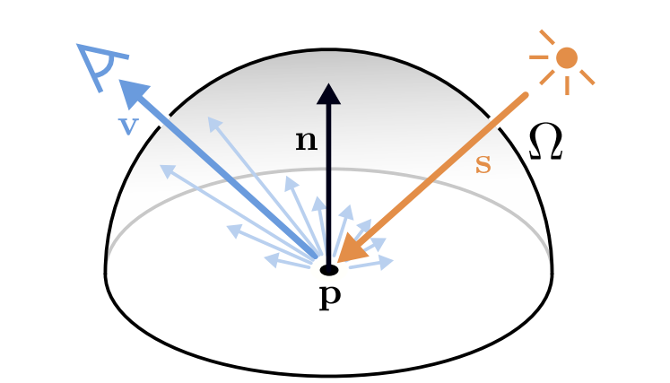
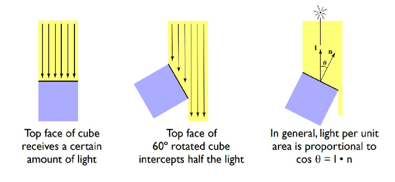
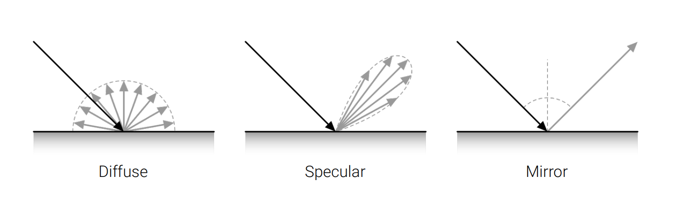
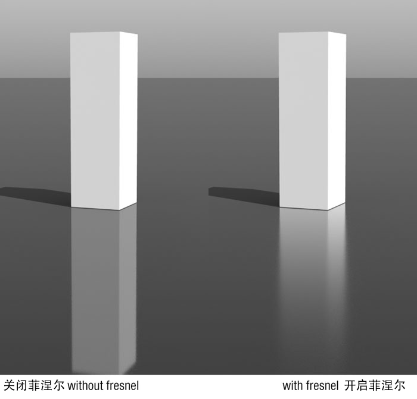
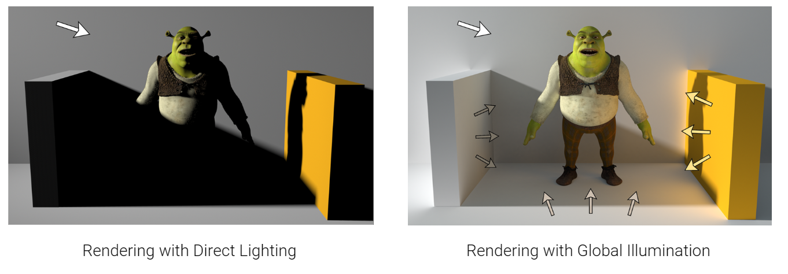
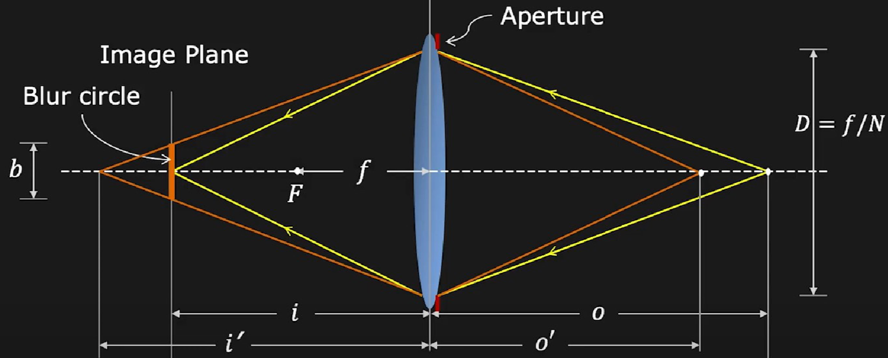
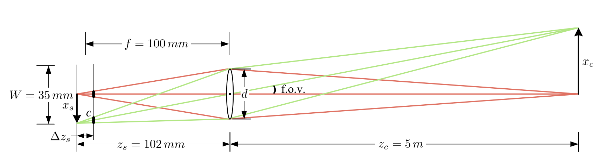
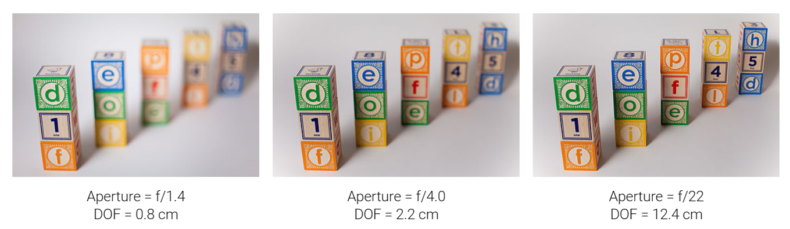

# 2.3 Photometric Image Formation

!!! note "单元概述"
    - 了解BRDF渲染方程。
    - 了解相机镜片的相关知识，以及镜片建模。

## 2.3.1 Rendering Equation

{width=30% align="right"}

记$\mathbf{p} \in \mathbb{R}^3$为3D表面上的一个点，$\mathbf{v} \in \mathbb{R}^3$为视线方向，$\mathbf{s} \in \mathbb{R}^3$为入射光方向，光的波长为$\lambda$。

**渲染方程(rendering equation)**描述了到达$\mathbf{p}$的光$L_{in}$反射到视线方向$\mathbf{v}$的亮度$L_{out}$：

$$L_{out}(\mathbf{p},\mathbf{v},\lambda)=L_{emit}(\mathbf{p},\mathbf{v},\lambda)+\int_{\Omega}BRDF(\mathbf{p},\mathbf{v},\mathbf{s},\lambda)L_{in}(\mathbf{p},\mathbf{s},\lambda)(-\mathbf{n}^T\mathbf{s})d\mathbf{s}$$

!!! note "note"
    - $\Omega$是法线为$\mathbf{n}$的单位半球体。
    - $BRDF$是**双向反射分布函数**(bidirectional reflectance distribution function)，定义了光在不透明表面(opaque surface)上的反射方式，表示从方向$\mathbf{s}$入射的光有多少**比例**会反射到方向$\mathbf{v}$。
    - $L_{emit} > 0$仅对发光表面有效，描述的是点$\mathbf{p}$作为光源自身发出的光，不依赖于外界的入射光。
    - $(-\mathbf{n}^T\mathbf{s})$表示衰减方程(attenuation equation)，其实就是$\mathbf{n}$和$\mathbf{s}$的夹角的余弦值，表示光线与法线的夹角越大，衰减越大。
    ??? question "如何理解光强度与角度的关系"
        首先，这里与其说与角度相关，不如说与单位面积受到的光照强度有关。换句话来说，对于同一束光，倾斜的面上会有更大的面积被照射到，均摊下来单位面积上的光强度就小，或许可以将它理解成类似于“密度”的概念。

        带着这样的想法，再来看这张图，就比较清晰了。

        

### BRDF Components

典型的$BRDF$有**漫反射**(diffuse)和**高光反射**(specular)两个部分：

因为表面不一定是完全光滑的,所以会呈现中间这张高光的效果

漫反射（=恒定/constant）分量将光均匀地向各个方向散射，这会导致阴影，即强度的平滑变化（如下左图）。

高光分量很大程度上取决于出射光方向。（想想塑料的各个角度的效果）

镜面表面在“理想镜面反射”中会反射更多的光。如果你走得更远的话，它就会衰减。

> - The specular component depends strongly on the outgoing light direction.（想想塑料的各个角度的效果）

### BRDF in practice

#### Fresnel Effect

高光反射的强度取决于入射光方向和视线方向之间的夹角。这种现象称为**菲涅尔效应(Fresnel effect)**。

如果表面距离更远，镜面反射的强度会更强，因为视角会改变（水反射的例子）。

??? example "例子"
    === "以水体为例"

        反射效果越弱，水体看起来越透明，像空气；

        反射效果越强，水体看起来越光滑，像镜子。

        

    === "另一个例子"
        看下面两张图，左边的是没有考虑菲涅尔效应的，右边的是考虑了菲涅尔效应的。
        
        
        
        这是解释：

        

#### Global Illumination

对一次光线反射的建模对于渲染复杂场景来说是不够的。光源可能被遮挡，光线可能反弹多次。**全局光照(global illumination)**技术也考虑了间接光照。

## 2.3.2 Camera lenses

!!! question "为什么我们需要摄像机镜头?"
    如果仅仅使用很小的针孔，我们通常无法收集足够的光线。所以无论光圈很大还是很小都会导致图像模糊——平均(averaging) 和衍射(diffraction)。

    

    而小孔需要非常长的快门时间（为了收集光线，但这需要的时间往往造成运动模糊）。镜头系统可以帮助例如缩短快门时间，或者在大针孔的情况下，改变焦距并减少图像模糊。

    {width=50%}

相机使用一个或多个镜头将光线聚集在传感器平面上。值得一提的是，如果 3D 点聚焦了，所有光线都会到达同一个 2D 像素。对于许多应用来说，使用针孔模型对镜头相机进行建模就足够了。然而，为了解决焦点、晕影（vignetting/暗角）和像差（aberration）问题，我们需要对镜头进行建模。

下面是一个典型的镜头系统：

### The thin lens model

通过图中三角形相似的两个式子，我们可以得到：

$$\frac{1}{f}=\frac{1}{z_s}+\frac{1}{z_c}$$

!!! note ""

    - $f$是焦距
    - $z_s$是从镜头到图像平面的距离
    - $z_c$是从镜头到物体平面的距离

具有球面镜头的薄透镜模型经常被用作近似。

性质：平行于轴的光线通过焦点，通过中心的光线保持方向。

从 Snell 定律我们得到 $f=\frac{R}{2(n-1)}$，其中 $R$ 是半径，$n$ 是折射率。

### Depth of Field(景深)

#### F-number

**F 数(F-Number)**用来描述光圈(aperture)的相对大小，其定义式为 $N=\frac{f}{D}$，$D$是镜头通光直径。$D$ 越大，F 数越小，代表光圈越小。

#### Blur circle

如果失焦(out of focus)，那么一个三维点会投影到一个圆盘,这个圆盘称为混淆圆(Blur circle/circle of confusion)。混淆圆是一个小圆盘——如果圆盘大于像素大小,我们就会得到图像模糊!

#### Depth of Field

限制混淆圆 $c$ 的允许深度变化称为景深,它既与聚焦距离又与镜头光圈有关。

!!! note ""
    这里的$\Delta z_s$指的就是景深，是混淆圆前景和后景的距离。

为了控制混淆圆的大小，我们改变镜头光圈的大小（即 F 数）。光圈是光线通过的孔，限制了到达像面的光量。光圈相对( F 数)越小，同距离的混淆圆越小，景深就越大，图像会更清晰，但噪点也增多（因为光子少）。

### Chromatic Aberration(色差)

不同波长的光在同一个介质中的折射率不尽相同。因此,简单透镜会出现色差,也就是不同颜色的光会聚焦在略有不同的距离(造成图像模糊和颜色偏移)。

色差通常可以观察到,特别是在图像边缘区域。为了减少色差和其他种类的像差,大多数摄影镜头是由不同玻璃元件组合而成的复合透镜(具有不同的镀膜)。

### Vignetting(晕影)

晕影是指亮度向图像边缘逐渐降低的现象。晕影是两种效应的组合:自然晕影和机械晕影。

自然晕影:镜头孔径的缩小，物体距离镜头的远近造成（通常边缘地区距离较远，物体在传感器上形成的图像区域会变大,同样的光量需要分散到更大的区域,所以边缘区域的光强会较低）。

机械晕影:上图的阴影部分到达图像的光线弱。

晕影可以校正(也通常这样做)。
