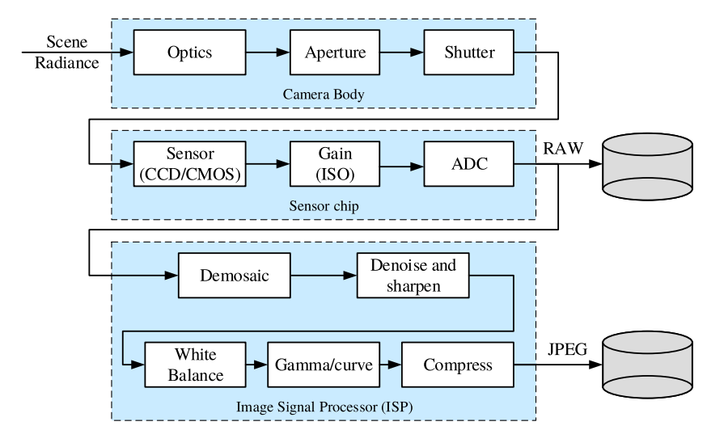
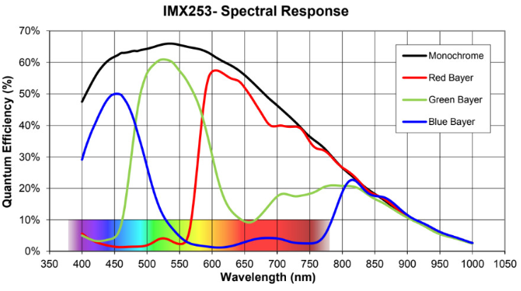

# 2.4 Image Sensing Pipeline

!!! note "单元概述"
    - 对Image Sensing Pipeline中前文未提及的部分加以补充。

## 2.4.0 Introduction

**图像感知管道**(Image Sensing Pipeline)可以分为三个阶段：

- **相机镜头/机身中的物理光传输**(Physical light transport)
    - 光学(Optics) + 光圈(Aperture) + 快门(Shutter)
- **传感器芯片上的光子测量和转换**(Photon measurement and conversion)
    - 传感器(Sensor) + 增益(ISO)(Gain) + 模数转换器(ADC)
- **图像信号处理**(ISP/Image signal processing)和**图像压缩**(Image compression)
    - 去马赛克(Demosaic) + 去噪和锐化(Denoise and sharpen) + 白平衡(White balance) + 伽马/曲线(Gamma/curve) + 压缩(Compress)

## 2.4.1 Shutter

**焦平面快门**(Focal plane shutter)位于图像传感器/胶片前方。大多数数码相机使用机械和电子快门的组合。快门速度(曝光时间)控制着多少光线到达传感器，它决定了图像是否出现过曝(太亮)/曝光不足(太暗)、模糊(比如运动模糊)或噪声。

## 2.4.2 Sensor

图像传感器的两种主要工作原理是CCD和CMOS。

**CCD**通过在像素之间传递电荷,并在输出节点转换为电压。

**CMOS**在每个像素内部完成电荷到电压的转换,这已成为当今的标准。

随着集成电路制造工艺的进步,CMOS相比CCD具有优势。

## 2.4.3 RAW Image

### Color Filter Arrays(CFA/颜色滤波阵列)

为了测量颜色,像素被排列在**颜色阵列**(color array)中,例如: Bayer RGB模式。

??? note "Bayer RGB模式"
    对于彩色图像，需要采集多种最基本的颜色，如rgb三种颜色，最简单的方法就是用滤镜的方法，红色的滤镜透过红色的波长，绿色的滤镜透过绿色的波长，蓝色的滤镜透过蓝色的波长。如果要采集rgb三个基本色，则需要三块滤镜，这样价格昂贵，且不好制造，因为三块滤镜都必须保证每一个像素点都对齐。当用bayer格式的时候，很好的解决了这个问题。bayer 格式图片在一块滤镜上设置的不同的颜色，通过分析人眼对颜色的感知发现，人眼对绿色比较敏感，所以一般bayer格式的图片绿色格式的像素是r和g像素的和。

    另外，Bayer格式是相机内部的原始图片, 一般后缀名为.raw。很多软件都可以查看, 比如PS。我们相机拍照下来存储在存储卡上的.jpeg或其它格式的图片, 都是从.raw格式转化过来的。

    

每个像素的缺失颜色都是从neighbor处插值得到的(去马赛克/demosaicing)。如左图，每个像素只能测量一种颜色，进行插值(小写字母)后得到右图。

每个像素根据其**光谱敏感度**（spectral sensitivity）$S$对入射光线的光谱（light spectrum）$L$进行积分，来整合所有进入的不同波长的光。

光谱响应曲线图显示了传感器对不同波长光的相对敏感度,这些曲线图通常由相机制造商提供。

!!! note "积分例子"

    例如下面这个式子。

    $$\mathbf{R}=\int_{\lambda}L(\lambda)S_R(\lambda)d\lambda$$

    $R$ - 是该像素的红色分量光强

    $L(λ)$ - 是入射光线的光谱分布

    $S_R(λ)$ - 是该像素对红光的相对光谱响应函数

    通过对红光波长范围内的光谱响应积分,可以计算出该像素对红光的光强响应。
    
    同样可以计算该像素对蓝光和绿光的响应B和G。

### Different color spaces

有很多不同的颜色空间，例如

RGB: red, green, blue

L*a*b*: lightness, red-green, blue-yellow

HSV: hue(色调), saturation(饱和度), value(明度)

## 2.4.5 Gamma Compression(伽马压缩)

由于人类对较暗区域的强度差异更为敏感，因此我们经常使用伽马压缩技术。这是指我们在离散化之前对强度或颜色进行非线性变换（左图），并在加载过程中撤销这种变换。

## 2.4.6 Image Compression

- 通常，图像会被压缩成类似于 JPEG 的格式。
- 通常情况下，亮度(luminance)比色度(fidelity)的压缩率更高。
- 通常使用（8 × 8 像素）基于图像块(patch-based)的离散余弦变换（DCT/Discrete Cosine Transform）或小波变换(wavelet transforms)。
- 离散余弦变换是自然图像 PCA 的一种近似方法。其系数被量化为整数，可以用胡克曼编码存储。最近，开发出了基于深度网络的压缩算法（与 DCT 相比，压缩效果大大提高）
