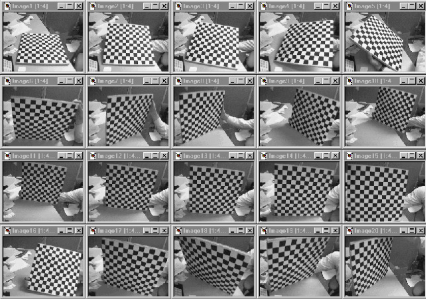
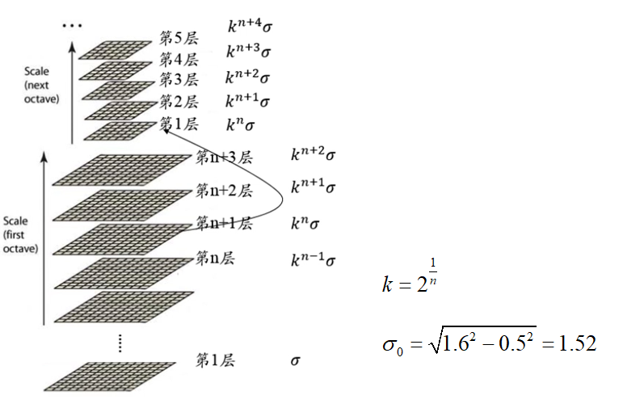
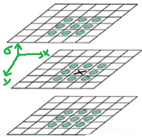
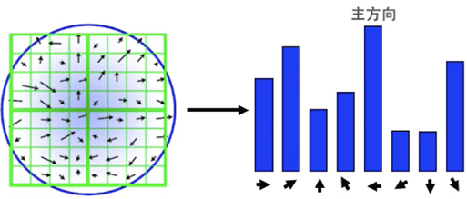
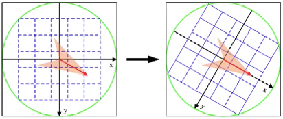
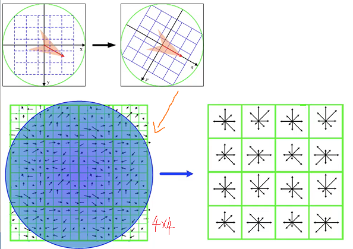
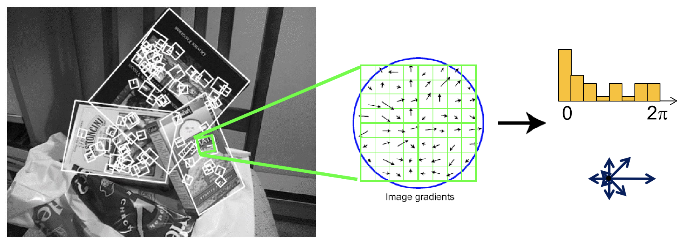

# 3.1 准备工作 | Preliminaries

## 3.1.1 相机标定 | Camera Calibration

为了从 2D 图像集合推断 3D 信息，了解相机设置的**内在参数**(intrinsics)和**外在参数**(extrinsics)是非常重要的。寻找内在和外在参数的过程被称为**相机校准**(camera calibration)。

最常见的是使用**已知的校准目标**，例如图像或棋盘。以下是使用棋盘的示例：

=== "第一步"

    首先，我们以不同的姿势捕捉该目标。

    {width=50%}

=== "第二步"

    然后，在图像中检测角点等特征。

    {width=50%}

=== "第三步"

    最后，对相机内部属性和外部属性（= **姿态/poses**）进行**联合优化(jointly optimized)** :

    - **闭合解(Closed-form solution)** 初始化除 **失真参数(distortion parameters)** 外的所有参数

    - 通过最小化**重投影误差(reprojection errors)**，对所有参数进行**非线性优化(Non-linear optimization)**

    ??? note "什么是闭合解？"
        !!! note "WIKIPEDIA: Closed-form expression"
            “In mathematics, a closed-form expression is a mathematical expression that uses a finite number of standard operations. It may contain constants, variables, certain well-known operations (e.g., + − × ÷), and functions (e.g., nth root, exponent, logarithm, trigonometric functions, and inverse hyperbolic functions), but usually no limit, differentiation, or integration. The set of operations and functions may vary with author and context.”

        其实就是包含有限个标准运算的数学表达式，这里的标准运算包含常量、变量、常见运算（如加、减、乘、除）以及一些函数（如 N次根、指数、对数、三角函数、双曲函数）；但是极限、差分、积分都不能算作标准运算。

---

当然，我们存在多种用于不同设置的校准技术。这些方法不仅在算法上有所不同，而且使用的假设和校准目标的类型也有所不同，例如：2D/3D 目标、平面、消失点(vanishing points)等

## 3.1.2 特征检测与描述 | Feature Detection and Description

### 点特征 | Point Features

图像中的局部显着区域可以通过***点特征***（Point Features，是向量形式）来描述。它们可用于描述和匹配从不同视点拍摄的图像，如下图。

点特征构成了本讲座即将介绍的 ***稀疏三维重建方法(sparse 3D reconstruction methods)*** 的基础。

!!! note "普通特征的劣势"

    作为描述图像的特征，它不应该受到透视效果和照明的影响而发生变化，并且同一点应该具有独立于姿势或视点的相似向量。我们常用的 RGB / Intensity 不具有此属性。举个例子，考虑一幅图像的 RGB 矩阵以及将它旋转 180° 的同一图像，尽管矩阵描述完全相同的点集，但它们将完全不同。所以，我们需要更好的东西！

### 尺度不变特征转换（SIFT）

可以满足我们需求的一种算法是**尺度不变特征转换（SIFT, Scale Invariant Feature Transform）**，这是图像处理领域中的一种局部特征描述算法.

SIFT算法的**实质**是在不同的尺度空间上查找**关键点(特征点)**，并计算出关键点的方向。SIFT所查找到的关键点是一些十分突出，不会因光照，仿射变换和噪音等因素而变化的点，如角点、边缘点、暗区的亮点及亮区的暗点等。

#### 高斯金字塔 | Gaussian pyramid

SIFT 通过使用高斯迭代过滤图像并定期缩小图像来构建**尺度空间(scale space)**。

!!! note "尺度空间"

    我们先来说一下人的眼睛，我们人眼对世界的感知有两种特性：一是近大远小：同一物体，近处看时感觉比较大，远处看时感觉比较小；二是"模糊"：更准确说应该是"粗细"，我们看近处，可以看到物体的细节(人会觉得比较清楚)，比如一片树叶，近看可以看到该树叶的纹理，远处看只能看到该片的大概轮廓(人会觉得比较模糊). 从频率的角度出发，图像的细节(比如纹理，轮廓等)代表图像的高频成分，图像较平滑区域表示图像的低频成分.

    尺度的概念用来模拟观察者距离物体的远近程度，在模拟物体远近的同时，还得考虑物体的粗细程度.

    综上，图像的尺度空间是模拟人眼看到物体的远近程度以及模糊程度.

!!! question "该怎么模拟图像的远近程度？"

    采样法(上采样/UnSampling/放大图像 和 下采样/DownSampling/缩小图像)

    比如一幅图像，对于每一行，隔一个像素点取一个像素点，那么最后得到的图像就是原图像的行和列各1/2. 这属于下采样的一种.

!!! question "该怎么模拟图像的粗细程度"

    采用高斯核对图像进行平滑处理，因为高斯卷积核是实现尺度变换的唯一线性核.

由此，我们构建出了一个尺度空间——**高斯金字塔(Gaussian pyramid)**，如下图所示。

??? note "理论计算"
    其中：

    $$O=[\text{log}_{2}{\text{min}(M, N)}]-3 \tag{1}$$

    式(1)中，$M$ 为原始图像的行高；$N$ 为原始图像的列宽；$O$ 为图像高斯金字塔的组数.

    $$S=n+3 \tag{2}$$

    式(2)中，$n$ 为待提取图像特征的图像数；$S$ 为图像高斯金字塔每组的层数.

    !!! note "$n$所代表的意思"
    
        (1) 假设高斯金字塔每组有$S = 5$层，则高斯差分金字塔就有$S-1 = 4$，
        
        那我们只能在高斯差分金字塔每组的中间2层图像求极值(边界是没有极值的)，
        
        所以$n = 2$

        (2) 假设高斯金字塔每组有$S = 6$层，则高斯差分金字塔就有$S-1 = 5$，
        
        那我们只能在高斯差分金字塔每组的中间3层图像求极值，所以$n = 3$

        (3) 假设高斯金字塔每组有$S = 7$层，则高斯差分金字塔就有$S-1 = 6$，
        
        那我们只能在高斯差分金字塔每组的中间4层图像求极值，所以$n = 4$
    
    为便于计算，我们从0开始记录组数或层数，计算公式如下：
    
    $$\sigma(o,r)=\sigma_{0}2^{o+\frac{r}{n}} \tag{3}
    \\ o\in[0, 1, ..., O-1], r\in[0, 1, ..., n+2]$$

    式(3)中，$o$ 为组索引序号，$r$ 为层索引序号，$\sigma (o, r )$ 为对应的图像的高斯模糊系数.

    $\sigma_{0}$ 为高斯模糊初始值，David G.Lowe 教授刚开始设置为1.6，考虑相机实际已对图像进行σ =0.5的模糊处理，故实际： $\sigma_{0} = \sqrt{1.6^2-0.5^2}=1.52$ .

    通过式(3)，可以计算对应图像金字塔中的高斯模糊系数，如下：

    第0组，第0层：

    $$\sigma(0,0)=\sigma_{0}2^{0+\frac{0}{n}}=\sigma_{0} \tag{4}$$

    第0组，第1层：

    $$\sigma(0,1)=\sigma_{0}2^{0+\frac{1}{n}}=\sigma_{0}2^{\frac{1}{n}} \tag{5}$$

    第0组，第2层：

    $$\sigma(0,2)=\sigma_{0}2^{0+\frac{2}{n}}=\sigma_{0}2^{\frac{1}{n}} 2^{\frac{1}{n}}\tag{6}$$

    ...

    第1组，第0层：

    $$\sigma(1,0)=\sigma_{0}2^{1+\frac{0}{n}}=2\sigma_{0} \tag{7}$$

    第1组，第1层：

    $$\sigma(1,1)=\sigma_{0}2^{1+\frac{1}{n}}=2\sigma_{0} 2^{\frac{1}{n}} \tag{8}$$

    第1组，第2层：

    $$\sigma(1,2)=\sigma_{0}2^{1+\frac{2}{n}}=2\sigma_{0}2^\frac{1}{n} 2^\frac{1}{n} \tag{9}$$

    ...

    第2组，第0层： 
    
    $$\sigma(2,0)=\sigma_{0}2^{2+\frac{0}{S}}=4\sigma_{0} \tag{10}$$

    第2组，第1层： 
    
    $$\sigma(2,1)=\sigma_{0}2^{2+\frac{1}{n}}=4\sigma_{0}2^\frac{1}{n} \tag{11}$$

    第2组，第2层：

    $$\sigma(2,2)=\sigma_{0}2^{2+\frac{2}{n}}=4\sigma_{0}2^\frac{1}{n} 2^\frac{1}{n} \tag{12}$$

    ...

    由上述计算，我们知道

    ① 每一组内，相邻层之间的高斯模糊系统相差 $2^{\frac{1}{n}}$ ；
    
    ② 第0组第0层，第1组第第0层，第2组第0层，....，的高斯模糊系数分别为 $\sigma_{0}$，$2\sigma_{0}$，$4\sigma_{0}$，... ;
    
    ③ 下一组的第0层为上一组倒数第3层降采样所得，无须进行高斯模糊操作.

    总的过程，如图2所示：

    

#### 高斯差分金字塔 | Difference of Gaussian pyramid

创建好图像高斯金字塔后，每一组内的相邻层相减可以得到高斯差分金字塔 (DoG, Difference of Gaussian)，这是后期检测图像极值点的前提。高斯差分滤波器是“斑点检测器(blob detectors)”；兴趣点（blob）被检测为结果尺度空间中的极值。

在高斯差分金字塔中寻找极值点，除了考虑x，y方向的点，还要考虑σ 方向的点，所以判断一个像素点是否为极值点，要与周围的26个点进行比较.

!!! note ""

    注：
    
    ① 如果高斯差分金字塔每组有3层，则只能在中间1层图像寻找极值点，两端的图像不连续，没有极值点.

    ② 如果高斯差分金字塔每组有5层，则只能在中间3层图像寻找极值点.

    依此类推...

下图显示了尺度空间的示例。可以看出，某些特征（例如领带结）在某些尺度下被识别（高强度）。

#### 确定关键点(极值点)方向

在以特征点为圆心、以该特征点所在的高斯图像的尺度的1.5倍为半径的圆内，统计所有的像素的梯度方向及其梯度幅值，并做1.5σ的高斯滤波(高斯加权，离圆心也就是关键点近的幅值所占权重较高).

!!! note ""
    注：在最接近关键点尺度σ的高斯图像上进行统计. 关键点的方向以主方向准.

    当关键点有两个方向，一个主方向，一个辅方向(梯度幅值>=80%主方向梯度幅值)，那么把这个关键点看成两个关键点，只不过这两个关键点的坐标和σ一样，只是方向不一样.

    此时关键点的方向还是离散的，我们需要进行抛物线插值. 

#### 构建关键点描述符

上述过程，只是找到关键点并确定了其方向，但SIFT算法核心用途在于图像的匹配，我们需要对关键点进行数学层面的特征描述，也就是构建关键点描述符.

=== "第一步"

    !!! note "确定计算描述子所需的图像区域"
        
        描述子梯度方向直方图由关键点所在尺度的高斯图像计算产生. 图像区域的半径通过下式(17)计算：

        $$\text{radius} = \frac{3\sigma\sqrt{2}(d+1)+1}{2} \\ 其中：d = 4\tag{17}$$

        注：d=4，代表划分4×4个子块.

=== "第二步"

    !!! note "将坐标移至关键点方向"

        关键点所在的半径区域，移至关键点方向，如图所示： 

        

=== "第三步"

    !!! note "生成关键点描述符"

        如图所示：将区域划分为4×4的子块，对每一子块进行8个方向的直方图统计操作，获得每个方向的梯度幅值，总共可以组成128维描述向量.

        

提取兴趣点后，SIFT 旋转描述符以与主导梯度方向对齐。然后，计算描述符的局部子区域的梯度直方图，将其连接并归一化以形成 128D 特征向量（关键点描述符）。这些操作使描述符对于旋转和亮度变化保持不变。

!!! note ""

    SIFT不再使用像素值，而是使用区域中的梯度的分布作为一个描述，可以表示为一张 $[0,2\pi)$ 的，循环的直方图。此时小的平移和缩放都不会对它产生很大影响，而旋转只会导致直方图的循环平移——不过这种循环平移是很好处理的，比如我们可以选中最大的分量作为参考，并将整个直方图平移对齐。相比直接将像素转化为特征向量， SIFT 鲁棒性更高。

    
