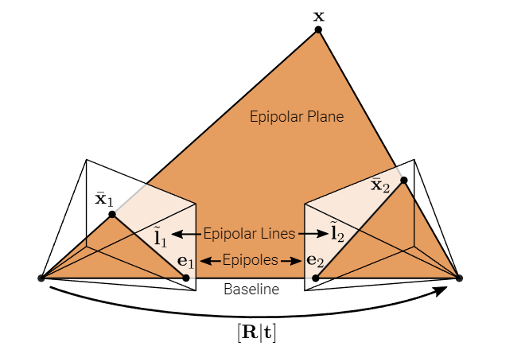
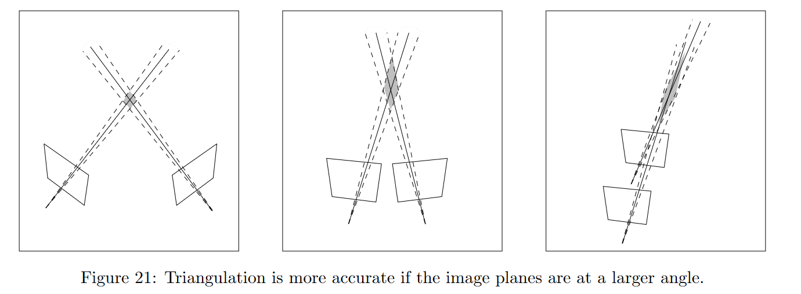

# 3.2 两帧的运动结构恢复 | Two-frame Structure-from-Motion

## 3.2.1 对极几何 | Epipolar Geometry

在两帧的 SfM 中，我们有一个物体的两个不同图像。**目标**是仅根据图像和检测到的特征来恢复物体的 3D 结构以及拍摄图像的相机姿势。

此任务所需的关系由双视图对极几何 (two-view epipolar geometry) 描述，如下图所示。

!!! note ""

    在上图中，旋转矩阵 $\mathbf{R}$ 和平移矢量 $\mathbf{t}$ 表示两个透视摄像机之间的相对姿态。

    一个 3D 点 $\mathbf{x}$ 在图像 1 中投影到像素 $\bar{\mathbf{x}}_1$，在图像 2 中投影到像素 $\bar{\mathbf{x}}_2$。

    3D 点 $\mathbf{x}$ 和两个相机中心构成了**对极平面 (epipolar plane)**，在该平面上也有两个点 $\bar{\mathbf{x}}_1$ 和 $\bar{\mathbf{x}}_2$。

    图像 2 中像素 $\bar{\mathbf{x}}_1$ 的对应点必须位于图像 2 中的**对极线 (epipolar line)** $\tilde{\mathbf{l}}_2$ 上。

    这意味着，如果已知对极平面（即已知 $\mathbf{R}$ 和 $\mathbf{t}$ 以及相机内参），则要找到与 $\bar{\mathbf{x}}_1$ 匹配的点 $\bar{\mathbf{x}}_2$，只需沿着一维搜索空间（对极线 $\tilde{\mathbf{l}}_2$）搜索即可。

    最后，所有对极线都必须通过**对极点 (epipole)**，对极点是图像平面上基线（两个相机中心的连接）通过图像平面的点（该点也可以在无穷远处）。

### 估计对极几何 | Estimating Epipolar Geometry

现在的挑战是——根据两幅图像中检测到的匹配特征来估计外极点几何形状。而这个逆向问题（在知道外极几何图形的情况下匹配特征）是更加困难的。

!!! note "为什么更加困难？"
    在估计基础几何时，我们可以使用匹配特征来计算图像间的基础矩阵或基础矩阵的相关参数。这通常涉及到解线性方程组或使用迭代方法来找到最优解。虽然这仍然是一个复杂的问题，但至少我们有已知的特征点来帮助我们估计几何关系。

    而在逆问题中，我们必须根据已知的基础几何找到匹配的特征点。这需要解决一个更加困难的问题，因为我们需要在已知的几何约束下找到匹配的特征，这可能涉及到非线性优化或其他更为复杂的技术。

所以我们先有匹配到的特征点，然后计算极线几何。

#### 推论 | Corollary

我们假设相机矩阵 $(\mathbf{K}_i \in \mathbb{R}^{3 \times 3})_{i=1}^2$ 已知（例如，通过 Note 3-1 中说的标定得到相机矩阵）。令 $\tilde{\mathbf{x}}_i = \mathbf{K}_i^{-1} \bar{\mathbf{x}}_i$ 表示像素 $\bar{\mathbf{x}}_i$ 在相机 $i$ 中的 **本地射线方向(local ray direction)**。那么我们有：

$$\tilde{\mathbf{x}}_2 \propto \mathbf{x}_2 = \mathbf{R} \mathbf{x}_1 + \mathbf{t} \propto \mathbf{R} \tilde{\mathbf{x}}_1 + s\mathbf{t} $$

???+ note "Local ray direction"

    "Local ray direction"（本地射线方向）是指相机坐标系中的归一化射线方向。在计算机视觉和摄影学中，我们通常使用相机坐标系来描述图像中的点和几何关系。

    相机坐标系通常以相机的光学中心为原点，图像平面为 XY 平面，相机的光轴（光学轴）为 Z 轴。对于给定的像素坐标，其在相机坐标系中的表示是一个三维向量。

    "Local ray direction" 的归一化过程是通过相机内参矩阵（通常表示为 $\mathbf{K}$ 或 $\mathbf{K}^{-1}$）进行的。这个过程将像素坐标映射到相机坐标系中，并保持方向不变，从而得到一个归一化的三维向量，表示射线的方向。

    因此，"local ray direction" 表示的是从相机光学中心出发，通过特定像素点所对应的射线在相机坐标系中的方向。这个方向是归一化的，因此不依赖于具体的图像分辨率或相机内参的尺度。

???+ "像素坐标和相机坐标"
    像素坐标和相机坐标是描述图像中点位置的两种不同坐标系。它们之间的区别主要在于坐标的表示和物理意义。

    1. **像素坐标**：

        表示： 像素坐标通常用图像上的行和列来表示，以整数值表示像素在图像中的位置。通常使用 (x, y) 表示，其中 x 表示列（水平方向），y 表示行（垂直方向）。
      
        物理意义： 像素坐标是图像中的抽象表示，用于标识图像中的离散点。它没有直接的物理单位，只是表示图像上的位置。
    
    2. **相机坐标**：

        表示： 相机坐标是相机坐标系中的表示，通常使用三维坐标 (X, Y, Z) 来表示。相机坐标系以相机的光学中心为原点，图像平面为 XY 平面，相机的光轴为 Z 轴。
        
        物理意义： 相机坐标表示相机中的点的实际三维位置。这种坐标系考虑了物体在相机中的深度信息，允许描述物体的三维位置。

    在计算机视觉中，通常会涉及将像素坐标转换为相机坐标或反之，这涉及到相机的内参（内部参数）和外参（外部参数）。内参矩阵通常用于将像素坐标映射到相机坐标，而外参则描述了相机在世界坐标系中的位置和方向。这些转换是相机标定和几何计算的关键步骤。

!!! note "为什么 $\tilde{\mathbf{x}}_2 \propto \mathbf{x}_2$ ?"

    {width=70%}

    $\tilde{\mathbf{x}}_i$ 和 $\mathbf{x}_i$ 是相机坐标中的同一条射线，所以 $\tilde{\mathbf{x}}_i$ 和 $\mathbf{x}_i$ 是成比例的，即 $\tilde{\mathbf{x}}_i \propto \mathbf{x}_i$，所以 $\tilde{\mathbf{x}}_2 \propto \mathbf{x}_2$。

对上式左叉乘$\mathbf{t}$，得到：

$$\mathbf{t} \times \tilde{\mathbf{x}}_2 \propto \mathbf{t} \times (\mathbf{R} \tilde{\mathbf{x}}_1+ s\mathbf{t}) = \mathbf{t} \times \mathbf{R} \tilde{\mathbf{x}}_1 $$

即：

$$[\mathbf{t}]_\times \tilde{\mathbf{x}}_2 \propto [\mathbf{t}]_\times \mathbf{R} \tilde{\mathbf{x}}_1 $$

对上式左点乘$\tilde{\mathbf{x}}^T_2$，得到：

$$0 = \tilde{\mathbf{x}}^T_2 [\mathbf{t}]_\times \tilde{\mathbf{x}}_2 \propto \tilde{\mathbf{x}}^T_2 [\mathbf{t}]_\times \mathbf{R} \tilde{\mathbf{x}}_1 = \tilde{\mathbf{x}}^T_2 \mathbf{E} \tilde{\mathbf{x}}_1 $$

!!! note "为什么 $0 = \tilde{\mathbf{x}}_2^T [\mathbf{t}]_\times \tilde{\mathbf{x}}_2$ 成立 ?"

    1. $[\mathbf{t}]_\times$ 是反对称矩阵,满足: $[\mathbf{t}]_\times^T = -[\mathbf{t}]_\times$
    
    2. 任意向量$\mathbf{x}$与反对称矩阵$\mathbf{A}$的乘积满足: $\mathbf{x}^T\mathbf{A}\mathbf{x} = 0$
    
        证明:

        $$\begin{align*}
        \mathbf{x}^T\mathbf{A}\mathbf{x} &= (\mathbf{x}^T\mathbf{A}\mathbf{x})^T && (\because \mathbf{x}^T\mathbf{A}\mathbf{x}是一个数)\\
        &= \mathbf{x}^T\mathbf{A}^T\mathbf{x}\\
        &= -\mathbf{x}^T\mathbf{A}\mathbf{x}\\
        &= 0
        \end{align*}
        $$

    因此,有: $0 = \tilde{\mathbf{x}}_2^T [\mathbf{t}]_\times \tilde{\mathbf{x}}_2$

于是我们得到了**对极约束**(epipolar constraint)：

$$\tilde{\mathbf{x}}^T_2 \tilde{\mathbf{E}} \tilde{\mathbf{x}}_1 = 0 $$

这里的 $\tilde{\mathbf{E}} = [\mathbf{t}]_\times \mathbf{R}$ 是**本质矩阵**(essential matrix)。

在 [Note 2-1](../Lec2/Note%202-1%20Primitives%20and%20Transformations.md) 中，我们知道

$$\tilde{\mathbf{x}}_2^T \tilde{\mathbf{l}}_2 = 0 $$

所以我们有： $$\tilde{\mathbf{l}}_2 = \tilde{\mathbf{E}} \tilde{\mathbf{x}}_1 $$

也就是说，$\tilde{\mathbf{E}}$ 将图像 1 中的点 $\tilde{\mathbf{x}}_1$ 映射到图像 2 中的对极线 $\tilde{\mathbf{l}}_2$上。

对上述**对极约束**取转置，以及 $\tilde{\mathbf{x}}_1^T \tilde{\mathbf{l}}_1 = 0$ ，我们还可以得到： 

$$\tilde{\mathbf{l}}_1 = \tilde{\mathbf{E}}^T \tilde{\mathbf{x}}_2 $$

我们将两个极点代入上面对极约束的式子，由于我们只固定一个极点，另一点可以任意取，得到：

$$\tilde{\mathbf{e}}_2^T \tilde{\mathbf{E}} = 0 ,\tilde{\mathbf{E}} \tilde{\mathbf{e}}_1 = 0 $$

!!! note ""
    因此，$\tilde{\mathbf{e}}_2^T$ 和 $\tilde{\mathbf{e}}_1$ 是 $\tilde{\mathbf{E}}$ 的左零空间和右零空间向量。

#### 估计本质矩阵 | Estimating Essential Matrix

现在我们来讨论如何实际估计极线几何关系。我们可以通过 $N$ 对图像对应点形成 $N$ 个齐次方程，利用上述的极线约束，从而恢复本质矩阵 $\tilde{\mathbf{E}}$，这个过程形成了九个 $\tilde{\mathbf{E}}$ 元素的齐次方程组。

$$
\begin{align*}
&&x_1x_2e_{11}& &+& &x_2y_1e_{12}& &+& &x_2e_{13}&\\
&+& x_1y_2e_{11}& &+& &y_1y_2e_{12}& &+& &y_2e_{13}&\\
&+& x_1e_{11}& &+& &y_1e_{12}& &+& &e_{13}& = 0
\end{align*}
$$

因为 $\tilde{\mathbf{E}}$ 是齐次的，我们可以使用奇异值分解来约束尺度。这个算法也被称为**8点算法**，因为要解这个方程组，我们需要8个点（因为 $\tilde{\mathbf{E}}$ 是一个3x3的矩阵，其尺度是不确定的）。然而，本质矩阵实际上只有5个自由度（3个用于旋转矩阵 $R$，2个用于平移方向 $\hat{t}$），所以存在一些算法只需要少于8个点。

注意到一些项是两个图像测量项的乘积，因此会非对称地放大测量噪声。因此，**标准化的8点算法**在计算之前将观测值白化，使其具有零均值和单位方差，并在SVD计算完成后相应地反变换恢复矩阵。

!!! note "白化"
    白化是一种数据预处理技术，其目的是使数据具有特定的统计性质，例如零均值和单位方差。在上下文中，白化通常用于降低数据之间的相关性，并使其更易于处理或分析。

    在对极几何中，提到的白化是为了减少测量噪声的影响，特别是在进行奇异值分解（Singular Value Decomposition，SVD）之前。具体来说，白化的步骤包括：

    **零均值化**： 将数据的均值调整为零，以消除系统偏差。

    **单位方差化**： 将数据的方差调整为单位，以消除尺度效应。

    通过这样的白化过程，可以更有效地进行 SVD，因为白化后的数据更接近满秩矩阵，有助于提高计算的稳定性。在对极几何中，这有助于更准确地估计本质矩阵 $\tilde{\mathbf{E}}$。

    总体来说，白化是一种常见的数据处理技术，用于规范化数据的统计特性，以便更好地适应特定的分析或计算过程。

从 $\tilde{\mathbf{E}}$ 中，我们还可以恢复平移向量 $\mathbf{t}$ 的方向 $\hat{\mathbf{t}}$。只能恢复方向，因为尺度不是唯一确定的。我们有：

$$\hat{\mathbf{t}}^T \tilde{\mathbf{E}} = \hat{\mathbf{t}}^T [\mathbf{t}]_\times \mathbf{R} = 0$$

因此，$\tilde{\mathbf{E}}$ 是奇异的，并且我们得到 $\hat{\mathbf{t}}$ 作为与奇异值 0 相关联的左奇异向量。实际上，由于测量噪声，奇异值可能不会完全为 0，我们选择最小的奇异值。另外两个奇异值大致相等。

!!! note ""

    旋转矩阵 $R$ 也可以计算，参见（Richard Szeliski. Computer Vision: Algorithms and Applications. Springer Science & Business Media, 2010.,Section 11.3 (p. 683)）

#### 基础矩阵 | Fundamental Matrix

到目前为止，我们假设标定矩阵（$K_i \in \mathbb{R}^{3 \times 3}$）对于所有相机 $i=1,2$ 是已知的。在某些情况下，我们既不知道外参数（extrinsics），也不知道内参数（intrinsics）怎么办呢？我们不能使用本地射线方向 $\tilde{\mathbf{x}}_i = \mathbf{K}_i^{-1} \bar{\mathbf{x}}_i$，因为我们只知道像素坐标 $\bar{\mathbf{x}}_i$。本质矩阵变成了：

$$
0 = \tilde{\mathbf{x}}_2^T \tilde{\mathbf{E}} \tilde{\mathbf{x}}_1 = \bar{\mathbf{x}}_2^T \mathbf{K}_2^{-T} \tilde{\mathbf{E}} \mathbf{K}_1^{-1} \bar{\mathbf{x}}_1 = \bar{\mathbf{x}}_2^T \tilde{\mathbf{F}} \bar{\mathbf{x}}_1
$$

其中，$\tilde{\mathbf{F}} = \mathbf{K}_2^{-T} \tilde{\mathbf{E}} \mathbf{K}_1^{-1}$ 被称为**基础矩阵**(fundamental matrix)。

和 $\tilde{\mathbf{E}}$ 一样，$\tilde{\mathbf{F}}$ 在没有噪音的情况下（理论上）是二秩的，并且极点可以以相同的方式恢复。然而，内参数不能直接确定，也就是说，我们只能获得透视重建而不是度量重建。额外的信息，如消失点(vanishing point)、随时间的内参 $\mathbf{K}$ 的不变性、零倾斜(zero skew)或纵横比(aspect ratio )，可以用来将透视重建升级为度量重建。

在下图中，基于估计的极线几何的两幅实际图像的极线显示在图中。请注意，对应的点位于相应的极线上。

!!! note ""

    

    实际图像的极线几何演示。极线以黑色显示。在一幅图像上沿着极线的特征点必须位于另一幅图像上相应的极线上。

#### 三角化 | Triangulation

现在，摄像机的内外参数已知，我们该如何重构三维点呢？原则上，这很简单：我们只需要检查两条射线 $\tilde{\mathbf{x}}_1$ 和 $\tilde{\mathbf{x}}_2$ 的交点，如下图所示。然而，由于测量误差，这两条射线可能不会完全相交。因此，我们希望找到离这两条射线最近的点 $\mathbf{x}$。

!!! note ""
    

设 $\tilde{\mathbf{x}}_i^s = \tilde{\mathbf{P}}_i \tilde{\mathbf{x}}_w$ 表示三维世界点 $\tilde{\mathbf{x}}_w$ 投影到第 $i$ 相机图像上的点 $\tilde{\mathbf{x}}_i^s$。由于两边都是齐次的，它们具有相同的方向但可能在大小上有差异。为了考虑这一点，我们考虑叉乘 $\tilde{\mathbf{x}}_i^s \times \tilde{\mathbf{P}}_i \tilde{\mathbf{x}}_w = 0$。使用 $\tilde{\mathbf{p}}_i^k$ 表示第 $i$ 相机投影矩阵 $\tilde{\mathbf{P}}_i$ 的第 $k$ 行，我们得到：

$$\begin{align*}
&\tilde{\mathbf{x}}_i^s \times \tilde{\mathbf{P}}_i \tilde{\mathbf{x}}_w \\
=& \begin{pmatrix} x_i^s \\ y_i^s \\ 1 \end{pmatrix} \times \begin{pmatrix} \tilde{\mathbf{p}}^T_{i1} \\ \tilde{\mathbf{p}}^T_{i2} \\ \tilde{\mathbf{p}}^T_{i3} \end{pmatrix} \tilde{\mathbf{x}}_w \\
=& \begin{bmatrix} 0 & -1 & y_i^s \\ 1 & 0 & -x_i^s \\ -y_i^s & x_i^s & 0 \end{bmatrix} \begin{pmatrix} \tilde{\mathbf{p}}^T_{i1} \\ \tilde{\mathbf{p}}^T_{i2} \\ \tilde{\mathbf{p}}^T_{i3} \end{pmatrix} \tilde{\mathbf{x}}_w \\
=& \begin{bmatrix} -\tilde{\mathbf{p}}^T_{i2} + y_i^s \tilde{\mathbf{p}}^T_{i3} \\ \tilde{\mathbf{p}}^T_{i1} - x_i^s \tilde{\mathbf{p}}^T_{i3} \\ x_i^s \tilde{\mathbf{p}}^T_{i2} - y_i^s \tilde{\mathbf{p}}^T_{i1} \end{bmatrix} \tilde{\mathbf{x}}_w \\
\end{align*}
$$

由于第三行是第一行和第二行的线性组合，所以第三行可以不用考虑，我们有：

$$
\begin{bmatrix} x_i^s \tilde{\mathbf{p}}^T_{i3} - \tilde{\mathbf{p}}^T_{i1} \\ y_i^s \tilde{\mathbf{p}}^T_{i3} - \tilde{\mathbf{p}}^T_{i2} \end{bmatrix} \tilde{\mathbf{x}}_w = 0
$$

我们记 $\mathbf{A}_i = \begin{bmatrix} x_i^s \tilde{\mathbf{p}}^T_{i3} - \tilde{\mathbf{p}}^T_{i1} \\ y_i^s \tilde{\mathbf{p}}^T_{i3} - \tilde{\mathbf{p}}^T_{i2} \end{bmatrix}$，则有 $\mathbf{A}_i \tilde{\mathbf{x}}_w = 0$。

我们堆叠 $N ≥ 2$ 个对某点的观测，可以得到一个线性系统 $\mathbf{A}\tilde{\mathbf{x}}_w = 0$。由于 $\tilde{\mathbf{x}}_w$ 是齐次的，这导致了一个受限制的最小二乘问题。解决这个问题的方法是找到与矩阵 $\mathbf{A}$ 最小奇异值相对应的右奇异向量。这就是我们在第二讲中已经熟悉的直接线性变换（DLT）。虽然这种方法通常效果良好，但它对透视变换(perspective transformations)不具有不变性。

黄金标准是使用数值方法来最小化重投影误差。

$$
\bar{\mathbf{x}}^*_w=\arg\min_{\bar{\mathbf{x}}_w} \sum_{i=1}^N \left\| \bar{\mathbf{x}}^s_i(\bar{\mathbf{x}}_w)-\bar{\mathbf{x}}^o_i \right\|_2^2
$$

这允许适当地考虑测量噪声。

!!! note ""
    最小值也可以以六次多项式的解的形式得到（参见 R. I. Hartley and A. Zisserman. Multiple View Geometry in Computer Vision. Cambridge University Press, second edition, 2004., Section 12.5）

三角测量 (Triangulation) 的效果取决于相机的相对姿态。这在下图中有所说明。请注意，随着射线变得更加平行（即相机姿态变得更加相似），阴影区域增加。这意味着存在一种权衡关系：相机姿态越接近，特征匹配就越容易，但三角测量就越困难，反之亦然

