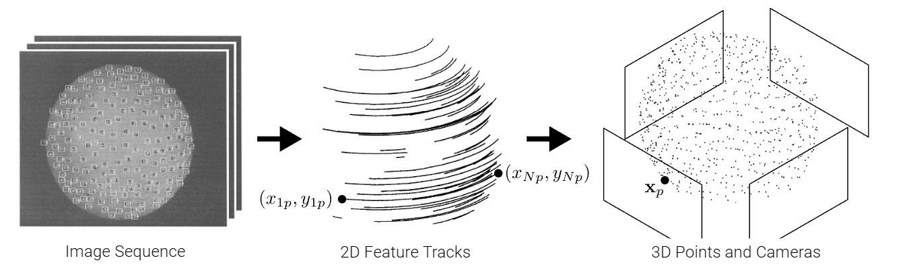

# 3.3 因式分解 | Factorization

!!! note ""
    到目前为止，我们只讨论了使用两个视图来重建三维几何结构。直观上来说，如果我们使用超过两个视图，我们应该能够获得更精确的结果。我们将在本节以及下一节讨论这种方法。

设 $\mathcal{W} = \{(x_{ip}, y_{ip})|i = 1, . . . , N, p = 1, . . . , P\}$ 表示在 $N$ 帧中被跟踪的 $P$ 个特征点。给定 $\mathcal{W}$ 并假设当前的投影为正交投影，我们的目标是恢复相机运动（旋转）和结构（与 $(x_{ip}, y_{ip})$ 对应的三维点 $\mathbf{x_p}$）。我们假设所有特征点在所有帧中都可见。这个设置在下图中进行了可视化。

!!! note ""
    

在正交投影下，3D 点 $\mathbf{x_p}$ 映射到帧 $i$ 中的像素 $(x_{ip}, y_{ip})$，如下所示

{width=50%}

$$x_{ip}= \mathbf{u}^T_i(\mathbf{x}_p-\mathbf{t}_i) $$

$$y_{ip}= \mathbf{v}^T_i(\mathbf{x}_p-\mathbf{t}_i) $$

不失一般性，我们假设三维坐标系统位于中心。

$$\frac{1}{P} \sum_{p=1}^P \mathbf{x}_p = \mathbf{0} $$

设 $(x_{ip}, y_{ip})$ 表示第 $i$ 帧中特征点 $p$ 的二维坐标。将每帧的特征点居中（零均值化/zero-mean），并将它们收集起来形成居中的测量矩阵 $\tilde{\mathbf{W}}$：

$$\tilde{\mathbf{W}} = \begin{bmatrix} \tilde{x}_{11} \cdots \tilde{x}_{1P} \\ \vdots \ddots \vdots \\ \tilde{x}_{N1} \cdots \tilde{x}_{NP} \\ \tilde{y}_{11} \cdots \tilde{y}_{1P} \\ \vdots \ddots \vdots \\ \tilde{y}_{N1} \cdots \tilde{y}_{NP} \end{bmatrix} $$

其中 $\tilde{x}_{ip} = x_{ip} - \frac{1}{P} \sum_{p=1}^P x_{iq}$ and $\tilde{y}_{ip} = y_{ip} - \frac{1}{P} \sum_{p=1}^P y_{iq}$.

!!! note ""

    - Zero-mean(零均值): 让所有训练图像中每个位置的像素均值为 $0$ ，使得像素范围变成 $[-128, 127]$，以 $0$ 为中心。是指变量减去它的均值；
    - 本章中的 ~ 意味着中心化(centered)，而不是homogeneous。

可以推导：

$$\begin{align*}\tilde{x}_{ip} &= x_{ip} - \frac{1}{P} \sum_{p=1}^P x_{iq}\\
&= \mathbf{u}^T_i(\mathbf{x}_p-\mathbf{t}_i) - \frac{1}{P} \sum_{p=1}^P \mathbf{u}^T_i(\mathbf{x}_q-\mathbf{t}_i)\\
&= \mathbf{u}^T_i(\mathbf{x}_p-\mathbf{t}_i) - \mathbf{u}^T_i(\frac{1}{P} \sum_{p=1}^P \mathbf{x}_q-\mathbf{t}_i)\\
&= \mathbf{u}^T_i(\mathbf{x}_p-\mathbf{t}_i) - \mathbf{u}^T_i(\mathbf{0}-\mathbf{t}_i)\\
&= \mathbf{u}^T_i\mathbf{x}_p
\end{align*}$$

对于 $\tilde{y}_{ip}$ ，有

$$\tilde{y}_{ip} = \mathbf{v}^T_i\mathbf{x}_p$$

因此，居中的测量矩阵 $\tilde{W}$ 可以表示为：

$$
\tilde{\mathbf{W} } = \mathbf{R}\mathbf{X} \quad\text{with} \quad\tilde{\mathbf{W} }=\begin{bmatrix} \tilde{x}_{11} \cdots \tilde{x}_{1P}
\\ \vdots \ddots \vdots
\\ \tilde{x}_{N1} \cdots \tilde{x}_{NP}
\\ \tilde{y}_{11} \cdots \tilde{y}_{1P} \\ \vdots \ddots \vdots \\ \tilde{y}_{N1} \cdots \tilde{y}_{NP} \end{bmatrix}, \mathbf{R}=\begin{bmatrix} \mathbf{u}_1^T \\ \vdots \\ \mathbf{u}_N^T \\ \mathbf{v}_1^T \\ \vdots \\ \mathbf{v}_N^T \end{bmatrix}, \mathbf{X}=\begin{bmatrix} \mathbf{x}_1 \cdots \mathbf{x}_P \end{bmatrix}
$$

这里，$\mathbf{R}$ 表示相机运动（旋转），$\mathbf{X}$ 表示三维场景的结构。由于 $\mathbf{R} \in \mathbb{R}^{2N \times 3}$ 和 $\mathbf{X} \in \mathbb{R}^{3 \times P}$，在没有噪音的情况下，居中的测量矩阵 $\tilde{\mathbf{W}}$ 至多具有秩 3。

## SVD 分解

当添加噪音时，矩阵变为满秩（表示为 $\hat{\mathbf{W}}$）。我们可以通过对 $\hat{\mathbf{W}}$ 进行奇异值分解的低秩逼近来恢复秩3的矩阵 $\tilde{\mathbf{W}}$：

$$\hat{\mathbf{W}} = \mathbf{U}\mathbf{\Sigma}\mathbf{V}^T$$

我们通过考虑与前三个奇异值相对应的奇异向量来获得秩 3 分解（其余应该很小，主要为捕捉到的噪声）：

$$\hat{\mathbf{R}}_{2N \times 3} = \mathbf{U}_{2N \times 3}\mathbf{\Sigma}_{3 \times 3}^{\frac{1}{2}}, \hat{\mathbf{X}}_{3 \times P} = \mathbf{\Sigma}_{3 \times 3}^{\frac{1}{2}}\mathbf{V}_{3 \times P}^T$$

该方法最小化了两个矩阵在 Frobenius 范数下的距离 $\left\| \hat{\mathbf{W}} - \tilde{\mathbf{W}} \right\|_F^2$. 同时确保 $\tilde{\mathbf{W}}$ 是秩为 3 的.

> **Frobenius norm** of a matrix $A \in \mathbb{R}^{m \times n}$ is defined as $\|A\|_F = \sqrt{\sum_{i=1}^m \sum_{j=1}^n a_{ij}^2}$

---

## 另一种分解

然而，这种分解并不唯一，因为存在一个矩阵 $\mathbf{Q} \in \mathbb{R}^{3 \times 3}$ 使得
  
$$\hat{\mathbf{W}} = (\hat{\mathbf{R}}\mathbf{Q})(\mathbf{Q}^{-1}\hat{\mathbf{X}})$$

为了找到矩阵 $\mathbf{Q}$ ，我们观察到矩阵 $\mathbf{R}$ 的行是单位向量，且前半部分与后半部分正交。我们得到了度量约束如下：

$$
\begin{align*}
\hat{\mathbf{u}}_i^T \mathbf{Q} (\hat{\mathbf{u}}_i^T \mathbf{Q})^T = 1,\\
\hat{\mathbf{v}}_i^T \mathbf{Q} (\hat{\mathbf{v}}_i^T \mathbf{Q})^T = 1,\\
\hat{\mathbf{u}}_i^T \mathbf{Q} (\hat{\mathbf{v}}_i^T \mathbf{Q})^T = 0
\end{align*}
$$

这为我们提供了矩阵 $\mathbf{Q} \mathbf{Q}^T$ 中条目的一组大规模线性方程，可以使用标准的 Cholesky 分解来从中恢复矩阵 $\mathbf{Q}$。因此，用于恢复相机运动和 3D 结构的最终算法如下：

### Algorithm

1. 对 $\hat{\mathbf{W}}$ 进行测量
2. 计算 SVD $\hat{\mathbf{W}} = \mathbf{U}\mathbf{\Sigma}\mathbf{V}^T$ 并保留前 3 个奇异值
3. 定义 $\hat{\mathbf{R}}_{2N \times 3} = \mathbf{U}_{2N \times 3}\mathbf{\Sigma}_{3 \times 3}^{\frac{1}{2}}, \hat{\mathbf{X}}_{3 \times P} = \mathbf{\Sigma}_{3 \times 3}^{\frac{1}{2}}\mathbf{V}_{3 \times P}^T$
4. 使用度量约束求解 $\mathbf{Q}$
5. 计算 $\mathbf{R} = \hat{\mathbf{R}}\mathbf{Q}$ 和 $\mathbf{X} = \mathbf{Q}^{-1}\hat{\mathbf{X}}$

这个算法的优势在于它非常快速，因为它有一个封闭形式的解（这个解在全局旋转方面是任意的）；没有局部极小值。不足之处在于需要完整的特征轨迹，这意味着它无法处理特征点的遮挡问题。然而，可以通过将此基本算法应用于特征和帧的子集，然后通过一种矩阵完成的方式将信息传播到其他帧来解决此问题。

如上所述，这种方法假设正交性。因此，已经有一些扩展此算法的方法，例如在迭代方式下执行初始正交重建，然后校正透视，或者执行投影分解，迭代更新深度。尽管这些方法不够准确，但分解方法可以为像束调整这样的迭代技术提供良好的初始化。然而，现代的SfM方法（例如COLMAP）通常执行增量式束调整，从精心选择的双视图重建开始，并逐步将新的图像/相机添加到重建中。
