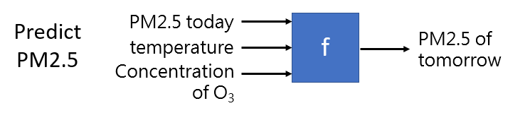
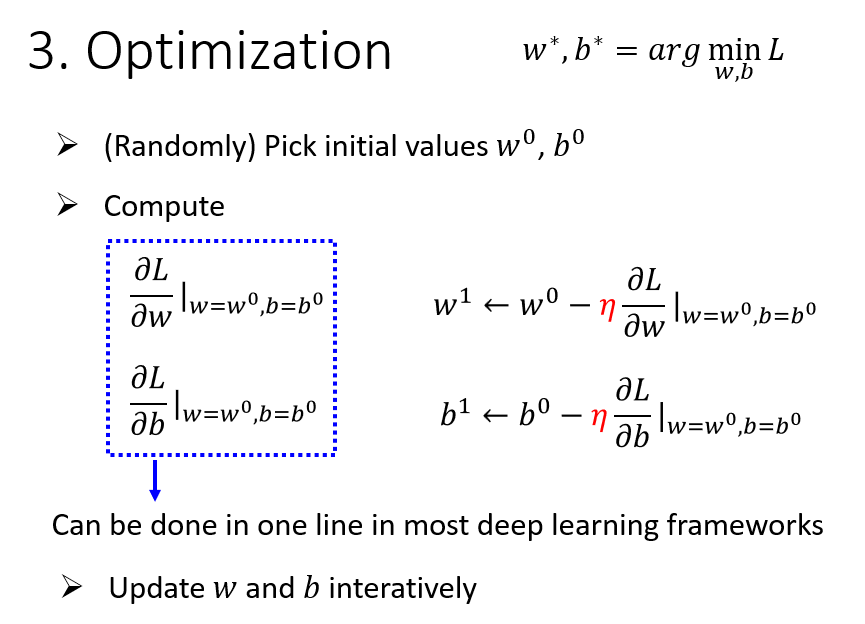
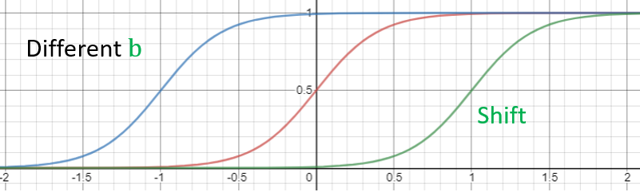
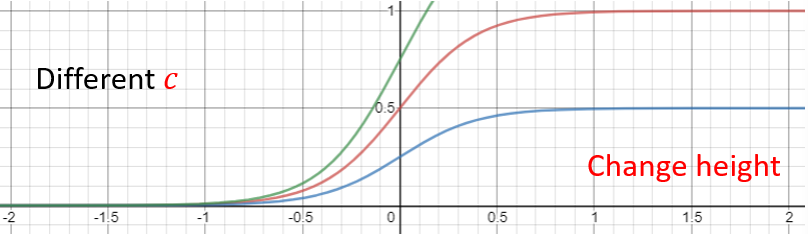
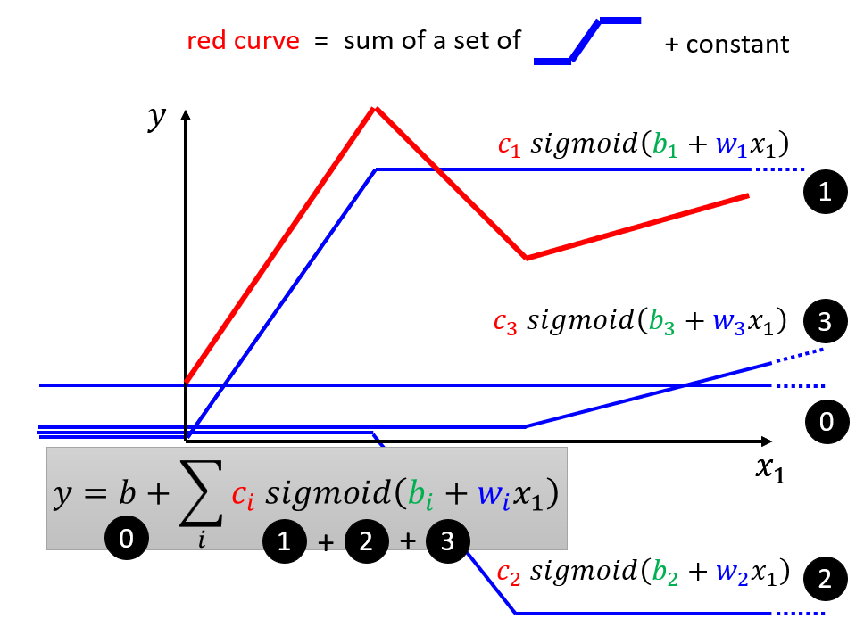
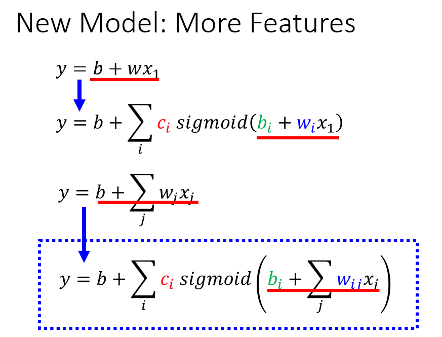
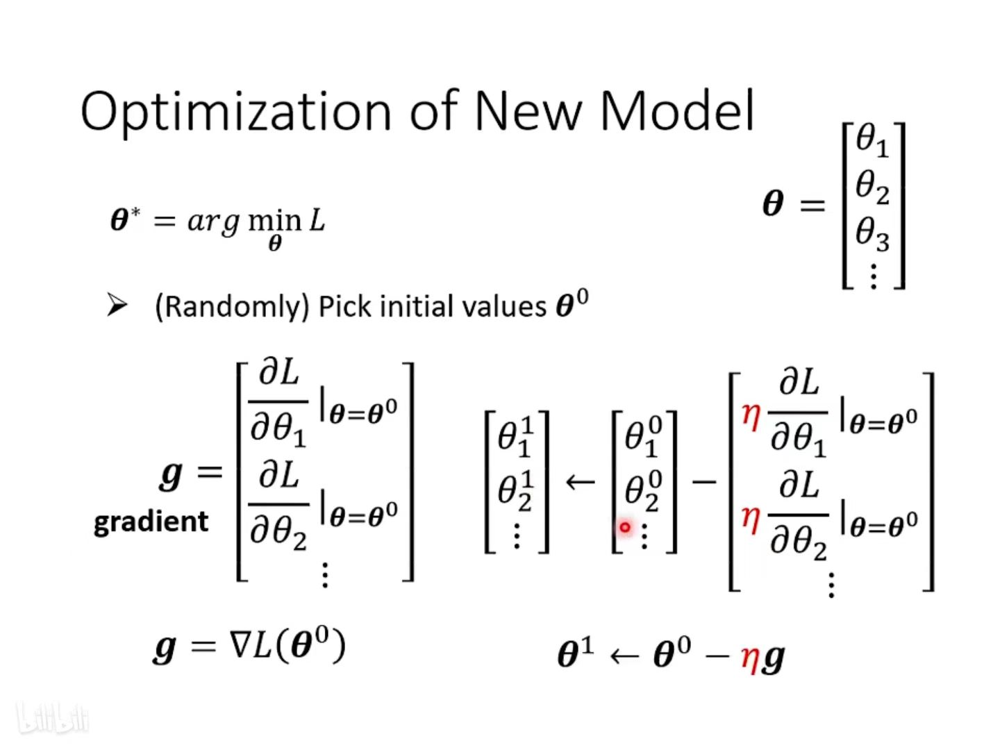
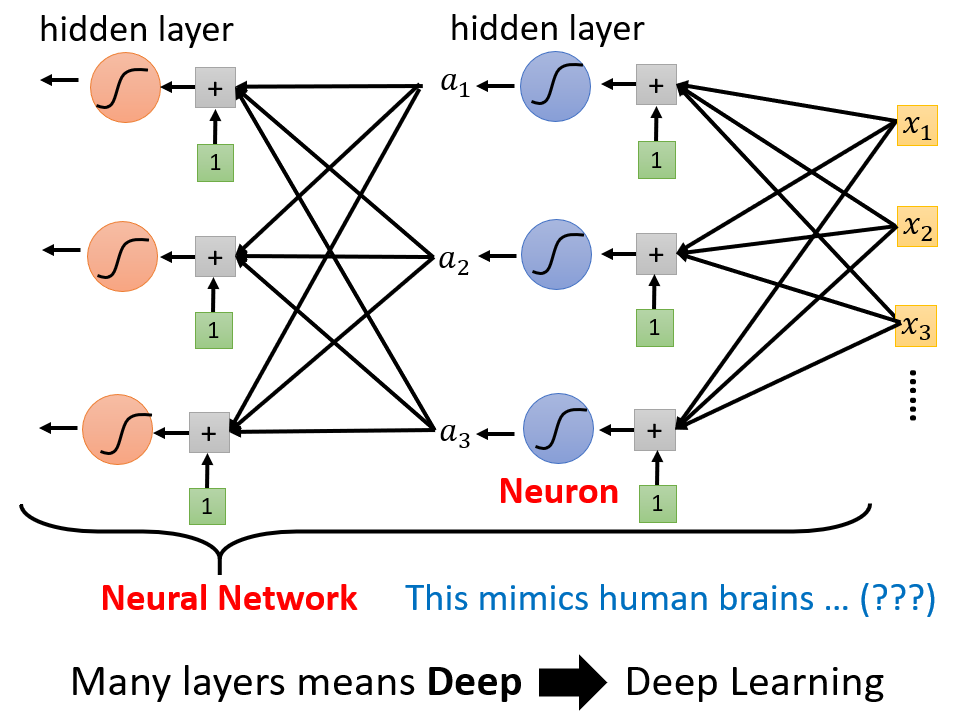

# Introduction of Machine / Deep Learning

## 概念

机器学习可以应用到很多场景中，例如语音识别、图像识别、AI智能下棋等。

它的输入可以是一段声音信号/图片/物体之间的位置关系，数据类型例如：**Vector**、**Matrix**、**Sequence**等。之后通过机器学习寻找一种将输入进行转化为你想要的输出结果的方法，经过这个方法的计算之后得到最终的输出信息，例如：这段声音信号所说的内容、图片中属于什么动物、棋子下一步最佳应该落到什么位置等。

这个寻找Function并进行计算的过程就是机器学习需要完成的工作。

### 机器学习的分类

根据不同的任务从而选择不同函数方法的不同，机器学习可以分为：

**regression**（回归）：模型的输出为**数值**，一般应用于预测房价、温度、空气指数等。例如：输入和目标任务PM2.5相关的feature，经过该模型所设计的方法流程计算后，就能得到预测的明天的PM2.5数值并且输出。寻找这一组方法的过程就是Regression需要完成的任务。

**classification**（分类）：多适用于做选择时，事先给定期望输出的一些类别结果，模型根据输入可以输出对应的**类别**。例如：分类模型能甄别邮件是否为垃圾邮件；下棋中使用分类模型预测下一步落在哪个棋盘格上赢面最大。

**Structured Learning**（结构化学习）：机器在学习的时候不只输出一个数字，不单单做选择题，还要生成**有结构的物件**。也就是让机器学会创造。

### 机器学习的步骤

#### Function with Unknown Parameters

根据 **Domain knowledge**（领域知识，已知的知识），猜测一个能完成任务并带有未知参数的函数。

如果我们假设函数为 $f(x_n)=wx_{n-1}+b$，其中，$x_{n-1}$为待预测的前一已知数值。那么我们就需要找到 $w$ 和 $b$ 的值，这就是机器学习的任务。

其中：

- $w$ 和 $b$ 是 **Parameters**
    - $w$ 是 **Weight**
    - $b$ 是 **Bias**
- $f(x)$ 是 **Model**
- $x_{n-1}$ 在这个例子中是已知的，称之为 **Feature**

#### Loss Function

根据训练资料，定义loss函数，用来衡量函数解和真实情况的差距：

$$L=\frac{1}{N}\sum_{i=1}^{N}e_i$$

记$y_i$为真实值，$\hat{y_i}$为预测值。现在我们使用的计算Loss的方法有以下几种：

- **mean absolute error**（均绝对误差）MAE：$e_i=|y_i-\hat{y_i}|$

- **mean square error**（均方误差）MSE；$e_i=(y_i-\hat{y_i})^2$

- **Cross-entropy**（交叉熵）：当$y$与$\hat{y}$的值都为概率的时候，可以使用。

#### Optimization

我们的目的就是通过不断优化，找到能使loss最小的参数。

其中的一种方法是**Gradient Descent**（梯度下降）。

多元的情况：

### 更复杂的模型

上边的例子中，我们使用的模型是$f(x_n)=wx_{n-1}+b$，这是一个线性模型，但是在实际应用中，我们需要更复杂的、更有弹性的模型。

我们可以将该曲线用多个如下形式的函数来拟合：

对于高阶的函数，我们可以取点构造成上述红线的形式。

#### 蓝线的表示方法-Sigmoid

为了表示蓝线，我们可以使用**Sigmoid**函数，它的定义为：

$$y=c\cdot\frac{1}{1+e^{-(b+wx)}}=c\cdot\text{sigmoid}(b+wx)$$

原蓝线称作**Hard Sigmoid**。

!!! note ""
    为什么不将 hard sigmoid 作为基础函数呢？因为转角处无法求微分，所以要用一个光滑的曲线做基础函数。

    S型曲线中的 $c$、$b$、$w$都是参数，需要机器学出来。

对不同的参数，Sigmoid函数的形状如下：

回到我们的例子中，我们可以使用Sigmoid函数来表示出红线的形状：

往往我们会有多个feature，此时我们可以使用多个Sigmoid函数来表示红线，按照之前的方法，我们可以得到：

##### Function with Unknown Parameters

将起初讨论的仅单变量 $x_1$ 的情况变成多个 feature，其中 $j$ 用来表示 feature 的编号，我们可以得到：

我们将 Sigmoid 函数内的式子记为 $r_i$，则用图形化表示出来为：

具体的计算过程可写作

继续计算Sigmoid函数外的部分，我们最终可以得到：

!!! note ""
    - $\mathbf{x}$ 是 Feature
    - $\mathbf{W}$ 是权重组成的矩阵
    - 绿色框的 $\mathbf{b}$ 为向量，灰色框的 $b$ 为数值
    - $\mathbf{c}$ 为常数组成的向量

$\mathbf{W}$、$\mathbf{b}$、$\mathbf{c}$ 、$b$ 都是未知的参数，我们将其组织成一个向量，记为 $\mathbf{\theta}$，则有：

至此，我们完成了机器学习的第一步：**Function with Unknown Parameters**。

##### Loss Function

计算Loss值的流程依旧和只有两个参数的时候类似，具体步骤如下：

1. 先给定（或随机）一组值（$\mathbf{\theta}$）
2. 代入一种 Feature $\mathbf{x}$ 的值，计算出预测的 $\mathbf{y}$ 值是多少
3. 计算预测出的 $\mathbf{y}$ 值和真实的 label 之间的差距，用 $e$ 来表示
4. 把所有的 $e$ 值相加并求均值，其均值即为该模型的Loss值

##### Optimization

同样类似于之前的方法，我们可以使用梯度下降法来优化模型。

但此时数据集往往很大，为了加快更新速率，一般会把这 $N$ 个数据分成一个一个的**Batch**，也就是对 $N$ 个数据进行分组，设每个Batch中有 $B$ 个数据。

实际操作如下：

1. 先选择一个Batch，用这个Batch 来算其 Loss，计为 $L_1$，根据这个 $L_1$ 来算 Gradient，用这个 Gradient 来更新参数
2. 接下来再选下一个 Batch 算出 $L_2$，根据 $L_2$ 算出 Gradient，然后再更新参数
3. 再取下一个 Batch 算出 $L_3$，根据 $L_3$ 算出 Gradient，再用 $L_3$ 算出来的 Gradient 来更新参数。
4. 重复上述过程，直到所有的 Batch 都被用过一次。

其中，每个 Batch 每更新一次参数的过程为 **update** ，每过完一轮全部的Batch是一次 **Epoch**。

!!! note ""
    假设我们有 $10000$ 个Data，也就是 $N=10000$，设我们的 BatchSize) 是 $10$，则会产生 $\frac{10000}{10} = 1000$ 个 Batch，所以在一个 Epoch 里 Update 参数 $1000$ 次。

#### 蓝线的表示方法-ReLU

我们可以使用 ReLU 函数来表示蓝线，它的定义为：

$$y=c\max(0, b+wx)$$

与 Sigmoid 函数相比，ReLU 函数需要更多的线性组合来表示：

#### 神经网络

Model中的拟合蓝线的方法（Sigmoid\ReLU\...）称为**Neuron**（神经元） ，多个神经元连起来就是**Neural Network**（神经网络）

图中每一层的神经元称为**Hidden layer**（隐藏层）；多个Hidden Layer就体现了**Deep**；以上的整套技术就称为**Deep Learning**（深度学习）

深度学习的层数也不能太多，太多会导致**Overfitting**（过拟合），也就是在训练集上表现的好，但是在测试集上表现差。

