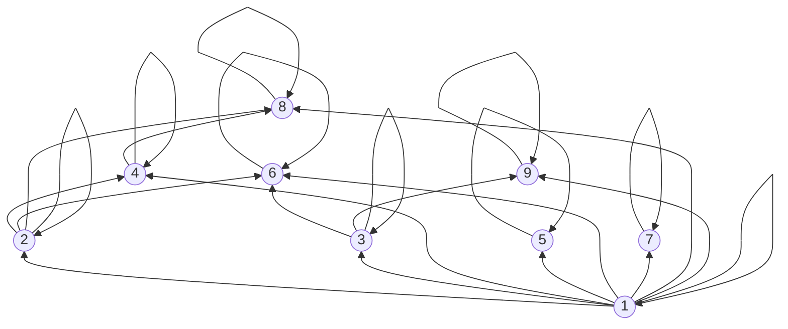
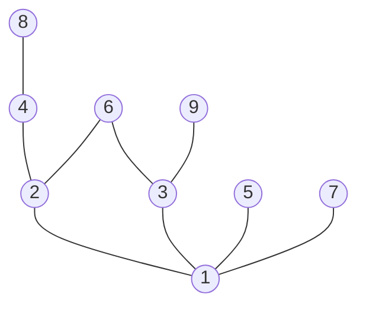
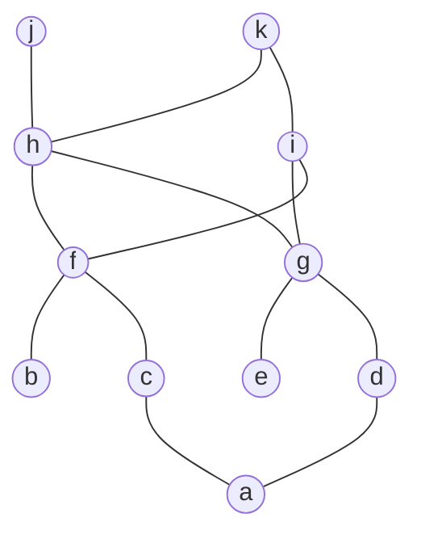

# Chapter 9 - Relations

## Section 1 Relations and Their Properties

### Binary relation

A binary relation $R$ from a set $A$ to a set $B$ is a subset of $A \times B$.
>
> - A binary relation $R$ is a set
> - $R \subseteq A \times B$
> - $R = \{(a, b) | a \in A, b \in B, aRb\}$
>
> Example:
>
> Let $A = \{ 2, 3,4\}$ and $B = \{2,3,4, 5, 6\}$. Then $R = \{(x,y) | x \in A , y \in B , x \text{ divides } y\} = \{(2,2), (2,4), (3,3), (3,6), (4,4), (4,6)\}$
>
### n-ary relation

Let $A_1, A_2, ..., A_n$ be sets. An n-ary relation $R$ from $A_1, A_2, ..., A_n$ is a subset of $A_1 \times A_2 \times ... \times A_n$.

### Relations On A Set

Let $A$ be a set. A relation on $A$ is a subset of $A \times A$.

There are $2^n$ binary relations on a set with $n$ elements.

---

### Properties of Binary Relations

#### Reflexive 自反关系

A binary relation $R$ on a set $A$ is reflexive if $(a, a) \in R$ for every $a \in A$.

$ \forall x(x \in A \rightarrow (x, x) \in R)$

**Matrix**:All the elements on the main diagonal of the matrix of a reflexive relation are 1s.
> $M_R = \begin{bmatrix} 1 &  &  &  \\   & 1 &   & *\\  &   & . & & \\    &* &   &.& \\  &  &  & &1 \end{bmatrix}$
>
**Digraph**: There is a loop at every vertex of a reflexive relation.

#### Irreflexive 非自反关系

A binary relation $R$ on a set $A$ is irreflexive if $(a, a) \notin R$ for every $a \in A$.

$ \forall x(x \in A \rightarrow (x, x) \notin R)$

**Matrix**: All the elements on the main diagonal of the matrix of an irreflexive relation are 0s.

> $M_R = \begin{bmatrix} 0 &  &  &  \\   & 0 &   & *\\  &   & . & & \\    &* &   &.& \\  &  &  & &0 \end{bmatrix}$

**Digraph**: There is no loop at any vertex of an irreflexive relation.

#### Symmetric 对称关系

A binary relation $R$ on a set $A$ is symmetric if $(b, a) \in R$ whenever $(a, b) \in R$ for all $a, b \in A$.

$ \forall x \forall y((x, y) \in R \rightarrow (y, x) \in R)$

**Matrix**: If $M_R$ is the matrix of a symmetric relation, then $M_R = M_R^T$.
> Example: $M_R = \begin{bmatrix} 0 & 1 & 0 & 0 \\ 1 & 1 & 0 & 0 \\ 0 & 0 & 0 & 1 \\ 0 & 0 & 1 & 0 \end{bmatrix}$, $M_R^T = \begin{bmatrix} 0 & 1 & 0 & 0 \\ 1 & 1 & 0 & 0 \\ 0 & 0 & 0 & 1 \\ 0 & 0 & 1 & 0 \end{bmatrix}$

**Digraph**: If there is an edge from vertex $u$ to vertex $v$ in a symmetric relation, then there is an edge from vertex $v$ to vertex $u$.

#### Antisymmetric 反对称关系

A binary relation $R$ on a set $A$ is antisymmetric if $(a, b) \in R$ and $(b, a) \in R$ imply that $a = b$ for all $a, b \in A$.

$ \forall x \forall y((x, y) \in R \land (y, x) \in R \rightarrow x = y)$

**Matrix**: If $M_R$ is the matrix of an antisymmetric relation, then $M_R \land M_R^T$ is a matrix with 0 or 1 on the main diagonal and 0s everywhere else.
> Example: $M_R = \begin{bmatrix} 0 & 1 & 0 & 0 \\ 0 & 1 & 0 & 0 \\ 0 & 1 & 0 & 1 \\ 0 & 0 & 0 & 0 \end{bmatrix}$, $M_R \land M_R^T = \begin{bmatrix} 0 & 0 & 0 & 0 \\ 0 & 1 &0 & 0 \\ 0 & 0 & 0 & 0 \\ 0 & 0 & 0 & 0 \end{bmatrix}$

**Digraph**: If there is an edge from vertex $u$ to vertex $v$ in an antisymmetric relation, then there is no edge from vertex $v$ to vertex $u$ unless $u = v$.

One relation can be both symmetric and antisymmetric. For example, the relation $R = \{(a, a), (b, b), (c, c)\}$ is both symmetric and antisymmetric.

#### Asymmetric 非对称关系

A binary relation $R$ on a set $A$ is asymmetric if $(a, b) \in R$ and $(b, a) \in R$ imply that $a \neq b$ for all $a, b \in A$.

$ \forall x \forall y((x, y) \in R \land (y, x) \in R \rightarrow x \neq y)$

**Matrix**: If $M_R$ is the matrix of an asymmetric relation, then $M_R \land M_R^T$ is a matrix with 0s on the main diagonal and 0s everywhere else.
> Example: $M_R = \begin{bmatrix} 0 & 1 & 0 & 0 \\ 0 & 0 & 0 & 0 \\ 0 & 1 & 0 & 1 \\ 0 & 0 & 0 & 0 \end{bmatrix}$, $M_R \land M_R^T = \begin{bmatrix} 0 & 0 & 0 & 0 \\ 0 & 0 &0 & 0 \\ 0 & 0 & 0 & 0 \\ 0 & 0 & 0 & 0 \end{bmatrix}$

**Digraph**: If there is an edge from vertex $u$ to vertex $v$ in an asymmetric relation, then there is no edge from vertex $v$ to vertex $u$.

#### Transitive 传递关系

A binary relation $R$ on a set $A$ is transitive if $(a, b) \in R$ and $(b, c) \in R$ imply that $(a, c) \in R$ for all $a, b, c \in A$.

$ \forall x \forall y \forall z((x, y) \in R \land (y, z) \in R \rightarrow (x, z) \in R)$

**Matrix**: If $M_R$ is the matrix of a transitive relation, then $M_R^2 \subseteq M_R$.
> Example: $M_R = \begin{bmatrix} 0 & 1 & 0 & 0 \\ 0 & 1 & 0 & 0 \\ 0 & 1 & 0 & 1 \\ 0 & 0 & 0 & 0 \end{bmatrix}$, $M_R^2 = \begin{bmatrix} 0 & 1 & 0 & 0 \\ 0 & 1 & 0 & 0 \\ 0 & 1 & 0 & 1 \\ 0 & 0 & 0 & 0 \end{bmatrix}$

**Digraph**: If there is a path from vertex $u$ to vertex $v$ and a path from vertex $v$ to vertex $w$ in a transitive relation, then there is a path from vertex $u$ to vertex $w$.

---

### The logical operations of matrices

Let $M_{R_1} = [c_{ij}]$ and $M_{R_2} = [d_{ij}]$ be the matrices of relations $R_1$ and $R_2$ , the following are the matrices of the logical operations of $R_1$ and $R_2$.
> **Union**: $M_{R_1 \cup R_2} = [c_{ij} \lor d_{ij}]$
>
> **Intersection**: $M_{R_1 \cap R_2} = [c_{ij} \land d_{ij}]$
>
> **Difference**: $M_{R_1 - R_2} = [c_{ij} \land \neg d_{ij}]$
>
> **Complement**: $M_{\overline{R_1}} = [\neg c_{ij}]$

#### Inverse Relations

Let $R$ be a relation from a set $A$ to a set $B$. The inverse of $R$, denoted by $R^{-1}(R^{C})$, is the relation from $B$ to $A$ such that $(b, a) \in R^{-1}$ if and only if $(a, b) \in R$.
> More formally, $R^{-1} = \{(b, a) \mid (a, b) \in R\}$.
>
> Matrix of $R^{-1}$ is $M_{R^{-1}} = M_R^T$.

#### Composition of Relations

Let $R$ be a relation from a set $A$ to a set $B$ and let $S$ be a relation from $B$ to a set $C$. The composition of $R$ and $S$, denoted by $S \circ R$, is the relation from $A$ to $C$ such that $(a, c) \in S \circ R$ if and only if there is an element $b \in B$ such that $(a, b) \in R$ and $(b, c) \in S$.
> More formally, $S \circ R = \{(a, c) \mid \exists b \in B((a, b) \in R \land (b, c) \in S)\}$.
>
> Matrix of $S \circ R$ is $M_{S \circ R} = M_R \cdot M_S$.
>
> 注意：$M_{S \circ R} \neq M_S \cdot M_R$.

---

## Section 2 Closure of Relations

### Closure of Relations

Definition: Let $R$ be a relation on a set $A$. A relation $S$ on $A$ is said to be a closure of $R$ if $R \subseteq S$ and $S$ has a certain property $P$ that $R$ does not necessarily have. The closure of $R$ with respect to property $P$ is the intersection of all relations on $A$ that contain $R$ and have property $P$.

人话：$R$的关于性质$P$的闭包是包含$R$且具有性质$P$的最小关系。
> How to proof a relation is the closure of another relation?
>
> 1. contain $R$.
> 2. have property $P$.
> 3. is the smallest set that contain $R$ and have property $P$.

#### Reflexive Closure

Let $R$ be a relation on a set $A$. The reflexive closure of $R$, denoted by $r(R)$, is the union of $R$ and the identity relation on $A$.
> More formally, $r(R) = R \cup I_A$, where  $I_A = \{(a, a) \mid a \in A\}$.
>
> Matrix of $r(R)$ is $M_{r(R)} = M_R \lor I_A$.
>
> Digraph of $r(R)$ is the digraph of $R$ with a loop at each vertex.
>

#### Symmetric Closure

Let $R$ be a relation on a set $A$. The symmetric closure of $R$, denoted by $s(R)$, is the union of $R$ and $R^{-1}$.
> More formally, $s(R) = R \cup R^{-1}$.
>
> Matrix of $s(R)$ is $M_{s(R)} = M_R \lor M_R^T$.
>
> Digraph of $s(R)$ is the digraph of $R$ adding an edge from vertex $v$ to vertex $u$ whenever there is an edge from vertex $u$ to vertex $v$.
>

#### Transitive Closure

Let $R$ be a relation on a set $A$. The transitive closure of $R$, denoted by $t(R)$, is the smallest transitive relation on $A$ that contains $R$.
> **Theorem**: Let $R$ be a relation on a set $A$. There is a path of length $n$ from $a$ to $b$ if and only if $(a, b) \in R^n$.

$R^{*}$ ,*the connectivity relation* , is the set of all ordered pairs $(a, b)$ such that there is a path from $a$ to $b$ in the digraph of $R$.

> More formally, $t(R) =R^{*} =  \bigcup_{i=1}^{\infty} R^i$.
>
> Matrix of $t(R)$ is $M_{t(R)} = M_R \lor M_R^2 \lor M_R^3 \lor \cdots$, until $M_R^n = M_R^{n+1}$.
>

***Warshall's Algorithm***:
> $W = [w_{ij}]$

``` c
for (k = 1 ;k <= n; k++)
{
    for (i = 1; i <= n; i++)
    {
        for (j = 1; j <= n; j++)
        w_{ij} = w_{ij} ∨ (w_{ik} ∧ w_{kj});
    }
}
```

The complexity of Warshall's algorithm is $O(n^3)$.

计算方法：关于k，新元素=元素+同列第k行的元素$*$同行第k列的元素.

## Section 3 Equivalence Relations

### Equivalence Relations

Definition: A relation $R$ on a set $A$ is an equivalence relation if $R$ is

- reflexive
- symmetric
- transitive

$a$ and $b$ are equivalent if $(a, b) \in R$, denoted by $a \sim b$.

> Example: The similarity relation on the set of all triangles in the plane is an equivalence relation.

#### Equivalence Classes

Definition: Let $R$ be an equivalence relation on a set $A$. The equivalence class of an element $a \in A$ is the set of all elements in $A$ that are equivalent to $a$.
> More formally, $[a] = \{x \in A \mid x \sim a\}$.
>> Example:Congruence Modulo $3$.
>>
>> [0] = $\{\cdots, -6, -3, 0, 3, 6, \cdots\}$
>>
>> [1] = $\{\cdots, -5, -2, 1, 4, 7, \cdots\}$
>>
>> [2] = $\{\cdots, -4, -1, 2, 5, 8, \cdots\}$
>
> The set of all equivalence classes of $R$ is denoted by $A/R$.

#### Partition of a Set

Definition: A partition of a set $A$ is a collection of nonempty subsets of $A$ such that every element of $A$ is in exactly one of these subsets.
>
> - $A_i \cap A_j = \emptyset$ for $i \neq j$.
> - $\forall a \in A, \exists i such that a \in A_i$.
> - $A_i \neq \emptyset$ for all $i$.

Notation: $pr(A)=\{A_1, A_2, \cdots, A_n\}$ is a partition of $A$.

#### Equivalence Relations and Partitions

**Theorem**: Let $R$ be an equivalence relation on a set $A$. The following are equivalent:
>
> 1. $aRb$
> 2. $[a] = [b]$
> 3. $[a] \cap [b] \neq \emptyset$

**Theorem**: Let $R$ be an equivalence relation on a set $A$. Then $A/R$ is a partition of $A$.

Q:If $|A| = n$, the $p(n)=$? $p(n)$ is the number of different equivalence relations on a set with $n$ elements.

A: $p(n) = S(n,1) + S(n,2) + \cdots + S(n,n)$, where $S(n,k)$ is the Stirling number of the second kind.

#### Operations on Equivalence Relations

If $R1$, $R2$ are equivalence relations on a set $A$.

- $R1 \cap R2$ is an equivalence relation on $A$.
- $R1 \cup R2$ is a reflexive and symmetric relation on $A$.
- $(R1 \cup R2)^{*}$ is an equivalence relation on $A$.

### Partial Orderings

Definition: A relation $R$ on a set $A$ is a partial ordering if $R$ is

- reflexive
- antisymmetric
- transitive
  
和等价关系的区别：等价关系是对称的，而偏序关系是反对称的。

Notation: $(A, R)$ is a partially ordered set (**poset**).

> Example: $(\mathbb{Z}, \leq)$ is a poset.

Notation:

 $a \preceq b$ means $(S,R)$ is a poset and $(a, b) \in R$.

 $a \prec b$ means $a \preceq b$ and $a \neq b$.

**Comparability**: $a$ and $b$ are comparable if $a \preceq b$ or $b \preceq a$.

**Totally ordered set**: If every two elements of a poset are comparable, then the poset is called a totally ordered set or a chain.

> Example: $(\mathbb{Z}, \leq)$ is a totally ordered set.
>
> Example: $(\mathbb{Z}^+, |)$ is a poset but not a totally ordered set.

**Well-ordered set**: A poset $(S, \preceq)$ is a well-ordered set if  it is a totally ordered set and every nonempty subset of $S$ has a least element.
> Example: $(\mathbb{N}, \leq)$ is a well-ordered set.

**The principle of well-ordering induction**:

假设$S$是一个非空的well-ordered set，如果$P(x)$是一个关于$x \in S$的命题，且满足：对所有的$x \in S$，如果$P(y)$对所有的$y \prec x$都成立，则$P(x)$成立。那么$P(x)$对所有的$x \in S$都成立。

**Lexico-graphic order**: Let $R_1$ and $R_2$ be partial orderings on sets $A_1$ and $A_2$, respectively. The lexicographic order on $A_1 \times A_2$ is the partial ordering $R$ such that $(a_1, a_2) \preceq (b_1, b_2)$ if and only if either $a_1 \prec b_1$ or $a_1 = b_1$ and $a_2 \preceq b_2$.

**Theorem**: Let $R_1$ and $R_2$ be partial orderings on sets $A_1$ and $A_2$, respectively. The lexicographic order on $A_1 \times A_2$ is a partial ordering.

### Hasse Diagrams

**Hasse diagram**: A Hasse diagram of a poset $(S, \preceq)$ is a digraph such that the vertices of $D$ correspond to the elements of $S$ and there is an edge from vertex $x$ to vertex $y$ if and only if $x \prec y$ and there is no element $z$ such that $x \prec z \prec y$.

没有箭头，没有环，没有重复的边。

> Example: $A=\{1,2,3,4,5,6,7,8,9\}$, $R=\{(a,b) \mid a \text{ | } b, a,b \in A\}$, $D$ is the Hasse diagram of $(A,R)$.

original digraph:



Hasse diagram:



**Maximal element**: An element $a$ of a poset $(S, \preceq)$ is a maximal element if there is no element $b \in S$ such that $a \prec b$.

**Minimal element**: An element $a$ of a poset $(S, \preceq)$ is a minimal element if there is no element $b \in S$ such that $b \prec a$.

**Greatest element**: An element $a$ of a poset $(S, \preceq)$ is a greatest element if $a \preceq b$ for all $b \in S$.

**Least element**: An element $a$ of a poset $(S, \preceq)$ is a least element if $b \preceq a$ for all $b \in S$.

> In the last example, $8,6,9,5,7$ are maximal elements, $1$ is a minimal element, there is no the greatest element, $1$ is the least element.

**Upper bound**: Let $S$ be a poset and let $A$ be a subset of $S$. An element $b \in S$ is an upper bound of $A$ if $a \preceq b$ for all $a \in A$.

**Least upper bound**: Let $S$ be a poset and let $A$ be a subset of $S$. An element $b \in S$ is a least upper bound of $A$ if $b$ is an upper bound of $A$ and $b \preceq c$ for every upper bound $c$ of $A$. The least upper bound of $A$ is denoted by $lub(A)$.

**Lower bound**: Let $S$ be a poset and let $A$ be a subset of $S$. An element $b \in S$ is a lower bound of $A$ if $b \preceq a$ for all $a \in A$.

**Greatest lower bound**: Let $S$ be a poset and let $A$ be a subset of $S$. An element $b \in S$ is a greatest lower bound of $A$ if $b$ is a lower bound of $A$ and $c \preceq b$ for every lower bound $c$ of $A$. The greatest lower bound of $A$ is denoted by $glb(A)$.

此时是对于集合而言的，而不是对于元素而言的。

只要求小于等于，所以该集合中的元素可以是集合的上界，也可以是集合的最小上界。

> Example: $S=\{a,b,c,d,e,f,g,h,i,j,k\}$,$A=\{a,b,c,d,e,f,g\}$, $A^{\prime}={h,i,j,k}$



> the upper bounds of $A$ : $h,i,j,k$.
>
> the lower bounds of $A$ : $/$ .
>
> the upper bounds of $A^{\prime}$ : $/$ .
>
> the lower bounds of $A^{\prime}$ : $a,b,c,d,e,f,g$ .
>
> lub and glb of $A$ : $/$ .
>
> lub and glb of $A^{\prime}$ : $/$ .

### Lattices

**Lattice**: A poset $(S, \preceq)$ is a lattice if every two elements of $S$ have a least upper bound and a greatest lower bound.
Every totally ordered set is a lattice.
> Example: $(\mathbb{Z}, \leq)$ is a lattice.
>> lub: the larger one.
>>
>> glb: the smaller one.
>
> Example: $(\mathbb{Z}^+, |)$ is a lattice.
>> lub: the least common multiple.
>>
>> glb: the greatest common divisor.
>
> Example: $(P(S), \subseteq)$ is a lattice.
>> lub: the union.
>>
>> glb: the intersection.

### Topological Sortings

拓扑排序：对于一个有向无环图，将所有的顶点排成一个序列，使得对于每一条边$(u,v)$，$u$在序列中都在$v$的前面。
